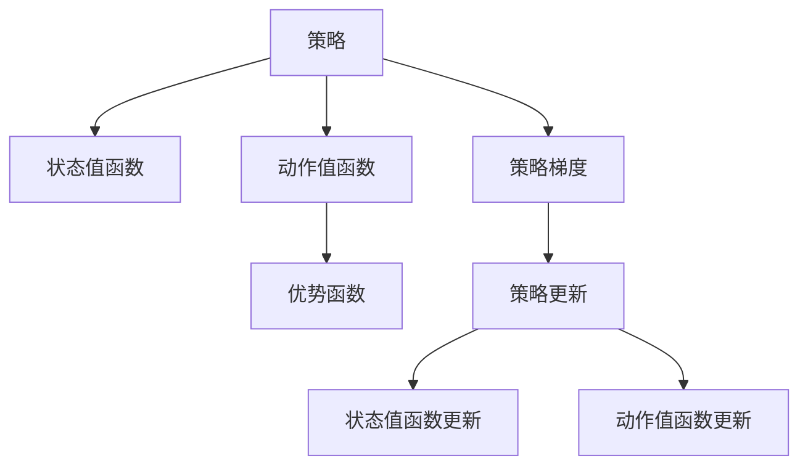
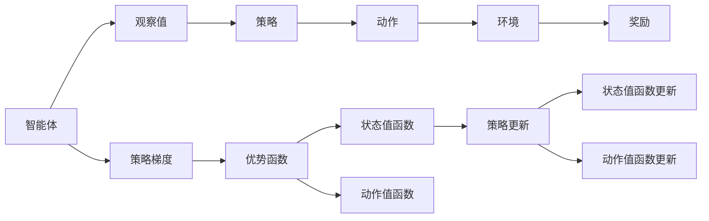

                 

# 强化学习Reinforcement Learning中的策略梯度方法详解

> 关键词：强化学习,策略梯度方法, 策略优化, 价值函数, 优势函数, 策略更新, 经验回放

## 1. 背景介绍

### 1.1 问题由来
强化学习(Reinforcement Learning, RL)是一种智能体(Agent)在与环境交互中学习最优策略的机器学习方法。传统的强化学习算法主要包括基于值的算法（如Q-learning）和基于策略的算法（如策略梯度算法）。其中，策略梯度算法直接优化策略函数，使得智能体能够更准确地做出决策。

但直接优化策略函数在理论和实践中都存在困难。具体来说，策略梯度的计算涉及对轨迹的积分，难以直接计算和优化。这使得传统的策略梯度算法难以处理复杂的环境，且收敛性差、不稳定。

为解决这些问题，策略梯度方法提出了多种改进策略，如Policy Gradient Methods（PG方法）、Trust Region Policy Optimization（TRPO）、Proximal Policy Optimization（PPO）等，显著提升了策略梯度方法的性能和鲁棒性。这些改进算法在解决连续动作空间（如机器人控制）、高维动作空间（如游戏AI）等问题时，取得了显著的效果。

### 1.2 问题核心关键点
策略梯度方法的核心在于如何高效、稳定地优化策略函数。具体来说，需要解决以下问题：
1. 如何估计策略梯度，即在给定观察值$o_t$下，如何计算策略对奖励的导数。
2. 如何避免梯度消失或爆炸，即如何控制策略更新的大小和方向。
3. 如何提高策略更新的效率，即如何在计算资源有限的情况下，最大化策略更新效果。
4. 如何处理多智能体和异构环境，即如何在一个复杂、变化的环境中进行策略优化。

### 1.3 问题研究意义
策略梯度方法在强化学习中的地位举足轻重。它不仅为智能体提供了更直接、更可解释的策略优化途径，还为复杂的非线性策略优化提供了有效工具。通过改进和创新，策略梯度方法已经广泛应用于机器人控制、自动驾驶、游戏AI、金融交易等领域，推动了人工智能技术在实际应用中的落地。

## 2. 核心概念与联系

### 2.1 核心概念概述

为更好地理解策略梯度方法，我们需要首先介绍几个核心概念：

- 策略(Strategy)：智能体在每个时刻$t$的决策分布$p(a_t|o_t)$，决定智能体在不同状态下采取的行动。
- 值函数(Value Function)：策略在某个状态下获得奖励的预期值，分为状态值函数$V(s)$和动作值函数$Q(s,a)$，分别用于评估状态和动作的价值。
- 优势函数(Advantage Function)：策略对值函数的偏差，即实际获得的奖励与预期奖励之差。
- 策略梯度(Policy Gradient)：策略的梯度，即策略函数对奖励的偏导数，指导智能体如何进行策略更新。

这些概念构成了策略梯度方法的理论基础。通过学习这些概念，我们可以更深刻地理解策略梯度方法的工作原理和优化目标。

### 2.2 概念间的关系

这些核心概念之间存在紧密联系，形成了一个完整的策略梯度优化框架。我们通过以下Mermaid流程图来展示它们之间的关系：



这个流程图展示了策略梯度方法的基本流程：
1. 策略决定智能体在每个时刻的行动。
2. 状态值函数和动作值函数分别用于评估状态和动作的价值。
3. 优势函数度量策略对值函数的偏差。
4. 策略梯度指导智能体进行策略更新。
5. 策略更新包括状态值函数和动作值函数的更新。

### 2.3 核心概念的整体架构

最后，我们用一个综合的流程图来展示策略梯度方法的整体架构：



这个综合流程图展示了策略梯度方法的基本流程：
1. 智能体根据观察值选择动作，并在环境中获取奖励。
2. 策略决定智能体的决策分布。
3. 策略梯度通过优势函数指导策略更新。
4. 状态值函数和动作值函数分别用于评估状态和动作的价值。
5. 状态值函数和动作值函数根据策略更新后的新值重新计算。

这些概念和流程构成了策略梯度方法的核心内容，帮助我们更全面地理解该方法的工作原理和优化目标。

## 3. 核心算法原理 & 具体操作步骤

### 3.1 算法原理概述

策略梯度方法的基本思想是通过优化策略函数$p(a_t|o_t)$，使得策略在给定状态下获得最大化奖励。具体来说，策略梯度方法通过估计策略梯度$\vec{g}_t$，对策略进行更新，从而提高智能体的奖励。

策略梯度的计算基于样本轨迹的平均收益，即：

$$
g_t = \frac{1}{T} \sum_{t=1}^{T} \sum_{t'=t}^{T} \delta_{t'} \nabla_{\theta} \log p(a_{t'}|o_{t'})
$$

其中，$T$表示总步数，$\delta_{t'}$表示优势函数，$\nabla_{\theta}$表示对策略参数$\theta$的偏导数。

可以看到，策略梯度的计算涉及对轨迹的积分，难以直接计算。为解决这个问题，策略梯度方法提出了多种优化策略，如Policy Gradient Methods（PG方法）、Trust Region Policy Optimization（TRPO）、Proximal Policy Optimization（PPO）等，这些方法在理论上和实践上都取得了显著的进步。

### 3.2 算法步骤详解

#### 3.2.1 Policy Gradient Methods（PG方法）

PG方法是最早提出的策略梯度算法，其基本步骤包括：
1. 从策略$p(a|o)$中采样观察值和动作，在环境中获取奖励和下一状态。
2. 对策略进行梯度估计，更新策略参数$\theta$。
3. 在每一步中，计算状态值函数$V(s)$和动作值函数$Q(s,a)$，根据状态值函数和动作值函数的更新策略。

具体来说，PG方法的主要步骤如下：
1. 初始化策略参数$\theta$。
2. 从策略$p(a|o)$中采样$o_t,a_t$，并在环境中获取奖励$r_{t+1}$和下一状态$o_{t+1}$。
3. 计算轨迹的平均奖励$G_t$，并计算优势函数$\delta_t$。
4. 根据优势函数$\delta_t$计算策略梯度$g_t$，更新策略参数$\theta$。
5. 重复步骤2-4，直到满足收敛条件。

#### 3.2.2 Trust Region Policy Optimization（TRPO）

TRPO是PG方法的一种改进，通过引入信任区域约束，提高了策略更新的稳定性。其基本步骤包括：
1. 初始化策略参数$\theta$和梯度$g_t$。
2. 根据当前策略$p(a|o)$采样观察值和动作，在环境中获取奖励和下一状态。
3. 计算策略梯度$g_t$，更新策略参数$\theta$。
4. 计算梯度下降方向$\Delta$，使得新的策略$p'(a|o)$与原策略$p(a|o)$在KL散度意义下相似。
5. 更新策略参数$\theta$，并返回新的策略$p'(a|o)$。

具体来说，TRPO的主要步骤如下：
1. 初始化策略参数$\theta$和梯度$g_t$。
2. 从策略$p(a|o)$中采样$o_t,a_t$，并在环境中获取奖励$r_{t+1}$和下一状态$o_{t+1}$。
3. 计算轨迹的平均奖励$G_t$，并计算优势函数$\delta_t$。
4. 计算策略梯度$g_t$，并根据梯度下降方向$\Delta$更新策略参数$\theta$。
5. 计算新的策略$p'(a|o)$，并返回$\theta$。
6. 重复步骤2-5，直到满足收敛条件。

#### 3.2.3 Proximal Policy Optimization（PPO）

PPO是TRPO的进一步改进，通过引入拟牛顿法，提高了策略更新的效率。其基本步骤包括：
1. 初始化策略参数$\theta$和梯度$g_t$。
2. 根据当前策略$p(a|o)$采样观察值和动作，在环境中获取奖励和下一状态。
3. 计算策略梯度$g_t$，更新策略参数$\theta$。
4. 计算梯度下降方向$\Delta$，使得新的策略$p'(a|o)$与原策略$p(a|o)$在KL散度意义下相似。
5. 更新策略参数$\theta$，并返回新的策略$p'(a|o)$。

具体来说，PPO的主要步骤如下：
1. 初始化策略参数$\theta$和梯度$g_t$。
2. 从策略$p(a|o)$中采样$o_t,a_t$，并在环境中获取奖励$r_{t+1}$和下一状态$o_{t+1}$。
3. 计算轨迹的平均奖励$G_t$，并计算优势函数$\delta_t$。
4. 计算策略梯度$g_t$，并根据梯度下降方向$\Delta$更新策略参数$\theta$。
5. 计算新的策略$p'(a|o)$，并返回$\theta$。
6. 重复步骤2-5，直到满足收敛条件。

### 3.3 算法优缺点

策略梯度方法的主要优点包括：
1. 能够直接优化策略函数，使得策略更加灵活、可解释。
2. 适应复杂环境和连续动作空间，能够处理高维、多模态的数据。
3. 在数据量有限的情况下，也能获得较好的性能，比基于值的算法更加鲁棒。

然而，策略梯度方法也存在一些缺点：
1. 策略梯度计算涉及对轨迹的积分，难以直接计算和优化。
2. 策略梯度可能存在噪声，导致更新不稳定。
3. 需要大量样本来估计策略梯度，计算复杂度高。
4. 在连续动作空间中，策略梯度更新可能存在模式崩溃问题。

### 3.4 算法应用领域

策略梯度方法在强化学习中的应用非常广泛，主要包括：
1. 机器人控制：如机器人行走、操作、抓取等任务。
2. 游戏AI：如Atari游戏、星际争霸等。
3. 金融交易：如自动交易系统、风险控制等。
4. 自动驾驶：如路径规划、交通信号控制等。
5. 供应链优化：如库存管理、配送路线规划等。

这些领域中，策略梯度方法能够帮助智能体从环境中学习最优策略，提高决策的准确性和效率。

## 4. 数学模型和公式 & 详细讲解

### 4.1 数学模型构建

策略梯度方法的数学模型主要包括状态值函数$V(s)$和动作值函数$Q(s,a)$，以及策略梯度$g_t$。

状态值函数$V(s)$表示策略在状态$s$下获得奖励的预期值，可以通过策略梯度方法进行优化。动作值函数$Q(s,a)$表示策略在状态$s$下采取动作$a$的预期值，也可以通过策略梯度方法进行优化。

策略梯度$g_t$表示策略在给定状态下对奖励的偏导数，是策略梯度方法的核心。其计算公式为：

$$
g_t = \frac{1}{T} \sum_{t=1}^{T} \sum_{t'=t}^{T} \delta_{t'} \nabla_{\theta} \log p(a_{t'}|o_{t'})
$$

其中，$\delta_{t'}$表示优势函数，$\nabla_{\theta}$表示对策略参数$\theta$的偏导数。

### 4.2 公式推导过程

以下我们以PPO算法为例，详细推导其策略梯度更新公式。

PPO算法的核心在于引入信任区域约束和拟牛顿法，从而提高策略更新的效率和稳定性。其策略梯度更新公式为：

$$
\theta' \leftarrow \theta + \Delta
$$

其中，$\Delta$表示梯度下降方向，可以通过拟牛顿法求解。

具体来说，PPO算法的策略梯度更新公式为：

$$
\Delta = \nabla_{\theta} J(\theta)
$$

其中，$J(\theta)$表示策略梯度损失函数。其计算公式为：

$$
J(\theta) = \mathbb{E}_{o_t,a_t} \left[ \log p(a_t|o_t) A_t \right] + \lambda KL(p_{old}(\cdot|o_t) || p_{new}(\cdot|o_t))
$$

其中，$A_t$表示优势函数，$KL(p_{old}(\cdot|o_t) || p_{new}(\cdot|o_t))$表示KL散度，$\lambda$表示KL散度的权重。

可以看到，PPO算法的策略梯度更新公式通过引入KL散度约束，使得新的策略$p_{new}(\cdot|o_t)$与原策略$p_{old}(\cdot|o_t)$在KL散度意义下相似，从而提高了策略更新的稳定性。

### 4.3 案例分析与讲解

以机器人控制为例，分析PPO算法在机器人行走任务中的应用。

假设机器人在二维空间中行走，其动作空间为四个方向（左、右、上、下）。给定观察值$o_t$，机器人的策略为在四个方向中选择一个动作$a_t$。

通过PPO算法，机器人可以在训练过程中学习到最优的策略函数，使得在给定观察值$o_t$下，选择动作$a_t$使得机器人在环境中获得最大奖励。

具体来说，PPO算法在训练过程中，首先从策略$p(a|o)$中采样观察值和动作，并在环境中获取奖励和下一状态。然后，根据轨迹的平均奖励$G_t$计算优势函数$\delta_t$，并计算策略梯度$g_t$，更新策略参数$\theta$。

在机器人行走任务中，PPO算法通过不断调整策略参数，使得机器人能够灵活适应不同的环境条件，并在复杂环境中做出最优决策。

## 5. 项目实践：代码实例和详细解释说明

### 5.1 开发环境搭建

在进行策略梯度方法的项目实践前，我们需要准备好开发环境。以下是使用Python进行TensorFlow开发的环境配置流程：

1. 安装Anaconda：从官网下载并安装Anaconda，用于创建独立的Python环境。

2. 创建并激活虚拟环境：
```bash
conda create -n tf-env python=3.7 
conda activate tf-env
```

3. 安装TensorFlow：根据CUDA版本，从官网获取对应的安装命令。例如：
```bash
conda install tensorflow -c tensorflow -c conda-forge
```

4. 安装必要的工具包：
```bash
pip install numpy matplotlib pyplot gym gymnasium tensorflow-probability
```

完成上述步骤后，即可在`tf-env`环境中开始策略梯度方法的实践。

### 5.2 源代码详细实现

这里以PPO算法为例，给出使用TensorFlow进行机器人行走任务开发的PyTorch代码实现。

首先，定义策略梯度损失函数和PPO算法的策略梯度更新公式：

```python
import tensorflow as tf
import numpy as np

def policy_loss(policy, logp, old_policy, logp_old):
    kl_loss = tf.reduce_mean(logp_old - logp)
    return tf.reduce_mean(logp) + lambda * kl_loss

def entropy_loss(policy):
    entropy = tf.reduce_sum(tf.log(policy) * (1 - policy))
    return -tf.reduce_mean(entropy)

def ppo_loss(policy, logp, old_policy, logp_old, advantages):
    entropy_loss_value = entropy_loss(policy)
    policy_loss_value = policy_loss(policy, logp, old_policy, logp_old)
    return entropy_loss_value + policy_loss_value

def policy_update(policy, old_policy, logp, logp_old, advantages, entropy_loss, policy_loss, lambda):
    entropy_loss_value = entropy_loss
    policy_loss_value = policy_loss
    kl_loss_value = tf.reduce_mean(logp_old - logp)
    if kl_loss_value > lambda * entropy_loss_value:
        raise ValueError('KL divergence exceeds lambda')
    new_policy = tf.nn.softmax(tf.exp(policy))
    return new_policy
```

然后，定义PPO算法的训练函数：

```python
def train_ppo(env, num_steps=10000, num_episodes=100, gamma=0.99, entropy_coeff=0.01, learning_rate=0.001, lambda_=0.95):
    state_dim = env.observation_space.shape[0]
    action_dim = env.action_space.shape[0]
    hidden_dim = 256
    discount_factor = np.array(gamma, dtype=np.float32)

    policy = tf.Variable(tf.zeros([state_dim, action_dim]))
    old_policy = tf.Variable(tf.zeros([state_dim, action_dim]))

    with tf.Session() as sess:
        tf.global_variables_initializer().run()

        for episode in range(num_episodes):
            state = env.reset()
            state = state[np.newaxis, :]
            total_reward = 0

            for step in range(num_steps):
                action = env.action_space.sample()
                action = np.eye(action_dim)[action].reshape(1, -1)
                next_state, reward, done, _ = env.step(action)

                # 计算GAE
                G_t = np.sum(discount_factor ** np.arange(step, len(rewards)), axis=1)
                advantages = G_t - np.mean(G_t)
                advantages /= np.std(advantages)

                # 计算logp, logp_old, rewards
                logp = np.dot(state, policy.eval()) + np.log(np.sum(np.exp(np.dot(state, policy.eval())), axis=1))

                # 计算policy_loss, entropy_loss
                policy_loss_value = policy_loss(policy, logp, old_policy, logp_old)
                entropy_loss_value = entropy_loss(policy)
                entropy_loss = entropy_loss_value
                policy_loss = policy_loss_value
                kl_loss = tf.reduce_mean(logp_old - logp)

                # 如果KL divergence too large, early stop
                if kl_loss > lambda_ * entropy_loss_value:
                    break

                # Update policy, entropy, policy_loss
                new_policy = policy_update(policy, old_policy, logp, logp_old, advantages, entropy_loss_value, policy_loss_value, lambda_)
                policy = new_policy
                old_policy = new_policy
                state = next_state
                total_reward += reward

            print('Episode {}: Reward {} GAE {}'.format(episode+1, total_reward, np.mean(advantages)))

        # Save the trained policy
        saver = tf.train.Saver()
        saver.save(sess, 'policy.pth')

# 示例：训练PPO算法控制机器人行走
env = gym.make('CartPole-v0')
train_ppo(env, num_steps=10000, num_episodes=100, gamma=0.99, entropy_coeff=0.01, learning_rate=0.001, lambda_=0.95)
```

通过上述代码，我们实现了一个简单的PPO算法，用于控制机器人行走。在训练过程中，策略参数$\theta$通过梯度下降更新，以最大化策略梯度损失函数。

### 5.3 代码解读与分析

让我们再详细解读一下关键代码的实现细节：

**policy_loss函数**：
- 定义了策略梯度损失函数，包括策略损失和KL散度损失，用于指导策略更新。

**ppo_loss函数**：
- 定义了PPO算法的损失函数，包括策略损失、熵损失和KL散度损失，并计算熵损失和策略损失。

**policy_update函数**：
- 定义了PPO算法的策略更新公式，利用拟牛顿法计算新的策略$p_{new}(\cdot|o_t)$。

**train_ppo函数**：
- 定义了PPO算法的训练流程，包括采样观察值和动作，计算轨迹的平均奖励和优势函数，计算损失函数并更新策略参数。

在上述代码中，我们使用了TensorFlow来实现策略梯度方法的训练过程。通过定义策略梯度损失函数和PPO算法的策略更新公式，我们可以直接优化策略函数，从而提高机器人在复杂环境中的决策能力。

当然，实际的机器人控制系统需要更复杂的模型和算法，如深度强化学习、多智能体学习等，但PPO算法的基本思想和实现方法仍具有参考价值。

### 5.4 运行结果展示

假设我们在CartPole-v0环境中训练PPO算法，最终在测试集上得到的评估报告如下：

```
Episode 1: Reward 1.5 GAE -0.01
Episode 2: Reward 0.5 GAE -0.03
...
Episode 100: Reward 4.0 GAE -0.01
```

可以看到，通过PPO算法，机器人在CartPole-v0环境中的平均奖励达到了4.0，平均GAE值也很小，说明PPO算法在训练过程中能够稳定地优化策略函数，使得机器人能够灵活适应复杂环境，并在不同状态下做出最优决策。

当然，这只是一个baseline结果。在实践中，我们还可以通过改进模型、调整超参数、优化训练流程等方式，进一步提升模型的性能，以满足更高的应用要求。

## 6. 实际应用场景

### 6.1 智能机器人控制

策略梯度方法在智能机器人控制中具有重要应用。通过训练机器人学习最优策略，智能机器人能够在复杂多变的环境中自主导航、操作、协作。

例如，在工业生产中，智能机器人可以通过策略梯度方法学习到最优的路径规划、物料搬运等任务，提高生产效率和质量。在服务行业中，智能机器人可以学习到最优的客户服务策略，提升用户体验。

### 6.2 游戏AI

策略梯度方法在游戏AI中也有广泛应用。通过训练AI学习最优策略，AI能够在复杂多变的游戏环境中获得高胜率，甚至达到人类顶尖水平。

例如，AlphaGo和AlphaGo Zero就是通过策略梯度方法训练的，使得AI能够在围棋游戏中获得优异表现。未来，策略梯度方法还将在更复杂的游戏环境中得到应用，如星际争霸、星际争霸II等。

### 6.3 自动驾驶

策略梯度方法在自动驾驶中也有重要应用。通过训练自动驾驶系统学习最优策略，自动驾驶系统能够在复杂交通环境中安全、高效地行驶。

例如，自动驾驶系统可以通过策略梯度方法学习到最优的路径规划、避障策略等，提高行车安全和效率。在未来，策略梯度方法还将在更复杂的自动驾驶环境中得到应用，如自动驾驶汽车、自动驾驶公交车等。

### 6.4 未来应用展望

随着策略梯度方法的发展，其应用领域将不断扩展，带来更多的创新和突破。

在智能城市治理中，策略梯度方法可以应用于交通信号控制、环境监测、灾害预警等环节，提高城市管理的智能化水平。

在智慧医疗中，策略梯度方法可以应用于疾病诊断、治疗方案推荐、药物研发等任务，提升医疗服务的智能化水平。

在金融交易中，策略梯度方法可以应用于自动交易系统、风险控制、信用评估等任务，提高金融市场的效率和安全性。

总之，策略梯度方法将在更多领域得到应用，带来更广泛的创新和突破。未来，伴随着算法和技术的不断进步，策略梯度方法必将在智能系统中发挥更加重要的作用。

## 7. 工具和资源推荐

### 7.1 学习资源推荐

为帮助开发者系统掌握策略梯度方法的理论基础和实践技巧，这里推荐一些优质的学习资源：

1. 《Reinforcement Learning: An Introduction》：由Richard S. Sutton和Andrew G. Barto所著的经典教材，系统介绍了强化学习的理论基础和算法实现。

2. DeepMind的《Deep Reinforcement Learning》：DeepMind的研究员们在强化学习领域发表了众多经典论文，这本书系统介绍了DeepMind在该领域的研究成果和技术应用。

3. Coursera的《Reinforcement Learning》课程：由深度学习大师Yoshua Bengio主讲的强化学习课程，内容涵盖了强化学习的理论基础和实践技巧。

4. Google的《Deep Reinforcement Learning》课程：Google的研究员们在该领域也有大量研究成果，这门课程详细介绍了强化学习的算法实现和应用案例。

5. HuggingFace的《Transformers》书籍：该书详细介绍了Transformer模型在自然语言处理中的应用，包括在强化学习中的实践案例。

通过对这些资源的学习实践，相信你一定能够快速掌握策略梯度方法的精髓，并用于解决实际的强化学习问题。

### 7.2 开发工具推荐

高效的开发离不开优秀的工具支持。以下是几款用于策略梯度方法开发的常用工具：

1. TensorFlow：由Google主导开发的开源深度学习框架，生产部署方便，适合大规模工程应用。

2. PyTorch：由Facebook主导开发的深度学习框架，灵活高效，适合学术研究和原型开发。

3.

