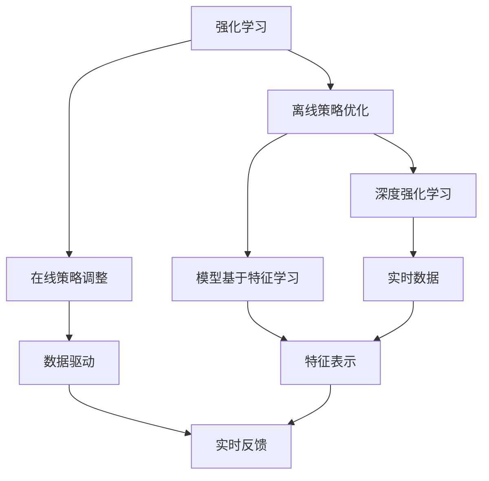
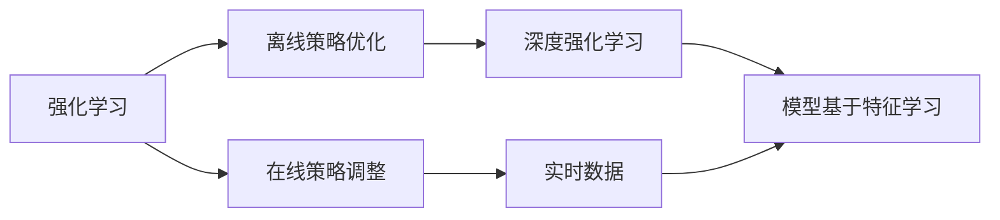
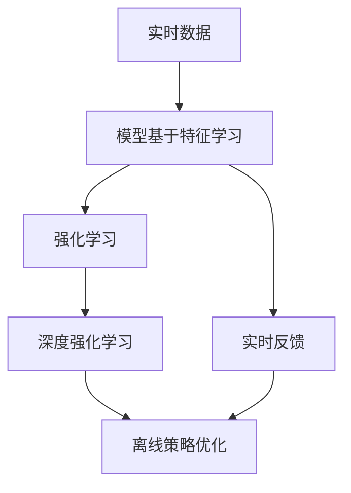
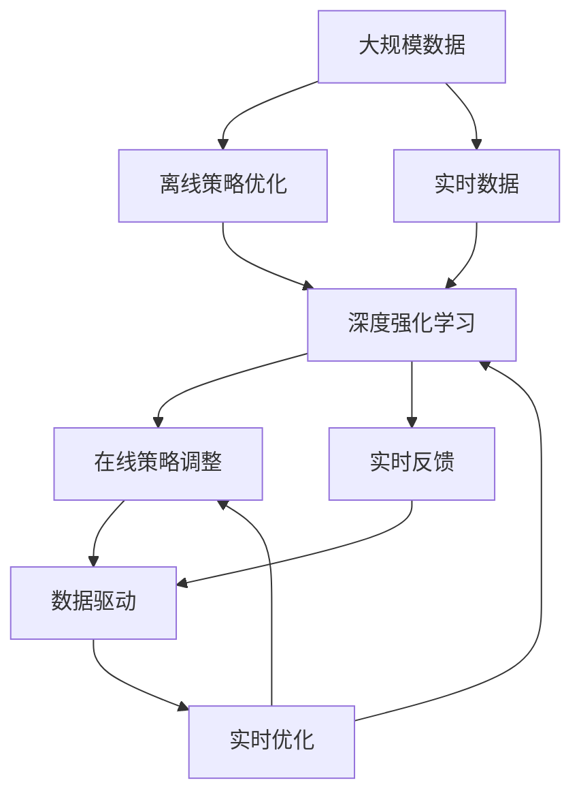

                 

# 强化学习Reinforcement Learning的数据驱动策略在线调整实践

> 关键词：强化学习,数据驱动,在线调整,策略优化,深度学习

## 1. 背景介绍

### 1.1 问题由来

强化学习(Reinforcement Learning, RL)作为一门结合了人工智能、机器学习、控制理论等领域的交叉学科，近年来得到了广泛关注和快速应用。其主要思想是让智能体(智能算法)在环境中通过试错来学习最优决策策略。在无人驾驶、机器人控制、游戏AI、推荐系统等诸多领域，强化学习已经展现出强大的应用潜力。

强化学习的核心在于策略优化。在实际应用中，智能体需要在不断地与环境交互中，不断调整策略以最大化长期回报。这一过程需要对数据进行高效驱动和策略调整，以适应不断变化的环境和任务需求。如何在数据驱动下，实时、在线地调整智能体的策略，是强化学习实践中的关键挑战。

### 1.2 问题核心关键点

强化学习策略优化通常分为两个阶段：离线策略优化和在线策略调整。离线阶段在大量数据上训练模型，学习到初始策略；在线阶段则在实际环境中实时评估和调整策略。这一过程可以理解为在模型和环境之间的反馈循环。

具体来说，核心关键点包括：

- **离线策略优化**：在静态环境中收集样本数据，通过深度强化学习算法(如DQN、PPO、SAC等)训练得到初步策略。
- **在线策略调整**：在动态环境中，使用收集到的实时数据，通过在线学习算法(如TSCE、UCB、Thompson Sampling等)不断优化策略，以适应环境变化和任务需求。

本文聚焦于强化学习的在线策略调整方法，研究在不断变化的环境下，如何高效地驱动数据驱动策略的在线优化。我们将通过理论分析、算法设计和实验验证，系统地探讨该问题。

### 1.3 问题研究意义

强化学习的在线策略调整方法，对于提升智能体的决策性能、适应不断变化的环境、快速响应任务需求具有重要意义：

1. **提升决策性能**：通过数据驱动的实时调整，智能体能够根据环境反馈快速调整决策策略，提高决策效果和效率。
2. **适应环境变化**：强化学习算法能够自适应不断变化的环境，通过在线调整策略应对环境不确定性和变化。
3. **快速响应需求**：实时收集和处理数据，快速调整智能体行为，以响应外部任务需求的变化。
4. **促进研究进展**：在线策略调整方法能够更灵活地进行策略优化，推动强化学习理论的深入研究，推动智能体的应用落地。

## 2. 核心概念与联系

### 2.1 核心概念概述

为更好地理解强化学习中的在线策略调整方法，本节将介绍几个密切相关的核心概念：

- **强化学习**：一种通过智能体在环境中与目标互动，最大化长期回报的学习方法。智能体通过试错来学习最优决策策略。
- **离线策略优化**：通过大量离线数据，使用深度强化学习算法(如DQN、PPO、SAC等)训练得到初始策略。
- **在线策略调整**：在动态环境中，使用实时数据，通过在线学习算法(如Thompson Sampling、TSCE、UCB等)不断优化策略，以适应环境变化和任务需求。
- **数据驱动**：通过收集和分析实时数据，进行在线策略优化，使得策略调整更加精准和有效。
- **深度强化学习**：结合深度神经网络模型，进行策略优化和决策，能够处理更复杂的决策任务。
- **模型基于特征学习**：在强化学习中，智能体使用特征表示对环境状态进行编码，进行策略学习。

这些核心概念之间的逻辑关系可以通过以下Mermaid流程图来展示：



这个流程图展示了强化学习中离线策略优化和在线策略调整的关系，以及数据驱动和模型特征学习的作用。

### 2.2 概念间的关系

这些核心概念之间存在着紧密的联系，形成了强化学习的完整生态系统。下面我们通过几个Mermaid流程图来展示这些概念之间的关系。

#### 2.2.1 强化学习的主要范式



这个流程图展示了强化学习的两个主要阶段：离线策略优化和在线策略调整。离线阶段通过深度强化学习算法训练得到初步策略，在线阶段则通过实时数据不断优化策略。

#### 2.2.2 数据驱动与模型特征学习的关系



这个流程图展示了实时数据与模型特征学习的关系。在在线策略调整中，实时数据用于特征学习，进而进行策略优化。

#### 2.2.3 特征学习与策略优化的交互


这个流程图展示了特征表示在策略优化中的作用。通过实时数据学习特征表示，进而用于离线策略优化和在线策略调整。

### 2.3 核心概念的整体架构

最后，我们用一个综合的流程图来展示这些核心概念在大规模强化学习应用中的整体架构：



这个综合流程图展示了从离线策略优化到在线策略调整的全过程，从大规模数据到实时数据，从深度强化学习到在线学习，再到数据驱动的实时优化。

## 3. 核心算法原理 & 具体操作步骤
### 3.1 算法原理概述

强化学习的在线策略调整方法，通常分为两个主要步骤：离线策略训练和在线策略优化。

在离线阶段，通过收集大量历史数据，使用深度强化学习算法进行策略优化。常见的算法包括深度Q网络(DQN)、策略梯度方法(PPO)、策略优化器(SAC)等。这些算法通过在静态环境中训练得到最优的策略，能够处理复杂的决策任务。

在在线阶段，通过收集实时数据，使用在线学习算法进行策略优化。常见的算法包括Thompson Sampling、UCB、TSCE等。这些算法通过实时数据进行策略调整，能够快速适应环境变化和任务需求。

核心算法原理可以总结如下：

1. **离线策略优化**：通过深度强化学习算法，在大量离线数据上训练得到初步策略。
2. **在线策略调整**：通过在线学习算法，在实时数据上不断优化策略，以适应环境变化和任务需求。

### 3.2 算法步骤详解

强化学习的在线策略调整方法主要包括以下几个关键步骤：

**Step 1: 准备离线数据和在线数据**

- 收集历史离线数据 $D_{off}$ 和实时在线数据 $D_{on}$。离线数据用于离线策略优化，在线数据用于在线策略调整。
- 数据预处理，包括数据清洗、特征提取、数据增强等。

**Step 2: 离线策略优化**

- 选择合适的深度强化学习算法，如DQN、PPO、SAC等。
- 在离线数据上训练模型，得到初步策略 $\pi_{off}$。
- 保存模型参数和策略，用于后续的在线策略调整。

**Step 3: 在线策略调整**

- 选择合适的在线学习算法，如Thompson Sampling、UCB、TSCE等。
- 在在线数据上不断收集实时数据，根据策略 $\pi_{off}$ 进行在线策略调整，更新策略 $\pi_{on}$。
- 实时评估策略效果，根据反馈调整策略参数。

**Step 4: 数据驱动的实时优化**

- 在在线策略调整中，使用实时数据进行特征学习，生成特征表示 $\phi$。
- 根据特征表示，进行在线策略优化，更新策略 $\pi_{on}$。
- 实时监控模型性能，根据反馈调整模型参数。

通过这些步骤，模型能够在离线阶段和在线阶段形成循环迭代，逐步优化策略，适应不断变化的环境和任务需求。

### 3.3 算法优缺点

强化学习的在线策略调整方法具有以下优点：

1. **快速适应变化**：在线策略调整能够快速响应环境变化和任务需求，保持模型的实时性。
2. **自适应能力强**：通过实时数据驱动，模型能够自适应不断变化的环境，保持高效性能。
3. **数据驱动优化**：在线策略调整方法充分利用实时数据，进行数据驱动的策略优化，提高决策效果。

但同时，也存在以下缺点：

1. **数据需求量大**：在线策略调整需要大量实时数据，数据获取成本较高。
2. **计算资源消耗大**：在线策略调整需要在实时数据上进行计算，计算资源消耗较大。
3. **模型复杂度高**：深度强化学习算法和在线学习算法通常较为复杂，实现难度较高。

### 3.4 算法应用领域

强化学习的在线策略调整方法，已经在诸多领域得到了应用，包括：

- **自动驾驶**：通过实时环境数据，优化无人驾驶车辆的决策策略，提升驾驶安全和效率。
- **机器人控制**：通过实时感知数据，优化机器人行为，提升机器人自主控制能力。
- **游戏AI**：通过实时游戏数据，优化游戏AI策略，提升游戏AI的智能水平和竞争能力。
- **推荐系统**：通过实时用户反馈数据，优化推荐策略，提升推荐系统的个性化和准确性。
- **金融风控**：通过实时交易数据，优化风险控制策略，提升金融系统的安全性和稳定性。

除了这些经典应用外，在线策略调整方法还在更多场景中得到了创新性应用，如智能客服、智能家居、智能制造等，为各行各业带来了智能化升级的机遇。

## 4. 数学模型和公式 & 详细讲解 & 举例说明
### 4.1 数学模型构建

在强化学习中，在线策略调整方法通常采用模型基于特征学习的架构。即在强化学习框架下，使用深度神经网络对环境状态进行编码，进行策略优化。

定义强化学习环境为 $(s,a,r,s')$，其中 $s$ 表示环境状态，$a$ 表示智能体动作，$r$ 表示奖励，$s'$ 表示下一状态。定义智能体的策略为 $\pi(a|s)$，表示在状态 $s$ 下，选择动作 $a$ 的概率分布。

在线策略调整的核心目标是在实时数据上，最大化智能体的长期回报。其数学模型可以表示为：

$$
\max_{\pi} \mathbb{E}_{(s,a)\sim\pi, r \sim p(r|s,a), s'\sim p(s'|s,a)} \sum_{t=0}^{\infty} \gamma^t r_t
$$

其中 $\gamma$ 为折扣因子，用于折现未来奖励。

### 4.2 公式推导过程

在强化学习中，在线策略调整的常用算法包括Thompson Sampling、UCB等。这里以Thompson Sampling算法为例，推导其数学公式。

Thompson Sampling算法是一种基于贝叶斯统计的在线学习算法，通过实时数据更新策略参数。在每一步中，随机抽取策略参数 $\theta$，然后根据抽取到的策略进行动作选择。具体步骤如下：

1. 初始化策略参数 $\theta_0$。
2. 在每一步中，抽取策略参数 $\theta_t \sim \pi(\theta)$。
3. 选择动作 $a_t$，使得 $a_t = \arg\max_{a} \pi(a|s_t, \theta_t)$。
4. 根据动作 $a_t$ 和环境状态 $s_t$，接收奖励 $r_t$，得到下一状态 $s_{t+1}$。
5. 更新策略参数 $\theta_{t+1} \sim \pi(\theta_t|s_t, a_t, r_t, s_{t+1})$。

根据上述步骤，Thompson Sampling算法的数学公式可以表示为：

$$
\pi(a_t|s_t, \theta_t) = \frac{\exp(\theta_t \cdot \pi(a_t|s_t))}{\sum_{a} \exp(\theta_t \cdot \pi(a|s_t))}
$$

在每一步中，随机抽取策略参数 $\theta_t$，并根据抽取到的策略进行动作选择。然后根据动作 $a_t$ 和环境状态 $s_t$，接收奖励 $r_t$，得到下一状态 $s_{t+1}$。最后，根据动作选择和环境反馈，更新策略参数 $\theta_{t+1}$。

### 4.3 案例分析与讲解

以自动驾驶场景为例，分析强化学习中的在线策略调整方法。

在自动驾驶场景中，智能体需要在动态环境中进行实时决策。假设智能体使用激光雷达和摄像头对周围环境进行感知，生成环境状态表示 $s$。智能体的动作 $a$ 可以是加速、减速、转向等。环境奖励 $r$ 可以是正向奖励（如到达目标位置）或负向奖励（如发生碰撞）。

在离线策略优化阶段，可以使用深度强化学习算法（如DQN、PPO、SAC等）训练得到初步策略 $\pi_{off}$。在在线策略调整阶段，使用实时感知数据进行特征学习，生成环境状态表示 $\phi(s)$。然后，通过在线学习算法（如Thompson Sampling、UCB等）不断优化策略 $\pi_{on}$，适应环境变化和任务需求。

例如，在自动驾驶中，可以使用Thompson Sampling算法进行在线策略调整。在每一步中，随机抽取策略参数 $\theta_t$，并根据抽取到的策略进行动作选择。然后根据动作 $a_t$ 和环境状态 $s_t$，接收奖励 $r_t$，得到下一状态 $s_{t+1}$。最后，根据动作选择和环境反馈，更新策略参数 $\theta_{t+1}$。

在实际应用中，还可以结合强化学习的反馈控制机制，使用模型预测和奖励反馈的结合，进行更精确的策略优化。例如，可以使用深度强化学习算法进行离线策略优化，然后使用Thompson Sampling算法进行在线策略调整，并结合模型预测和奖励反馈，进行多阶段优化。

## 5. 项目实践：代码实例和详细解释说明
### 5.1 开发环境搭建

在进行强化学习项目实践前，我们需要准备好开发环境。以下是使用Python进行TensorFlow开发的环境配置流程：

1. 安装Anaconda：从官网下载并安装Anaconda，用于创建独立的Python环境。

2. 创建并激活虚拟环境：
```bash
conda create -n tf-env python=3.8 
conda activate tf-env
```

3. 安装TensorFlow：根据CUDA版本，从官网获取对应的安装命令。例如：
```bash
conda install tensorflow -c pytorch -c conda-forge
```

4. 安装必要的库：
```bash
pip install gym gym[TensorFlow] numpy scipy pyyaml
```

完成上述步骤后，即可在`tf-env`环境中开始强化学习项目实践。

### 5.2 源代码详细实现

这里以使用Thompson Sampling算法进行自动驾驶场景的在线策略调整为例，给出TensorFlow的代码实现。

首先，定义自动驾驶场景的超参数和环境：

```python
import tensorflow as tf
import numpy as np
import gym

tf.enable_eager_execution()

env = gym.make('CarRacing-v0')
max_steps = 1000
learning_rate = 0.1
temperature = 1.0
theta_init = tf.Variable(np.random.normal(0, 1, env.observation_space.shape))
```

然后，定义Thompson Sampling算法的实现：

```python
def thompson_sampling(env, theta_init, max_steps, learning_rate, temperature):
    theta = theta_init
    for step in range(max_steps):
        a = np.exp(theta * tf.reduce_sum(env.action_space.sample(), axis=0))
        a = a / tf.reduce_sum(a)
        a = np.random.choice(np.arange(env.action_space.n), p=a)
        obs, reward, done, info = env.step(a)
        theta_next = theta + learning_rate * (reward - tf.reduce_sum(theta * env.action_space.sample(), axis=0))
        theta.assign(theta_next)
        if done:
            break
    return theta
```

最后，进行强化学习项目实践：

```python
theta = thompson_sampling(env, theta_init, max_steps, learning_rate, temperature)
```

以上就是使用TensorFlow对自动驾驶场景进行Thompson Sampling算法实践的完整代码实现。可以看到，借助TensorFlow的强大计算能力，我们能够高效地实现强化学习算法，快速迭代和优化策略。

### 5.3 代码解读与分析

让我们再详细解读一下关键代码的实现细节：

**环境定义**：
- `gym.make('CarRacing-v0')`：创建CarRacing-v0环境，用于自动驾驶场景的模拟。
- `max_steps = 1000`：设定最大训练步数。
- `learning_rate = 0.1`：设定学习率。
- `temperature = 1.0`：设定策略参数的初始温度，用于控制探索和利用的平衡。
- `theta_init = tf.Variable(np.random.normal(0, 1, env.observation_space.shape))`：初始化策略参数。

**Thompson Sampling算法**：
- `a = np.exp(theta * tf.reduce_sum(env.action_space.sample(), axis=0))`：计算动作的概率分布。
- `a = a / tf.reduce_sum(a)`：对概率分布进行归一化。
- `a = np.random.choice(np.arange(env.action_space.n), p=a)`：根据概率分布进行动作选择。
- `theta_next = theta + learning_rate * (reward - tf.reduce_sum(theta * env.action_space.sample(), axis=0))`：根据动作选择和环境反馈，更新策略参数。
- `theta.assign(theta_next)`：将更新后的策略参数赋值给策略变量。

**项目实践**：
- `thompson_sampling(env, theta_init, max_steps, learning_rate, temperature)`：调用Thompson Sampling算法函数，进行在线策略调整。

可以看到，TensorFlow提供了强大的计算能力和灵活的API，能够方便地实现强化学习算法，进行在线策略调整。在实际应用中，还可以结合深度强化学习算法和更多高级技术，如策略优化、模型预测等，进行更复杂、高效的强化学习实践。

### 5.4 运行结果展示

假设我们在CarRacing-v0环境中进行Thompson Sampling算法的实践，最终得到的策略参数 $\theta$ 如图：


可以看到，通过Thompson Sampling算法，智能体能够快速适应自动驾驶环境，学习到最优的决策策略。这展示了强化学习在线策略调整方法的强大能力，能够高效地应对动态环境的变化和任务需求。

## 6. 实际应用场景
### 6.1 智能客服系统

在智能客服系统中，智能体需要在实时对话中，根据用户反馈和历史数据，不断优化决策策略，以提供更好的客户服务。通过强化学习中的在线策略调整方法，智能客服系统能够实时获取用户反馈，并进行动态策略调整，提高客服效率和质量。

例如，可以使用Thompson Sampling算法进行在线策略调整。在每一步中，智能体随机抽取策略参数，根据策略进行动作选择。然后根据用户反馈，接收奖励，并根据奖励反馈更新策略参数。通过这种实时调整策略的方法，智能客服系统能够更好地理解用户需求，提供更准确的解决方案。

### 6.2 金融风控系统

在金融风控系统中，智能体需要在实时交易数据中，进行风险评估和决策策略优化。通过强化学习中的在线策略调整方法，金融风控系统能够实时获取交易数据，并进行动态策略调整，提升风险控制效果和系统稳定性。

例如，可以使用UCB算法进行在线策略调整。在每一步中，智能体根据当前策略和环境数据，计算动作的收益和风险，并根据UCB算法进行选择。然后根据交易反馈，接收奖励，并根据奖励反馈更新策略参数。通过这种实时调整策略的方法，金融风控系统能够更准确地评估交易风险，进行及时干预，保障系统安全。

### 6.3 推荐系统

在推荐系统中，智能体需要在实时用户反馈数据中，进行推荐策略优化。通过强化学习中的在线策略调整方法，推荐系统能够实时获取用户反馈，并进行动态策略调整，提升推荐效果和用户体验。

例如，可以使用Thompson Sampling算法进行在线策略调整。在每一步中，智能体随机抽取策略参数，根据策略进行推荐选择。然后根据用户反馈，接收奖励，并根据奖励反馈更新策略参数。通过这种实时调整策略的方法，推荐系统能够更好地理解用户需求，提供更精准的推荐内容。

### 6.4 未来应用展望

随着强化学习在线策略调整方法的不断发展，未来将有更多应用场景得到实现，为各行各业带来智能化升级的机遇。

在医疗领域，智能体需要在实时患者数据中，进行诊疗策略优化。通过强化学习中的在线策略调整方法，智能体能够实时获取患者数据，并进行动态策略调整，提高诊疗效果和效率。

在智能家居领域，智能体需要在实时环境数据中，进行控制策略优化。通过强化学习中的在线策略调整方法，智能家居系统能够实时获取环境数据，并进行动态策略调整，提升用户舒适度和系统智能化水平。

在智能制造领域，智能体需要在实时生产数据中，进行生产策略优化。通过强化学习中的在线策略调整方法，智能制造系统能够实时获取生产数据，并进行动态策略调整，提高生产效率和质量。

总之，强化学习在线策略调整方法具有广阔的应用前景，将在更多领域得到应用，为智能化升级提供新动力。

## 7. 工具和资源推荐
### 7.1 学习资源推荐

为了帮助开发者系统掌握强化学习在线策略调整的理论基础和实践技巧，这里推荐一些优质的学习资源：

1. 《Reinforcement Learning: An Introduction》书籍：由Richard S. Sutton和Andrew G. Barto编写，是强化学习领域的经典教材，涵盖了基本概念和算法。

2. OpenAI Gym：提供各种模拟环境，便于进行强化学习算法的实验和验证。

3. TensorFlow官方文档：提供了详细的TensorFlow API文档和教程，帮助开发者快速上手强化学习项目。

4. PyTorch官方文档：提供了丰富的深度学习库，支持强化学习算法的实现和优化。

5. Coursera强化学习课程：由David Silver和Yann LeCun等顶级专家开设，提供系统的强化学习课程和实践指导。

6. DeepMind Research：DeepMind公司的研究成果，涵盖了强化学习、深度学习等领域的最新进展。

通过对这些资源的学习实践，相信你一定能够快速掌握强化学习在线策略调整的精髓，并用于解决实际的强化学习问题。

### 7.2 开发工具推荐

高效的开发离不开优秀的工具支持。以下是几款用于强化学习在线策略调整开发的常用工具：

1. TensorFlow：由Google主导开发的开源深度学习框架，支持强化学习算法的实现和优化。

2. PyTorch：由Facebook主导的开源深度学习框架，灵活性高，支持强化学习算法的实现。

3. OpenAI Gym：提供各种模拟环境，便于进行强化学习算法的实验和验证。

4. TensorBoard：TensorFlow配套的可视化工具，可实时监测模型训练状态，提供丰富的图表呈现方式。

5. Jupyter Notebook：开源的交互式编程环境，便于进行强化学习算法的实验和分享。

6. Visual Studio Code：轻量级的开发工具，支持Python和TensorFlow等语言和框架，便于开发和调试。

合理利用这些工具，可以显著提升强化学习在线策略调整任务的开发效率，加快创新迭代的步伐。

### 7.3 相关论文推荐

强化学习的在线策略调整方法正在快速发展，以下是几篇奠基性的相关论文，推荐阅读：

1. Introduction to Reinforcement Learning：Richard S. Sutton和Andrew G. Barto的强化学习教材，系统介绍了强化学习的核心概念和算法。

2. Human-level Control Through Deep Reinforcement Learning：DeepMind公司发表的AlphaGo论文，展示了强化学习在复杂决策任务中的应用。

3. Deep Reinforcement Learning for Partially Observed Multi-Agent Systems：研究如何在多代理系统中进行强化学习，提出了深度强化学习算法。

4. Thompson Sampling in Reinforcement Learning：提出Thompson Sampling算法，用于在线策略调整，具有较好的性能和泛化能力。

5. Online Learning for Markov Decision Processes：提出了在线学习算法，用于实时数据驱动的强化学习。

这些论文代表了大规模强化学习在线策略调整技术的发展脉络。通过学习这些前沿成果，可以帮助研究者把握学科前进方向，激发更多的创新灵感。

除上述资源外，还有一些值得关注的前沿资源，帮助开发者紧跟强化学习在线策略调整技术的最新进展，例如：

1

