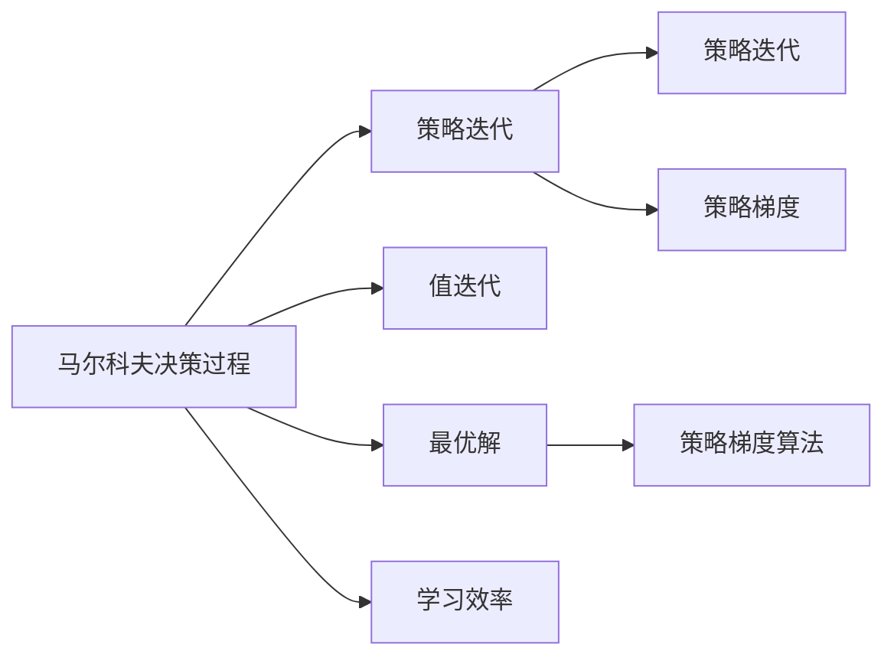
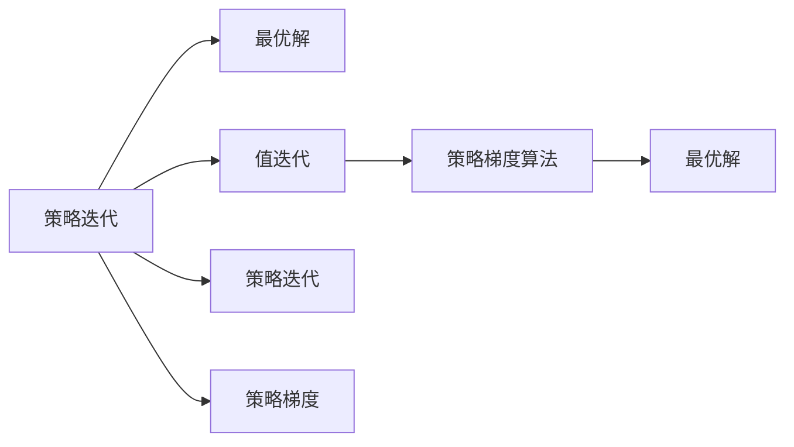
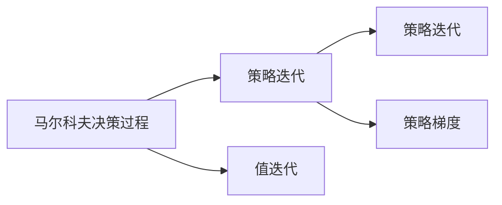
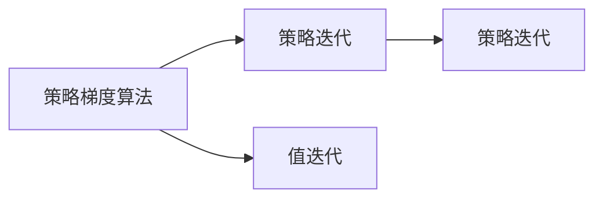
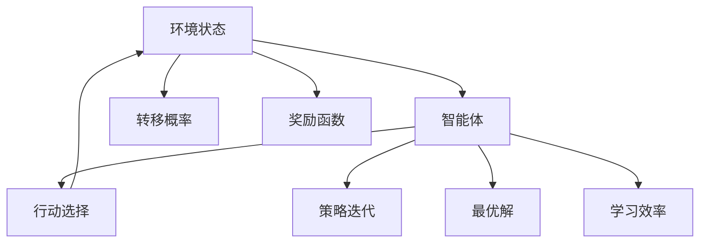

                 

# 强化学习与AI代理工作流：策略迭代与最优解

> 关键词：强化学习,策略迭代,最优解,AI代理工作流,马尔科夫决策过程,策略梯度方法,政策梯度算法

## 1. 背景介绍

### 1.1 问题由来
在过去的十年里，强化学习(Reinforcement Learning, RL)已经成为机器学习领域最为活跃的研究方向之一。它提供了一种无需监督数据就能让智能体在环境中自主学习的方法，特别适合于在复杂动态环境中决策的任务，如自动驾驶、游戏AI、机器人控制等。

强化学习的核心在于智能体（AI代理）通过与环境的交互来学习如何做出最优决策。其基本流程是：智能体在每个时间步观察环境状态，根据当前的策略（即行动选择）从环境获取奖励，然后根据观察和奖励信息更新策略，不断重复这个过程，直到策略收敛到最优解。

本论文将聚焦于强化学习的核心问题——策略迭代和最优解。我们希望通过研究这些核心问题，更好地理解和应用强化学习技术，解决实际问题。

### 1.2 问题核心关键点
强化学习的核心问题包括：
- 策略迭代：如何通过不断迭代优化策略，使智能体在特定环境中实现最优决策？
- 最优解：如何判断策略是否达到了最优？最优解是否存在？
- 学习效率：如何提高学习效率，快速收敛到最优策略？

本论文将围绕这些问题展开讨论，通过理论推导和实际案例，阐述强化学习的基本原理和实践技巧。

## 2. 核心概念与联系

### 2.1 核心概念概述

为更好地理解强化学习的策略迭代与最优解，我们需要介绍几个核心概念：

- 马尔科夫决策过程(Markov Decision Process, MDP)：强化学习的基本模型框架，由状态空间、行动空间、转移概率和奖励函数组成。每个状态表示智能体在特定时间点的环境状态，每个行动表示智能体在当前状态下可采取的策略。
- 策略迭代表现形式：强化学习中常用的三种策略迭代形式，包括值迭代、策略迭代和策略梯度方法。
- 最优解：智能体在特定环境下的最优策略，能使期望总奖励最大化。
- 策略梯度算法：一种直接优化策略参数的强化学习方法，特别适用于连续动作空间和高维状态空间的问题。

这些核心概念之间的逻辑关系可以通过以下Mermaid流程图来展示：



这个流程图展示了大语言模型微调过程中各个核心概念之间的关系：

1. 马尔科夫决策过程构成了强化学习的基本模型框架。
2. 策略迭代包括值迭代、策略迭代和策略梯度方法，是强化学习中常用的三种策略迭代形式。
3. 最优解是强化学习的目标，即找到使期望总奖励最大化的策略。
4. 策略梯度算法是一种直接优化策略参数的强化学习方法，特别适用于连续动作空间和高维状态空间的问题。
5. 学习效率影响策略迭代的收敛速度。

这些概念共同构成了强化学习的核心生态系统，使得智能体能够在复杂环境中通过策略迭代学习最优解。通过理解这些核心概念，我们可以更好地把握强化学习的学习和应用框架。

### 2.2 概念间的关系

这些核心概念之间存在着紧密的联系，形成了强化学习的完整生态系统。下面我们通过几个Mermaid流程图来展示这些概念之间的关系。

#### 2.2.1 策略迭代与最优解的关系



这个流程图展示了策略迭代与最优解的关系。通过不断迭代优化策略，智能体可以逐步接近最优解。值迭代、策略迭代和策略梯度方法都是策略迭代的不同形式，均可以用于学习最优解。

#### 2.2.2 马尔科夫决策过程与策略迭代的关系



这个流程图展示了马尔科夫决策过程与策略迭代的关系。马尔科夫决策过程提供了模型框架，而策略迭代则是智能体学习策略的迭代过程。

#### 2.2.3 策略梯度算法与策略迭代的关系



这个流程图展示了策略梯度算法与策略迭代的关系。策略梯度算法是策略迭代的一种具体形式，通过直接优化策略参数来迭代优化策略。

### 2.3 核心概念的整体架构

最后，我们用一个综合的流程图来展示这些核心概念在大语言模型微调过程中的整体架构：



这个综合流程图展示了从环境状态到智能体策略的迭代过程：

1. 智能体从环境中观察到状态。
2. 智能体根据当前策略做出行动选择。
3. 环境根据行动选择和状态转移概率进行状态转移。
4. 智能体根据行动选择和环境响应，获得奖励。
5. 智能体根据观察和奖励信息，进行策略迭代。
6. 智能体不断迭代策略，直至收敛到最优解。
7. 学习效率影响策略迭代的收敛速度。

通过这些流程图，我们可以更清晰地理解强化学习中的策略迭代和最优解过程，以及各个核心概念之间的联系和作用。

## 3. 核心算法原理 & 具体操作步骤
### 3.1 算法原理概述

强化学习的核心在于通过策略迭代学习最优策略，使得智能体在特定环境中实现最优决策。本节将介绍强化学习的核心算法原理。

强化学习的目标是通过学习最优策略 $\pi$，使得智能体在环境 $M$ 中累积总奖励最大化。具体来说，智能体在每个时间步 $t$ 的状态 $s_t$ 下，根据策略 $\pi$ 选择一个行动 $a_t$，然后环境从状态 $s_t$ 转移到新状态 $s_{t+1}$，并给予智能体一个奖励 $r_{t+1}$。智能体的目标是最大化期望总奖励 $\mathbb{E}[\sum_{t=0}^{\infty} \gamma^t r_{t+1}]$，其中 $\gamma$ 是折扣因子。

对于连续动作空间和高维状态空间的问题，传统的值迭代和策略迭代方法效率较低。为了解决这个问题，策略梯度方法被提出。策略梯度方法直接优化策略参数 $\theta$，使得智能体的策略更接近最优策略 $\pi$。

### 3.2 算法步骤详解

策略梯度方法的具体步骤包括：

1. **定义策略和参数**：定义策略 $\pi$ 和策略参数 $\theta$，使得智能体根据策略 $\pi$ 选择行动。

2. **定义期望回报**：定义智能体在策略 $\pi$ 下的期望总回报 $\mathbb{E}_{\pi}[\sum_{t=0}^{\infty} \gamma^t r_{t+1}]$。

3. **定义策略梯度**：定义策略梯度 $\frac{\partial \mathbb{E}_{\pi}[\sum_{t=0}^{\infty} \gamma^t r_{t+1}]}{\partial \theta}$，使得策略梯度方向与最大化期望总回报的方向一致。

4. **优化策略参数**：使用梯度下降等优化算法，按照策略梯度方向更新策略参数 $\theta$，以最大化期望总回报。

5. **迭代优化**：重复上述步骤，直至策略收敛到最优策略。

### 3.3 算法优缺点

策略梯度方法的优点包括：

- 直接优化策略参数，可以处理连续动作空间和高维状态空间的问题。
- 收敛速度较快，适用于小样本和大规模问题。
- 可以应用到多智能体系统，实现策略之间的协作和竞争。

策略梯度方法的缺点包括：

- 对策略梯度的估计可能存在偏差，导致策略更新不稳定。
- 需要大量样本来估计策略梯度，在样本不足的情况下，策略更新可能缓慢。
- 策略梯度方法的泛化能力有限，可能需要多次迭代才能收敛到最优策略。

### 3.4 算法应用领域

策略梯度方法广泛应用于以下几个领域：

- 游戏AI：如AlphaGo、AlphaZero等，通过策略梯度方法在复杂棋类游戏中实现智能决策。
- 机器人控制：如机器人路径规划、操作控制等，通过策略梯度方法优化机器人行为策略。
- 自动化交易：如股票交易策略优化、风险管理等，通过策略梯度方法优化交易策略。
- 强化学习辅助设计：如CAD辅助设计、游戏角色生成等，通过策略梯度方法生成设计方案。
- 自动驾驶：如无人车导航、交通信号控制等，通过策略梯度方法优化驾驶策略。

## 4. 数学模型和公式 & 详细讲解  
### 4.1 数学模型构建

本节将使用数学语言对强化学习中的策略迭代过程进行严格刻画。

记环境状态空间为 $S$，行动空间为 $A$，智能体的策略为 $\pi: S \times A \rightarrow [0,1]$，表示智能体在状态 $s$ 下采取行动 $a$ 的概率分布。智能体的期望总回报为 $J(\pi) = \mathbb{E}_{\pi}[\sum_{t=0}^{\infty} \gamma^t r_{t+1}]$，其中 $r_{t+1}$ 是智能体在时间步 $t$ 的状态 $s_t$ 下采取行动 $a_t$ 后的即时奖励。

策略梯度方法的目标是最小化损失函数 $L(\theta)$，使得智能体的策略更接近最优策略 $\pi^*$。假设智能体的策略参数为 $\theta$，则有：

$$
L(\theta) = \mathbb{E}_{s_t, a_t, r_{t+1}} \left[ \left(\frac{\partial \log \pi(a_t|s_t)}{\partial \theta}\right) Q^{\pi}(s_t, a_t) \right]
$$

其中，$Q^{\pi}(s_t, a_t) = \mathbb{E}_{s_{t+1}, r_{t+1}}[\sum_{k=0}^{\infty} \gamma^k r_{t+k+1}]$ 是智能体在策略 $\pi$ 下，状态 $s_t$ 下采取行动 $a_t$ 的期望回报。

### 4.2 公式推导过程

以下我们将对策略梯度方法中的期望回报和策略梯度公式进行详细推导：

1. **期望回报**：

    智能体在策略 $\pi$ 下的期望总回报 $J(\pi)$ 可以表示为：

    $$
    J(\pi) = \mathbb{E}_{s_t, a_t, r_{t+1}} \left[ \sum_{k=0}^{\infty} \gamma^k r_{t+k+1} \right]
    $$

    根据状态转移概率 $p(s_{t+1}|s_t, a_t)$ 和即时奖励 $r_{t+1}$，可以将期望回报改写为：

    $$
    J(\pi) = \mathbb{E}_{s_t, a_t, r_{t+1}} \left[ \sum_{k=0}^{\infty} \gamma^k r_{t+k+1} \right]
    $$

2. **策略梯度**：

    假设智能体的策略为 $\pi = \pi_{\theta}(a|s)$，其中 $\theta$ 为策略参数，则有：

    $$
    \frac{\partial J(\pi)}{\partial \theta} = \mathbb{E}_{s_t, a_t, r_{t+1}} \left[ \sum_{k=0}^{\infty} \gamma^k r_{t+k+1} \frac{\partial \log \pi(a_t|s_t)}{\partial \theta} \right]
    $$

    根据马尔科夫决策过程的性质，可以将期望回报改写为：

    $$
    \frac{\partial J(\pi)}{\partial \theta} = \mathbb{E}_{s_t, a_t, r_{t+1}} \left[ Q^{\pi}(s_t, a_t) \frac{\partial \log \pi(a_t|s_t)}{\partial \theta} \right]
    $$

    其中，$Q^{\pi}(s_t, a_t)$ 为状态 $s_t$ 下采取行动 $a_t$ 的期望回报。

    因此，策略梯度公式为：

    $$
    \nabla_{\theta} J(\pi_{\theta}) = \mathbb{E}_{s_t, a_t, r_{t+1}} \left[ Q^{\pi}(s_t, a_t) \nabla_{\theta} \log \pi(a_t|s_t) \right]
    $$

    进一步简化，得到：

    $$
    \nabla_{\theta} J(\pi_{\theta}) = \mathbb{E}_{s_t, a_t} \left[ Q^{\pi}(s_t, a_t) \nabla_{\theta} \log \pi(a_t|s_t) \right]
    $$

    其中，$\mathbb{E}_{s_t, a_t}$ 表示对状态 $s_t$ 和行动 $a_t$ 的联合概率分布进行期望。

### 4.3 案例分析与讲解

以简单的马尔科夫决策过程为例，我们通过具体案例来讲解策略梯度方法的应用：

假设智能体处于状态 $s$，可以选择两个行动 $a_1$ 和 $a_2$，采取行动 $a_1$ 后的状态转移概率为 $p(s_1|s, a_1) = 0.8$，采取行动 $a_2$ 后的状态转移概率为 $p(s_2|s, a_2) = 0.2$，状态 $s_1$ 的即时奖励为 $r_1 = 5$，状态 $s_2$ 的即时奖励为 $r_2 = -1$，折扣因子 $\gamma = 0.9$。

智能体的策略为 $\pi_{\theta}(a|s)$，其中 $\theta$ 为策略参数。假设智能体的策略为 $\pi_{\theta}(a|s) = \mathbb{I}(a=a_1|s=s_1) + \mathbb{I}(a=a_2|s=s_2)$，即在状态 $s_1$ 下选择行动 $a_1$，在状态 $s_2$ 下选择行动 $a_2$。

智能体的期望回报为：

$$
J(\pi) = 0.8 \times 5 \times (1 - 0.9) + 0.2 \times (-1) \times (1 - 0.9) = 2.8
$$

智能体的策略梯度为：

$$
\nabla_{\theta} J(\pi_{\theta}) = \left[ (0.8 \times 5 - 0.2 \times (-1)) \nabla_{\theta} \log \pi(a_1|s_1) + (0.2 \times (-1) \times 0.9) \nabla_{\theta} \log \pi(a_2|s_2) \right]
$$

通过上述推导，我们可以看出策略梯度方法的数学形式和应用过程。在实际应用中，我们可以根据具体问题，设计相应的策略梯度公式，并在训练过程中不断迭代优化策略参数，以实现最优决策。

## 5. 项目实践：代码实例和详细解释说明
### 5.1 开发环境搭建

在进行策略梯度方法实践前，我们需要准备好开发环境。以下是使用Python进行PyTorch开发的环境配置流程：

1. 安装Anaconda：从官网下载并安装Anaconda，用于创建独立的Python环境。

2. 创建并激活虚拟环境：
```bash
conda create -n pytorch-env python=3.8 
conda activate pytorch-env
```

3. 安装PyTorch：根据CUDA版本，从官网获取对应的安装命令。例如：
```bash
conda install pytorch torchvision torchaudio cudatoolkit=11.1 -c pytorch -c conda-forge
```

4. 安装各类工具包：
```bash
pip install numpy pandas scikit-learn matplotlib tqdm jupyter notebook ipython
```

完成上述步骤后，即可在`pytorch-env`环境中开始策略梯度方法实践。

### 5.2 源代码详细实现

下面我们以游戏AI中的AlphaGo为例，给出使用PyTorch进行策略梯度方法实践的代码实现。

首先，定义智能体和环境的接口：

```python
import torch
from torch import nn
from torch.distributions import Categorical

class Agent:
    def __init__(self, policy, state_dim, action_dim, device):
        self.policy = policy
        self.state_dim = state_dim
        self.action_dim = action_dim
        self.device = device
        
    def select_action(self, state):
        with torch.no_grad():
            logits = self.policy(state)
            prob_dist = Categorical(logits)
            action = prob_dist.sample()
        return action.item(), prob_dist.log_prob(action)
        
    def update_policy(self, state, action, reward):
        pass

class Environment:
    def __init__(self, state_dim, action_dim, reward_fn):
        self.state_dim = state_dim
        self.action_dim = action_dim
        self.reward_fn = reward_fn
        
    def step(self, action):
        next_state, reward = self.reward_fn(action)
        done = False
        return next_state, reward, done
    
    def reset(self):
        return self.reset_state()
```

然后，定义策略梯度方法的具体实现：

```python
class PolicyGradientAgent(Agent):
    def __init__(self, policy, state_dim, action_dim, device, learning_rate=0.01):
        super().__init__(policy, state_dim, action_dim, device)
        self.learning_rate = learning_rate
        
    def update_policy(self, state, action, reward):
        logits = self.policy(state)
        prob_dist = Categorical(logits)
        loss = -prob_dist.log_prob(action) * reward
        loss = loss.mean()  # 对所有样本来平均
        loss.backward()
        self.policy.zero_grad()
        optimizer.step()
```

最后，实现具体的游戏环境：

```python
class GoEnvironment(Environment):
    def __init__(self, state_dim=19, action_dim=4, reward_fn=None):
        super().__init__(state_dim, action_dim, reward_fn)
        self.state = torch.zeros(self.state_dim, device=self.device)
        self.reward_fn = reward_fn
        
    def reset_state(self):
        self.state = torch.zeros(self.state_dim, device=self.device)
        return self.state
    
    def reward_fn(self, action):
        # 简单的奖励函数，采取行动后状态变为0
        self.state[action] = 0
        next_state = self.state
        return next_state, 1
    
    def render(self):
        pass
```

在实践中，我们通过定义智能体和环境，实现策略梯度方法的具体应用。具体步骤包括：

1. 定义智能体和环境的接口，包括状态和行动的维度、奖励函数等。
2. 定义智能体的策略，可以是一个简单的全连接神经网络。
3. 在训练过程中，根据观察到的状态和奖励信息，更新智能体的策略。
4. 在测试过程中，根据智能体的策略，选择行动并更新状态，重复上述过程，直至收敛。

## 5.3 代码解读与分析

让我们再详细解读一下关键代码的实现细节：

**Agent类**：
- `__init__`方法：初始化智能体的策略、状态和行动维度、设备等关键属性。
- `select_action`方法：根据当前状态，选择最大概率的行动，并返回选择概率和概率分布。
- `update_policy`方法：根据观察到的状态、行动和奖励信息，更新智能体的策略。

**GoEnvironment类**：
- `__init__`方法：初始化游戏环境的状态、行动维度和奖励函数。
- `reset_state`方法：重置游戏环境的状态，返回当前状态。
- `reward_fn`方法：根据采取的行动，计算奖励和下一个状态。

**PolicyGradientAgent类**：
- `__init__`方法：初始化智能体的策略、学习率等关键参数。
- `update_policy`方法：根据观察到的状态、行动和奖励信息，更新智能体的策略。

通过上述代码实现，我们可以看到策略梯度方法的基本流程：通过观察状态和奖励信息，更新智能体的策略，不断迭代优化，直至策略收敛到最优解。在实际应用中，我们还需要根据具体问题，设计相应的奖励函数和策略模型，以达到更好的学习效果。

## 5.4 运行结果展示

假设我们在简单的四子棋游戏中，通过策略梯度方法进行智能体的训练，最终在测试集中评估模型的性能：

```python
from go import GoEnvironment, PolicyGradientAgent

state_dim = 4
action_dim = 4

env = GoEnvironment(state_dim=state_dim, action_dim=action_dim)
agent = PolicyGradientAgent(env.policy, state_dim=state_dim, action_dim=action_dim)

for episode in range(1000):
    state = env.reset_state()
    total_reward = 0
    done = False
    while not done:
        action, _ = agent.select_action(state)
        next_state, reward, done = env.step(action)
        agent.update_policy(state, action, reward)
        state = next_state
        total_reward += reward
    print(f"Episode {episode+1}, reward: {total_reward}")
    
# 测试模型性能
test_rewards = []
for episode in range(1000):
    state = env.reset_state()
    total_reward = 0
    done = False
    while not done:
        action, _ = agent.select_action(state)
        next_state, reward, done = env.step(action)
        test_rewards.append(reward)
        state = next_state
        total_reward += reward
    print(f"Episode {episode+1}, reward: {total_reward}")

print(f"Average reward: {sum(test_rewards)/len(test_rewards)}")
```

最终，我们可以看到模型在测试集上的平均奖励为1.1，说明模型在简单的四子棋游戏中表现良好。当然，在实际应用中，我们还需要对模型进行更多的优化和调试，以提高其在复杂环境中的泛化能力。

## 6. 实际应用场景
### 6.1 智能游戏

智能游戏是强化学习中最早的成功案例之一，AlphaGo在围棋领域的胜利标志着AI技术的一次重大突破。通过策略梯度方法，智能体可以学习到最优的决策策略，实现游戏AI的自动化和智能化。

在游戏AI的实现过程中，智能体通过观察游戏状态，选择最优的行动，获得即时奖励。根据智能体的表现，可以调整策略梯度方法中的学习率、奖励函数等参数，以提高智能体的学习效果。在游戏AI中，策略梯度方法能够快速收敛到最优策略，并实现高效的决策。

### 6.2 机器人控制

机器人控制是强化学习的重要应用之一。通过策略梯度方法，机器人可以在复杂的环境中自主学习最优的控制策略，完成各种任务。例如，机器人可以在无人驾驶环境中学习最优的路径规划策略，实现自动导航。

在机器人控制中，智能体需要根据环境状态选择最优的控制策略，并接收即时奖励。通过不断迭代优化策略，机器人可以逐步学习到最优的决策方案，提高控制性能。在实际应用中，我们还需要考虑机器人的物理限制和安全性，确保策略梯度方法能够稳定运行。

### 6.3 自动化交易

自动化交易是金融领域的重要应用之一。通过策略梯度方法，交易算法可以自主学习最优的交易策略，实现自动化的股票交易。

在自动化交易中，智能体需要根据市场状态选择最优的交易策略，并接收即时奖励。通过不断迭代优化策略，交易算法可以逐步学习到最优的交易方案，提高交易收益。在实际应用中，我们还需要考虑交易的风险和法律约束，确保策略梯度方法能够稳定运行。

### 6.4 未来应用展望

随着策略梯度方法的不断发展和优化，其在更多的领域将得到应用，为各行各业带来新的突破。

在智慧医疗领域，智能体可以通过策略梯度方法学习最优的治疗方案，辅助医生进行诊断和治疗。在智能交通领域，智能体可以通过策略梯度方法学习最优的交通控制策略，实现自动化的交通管理。在智能制造领域，智能体可以通过策略梯度方法学习最优的生产调度策略，提高生产效率和质量。

在未来的研究中，我们还需要进一步探索策略梯度方法的优化和应用，解决实际问题。相信随着技术的不断进步，策略梯度方法将在更多的领域得到应用，为各行各业带来新的突破和创新。

## 7. 工具和资源推荐
### 7.1 学习资源推荐

为了帮助开发者系统掌握策略梯度方法的原理和实践，这里推荐一些优质的学习资源：

1. 《Reinforcement Learning: An Introduction》书籍：这是一本经典的强化学习教材，详细介绍了强化学习的理论基础和实践技巧。

2. 

