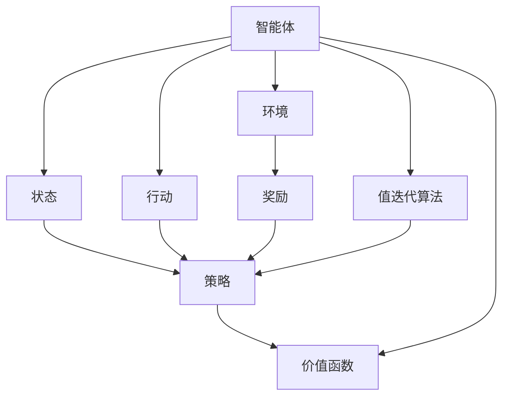
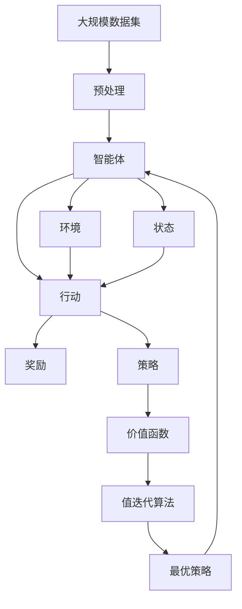

                 

## 1. 背景介绍

### 1.1 问题由来
强化学习（Reinforcement Learning, RL）作为一种重要的机器学习方法，其思想源自于行为学和控制理论。自20世纪80年代以来，RL理论得到了快速的发展，并在众多领域中得到广泛应用。从游戏智能、机器人控制到自然语言处理、金融交易等领域，RL技术都展现出了强大的潜力。本文将详细探讨RL的基本思想、核心算法、发展历程以及未来展望。

### 1.2 问题核心关键点
强化学习旨在让智能体（agent）在与环境的交互过程中，通过不断试错来学习最优策略。与传统的监督学习和无监督学习不同，RL无需标注数据，而是通过奖励信号和惩罚机制引导智能体向最优策略靠拢。核心关键点包括：
- 状态-行动-奖励(Strategy)：RL模型中，智能体根据当前状态(state)和可行的行动(action)选择出当前最优行动，并获得相应的奖励(reward)。
- 策略更新：在不断的交互中，RL模型通过策略更新的过程，逐步学习到最优策略。
- 环境建模：RL模型需要建立对环境的模型，以便更好地理解和控制环境。

## 2. 核心概念与联系

### 2.1 核心概念概述

强化学习（Reinforcement Learning, RL）是一种通过试错学习来优化策略的机器学习方法。其主要思想是通过与环境的交互，不断尝试各种策略，并通过奖励信号来评估和优化策略。强化学习的核心概念包括：
- 智能体（Agent）：通过与环境交互，进行学习和决策的实体。
- 环境（Environment）：智能体所处的外部世界，提供状态和奖励。
- 状态（State）：智能体在环境中的具体位置和属性，是决策的基础。
- 行动（Action）：智能体在当前状态下所采取的具体行动。
- 奖励（Reward）：智能体采取行动后，环境对其的反馈，用于评估行动的好坏。
- 策略（Policy）：智能体在给定状态下选择行动的概率分布。
- 价值函数（Value Function）：评估智能体在不同状态下的长期奖励预期。
- 值迭代算法（Value Iteration）：通过迭代优化价值函数，得到最优策略。

这些核心概念通过以下Mermaid流程图展示：



这个流程图展示了智能体、环境、状态、行动、奖励、策略、价值函数和值迭代算法之间的关系。智能体在环境中选择行动，并根据行动得到奖励，通过策略来确定行动的概率分布，并使用价值函数来评估策略的好坏，最终通过值迭代算法来优化策略。

### 2.2 概念间的关系

这些核心概念之间存在着紧密的联系，形成了强化学习的完整生态系统。下面是几个概念间的关系：

#### 2.2.1 智能体与环境的交互
智能体与环境之间的交互是通过状态和行动来实现的。智能体根据当前状态，选择出一个行动，并根据环境的反馈（即奖励）来更新策略。这个过程不断地迭代，智能体逐渐学习到最优策略。

#### 2.2.2 策略与价值函数
策略是智能体在给定状态下选择行动的概率分布。价值函数则评估智能体在不同状态下的长期奖励预期。价值函数可以通过策略进行计算，也可以通过值迭代算法来优化，最终得到最优策略。

#### 2.2.3 值迭代算法
值迭代算法是强化学习中最基本的算法之一，它通过迭代优化价值函数，得到最优策略。值迭代算法的核心在于通过动态规划的方法，逐步逼近最优策略。

### 2.3 核心概念的整体架构

最后，我们用一个综合的流程图来展示这些核心概念在大规模强化学习任务中的整体架构：



这个综合流程图展示了从大规模数据集预处理到最终得到最优策略的全过程。首先，从大规模数据集中提取状态、行动和奖励，然后通过智能体在环境中进行交互，并使用策略来更新行动，最终通过值迭代算法来优化价值函数，得到最优策略。

## 3. 核心算法原理 & 具体操作步骤

### 3.1 算法原理概述

强化学习的核心算法包括Q-learning、SARSA、Policy Gradient和Actor-Critic等。这些算法通过不同的方式来优化策略，以获取最优决策。下面我们将详细探讨这些算法的基本原理。

### 3.2 算法步骤详解

#### 3.2.1 Q-learning算法
Q-learning算法是一种基于值迭代的强化学习算法，通过不断更新Q值表来学习最优策略。Q值表是一个状态-行动的奖励预测函数，表示在给定状态下采取某个行动的长期期望奖励。算法步骤如下：
1. 初始化Q值表为全0。
2. 随机选择一个初始状态$s_0$。
3. 根据策略选择当前行动$a_0$，并执行行动。
4. 观察环境，获得新的状态$s_1$和奖励$r_1$。
5. 更新Q值表：
   $$
   Q(s_0, a_0) \leftarrow (1 - \alpha) Q(s_0, a_0) + \alpha (r_1 + \gamma \max_{a'} Q(s_1, a')) 
   $$
6. 选择下一个行动$a_1$，重复步骤3至6，直到终止状态或达到最大迭代次数。
7. 输出最优策略$\pi$。

#### 3.2.2 SARSA算法
SARSA算法是Q-learning的一种变体，通过在状态-行动-状态-行动（SASA）的框架下更新Q值表。算法步骤如下：
1. 初始化Q值表为全0。
2. 随机选择一个初始状态$s_0$。
3. 根据策略选择当前行动$a_0$，并执行行动。
4. 观察环境，获得新的状态$s_1$和奖励$r_1$。
5. 选择下一个行动$a_1$，并执行行动。
6. 更新Q值表：
   $$
   Q(s_0, a_0) \leftarrow (1 - \alpha) Q(s_0, a_0) + \alpha (r_1 + \gamma Q(s_1, a_1))
   $$
7. 重复步骤3至6，直到终止状态或达到最大迭代次数。
8. 输出最优策略$\pi$。

#### 3.2.3 Policy Gradient算法
Policy Gradient算法通过直接优化策略函数，而非状态-行动值函数，来更新智能体的策略。算法步骤如下：
1. 初始化策略函数$\pi$为随机策略。
2. 随机选择一个初始状态$s_0$。
3. 根据策略选择当前行动$a_0$，并执行行动。
4. 观察环境，获得新的状态$s_1$和奖励$r_1$。
5. 计算当前策略的梯度：
   $$
   \nabla_{\theta} J(\theta) = \nabla_{\theta} \sum_{t=0}^{\infty} \gamma^t \log \pi(a_t|s_t)
   $$
6. 使用梯度下降法更新策略函数$\pi$：
   $$
   \theta \leftarrow \theta - \eta \nabla_{\theta} J(\theta)
   $$
7. 重复步骤3至6，直到终止状态或达到最大迭代次数。
8. 输出最优策略$\pi$。

#### 3.2.4 Actor-Critic算法
Actor-Critic算法结合了策略梯度和值迭代的思想，通过两个网络来同时更新策略和价值函数。算法步骤如下：
1. 初始化Actor和Critic网络。
2. 随机选择一个初始状态$s_0$。
3. 根据Actor网络选择当前行动$a_0$，并执行行动。
4. 观察环境，获得新的状态$s_1$和奖励$r_1$。
5. 更新Critic网络：
   $$
   Q(s_0, a_0) \leftarrow (1 - \alpha) Q(s_0, a_0) + \alpha (r_1 + \gamma Q(s_1, a_1))
   $$
6. 更新Actor网络：
   $$
   \nabla_{\theta} J(\theta) = \nabla_{\theta} \sum_{t=0}^{\infty} \gamma^t \log \pi(a_t|s_t)
   $$
7. 使用梯度下降法更新Actor和Critic网络。
8. 重复步骤3至7，直到终止状态或达到最大迭代次数。
9. 输出最优策略$\pi$。

### 3.3 算法优缺点

#### 3.3.1 Q-learning算法的优点
Q-learning算法简单，易于实现和理解，适用于离散状态和行动空间。它可以通过值迭代算法来优化Q值表，从而得到最优策略。

#### 3.3.2 Q-learning算法的缺点
Q-learning算法收敛速度较慢，可能会陷入局部最优解。此外，它需要存储和更新Q值表，随着状态和行动的增多，空间和时间复杂度会急剧增加。

#### 3.3.3 SARSA算法的优点
SARSA算法比Q-learning算法收敛更快，因为它通过在SASA框架下更新Q值表，避免了Q-learning算法的收敛问题。

#### 3.3.4 SARSA算法的缺点
SARSA算法同样需要存储和更新Q值表，且在复杂环境中容易陷入局部最优解。

#### 3.3.5 Policy Gradient算法的优点
Policy Gradient算法直接优化策略函数，避免了Q-learning和SARSA算法的收敛问题。它可以通过梯度下降法来更新策略函数，计算效率较高。

#### 3.3.6 Policy Gradient算法的缺点
Policy Gradient算法需要对策略函数进行优化，容易受到噪声和梯度消失的影响。此外，它需要估计策略的梯度，可能需要大量的样本来估计准确的梯度。

#### 3.3.7 Actor-Critic算法的优点
Actor-Critic算法结合了策略梯度和值迭代的思想，具有较好的收敛性和稳定性。它可以通过两个网络来同时更新策略和价值函数，具有较好的泛化能力。

#### 3.3.8 Actor-Critic算法的缺点
Actor-Critic算法需要同时训练两个网络，计算复杂度较高。此外，在复杂环境中，Actor-Critic算法容易陷入局部最优解。

### 3.4 算法应用领域

强化学习在众多领域中得到了广泛应用，包括游戏智能、机器人控制、自然语言处理、金融交易等。以下是几个具体的应用领域：

#### 3.4.1 游戏智能
强化学习在游戏智能中得到了广泛应用，如AlphaGo、Dota 2、星际争霸等。这些算法通过与环境交互，学习到最优的游戏策略，并实现高水平的竞技表现。

#### 3.4.2 机器人控制
强化学习在机器人控制中也得到了广泛应用，如导航、抓取、协调等。通过与环境的交互，机器人可以学习到最优的行动策略，实现高精度的控制和协调。

#### 3.4.3 自然语言处理
强化学习在自然语言处理中也得到了广泛应用，如机器翻译、文本生成、对话系统等。通过与环境的交互，模型可以学习到最优的文本生成策略，实现高效的文本生成和对话系统。

#### 3.4.4 金融交易
强化学习在金融交易中也得到了广泛应用，如算法交易、风险管理、投资组合优化等。通过与市场的交互，模型可以学习到最优的交易策略，实现高收益和低风险。

## 4. 数学模型和公式 & 详细讲解 & 举例说明

### 4.1 数学模型构建

强化学习的数学模型主要包括以下几个要素：
- 状态（State）：表示智能体在环境中的位置和属性。
- 行动（Action）：智能体在给定状态下所采取的行动。
- 奖励（Reward）：智能体采取行动后，环境对其的反馈。
- 策略（Policy）：智能体在给定状态下选择行动的概率分布。
- 价值函数（Value Function）：评估智能体在不同状态下的长期奖励预期。

强化学习的数学模型可以表示为：
$$
\begin{aligned}
S &\sim \mathcal{S}, \\
A &\sim \mathcal{A}(S), \\
R &\sim \mathcal{R}(S, A), \\
\pi &\sim \mathcal{P}(A|S), \\
V(S) &\sim \mathcal{V}(S) = \mathbb{E}[\sum_{t=0}^{\infty} \gamma^t R_t|S_0 = S], \\
Q(S, A) &\sim \mathcal{Q}(S, A) = \mathbb{E}[\sum_{t=0}^{\infty} \gamma^t R_t|S_0 = S, A_0 = A],
\end{aligned}
$$

其中$S$表示状态，$A$表示行动，$R$表示奖励，$\pi$表示策略，$V$表示价值函数，$Q$表示状态-行动值函数。

### 4.2 公式推导过程

#### 4.2.1 Q-learning算法的推导
Q-learning算法的核心在于通过值迭代的思想，更新Q值表。推导过程如下：
1. 初始化Q值表为全0。
2. 假设智能体在状态$s_t$下采取行动$a_t$，观察到奖励$r_t$，并转移到状态$s_{t+1}$。
3. 根据Bellman方程，更新Q值表：
   $$
   Q(s_t, a_t) \leftarrow (1 - \alpha) Q(s_t, a_t) + \alpha (r_t + \gamma Q(s_{t+1}, a_{t+1}))
   $$
4. 重复步骤2至3，直到达到最大迭代次数。
5. 输出最优策略$\pi$。

#### 4.2.2 SARSA算法的推导
SARSA算法的核心在于在SASA（状态-行动-状态-行动）的框架下，更新Q值表。推导过程如下：
1. 初始化Q值表为全0。
2. 假设智能体在状态$s_t$下采取行动$a_t$，观察到奖励$r_t$，并转移到状态$s_{t+1}$。
3. 假设智能体在状态$s_{t+1}$下采取行动$a_{t+1}$，观察到奖励$r_{t+1}$，并转移到状态$s_{t+2}$。
4. 根据Bellman方程，更新Q值表：
   $$
   Q(s_t, a_t) \leftarrow (1 - \alpha) Q(s_t, a_t) + \alpha (r_t + \gamma Q(s_{t+1}, a_{t+1}))
   $$
5. 重复步骤2至4，直到达到最大迭代次数。
6. 输出最优策略$\pi$。

#### 4.2.3 Policy Gradient算法的推导
Policy Gradient算法的核心在于直接优化策略函数。推导过程如下：
1. 假设智能体在状态$s_t$下采取行动$a_t$，观察到奖励$r_t$，并转移到状态$s_{t+1}$。
2. 根据Bellman方程，更新Q值表：
   $$
   Q(s_t, a_t) \leftarrow (1 - \alpha) Q(s_t, a_t) + \alpha (r_t + \gamma Q(s_{t+1}, a_{t+1}))
   $$
3. 根据策略函数的定义，计算策略函数的梯度：
   $$
   \nabla_{\theta} J(\theta) = \nabla_{\theta} \sum_{t=0}^{\infty} \gamma^t \log \pi(a_t|s_t)
   $$
4. 使用梯度下降法更新策略函数$\pi$：
   $$
   \theta \leftarrow \theta - \eta \nabla_{\theta} J(\theta)
   $$
5. 重复步骤1至4，直到达到最大迭代次数。
6. 输出最优策略$\pi$。

#### 4.2.4 Actor-Critic算法的推导
Actor-Critic算法的核心在于通过Actor和Critic两个网络，同时更新策略和价值函数。推导过程如下：
1. 初始化Actor和Critic网络。
2. 假设智能体在状态$s_t$下采取行动$a_t$，观察到奖励$r_t$，并转移到状态$s_{t+1}$。
3. 根据Actor网络的输出，计算当前策略的梯度：
   $$
   \nabla_{\theta} J(\theta) = \nabla_{\theta} \sum_{t=0}^{\infty} \gamma^t \log \pi(a_t|s_t)
   $$
4. 使用梯度下降法更新Actor网络：
   $$
   \theta \leftarrow \theta - \eta \nabla_{\theta} J(\theta)
   $$
5. 根据Critic网络的输出，更新Q值表：
   $$
   Q(s_t, a_t) \leftarrow (1 - \alpha) Q(s_t, a_t) + \alpha (r_t + \gamma Q(s_{t+1}, a_{t+1}))
   $$
6. 重复步骤2至5，直到达到最大迭代次数。
7. 输出最优策略$\pi$。

### 4.3 案例分析与讲解

#### 4.3.1 Q-learning算法的案例分析
Q-learning算法在解决简单的环境中有很好的表现，例如在Mazes环境中的路径寻找。

假设智能体在Mazes环境中，需要从起点$(0,0)$到达终点$(3,3)$。通过Q-learning算法，智能体可以逐步学习到最优的路径。具体步骤如下：
1. 初始化Q值表为全0。
2. 假设智能体在状态$s_0$下采取行动$a_0$，观察到奖励$r_0$，并转移到状态$s_1$。
3. 根据Bellman方程，更新Q值表：
   $$
   Q(s_0, a_0) \leftarrow (1 - \alpha) Q(s_0, a_0) + \alpha (r_0 + \gamma Q(s_1, a_1))
   $$
4. 重复步骤2至3，直到达到最大迭代次数。
5. 输出最优策略$\pi$。

通过不断更新Q值表，Q-learning算法能够逐步学习到最优的路径，最终实现目标。

#### 4.3.2 SARSA算法的案例分析
SARSA算法在解决复杂的决策问题中表现较好，例如在Atari 2600游戏中的Pong游戏。

假设智能体在Pong游戏中，需要学习如何通过不同的球和位置来击球。通过SARSA算法，智能体可以逐步学习到最优的击球策略。具体步骤如下：
1. 初始化Q值表为全0。
2. 假设智能体在状态$s_0$下采取行动$a_0$，观察到奖励$r_0$，并转移到状态$s_1$。
3. 假设智能体在状态$s_1$下采取行动$a_1$，观察到奖励$r_1$，并转移到状态$s_2$。
4. 根据Bellman方程，更新Q值表：
   $$
   Q(s_0, a_0) \leftarrow (1 - \alpha) Q(s_0, a_0) + \alpha (r_0 + \gamma Q(s_1, a_1))
   $$
5. 重复步骤2至4，直到达到最大迭代次数。
6. 输出最优策略$\pi$。

通过不断更新Q值表，SARSA算法能够逐步学习到最优的击球策略，最终实现游戏胜利。

#### 4.3.3 Policy Gradient算法的案例分析
Policy Gradient算法在解决连续行动空间的问题中表现较好，例如在机器人控制中的关节运动控制。

假设智能体在机器人控制中，需要控制机器人的关节运动，以实现特定的任务。通过Policy Gradient算法，智能体可以逐步学习到最优的关节运动策略。具体步骤如下：
1. 初始化策略函数$\pi$为随机策略。
2. 假设智能体在状态$s_0$下采取行动$a_0$，观察到奖励$r_0$，并转移到状态$s_1$。
3. 根据策略函数的定义，计算策略函数的梯度：
   $$
   \nabla_{\theta} J(\theta) = \nabla_{\theta} \sum_{t=0}^{\infty} \gamma^t \log \pi(a_t|s_t)
   $$
4. 使用梯度下降法更新策略函数$\pi$：
   $$
   \theta \leftarrow \theta - \eta \nabla_{\theta} J(\theta)
   $$
5. 重复步骤2至4，直到达到最大迭代次数。
6. 输出最优策略$\pi$。

通过不断更新策略函数，Policy Gradient算法能够逐步学习到最优的关节运动策略，最终实现机器人控制任务。

#### 4.3.4 Actor-Critic算法的案例分析
Actor-Critic算法在解决复杂的决策问题中表现较好，例如在机器人控制中的多关节协调运动。

假设智能体在机器人控制中，需要控制多个关节的运动，以实现特定的任务。通过Actor-Critic算法，智能体可以逐步学习到最优的关节运动策略。具体步骤如下：
1. 初始化Actor和Critic网络。
2. 假设智能体在状态$s_0$下采取行动$a_0$，观察到奖励$r_0$，并转移到状态$s_1$。
3. 根据Actor网络的输出，计算当前策略的梯度：
   $$
   \nabla_{\theta} J(\theta) = \nabla_{\theta} \sum_{t=0}^{\infty} \gamma^t \log \pi(a_t|s_t)
   $$
4. 使用梯度下降法更新Actor网络：
   $$
   \theta \leftarrow \theta - \eta \nabla_{\theta} J(\theta)
   $$
5. 根据Critic网络的输出，更新Q值表：
   $$
   Q(s_0, a_0) \leftarrow (1 - \alpha) Q(s_0, a_0) + \alpha (r_0 + \gamma Q(s_1, a_1))
   $$
6. 重复步骤2至5，直到达到最大迭代次数。
7. 输出最优策略$\pi$。

通过不断更新Actor和Critic网络，Actor-Critic算法能够逐步学习到最优的关节运动策略，最终实现机器人控制任务。

## 5. 项目实践：代码实例和详细解释说明

### 5.1 开发环境搭建

在进行强化学习实践前，我们需要准备好开发环境。以下是使用Python进行OpenAI Gym的开发环境配置流程：

1. 安装Anaconda：从官网下载并安装Anaconda，用于创建独立的Python环境。

2. 创建并激活虚拟环境：
```bash
conda create -n reinforcement-env python=3.8 
conda activate reinforcement-env
```

3. 安装OpenAI Gym和其他相关库：
```bash
conda install gym
conda install gym[atari]
```

4. 安装TensorFlow或其他深度学习框架：
```bash
conda install tensorflow
```

5. 安装相关库：
```bash
conda install numpy pandas matplotlib jupyter notebook ipython
```

完成上述步骤后，即可在`reinforcement-env`环境中开始强化学习实践。

### 5.2 源代码详细实现

这里我们以OpenAI Gym中的Pong游戏为例，使用Q-learning算法进行训练。

首先，导入相关库：

```python
import gym
import numpy as np
from collections import deque
import tensorflow as tf

env = gym.make('Pong-v0')
```

然后，定义Q值表和相关超参数：

```python
gamma = 0.99
learning_rate = 0.1
exploration_rate = 1.0
exploration_decay = 0.995
```

接着，定义训练过程：

```python
n_iter = 10000
batch_size = 32
n_step = 4

Q = np.zeros((env.observation_space.shape[0], env.action_space.n))
target_Q = Q.copy()

for i in range(n_iter):
    state = env.reset()
    done = False
    total_reward = 0

    for _ in range(100):
        env.render()

        if np.random.rand() < exploration_rate:
            action = env.action_space.sample()
        else:
            action = np.argmax(Q[state, :])

        next_state, reward, done, _ = env.step(action)
        total_reward += reward

        Q[state, action] += learning_rate * (reward + gamma * np.max(target_Q[next_state, :]) - Q[state, action])

        state = next_state

