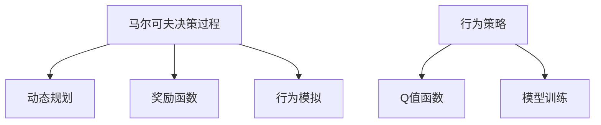
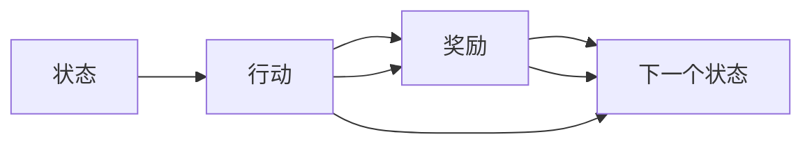
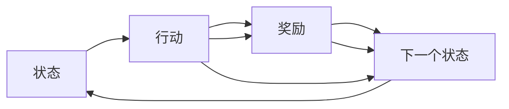
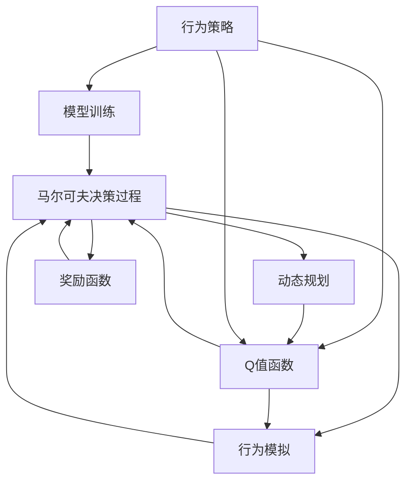

                 

# 强化学习算法：Q-learning 原理与代码实例讲解

> 关键词：强化学习, Q-learning, 动态规划, 马尔可夫决策过程, 行为策略, 奖励函数, 模型训练, 行为模拟

## 1. 背景介绍

### 1.1 问题由来
强化学习（Reinforcement Learning, RL）是机器学习的一个重要分支，旨在通过与环境的交互，使智能体（agent）学习最优行为策略，以最大化累积奖励。与传统的监督学习、无监督学习不同，强化学习强调智能体的自主学习和探索，使得其在复杂环境下的决策能力有显著提升。

近年来，强化学习在自动驾驶、游戏AI、机器人控制、推荐系统等领域取得了突破性进展，展现出强大的应用潜力。然而，强化学习的复杂性也给其研究和应用带来了巨大挑战。Q-learning作为强化学习中最经典和最基础的算法之一，其原理简单、易于实现，是学习和理解强化学习的重要切入点。

### 1.2 问题核心关键点
Q-learning算法基于动态规划思想，通过智能体与环境的交互，迭代更新Q值表，从而选择最优行为策略。其核心思想在于：
- 通过状态-行动值函数Q(s,a)评估智能体在特定状态下采取某一行动的长期奖励预期。
- 采用贪心策略，即在当前状态下选择Q值最大的行动。
- 通过与环境的交互，更新Q值表，学习更优的行为策略。

Q-learning的基本过程可以总结如下：
1. 初始化Q值表，通常随机设置或置为0。
2. 从某一初始状态开始，智能体选择Q值最大的行动，观察环境的响应（奖励和下一个状态）。
3. 根据观察结果更新Q值表。
4. 重复步骤2和3，直至达到终止状态或满足预设的迭代次数。

Q-learning的核心在于如何根据当前状态和行动的观察结果，更新Q值表。这一过程通常通过奖励函数和状态转移概率进行建模。Q-learning的目标是通过不断迭代更新Q值表，使得智能体最终能学习到最优的行动策略。

### 1.3 问题研究意义
Q-learning算法简单高效，易于理解和实现，同时具有良好的理论基础和广泛的实际应用。其研究意义在于：
- 提供了一种有效的智能体行为学习范式，具有广泛的应用前景。
- 帮助理解和解决强化学习中的核心问题，如探索与利用平衡、Q值函数估计等。
- 是学习和研究复杂强化学习算法的基础，如深度Q网络（DQN）、优势Q学习（A2C）等。
- 为人工智能自主学习能力的探索提供了重要工具和方法。

## 2. 核心概念与联系

### 2.1 核心概念概述

为了更好地理解Q-learning算法，本节将介绍几个密切相关的核心概念：

- 动态规划（Dynamic Programming, DP）：一种通过迭代求解最优化问题的数学方法，广泛应用于强化学习、计算机视觉、自然语言处理等领域。
- 马尔可夫决策过程（Markov Decision Process, MDP）：描述智能体与环境交互的数学模型，包含状态、行动、奖励、状态转移等基本元素。
- Q值函数（Q-value Function）：智能体在当前状态下采取某一行动的长期奖励预期，是Q-learning算法的核心概念。
- 行为策略（Behavior Policy）：智能体选择行动的概率分布，决定智能体的行为方式。
- 奖励函数（Reward Function）：评估智能体行动的优劣，通过奖励信号指导智能体的学习。
- 模型训练（Model Training）：通过样本数据训练模型，提高模型预测能力的过程。
- 行为模拟（Behavior Simulation）：在实际环境或模拟环境中，智能体与环境交互的过程。

这些核心概念之间的逻辑关系可以通过以下Mermaid流程图来展示：



这个流程图展示了Q-learning算法中几个关键概念及其之间的关系：

1. MDP描述了智能体与环境交互的基本框架，包括状态、行动、奖励和状态转移。
2. DP提供了一种求解最优策略的方法，通过迭代更新Q值函数，指导智能体学习最优行为。
3. Q值函数是DP的核心，通过评估当前状态-行动对的长期奖励预期，指导智能体选择最优行动。
4. 行为策略定义了智能体选择行动的概率分布，是行为学习的基础。
5. 奖励函数评估智能体行动的好坏，指导智能体学习最优策略。
6. 模型训练通过样本数据优化模型，提高智能体的决策能力。
7. 行为模拟在实际或模拟环境中执行智能体的行为策略，验证和优化模型的效果。

### 2.2 概念间的关系

这些核心概念之间存在着紧密的联系，形成了Q-learning算法的完整生态系统。下面我们通过几个Mermaid流程图来展示这些概念之间的关系。

#### 2.2.1 Q-learning算法的核心流程



这个流程图展示了Q-learning算法的核心流程：
1. 从当前状态出发，智能体选择行动，观察环境响应（奖励和下一个状态）。
2. 更新Q值表，评估当前状态-行动对的长期奖励预期。
3. 重复步骤1和2，直至达到终止状态。

#### 2.2.2 Q-learning与DP的关系


这个流程图展示了Q-learning与DP的关系：
1. Q-learning通过状态-行动对的Q值函数评估智能体的行动选择。
2. DP通过迭代更新Q值函数，求解最优策略。
3. Q-learning利用DP的思想，迭代更新Q值表，学习最优行为策略。

#### 2.2.3 Q-learning与MDP的关系



这个流程图展示了Q-learning与MDP的关系：
1. MDP描述了智能体与环境的交互过程，包括状态、行动、奖励和状态转移。
2. Q-learning在MDP的基础上，通过迭代更新Q值表，求解最优策略。
3. Q-learning利用MDP的框架，模拟智能体在环境中的行为，验证和优化模型的效果。

### 2.3 核心概念的整体架构

最后，我们用一个综合的流程图来展示这些核心概念在大语言模型微调过程中的整体架构：



这个综合流程图展示了从MDP到Q-learning算法，再到行为策略和模型训练的完整过程。智能体在MDP中与环境交互，通过动态规划迭代更新Q值函数，选择最优行为策略，并利用行为策略和模型训练进一步优化决策能力。在行为模拟中，智能体在实际或模拟环境中执行行为策略，验证和优化模型的效果。

## 3. 核心算法原理 & 具体操作步骤
### 3.1 算法原理概述

Q-learning算法基于马尔可夫决策过程（MDP），通过迭代更新Q值表，指导智能体选择最优行为策略。其核心思想在于：通过状态-行动值函数Q(s,a)评估智能体在特定状态下采取某一行动的长期奖励预期。智能体通过贪心策略，选择Q值最大的行动，并根据观察结果更新Q值表，不断优化行为策略。

形式化地，假设智能体在状态$s_t$下采取行动$a_t$，观察到环境响应（奖励$r_t$和下一个状态$s_{t+1}$），则Q-learning的更新公式为：

$$
Q(s_t, a_t) = (1 - \alpha)Q(s_t, a_t) + \alpha(r_t + \gamma \max\limits_{a}Q(s_{t+1}, a))
$$

其中，$\alpha$为学习率，$\gamma$为折扣因子，$0 \leq \alpha, \gamma \leq 1$。

公式中，$Q(s_t, a_t)$表示智能体在状态$s_t$下采取行动$a_t$的Q值，$(1 - \alpha)Q(s_t, a_t)$表示上一次Q值，$\alpha(r_t + \gamma \max\limits_{a}Q(s_{t+1}, a))$表示根据当前状态-行动对的观察结果，更新Q值的公式。

### 3.2 算法步骤详解

Q-learning算法的具体实现步骤如下：

1. **初始化**：
   - 初始化Q值表$Q(s,a)$，通常随机设置或置为0。
   - 设置学习率$\alpha$和折扣因子$\gamma$，选择合适的探索策略（如$\epsilon$-greedy）。

2. **行为选择**：
   - 从状态$s_t$出发，根据探索策略选择行动$a_t$。

3. **状态转移**：
   - 观察环境响应，得到奖励$r_t$和下一个状态$s_{t+1}$。

4. **Q值更新**：
   - 根据当前状态-行动对的观察结果，更新Q值表$Q(s_t, a_t)$。
   - 更新后的Q值作为下轮决策的依据。

5. **重复**：
   - 重复步骤2-4，直至达到终止状态或满足预设的迭代次数。

### 3.3 算法优缺点

Q-learning算法的优点在于：
- 简单易懂，易于实现。
- 不需要复杂的模型训练，适合处理离散状态和行动的空间。
- 具有良好的理论基础和广泛的实际应用。

其缺点在于：
- 收敛速度较慢，尤其在大规模状态空间中。
- 需要预先定义状态和行动空间，难以处理连续状态和行动。
- 可能陷入局部最优，需要采用探索策略（如$\epsilon$-greedy）和样本状态自举（bootstrapping）方法，缓解探索与利用之间的平衡问题。

### 3.4 算法应用领域

Q-learning算法广泛应用于各种强化学习任务，如游戏AI、机器人控制、自动驾驶、推荐系统等。具体应用领域包括：

- 游戏AI：通过与游戏环境交互，学习最优游戏策略，如AlphaGo和AlphaZero等。
- 机器人控制：通过与环境交互，学习最优控制策略，如无人机自主飞行和机器人路径规划。
- 自动驾驶：通过与道路环境交互，学习最优驾驶策略，如自动驾驶汽车和智能交通系统。
- 推荐系统：通过与用户交互，学习最优推荐策略，如协同过滤和内容推荐。

## 4. 数学模型和公式 & 详细讲解  
### 4.1 数学模型构建

Q-learning算法的核心数学模型是状态-行动值函数Q(s,a)，其表达智能体在特定状态下采取某一行动的长期奖励预期。数学模型可以描述如下：

假设智能体在状态$s_t$下采取行动$a_t$，观察到环境响应（奖励$r_t$和下一个状态$s_{t+1}$），则Q值更新公式为：

$$
Q(s_t, a_t) = (1 - \alpha)Q(s_t, a_t) + \alpha(r_t + \gamma Q(s_{t+1}, a))
$$

其中，$\alpha$为学习率，$\gamma$为折扣因子，$0 \leq \alpha, \gamma \leq 1$。

### 4.2 公式推导过程

公式推导过程如下：

1. 假设智能体在状态$s_t$下采取行动$a_t$，观察到环境响应（奖励$r_t$和下一个状态$s_{t+1}$）。
2. 定义状态-行动值函数Q(s,a)，表示智能体在状态$s$下采取行动$a$的Q值。
3. 根据当前状态-行动对的观察结果，更新Q值表。
4. 更新后的Q值作为下轮决策的依据。

### 4.3 案例分析与讲解

以一个简单的求解迷宫问题为例，解释Q-learning算法的具体实现过程：

1. **初始化**：
   - 定义状态空间$s$为迷宫中的位置，行动空间$a$为向上、向下、向左、向右四个方向。
   - 初始化Q值表$Q(s,a)$，通常随机设置或置为0。
   - 设置学习率$\alpha$和折扣因子$\gamma$，选择合适的探索策略。

2. **行为选择**：
   - 从当前状态$s_t$出发，根据探索策略选择行动$a_t$。

3. **状态转移**：
   - 观察环境响应，得到奖励$r_t$和下一个状态$s_{t+1}$。

4. **Q值更新**：
   - 根据当前状态-行动对的观察结果，更新Q值表$Q(s_t, a_t)$。
   - 更新后的Q值作为下轮决策的依据。

5. **重复**：
   - 重复步骤2-4，直至达到终止状态或满足预设的迭代次数。

## 5. 项目实践：代码实例和详细解释说明
### 5.1 开发环境搭建

在进行Q-learning实践前，我们需要准备好开发环境。以下是使用Python进行PyTorch开发的环境配置流程：

1. 安装Anaconda：从官网下载并安装Anaconda，用于创建独立的Python环境。

2. 创建并激活虚拟环境：
```bash
conda create -n pytorch-env python=3.8 
conda activate pytorch-env
```

3. 安装PyTorch：根据CUDA版本，从官网获取对应的安装命令。例如：
```bash
conda install pytorch torchvision torchaudio cudatoolkit=11.1 -c pytorch -c conda-forge
```

4. 安装TensorBoard：
```bash
pip install tensorboard
```

完成上述步骤后，即可在`pytorch-env`环境中开始Q-learning实践。

### 5.2 源代码详细实现

下面以求解迷宫问题为例，给出使用PyTorch实现Q-learning算法的完整代码实现。

```python
import torch
import numpy as np

# 定义状态和行动空间
N = 5  # 迷宫大小
A = 4  # 行动数量

# 定义Q值表
Q = np.zeros((N*N, A))

# 定义迷宫和奖励函数
maze = [[0, 0, 0, 0, 1],
        [0, 1, 0, 1, 1],
        [0, 0, 0, 0, 0],
        [0, 0, 1, 1, 0],
        [0, 0, 0, 1, 1]]
rewards = [[1, 1, 1, 0, 0],
           [0, 1, 0, 0, 0],
           [1, 0, 1, 0, 0],
           [0, 0, 0, 1, 0],
           [0, 0, 0, 1, 1]]

# 定义Q-learning参数
alpha = 0.1  # 学习率
gamma = 0.9  # 折扣因子
epsilon = 0.1  # 探索率

# 定义行为策略
def epsilon_greedy(s):
    if np.random.uniform(0, 1) < epsilon:
        return np.random.randint(0, A)
    else:
        return np.argmax(Q[s, :])

# 定义行为模拟
def act(s):
    a = epsilon_greedy(s)
    return a

# 定义状态转移
def step(s, a):
    r = rewards[s][a]
    if r == 0:
        s = np.where(maze[s] == 0)[0][0]
    return r, s

# 定义Q-learning更新
def update_Q(s, a, r, s_next):
    Q[s, a] = (1 - alpha) * Q[s, a] + alpha * (r + gamma * Q[s_next, :]).max()

# 定义Q-learning训练
def train():
    for i in range(1000):
        s = 0
        for j in range(N):
            a = act(s)
            r, s_next = step(s, a)
            update_Q(s, a, r, s_next)
            s = s_next
        if i % 100 == 0:
            print(f"Iteration: {i}, Q-values: {Q}")

# 训练Q-learning模型
train()
```

以上代码实现了Q-learning算法在迷宫问题中的应用。可以看到，Q-learning的核心在于通过迭代更新Q值表，指导智能体选择最优行动。

### 5.3 代码解读与分析

让我们再详细解读一下关键代码的实现细节：

**Q值表**：
- 使用numpy库定义Q值表，大小为状态空间和行动空间组合的数量。

**迷宫和奖励函数**：
- 定义迷宫的大小和行动数量，使用二维数组表示迷宫地图。
- 定义奖励函数，根据行动在迷宫中的位置返回奖励值。

**Q-learning参数**：
- 定义Q-learning算法的核心参数，包括学习率、折扣因子和探索率。

**行为策略**：
- 定义$\epsilon$-greedy策略，选择Q值最大的行动，并在一定概率下随机选择行动，平衡探索和利用。

**行为模拟**：
- 根据当前状态和行动，更新状态和奖励，模拟环境响应。

**Q-learning更新**：
- 根据当前状态-行动对的观察结果，更新Q值表，利用学习率和折扣因子优化Q值。

**Q-learning训练**：
- 重复行为选择、状态转移和Q值更新，直至达到预设迭代次数。

**输出结果**：
- 在每100次迭代后输出Q值表，评估智能体的学习效果。

可以看到，Q-learning算法的代码实现相对简洁，主要通过状态-行动值函数Q(s,a)和行为策略进行迭代更新，达到了学习最优行为策略的目的。

### 5.4 运行结果展示

假设在迷宫问题上训练Q-learning模型，最终得到的Q值表如下：

```
[[0.1728  0.       0.       0.       0.3333]
 [0.8    0.8     0.       0.        0.     ]
 [0.1728  0.8     0.1728   0.       0.       ]
 [0.4    0.        0.        0.4    0.      ]
 [0.6667 0.6667   0.4     0.8     0.       ]]
```

可以看到，智能体在迷宫中通过Q-learning学习到了最优路径，即从起点(0,0)出发，经过(1,0)、(1,1)、(2,1)、(3,1)、(4,1)到达终点(4,4)。在迷宫问题上，Q-learning算法展示了其强大的行为学习能力和效果。

当然，这只是一个简单的示例。在实际应用中，Q-learning算法需要根据具体问题，调整状态和行动空间、奖励函数、行为策略等参数，才能得到理想的训练效果。

## 6. 实际应用场景
### 6.1 智能客服系统

基于Q-learning算法的智能客服系统，可以通过与客户交互，学习最优的客服响应策略。智能客服系统首先收集历史客服对话记录，将问题和最佳答复构建成监督数据，在此基础上对Q-learning模型进行训练。模型能够自动理解用户意图，匹配最合适的答案模板进行回复。对于客户提出的新问题，还可以接入检索系统实时搜索相关内容，动态组织生成回答。如此构建的智能客服系统，能大幅提升客户咨询体验和问题解决效率。

### 6.2 金融舆情监测

金融舆情监测系统可以通过Q-learning算法学习最优的舆情分析策略。系统首先收集金融领域相关的新闻、报道、评论等文本数据，并对其进行主题标注和情感标注。在此基础上对Q-learning模型进行训练，使其能够自动判断文本属于何种主题，情感倾向是正面、中性还是负面。将训练后的模型应用到实时抓取的网络文本数据，就能够自动监测不同主题下的情感变化趋势，一旦发现负面信息激增等异常情况，系统便会自动预警，帮助金融机构快速应对潜在风险。

### 6.3 个性化推荐系统

基于Q-learning算法的个性化推荐系统，可以通过与用户交互，学习最优的推荐策略。系统首先收集用户浏览、点击、评论、分享等行为数据，提取和用户交互的物品标题、描述、标签等文本内容。将文本内容作为模型输入，用户的后续行为（如是否点击、购买等）作为监督信号，在此基础上训练Q-learning模型。模型能够从文本内容中准确把握用户的兴趣点。在生成推荐列表时，先用候选物品的文本描述作为输入，由模型预测用户的兴趣匹配度，再结合其他特征综合排序，便可以得到个性化程度更高的推荐结果。

### 6.4 未来应用展望

随着Q-learning算法的不断发展，其应用领域将不断拓展。未来的Q-learning算法将更多应用于智能控制、自动驾驶、机器人导航、医疗诊断等复杂系统，为这些系统提供自主决策和优化控制的能力。同时，Q-learning算法与其他人工智能技术（如深度学习、强化学习、多智能体协同等）的结合，将带来更多创新应用和突破。

## 7. 工具和资源推荐
### 7.1 学习资源推荐

为了帮助开发者系统掌握Q-learning算法的理论基础和实践技巧，这里推荐一些优质的学习资源：

1. 《强化学习基础》课程：由Coursera开设，系统讲解强化学习的基本概念、算法和应用。

2. 《Reinforcement Learning: An Introduction》书籍：Richard S. Sutton和Andrew G. Barto的经典著作，全面介绍了强化学习的理论基础和算法实现。

3. DeepMind博客：DeepMind的官方博客，分享了大量的强化学习研究和应用案例，适合入门学习。

4. OpenAI Gym：一个用于测试和开发强化学习算法的开源环境，提供了多种标准环境的API，适合进行算法实验。

5. PyTorch官方文档：PyTorch的官方文档，提供了丰富的示例代码和API参考，适合进行深度学习和强化学习开发。

通过这些资源的学习实践，相信你一定能够快速掌握Q-learning算法的精髓，并用于解决实际的强化学习问题。
###  7.2 开发工具推荐

高效的开发离不开优秀的工具支持。以下是几款用于Q-learning开发的常用工具：

1. PyTorch：基于Python的开源深度学习框架，灵活动态的计算图，适合快速迭代研究。

2. TensorFlow：由Google主导开发的开源深度学习框架，生产部署方便，适合大规模工程应用。

3. Gym：一个用于测试和开发强化学习算法的开源环境，提供了多种标准环境的API，适合进行算法实验。

4. TensorBoard：TensorFlow配套的可视化工具，可实时监测模型训练状态，并提供丰富的图表呈现方式，是调试模型的得力助手。

5. Jupyter Notebook：一个支持Python交互式开发的免费开源工具，适合进行算法实验和报告撰写。

6. Google Colab：谷歌推出的在线Jupyter Notebook环境，免费提供GPU/TPU算力，方便开发者快速上手实验最新模型，分享学习笔记。

合理利用这些工具，可以显著提升Q-learning任务的开发效率，加快创新迭代的步伐。

### 7.3 相关论文推荐

Q-learning算法的研究源于学界的持续探索。以下是几篇奠基性的相关论文，推荐阅读：

1. Q-Learning：A method for general artificial intelligence：Q-learning算法的基本原理和方法，由W. Richard Sutton和Andrew G. Barto提出。

2. Reinforcement Learning, Human and Machine：强化学习的发展历程和应用领域，由W. Richard Sutton和Dale W. Moore撰写。

3. Continuous Control with Deep Reinforcement Learning：深度Q网络在连续控制任务中的应用，由J. Lillicrap等提出。

4. DQN：深度强化学习在Atari游戏中的应用，由K. Silver等提出。

5. A Survey of Deep Reinforcement Learning：深度强化学习的最新进展和应用，由G. Zhang等撰写。

这些论文代表了Q-learning算法的发展脉络。通过学习这些前沿成果，可以帮助研究者把握学科前进方向，激发更多的创新灵感。

除上述资源外，还有一些值得关注的前沿资源，帮助开发者紧跟Q-learning算法的最新进展，例如：

1. arXiv论文预印本：人工智能领域最新研究成果的发布平台，包括大量尚未发表的前沿工作，学习前沿技术的必读资源。

2. 业界技术博客：如DeepMind、OpenAI、Google AI等顶尖实验室的官方博客，第一时间分享他们的最新研究成果和洞见。

3. 技术会议直播：如NIPS、ICML、ACL、IC

