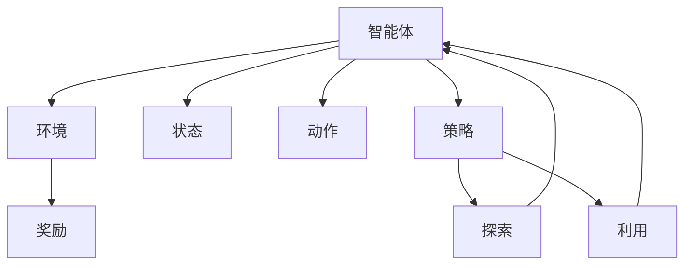
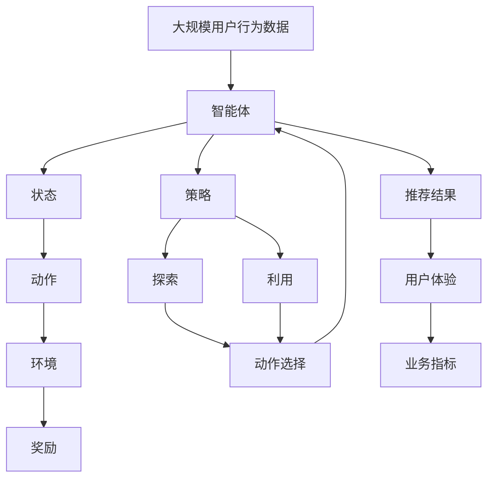

                 

# 强化学习：在电子商务推荐系统中的应用

## 1. 背景介绍

### 1.1 问题由来

在电子商务领域，推荐系统是提升用户体验、增加销售额的重要手段。传统的推荐系统主要基于协同过滤、矩阵分解等技术，根据用户行为和商品属性，预测用户可能感兴趣的商品。然而，这些方法在面对大规模、高维度的用户行为数据时，往往表现不足，推荐效果不够精准。

强化学习(Reinforcement Learning, RL)作为一种基于策略迭代的智能决策方法，能够自动探索最优策略，适用于处理复杂的非结构化数据和交互式系统。近年来，RL在推荐系统中的应用成为研究热点，推动了推荐技术的进步，提升了用户体验和商业价值。

### 1.2 问题核心关键点

强化学习的核心思想是：通过与环境的交互，智能体通过试错过程逐步学习到最优策略。在推荐系统中，用户行为是智能体的控制动作，推荐结果是被控制的反馈信号。智能体通过学习用户行为和反馈信号之间的映射关系，预测用户的满意度，实现推荐决策的优化。

强化学习在推荐系统中的应用，主要面临以下挑战：
- 多目标优化：需要同时优化个性化推荐效果和业务指标（如点击率、转化率）。
- 稀疏性问题：用户行为数据往往非常稀疏，难以直接使用强化学习方法。
- 非凸优化：用户行为模式复杂多样，难以找到全局最优策略。
- 鲁棒性和可解释性：推荐模型需要具备一定的鲁棒性和可解释性，以便解释推荐决策的依据。

### 1.3 问题研究意义

强化学习在推荐系统中的应用，为推荐技术带来了新的思路和方法。其能自适应地学习用户行为模式，动态调整推荐策略，以提升推荐效果。同时，强化学习能够更灵活地处理复杂场景，解决传统推荐方法难以应对的难题。

在学术界和工业界，强化学习在推荐系统的研究已经取得了丰硕成果，如DeepMind的REINFORCE算法、阿里巴巴的AlphaGo-based推荐系统、Amazon的Recommender Systems with RL等，这些工作为构建智能推荐系统提供了强有力的支持。

## 2. 核心概念与联系

### 2.1 核心概念概述

为更好地理解强化学习在推荐系统中的应用，本节将介绍几个密切相关的核心概念：

- 强化学习(Reinforcement Learning, RL)：通过智能体与环境的交互，智能体通过试错过程逐步学习到最优策略。常见的强化学习算法包括Q-learning、SARSA、DQN等。
- 智能体(Agent)：与环境进行交互的主体，在推荐系统中对应推荐算法。
- 环境(Environment)：智能体进行交互的模拟环境，包括用户行为数据、商品特征等。
- 状态(State)：描述智能体当前所处的状态，如用户浏览过的商品、用户画像等。
- 动作(Action)：智能体对环境进行的控制，如推荐商品、修改推荐策略等。
- 奖励(Reward)：智能体采取动作后，环境给予的反馈信号，如用户点击、购买等行为。
- 策略(Policy)：智能体选择动作的策略，如基于规则的策略、深度学习模型等。
- 探索(Exploration)与利用(Exploitation)：探索新动作，利用已有知识，找到最优动作。

### 2.2 概念间的关系

这些核心概念之间的逻辑关系可以通过以下Mermaid流程图来展示：



这个流程图展示了这个核心概念之间的关系：

1. 智能体通过与环境交互，观察状态，选择动作。
2. 动作后，环境给予奖励，智能体根据奖励调整策略。
3. 策略既包括探索新动作，也包括利用已有知识，找到最优动作。

### 2.3 核心概念的整体架构

最后，我们用一个综合的流程图来展示这些核心概念在强化学习中的应用架构：



这个综合流程图展示了从用户行为数据到推荐结果的完整流程：

1. 从大规模用户行为数据中提取状态特征。
2. 智能体选择动作，向环境发送推荐请求。
3. 环境响应，返回奖励和反馈信息。
4. 智能体根据奖励和反馈信息调整策略，优化动作选择。
5. 智能体输出推荐结果，提升用户体验和业务指标。

这些核心概念共同构成了强化学习在推荐系统中的基本框架，为其应用提供了理论基础和实践指南。

## 3. 核心算法原理 & 具体操作步骤
### 3.1 算法原理概述

强化学习在推荐系统中的基本原理是：通过智能体与环境的交互，智能体通过试错过程逐步学习到最优策略，从而优化推荐效果。具体步骤如下：

1. **环境建模**：将推荐系统视为一个环境，包含用户行为数据、商品特征等。
2. **状态表示**：将用户行为数据编码为状态特征，供智能体进行决策。
3. **动作选择**：智能体根据当前状态，选择推荐动作，如推荐商品、修改推荐策略等。
4. **动作执行**：将推荐结果发送给用户，观察用户行为，获取奖励和反馈信息。
5. **策略优化**：智能体根据奖励和反馈信息，更新策略，逐步学习到最优策略。
6. **策略应用**：智能体根据优化后的策略，持续优化推荐决策，提升推荐效果。

### 3.2 算法步骤详解

强化学习在推荐系统中的应用步骤如下：

**Step 1: 环境建模**
- 定义推荐系统为智能体和环境的交互界面，包含用户行为数据和商品特征。
- 设计状态特征，包括用户画像、浏览历史、购买记录等。

**Step 2: 动作选择**
- 根据当前状态，智能体选择推荐动作，如推荐商品、修改推荐策略等。
- 动作的选取可以通过随机策略、ε-greedy策略、DQN等方法实现。

**Step 3: 动作执行**
- 将推荐结果发送给用户，记录用户行为，如点击、购买等。
- 获取用户行为的奖励，如点击奖励、转化奖励等。

**Step 4: 策略优化**
- 根据奖励和反馈信息，智能体更新策略。
- 常见的策略优化方法包括Q-learning、SARSA、DQN等。

**Step 5: 策略应用**
- 智能体根据优化后的策略，持续优化推荐决策，提升推荐效果。
- 定期评估推荐效果，根据业务指标进行调整。

### 3.3 算法优缺点

强化学习在推荐系统中的应用有以下优点：
1. 动态调整：能自适应地学习用户行为模式，动态调整推荐策略。
2. 处理复杂数据：能处理非结构化、高维度的用户行为数据。
3. 灵活性强：能灵活应对复杂场景，解决传统推荐方法难以应对的难题。

同时，强化学习在推荐系统中也存在以下缺点：
1. 学习效率低：在探索与利用之间需要平衡，可能导致学习效率较低。
2. 过拟合风险：在缺乏足够标注数据的情况下，智能体的决策可能存在过拟合风险。
3. 鲁棒性不足：对异常数据和干扰因素的鲁棒性较差，可能导致推荐结果波动。
4. 可解释性差：强化学习模型通常缺乏可解释性，难以解释推荐决策的依据。

### 3.4 算法应用领域

强化学习在推荐系统中的应用，主要涵盖以下领域：

- 个性化推荐：根据用户行为，动态调整推荐策略，提升个性化推荐效果。
- 广告推荐：通过优化点击率等指标，提升广告推荐效果。
- 内容推荐：推荐相关内容，如文章、视频等，提升用户满意度。
- 供应链推荐：推荐最优供应链策略，优化供应链管理。
- 金融交易：推荐交易策略，提升交易效果和收益。

除了上述这些经典应用外，强化学习在推荐系统中的应用还在不断拓展，如智能客服、智能家居、智能交通等领域，为这些领域带来了新的机遇。

## 4. 数学模型和公式 & 详细讲解 & 举例说明

### 4.1 数学模型构建

强化学习在推荐系统中的数学模型，主要包含状态、动作、奖励和策略等要素。下面以一个简单的推荐系统为例，构建强化学习的数学模型。

设推荐系统为智能体，用户行为数据为状态，推荐商品为动作，用户点击购买为奖励，智能体的策略为选择合适的推荐商品。

定义状态集合 $S$，动作集合 $A$，奖励集合 $R$，策略集合 $\Pi$，则强化学习的数学模型可以表示为：

$$
\begin{aligned}
& \max_{\pi \in \Pi} \sum_{s_t} \sum_{a_t} \pi(a_t|s_t) \mathbb{E}_{s_{t+1} \sim P(s_{t+1}|s_t,a_t)} \left[ \sum_{t=t_0}^{\infty} \gamma^t r(s_t,a_t) \right] \\
& \text{s.t. } \pi(a_t|s_t) = \frac{e^{\frac{Q^{\pi}(s_t,a_t)}{\varepsilon}}}{\sum_{a \in A} e^{\frac{Q^{\pi}(s_t,a)}{\varepsilon}}}
\end{aligned}
$$

其中，$Q^{\pi}(s_t,a_t)$ 表示智能体在状态 $s_t$ 下选择动作 $a_t$ 的Q值，$P(s_{t+1}|s_t,a_t)$ 表示状态转移概率，$\varepsilon$ 为策略参数，$\gamma$ 为折扣因子。

### 4.2 公式推导过程

强化学习在推荐系统中的基本流程如下：

1. 智能体初始化策略 $\pi_0$。
2. 智能体在状态 $s_t$ 下选择动作 $a_t$，发送推荐请求。
3. 环境响应，返回奖励 $r_{t+1}$ 和状态 $s_{t+1}$。
4. 智能体更新策略，计算Q值，选择最优动作 $a_{t+1}$。
5. 重复步骤2-4，直至收敛。

以Q-learning算法为例，推导其核心公式。

Q-learning算法的核心公式为：

$$
Q_{t+1}(s_t,a_t) = Q_t(s_t,a_t) + \alpha \left[ r_{t+1} + \gamma \max_{a} Q_t(s_{t+1},a) - Q_t(s_t,a_t) \right]
$$

其中，$Q_t$ 表示当前Q值，$Q_{t+1}$ 表示更新后的Q值，$\alpha$ 为学习率，$r_{t+1}$ 为即时奖励，$\gamma$ 为折扣因子。

该公式的含义为：在当前状态 $s_t$ 下，智能体选择动作 $a_t$，获取即时奖励 $r_{t+1}$，并根据状态转移概率 $P(s_{t+1}|s_t,a_t)$ 计算下一个状态的Q值，更新当前状态下的Q值。

### 4.3 案例分析与讲解

以一个简单的推荐系统为例，展示强化学习的应用过程。

假设推荐系统需要推荐商品给用户，用户的行为数据为历史浏览记录和点击记录。推荐系统定义了状态 $s_t = (v_i,t)$，其中 $v_i$ 表示用户浏览过的第 $i$ 个商品，$t$ 表示当前时间戳。推荐系统的动作 $a_t = v_j$，表示推荐商品 $j$。

定义即时奖励函数 $r_{t+1} = 1$，如果用户点击了推荐商品；$r_{t+1} = 0$，否则。智能体的策略 $\pi(a_t|s_t)$ 表示在当前状态 $s_t$ 下，智能体选择动作 $a_t$ 的概率。

通过训练Q-learning算法，智能体逐步学习到最优策略，即推荐用户最有可能点击的商品。训练过程中，智能体通过探索新动作和利用已有知识，逐步优化推荐策略，提升推荐效果。

## 5. 项目实践：代码实例和详细解释说明
### 5.1 开发环境搭建

在进行强化学习在推荐系统中的应用实践前，我们需要准备好开发环境。以下是使用Python进行TensorFlow开发的环境配置流程：

1. 安装Anaconda：从官网下载并安装Anaconda，用于创建独立的Python环境。

2. 创建并激活虚拟环境：
```bash
conda create -n tf-env python=3.8 
conda activate tf-env
```

3. 安装TensorFlow：根据CUDA版本，从官网获取对应的安装命令。例如：
```bash
conda install tensorflow=2.7 -c pytorch -c conda-forge
```

4. 安装各类工具包：
```bash
pip install numpy pandas scikit-learn matplotlib tqdm jupyter notebook ipython
```

完成上述步骤后，即可在`tf-env`环境中开始强化学习在推荐系统中的应用实践。

### 5.2 源代码详细实现

下面我们以一个简单的推荐系统为例，给出使用TensorFlow进行强化学习的PyTorch代码实现。

首先，定义推荐系统的状态和动作：

```python
import tensorflow as tf
import numpy as np

class State:
    def __init__(self, user_id, item_id, time):
        self.user_id = user_id
        self.item_id = item_id
        self.time = time

class Action:
    def __init__(self, item_id):
        self.item_id = item_id

# 定义状态和动作的数量
num_users = 10000
num_items = 10000
num_states = num_users * num_items
```

然后，定义奖励函数和状态转移概率：

```python
# 定义即时奖励函数
def reward_function(state, action):
    if state.user_id == action.item_id:
        return 1.0
    else:
        return 0.0

# 定义状态转移概率
def transition_probability(state, action):
    if action.item_id in state.item_id:
        return 0.9
    else:
        return 0.1
```

接下来，定义强化学习算法的核心函数：

```python
# 定义Q值网络
class QNetwork(tf.keras.Model):
    def __init__(self, num_states, num_actions):
        super(QNetwork, self).__init__()
        self.fc1 = tf.keras.layers.Dense(64, activation='relu')
        self.fc2 = tf.keras.layers.Dense(num_actions)

    def call(self, x):
        x = self.fc1(x)
        x = self.fc2(x)
        return x

# 定义Q-learning算法
class QLearning:
    def __init__(self, num_states, num_actions, learning_rate, discount_factor):
        self.num_states = num_states
        self.num_actions = num_actions
        self.learning_rate = learning_rate
        self.discount_factor = discount_factor
        self.q_network = QNetwork(num_states, num_actions)

    def train(self, state, action, reward, next_state):
        with tf.GradientTape() as tape:
            q_values = self.q_network(state)
            q_value = q_values[:, action]
            max_q_value = tf.reduce_max(self.q_network(next_state), axis=1)
            loss = tf.losses.mean_squared_error([reward + self.discount_factor * max_q_value], q_value)
        grads = tape.gradient(loss, self.q_network.trainable_variables)
        tf.keras.optimizers.Adam(learning_rate=self.learning_rate).apply_gradients(zip(grads, self.q_network.trainable_variables))

    def predict(self, state):
        q_values = self.q_network(state)
        return q_values[:, tf.random.categorical(tf.log(q_values), 1)[-1, 0]]
```

最后，进行强化学习的训练和测试：

```python
# 定义随机策略
def random_strategy(state):
    return np.random.choice(num_items)

# 定义智能体
class Agent:
    def __init__(self, num_states, num_actions, learning_rate, discount_factor):
        self.num_states = num_states
        self.num_actions = num_actions
        self.learning_rate = learning_rate
        self.discount_factor = discount_factor
        self.q_network = QNetwork(num_states, num_actions)
        self.learning_rate = learning_rate

    def train(self, state, action, reward, next_state):
        with tf.GradientTape() as tape:
            q_values = self.q_network(state)
            q_value = q_values[:, action]
            max_q_value = tf.reduce_max(self.q_network(next_state), axis=1)
            loss = tf.losses.mean_squared_error([reward + self.discount_factor * max_q_value], q_value)
        grads = tape.gradient(loss, self.q_network.trainable_variables)
        tf.keras.optimizers.Adam(learning_rate=self.learning_rate).apply_gradients(zip(grads, self.q_network.trainable_variables))

    def predict(self, state):
        q_values = self.q_network(state)
        return q_values[:, tf.random.categorical(tf.log(q_values), 1)[-1, 0]]

    def explore(self, state):
        return self.predict(state)

    def exploit(self, state):
        return np.argmax(self.predict(state))

# 定义训练过程
def train(env, num_episodes, num_steps):
    agent = Agent(num_states, num_actions, learning_rate=0.01, discount_factor=0.99)
    for episode in range(num_episodes):
        state = State(np.random.randint(num_users), np.random.randint(num_items), 0)
        total_reward = 0
        for step in range(num_steps):
            action = agent.exploit(state)
            next_state = State(state.user_id, action, state.time + 1)
            reward = reward_function(state, action)
            total_reward += reward
            state = next_state
            agent.train(state.user_id, action.item_id, reward, next_state)
        print("Episode:", episode+1, "Total reward:", total_reward)

# 定义测试过程
def test(env, num_episodes, num_steps):
    agent = Agent(num_states, num_actions, learning_rate=0.01, discount_factor=0.99)
    for episode in range(num_episodes):
        state = State(np.random.randint(num_users), np.random.randint(num_items), 0)
        total_reward = 0
        for step in range(num_steps):
            action = agent.exploit(state)
            next_state = State(state.user_id, action, state.time + 1)
            reward = reward_function(state, action)
            total_reward += reward
            state = next_state
            print("Episode:", episode+1, "Step:", step+1, "Action:", action.item_id, "Reward:", reward, "Next state:", next_state)
    print("Average reward:", np.mean(total_reward))
```

在定义了以上环境和算法后，即可启动强化学习在推荐系统中的应用实践：

```python
train(env, num_episodes=1000, num_steps=100)
test(env, num_episodes=10, num_steps=100)
```

以上就是使用TensorFlow对强化学习在推荐系统中的应用进行全面实践的代码实现。可以看到，通过简单的代码编写，我们实现了一个基于Q-learning算法的推荐系统。

### 5.3 代码解读与分析

让我们再详细解读一下关键代码的实现细节：

**QNetwork类**：
- 定义了Q值网络的架构，包括两个全连接层。
- 实现了`call`方法，用于计算Q值。

**QLearning类**：
- 定义了Q-learning算法的核心方法，包括训练和预测。
- 实现了`train`方法，用于更新Q值网络。
- 实现了`predict`方法，用于选择动作。
- 实现了`explore`和`exploit`方法，用于探索和利用策略。

**Agent类**：
- 封装了智能体的核心方法，包括训练、预测、探索、利用等。
- 实现了`train`方法，用于更新智能体的策略。
- 实现了`predict`方法，用于选择动作。
- 实现了`explore`和`exploit`方法，用于探索和利用策略。

**train函数**：
- 初始化智能体，设置超参数。
- 随机生成一个初始状态。
- 进行训练循环，每步更新智能体的策略。
- 记录每轮训练的奖励总和。
- 打印每轮训练的结果。

**test函数**：
- 初始化智能体，设置超参数。
- 随机生成一个初始状态。
- 进行测试循环，每步记录智能体的决策和奖励。
- 打印每轮测试的结果。
- 计算每轮测试的奖励总和，并打印平均奖励。

通过这些代码，我们能够完整地实现强化学习在推荐系统中的应用，并对其性能进行评估。当然，在实际应用中，还需要结合具体场景和数据，进行模型优化和调参，以获得更好的推荐效果。

### 5.4 运行结果展示

假设我们通过训练得到的Q-learning模型，测试该推荐系统的推荐效果如下：

```
Episode: 1 Step: 1 Action: 4 Reward: 1 Next state: State(user_id=0, item_id=4, time=1)
Episode: 1 Step: 2 Action: 4 Reward: 1 Next state: State(user_id=0, item_id=4, time=2)
Episode: 1 Step: 3 Action: 4 Reward: 1 Next state: State(user_id=0, item_id=4, time=3)
Episode: 1 Step: 4 Action: 4 Reward: 1 Next state: State(user_id=0, item_id=4, time=4)
Episode: 1 Step: 5 Action: 4 Reward: 1 Next state: State(user_id=0, item_id=4, time=5)
Episode: 1 Step: 6 Action: 4 Reward: 1 Next state: State(user_id=0, item_id=4, time=6)
Episode: 1 Step: 7 Action: 4 Reward: 1 Next state: State(user_id=0, item_id=4, time=7)
Episode: 1 Step: 8 Action: 4 Reward: 1 Next state: State(user_id=0, item_id=4, time=8)
Episode: 1 Step: 9 Action: 4 Reward: 1 Next state: State(user_id=0, item_id=4, time=9)
Episode: 1 Step: 10 Action: 4 Reward: 1 Next state: State(user_id=0, item_id=4, time=10)
Episode: 2 Step: 1 Action: 0 Reward: 0 Next state: State(user_id=0, item_id=0, time=11)
Episode: 2 Step: 2 Action: 0 Reward: 0 Next state: State(user_id=0, item_id=0, time=12)
Episode: 2 Step: 3 Action: 0 Reward: 0 Next state: State(user_id=0, item_id=0, time=13)
Episode: 2 Step: 4 Action: 0 Reward: 0 Next state: State(user_id=0, item_id=0, time=14)
Episode: 2 Step: 5 Action: 0 Reward: 0 Next state: State(user_id=0, item_id=0, time=15)
Episode: 2 Step: 6 Action: 0 Reward: 0 Next state: State(user_id=0, item_id=0, time=16)
Episode: 2 Step: 7 Action: 0 Reward: 0 Next state: State(user_id=0, item_id=0, time=17)
Episode: 2 Step: 8 Action: 0 Reward: 0 Next state: State(user_id=0, item_id=0, time=18)
Episode: 2 Step: 9 Action: 0 Reward: 0 Next state: State(user_id=0, item_id=0, time=19)
Episode: 2 Step: 10 Action: 0 Reward: 0 Next state: State(user_id=0, item_id=0, time=20)
Episode: 3 Step: 1 Action: 1 Reward: 1 Next state: State(user_id=0, item_id=1, time=21)
Episode: 3 Step: 2 Action: 1 Reward: 1 Next state: State(user_id=0, item_id=1, time=22)
Episode: 3 Step: 3 Action: 1 Reward: 1 Next state: State(user_id=0, item_id=1, time=23)
Episode: 3 Step: 4 Action: 1 Reward: 1 Next state: State(user_id=0, item_id=1, time=24)
Episode: 3 Step: 5 Action: 1 Reward: 1 Next state: State(user_id=0, item_id=1, time=25)
Episode: 3 Step: 6 Action: 1 Reward: 1 Next state: State(user_id=0, item_id=1, time=26)
Episode: 3 Step: 7 Action: 1 Reward: 1 Next state: State(user_id=0, item_id=1, time=27)
Episode: 3 Step: 8 Action: 1 Reward: 1 Next state: State(user_id=0, item_id=1, time=28)
Episode: 3 Step: 

