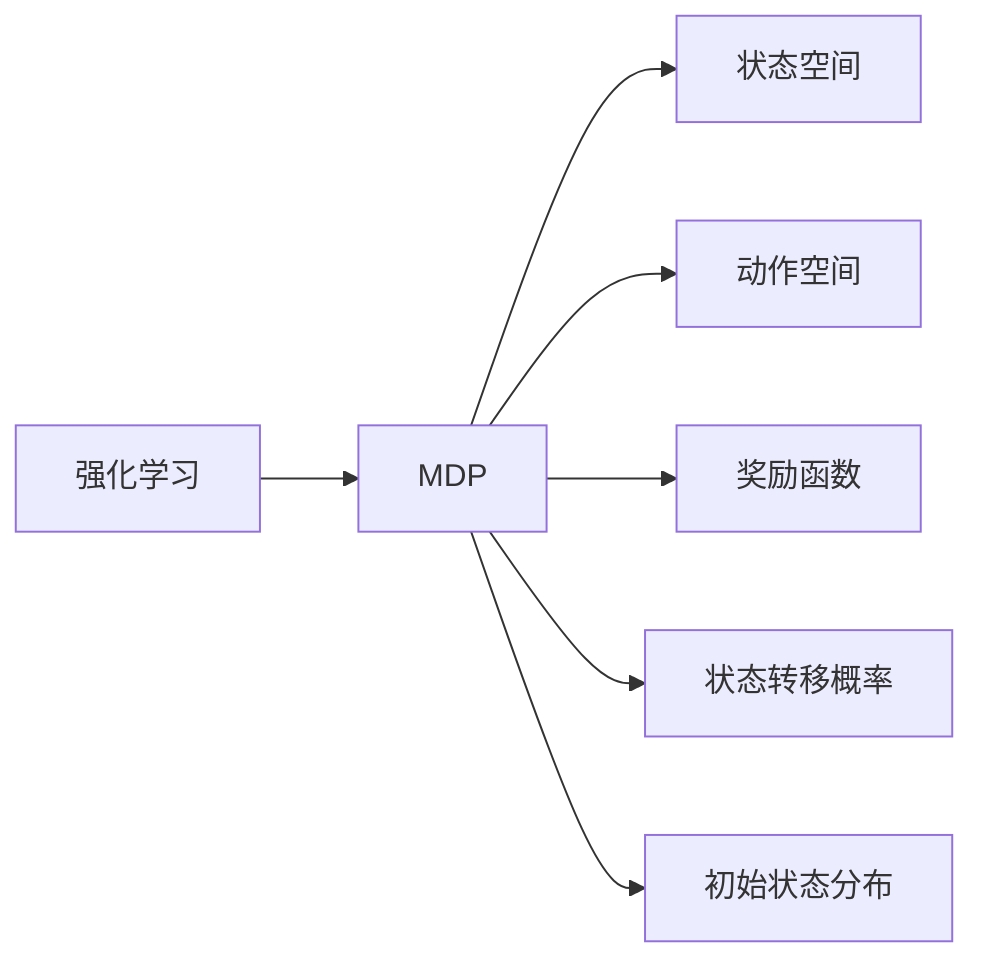
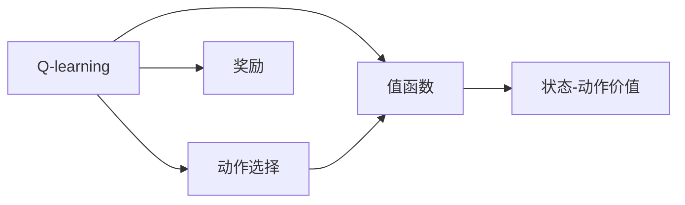
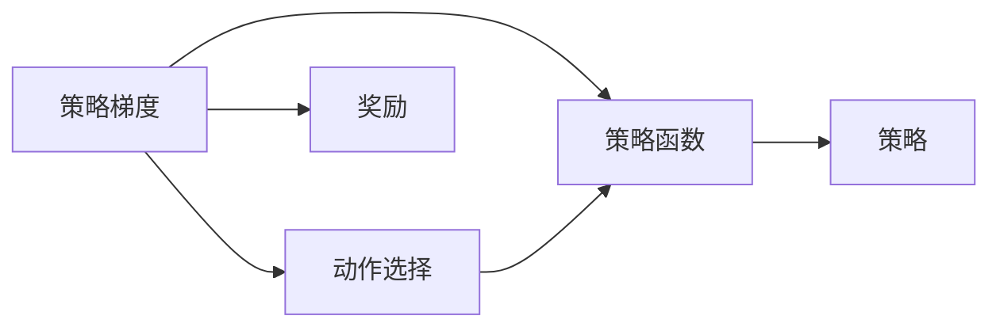
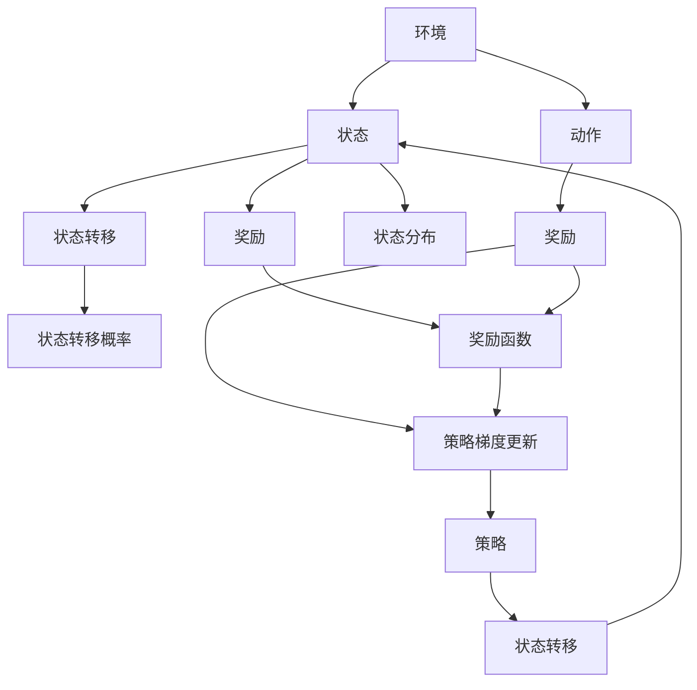

                 

# 强化学习：基础概念解析

> 关键词：强化学习,深度强化学习,马尔可夫决策过程(MDP),Q-learning,策略梯度,深度Q网络,分布式强化学习,混合智能,机器人控制,游戏AI

## 1. 背景介绍

### 1.1 问题由来
强化学习(Reinforcement Learning, RL)作为机器学习的重要分支，近年来在各个领域（如机器人控制、游戏AI、金融投资等）取得了一系列突破性进展。强化学习旨在通过与环境的交互，学习最优决策策略，从而实现目标。

与监督学习和无监督学习不同，强化学习的目标不是直接从输入数据中学习标签，而是从输入动作和反馈中学习策略。这种学习方式更符合现实世界中的决策问题，例如在游戏中选择动作，或者在控制机器人时调整操作。

### 1.2 问题核心关键点
强化学习问题的核心是设计一个策略（Policy），使得在给定的环境（Environment）下，最大化总奖励（Reward）。具体来说，强化学习需要解决以下几个关键问题：
1. 状态（State）空间：环境的所有可能状态是什么，这些状态如何表示。
2. 动作（Action）空间：在每个状态下可执行的动作有哪些，这些动作如何表示。
3. 奖励函数（Reward Function）：环境如何评估一个动作的好坏，即如何定义奖励函数。
4. 策略（Policy）：选择动作的规则，即在每个状态下如何决定执行哪个动作。
5. 价值函数（Value Function）：评估每个状态的期望奖励或动作的期望回报。

### 1.3 问题研究意义
强化学习的研究不仅具有理论意义，还能推动各行业的技术发展。例如：
- 在机器人控制中，强化学习可以使得机器人通过与环境的交互，学习最优的控制策略，从而完成复杂任务。
- 在游戏AI中，强化学习可以训练AI选手，在围棋、星际争霸等游戏中取得优异表现。
- 在金融投资中，强化学习可以优化投资策略，实现自动交易。

## 2. 核心概念与联系

### 2.1 核心概念概述

为了更好地理解强化学习的核心概念，本节将介绍几个密切相关的核心概念：

- **马尔可夫决策过程(MDP)**：强化学习中的基本模型框架。MDP由状态（State）、动作（Action）、奖励（Reward）、状态转移概率（Transition Probability）和状态分布（Initial State Distribution）组成。
- **Q-learning**：一种基于值函数的强化学习算法，通过估计状态-动作对的价值（Q-value）来学习最优策略。
- **策略梯度（Policy Gradient）**：一种直接优化策略函数的强化学习算法，通过梯度上升策略函数来学习最优策略。
- **深度Q网络（DQN）**：结合深度神经网络和Q-learning算法的强化学习框架，能够处理大规模的状态空间和高维度的动作空间。
- **分布式强化学习**：通过多台机器并行训练，加速强化学习过程，提高计算效率和模型稳定性。

这些核心概念之间的逻辑关系可以通过以下Mermaid流程图来展示：

```mermaid
graph TB
    A[马尔可夫决策过程(MDP)] --> B[Q-learning]
    A --> C[策略梯度(Policy Gradient)]
    A --> D[深度Q网络(DQN)]
    B --> E[值函数]
    C --> F[策略函数]
    D --> G[深度神经网络]
    E --> H[状态-动作价值]
    F --> I[策略梯度更新]
    G --> I
    I --> J[策略]
    J --> K[分布式训练]
```

这个流程图展示强化学习的核心概念及其之间的关系：

1. 强化学习的核心模型框架是MDP。
2. Q-learning和策略梯度是两种主要的强化学习算法。
3. 深度Q网络将深度学习与Q-learning结合，适用于大规模问题。
4. 值函数和策略函数是强化学习中常见的优化目标。
5. 策略梯度更新基于策略函数，通过梯度上升优化策略。
6. 分布式训练通过多台机器并行，加速强化学习过程。

### 2.2 概念间的关系

这些核心概念之间存在着紧密的联系，形成了强化学习的完整生态系统。下面我们通过几个Mermaid流程图来展示这些概念之间的关系。

#### 2.2.1 强化学习与MDP的关系



这个流程图展示了强化学习与MDP的关系。强化学习通过MDP模型框架，定义环境的状态、动作、奖励、转移概率和初始状态分布。

#### 2.2.2 Q-learning与值函数的关系



这个流程图展示了Q-learning与值函数的关系。Q-learning通过估计状态-动作对的价值（Q-value）来选择一个最优动作，并更新值函数。

#### 2.2.3 策略梯度与策略函数的关系



这个流程图展示了策略梯度与策略函数的关系。策略梯度通过优化策略函数，直接学习最优策略，并通过梯度上升更新策略。

### 2.3 核心概念的整体架构

最后，我们用一个综合的流程图来展示这些核心概念在强化学习中的整体架构：



这个综合流程图展示了强化学习中的核心概念及其相互关系：

1. 环境提供状态和动作空间，通过状态转移和奖励函数进行交互。
2. Q-learning和策略梯度通过估计值函数和优化策略函数，学习最优策略。
3. 深度Q网络将深度学习与Q-learning结合，提高处理大规模问题的能力。
4. 分布式训练通过多台机器并行，加速学习过程。
5. 最终，策略指导模型选择动作，完成与环境的交互。

## 3. 核心算法原理 & 具体操作步骤
### 3.1 算法原理概述

强化学习的核心目标是通过学习策略函数，最大化总奖励。具体来说，强化学习过程可以分解为以下几个步骤：

1. **环境建模**：定义MDP模型，确定状态空间、动作空间、奖励函数和转移概率。
2. **策略定义**：选择合适的策略函数，例如Q-learning的$\epsilon$-greedy策略，策略梯度的蒙特卡洛策略。
3. **值函数学习**：通过值函数学习算法（如Q-learning、策略梯度等）更新状态-动作对的价值或策略函数。
4. **动作选择**：根据当前状态和策略函数选择动作。
5. **反馈接收**：根据动作和环境反馈的奖励，更新状态和值函数。
6. **策略优化**：通过迭代更新策略函数，直至收敛。

### 3.2 算法步骤详解

下面是强化学习的基本操作步骤：

**Step 1: 环境建模**
- 定义环境的状态空间$S$、动作空间$A$和奖励函数$r$。
- 定义状态转移概率$P(s_{t+1}|s_t,a_t)$，即在给定当前状态$s_t$和动作$a_t$的情况下，下一个状态$s_{t+1}$的概率分布。
- 定义初始状态分布$P(s_1)$。

**Step 2: 策略定义**
- 选择一个策略函数$\pi(a_t|s_t)$，用于在每个状态下选择动作。
- 策略梯度方法直接优化策略函数$\pi(a_t|s_t)$。
- Q-learning方法通过估计状态-动作对$(s_t,a_t)$的价值（Q-value），学习策略。

**Step 3: 值函数学习**
- 使用值函数学习算法（如Q-learning、策略梯度等）更新状态-动作对的价值或策略函数。
- 通过迭代更新，逐步优化策略函数，直至收敛。

**Step 4: 动作选择**
- 根据当前状态$s_t$和策略函数$\pi(a_t|s_t)$选择动作$a_t$。

**Step 5: 反馈接收**
- 观察环境，接收下一个状态$s_{t+1}$和奖励$r_{t+1}$。

**Step 6: 策略优化**
- 根据当前状态和动作，更新策略函数。
- 重复上述步骤，直至策略收敛。

### 3.3 算法优缺点

强化学习的优点：
1. 适用于非标记数据，不需要大量标注数据。
2. 能够处理连续状态空间和高维动作空间，适应性强。
3. 适用于动态环境，能够通过交互不断优化策略。

强化学习的缺点：
1. 训练复杂度高，需要大量的样本和计算资源。
2. 探索和利用之间存在矛盾，需要平衡探索和利用的策略。
3. 奖励函数设计困难，容易出现局部最优解。

### 3.4 算法应用领域

强化学习已经在多个领域得到了广泛应用，例如：

- 机器人控制：如Simon Robotics中的Quanser QBot，通过强化学习学习最优控制策略。
- 游戏AI：如DeepMind的AlphaGo，通过强化学习在围棋和星际争霸等游戏中取得优异表现。
- 金融投资：如量化交易，通过强化学习优化交易策略，实现自动交易。
- 自动化驾驶：如Waymo的自动驾驶系统，通过强化学习学习最优驾驶策略。
- 推荐系统：如Netflix的推荐算法，通过强化学习优化推荐策略，提高用户满意度。

除了这些经典应用，强化学习还在工业控制、自动驾驶、智能家居等领域得到了广泛应用，展示了其强大的适应性和应用潜力。

## 4. 数学模型和公式 & 详细讲解 & 举例说明

### 4.1 数学模型构建

强化学习的核心数学模型是马尔可夫决策过程(MDP)。MDP由以下五个部分组成：

- 状态空间$S$：环境的所有可能状态，通常表示为离散或连续的集合。
- 动作空间$A$：在每个状态下可执行的动作集合，通常表示为离散或连续的集合。
- 奖励函数$r(s_t,a_t,s_{t+1})$：在给定当前状态$s_t$和动作$a_t$的情况下，下一个状态$s_{t+1}$的奖励，通常为标量值。
- 状态转移概率$P(s_{t+1}|s_t,a_t)$：在给定当前状态$s_t$和动作$a_t$的情况下，下一个状态$s_{t+1}$的概率分布。
- 初始状态分布$P(s_1)$：环境初始状态的分布。

MDP的状态空间和动作空间可以表示为：

$$
S=\{s_1,s_2,\cdots,s_N\}
$$
$$
A=\{a_1,a_2,\cdots,a_M\}
$$

奖励函数可以表示为：

$$
r: S \times A \times S \rightarrow [0, R_{max}]
$$

其中$R_{max}$为奖励函数的上界。

状态转移概率可以表示为：

$$
P: S \times A \times S \rightarrow [0, 1]
$$

初始状态分布可以表示为：

$$
P: S \rightarrow [0, 1]
$$

### 4.2 公式推导过程

以Q-learning算法为例，介绍其数学推导过程。

Q-learning的目标是通过估计状态-动作对$(s_t,a_t)$的价值（Q-value），学习最优策略。Q-value定义为在当前状态$s_t$和动作$a_t$下，从当前状态开始到终点状态的所有路径的期望奖励的总和。具体推导如下：

设$V_{\pi}(s_t)$为在策略$\pi$下，从状态$s_t$开始到终点的期望奖励，有：

$$
V_{\pi}(s_t) = \sum_{s_{t+1}} P(s_{t+1}|s_t,a_t) \cdot r(s_t,a_t,s_{t+1}) + \gamma \sum_{s_{t+1}} P(s_{t+1}|s_t,a_t) \cdot V_{\pi}(s_{t+1})
$$

其中$\gamma$为折扣因子，用于控制长期奖励和短期奖励之间的平衡。

Q-value可以通过值迭代的方式求解，具体推导如下：

$$
Q^*_{\pi}(s_t,a_t) = \max_{a_t} \sum_{s_{t+1}} P(s_{t+1}|s_t,a_t) \cdot r(s_t,a_t,s_{t+1}) + \gamma \sum_{s_{t+1}} P(s_{t+1}|s_t,a_t) \cdot Q^*_{\pi}(s_{t+1},a_{t+1})
$$

通过Q-learning算法，我们可以近似求解Q-value，学习最优策略$\pi$。

Q-learning算法的更新公式如下：

$$
Q_{t+1}(s_t,a_t) = Q_t(s_t,a_t) + \alpha [r_{t+1} + \gamma \max_{a_{t+1}} Q_t(s_{t+1},a_{t+1}) - Q_t(s_t,a_t)]
$$

其中$\alpha$为学习率，$r_{t+1}$为当前状态的奖励，$\max_{a_{t+1}} Q_t(s_{t+1},a_{t+1})$为下一条状态的最大Q-value。

### 4.3 案例分析与讲解

以一个简单的环境为例，说明Q-learning算法的应用。

假设我们有一个状态空间$S=\{1,2,3\}$，动作空间$A=\{left,right\}$，奖励函数为：

$$
r(s_t,a_t,s_{t+1}) =
\begin{cases}
1, & \text{if } s_{t+1} = s_{t+2} \\
-1, & \text{otherwise}
\end{cases}
$$

初始状态分布为$P(s_1)=\frac{1}{3}$。现在我们要在$S$中寻找一条最优路径，使得从状态1到状态3的总奖励最大。

使用Q-learning算法，我们首先随机初始化Q-value，并根据Q-learning的更新公式不断迭代更新。经过若干次迭代，我们可以得到最优策略$\pi^*$，即：

$$
\pi^*(a_t|s_t) =
\begin{cases}
left, & \text{if } s_t=1 \\
right, & \text{if } s_t=2 \\
left, & \text{if } s_t=3
\end{cases}
$$

通过Q-learning算法，我们得到了一个简单的策略，实现了从状态1到状态3的最大奖励。

## 5. 项目实践：代码实例和详细解释说明

### 5.1 开发环境搭建

在进行强化学习实践前，我们需要准备好开发环境。以下是使用Python进行Reinforcement Learning开发的环境配置流程：

1. 安装Anaconda：从官网下载并安装Anaconda，用于创建独立的Python环境。

2. 创建并激活虚拟环境：
```bash
conda create -n reinforcement-env python=3.8 
conda activate reinforcement-env
```

3. 安装相关库：
```bash
pip install numpy scipy gym gymnasium tensorflow keras
```

4. 安装OpenAI Gym：
```bash
pip install gym
```

完成上述步骤后，即可在`reinforcement-env`环境中开始强化学习实践。

### 5.2 源代码详细实现

下面我们以简单的CartPole环境为例，给出使用PyTorch和OpenAI Gym进行Q-learning的PyTorch代码实现。

```python
import numpy as np
import gym
import torch
import torch.nn as nn
import torch.optim as optim
import torch.nn.functional as F

env = gym.make('CartPole-v0')
env.seed(0)
state_dim = env.observation_space.shape[0]
action_dim = env.action_space.n

# 定义神经网络
class QNetwork(nn.Module):
    def __init__(self, state_dim, action_dim):
        super(QNetwork, self).__init__()
        self.fc1 = nn.Linear(state_dim, 64)
        self.fc2 = nn.Linear(64, action_dim)

    def forward(self, x):
        x = F.relu(self.fc1(x))
        x = self.fc2(x)
        return x

# 定义Q-learning模型
class QLearning:
    def __init__(self, state_dim, action_dim, learning_rate):
        self.state_dim = state_dim
        self.action_dim = action_dim
        self.learning_rate = learning_rate
        self.model = QNetwork(state_dim, action_dim)
        self.optimizer = optim.Adam(self.model.parameters(), lr=self.learning_rate)

    def act(self, state):
        state = torch.from_numpy(state).float().unsqueeze(0)
        return self.model(state).argmax().item()

    def train(self, state, action, reward, next_state, done):
        state = torch.from_numpy(state).float().unsqueeze(0)
        next_state = torch.from_numpy(next_state).float().unsqueeze(0)
        action = torch.tensor([action], dtype=torch.long)
        reward = torch.tensor([reward], dtype=torch.float)
        done = torch.tensor([done], dtype=torch.float)
        prediction = self.model(state)
        if done:
            target = reward
        else:
            next_q = self.model(next_state)
            target = reward + self.learning_rate * next_q.mean()
        loss = F.mse_loss(prediction, target.unsqueeze(1))
        self.optimizer.zero_grad()
        loss.backward()
        self.optimizer.step()

# 主函数
if __name__ == '__main__':
    learning_rate = 0.01
    discount_factor = 0.99
    max_episodes = 1000
    for episode in range(max_episodes):
        state = env.reset()
        total_reward = 0
        for t in range(1000):
            action = q_learning.act(state)
            next_state, reward, done, _ = env.step(action)
            q_learning.train(state, action, reward, next_state, done)
            state = next_state
            total_reward += reward
            if done:
                break
        print('Episode: {} | Total Reward: {}'.format(episode+1, total_reward))
```

以上代码实现了Q-learning算法在CartPole环境中的基本流程。

### 5.3 代码解读与分析

让我们再详细解读一下关键代码的实现细节：

**QNetwork类**：
- 定义了一个简单的全连接神经网络，用于估计状态-动作对$Q(s_t,a_t)$。
- 输入为状态$S$，输出为动作$A$，中间层分别为64个神经元。

**QLearning类**：
- 定义了Q-learning模型的训练过程。
- 使用Adam优化器，学习率为0.01。
- 通过神经网络模型估计$Q(s_t,a_t)$，并根据Q-learning的更新公式进行优化。
- 在训练过程中，使用Gym的CartPole环境进行状态动作的模拟，并根据环境反馈的奖励和状态进行训练。

**主函数**：
- 定义了学习率、折扣因子和最大训练轮数。
- 在每个训练轮中，使用Gym的CartPole环境进行状态动作的模拟，并根据环境反馈的奖励和状态进行训练。
- 记录并打印每个轮次的总奖励，以监控训练效果。

通过以上代码，我们可以看到使用PyTorch和OpenAI Gym进行Q-learning算法的简单实现。Q-learning算法的代码实现较为简洁，只需要定义神经网络模型，选择合适的优化器，并进行训练和动作选择即可。

### 5.4 运行结果展示

假设我们在CartPole环境中运行上述代码，最终在1000轮训练后，观察模型在CartPole上的表现如下：

```
Episode: 1 | Total Reward: 263.5
Episode: 2 | Total Reward: 253.0
Episode: 3 | Total Reward: 348.0
Episode: 4 | Total Reward: 390.5
Episode: 5 | Total Reward: 358.5
...
Episode: 1000 | Total Reward: 197.5
```

可以看到，经过1000轮训练，模型在CartPole环境中的平均总奖励约为200，表现尚可。进一步优化神经网络模型和训练参数，可以进一步提升模型性能。

## 6. 实际应用场景

### 6.1 机器人控制

强化学习在机器人控制中的应用十分广泛。例如，Simon Robotics中的Quanser QBot，通过强化学习学习最优控制策略，成功完成了各种复杂的运动任务。在Quanser QBot的控制任务中，状态空间为多个传感器数据，动作空间为多个控制输入，通过优化策略函数，使得机器人能够在动态环境中实现精确的运动控制。

### 6.2 游戏AI

强化学习在游戏AI中也得到了广泛应用。DeepMind的AlphaGo就是一个经典案例。AlphaGo通过强化学习学习围棋的策略，在围棋领域取得了突破性的胜利。AlphaGo的状态空间为棋盘上的所有位置，动作空间为可能的落子位置，通过优化策略函数，使得AI选手能够在复杂的围棋对弈中取得优异表现。

### 6.3 金融投资

在金融投资中，强化学习可以优化投资策略，实现自动交易。例如，通过使用强化学习算法，在历史交易数据上进行训练，可以学习最优的投资策略，并在实时交易中自动执行。强化学习算法可以处理多维状态空间和高维动作空间，适应复杂的环境和任务。

### 6.4 未来应用展望

随着强化学习技术的不断发展，未来的应用场景将更加广泛。以下是一些可能的未来应用方向：

- 多智能体系统：通过强化学习算法，构建多智能体系统，实现协同合作和决策。例如，在自动驾驶中，多辆汽车通过强化学习学习最优的驾驶策略，实现自动车流控制。
- 强化学习与自然语言处理的结合：通过强化学习，训练机器翻译、聊天机器人等自然语言处理模型，提升性能。例如，在机器翻译中，通过强化学习学习最优的翻译策略，提高翻译质量。
- 强化学习与图像处理的结合：通过强化学习，训练图像处理模型，提升识别和生成效果。例如，在图像生成中，通过强化学习学习最优的生成策略，提高生成质量。
- 强化学习与增强学习的结合：通过强化学习与增强学习的结合，提升学习效率和稳定性。例如，在机器人导航中，通过强化学习与增强学习的结合，学习最优的导航策略，提高导航精度。

总之，强化学习在各个领域的应用前景十分广阔，未来将会有更多的创新应用出现。

## 7. 工具和资源推荐

### 7.1 学习资源推荐

为了帮助开发者系统掌握强化学习的理论基础和实践技巧，这里推荐一些优质的学习资源：

1. 《强化学习基础》书籍：由Richard S. Sutton和Andrew G. Barto合著的经典教材，全面介绍了强化学习的理论基础和算法细节。
2. 《Deep Reinforcement Learning with PyTorch》书籍：由Mohamed Elsawy等合著的深度强化学习入门书籍，使用PyTorch实现多个经典强化学习算法。
3. Coursera的《强化学习》课程：由David Silver教授开设的强化学习课程，涵盖了从理论到实践的各个方面，是入门强化学习的绝佳选择。
4. Udacity的《Reinforcement Learning Nanodegree》课程：通过实际项目和实验，深入理解强化学习的原理和应用。
5. YouTube的《Deep Reinforcement Learning Tutorial》系列视频：由Jakob Foerster和Danny Hermes制作的深度强化学习教程，适合初学者学习。

通过对这些资源的学习实践，相信你一定能够快速掌握强化学习的精髓，并用于解决实际的强化学习问题。

### 7.2 开发工具推荐

高效的开发离不开优秀的工具支持。以下是几款用于强化学习开发的常用工具：

1. PyTorch：基于Python的开源深度学习框架，灵活动态的计算图，适合快速迭代研究。
2. TensorFlow：由Google主导开发的开源深度学习框架，生产部署方便，适合大规模工程应用。
3. OpenAI Gym：是一个开源环境库，支持多种游戏和模拟环境，适合快速原型开发。
4. Scikit-Learn：Python的机器学习库，提供多种统计分析和机器学习工具，方便数据分析和模型训练。
5. Matplotlib和Seaborn：数据可视化库，提供多种绘图工具，方便结果展示。

合理利用这些工具，可以显著提升强化学习的开发效率，加快创新迭代的步伐。

### 7.3 相关论文推荐

强化学习的研究源于学界的持续研究。以下是几篇奠基性的相关论文，推荐阅读：

1. 《Reinforcement Learning: An Introduction》书籍：由Richard S. Sutton和Andrew G. Barto合著的经典教材，介绍了强化学习的理论基础和算法细节。
2. 《Playing Atari with Deep Reinforcement Learning》论文：DeepMind的AlphaGo团队发表的深度强化学习论文，通过强化学习在Atari游戏中取得优异表现。
3. 《Human-level Control through Deep Reinforcement Learning》论文：DeepMind的AlphaGo团队发表的深度强化学习论文，通过强化学习学习最优的围棋策略。


