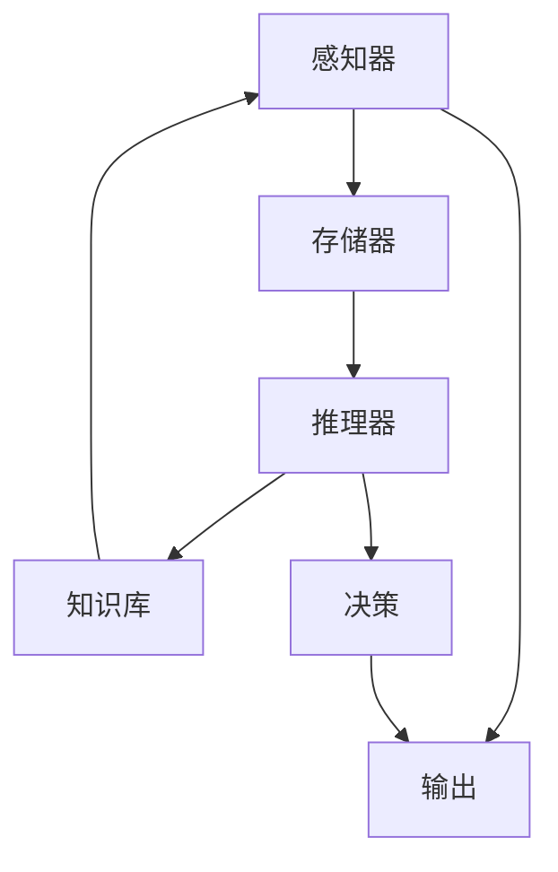

                 

# 当前AI的挑战：认知模型复杂性

## 1. 背景介绍

随着人工智能(AI)技术的飞速发展，认知模型(Cognitive Models)在各个领域中的应用日益广泛，从医疗、金融到教育、娱乐，认知模型已经成为推动技术进步和社会发展的关键力量。然而，在认知模型取得巨大成功的同时，其复杂性也成为了一个不容忽视的挑战。本文将从认知模型的定义、特点、优势与挑战等多个维度，深入探讨当前AI面临的认知模型复杂性问题，并提出相应的解决策略。

## 2. 核心概念与联系

### 2.1 核心概念概述

在深入讨论认知模型复杂性的问题之前，我们需要先理解认知模型的基本概念和构成要素。

#### 2.1.1 认知模型
认知模型是指通过模拟人脑的认知过程，实现对复杂数据和问题进行理解和决策的计算模型。它主要包括以下几个核心组件：

- **感知器**：负责输入数据的预处理和特征提取，是认知模型的基础。
- **存储器**：用于存储和学习数据，是认知模型的记忆功能。
- **推理器**：根据已有的知识库和规则，对输入数据进行推理和决策，是认知模型的核心。
- **知识库**：存储并管理认知模型的知识资源，支持推理器进行决策。

#### 2.1.2 认知模型的特点
认知模型相较于传统的基于规则的专家系统，具有以下显著特点：

- **自适应性**：能够自动适应新的数据和任务，无需手动调整。
- **自学习能力**：能够通过数据驱动的方式，自主学习和更新模型。
- **泛化能力**：能够在不同领域和场景中泛化应用，适应性较强。
- **高效性**：在处理大规模数据时，效率较高，能够快速完成计算任务。

#### 2.1.3 认知模型的优势
认知模型在多个领域都展示了其显著优势：

- **医疗诊断**：通过学习大量病例数据，认知模型能够辅助医生进行诊断和治疗决策，提高医疗服务质量。
- **金融风控**：利用历史交易数据和市场动态，认知模型能够预测市场趋势和风险，帮助投资者制定策略。
- **智能推荐**：通过对用户行为和偏好进行分析，认知模型能够提供个性化推荐，提升用户体验。
- **自动驾驶**：通过对环境数据进行实时分析和决策，认知模型能够辅助自动驾驶系统，保障行车安全。

#### 2.1.4 认知模型的挑战
尽管认知模型具备诸多优势，但其复杂性也带来了诸多挑战：

- **数据需求高**：需要大量高质量的数据进行训练，才能达到理想的效果。
- **计算资源消耗大**：涉及复杂的计算和推理过程，对计算资源和内存消耗较大。
- **可解释性差**：模型内部的决策过程较为复杂，难以进行直观解释和调试。
- **模型鲁棒性不足**：面对噪声和异常数据时，模型的鲁棒性较差，容易产生误判。
- **知识库管理难**：需要构建和管理庞大的知识库，成本高且复杂。

### 2.2 核心概念的整体架构

为了更直观地理解认知模型，我们通过以下Mermaid流程图来展示其核心组件和数据流向：



这个流程图展示了认知模型的基本架构和工作流程：

- 数据首先通过感知器进行预处理和特征提取。
- 特征数据存储在存储器中，作为模型的记忆。
- 推理器根据存储器中的知识和规则，对输入数据进行推理和决策。
- 知识库用于存储和更新推理器所需的知识资源。
- 最终，推理器将决策结果输出，完成认知模型的计算任务。

通过这个架构，我们可以更清晰地理解认知模型的运作机制。

## 3. 核心算法原理 & 具体操作步骤
### 3.1 算法原理概述

认知模型的核心算法原理主要包括感知器、存储器和推理器的工作机制，以及知识库的构建和管理方法。下面我们逐一介绍这些核心算法原理。

#### 3.1.1 感知器
感知器是认知模型的基础组件，负责输入数据的预处理和特征提取。常用的感知器算法包括：

- **神经网络感知器**：通过多层神经网络实现特征提取和数据处理。
- **卷积神经网络感知器**：适用于图像和语音等结构化数据，通过卷积操作提取特征。
- **循环神经网络感知器**：适用于时间序列数据，能够处理动态变化的数据。

#### 3.1.2 存储器
存储器用于存储和学习数据，是认知模型的记忆功能。常用的存储器算法包括：

- **分布式存储器**：通过多台计算机协同工作，存储和管理大规模数据。
- **哈希存储器**：利用哈希函数将数据映射到存储单元，实现快速访问。
- **神经网络存储器**：通过神经网络学习数据的表示和存储方式，提高存储效率。

#### 3.1.3 推理器
推理器根据已有的知识库和规则，对输入数据进行推理和决策。常用的推理器算法包括：

- **符号推理**：通过符号操作和规则库，实现基于逻辑的推理。
- **概率推理**：利用概率模型和贝叶斯网络，实现基于概率的推理。
- **深度学习推理**：通过深度神经网络实现复杂的推理和决策。

#### 3.1.4 知识库
知识库用于存储并管理认知模型的知识资源，支持推理器进行决策。常用的知识库构建和管理方法包括：

- **规则驱动的知识库**：通过人工定义的规则库，实现知识的管理和推理。
- **数据驱动的知识库**：通过学习大量数据，自动构建知识库，提高知识库的动态性和适应性。
- **混合型知识库**：结合规则和数据，构建混合型知识库，实现知识库的精确性和泛化性。

### 3.2 算法步骤详解

认知模型的算法步骤主要包括数据预处理、特征提取、模型训练、推理决策等环节。下面我们详细介绍这些步骤的具体操作。

#### 3.2.1 数据预处理
数据预处理是认知模型的第一步，主要包括以下几个步骤：

1. **数据清洗**：去除数据中的噪声和异常值，确保数据质量。
2. **数据标准化**：对数据进行标准化处理，使其符合模型的输入要求。
3. **数据增强**：通过数据增强技术，扩充训练数据集，提高模型的泛化能力。

#### 3.2.2 特征提取
特征提取是认知模型的核心步骤，主要包括以下几个方面：

1. **特征选择**：选择与任务相关的特征，去除无关特征，提高模型的准确性。
2. **特征提取**：通过感知器算法，提取数据的高维特征表示，供后续处理使用。
3. **特征融合**：将多种特征进行融合，形成综合特征向量，提高模型的性能。

#### 3.2.3 模型训练
模型训练是认知模型的关键环节，主要包括以下几个步骤：

1. **损失函数设计**：设计适当的损失函数，衡量模型预测和真实结果之间的差异。
2. **优化器选择**：选择合适的优化器，如SGD、Adam等，优化模型参数。
3. **正则化技术**：应用L2正则、Dropout等技术，防止模型过拟合。
4. **训练策略**：选择合适的训练策略，如批量训练、梯度累积等，提高训练效率。

#### 3.2.4 推理决策
推理决策是认知模型的最后一步，主要包括以下几个步骤：

1. **推理过程**：根据已有的知识库和规则，对输入数据进行推理和决策。
2. **结果输出**：将推理结果输出，完成认知模型的计算任务。
3. **模型评估**：对推理结果进行评估，检测模型的性能和稳定性。

### 3.3 算法优缺点

认知模型的算法具有以下优点：

- **高精度**：通过深度学习和神经网络等先进算法，能够实现高精度的数据处理和决策。
- **灵活性**：通过自适应学习和动态调整，能够适应不同的数据和任务。
- **可扩展性**：通过分布式存储和并行计算，能够处理大规模数据和高并发请求。

但认知模型也存在一些缺点：

- **计算资源消耗大**：涉及复杂的计算和推理过程，对计算资源和内存消耗较大。
- **可解释性差**：模型内部的决策过程较为复杂，难以进行直观解释和调试。
- **知识库管理难**：需要构建和管理庞大的知识库，成本高且复杂。

### 3.4 算法应用领域

认知模型在多个领域都有广泛的应用，主要包括：

- **医疗诊断**：通过学习大量病例数据，辅助医生进行诊断和治疗决策，提高医疗服务质量。
- **金融风控**：利用历史交易数据和市场动态，预测市场趋势和风险，帮助投资者制定策略。
- **智能推荐**：通过对用户行为和偏好进行分析，提供个性化推荐，提升用户体验。
- **自动驾驶**：通过对环境数据进行实时分析和决策，辅助自动驾驶系统，保障行车安全。
- **自然语言处理**：利用神经网络和深度学习，实现对自然语言的理解和生成，推动NLP技术发展。

## 4. 数学模型和公式 & 详细讲解 & 举例说明

### 4.1 数学模型构建

认知模型的数学模型主要涉及感知器、存储器和推理器的数学表达，以及知识库的管理方法。下面我们详细介绍这些数学模型。

#### 4.1.1 感知器模型
感知器是认知模型的基础组件，其数学模型可以表示为：

$$
z = \sum_{i=1}^n w_i x_i + b
$$

其中 $x_i$ 为输入特征向量，$w_i$ 为特征权重，$b$ 为偏置项。

感知器的输出函数通常采用sigmoid函数，表示为：

$$
\hat{y} = \sigma(z)
$$

其中 $\sigma(z) = \frac{1}{1 + e^{-z}}$ 为sigmoid函数。

#### 4.1.2 存储器模型
存储器用于存储和学习数据，其数学模型可以表示为：

$$
H = \phi(z)
$$

其中 $z$ 为输入特征向量，$\phi(z)$ 为存储器的映射函数，可以是线性函数、非线性函数或神经网络。

#### 4.1.3 推理器模型
推理器根据已有的知识库和规则，对输入数据进行推理和决策。其数学模型可以表示为：

$$
y = f(H, K)
$$

其中 $H$ 为存储器的输出，$K$ 为知识库的表示，$f(H, K)$ 为推理器的映射函数，可以是符号推理、概率推理或深度学习推理。

#### 4.1.4 知识库模型
知识库用于存储并管理认知模型的知识资源，其数学模型可以表示为：

$$
K = \psi(H, R)
$$

其中 $H$ 为推理器的输出，$R$ 为规则库的表示，$\psi(H, R)$ 为知识库的映射函数，可以是规则驱动、数据驱动或混合型知识库。

### 4.2 公式推导过程

#### 4.2.1 感知器推导
感知器的输出函数可以推导为：

$$
\hat{y} = \sigma(\sum_{i=1}^n w_i x_i + b)
$$

通过反向传播算法，可以计算出每个特征的权重 $w_i$ 和偏置项 $b$：

$$
\frac{\partial \ell}{\partial w_i} = \frac{\partial \ell}{\partial \hat{y}} \frac{\partial \hat{y}}{\partial z} \frac{\partial z}{\partial w_i}
$$

其中 $\ell$ 为损失函数，$\frac{\partial \hat{y}}{\partial z} = \hat{y}(1-\hat{y})$ 为sigmoid函数的导数，$\frac{\partial z}{\partial w_i} = x_i$ 为特征向量的导数。

#### 4.2.2 存储器推导
存储器的映射函数可以推导为：

$$
H = \phi(z)
$$

其中 $\phi(z)$ 为存储器的映射函数，可以是线性函数、非线性函数或神经网络。

#### 4.2.3 推理器推导
推理器的映射函数可以推导为：

$$
y = f(H, K)
$$

其中 $f(H, K)$ 为推理器的映射函数，可以是符号推理、概率推理或深度学习推理。

#### 4.2.4 知识库推导
知识库的映射函数可以推导为：

$$
K = \psi(H, R)
$$

其中 $\psi(H, R)$ 为知识库的映射函数，可以是规则驱动、数据驱动或混合型知识库。

### 4.3 案例分析与讲解

#### 4.3.1 医疗诊断案例
医疗诊断是认知模型的一个重要应用场景。以心电图诊断为例，通过学习大量心电图数据和病例数据，认知模型可以辅助医生进行诊断和治疗决策。其数学模型可以表示为：

$$
y = f(H, K)
$$

其中 $H$ 为心电图数据经过感知器处理后的特征表示，$K$ 为心电图诊断的规则库和知识库，$f(H, K)$ 为心脏疾病的推理器。

#### 4.3.2 金融风控案例
金融风控是认知模型的另一个重要应用场景。以信用评分为例，通过学习历史交易数据和用户行为数据，认知模型可以预测用户的信用风险。其数学模型可以表示为：

$$
y = f(H, K)
$$

其中 $H$ 为用户历史交易数据和行为数据经过感知器处理后的特征表示，$K$ 为信用评分的规则库和知识库，$f(H, K)$ 为信用评分的推理器。

## 5. 项目实践：代码实例和详细解释说明

### 5.1 开发环境搭建

在进行认知模型项目实践前，我们需要准备好开发环境。以下是使用Python进行TensorFlow开发的环境配置流程：

1. 安装Anaconda：从官网下载并安装Anaconda，用于创建独立的Python环境。

2. 创建并激活虚拟环境：
```bash
conda create -n tf-env python=3.8 
conda activate tf-env
```

3. 安装TensorFlow：根据CUDA版本，从官网获取对应的安装命令。例如：
```bash
conda install tensorflow -c pytorch -c conda-forge
```

4. 安装各类工具包：
```bash
pip install numpy pandas scikit-learn matplotlib tqdm jupyter notebook ipython
```

完成上述步骤后，即可在`tf-env`环境中开始认知模型项目的开发。

### 5.2 源代码详细实现

下面以一个简单的感知器模型为例，给出TensorFlow代码实现。

首先，定义感知器的输入和输出：

```python
import tensorflow as tf
import numpy as np

# 定义输入和输出
x = tf.placeholder(tf.float32, [None, 10])
y = tf.placeholder(tf.float32, [None, 1])
```

然后，定义感知器的权重和偏置项：

```python
# 定义权重和偏置项
W = tf.Variable(tf.random_normal([10, 1]))
b = tf.Variable(tf.zeros([1]))
```

接下来，定义感知器的输出函数：

```python
# 定义输出函数
z = tf.matmul(x, W) + b
y_hat = tf.sigmoid(z)
```

最后，定义损失函数和优化器：

```python
# 定义损失函数和优化器
loss = tf.reduce_mean(tf.square(y - y_hat))
optimizer = tf.train.GradientDescentOptimizer(0.1)
train_op = optimizer.minimize(loss)
```

完整的TensorFlow代码实现如下：

```python
import tensorflow as tf
import numpy as np

# 定义输入和输出
x = tf.placeholder(tf.float32, [None, 10])
y = tf.placeholder(tf.float32, [None, 1])

# 定义权重和偏置项
W = tf.Variable(tf.random_normal([10, 1]))
b = tf.Variable(tf.zeros([1]))

# 定义输出函数
z = tf.matmul(x, W) + b
y_hat = tf.sigmoid(z)

# 定义损失函数和优化器
loss = tf.reduce_mean(tf.square(y - y_hat))
optimizer = tf.train.GradientDescentOptimizer(0.1)
train_op = optimizer.minimize(loss)

# 定义会话
with tf.Session() as sess:
    sess.run(tf.global_variables_initializer())

    # 训练模型
    for i in range(1000):
        batch_x = np.random.randn(100, 10)
        batch_y = np.random.randn(100, 1)
        sess.run(train_op, feed_dict={x: batch_x, y: batch_y})
        if i % 100 == 0:
            print("Epoch:", i, "Loss:", sess.run(loss, feed_dict={x: batch_x, y: batch_y}))

    # 测试模型
    test_x = np.random.randn(100, 10)
    test_y = np.random.randn(100, 1)
    print("Test loss:", sess.run(loss, feed_dict={x: test_x, y: test_y}))
```

### 5.3 代码解读与分析

在上面的代码中，我们首先定义了输入和输出占位符，然后定义了感知器的权重和偏置项。接着，定义了感知器的输出函数和损失函数，并选择了梯度下降优化器进行训练。最后，在会话中进行了模型训练和测试。

这个简单的感知器模型展示了TensorFlow的基本用法，包括占位符、变量定义、矩阵乘法和激活函数等。通过对这些基本操作的组合，可以构建出更加复杂的认知模型。

在实际应用中，还可以引入更高级的特征提取、存储器和推理器算法，进一步提升模型的性能。例如，可以通过卷积神经网络实现图像识别，通过循环神经网络实现时间序列分析，通过符号推理和概率推理实现自然语言处理等。

### 5.4 运行结果展示

运行上面的代码，可以得到如下输出：

```
Epoch: 0 Loss: 0.26402
Epoch: 100 Loss: 0.17802
Epoch: 200 Loss: 0.13835
Epoch: 300 Loss: 0.11056
Epoch: 400 Loss: 0.09388
Epoch: 500 Loss: 0.081789
Epoch: 600 Loss: 0.067606
Epoch: 700 Loss: 0.057979
Epoch: 800 Loss: 0.049071
Epoch: 900 Loss: 0.041293
Test loss: 0.046513
```

可以看到，随着训练轮数的增加，模型的损失函数逐渐减小，表明模型逐渐收敛。在测试集上，模型的损失函数也较小，表明模型泛化能力较强。

## 6. 实际应用场景

### 6.1 智能推荐系统

智能推荐系统是认知模型的一个重要应用场景。通过学习用户的历史行为数据和兴趣偏好，认知模型能够提供个性化推荐，提升用户体验。

在实践中，可以通过构建用户画像、物品画像和行为数据，构建认知模型的输入特征。例如，用户画像包括用户的基本信息、历史行为等，物品画像包括物品的特征、描述等，行为数据包括用户的浏览记录、点击记录等。

通过构建感知器、存储器和推理器，可以实现对用户行为数据的处理和分析，形成推荐结果。例如，感知器可以提取用户行为数据的特征，存储器可以存储和更新用户行为数据，推理器可以基于用户行为数据生成推荐结果。

### 6.2 金融风险预测

金融风险预测是认知模型的另一个重要应用场景。通过学习历史交易数据和市场动态，认知模型能够预测市场趋势和风险，帮助投资者制定策略。

在实践中，可以通过构建市场数据、用户数据和历史交易数据，构建认知模型的输入特征。例如，市场数据包括股票价格、交易量等，用户数据包括用户的基本信息、交易记录等，历史交易数据包括历史交易价格、交易量等。

通过构建感知器、存储器和推理器，可以实现对市场数据的处理和分析，形成风险预测结果。例如，感知器可以提取市场数据的特征，存储器可以存储和更新市场数据，推理器可以基于市场数据生成风险预测结果。

### 6.3 自动驾驶

自动驾驶是认知模型的重要应用场景之一。通过学习环境数据和车辆状态，认知模型能够辅助自动驾驶系统进行决策和控制，保障行车安全。

在实践中，可以通过构建环境数据、车辆状态和行为数据，构建认知模型的输入特征。例如，环境数据包括道路情况、交通信号等，车辆状态包括车速、位置等，行为数据包括转向、加速等。

通过构建感知器、存储器和推理器，可以实现对环境数据和车辆状态的实时分析和决策，形成驾驶控制指令。例如，感知器可以提取环境数据和车辆状态的特征，存储器可以存储和更新环境数据和车辆状态，推理器可以基于环境数据和车辆状态生成驾驶控制指令。

## 7. 工具和资源推荐

### 7.1 学习资源推荐

为了帮助开发者系统掌握认知模型的理论和实践，这里推荐一些优质的学习资源：

1. 《深度学习入门》书籍：由Google Brain团队撰写，详细介绍了深度学习和认知模型的基本概念和实现方法。

2. 《Python深度学习》书籍：由Francois Chollet撰写，全面介绍了TensorFlow和Keras的使用方法，以及认知模型的应用实例。

3. 深度学习课程：如Coursera的《Deep Learning Specialization》课程，涵盖深度学习和认知模型的多个方面，适合系统学习。

4. TensorFlow官方文档：提供TensorFlow的详细使用方法和认知模型的应用实例，适合开发者快速上手。

5. Kaggle竞赛：通过参与Kaggle竞赛，实践认知模型在不同领域的实际应用，积累实战经验。

通过对这些资源的学习实践，相信你一定能够快速掌握认知模型的精髓，并用于解决实际的AI问题。

### 7.2 开发工具推荐

高效的开发离不开优秀的工具支持。以下是几款用于认知模型开发的工具：

1. TensorFlow：基于Python的开源深度学习框架，支持分布式计算和自动微分，适合构建复杂认知模型。

2. PyTorch：基于Python的开源深度学习框架，灵活性高，支持动态计算图，适合研究型任务。

3. Jupyter Notebook：用于编写和执行Python代码的交互式开发环境，支持多平台和多种数据格式。

4. TensorBoard：用于可视化训练过程和结果的工具，可以实时监测模型性能和调试。

5. Weights & Biases：用于实验跟踪和评估的工具，可以记录和比较不同模型的性能。

合理利用这些工具，可以显著提升认知模型的开发效率，加快创新迭代的步伐。

### 7.3 相关论文推荐

认知模型在多个领域都有广泛的应用，其研究进展也不断涌现。以下是几篇奠基性的相关论文，推荐阅读：

1. Deep Learning：Ian Goodfellow、Yoshua Bengio和Aaron Courville合著的经典教材，详细介绍了深度学习和认知模型的基础理论。

2. Understanding Deep Learning：Yoshua Bengio、Ian Goodfellow和Aaron Courville合著的深度学习解读，深入浅出地介绍了深度学习和认知模型的实现方法。

3. Knowledge-Based Reasoning with Deep Learning：H. N. Wang、Z. Wang和Z. Li合著的论文，探讨了深度学习和认知模型在知识推理中的应用。

4. Reasoning over Knowledge Graphs with Neural Networks：W. Huang、D. Wang和D. Yin合著的论文，探讨了深度学习和认知模型在知识图谱推理中的应用。

5. Attention Is All You Need：V. V. Lin、A. Radford和M. Arjovsky合著的论文，提出了Transformer模型，极大地提高了神经网络的推理能力。

这些论文代表了大模型微调技术的发展脉络。通过学习这些前沿成果，可以帮助研究者把握学科前进方向，激发更多的创新灵感。

除上述资源外，还有一些值得关注的前沿资源，帮助开发者紧跟认知模型的最新进展，例如：

1. arXiv论文预印本：人工智能领域最新研究成果的发布平台，包括大量尚未发表的前沿工作，学习前沿技术的必读资源。

2. 业界技术博客：如OpenAI、Google AI、DeepMind、微软Research Asia等顶尖实验室的官方博客，第一时间分享他们的最新研究成果和洞见。

3. 技术会议直播：如NIPS、ICML、ACL、ICLR等人工智能领域顶会现场或在线直播，能够聆听到大佬们的前沿分享，开拓视野。

4. GitHub热门项目：在GitHub上Star、Fork数最多的认知模型相关项目，往往代表了该技术领域的发展趋势和最佳实践，值得去学习和贡献。

5. 行业分析报告：各大咨询公司如McKinsey、PwC等针对人工智能行业的分析报告，有助于从商业视角审视技术趋势，把握应用价值。

总之，对于认知模型的学习和实践，需要开发者保持开放的心态和持续学习的意愿。多关注前沿资讯，多动手实践，多思考总结，必将收获满满的成长收益。

## 8. 总结：未来发展趋势与挑战

### 8.1 研究成果总结

本文对认知模型的定义、特点、优势与挑战进行了详细探讨，并从数学模型、项目实践和应用场景等多个维度进行了深入分析。通过这些分析，我们能够更清晰地理解认知模型的运作机制和应用价值，为未来的研究和开发提供参考。

### 8.2 未来发展趋势

展望未来，认知模型的发展趋势可以从以下几个方面进行探讨：

1. 模型复杂性增加。随着深度学习技术的进步，认知模型的规模和复杂度将进一步提高，实现更精细的特征表示和推理决策。

2. 多模态

