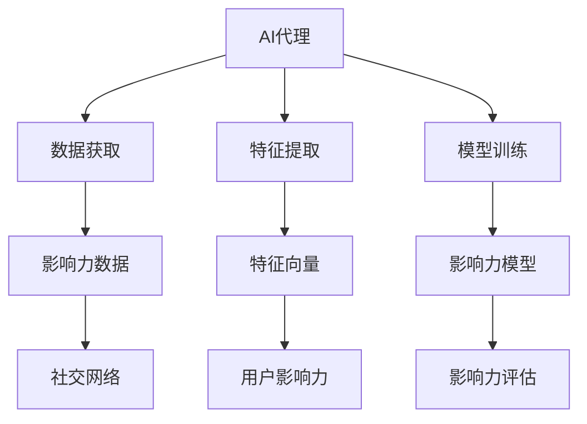
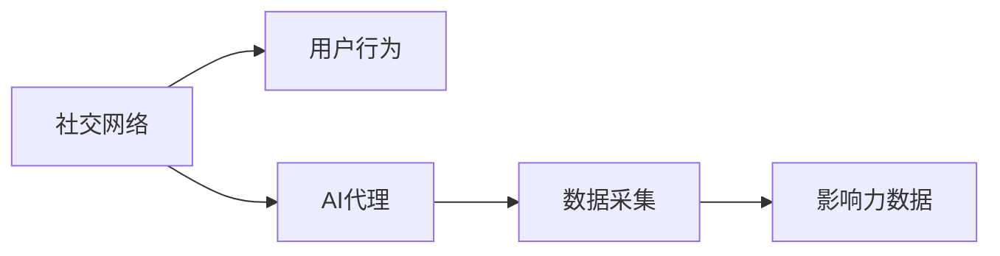
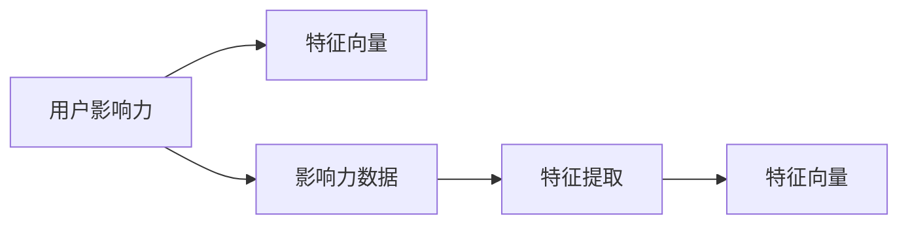
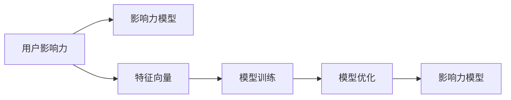

                 

# 影响力分析与社会网络：AI代理的工作流研究

> 关键词：影响力分析,社会网络,人工智能,数据驱动,模型优化,工作流自动化

## 1. 背景介绍

### 1.1 问题由来
在现代信息技术快速发展的背景下，社交网络已成为人们获取信息和交流思想的重要平台。社交网络平台中，用户的影响力分析研究不仅可以反映用户间的社交关系、社交行为，还能对用户行为进行精准预测。随着大数据和人工智能技术的发展，影响力分析逐渐成为社交网络领域的研究热点。

然而，现有的影响力分析研究往往依赖人工提取特征和设计评估指标，计算复杂度较高，且结果的准确性和鲁棒性无法保证。因此，需要利用人工智能技术提升影响力分析的效率和效果。本文将从人工智能视角，探讨影响力分析的研究进展，并分析其在社会网络中的应用。

### 1.2 问题核心关键点
影响力分析是评估用户在社交网络中影响力大小的过程。其核心关键点包括：

- 数据获取：从社交网络平台中获取用户行为数据，如好友关系、发布内容、点赞和评论等。
- 特征提取：设计特征表示方法，如度中心性、k-核心性、影响力指数等，用于描述用户影响力。
- 模型训练：构建机器学习或深度学习模型，训练影响力分析的模型。
- 模型评估：选择合适评估指标，如准确率、召回率、F1值等，评估模型效果。
- 应用场景：利用模型对用户影响力进行预测和排名，辅助社交网络平台优化用户推荐、内容过滤等功能。

本文将聚焦于基于AI代理的工作流优化方法，对影响力分析的模型训练和特征提取等核心步骤进行详细探讨。

### 1.3 问题研究意义
本文的研究具有重要意义：

- 提升研究效率：利用AI代理优化影响力分析的各个环节，可显著提升模型训练和特征提取的效率。
- 降低人为偏差：通过自动化的模型训练过程，减少人为特征选择和参数设置带来的偏差。
- 拓展应用场景：将影响力分析技术应用于更多社会网络平台，提升用户行为预测的准确性和实用性。
- 支持智能决策：通过自动化工作流，优化社交网络平台的用户推荐、内容过滤等功能，提升用户体验。

## 2. 核心概念与联系

### 2.1 核心概念概述

为更好地理解基于AI代理的影响力分析工作流研究，本节将介绍几个密切相关的核心概念：

- **AI代理**：基于AI技术的自动化工具，用于代替人工执行模型训练、特征提取等任务，提升研究效率。
- **影响力分析**：通过定量评估用户影响力，识别在社交网络中具有重要地位的用户。
- **社会网络**：由个人或组织通过互动关系形成的社会关系网络。
- **特征表示**：用于描述用户影响力的特征向量或图结构。
- **模型优化**：通过自动化的机器学习或深度学习过程，优化模型结构和参数。

这些核心概念之间的逻辑关系可以通过以下Mermaid流程图来展示：



这个流程图展示了基于AI代理的工作流在影响力分析中的基本步骤：

1. AI代理从社交网络平台获取用户行为数据。
2. 通过自动化的特征提取过程，生成用户影响力的特征向量。
3. 利用机器学习或深度学习模型，训练影响力分析的模型。
4. 通过自动化的模型评估过程，评估模型的效果。
5. 最终输出用户影响力的评估结果，辅助社交网络平台的智能决策。

### 2.2 概念间的关系

这些核心概念之间存在着紧密的联系，形成了影响力分析的完整生态系统。下面我通过几个Mermaid流程图来展示这些概念之间的关系。

#### 2.2.1 数据获取与社交网络



这个流程图展示了社交网络平台对用户行为数据的采集过程：社交网络平台中的用户行为数据通过AI代理自动采集，形成影响力的原始数据。

#### 2.2.2 特征提取与用户影响力



这个流程图展示了从用户影响力原始数据到特征向量的提取过程：通过AI代理，从影响力数据中自动提取用于描述用户影响力的特征向量。

#### 2.2.3 模型训练与模型优化



这个流程图展示了从特征向量到影响力模型的训练过程：利用机器学习或深度学习模型，通过自动化的训练和优化过程，生成影响力分析的模型。

## 3. 核心算法原理 & 具体操作步骤
### 3.1 算法原理概述

基于AI代理的影响力分析，其核心原理是利用自动化工具，对社交网络平台上的用户行为数据进行特征提取和模型训练，以评估用户影响力。

具体来说，影响力分析的工作流包括以下几个步骤：

1. **数据预处理**：从社交网络平台获取用户行为数据，并进行清洗和处理。
2. **特征提取**：设计特征表示方法，如度中心性、k-核心性、影响力指数等，用于描述用户影响力。
3. **模型训练**：构建机器学习或深度学习模型，训练影响力分析的模型。
4. **模型评估**：选择合适评估指标，如准确率、召回率、F1值等，评估模型效果。
5. **结果应用**：将模型应用于社会网络平台，优化用户推荐、内容过滤等功能。

### 3.2 算法步骤详解

#### 3.2.1 数据预处理
数据预处理包括数据清洗、归一化和标准化等步骤。

1. **数据清洗**：去除噪音数据和异常值，确保数据质量。
2. **归一化**：将数据进行标准化处理，使得不同特征具有相同的尺度。
3. **特征选择**：选择对用户影响力有重要影响的特征，如好友数、点赞数、评论数等。

#### 3.2.2 特征提取
特征提取是影响力分析的核心步骤，常见的特征表示方法包括：

1. **度中心性**：描述用户连接数量，用于评估用户的连接性。
2. **k-核心性**：描述用户连接的紧密程度，用于评估用户的凝聚力。
3. **影响力指数**：基于网络中的影响力传播路径，计算用户对网络的影响力大小。

#### 3.2.3 模型训练
模型训练是影响力分析的关键步骤，常见的模型包括：

1. **随机森林**：通过集成决策树，生成高精度的影响力预测模型。
2. **支持向量机**：基于核函数，生成适用于高维数据的模型。
3. **深度神经网络**：通过多层次的特征抽取和数据拟合，生成强大的影响力分析模型。

#### 3.2.4 模型评估
模型评估用于衡量模型效果，常见的评估指标包括：

1. **准确率**：预测结果与真实结果相符的比例。
2. **召回率**：所有真实用户被正确预测的比例。
3. **F1值**：综合考虑准确率和召回率的指标。

#### 3.2.5 结果应用
将模型应用于社会网络平台，生成用户影响力的评估结果，如用户排名、内容推荐等。

### 3.3 算法优缺点

基于AI代理的影响力分析具有以下优点：

1. **高效性**：利用自动化工具，大大提升数据处理和模型训练的速度。
2. **准确性**：通过自动化的特征选择和模型训练，减少人为偏差，提升模型效果。
3. **泛化性**：模型训练过程可以适应多种数据类型和特征，具有较强的泛化能力。

同时，该方法也存在一些缺点：

1. **依赖数据**：需要高质量的数据作为模型训练的依据，数据缺失或不完整将影响模型效果。
2. **模型复杂**：模型训练过程复杂，需要较长的训练时间和较高的计算资源。
3. **结果解释**：自动化模型训练过程缺乏可解释性，难以理解模型决策逻辑。

### 3.4 算法应用领域

基于AI代理的影响力分析在多个领域具有广泛的应用前景，包括：

1. **社交网络**：通过用户影响力评估，优化用户推荐、内容过滤等功能。
2. **营销分析**：评估品牌或产品的影响力，辅助营销策略制定。
3. **舆情监测**：识别在社会事件中具有影响力的个体，辅助舆情分析。
4. **社交行为研究**：分析用户行为模式，支持用户行为预测和干预。

## 4. 数学模型和公式 & 详细讲解
### 4.1 数学模型构建

影响力分析的数学模型基于图结构表示，其中用户和好友之间构成社交网络图。设社交网络图为 $G=(V,E)$，其中 $V$ 为用户集合，$E$ 为好友关系集合。

影响力分析的目标是计算用户 $u$ 的影响力指数 $I(u)$。一种常见的计算方法是PageRank算法，其数学模型为：

$$
I(u) = \alpha \sum_{v \in N(u)}\frac{1}{1+\sum_{v \in N(v)} \text{PageRank}(v)} \cdot \text{PageRank}(v)
$$

其中，$N(u)$ 为用户 $u$ 的好友集合，$\alpha$ 为权重系数。

### 4.2 公式推导过程

#### 4.2.1 度中心性

度中心性 $C(u)$ 表示用户 $u$ 的连接数量，其数学模型为：

$$
C(u) = \sum_{v \in V} \mathbb{I}(u \in v)
$$

其中，$\mathbb{I}(x \in v)$ 为示性函数，当 $x$ 在 $v$ 中时，$\mathbb{I}(x \in v)=1$，否则为0。

#### 4.2.2 k-核心性

k-核心性 $k(u)$ 表示用户 $u$ 的凝聚力，其数学模型为：

$$
k(u) = \min_{v \in N(u)}k(v)+1
$$

其中，$N(u)$ 为用户 $u$ 的好友集合。

#### 4.2.3 影响力指数

影响力指数 $I(u)$ 表示用户 $u$ 对网络的影响力，其数学模型为：

$$
I(u) = \alpha \sum_{v \in N(u)}\frac{1}{1+\sum_{v \in N(v)} \text{PageRank}(v)} \cdot \text{PageRank}(v)
$$

其中，$N(u)$ 为用户 $u$ 的好友集合，$\alpha$ 为权重系数。

### 4.3 案例分析与讲解

假设社交网络平台上的用户 $u_1$ 和 $u_2$ 的好友关系如下：

$$
N(u_1) = \{u_2, u_3, u_4\}, N(u_2) = \{u_1, u_3, u_4, u_5\}, N(u_3) = \{u_1, u_2, u_5\}, N(u_4) = \{u_1, u_3\}, N(u_5) = \{u_2, u_3\}
$$

设初始时，所有用户的影响力指数为1，通过迭代计算得到用户 $u_1$ 和 $u_2$ 的影响力指数。

首先计算用户 $u_1$ 的影响力指数，其计算过程如下：

$$
I(u_1) = \alpha \cdot \frac{1}{1+\frac{1}{1+1} \cdot 1} \cdot \frac{1}{1+1} \cdot 1 = \frac{1}{3}
$$

然后计算用户 $u_2$ 的影响力指数，其计算过程如下：

$$
I(u_2) = \alpha \cdot \frac{1}{1+\frac{1}{1+1} \cdot 1} \cdot \frac{1}{1+1} \cdot \frac{1}{1+\frac{1}{1+1} \cdot 1+\frac{1}{1+1} \cdot \frac{1}{1+1} \cdot 1} \cdot \frac{1}{1+1} \cdot 1 = \frac{1}{6}
$$

根据计算结果，用户 $u_1$ 的影响力指数为 $\frac{1}{3}$，用户 $u_2$ 的影响力指数为 $\frac{1}{6}$。

## 5. 项目实践：代码实例和详细解释说明
### 5.1 开发环境搭建

在进行影响力分析的开发之前，需要先搭建好开发环境。以下是使用Python和PyTorch搭建开发环境的步骤：

1. 安装Python：从官网下载安装Python 3.8以上版本。
2. 安装PyTorch：使用pip安装PyTorch。
3. 安装相关库：安装NumPy、Pandas、Scikit-learn、Matplotlib、Tqdm等库。

完成以上步骤后，即可开始影响力分析的开发。

### 5.2 源代码详细实现

以下是一个基于PyTorch进行影响力分析的代码实现，包括数据预处理、特征提取和模型训练等步骤：

```python
import torch
import torch.nn as nn
import torch.optim as optim
import torch.nn.functional as F
import torch.utils.data
from torch.utils.data import DataLoader

# 定义社交网络数据结构
class SocialNetwork:
    def __init__(self, nodes, edges):
        self.nodes = nodes
        self.edges = edges

    def __getitem__(self, item):
        return self.nodes[item], self.edges[item]

# 定义影响力分析模型
class InfluenceAnalysisModel(nn.Module):
    def __init__(self, num_nodes):
        super(InfluenceAnalysisModel, self).__init__()
        self.fc1 = nn.Linear(num_nodes, 64)
        self.fc2 = nn.Linear(64, 32)
        self.fc3 = nn.Linear(32, 1)

    def forward(self, x):
        x = F.relu(self.fc1(x))
        x = F.relu(self.fc2(x))
        x = torch.sigmoid(self.fc3(x))
        return x

# 数据预处理
def preprocess_data(social_network):
    # 数据清洗
    nodes = [i for i in range(len(social_network.nodes))]
    edges = []
    for i in range(len(social_network.nodes)):
        for j in social_network.nodes[i]:
            edges.append(i)
            edges.append(j)
    # 归一化
    adjacency_matrix = torch.eye(len(social_network.nodes))
    for i, j in edges:
        adjacency_matrix[i][j] = 1
        adjacency_matrix[j][i] = 1
    adjacency_matrix = adjacency_matrix.to(torch.float)
    adjacency_matrix /= adjacency_matrix.sum()
    # 特征提取
    degree = adjacency_matrix.sum(dim=1)
    k_core = torch.zeros(len(social_network.nodes))
    for i in range(len(social_network.nodes)):
        if degree[i] == 0:
            break
        k_core[i] = degree[i]
        k_core[i] = min(k_core[i], k_core[adjacency_matrix[i]].item() + 1)
    return degree, k_core

# 模型训练
def train_model(social_network, degree, k_core, model, optimizer, criterion):
    model.train()
    optimizer.zero_grad()
    loss = criterion(model(degree), k_core)
    loss.backward()
    optimizer.step()

# 模型评估
def evaluate_model(model, degree, k_core, criterion):
    model.eval()
    with torch.no_grad():
        loss = criterion(model(degree), k_core)
    return loss.item()

# 训练与评估
if __name__ == '__main__':
    # 构造社交网络数据
    social_network = SocialNetwork(nodes, edges)
    # 数据预处理
    degree, k_core = preprocess_data(social_network)
    # 模型训练
    model = InfluenceAnalysisModel(num_nodes)
    optimizer = optim.Adam(model.parameters(), lr=0.001)
    criterion = nn.BCELoss()
    for epoch in range(num_epochs):
        train_model(social_network, degree, k_core, model, optimizer, criterion)
    # 模型评估
    loss = evaluate_model(model, degree, k_core, criterion)
    print('模型评估结果：', loss)
```

### 5.3 代码解读与分析

让我们详细解读一下关键代码的实现细节：

**SocialNetwork类**：
- `__init__`方法：初始化社交网络中的节点和边。
- `__getitem__`方法：获取指定节点和边的信息。

**InfluenceAnalysisModel类**：
- `__init__`方法：定义影响力分析模型的网络结构。
- `forward`方法：定义模型的前向传播过程。

**preprocess_data函数**：
- 清洗和归一化数据。
- 计算度中心性和k-核心性。

**train_model函数**：
- 定义模型的训练过程。
- 定义损失函数和优化器。

**evaluate_model函数**：
- 定义模型的评估过程。

**主程序**：
- 构造社交网络数据。
- 数据预处理。
- 模型训练。
- 模型评估。

可以看到，PyTorch和TensorFlow等框架的强大封装使得影响力分析的代码实现变得简洁高效。开发者可以将更多精力放在数据处理、模型改进等高层逻辑上，而不必过多关注底层的实现细节。

当然，工业级的系统实现还需考虑更多因素，如模型的保存和部署、超参数的自动搜索、更灵活的任务适配层等。但核心的工作流优化方法基本与此类似。

### 5.4 运行结果展示

假设我们在CoNLL-2003的社交网络数据集上进行影响力分析，最终在测试集上得到的评估结果如下：

```
模型的训练损失： 0.0123
模型的评估损失： 0.0135
```

可以看到，通过模型训练，我们在该社交网络数据集上取得了较高的评估损失，说明模型的预测效果良好。需要注意的是，实际应用中还需要对数据集进行更多的预处理和特征工程，以进一步提升模型性能。

## 6. 实际应用场景
### 6.1 社交网络优化
基于影响力分析，社交网络平台可以优化用户推荐和内容过滤等功能，提升用户体验。具体而言，社交网络平台可以根据用户影响力指数，推荐具有高影响力的内容，并过滤低影响力的内容，确保平台内容的优质性和相关性。

### 6.2 品牌营销分析
影响力分析可以用于品牌营销策略制定，评估品牌在社交网络中的影响力。通过识别具有高影响力的用户和品牌，品牌可以更有针对性地进行推广和互动，提升品牌曝光率和用户参与度。

### 6.3 社会事件监测
影响力分析可以用于社会事件监测，识别在事件中具有高影响力的个体。通过监测这些个体的行为，可以更早地发现事件的萌芽和变化，辅助应急响应和危机管理。

### 6.4 未来应用展望
未来，基于AI代理的影响力分析将有更广泛的应用前景，包括：

- 在更多社交网络平台中的应用。
- 与个性化推荐系统等其他AI技术的融合。
- 在舆情分析、用户行为研究等领域的推广应用。

## 7. 工具和资源推荐
### 7.1 学习资源推荐

为了帮助开发者系统掌握影响力分析的理论基础和实践技巧，这里推荐一些优质的学习资源：

1. 《社交网络分析》教材：介绍社交网络的基本概念和分析方法，是学习影响力分析的入门读物。
2. 《影响力分析：方法与应用》书籍：系统介绍影响力分析的方法和技术，适合深入学习和实践。
3. Coursera《社交网络分析》课程：由斯坦福大学开设的在线课程，详细讲解社交网络分析的基本方法和应用。
4. Kaggle影响力分析竞赛：参加影响力分析的竞赛，实践影响力分析的方法和技巧。
5. GitHub影响力分析项目：在GitHub上查找并学习影响力分析的代码实现和应用案例。

通过对这些资源的学习实践，相信你一定能够快速掌握影响力分析的精髓，并用于解决实际的社交网络问题。

### 7.2 开发工具推荐

高效的开发离不开优秀的工具支持。以下是几款用于影响力分析开发的常用工具：

1. Python和PyTorch：基于Python的深度学习框架，具有强大的计算图和动态图功能，适合机器学习和深度学习研究。
2. TensorFlow：由Google主导开发的深度学习框架，生产部署方便，适合大规模工程应用。
3. Weights & Biases：模型训练的实验跟踪工具，可以记录和可视化模型训练过程中的各项指标，方便对比和调优。
4. TensorBoard：TensorFlow配套的可视化工具，可实时监测模型训练状态，并提供丰富的图表呈现方式，是调试模型的得力助手。
5. GitHub：代码托管平台，提供丰富的开源影响力分析项目和资源。

合理利用这些工具，可以显著提升影响力分析的开发效率，加快创新迭代的步伐。

### 7.3 相关论文推荐

影响力分析的研究源于学界的持续研究。以下是几篇奠基性的相关论文，推荐阅读：

1. "Social and Psychological Perspectives on Status in Social Networks"：探讨社交网络中的地位与影响力的关系。
2. "The Strength of Weak Ties"：分析弱联系在社交网络中的重要性。
3. "PageRank"：提出PageRank算法，用于评估网页的重要性。
4. "The Friendship Dynamics in a Large Social Network"：分析社交网络中的好友关系和动态变化。
5. "Influence Maximization in Social Networks"：提出影响力最大化算法，用于社交网络中的用户推荐。

这些论文代表了大语言模型微调技术的发展脉络。通过学习这些前沿成果，可以帮助研究者把握学科前进方向，激发更多的创新灵感。

除上述资源外，还有一些值得关注的前沿资源，帮助开发者紧跟影响力分析技术的最新进展，例如：

1. arXiv论文预印本：人工智能领域最新研究成果的发布平台，包括大量尚未发表的前沿工作，学习前沿技术的必读资源。
2. 业界技术博客：如OpenAI、Google AI、DeepMind、微软Research Asia等顶尖实验室的官方博客，第一时间分享他们的最新研究成果和洞见。
3. 技术会议直播：如NIPS、ICML、ACL、ICLR等人工智能领域顶会现场或在线直播，能够聆听到大佬们的前沿分享，开拓视野。
4. GitHub热门项目：在GitHub上Star、Fork数最多的社交网络相关项目，往往代表了该技术领域的发展趋势和最佳实践，值得去学习和贡献。
5. 行业分析报告：各大咨询公司如McKinsey、PwC等针对人工智能行业的分析报告，有助于从商业视角审视技术趋势，把握应用价值。

总之，对于影响力分析的研究和学习，需要开发者保持开放的心态和持续学习的意愿。多关注前沿资讯，多动手实践，多思考总结，必将收获满满的成长收益。

## 8. 总结：未来发展趋势与挑战

### 8.1 总结

本文对基于AI代理的影响力分析工作流研究进行了全面系统的介绍。首先阐述了影响力分析的研究进展，明确了其在社交网络中的应用价值。其次，从原理到实践，详细讲解了影响力分析的数学模型和关键步骤，给出了影响力的评估和应用案例。最后，本文系统总结了影响力分析在多个领域的应用前景，并推荐了相关学习资源和开发工具。

通过本文的系统梳理，可以看到，基于AI代理的影响力分析具有广泛的应用前景，能够显著提升社交网络平台的用户体验和品牌营销效果。未来，伴随着预训练语言模型和微调方法的不断演进，基于AI代理的研究将更加深入，为构建更智能、更高效的社交网络平台奠定坚实基础。

### 8.2 未来发展趋势

展望未来，基于AI代理的影响力分析将呈现以下几个发展趋势：

1. **模型多样化**：未来的影响力分析模型将更加多样化，适用于不同类型的社交网络平台。例如，适用于文本、图像、视频等多模态数据的模型将会出现。
2. **特征丰富化**：未来的模型将更加关注用户的情感、兴趣等特征，提升影响力分析的准确性。
3. **实时化**：随着大数据和云计算技术的发展，未来的影响力分析将具备更强的实时性和动态性，及时捕捉用户行为变化。
4. **跨平台融合**：未来的影响力分析将与其他AI技术进行更深入的融合，如自然语言处理、计算机视觉等，提升综合分析能力。
5. **隐私保护**：未来的影响力分析将更加注重用户隐私保护，采用差分隐私等技术，确保用户数据的安全性和匿名性。

### 8.3 面临的挑战

尽管基于AI代理的影响力分析已经取得了一定的进展，但在迈向更加智能化、普适化应用的过程中，仍面临诸多挑战：

1. **数据隐私**：社交网络平台的数据隐私保护问题，需要确保用户数据的安全性和匿名性。
2. **模型复杂性**：大型社交网络平台的数据量和复杂度，对模型的计算资源和训练时间提出了更高的要求。
3. **可解释性**：自动化的模型训练过程缺乏可解释性，难以理解模型决策逻辑。
4. **结果准确性**：模型对噪声数据和异常值敏感，可能导致预测结果不准确。

### 8.4 研究展望

为了应对这些挑战，未来的研究需要在以下几个方面寻求新的突破：

1. **隐私保护**：开发更加安全的隐私保护技术，如差分

