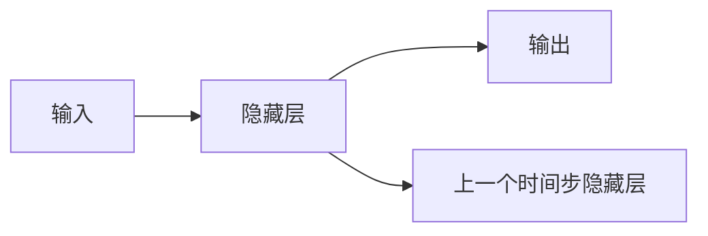

                 

## 1. 背景介绍

循环神经网络 (Recurrent Neural Networks, RNNs) 是一类重要的神经网络模型，尤其适用于序列数据的处理。它们通过在网络中引入循环连接，可以记住之前的输入信息，从而能够处理具有长期依赖关系的数据。循环神经网络已经成为自然语言处理、语音识别、时间序列预测等领域的标准工具。

## 2. 核心概念与联系

### 2.1 核心概念概述

在深入探讨循环神经网络之前，首先需要理解一些核心概念：

- **神经网络 (Neural Network)**：一种模仿人脑结构和功能的计算模型，由大量的人工神经元组成，通过权重矩阵和激活函数进行信息传递和计算。
- **前馈神经网络 (Feedforward Neural Network)**：最基本的神经网络形式，信息仅在前向传播过程中流动。
- **反向传播 (Backpropagation)**：一种用于优化神经网络参数的算法，通过计算损失函数的梯度进行参数更新。
- **序列数据 (Sequence Data)**：一系列按照时间或空间顺序排列的数据点，如文本、音频、时间序列等。

### 2.2 核心概念原理和架构

**循环神经网络的基本结构**：

循环神经网络由一系列时间步的隐藏层组成，每个时间步的隐藏层输出不仅依赖于当前输入，还依赖于之前时间步的隐藏层状态。这种结构使得网络能够存储和传递信息，处理时间序列数据。

下图展示了循环神经网络的基本结构：



- **输入层 (Input Layer)**：接收序列数据中的每个时间步的特征向量。
- **隐藏层 (Hidden Layer)**：由一系列时间步的节点组成，每个节点接收前一个时间步的隐藏层状态和一个当前时间步的输入，输出一个代表当前时间步的特征表示。
- **输出层 (Output Layer)**：对每个时间步的隐藏层状态进行映射，输出模型预测结果。

### 2.3 核心概念间的联系

循环神经网络与前馈神经网络的关系：

- 前馈神经网络可以看作是一种特殊情况，其中时间步数为1，隐藏层没有循环连接。
- 循环神经网络通过在隐藏层引入循环连接，能够处理更复杂的时间序列数据。

## 3. 核心算法原理 & 具体操作步骤

### 3.1 算法原理概述

循环神经网络的核心思想是利用隐藏层状态的转移来捕捉序列数据中的长期依赖关系。每个时间步的隐藏层状态可以通过以下递归公式计算：

$$
h_t = f(W_h \cdot [h_{t-1}, x_t] + b_h)
$$

其中，$h_t$ 表示时间步 $t$ 的隐藏层状态，$W_h$ 和 $b_h$ 是隐藏层的权重和偏置，$x_t$ 是时间步 $t$ 的输入向量，$f$ 是激活函数（如 $\tanh$ 或 ReLU）。

在输出层，可以使用不同的激活函数来处理不同类型的输出问题。例如，对于二分类问题，可以使用 sigmoid 函数；对于多分类问题，可以使用 softmax 函数。

### 3.2 算法步骤详解

**Step 1: 数据预处理**

在开始训练之前，需要对输入数据进行预处理。这包括将文本数据转换为数字序列，将时间序列数据归一化等。

**Step 2: 搭建循环神经网络模型**

使用深度学习框架（如 TensorFlow、PyTorch 等）搭建循环神经网络模型。具体步骤如下：

1. 定义输入层和隐藏层。
2. 定义循环结构，如循环单元（如 LSTM、GRU 等）。
3. 定义输出层，根据任务类型选择合适的激活函数。

**Step 3: 定义损失函数**

根据任务类型，选择适当的损失函数。例如，对于分类问题，可以使用交叉熵损失函数；对于回归问题，可以使用均方误差损失函数。

**Step 4: 定义优化器**

选择合适的优化器（如 Adam、SGD 等），并设置学习率等超参数。

**Step 5: 训练模型**

使用训练集数据进行模型的前向传播和反向传播，更新模型参数。在每个训练批次中，随机选择一批样本进行训练，使用验证集数据评估模型性能。

**Step 6: 评估模型**

在测试集上评估模型的性能，检查模型的泛化能力。

**Step 7: 调整超参数**

根据模型在验证集和测试集上的表现，调整超参数，如学习率、批量大小等。

**Step 8: 模型保存**

将训练好的模型保存下来，以便后续使用。

### 3.3 算法优缺点

**优点**：

- 能够处理时间序列数据，捕捉长期依赖关系。
- 模型结构简单，易于实现。
- 具有良好的泛化能力，能够处理各种类型的序列数据。

**缺点**：

- 训练复杂度高，易出现梯度消失或爆炸问题。
- 难以并行化，计算速度较慢。
- 需要大量标注数据，且难以解释模型的决策过程。

### 3.4 算法应用领域

循环神经网络在以下领域得到了广泛应用：

- 自然语言处理 (Natural Language Processing, NLP)：如文本生成、语言建模、机器翻译等。
- 语音识别 (Speech Recognition)：如自动语音转录、说话人识别等。
- 时间序列分析 (Time Series Analysis)：如股票预测、气象预测等。
- 图像描述生成 (Image Captioning)：如从图像中生成自然语言描述。

## 4. 数学模型和公式 & 详细讲解 & 举例说明

### 4.1 数学模型构建

循环神经网络通过递归关系来描述隐藏层状态的转移，可以使用以下递归公式来表示：

$$
h_t = f(W_h \cdot [h_{t-1}, x_t] + b_h)
$$

其中，$h_t$ 表示时间步 $t$ 的隐藏层状态，$W_h$ 和 $b_h$ 是隐藏层的权重和偏置，$x_t$ 是时间步 $t$ 的输入向量，$f$ 是激活函数。

对于输出层，可以使用不同的激活函数来处理不同类型的输出问题。例如，对于二分类问题，可以使用 sigmoid 函数；对于多分类问题，可以使用 softmax 函数。

### 4.2 公式推导过程

以 LSTM 循环神经网络为例，推导其递归公式。

**LSTM 的递归公式**：

$$
\begin{aligned}
i_t &= \sigma(W_i \cdot [h_{t-1}, x_t] + b_i) \\
f_t &= \sigma(W_f \cdot [h_{t-1}, x_t] + b_f) \\
g_t &= \tanh(W_g \cdot [h_{t-1}, x_t] + b_g) \\
o_t &= \sigma(W_o \cdot [h_{t-1}, x_t] + b_o) \\
c_t &= f_t \cdot c_{t-1} + i_t \cdot g_t \\
h_t &= o_t \cdot \tanh(c_t)
\end{aligned}
$$

其中，$i_t$、$f_t$、$g_t$、$o_t$ 分别表示遗忘门、输入门、记忆单元和输出门的激活函数，$c_t$ 表示记忆单元，$h_t$ 表示时间步 $t$ 的隐藏层状态。

**LSTM 的计算过程**：

1. 计算遗忘门 $i_t$、输入门 $f_t$、记忆单元 $g_t$ 和输出门 $o_t$。
2. 计算记忆单元 $c_t$。
3. 计算隐藏层状态 $h_t$。

### 4.3 案例分析与讲解

以文本生成为例，展示循环神经网络的应用。假设我们有一个文本序列 $x = [x_1, x_2, \ldots, x_T]$，其中 $x_t$ 表示时间步 $t$ 的输入，$y_t$ 表示时间步 $t$ 的输出（即下一个时间步的输入）。

使用循环神经网络进行文本生成，可以采用以下方法：

1. 搭建循环神经网络模型，定义输入层、隐藏层和输出层。
2. 定义损失函数，如交叉熵损失函数。
3. 使用训练集数据进行模型的前向传播和反向传播，更新模型参数。
4. 在测试集上评估模型的性能，生成新的文本序列。

## 5. 项目实践：代码实例和详细解释说明

### 5.1 开发环境搭建

为了实现循环神经网络，我们需要使用深度学习框架，如 TensorFlow 或 PyTorch。这里我们以 TensorFlow 为例进行介绍。

首先，需要安装 TensorFlow：

```
pip install tensorflow
```

然后，创建一个新的 TensorFlow 项目，定义输入层、隐藏层和输出层：

```python
import tensorflow as tf
from tensorflow.keras.layers import LSTM, Dense

# 定义输入层和隐藏层
input_size = 10
hidden_size = 64

# 定义输出层
output_size = 10

# 定义 LSTM 层
lstm = LSTM(hidden_size)

# 定义全连接层
output_layer = Dense(output_size)

# 定义模型
model = tf.keras.Sequential([
    lstm,
    output_layer
])
```

### 5.2 源代码详细实现

接下来，我们实现循环神经网络的训练过程。假设我们有训练集数据 $(x, y)$，其中 $x$ 是输入序列，$y$ 是输出序列。

```python
# 定义损失函数
loss_fn = tf.keras.losses.CategoricalCrossentropy()

# 定义优化器
optimizer = tf.keras.optimizers.Adam()

# 定义训练过程
def train_step(x, y):
    with tf.GradientTape() as tape:
        # 前向传播
        logits = model(x)
        # 计算损失
        loss = loss_fn(y, logits)
    # 反向传播
    grads = tape.gradient(loss, model.trainable_variables)
    # 更新参数
    optimizer.apply_gradients(zip(grads, model.trainable_variables))

# 训练模型
epochs = 10
for epoch in range(epochs):
    for i in range(len(train_dataset)):
        x_batch, y_batch = train_dataset[i]
        train_step(x_batch, y_batch)
```

### 5.3 代码解读与分析

在上面的代码中，我们定义了输入层、隐藏层和输出层，并使用 LSTM 层实现循环神经网络。在训练过程中，我们定义了损失函数和优化器，并使用梯度下降算法更新模型参数。

### 5.4 运行结果展示

在训练结束后，我们可以使用测试集数据评估模型的性能：

```python
# 定义测试集数据
test_dataset = ...

# 评估模型
test_loss = loss_fn(y_true, model(test_dataset.input))
```

## 6. 实际应用场景

### 6.1 语音识别

循环神经网络在语音识别中得到了广泛应用。使用循环神经网络，可以将音频信号转换为文本序列，用于自动语音识别、说话人识别等任务。

### 6.2 文本生成

循环神经网络可以用于文本生成任务，如生成诗歌、故事等。通过训练模型，可以生成符合语法规则、风格多样的文本。

### 6.3 时间序列预测

循环神经网络可以用于时间序列预测任务，如股票价格预测、天气预报等。通过训练模型，可以预测未来的时间序列值。

### 6.4 未来应用展望

循环神经网络在未来的应用将更加广泛。随着计算资源的提升和算法的优化，循环神经网络的计算效率将得到进一步提升。此外，结合深度学习和其他人工智能技术，可以构建更加复杂、高效、智能的系统。

## 7. 工具和资源推荐

### 7.1 学习资源推荐

- TensorFlow 官方文档：详细介绍了如何使用 TensorFlow 实现循环神经网络。
- PyTorch 官方文档：详细介绍了如何使用 PyTorch 实现循环神经网络。
- Deep Learning Specialization（吴恩达机器学习课程）：介绍了深度学习的基本原理和循环神经网络的应用。

### 7.2 开发工具推荐

- TensorFlow：强大的深度学习框架，支持循环神经网络的实现。
- PyTorch：灵活的深度学习框架，支持循环神经网络的实现。
- Keras：高层深度学习框架，简化了循环神经网络的实现过程。

### 7.3 相关论文推荐

- Long Short-Term Memory：Hochreiter 等人提出的 LSTM 算法，是一种常用的循环神经网络结构。
- Learning Phrase Representations using RNN Encoder–Decoder for Statistical Machine Translation：Cho 等人提出的基于循环神经网络的机器翻译算法。
- Neural Machine Translation by Jointly Learning to Align and Translate：Sutskever 等人提出的基于循环神经网络的机器翻译算法。

## 8. 总结：未来发展趋势与挑战

### 8.1 研究成果总结

循环神经网络自提出以来，已经取得了广泛的应用。在自然语言处理、语音识别、时间序列预测等领域，循环神经网络展示了强大的处理能力。未来的研究将继续优化循环神经网络的结构和算法，提升其计算效率和泛化能力。

### 8.2 未来发展趋势

- 计算资源提升：随着计算资源的提升，循环神经网络的计算效率将进一步提升，可以处理更复杂的时间序列数据。
- 算法优化：未来的研究将继续优化循环神经网络的算法，如 LSTM、GRU 等，提升其处理能力。
- 多模态融合：未来的研究将探索循环神经网络与其他人工智能技术的结合，如视觉、语音、自然语言处理等，构建多模态智能系统。

### 8.3 面临的挑战

- 计算复杂度高：循环神经网络的计算复杂度高，需要大量的计算资源和时间。
- 梯度消失问题：循环神经网络容易出现梯度消失问题，影响模型的训练效果。
- 模型可解释性不足：循环神经网络的模型结构复杂，难以解释其决策过程。

### 8.4 研究展望

未来的研究将继续探索循环神经网络的优化方法，如改进循环单元结构、引入注意力机制、引入多模态融合等，提升其性能和应用范围。同时，研究如何提高模型的可解释性，使其更加透明、可信，也将是一个重要的研究方向。

## 9. 附录：常见问题与解答

**Q1: 循环神经网络与前馈神经网络的差别是什么？**

A: 循环神经网络与前馈神经网络的最大差别在于，循环神经网络通过引入循环连接，能够记住之前的输入信息，从而能够处理具有长期依赖关系的数据。前馈神经网络是一种特殊情况，其中时间步数为1，隐藏层没有循环连接。

**Q2: 如何避免循环神经网络的梯度消失问题？**

A: 使用梯度裁剪、LSTM 等循环神经网络结构，以及改进激活函数等方法，可以避免循环神经网络的梯度消失问题。

**Q3: 循环神经网络在实际应用中需要注意哪些问题？**

A: 循环神经网络在实际应用中需要注意计算资源、模型可解释性、梯度消失等问题。计算资源不足可能导致模型训练困难，模型可解释性不足可能导致模型难以解释其决策过程，梯度消失问题可能影响模型的训练效果。

通过本文的系统梳理，可以看到循环神经网络在自然语言处理、语音识别、时间序列预测等领域的应用前景广阔。同时，我们也需要注意其计算复杂度高、梯度消失等问题，以确保模型的训练效果和应用性能。相信随着研究的不断深入，循环神经网络必将在未来的应用中发挥更大的作用。

---

作者：禅与计算机程序设计艺术 / Zen and the Art of Computer Programming

