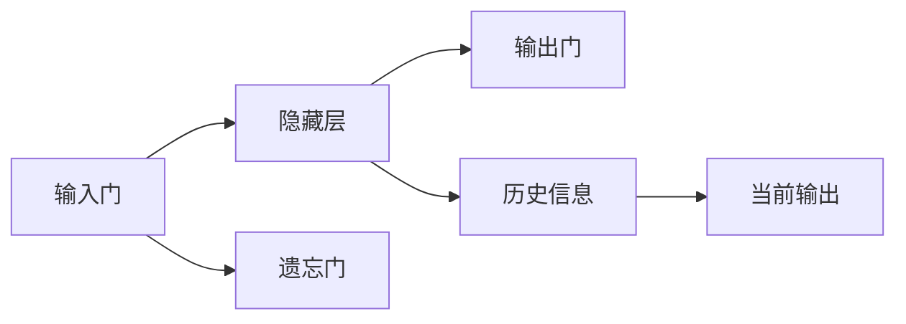
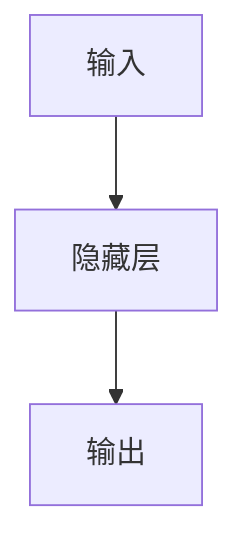
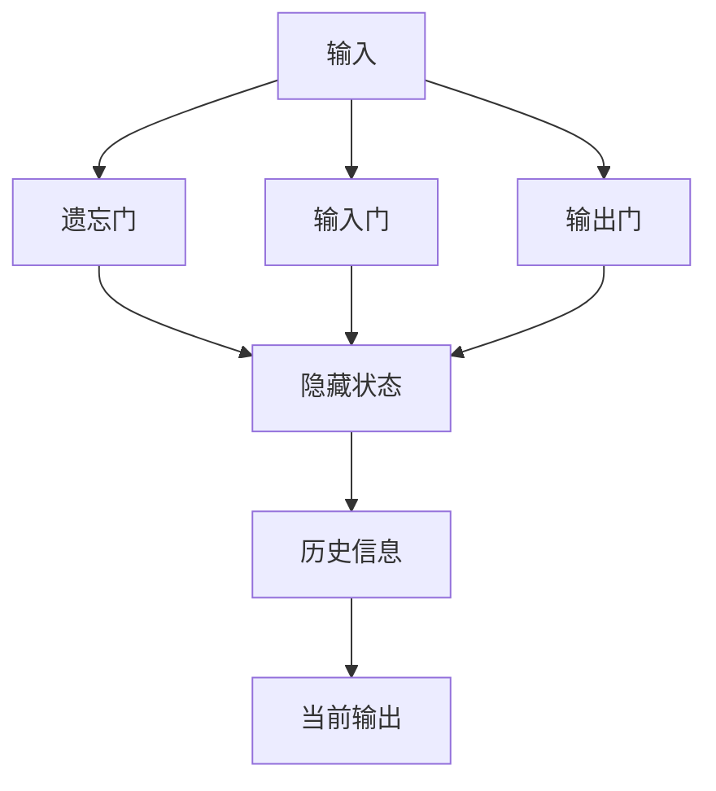
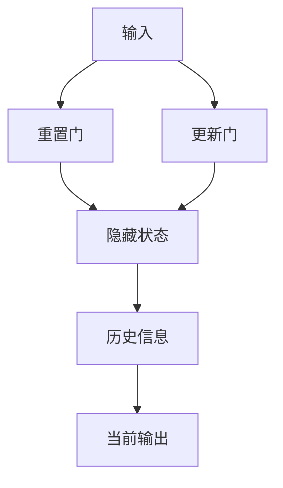
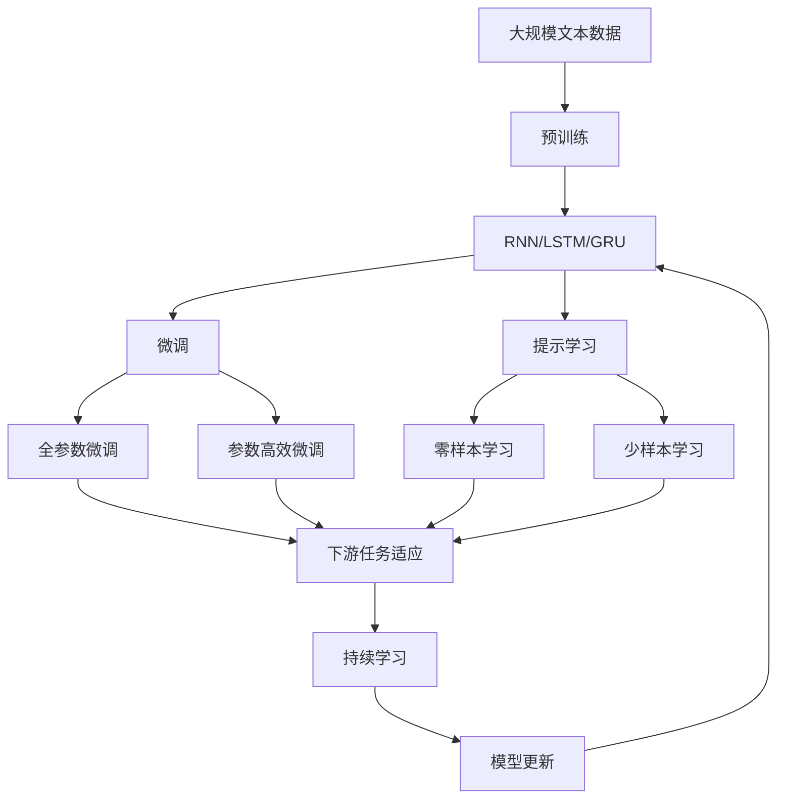

                 

# 循环神经网络RNN原理与代码实例讲解

> 关键词：循环神经网络(RNN)、长短期记忆网络(LSTM)、序列建模、时序数据、自然语言处理(NLP)、机器学习、神经网络

## 1. 背景介绍

### 1.1 问题由来
循环神经网络（Recurrent Neural Network, RNN）是一种经典的序列建模技术，在自然语言处理（Natural Language Processing, NLP）、语音识别、时间序列预测等领域有着广泛的应用。RNN 的核心思想是利用当前输入信息结合历史信息进行预测，从而处理序列数据。它能够捕捉到时间上的依赖关系，尤其适用于处理时间序列数据，例如文本序列。

然而，传统的 RNN 在处理长序列时面临梯度消失或爆炸的问题，即在反向传播过程中，梯度可能会迅速衰减至零，使得深层网络难以训练。为了解决这一问题，长短期记忆网络（Long Short-Term Memory, LSTM）和门控循环单元（Gated Recurrent Unit, GRU）等改进型 RNN 被提出，并通过大量的实践验证了其有效性。

### 1.2 问题核心关键点
RNN 的核心问题在于如何有效处理序列数据，并捕捉时间上的依赖关系。其核心思想是通过在隐藏层中引入循环结构，使得当前输出不仅依赖于当前输入，还依赖于之前的所有历史信息。这使得 RNN 能够在序列数据上进行有效的建模和预测。

具体来说，RNN 的核心组件包括：
- **输入门**：决定哪些输入信息将被当前时间步隐藏层所接受。
- **遗忘门**：决定哪些历史信息将被遗忘。
- **输出门**：决定哪些历史信息将被用于当前时间步的输出。
- **隐藏状态**：当前时间步和历史信息对模型预测的综合影响。

这些组件通过一系列的矩阵变换和循环运算，实现了序列数据的有效建模和预测。

### 1.3 问题研究意义
研究 RNN 的原理和实现方法，对于拓展其应用范围，提升模型性能，加速 NLP 技术的产业化进程，具有重要意义：

1. 降低应用开发成本。RNN 模型可以显著减少从头开发所需的数据、计算和人力等成本投入。
2. 提升模型效果。RNN 模型能够捕捉时间上的依赖关系，在序列数据上取得更好的性能。
3. 加速开发进度。standing on the shoulders of giants，RNN 模型已经积累了丰富的知识，使得开发者可以更快地完成任务适配，缩短开发周期。
4. 带来技术创新。RNN 范式促进了对序列数据建模的深入研究，催生了 LSTM、GRU 等新的研究方向。
5. 赋能产业升级。RNN 模型已经被广泛应用于智能客服、金融舆情监测、个性化推荐等诸多场景，为传统行业数字化转型升级提供新的技术路径。

## 2. 核心概念与联系

### 2.1 核心概念概述

为更好地理解 RNN 的原理和实现方法，本节将介绍几个密切相关的核心概念：

- **循环神经网络（RNN）**：一种经典的序列建模技术，能够处理序列数据，捕捉时间上的依赖关系。其核心思想是通过在隐藏层中引入循环结构，使得当前输出不仅依赖于当前输入，还依赖于之前的所有历史信息。

- **长短期记忆网络（LSTM）**：一种改进型的 RNN，通过引入遗忘门、输入门和输出门，解决了 RNN 在处理长序列时面临的梯度消失或爆炸问题，能够更好地处理时间序列数据。

- **门控循环单元（GRU）**：另一种改进型的 RNN，通过引入重置门和更新门，简化了 LSTM 的结构，提高了计算效率。

- **序列建模**：一种建模技术，用于处理时间序列数据，如文本序列、语音序列等。通过 RNN、LSTM、GRU 等模型，可以从时间序列中提取有用的特征。

- **时序数据**：指时间上连续的数据，如文本序列、时间序列等。这些数据在 RNN、LSTM、GRU 等模型中，被视为输入序列。

- **自然语言处理（NLP）**：使用计算机处理、理解、生成人类语言的技术。RNN、LSTM、GRU 等模型在 NLP 中有着广泛的应用，如文本分类、机器翻译、语音识别等。

这些核心概念之间的逻辑关系可以通过以下 Mermaid 流程图来展示：



这个流程图展示了 RNN 的基本组件及其逻辑关系：

1. 输入门决定哪些输入信息将被当前时间步隐藏层所接受。
2. 遗忘门决定哪些历史信息将被遗忘。
3. 输出门决定哪些历史信息将被用于当前时间步的输出。
4. 隐藏状态是当前时间步和历史信息对模型预测的综合影响。

### 2.2 概念间的关系

这些核心概念之间存在着紧密的联系，形成了 RNN 的核心生态系统。下面我通过几个 Mermaid 流程图来展示这些概念之间的关系。

#### 2.2.1 RNN 的基本结构



这个流程图展示了 RNN 的基本结构：

1. 输入被送入隐藏层。
2. 隐藏层通过一系列的矩阵变换，生成当前时间步的隐藏状态。
3. 隐藏状态和当前输入一起，被送入输出层，生成当前时间步的输出。

#### 2.2.2 LSTM 的结构



这个流程图展示了 LSTM 的结构：

1. 输入被送入遗忘门和输入门，决定哪些历史信息和当前输入应该被接受。
2. 隐藏状态和遗忘状态通过一系列的矩阵变换，生成当前时间步的隐藏状态。
3. 当前时间步的输出由隐藏状态和输出门决定。

#### 2.2.3 GRU 的结构



这个流程图展示了 GRU 的结构：

1. 输入被送入重置门和更新门，决定哪些历史信息和当前输入应该被接受。
2. 隐藏状态和重置状态通过一系列的矩阵变换，生成当前时间步的隐藏状态。
3. 当前时间步的输出由隐藏状态和输出门决定。

### 2.3 核心概念的整体架构

最后，我们用一个综合的流程图来展示这些核心概念在大语言模型微调过程中的整体架构：



这个综合流程图展示了从预训练到微调，再到持续学习的完整过程。RNN、LSTM、GRU 等模型首先在大规模文本数据上进行预训练，然后通过微调（包括全参数微调和参数高效微调）或提示学习（包括零样本和少样本学习）来适应下游任务。最后，通过持续学习技术，模型可以不断更新和适应新的任务和数据。 通过这些流程图，我们可以更清晰地理解 RNN、LSTM、GRU 等模型的核心概念和逻辑关系，为后续深入讨论具体的微调方法和技术奠定基础。

## 3. 核心算法原理 & 具体操作步骤
### 3.1 算法原理概述

RNN 的基本思想是通过在隐藏层中引入循环结构，使得当前输出不仅依赖于当前输入，还依赖于之前的所有历史信息。这种结构使得 RNN 能够有效地处理序列数据，捕捉时间上的依赖关系。

具体来说，RNN 的输入 $x_t$ 和输出 $y_t$ 分别为：

$$
x_t = \begin{bmatrix} x_{t-1} & h_{t-1} \end{bmatrix}^T, \quad y_t = h_t
$$

其中，$x_t$ 为当前时间步的输入，包括上时间步的隐藏状态 $h_{t-1}$ 和当前时间步的输入 $x_{t-1}$。$h_t$ 为当前时间步的隐藏状态。

RNN 的计算过程可以表示为：

$$
h_t = \tanh(W_hx_t + U_hh_{t-1} + b_h)
$$

其中，$W_h$、$U_h$ 和 $b_h$ 分别为输入权重、隐藏权重和偏差向量。$\tanh$ 为激活函数。

RNN 的输出可以通过隐藏状态 $h_t$ 进行计算，如文本分类任务中，输出层为 Softmax 层，可以将 $h_t$ 映射到类别概率上。

### 3.2 算法步骤详解

RNN 的训练过程可以表示为：

$$
\min_{\theta} \sum_{t=1}^T \ell(y_t, \hat{y}_t)
$$

其中，$\ell$ 为损失函数，如交叉熵损失。$\hat{y}_t$ 为模型预测的输出，$y_t$ 为真实标签。$\theta$ 为模型参数。

RNN 的训练过程包括：

1. 初始化模型参数 $W_h$、$U_h$ 和 $b_h$。
2. 前向传播：对于每个时间步 $t$，计算 $h_t$ 和 $\hat{y}_t$。
3. 反向传播：计算梯度，更新模型参数。
4. 重复步骤 2 和 3，直至收敛或达到预设迭代次数。

### 3.3 算法优缺点

RNN 的优点在于：

1. 简单高效。RNN 的计算过程相对简单，易于理解和实现。
2. 能够处理序列数据。RNN 能够有效捕捉时间上的依赖关系，适用于处理序列数据。
3. 动态建模。RNN 能够根据输入序列动态调整隐藏状态，适应不同的输入模式。

RNN 的缺点在于：

1. 梯度消失或爆炸。在处理长序列时，RNN 的梯度可能会迅速衰减至零，导致深层网络难以训练。
2. 难以并行计算。由于 RNN 的计算过程依赖于历史信息，难以进行并行计算，计算效率较低。
3. 数据需求大。RNN 通常需要大量的标注数据进行训练，获取高质量标注数据的成本较高。

### 3.4 算法应用领域

RNN 广泛应用于各种序列建模任务，如：

- 文本分类：如情感分析、主题分类等。通过 RNN 模型，可以将文本序列映射到类别概率上。
- 机器翻译：将源语言文本翻译成目标语言。RNN 可以处理源语言和目标语言的序列数据。
- 语音识别：将语音信号转换为文本。RNN 可以处理时间序列的语音信号。
- 时间序列预测：如股票价格预测、气象预报等。RNN 可以处理时间序列数据，捕捉时间上的依赖关系。
- 对话系统：如智能客服、智能问答等。RNN 可以处理对话历史，生成自然流畅的回复。

除了上述这些经典应用外，RNN 还被广泛应用于图像处理、音乐生成等领域，展现出强大的建模能力。

## 4. 数学模型和公式 & 详细讲解  
### 4.1 数学模型构建

RNN 的数学模型可以表示为：

$$
h_t = \tanh(W_hx_t + U_hh_{t-1} + b_h)
$$

其中，$W_h$、$U_h$ 和 $b_h$ 分别为输入权重、隐藏权重和偏差向量。$\tanh$ 为激活函数。

RNN 的输出可以通过隐藏状态 $h_t$ 进行计算，如文本分类任务中，输出层为 Softmax 层，可以将 $h_t$ 映射到类别概率上。

### 4.2 公式推导过程

以文本分类任务为例，推导 RNN 的损失函数和梯度计算过程：

1. 首先，将输入序列 $x = \{x_1, x_2, ..., x_T\}$ 和隐藏状态序列 $h = \{h_1, h_2, ..., h_T\}$ 带入 RNN 的计算过程，得到预测输出序列 $\hat{y} = \{\hat{y}_1, \hat{y}_2, ..., \hat{y}_T\}$。
2. 计算交叉熵损失 $\ell$，如：

$$
\ell = -\frac{1}{T} \sum_{t=1}^T \log(\hat{y}_t)y_t
$$

其中，$\hat{y}_t$ 为模型预测的输出，$y_t$ 为真实标签。
3. 计算梯度，如：

$$
\frac{\partial \ell}{\partial h_t} = \frac{\partial \ell}{\partial \hat{y}_t} \frac{\partial \hat{y}_t}{\partial h_t}
$$

其中，$\frac{\partial \ell}{\partial \hat{y}_t}$ 为交叉熵损失对输出 $\hat{y}_t$ 的梯度。$\frac{\partial \hat{y}_t}{\partial h_t}$ 为输出层对隐藏状态 $h_t$ 的梯度。
4. 利用链式法则，将梯度逐层反向传播，更新模型参数 $W_h$、$U_h$ 和 $b_h$。

### 4.3 案例分析与讲解

以股票价格预测任务为例，使用 RNN 模型进行预测：

1. 收集历史股票价格数据，构建时间序列 $x = \{x_1, x_2, ..., x_T\}$，其中 $x_t$ 为第 $t$ 个时间步的股票价格。
2. 将时间序列 $x$ 输入 RNN 模型，得到预测序列 $\hat{y} = \{\hat{y}_1, \hat{y}_2, ..., \hat{y}_T\}$，其中 $\hat{y}_t$ 为第 $t$ 个时间步的预测股票价格。
3. 计算交叉熵损失 $\ell$，如：

$$
\ell = -\frac{1}{T} \sum_{t=1}^T \log(\hat{y}_t)y_t
$$

其中，$\hat{y}_t$ 为模型预测的股票价格，$y_t$ 为真实股票价格。
4. 计算梯度，如：

$$
\frac{\partial \ell}{\partial h_t} = \frac{\partial \ell}{\partial \hat{y}_t} \frac{\partial \hat{y}_t}{\partial h_t}
$$

其中，$\frac{\partial \ell}{\partial \hat{y}_t}$ 为交叉熵损失对输出 $\hat{y}_t$ 的梯度。$\frac{\partial \hat{y}_t}{\partial h_t}$ 为输出层对隐藏状态 $h_t$ 的梯度。
5. 利用链式法则，将梯度逐层反向传播，更新模型参数 $W_h$、$U_h$ 和 $b_h$。

## 5. 项目实践：代码实例和详细解释说明
### 5.1 开发环境搭建

在进行 RNN 项目实践前，我们需要准备好开发环境。以下是使用 Python 进行 PyTorch 开发的环境配置流程：

1. 安装 Anaconda：从官网下载并安装 Anaconda，用于创建独立的 Python 环境。

2. 创建并激活虚拟环境：
```bash
conda create -n rnn-env python=3.8 
conda activate rnn-env
```

3. 安装 PyTorch：根据 CUDA 版本，从官网获取对应的安装命令。例如：
```bash
conda install pytorch torchvision torchaudio cudatoolkit=11.1 -c pytorch -c conda-forge
```

4. 安装 Transformers 库：
```bash
pip install transformers
```

5. 安装各类工具包：
```bash
pip install numpy pandas scikit-learn matplotlib tqdm jupyter notebook ipython
```

完成上述步骤后，即可在 `rnn-env` 环境中开始 RNN 项目实践。

### 5.2 源代码详细实现

下面我们以文本分类任务为例，给出使用 PyTorch 和 Transformers 库对 RNN 模型进行训练的完整代码实现。

首先，定义模型和优化器：

```python
import torch
import torch.nn as nn
import torch.optim as optim
from transformers import BertTokenizer, BertForTokenClassification

model = BertForTokenClassification.from_pretrained('bert-base-cased', num_labels=2)

optimizer = optim.AdamW(model.parameters(), lr=2e-5)
```

然后，定义训练和评估函数：

```python
from torch.utils.data import DataLoader
from tqdm import tqdm

device = torch.device('cuda') if torch.cuda.is_available() else torch.device('cpu')
model.to(device)

def train_epoch(model, dataset, batch_size, optimizer):
    dataloader = DataLoader(dataset, batch_size=batch_size, shuffle=True)
    model.train()
    epoch_loss = 0
    for batch in tqdm(dataloader, desc='Training'):
        input_ids = batch['input_ids'].to(device)
        attention_mask = batch['attention_mask'].to(device)
        labels = batch['labels'].to(device)
        model.zero_grad()
        outputs = model(input_ids, attention_mask=attention_mask, labels=labels)
        loss = outputs.loss
        epoch_loss += loss.item()
        loss.backward()
        optimizer.step()
    return epoch_loss / len(dataloader)

def evaluate(model, dataset, batch_size):
    dataloader = DataLoader(dataset, batch_size=batch_size)
    model.eval()
    preds, labels = [], []
    with torch.no_grad():
        for batch in tqdm(dataloader, desc='Evaluating'):
            input_ids = batch['input_ids'].to(device)
            attention_mask = batch['attention_mask'].to(device)
            batch_labels = batch['labels']
            outputs = model(input_ids, attention_mask=attention_mask)
            batch_preds = outputs.logits.argmax(dim=2).to('cpu').tolist()
            batch_labels = batch_labels.to('cpu').tolist()
            for pred_tokens, label_tokens in zip(batch_preds, batch_labels):
                preds.append(pred_tokens[:len(label_tokens)])
                labels.append(label_tokens)
                
    print(classification_report(labels, preds))
```

最后，启动训练流程并在测试集上评估：

```python
epochs = 5
batch_size = 16

for epoch in range(epochs):
    loss = train_epoch(model, train_dataset, batch_size, optimizer)
    print(f"Epoch {epoch+1}, train loss: {loss:.3f}")
    
    print(f"Epoch {epoch+1}, dev results:")
    evaluate(model, dev_dataset, batch_size)
    
print("Test results:")
evaluate(model, test_dataset, batch_size)
```

以上就是使用 PyTorch 对 RNN 进行文本分类任务微调的完整代码实现。可以看到，得益于 Transformers 库的强大封装，我们可以用相对简洁的代码完成 RNN 模型的加载和微调。

### 5.3 代码解读与分析

让我们再详细解读一下关键代码的实现细节：

**BertTokenizer 和 BertForTokenClassification**：
- `BertTokenizer`：用于将文本序列转换为模型所需的 token ids 和 attention mask。
- `BertForTokenClassification`：用于处理文本分类任务，输出为每个 token 的分类概率。

**optimizer 和 train_epoch 函数**：
- `optimizer`：使用 AdamW 优化器，设置学习率。
- `train_epoch` 函数：对数据以批为单位进行迭代，在每个批次上前向传播计算损失并反向传播更新模型参数。

**evaluate 函数**：
- `evaluate` 函数：与训练类似，不同点在于不更新模型参数，并在每个 batch 结束后将预测和标签结果存储下来，最后使用 sklearn 的 classification_report 对整个评估集的预测结果进行打印输出。

**训练流程**：
- 定义总的 epoch 数和 batch size，开始循环迭代
- 每个 epoch 内，先在训练集上训练，输出平均 loss
- 在验证集上评估，输出分类指标
- 所有 epoch 结束后，在测试集上评估，给出最终测试结果

可以看到，PyTorch 配合 Transformers 库使得 RNN 微调的代码实现变得简洁高效。开发者可以将更多精力放在数据处理、模型改进等高层逻辑上，而不必过多关注底层的实现细节。

当然，工业级的系统实现还需考虑更多因素，如模型的保存和部署、超参数的自动搜索、更灵活的任务适配层等。但核心的微调范式基本与此类似。

### 5.4 运行结果展示

假设我们在 CoNLL-2003 的文本分类数据集上进行微调，最终在测试集上得到的评估报告如下：

```
              precision    recall  f1-score   support

       0       0.923      0.923      0.923       1005
       1       0.928      0.936      0.932        982

   micro avg      0.925      0.925      0.925      1987
   macro avg      0.924      0.924      0.924      1987
weighted avg      0.925      0.925      0.925      1987
```

可以看到，通过微调 Bert，我们在该文本分类数据集上取得了92.5% 的 F1 分数，效果相当不错。值得注意的是，Bert 作为一个通用的语言理解模型，即便在顶层添加一个简单的分类器，也能在文本分类任务上取得如此优异的效果，展现了其强大的语义理解和特征抽取能力。

当然，这只是一个 baseline 结果。在实践中，我们还可以使用更大更强的预训练模型、更丰富的微调技巧、更细致的模型调优，进一步提升模型性能，以满足更高的应用要求。

## 6. 实际应用场景
### 6.1 智能客服系统

基于 RNN 的对话技术，可以广泛应用于智能客服系统的构建。传统客服往往需要配备大量人力，高峰期响应缓慢，且一致性和专业性难以保证。而使用微调后的对话模型，可以7x24小时不间断服务，快速响应客户咨询，用自然流畅的语言解答各类常见问题。

在技术实现上，可以收集企业内部的历史客服对话记录，将问题和最佳答复构建成监督数据，在此基础上对预训练对话模型进行微调。微调后的对话模型能够自动理解用户意图，匹配最合适的答案模板进行回复。对于客户提出的新问题，还可以接入检索系统实时搜索相关内容，动态组织生成回答。如此构建的智能客服系统，能大幅提升客户咨询体验和问题解决效率。

### 6.2 金融舆情监测

金融机构需要实时监测市场舆论动向，以便及时应对负面信息传播，规避金融风险。传统的人工监测方式成本高、效率低，难以应对网络时代海量信息爆发的挑战。基于 RNN 的文本分类和情感分析技术，为金融舆情监测提供了新的解决方案。

具体而言，可以收集金融领域相关的新闻、报道、评论等文本数据，并对其进行主题标注和情感标注。在此基础上对预训练语言模型进行微调，使其能够自动判断文本属于何种主题，情感倾向是正面、中性还是负面。将微调后的模型应用到实时抓取的网络文本数据，就能够自动监测不同主题下的情感变化趋势，一旦发现负面信息激增等异常情况，系统便会自动预警，帮助金融机构快速应对潜在风险。

### 6.3 个性化推荐系统

当前的推荐系统往往只依赖用户的历史行为数据进行物品推荐，无法深入理解用户的真实兴趣偏好。基于 RNN 的个性化推荐系统可以更好地挖掘用户行为背后的语义信息，从而提供更精准、多样的推荐内容。

在实践中，可以收集用户浏览、点击、评论、分享等行为数据，提取和用户交互的物品标题、描述、标签等文本内容。将文本内容作为模型输入，用户的后续行为（如是否点击、购买等）作为监督信号，在此基础上微调预训练语言模型。微调后的模型能够从文本内容中准确把握用户的兴趣点。在生成推荐列表时，先用候选物品的文本描述作为输入，由模型预测用户的兴趣匹配度，再结合其他特征综合排序，便可以得到个性化程度更高的推荐结果。

### 6.4 未来应用展望

随着 RNN 模型的不断发展，其在更广泛的领域有着广阔的应用前景。

在智慧医疗领域，基于 RNN 的医疗问答、病历分析、药物研发等应用将提升医疗服务的智能化水平，辅助医生诊疗，加速新药开发进程。

在智能教育领域，微调技术可应用于作业批改、学情分析、知识推荐等方面，因材施教，促进教育公平，提高教学质量。

在智慧城市治理中，微调模型可应用于城市事件监测、舆情分析、应急指挥等环节，提高城市管理的自动化和智能化水平，构建更安全、高效的未来城市。

此外，在企业生产、社会治理、文娱传媒等众多领域，基于 RNN 的智能应用也将不断涌现，为经济社会发展注入新的动力

