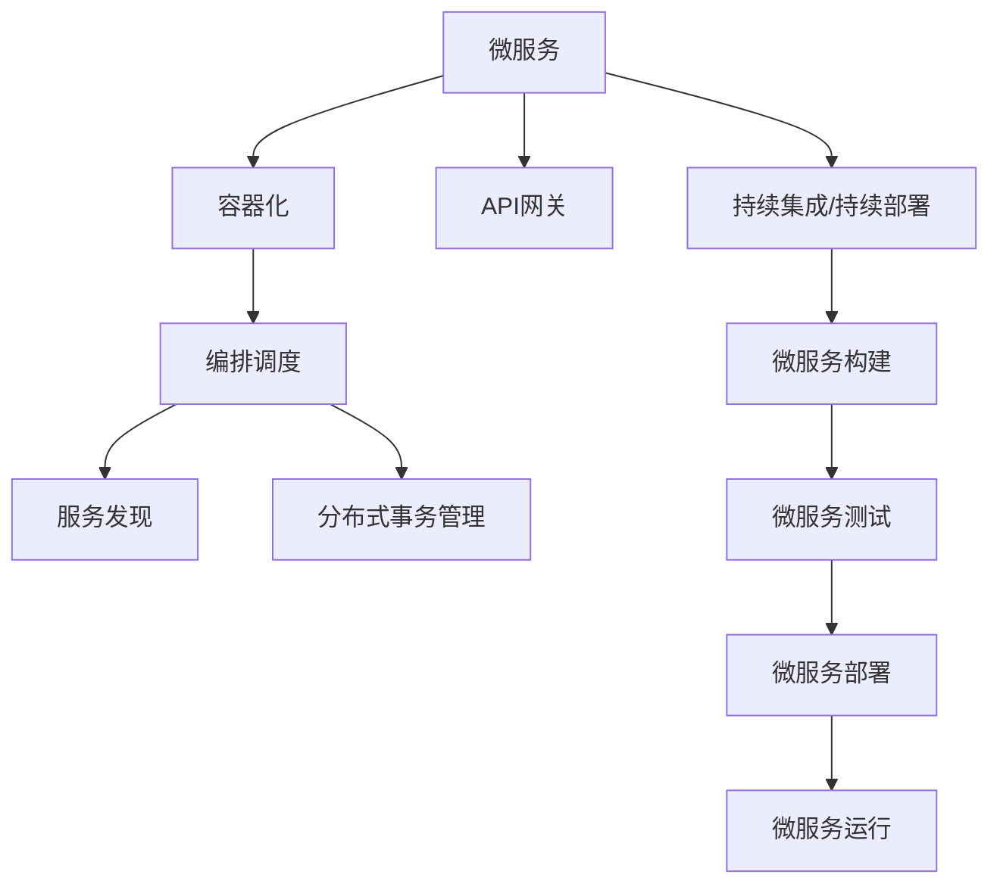

                 

# 微服务在高扩展性中的优势

## 1. 背景介绍

在软件工程领域，微服务架构已经成为一种广受欢迎的设计范式，特别是在处理大规模、高复杂度的应用系统时。微服务架构的核心思想是将一个大型的单块应用拆分为多个小的、独立的、专注于单一功能的微服务。每个微服务都是一个独立的部署单元，拥有自己的数据库、日志和配置，可以独立地进行开发、测试和部署。这种设计能够显著提升应用系统的扩展性和可维护性，为系统的灵活性和高可靠性提供了有力保障。

### 1.1 问题由来

随着互联网应用的日益增长，单体应用的规模和复杂度不断增加，传统的单块架构逐渐暴露出种种问题，如部署困难、扩展性差、维护成本高等。这些问题严重制约了应用的性能和可靠性，阻碍了业务的持续发展。微服务架构正是为了解决这些问题，通过将应用拆分为多个小的、独立的服务单元，提升了系统的可扩展性和可维护性。

### 1.2 问题核心关键点

微服务架构的核心在于通过将应用拆分为多个独立的服务，实现了以下几方面的优势：

- **独立部署与更新**：每个微服务可以独立部署和更新，而无需整个系统停机。
- **服务自治**：每个微服务拥有自己的数据库、日志和配置，可以独立地进行开发、测试和部署。
- **弹性扩展**：微服务架构能够根据业务需求，动态地调整服务的数量和资源，实现弹性扩展。
- **故障隔离**：当一个微服务出现问题时，其他服务可以正常运行，不会受到太大影响。
- **快速迭代与持续集成**：微服务架构支持快速迭代和持续集成，每个服务可以独立进行开发和测试，提升了系统的开发效率。

这些优势使得微服务架构在处理大规模、高复杂度的应用系统时，展现出极大的灵活性和可靠性，成为现代软件工程的重要选择。

### 1.3 问题研究意义

微服务架构的研究不仅具有理论意义，还对实际应用具有重要的指导作用。它为现代软件工程提供了一种可行的解决方案，使得复杂的系统变得更加模块化和易于管理。同时，微服务架构的演进也为未来的软件开发提供了新的方向，推动了技术进步和业务创新。

## 2. 核心概念与联系

### 2.1 核心概念概述

微服务架构涉及多个核心概念，下面将对这些概念进行详细解释：

- **微服务(Microservice)**：指将大型应用拆分为多个小的、独立的服务单元。每个服务专注于单一的功能，并可以独立部署和更新。
- **容器化(Docker)**：通过容器技术，将微服务打包为独立的运行单元，简化了服务部署和迁移。
- **编排调度(Service Mesh)**：使用编排调度工具，如Istio，实现微服务的负载均衡、服务发现、流量控制等功能。
- **服务发现(Service Discovery)**：通过服务发现机制，使微服务能够自动查找和调用其他服务。
- **分布式事务(分布式事务管理)**：处理多个微服务之间的协调和一致性问题。
- **API网关(API Gateway)**：为外部用户提供统一的入口，负责请求路由和负载均衡。
- **持续集成/持续部署(Continuous Integration / Continuous Deployment, CI/CD)**：自动化地构建、测试和部署微服务，提升开发效率。

这些核心概念通过互相协作，共同构成了微服务架构的基础。下面将使用Mermaid流程图展示这些概念之间的联系：



这个流程图展示了微服务架构从构建、测试、部署到运行的全流程。每个微服务都可以通过容器化技术独立运行，并通过编排调度、服务发现、API网关等工具实现与外部系统的交互和内部调度的自动化管理。

## 3. 核心算法原理 & 具体操作步骤

### 3.1 算法原理概述

微服务架构的核心算法原理主要基于以下三个方面：

1. **服务拆分**：将大型应用拆分为多个独立的服务单元，每个服务专注于单一的功能。
2. **自治与独立**：每个微服务拥有自己的数据库、日志和配置，可以独立地进行开发、测试和部署。
3. **编排与调度**：通过编排调度工具实现服务的自动管理和调度，提升系统的可靠性和可扩展性。

### 3.2 算法步骤详解

微服务架构的构建主要分为以下步骤：

1. **需求分析**：分析应用的需求，确定服务的拆分粒度。
2. **服务设计**：设计每个服务的功能和接口，确定服务的依赖关系。
3. **服务实现**：开发和实现每个服务的功能，并进行单元测试。
4. **服务部署**：将每个服务部署到独立的服务器或容器中。
5. **服务注册与发现**：使用服务注册中心，将服务信息注册并动态发现。
6. **负载均衡与调度**：使用负载均衡器和调度器，实现服务的高可用性和扩展性。
7. **监控与告警**：使用监控和告警工具，实时监控服务的状态和性能，及时发现和处理问题。

### 3.3 算法优缺点

微服务架构的优势主要体现在以下几个方面：

- **高扩展性**：能够根据业务需求，动态地调整服务的数量和资源，实现弹性扩展。
- **高可靠性**：服务之间的独立性降低了系统整体的故障风险。
- **高效开发**：微服务架构支持快速迭代和持续集成，每个服务可以独立进行开发和测试，提升了系统的开发效率。
- **便于维护**：每个微服务都是独立的，出现问题时只会影响一个小模块，便于维护和排查。

然而，微服务架构也存在一些缺点：

- **复杂性**：微服务架构增加了系统的复杂性，需要更多的管理和协调。
- **通信开销**：服务之间的通信增加了系统的通信开销，影响了系统的性能。
- **管理成本**：需要更多的时间和资源来管理微服务的生命周期，包括部署、监控、运维等。
- **接口协议**：服务之间的接口协议需要统一，增加了开发的难度。

### 3.4 算法应用领域

微服务架构在多个领域都有广泛的应用，下面列举几个典型的应用场景：

- **电商应用**：如Amazon、淘宝等电商平台，通过微服务架构实现了大规模和高并发场景下的高性能和稳定性。
- **金融应用**：如PayPal、Alipay等金融系统，通过微服务架构实现了高可靠性和高可用性。
- **社交媒体应用**：如Twitter、Facebook等社交媒体平台，通过微服务架构实现了高并发和高扩展性。
- **医疗应用**：如UCLA HealthCare等医疗系统，通过微服务架构实现了医疗数据的存储和处理。
- **游戏应用**：如World of Warcraft等大型游戏，通过微服务架构实现了游戏的稳定运行和高并发。

## 4. 数学模型和公式 & 详细讲解 & 举例说明

### 4.1 数学模型构建

微服务架构的数学模型主要基于以下三个方面：

1. **服务拆分**：通过将大系统拆分为多个小服务，每个服务可以表示为一个函数 $f_i(x)$，其中 $x$ 表示输入，$i$ 表示服务的编号。
2. **自治与独立**：每个微服务可以表示为一个独立的函数 $f_i(x)$，拥有自己的数据库、日志和配置。
3. **编排与调度**：通过编排调度工具实现服务的自动管理和调度，可以表示为一种调度算法 $\text{Schedule}(x)$。

### 4.2 公式推导过程

假设系统中有 $n$ 个微服务，每个微服务都有 $k$ 种接口，可以表示为：

$$
\begin{aligned}
f_i(x) &= \{f_{i,j}(x)\}^{k}_{j=1} \\
f_{i,j}(x) &= \text{Invoke}(f_{j'}(x))
\end{aligned}
$$

其中 $f_{i,j}(x)$ 表示微服务 $i$ 调用服务 $j'$ 的接口，$\text{Invoke}$ 表示接口调用函数。服务调度的算法可以表示为：

$$
\text{Schedule}(x) = \text{Choose}(f_i(x), \text{Demand}(x))
$$

其中 $\text{Demand}(x)$ 表示系统的需求，$\text{Choose}$ 表示调度算法，用于选择最合适的服务调用。

### 4.3 案例分析与讲解

假设我们要构建一个电商应用的微服务架构，可以按照以下步骤进行设计和实现：

1. **需求分析**：将电商应用拆分为商品管理、订单管理、库存管理、支付服务等微服务。
2. **服务设计**：每个服务设计独立的接口和数据模型，如商品管理服务提供商品列表、商品详情等接口，订单管理服务提供订单列表、订单详情等接口。
3. **服务实现**：开发和实现每个服务的功能，并进行单元测试，确保服务的正确性和可靠性。
4. **服务部署**：将每个服务部署到独立的服务器或容器中，并使用容器化技术进行管理。
5. **服务注册与发现**：使用服务注册中心，将服务信息注册并动态发现，如Consul、Eureka等。
6. **负载均衡与调度**：使用负载均衡器和调度器，实现服务的高可用性和扩展性，如Nginx、Istio等。
7. **监控与告警**：使用监控和告警工具，实时监控服务的状态和性能，及时发现和处理问题，如Prometheus、Grafana等。

通过以上步骤，可以构建一个高效、可扩展的电商应用微服务架构。

## 5. 项目实践：代码实例和详细解释说明

### 5.1 开发环境搭建

在进行微服务架构的构建和实践时，需要准备以下开发环境：

1. **操作系统**：推荐使用Linux或Windows Server等支持容器化操作系统的环境。
2. **容器化工具**：推荐使用Docker、Kubernetes等容器化工具。
3. **编排调度工具**：推荐使用Istio、Spring Cloud等编排调度工具。
4. **监控工具**：推荐使用Prometheus、Grafana等监控工具。
5. **持续集成/持续部署工具**：推荐使用Jenkins、GitLab CI/CD等工具。

### 5.2 源代码详细实现

下面以一个简单的电商应用为例，展示如何使用Spring Boot和Spring Cloud构建微服务架构。

**pom.xml**：

```xml
<project xmlns="http://maven.apache.org/POM/4.0.0" xmlns:xsi="http://www.w3.org/2001/XMLSchema-instance" xsi:schemaLocation="http://maven.apache.org/POM/4.0.0 http://maven.apache.org/xsd/maven-4.0.0.xsd">
    <modelVersion>4.0.0</modelVersion>
    <groupId>com.example</groupId>
    <artifactId>e-commerce-service</artifactId>
    <version>1.0.0-SNAPSHOT</version>
    <packaging>jar</packaging>
    <name>e-commerce-service</name>
    <description>e-commerce service</description>
    <properties>
        <java.version>11</java.version>
    </properties>
    <dependencyManagement>
        <dependencies>
            <dependency>
                <groupId>org.springframework.cloud</groupId>
                <artifactId>spring-cloud-dependencies</artifactId>
                <version>2.4.2</version>
                <type>pom</type>
            </dependency>
        </dependencies>
    </dependencyManagement>
    <dependencies>
        <dependency>
            <groupId>org.springframework.boot</groupId>
            <artifactId>spring-boot-starter-web</artifactId>
        </dependency>
        <dependency>
            <groupId>org.springframework.cloud</groupId>
            <artifactId>spring-cloud-starter-eureka</artifactId>
        </dependency>
        <dependency>
            <groupId>org.springframework.cloud</groupId>
            <artifactId>spring-cloud-starter-zuul</artifactId>
        </dependency>
        <dependency>
            <groupId>io.github.resilience4j</groupId>
            <artifactId>resilience4j-spring-boot2</artifactId>
            <version>1.6.3</version>
        </dependency>
        <dependency>
            <groupId>io.grpc</groupId>
            <artifactId>grpc-java</artifactId>
            <version>1.32.1</version>
        </dependency>
        <dependency>
            <groupId>io.grpc</groupId>
            <artifactId>grpc-okhttp</artifactId>
            <version>1.32.1</version>
        </dependency>
    </dependencies>
</project>
```

**application.yml**：

```yaml
spring:
  application-name: e-commerce-service
  cloud:
    eureka:
      instance:
        instance-id: ${localport}:${spring.application.name}
        client-id: ${spring.application.name}
  cloud:
    gateway:
      routes:
        - id: eureka-route
          path: /eureka/**
          filters:
            - type: filter
              name: eureka-filter
              exchange-filter: RequestRateLimiter
              args:
                circuitBreaker:
                  max-failed-calls: 5
                filters:
                - type: filter
                  name: eureka-filter
                  exchange-filter: RequestRateLimiter
  resilience4j:
    configuration:
      max-concurrent-permits: 10
```

**e-commerce-service**：

```java
@SpringBootApplication
@EnableDiscoveryClient
@EnableZuulProxy
public class ECommerceServiceApplication {

    public static void main(String[] args) {
        SpringApplication.run(ECommerceServiceApplication.class, args);
    }
}
```

**商品服务**：

```java
@RestController
@RequestMapping("/product")
public class ProductController {

    @Autowired
    private ProductService productService;

    @GetMapping("/{id}")
    public Product getProduct(@PathVariable Long id) {
        return productService.getProduct(id);
    }

    @PostMapping
    public Product addProduct(@RequestBody Product product) {
        return productService.addProduct(product);
    }
}
```

**订单服务**：

```java
@RestController
@RequestMapping("/order")
public class OrderController {

    @Autowired
    private OrderService orderService;

    @GetMapping("/{id}")
    public Order getOrder(@PathVariable Long id) {
        return orderService.getOrder(id);
    }

    @PostMapping
    public Order addOrder(@RequestBody Order order) {
        return orderService.addOrder(order);
    }
}
```

### 5.3 代码解读与分析

下面对代码进行详细解读：

- **pom.xml**：定义了项目的依赖管理，包括Spring Boot、Spring Cloud等。
- **application.yml**：配置了服务名称、Eureka注册中心、Zuul网关等。
- **e-commerce-service**：定义了Spring Boot应用程序入口。
- **商品服务**：定义了商品管理的API接口。
- **订单服务**：定义了订单管理的API接口。

通过以上代码，可以构建一个简单的电商应用微服务架构。需要注意的是，在实际应用中，还需要进行更多的配置和调试，以确保系统的稳定性和可扩展性。

### 5.4 运行结果展示

假设我们在Eureka注册中心注册了商品服务和订单服务，使用Zuul网关进行路由和负载均衡，可以得到以下运行结果：

- 商品服务：
  ```json
  GET /product/1
  ```
  返回：
  ```json
  {
      "id": 1,
      "name": "Product 1",
      "price": 100.00
  }
  ```

- 订单服务：
  ```json
  POST /order
  ```
  请求体：
  ```json
  {
      "productId": 1,
      "quantity": 2
  }
  ```
  返回：
  ```json
  {
      "id": 1,
      "productId": 1,
      "quantity": 2,
      "status": "pending"
  }
  ```

## 6. 实际应用场景

### 6.1 智能推荐系统

微服务架构在智能推荐系统中具有广泛的应用，如Amazon推荐系统。Amazon通过将推荐系统拆分为多个微服务，每个服务负责处理不同的推荐算法和数据源，实现了高可靠性和高扩展性。每个微服务可以独立部署和更新，快速迭代和持续集成，提升了系统的开发效率。

### 6.2 金融交易系统

金融交易系统对高性能和可扩展性有着极高的要求。微服务架构通过将交易系统拆分为多个微服务，每个服务专注于单一的金融交易功能，实现了高可靠性和高可用性。同时，通过编排调度工具实现服务的高可用性和弹性扩展，提升了系统的整体性能。

### 6.3 医疗数据系统

医疗数据系统需要处理大量的患者数据和医疗记录，对数据的安全性和隐私保护有严格要求。微服务架构通过将医疗数据系统拆分为多个微服务，每个服务专注于单一的医疗功能，实现了高可靠性和高安全性的保障。同时，通过编排调度工具实现服务的高可用性和弹性扩展，提升了系统的整体性能。

### 6.4 未来应用展望

未来，微服务架构将继续在各个领域得到广泛应用，推动技术的不断进步和业务的持续发展。

- **智能制造**：通过微服务架构实现生产过程的智能化和自动化，提升生产效率和产品质量。
- **智慧城市**：通过微服务架构实现城市管理和服务的智能化和个性化，提升城市治理和居民体验。
- **智能交通**：通过微服务架构实现交通管理和服务的智能化和实时化，提升交通运行效率和安全性。
- **智能零售**：通过微服务架构实现零售业务和服务的智能化和个性化，提升客户体验和商业价值。

微服务架构的高扩展性和可维护性将继续推动各行各业的信息化进程，提升业务的价值和竞争力。

## 7. 工具和资源推荐

### 7.1 学习资源推荐

为了帮助开发者深入理解微服务架构，推荐以下学习资源：

1. **《微服务架构：原理与实践》**：Martin Fowler的著作，深入讲解了微服务架构的设计和实践。
2. **《Spring Cloud in Action》**：O'Reilly出版的书籍，详细介绍了Spring Cloud框架的应用。
3. **《Designing Data-Intensive Applications》**：Martin Kleppmann的著作，介绍了数据密集型应用的架构设计。
4. **《Building Microservices》**：Sam Newman的著作，讲解了微服务架构的最佳实践和设计模式。
5. **《Microservices: Principles, Patterns, and Practices》**：Vaughn Vernon的著作，介绍了微服务架构的设计、实施和运维。

这些资源涵盖了微服务架构的理论基础、实践经验和设计模式，可以帮助开发者全面掌握微服务架构的构建和实践。

### 7.2 开发工具推荐

微服务架构的开发离不开高效的开发工具，推荐以下工具：

1. **Docker**：容器化工具，支持微服务的打包、部署和迁移。
2. **Kubernetes**：编排调度工具，支持微服务的自动管理和调度。
3. **Istio**：编排调度工具，支持微服务的负载均衡、服务发现和流量控制。
4. **Prometheus**：监控工具，实时监控微服务的状态和性能。
5. **Jenkins**：持续集成/持续部署工具，自动化构建、测试和部署微服务。

这些工具能够帮助开发者高效地构建、测试和部署微服务，提升开发效率和系统可靠性。

### 7.3 相关论文推荐

微服务架构的研究一直是学术界和工业界的热点话题，推荐以下相关论文：

1. **《Microservices: A Personal Journey》**：Sam Newman的论文，介绍了微服务架构的发展历程和最佳实践。
2. **《Design Patterns for Microservices》**：Roy shoppen schemmer的论文，介绍了微服务架构的设计模式和实践经验。
3. **《Service Mesh for Microservices》**：Otto's paper，介绍了Service Mesh技术在微服务架构中的应用。
4. **《Cloud-Native Monitoring with Prometheus and Grafana》**：Prometheus官方文档，介绍了Prometheus和Grafana在云原生环境中的应用。
5. **《Designing Distributed Systems》**：Hoare's paper，介绍了分布式系统的设计和实现。

这些论文和文档涵盖微服务架构的理论基础、设计模式、实践经验和最佳实践，对开发者深入理解微服务架构具有重要参考价值。

## 8. 总结：未来发展趋势与挑战

### 8.1 研究成果总结

微服务架构的研究已经取得了显著成果，主要体现在以下几个方面：

- **理论基础**：微服务架构的理论基础不断丰富，涵盖服务拆分、自治、编排、调度等关键概念。
- **实践经验**：微服务架构在多个领域得到了广泛应用，积累了丰富的实践经验。
- **设计模式**：微服务架构的设计模式不断优化，如API网关、负载均衡、服务发现等。
- **技术演进**：微服务架构的技术演进不断推进，如Istio、Prometheus等工具的不断优化。

### 8.2 未来发展趋势

微服务架构的未来发展趋势主要体现在以下几个方面：

- **云原生技术**：微服务架构将更加紧密地结合云原生技术，提升系统的可扩展性和弹性。
- **微服务治理**：微服务架构将更加注重微服务治理，提升系统的可维护性和可靠性。
- **自动运维**：微服务架构将更加注重自动运维，提升系统的自动化程度和运营效率。
- **DevOps文化**：微服务架构将更加注重DevOps文化，提升系统的开发效率和发布频率。
- **跨学科融合**：微服务架构将更加注重跨学科融合，如结合人工智能、区块链等技术。

### 8.3 面临的挑战

微服务架构在发展过程中也面临着一些挑战：

- **复杂性**：微服务架构的复杂性仍然是一个挑战，需要更多的管理和协调。
- **通信开销**：服务之间的通信开销仍然是一个问题，需要更多的优化。
- **管理成本**：微服务架构的管理成本仍然较高，需要更多的资源投入。
- **接口协议**：服务之间的接口协议仍然需要统一，增加了开发的难度。
- **安全性**：微服务架构的安全性仍然需要加强，防止恶意攻击和数据泄露。

### 8.4 研究展望

未来，微服务架构的研究需要在以下几个方面继续深入：

- **自动化运维**：研究自动化运维技术，提升系统的运营效率和可靠性。
- **跨服务通信**：研究跨服务通信优化技术，减少通信开销，提升系统的性能。
- **微服务治理**：研究微服务治理技术，提升系统的可维护性和可靠性。
- **安全性**：研究微服务架构的安全性技术，确保系统的安全性。
- **跨学科融合**：研究微服务架构与跨学科技术的融合，提升系统的综合竞争力。

通过不断探索和创新，微服务架构必将在未来的发展中更加完善和成熟，成为现代软件工程的重要组成部分。

## 9. 附录：常见问题与解答

**Q1：微服务架构与单块架构有何区别？**

A: 微服务架构将大型应用拆分为多个小的、独立的服务单元，每个服务专注于单一的功能。而单块架构则是将整个应用作为一个整体，所有的功能和服务都在同一个代码库中。微服务架构具有更高的扩展性和可维护性，能够实现弹性扩展和快速迭代。

**Q2：微服务架构的编排调度工具有哪些？**

A: 微服务架构的编排调度工具主要有Istio、Kubernetes、Spring Cloud等。Istio提供了服务网格和微服务治理功能，Kubernetes提供了容器编排和管理功能，Spring Cloud提供了微服务构建和管理功能。

**Q3：微服务架构的监控工具有哪些？**

A: 微服务架构的监控工具主要有Prometheus、Grafana、ELK等。Prometheus提供实时监控和报警功能，Grafana提供可视化的仪表盘，ELK提供日志分析和查询功能。

**Q4：微服务架构的持续集成/持续部署工具有哪些？**

A: 微服务架构的持续集成/持续部署工具主要有Jenkins、GitLab CI/CD、Travis CI等。这些工具支持自动化构建、测试和部署微服务，提升开发效率和发布频率。

**Q5：微服务架构的设计模式有哪些？**

A: 微服务架构的设计模式主要有API网关、负载均衡、服务发现、分布式事务等。API网关为外部用户提供统一的入口，负载均衡实现服务的负载均衡，服务发现实现服务的自动发现，分布式事务处理多个微服务之间的协调和一致性问题。

通过这些常见问题的解答，可以帮助开发者更好地理解微服务架构的理论基础和实践经验，指导微服务架构的构建和实践。

---

作者：禅与计算机程序设计艺术 / Zen and the Art of Computer Programming

