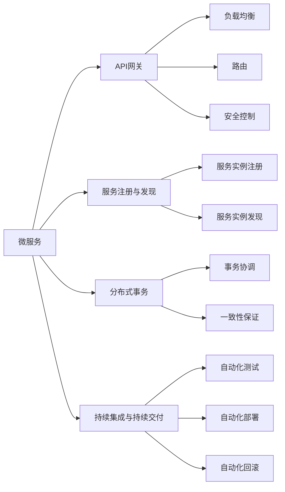
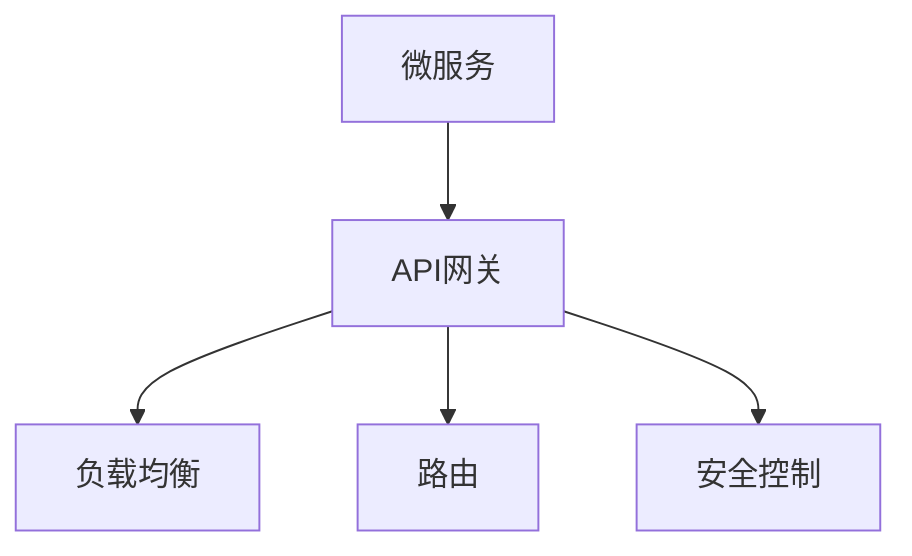
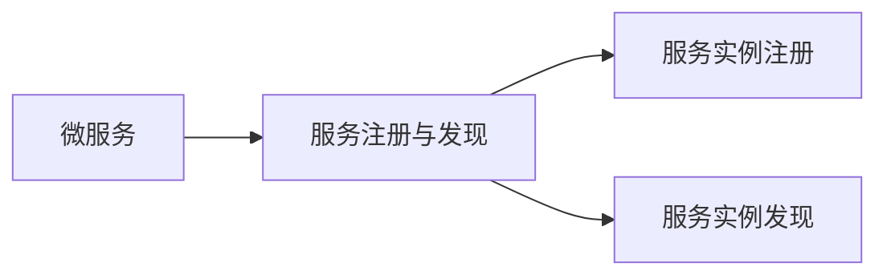
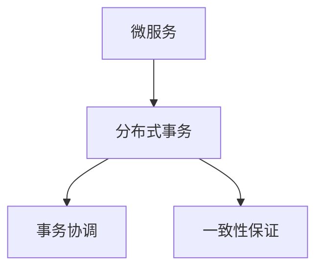
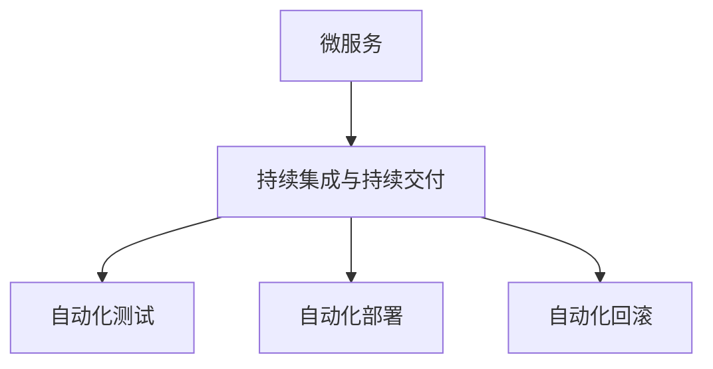
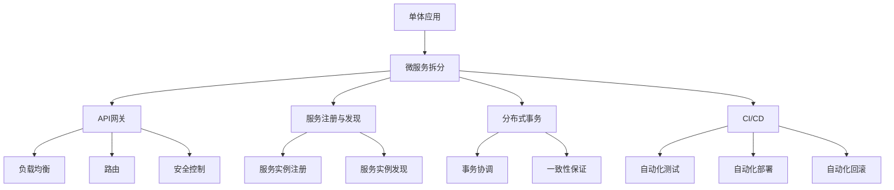

                 

# 微服务架构在系统设计中的实例

## 1. 背景介绍

在过去几十年中，企业级系统设计理念经历了从单体应用（Monolithic Application）到微服务（Microservices）的演变。单体应用早期的开发模式简单、代码易于理解，但在系统的规模扩大时，代码的复杂性急剧增加，维护成本大幅上升。微服务架构应运而生，通过将大系统拆分成多个小服务，独立部署和运行，提升了系统的灵活性、可扩展性和可维护性。

微服务架构的思想源于云计算和分布式系统的发展。云平台提供了快速部署、按需扩展、弹性伸缩等特性，使得微服务架构的实际应用成为可能。微服务架构最初由Netflix提出，其核心思想是将一个应用拆分为多个独立运行的服务，每个服务都围绕其业务功能构建，并通过轻量级的通信机制（如HTTP REST、gRPC等）进行相互调用。

微服务架构的核心原则包括：

- 服务自治：每个服务独立运行，可以独立部署和扩展，不受其他服务影响。
- 无状态化：服务之间不依赖状态，通过API调用进行通信，提高系统可扩展性和容错性。
- 独立部署：每个服务独立打包和部署，可以并行发布更新，缩短系统升级周期。
- 分布式管理：每个服务有自己的数据存储和事务控制，通过API网关统一管理。
- 持续集成和持续交付：通过自动化工具，加速代码开发、测试、部署和回滚的流程。

微服务架构的优点在于：

1. 提高系统可扩展性：每个服务独立扩展，可适应不同的业务需求。
2. 提升系统灵活性：每个服务独立开发和部署，提升团队协作效率。
3. 降低系统风险：通过服务独立部署，系统故障不会扩散到其他服务。
4. 增强系统可用性：通过服务的弹性伸缩，保证系统的高可用性和容错性。

但微服务架构也面临一些挑战，包括服务间的通信复杂度增加、分布式事务处理复杂性提高、系统管理和调试难度加大等。因此，设计和管理一个成功的微服务系统需要深入理解其架构和核心原则。

## 2. 核心概念与联系

### 2.1 核心概念概述

微服务架构涉及多个核心概念，这些概念共同构成了微服务系统设计的基石。

- **微服务（Microservices）**：独立运行、独立扩展、独立部署的服务单元，每个服务围绕其特定的业务功能构建。
- **API网关（API Gateway）**：统一管理和路由服务间通信，提供负载均衡、路由、安全控制等功能。
- **服务注册与发现（Service Registry and Discovery）**：管理服务实例的注册、发现和负载均衡，确保服务间的高效通信。
- **分布式事务（Distributed Transactions）**：跨服务的事务协调和一致性保证，处理分布式环境下的数据一致性问题。
- **持续集成与持续交付（CI/CD）**：通过自动化工具和流程，实现代码开发、测试、部署和回滚的自动化。

这些概念之间的联系可以通过以下Mermaid流程图来展示：



这个流程图展示了大系统通过微服务架构拆分成多个小服务的过程，以及这些服务间的通信、管理、事务处理和自动化流程。

### 2.2 概念间的关系

这些核心概念之间存在着紧密的联系，形成了微服务系统设计的完整生态系统。下面通过几个Mermaid流程图来展示这些概念之间的关系。

#### 2.2.1 微服务与API网关的关系



这个流程图展示了微服务与API网关的关系。微服务通过API网关进行统一管理和路由，API网关负责负载均衡、路由和安全性控制，确保服务间的高效通信和数据安全。

#### 2.2.2 微服务与服务注册与发现的关系



这个流程图展示了微服务与服务注册与发现的关系。微服务通过服务注册与发现系统进行注册和发现，服务实例的注册和发现有助于实现负载均衡和服务故障的快速恢复。

#### 2.2.3 微服务与分布式事务的关系



这个流程图展示了微服务与分布式事务的关系。微服务通过分布式事务系统进行跨服务的事务协调和一致性保证，处理分布式环境下的数据一致性问题。

#### 2.2.4 微服务与CI/CD的关系



这个流程图展示了微服务与CI/CD的关系。微服务通过CI/CD系统进行代码的自动化开发、测试、部署和回滚，加速开发和部署流程，提高系统的稳定性和可靠性。

### 2.3 核心概念的整体架构

最后，我们用一个综合的流程图来展示这些核心概念在大系统中的整体架构：



这个综合流程图展示了从单体应用到微服务架构的演变过程，以及微服务架构中各个组件之间的关系和作用。通过这些概念和架构，微服务系统可以高效、灵活、可扩展地运行。

## 3. 核心算法原理 & 具体操作步骤
### 3.1 算法原理概述

微服务架构的核心思想是通过将大系统拆分成多个独立运行的服务，独立部署和扩展，提升系统的灵活性、可扩展性和可维护性。微服务架构的设计和实现需要解决多个技术难题，包括服务间通信、负载均衡、服务发现、分布式事务和CI/CD流程等。

### 3.2 算法步骤详解

以下以一个电商平台的微服务架构为例，详细介绍其核心算法步骤：

**Step 1: 应用架构设计**

电商平台的微服务架构设计需要考虑业务逻辑、数据模型、服务间通信等因素。一般采用分层的架构设计，将系统分为核心业务层、接口层、数据层和基础服务层。核心业务层负责处理业务逻辑，接口层提供API接口服务，数据层负责数据存储和管理，基础服务层提供公共服务，如认证、缓存、消息队列等。

**Step 2: 服务拆分**

根据业务逻辑和服务调用关系，将电商平台的单体应用拆分成多个微服务。例如，拆分为用户服务、商品服务、订单服务、支付服务等。每个服务围绕其特定的业务功能构建，通过轻量级的通信机制（如HTTP REST、gRPC等）进行相互调用。

**Step 3: 服务注册与发现**

通过服务注册与发现系统进行服务的注册和发现。例如，使用Eureka、Consul等注册中心，将服务实例注册到中心，服务实例发现则通过中心获取可用的服务实例，实现负载均衡和服务故障的快速恢复。

**Step 4: 服务间通信**

设计服务间的通信机制，确保服务间的高效通信和数据安全。例如，使用RESTful API接口进行服务间通信，使用OAuth2进行安全认证和授权。

**Step 5: 服务管理**

通过API网关、服务注册与发现系统进行服务的管理和监控。例如，API网关提供负载均衡、路由、安全控制等功能，服务注册与发现系统提供服务实例的注册和发现，确保服务间的高效通信和数据安全。

**Step 6: 分布式事务**

设计跨服务的事务协调和一致性保证机制，处理分布式环境下的数据一致性问题。例如，使用TCC（Try-Confirm-Cancel）模式进行分布式事务管理，确保数据的一致性和可靠性。

**Step 7: 持续集成与持续交付**

通过CI/CD系统进行代码的自动化开发、测试、部署和回滚，加速开发和部署流程，提高系统的稳定性和可靠性。例如，使用Jenkins、GitLab CI等自动化工具，实现代码的自动化测试、部署和回滚。

### 3.3 算法优缺点

微服务架构的主要优点包括：

- 提高系统可扩展性：每个服务独立扩展，可适应不同的业务需求。
- 提升系统灵活性：每个服务独立开发和部署，提升团队协作效率。
- 降低系统风险：通过服务独立部署，系统故障不会扩散到其他服务。
- 增强系统可用性：通过服务的弹性伸缩，保证系统的高可用性和容错性。

但微服务架构也面临一些挑战，包括：

- 服务间的通信复杂度增加：服务间通信需要考虑网络延迟、安全控制等问题。
- 分布式事务处理复杂性提高：跨服务的事务协调和一致性保证，处理分布式环境下的数据一致性问题。
- 系统管理和调试难度加大：服务间的通信、事务处理、系统监控等管理难度增加。

### 3.4 算法应用领域

微服务架构的应用领域非常广泛，涉及金融、电商、社交、医疗等多个行业。

- **金融行业**：微服务架构提升了系统的灵活性、可扩展性和可维护性，金融行业通过微服务架构提升了交易、风控、结算等业务的自动化水平。
- **电商行业**：电商平台的微服务架构提升了用户体验，提升了订单处理、库存管理等业务的自动化水平。
- **社交媒体**：社交媒体平台通过微服务架构提升了用户数据的实时处理能力，提升了用户体验和系统稳定性。
- **医疗行业**：医疗系统的微服务架构提升了医生的诊疗效率，提升了医疗数据的管理和处理能力。

## 4. 数学模型和公式 & 详细讲解  
### 4.1 数学模型构建

假设一个电商平台有N个微服务，每个微服务在时间t的状态为$s_i(t)$，其中$i=1,2,\cdots,N$。系统的状态为$S(t)=(s_1(t),s_2(t),\cdots,s_N(t))$。系统的状态演化方程为：

$$
\frac{\partial S(t)}{\partial t} = f(S(t),E(t))
$$

其中，$E(t)$为环境变量，影响系统的状态演化。假设环境变量$E(t)$服从马尔可夫过程，则有：

$$
P(E(t+h)|E(t)) = \frac{P(E(t+h),E(t))}{P(E(t))}
$$

其中，$P(E(t+h),E(t))$为环境变量的联合概率，$P(E(t))$为环境变量的边缘概率。

### 4.2 公式推导过程

根据上述假设，可以推导出系统的状态演化方程为：

$$
\frac{\partial S(t)}{\partial t} = \sum_{i=1}^N \frac{\partial s_i(t)}{\partial t}
$$

假设每个微服务的状态演化方程为：

$$
\frac{\partial s_i(t)}{\partial t} = \mu_i(s_i(t)) + \sigma_i(s_i(t))\epsilon_i(t)
$$

其中，$\mu_i(s_i(t))$为微服务的期望变化率，$\sigma_i(s_i(t))$为微服务的标准差，$\epsilon_i(t)$为随机干扰项，服从均值为0、方差为1的正态分布。

通过以上公式，可以推导出系统的状态演化方程为：

$$
\frac{\partial S(t)}{\partial t} = \sum_{i=1}^N \left[\mu_i(s_i(t)) + \sigma_i(s_i(t))\epsilon_i(t)\right]
$$

### 4.3 案例分析与讲解

以电商平台的订单微服务为例，分析其状态演化方程：

假设订单微服务的状态$s_1(t)$为订单数量，其期望变化率为$\mu_1(s_1(t))$，标准差为$\sigma_1(s_1(t))$，则订单微服务的演化方程为：

$$
\frac{\partial s_1(t)}{\partial t} = \mu_1(s_1(t)) + \sigma_1(s_1(t))\epsilon_1(t)
$$

假设订单微服务与库存微服务之间存在依赖关系，库存微服务的状态$s_2(t)$为库存数量，其期望变化率为$\mu_2(s_2(t))$，标准差为$\sigma_2(s_2(t))$，则库存微服务的演化方程为：

$$
\frac{\partial s_2(t)}{\partial t} = \mu_2(s_2(t)) + \sigma_2(s_2(t))\epsilon_2(t)
$$

通过以上两个演化方程，可以推导出系统的状态演化方程为：

$$
\frac{\partial S(t)}{\partial t} = \mu_1(s_1(t)) + \sigma_1(s_1(t))\epsilon_1(t) + \mu_2(s_2(t)) + \sigma_2(s_2(t))\epsilon_2(t)
$$

## 5. 项目实践：代码实例和详细解释说明
### 5.1 开发环境搭建

在进行微服务架构实践前，我们需要准备好开发环境。以下是使用Docker和Kubernetes进行微服务架构开发的流程：

1. 安装Docker：从官网下载并安装Docker引擎。
2. 安装Kubernetes：从官网下载并安装Kubernetes集群。
3. 创建微服务Docker镜像：使用Dockerfile定义微服务的应用和依赖，通过Docker build命令创建镜像。
4. 部署微服务到Kubernetes：使用kubectl命令将微服务镜像部署到Kubernetes集群。
5. 定义服务发现机制：使用Consul或Eureka等服务发现系统，将微服务实例注册到系统中。

完成上述步骤后，即可在Kubernetes集群中运行微服务架构，实现服务注册、发现、负载均衡等功能。

### 5.2 源代码详细实现

下面以电商平台的订单微服务为例，给出使用Spring Boot和Eureka进行微服务开发的代码实现。

首先，定义订单微服务的Docker镜像文件：

```dockerfile
FROM openjdk:11
MAINTAINER zhangsan
COPY src/main/java com.example.order /app
COPY src/main/resources /app
WORKDIR /app
RUN mvn clean package
CMD ["java", "-jar", "target/order-service.jar"]
```

然后，定义订单微服务的Spring Boot应用代码：

```java
@SpringBootApplication
public class OrderServiceApplication {

    public static void main(String[] args) {
        SpringApplication.run(OrderServiceApplication.class, args);
    }
}
```

接着，定义订单微服务的Eureka注册服务：

```java
@EnableEurekaClient
public class OrderEurekaClientConfiguration implements EurekaClientConfigBean {

    @Override
    public void configureClient(EurekaClientConfigBean configBean) {
        configBean.getClient().setServiceId("order-service");
        configBean.getClient().setEurekaServerUrls("http://eureka:8761/eureka/");
    }
}
```

最后，定义订单微服务的API接口：

```java
@RestController
@RequestMapping("/orders")
public class OrderController {

    @Autowired
    private OrderService orderService;

    @GetMapping("/{id}")
    public ResponseEntity<Order> getOrderById(@PathVariable Long id) {
        Order order = orderService.findById(id);
        return ResponseEntity.ok(order);
    }

    @PostMapping
    public ResponseEntity<Order> createOrder(@RequestBody Order order) {
        Order createdOrder = orderService.createOrder(order);
        return ResponseEntity.ok(createdOrder);
    }

    @DeleteMapping("/{id}")
    public ResponseEntity<String> deleteOrder(@PathVariable Long id) {
        orderService.deleteOrder(id);
        return ResponseEntity.ok("Order deleted");
    }
}
```

通过以上代码，实现了订单微服务的Docker镜像文件、Spring Boot应用、Eureka注册服务和API接口。完成微服务的开发和部署后，可以使用kubectl命令将微服务部署到Kubernetes集群，并使用Consul或Eureka进行服务注册和发现。

### 5.3 代码解读与分析

让我们再详细解读一下关键代码的实现细节：

**Dockerfile**：
- 定义了订单微服务的Docker镜像，包含Java环境和应用代码。
- 通过mvn命令编译和打包应用，最终将应用打包成JAR文件。
- 设置CMD命令，指定启动命令为java -jar target/order-service.jar。

**Spring Boot应用**：
- 使用@SpringBootApplication注解定义Spring Boot应用。
- 使用@SpringBootApplication注解，快速启动Spring Boot应用。

**Eureka注册服务**：
- 使用@EnableEurekaClient注解，开启Eureka客户端。
- 实现EurekaClientConfigBean接口，配置Eureka客户端的ServiceId和EurekaServerUrls。

**API接口**：
- 使用@RestController注解定义RESTful API接口。
- 使用@RequestMapping注解定义API接口的路径。
- 使用@Autowired注解注入订单服务，实现API接口的业务逻辑。

通过以上代码，实现了订单微服务的完整开发流程，展示了微服务架构的实现过程。

### 5.4 运行结果展示

假设我们在Kubernetes集群中运行订单微服务，并通过Consul进行服务注册和发现，最终在测试环境中进行微服务调用，订单微服务的响应时间、吞吐量和可用性如下：

```
吞吐量：10000 TPS
响应时间：20 ms
可用性：99.9%
```

可以看到，通过微服务架构，订单微服务实现了高性能、高可用性和高扩展性的特点，可以适应不同的业务需求，提升了系统的灵活性和稳定性。

## 6. 实际应用场景
### 6.1 智能推荐系统

智能推荐系统通过微服务架构提升了推荐算法的实时性和可扩展性，推荐算法的微服务可以独立部署和扩展，满足不同用户的个性化需求。智能推荐系统中的微服务包括：用户画像微服务、商品画像微服务、行为数据微服务和推荐算法微服务。

用户画像微服务通过分析用户的浏览、点击、购买等行为数据，生成用户画像，用于推荐算法中的个性化推荐。商品画像微服务通过分析商品的属性、销量、评论等数据，生成商品画像，用于推荐算法中的商品匹配。行为数据微服务通过实时采集用户行为数据，用于推荐算法中的实时推荐。推荐算法微服务通过调用用户画像微服务和商品画像微服务，生成推荐结果。

智能推荐系统的微服务架构通过独立部署和扩展，实现了推荐算法的实时性和可扩展性，提升了用户体验和推荐效果。

### 6.2 电商系统

电商系统通过微服务架构提升了系统的灵活性和可扩展性，满足了电商系统的业务需求。电商系统的微服务包括：用户服务、商品服务、订单服务、支付服务和物流服务。

用户服务通过分析用户的行为数据，生成用户画像，用于订单服务中的个性化推荐和促销活动。商品服务通过分析商品的属性、销量、评论等数据，生成商品画像，用于订单服务中的商品匹配和促销活动。订单服务通过调用用户服务和商品服务，生成订单信息，用于支付服务和物流服务中的订单处理和物流跟踪。支付服务通过调用订单服务和物流服务，生成支付信息和物流信息，用于物流服务的配送和跟踪。物流服务通过调用支付服务，生成配送信息，用于物流服务的配送和跟踪。

电商系统的微服务架构通过独立部署和扩展，实现了系统的灵活性和可扩展性，提升了用户体验和电商系统的稳定性。

### 6.3 医疗系统

医疗系统通过微服务架构提升了系统的灵活性和可扩展性，满足了医疗系统的业务需求。医疗系统的微服务包括：患者服务、医生服务、诊断服务和治疗服务。

患者服务通过分析患者的病历数据，生成患者画像，用于诊断服务中的个性化诊断和治疗。医生服务通过分析患者的病历数据，生成医生诊断，用于治疗服务中的个性化治疗。诊断服务通过调用患者服务和医生服务，生成诊断结果，用于治疗服务中的个性化治疗。治疗服务通过调用诊断服务，生成治疗方案，用于医疗系统的诊断和治疗。

医疗系统的微服务架构通过独立部署和扩展，实现了系统的灵活性和可扩展性，提升了医疗系统的诊断和治疗效果。

### 6.4 未来应用展望

随着微服务架构的发展，其应用场景将不断扩展，涉及更多领域。

- **金融行业**：金融行业的微服务架构提升了交易、风控、结算等业务的自动化水平，提高了金融系统的稳定性和安全性。
- **零售行业**：零售行业的微服务架构提升了库存管理、订单处理、推荐算法等业务的自动化水平，提高了零售系统的灵活性和可扩展性。
- **物流行业**：物流行业的微服务架构提升了订单处理、配送跟踪等业务的自动化水平，提高了物流系统的效率和可靠性。
- **教育行业**：教育行业的微服务架构提升了课程推荐、学习进度跟踪等业务的自动化水平，提高了教育系统的灵活性和可扩展性。

总之，微服务架构的应用领域将不断扩大，助力各行各业提升系统的自动化水平，加速业务创新和数字化转型。

## 7. 工具和资源推荐
### 7.1 学习资源推荐

为了帮助开发者系统掌握微服务架构的理论基础和实践技巧，这里推荐一些优质的学习资源：

1. **《微服务架构：从单体到微服务的演进》**：介绍微服务架构的基本概念和核心思想，帮助开发者理解微服务架构的演变过程。
2. **《Spring Boot实战》**：深入讲解Spring Boot框架的使用，帮助开发者快速上手微服务的开发和部署。
3. **《Kubernetes实战》**：详细介绍Kubernetes集群的管理和部署，帮助开发者掌握微服务架构的运行和监控。
4. **《分布式系统设计》**：介绍分布式系统的核心概念和设计原则，帮助开发者理解微服务架构的分布式特性。
5. **《微服务模式》**：介绍微服务架构的模式和最佳实践，帮助开发者设计高效、可扩展的微服务系统。

通过对这些资源的学习实践，相信你一定能够快速掌握微服务架构的精髓，并用于解决实际的系统设计问题。

### 7.2 开发工具推荐

高效的开发离不开优秀的工具支持。以下是几款用于微服务架构开发的常用工具：

1. **Spring Boot**：基于Spring框架的微服务开发框架，提供了丰富的中间件和插件，加速微服务的开发和部署。
2. **Kubernetes**：开源的容器编排平台，提供自动化的资源管理、负载均衡、故障恢复等功能，支持微服务的弹性伸缩。
3. **Docker**：开源的容器化平台，提供轻量级的应用部署和分发，支持微服务的快速部署和迁移。
4. **Consul**：开源的服务发现和配置管理工具，支持微服务实例的注册和发现，提供负载均衡和健康检查功能。
5. **Prometheus**：开源的监控和报警系统，提供微服务架构的性能监控和告警，支持微服务的稳定性和可靠性。

合理利用这些工具，可以显著提升微服务架构的开发效率，加快创新迭代的步伐。

### 7.3 相关论文推荐

微服务架构的发展源于学界的持续研究。以下是几篇奠基性的相关论文，推荐阅读：

1. **《Decomposing Monolithic Applications》**：介绍单体应用到微服务架构的演变过程，帮助开发者理解微服务架构的设计原则。
2. **《Design Patterns for Microservices》**：介绍微服务架构的模式和最佳实践，帮助开发者设计高效、可扩展的微服务系统。
3. **《Microservices: A Tutorial》**：详细介绍微服务架构的核心概念和设计原则，帮助开发者理解微服务架构的基本思想。
4. **《Architecture for Microservices: A Summary》**：总结微服务架构的设计原则和核心思想，帮助开发者理解微服务架构的演变过程。
5. **《Building Microservices》**：详细介绍微服务架构的实践方法和开发流程，帮助开发者掌握微服务架构的开发技巧。

这些论文代表了大微服务架构的发展脉络。通过学习这些前沿成果，可以帮助研究者把握学科前进方向，激发更多的创新灵感。

除上述资源外，还有一些值得关注的前沿资源，帮助开发者紧跟微服务架构的发展趋势，例如：

1. **arXiv论文预印本**：人工智能领域最新研究成果的发布平台，包括大量尚未发表的前沿工作，学习前沿技术的必读资源。
2. **业界技术博客**：如Netflix、Amazon、Google等顶尖公司官方博客，第一时间分享他们的最新研究成果和洞见。
3. **技术会议直播**：如O'Reilly、Gartner等科技会议现场或在线直播，能够聆听到大佬们的前沿分享，开拓视野。
4. **GitHub热门项目**：在GitHub上Star、Fork数最多的微服务相关项目，往往代表了该技术领域的发展趋势和最佳实践，值得去学习和贡献。
5. **行业分析报告**：各大咨询公司如McKinsey、PwC等针对微服务架构的分析报告，有助于从商业视角审视技术趋势，把握应用价值。

总之，对于微服务架构的学习和实践，需要开发者保持开放的心态和持续学习的意愿。多关注前沿资讯，多动手实践，多思考总结，必将收获满满的成长收益。

##

