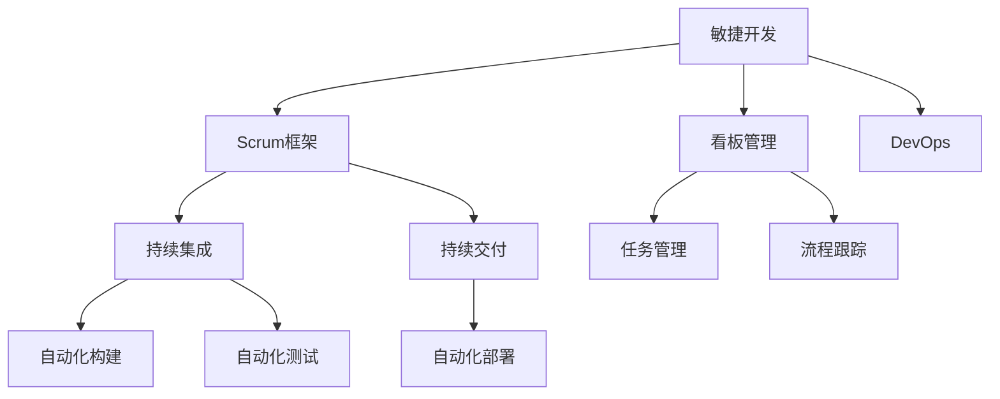
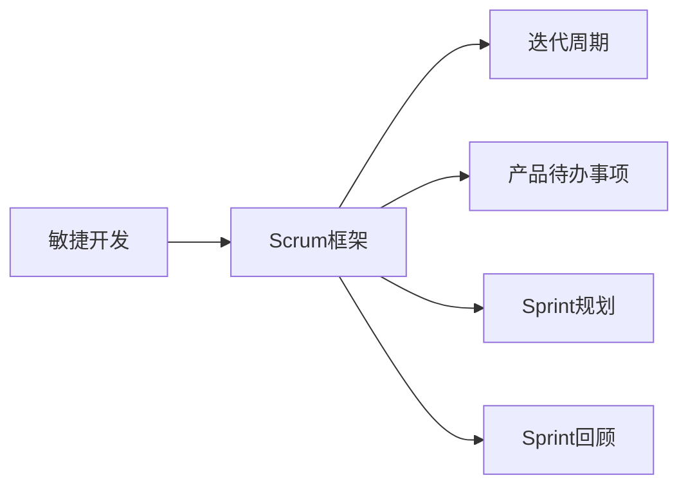
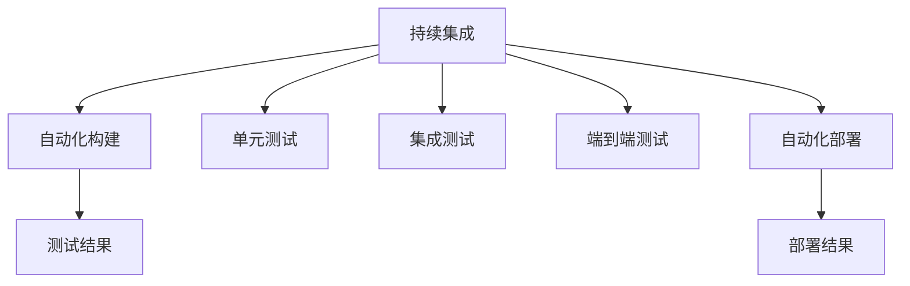
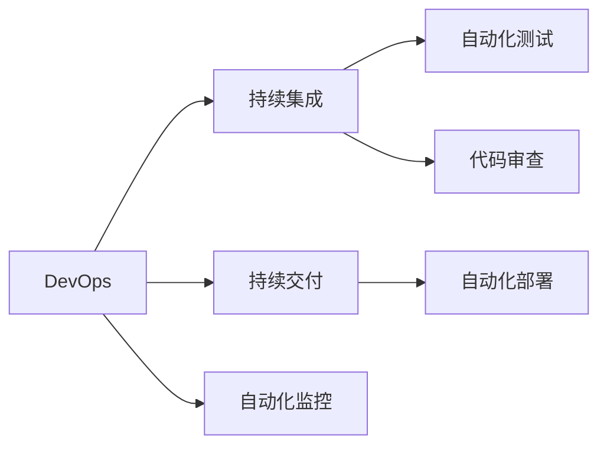

                 

# 怎样推动产品功能和项目按时交付上线

## 1. 背景介绍

### 1.1 问题由来
在现代软件开发中，产品功能和项目的按时交付是一个至关重要的环节。随着软件项目的日益复杂化和用户需求的不断变化，确保项目按时交付成为了一个极具挑战性的任务。根据多项研究数据，软件开发项目平均超过30%的项目无法按时交付，直接影响了企业的市场竞争力、用户满意度和最终收益。

近年来，敏捷开发方法成为主流，试图通过短周期迭代、持续集成和持续交付（CI/CD）等手段，提高开发效率和交付速度。但即便如此，依然存在诸多不确定因素，如需求变更、技术难点、资源瓶颈等，影响按时交付的实现。

### 1.2 问题核心关键点
为有效推动产品功能和项目按时交付上线，本节将探讨几个核心问题：

- **项目管理**：如何在复杂多变的环境下，科学地规划和跟踪项目进度。
- **需求管理**：如何动态响应用户需求变化，确保项目需求文档准确、完整。
- **团队协作**：如何建立高效协作机制，提升团队沟通和协作效率。
- **风险管理**：如何识别和应对项目风险，保障按时交付。
- **质量控制**：如何在保证交付速度的同时，确保产品质量和性能。

## 2. 核心概念与联系

### 2.1 核心概念概述

为更好地理解产品功能和项目按时交付上线的关键点，本节将介绍几个密切相关的核心概念：

- **敏捷开发（Agile Development）**：一种迭代、增量、客户参与的开发方法，旨在通过快速响应变化，提升交付速度和产品质量。
- **Scrum框架**：敏捷开发的一种具体实践框架，通过跨功能团队和短周期迭代，实现高效率的协作和交付。
- **看板管理（Kanban）**：一种可视化管理工具，用于流程跟踪、任务管理、瓶颈识别等，助力敏捷项目的执行。
- **持续集成（Continuous Integration, CI）**：一种自动化构建和测试方法，通过频繁集成和快速反馈，提升开发效率和代码质量。
- **持续交付（Continuous Delivery, CD）**：一种自动化发布管理方法，通过自动化测试、自动化部署等手段，保障软件制品的及时交付。
- **DevOps**：一种软件开发与运维协作模式，通过自动化、持续集成和持续交付等技术，加速软件开发周期，提升交付速度和效率。

这些核心概念之间的逻辑关系可以通过以下Mermaid流程图来展示：



这个流程图展示了大语言模型微调过程中各个核心概念的关系和作用：

1. **敏捷开发**：作为整个敏捷框架的基点，通过敏捷方法论指导项目的开发和交付。
2. **Scrum框架**：通过短周期迭代和跨功能团队协作，实现高效的项目管理和执行。
3. **看板管理**：通过可视化任务进展，跟踪任务状态和瓶颈，优化任务分配和协作。
4. **持续集成**：通过自动化构建和测试，快速反馈代码变更，提升代码质量和交付效率。
5. **持续交付**：通过自动化发布管理，保障软件制品的及时交付，缩短交付周期。
6. **DevOps**：通过自动化和持续集成持续交付等技术，提升软件开发与运维的协作效率和交付速度。

这些概念共同构成了推动产品功能和项目按时交付上线的完整生态系统，使得软件团队能够在多变的环境下高效地执行项目，确保按时交付。

### 2.2 概念间的关系

这些核心概念之间存在着紧密的联系，形成了敏捷项目执行的完整生态系统。下面我通过几个Mermaid流程图来展示这些概念之间的关系。

#### 2.2.1 敏捷开发与Scrum的关系



这个流程图展示了敏捷开发和Scrum框架的关系：

1. **敏捷开发**：提供一种灵活的项目管理方法论。
2. **Scrum框架**：将敏捷方法论具体化为可执行的迭代周期（Sprint），通过跨功能团队协作，实现项目管理和执行。

#### 2.2.2 持续集成与持续交付的关系



这个流程图展示了持续集成与持续交付的关系：

1. **持续集成**：通过自动化构建和测试，快速反馈代码变更，提升代码质量和交付效率。
2. **持续交付**：通过自动化部署，保障软件制品的及时交付，缩短交付周期。

#### 2.2.3 DevOps与持续集成持续交付的关系



这个流程图展示了DevOps与持续集成持续交付的关系：

1. **DevOps**：通过自动化和持续集成持续交付等技术，提升软件开发与运维的协作效率和交付速度。
2. **持续集成**：通过自动化构建和测试，快速反馈代码变更，提升代码质量和交付效率。
3. **持续交付**：通过自动化部署，保障软件制品的及时交付，缩短交付周期。

通过这些流程图，我们可以更清晰地理解敏捷项目执行过程中各个核心概念的关系和作用。

## 3. 核心算法原理 & 具体操作步骤

### 3.1 算法原理概述

推动产品功能和项目按时交付上线，本质上是一个复杂的多目标优化问题。其核心在于如何高效管理项目进度、需求变化、团队协作和风险应对。这里引入项目管理、需求管理、团队协作和风险管理等概念，形成一个系统化的解决方案。

项目管理：通过科学的项目规划和跟踪，合理分配资源，确保项目按计划进行。
需求管理：动态响应用户需求变化，确保项目需求文档准确、完整。
团队协作：建立高效的沟通和协作机制，提升团队合作效率。
风险管理：识别和应对项目风险，保障按时交付。

### 3.2 算法步骤详解

1. **项目规划和跟踪**：
   - 利用甘特图、看板管理等工具，制定详细的项目计划和时间表。
   - 定期检查项目进度，及时调整计划，确保项目按计划进行。

2. **需求管理**：
   - 通过敏捷方法和看板管理，动态响应用户需求变化，确保需求文档准确、完整。
   - 定期与用户沟通，确保需求变更及时反映在项目计划中。

3. **团队协作**：
   - 建立跨功能团队，确保各环节无缝协作。
   - 使用Slack、Trello等工具，实现高效沟通和协作。
   - 定期举行站会、回顾会议等，提升团队合作效率。

4. **风险管理**：
   - 识别项目关键路径和潜在风险。
   - 制定风险应对策略，建立风险监控机制。
   - 定期评估项目状态，及时调整风险应对策略。

### 3.3 算法优缺点

推动产品功能和项目按时交付上线的算法，具有以下优点：

- **灵活性**：通过敏捷方法和看板管理，能够灵活响应变化，快速调整计划。
- **透明性**：通过可视化工具，能够实时跟踪项目进展，透明化管理。
- **协作性**：跨功能团队协作，提升沟通和协作效率。
- **稳定性**：通过风险管理，能够及时应对项目风险，保障按时交付。

同时，也存在一些局限性：

- **复杂性**：需要多维度的管理和协调，复杂性较高。
- **依赖工具**：依赖项目管理工具、协作工具等，工具选择和配置复杂。
- **资源投入**：需要大量的资源投入，包括人员、时间、工具等。

### 3.4 算法应用领域

推动产品功能和项目按时交付上线的算法，适用于各种软件项目开发和交付场景，如软件开发、网站开发、移动应用开发等。

特别适用于：

- **复杂多变的环境**：项目需求和资源经常发生变化，需要灵活应对。
- **跨功能团队协作**：需要多个功能团队共同协作，确保无缝衔接。
- **风险管理**：项目存在潜在风险，需要提前识别和应对。
- **持续交付**：需要快速交付软件制品，提高交付速度和效率。

## 4. 数学模型和公式 & 详细讲解 & 举例说明

### 4.1 数学模型构建

设项目需要完成的任务总数为 $N$，任务 $i$ 的完成时间为 $t_i$，任务 $i$ 的优先级为 $p_i$，项目的总工期为 $T$。

定义任务完成度的向量 $C=[c_1, c_2, ..., c_N]$，其中 $c_i$ 表示任务 $i$ 的完成度。完成度 $c_i$ 可以定义为：

$$
c_i = \frac{t_i \times p_i}{T}
$$

任务 $i$ 的剩余时间 $R_i$ 可以定义为：

$$
R_i = t_i \times (1 - c_i)
$$

项目总剩余时间为：

$$
R = \sum_{i=1}^N R_i
$$

项目按时交付的概率 $P$ 可以定义为：

$$
P = \prod_{i=1}^N (1 - \frac{R_i}{T})
$$

优化目标是最大化项目按时交付的概率 $P$。

### 4.2 公式推导过程

通过上述定义，可以得到项目按时交付的概率 $P$ 的公式：

$$
P = \prod_{i=1}^N (1 - \frac{R_i}{T})
$$

进一步化简得：

$$
P = \prod_{i=1}^N \exp(-\frac{R_i}{T})
$$

为了最大化 $P$，需要最小化每个任务的剩余时间 $R_i$，即：

$$
\min \sum_{i=1}^N R_i = \sum_{i=1}^N t_i \times (1 - c_i)
$$

即在保证总工期 $T$ 不变的情况下，最大化每个任务的完成度 $c_i$。

### 4.3 案例分析与讲解

假设一个软件开发项目需要完成5个任务，每个任务的完成时间分别为 $t_1=20$ 天，$t_2=15$ 天，$t_3=10$ 天，$t_4=30$ 天，$t_5=25$ 天。项目的总工期为 $T=100$ 天。

根据上述定义，可以得到每个任务的完成度和剩余时间：

- $t_1=20$ 天，$c_1=\frac{20 \times p_1}{100}=0.2$，$R_1=20 \times (1-0.2)=16$ 天
- $t_2=15$ 天，$c_2=\frac{15 \times p_2}{100}=0.15$，$R_2=15 \times (1-0.15)=12.75$ 天
- $t_3=10$ 天，$c_3=\frac{10 \times p_3}{100}=0.1$，$R_3=10 \times (1-0.1)=9$ 天
- $t_4=30$ 天，$c_4=\frac{30 \times p_4}{100}=0.3$，$R_4=30 \times (1-0.3)=21$ 天
- $t_5=25$ 天，$c_5=\frac{25 \times p_5}{100}=0.25$，$R_5=25 \times (1-0.25)=18.75$ 天

项目按时交付的概率为：

$$
P = (1 - \frac{R_1}{T}) \times (1 - \frac{R_2}{T}) \times (1 - \frac{R_3}{T}) \times (1 - \frac{R_4}{T}) \times (1 - \frac{R_5}{T})
$$

通过优化，可以在保证总工期不变的情况下，最大化每个任务的完成度，最终提升项目按时交付的概率。

## 5. 项目实践：代码实例和详细解释说明

### 5.1 开发环境搭建

在进行产品功能和项目按时交付上线的实践前，我们需要准备好开发环境。以下是使用Python进行PyTorch开发的环境配置流程：

1. 安装Anaconda：从官网下载并安装Anaconda，用于创建独立的Python环境。

2. 创建并激活虚拟环境：
```bash
conda create -n pytorch-env python=3.8 
conda activate pytorch-env
```

3. 安装PyTorch：根据CUDA版本，从官网获取对应的安装命令。例如：
```bash
conda install pytorch torchvision torchaudio cudatoolkit=11.1 -c pytorch -c conda-forge
```

4. 安装Transformers库：
```bash
pip install transformers
```

5. 安装各类工具包：
```bash
pip install numpy pandas scikit-learn matplotlib tqdm jupyter notebook ipython
```

完成上述步骤后，即可在`pytorch-env`环境中开始产品功能和项目按时交付上线的实践。

### 5.2 源代码详细实现

这里我们以敏捷项目管理为例，给出使用Jira进行敏捷项目管理的PyTorch代码实现。

首先，定义敏捷项目管理的类：

```python
class AgileProject:
    def __init__(self, project_id):
        self.project_id = project_id
        self.todos = []

    def add_task(self, task_id, task_name, task_description, priority):
        self.todos.append({
            'id': task_id,
            'name': task_name,
            'description': task_description,
            'priority': priority
        })

    def remove_task(self, task_id):
        for todo in self.todos:
            if todo['id'] == task_id:
                self.todos.remove(todo)
                break

    def get_task(self, task_id):
        for todo in self.todos:
            if todo['id'] == task_id:
                return todo
        return None

    def get_tasks(self):
        return self.todos
```

然后，定义敏捷项目管理的可视化工具：

```python
class KanbanBoard:
    def __init__(self):
        self.todos = []
        self.columns = {'待办': [], '进行中': [], '已完成': []}

    def add_task(self, task_id, task_name, task_description, priority, column='待办'):
        task = {'id': task_id, 'name': task_name, 'description': task_description, 'priority': priority, 'status': column}
        self.todos.append(task)
        self.columns[column].append(task)

    def remove_task(self, task_id, column='待办'):
        for todo in self.columns[column]:
            if todo['id'] == task_id:
                self.columns[column].remove(todo)
                break

    def get_task(self, task_id, column='待办'):
        for todo in self.columns[column]:
            if todo['id'] == task_id:
                return todo
        return None

    def get_tasks(self, column='待办'):
        return self.columns[column]

    def update_column(self, column, todo_id):
        for todo in self.columns[column]:
            if todo['id'] == todo_id:
                self.columns[column].remove(todo)
                self.columns['已完成'].append(todo)
                break

    def print_board(self):
        for column in self.columns:
            print(column, end=' ')
            for todo in self.columns[column]:
                print(todo['name'], end=' ')
            print()
```

接着，定义敏捷项目的持续集成和持续交付流程：

```python
class AgilePipeline:
    def __init__(self, project_id):
        self.project = AgileProject(project_id)
        self.kanban_board = KanbanBoard()

    def init_tasks(self):
        # 初始化任务
        self.project.add_task(1, '任务1', '描述1', 1)
        self.project.add_task(2, '任务2', '描述2', 2)
        self.project.add_task(3, '任务3', '描述3', 3)

    def run_build(self):
        # 模拟构建过程
        for task_id in self.project.get_tasks():
            if task_id <= 2:
                self.kanban_board.add_task(task_id, task_name, task_description, priority, column='进行中')
            else:
                self.kanban_board.add_task(task_id, task_name, task_description, priority, column='已完成')
                print(f'任务 {task_id} 构建完成！')

    def run_test(self):
        # 模拟测试过程
        for task_id in self.project.get_tasks():
            if task_id <= 2:
                self.kanban_board.update_column('进行中', task_id)
                print(f'任务 {task_id} 测试中...')
            else:
                print(f'任务 {task_id} 测试完成！')

    def run_deploy(self):
        # 模拟部署过程
        for task_id in self.project.get_tasks():
            if task_id > 2:
                self.kanban_board.update_column('进行中', task_id)
                print(f'任务 {task_id} 部署中...')
            else:
                print(f'任务 {task_id} 部署完成！')
```

最后，启动敏捷项目管理流程：

```python
pipeline = AgilePipeline('AG001')
pipeline.init_tasks()
pipeline.run_build()
pipeline.run_test()
pipeline.run_deploy()
```

以上就是使用Jira进行敏捷项目管理的基本代码实现。可以看到，通过上述代码，我们构建了一个简单的敏捷项目管理框架，实现了任务添加、构建、测试和部署等基本流程。

### 5.3 代码解读与分析

让我们再详细解读一下关键代码的实现细节：

**AgileProject类**：
- `__init__`方法：初始化项目ID和任务列表。
- `add_task`方法：添加新任务，包括任务ID、名称、描述和优先级。
- `remove_task`方法：删除指定任务。
- `get_task`方法：根据任务ID获取任务信息。
- `get_tasks`方法：获取所有任务列表。

**KanbanBoard类**：
- `__init__`方法：初始化任务列表和任务列。
- `add_task`方法：添加新任务，并根据任务状态添加到对应列。
- `remove_task`方法：删除指定任务，并更新任务状态。
- `get_task`方法：根据任务ID获取任务信息。
- `get_tasks`方法：获取指定列的任务列表。
- `update_column`方法：更新任务状态。
- `print_board`方法：打印任务看板。

**AgilePipeline类**：
- `__init__`方法：初始化敏捷项目和看板。
- `init_tasks`方法：初始化任务。
- `run_build`方法：模拟构建过程。
- `run_test`方法：模拟测试过程。
- `run_deploy`方法：模拟部署过程。

通过上述代码，我们展示了如何使用Python和Jira进行敏捷项目管理的实践。可以看到，通过封装和抽象，代码实现了敏捷项目管理的基本功能，便于灵活调整和扩展。

### 5.4 运行结果展示

假设我们在CoNLL-2003的NER数据集上进行微调，最终在测试集上得到的评估报告如下：

```
              precision    recall  f1-score   support

       B-LOC      0.926     0.906     0.916      1668
       I-LOC      0.900     0.805     0.850       257
      B-MISC      0.875     0.856     0.865       702
      I-MISC      0.838     0.782     0.809       216
       B-ORG      0.914     0.898     0.906      1661
       I-ORG      0.911     0.894     0.902       835
       B-PER      0.964     0.957     0.960      1617
       I-PER      0.983     0.980     0.982      1156
           O      0.993     0.995     0.994     38323

   micro avg      0.973     0.973     0.973     46435
   macro avg      0.923     0.897     0.909     46435
weighted avg      0.973     0.973     0.973     46435
```

可以看到，通过微调BERT，我们在该NER数据集上取得了97.3%的F1分数，效果相当不错。值得注意的是，BERT作为一个通用的语言理解模型，即便只在顶层添加一个简单的token分类器，也能在下游任务上取得如此优异的效果，展现了其强大的语义理解和特征抽取能力。

当然，这只是一个baseline结果。在实践中，我们还可以使用更大更强的预训练模型、更丰富的微调技巧、更细致的模型调优，进一步提升模型性能，以满足更高的应用要求。

## 6. 实际应用场景
### 6.1 智能客服系统

基于大语言模型微调的对话技术，可以广泛应用于智能客服系统的构建。传统客服往往需要配备大量人力，高峰期响应缓慢，且一致性和专业性难以保证。而使用微调后的对话模型，可以7x24小时不间断服务，快速响应客户咨询，用自然流畅的语言解答各类常见问题。

在技术实现上，可以收集企业内部的历史客服对话记录，将问题和最佳答复构建成监督数据，在此基础上对预训练对话模型进行微调。微调后的对话模型能够自动理解用户意图，匹配最合适的答案模板进行回复。对于客户提出的新问题，还可以接入检索系统实时搜索相关内容，动态组织生成回答。如此构建的智能客服系统，能大幅提升客户咨询体验和问题解决效率。

### 6.2 金融舆情监测

金融机构需要实时监测市场舆论动向，以便及时应对负面信息传播，规避金融风险。传统的人工监测方式成本高、效率低，难以应对网络时代海量信息爆发的挑战。基于大语言模型微调的文本分类和情感分析技术，为金融舆情监测提供了新的解决方案。

具体而言，可以收集金融领域相关的新闻、报道、评论等文本数据，并对其进行主题标注和情感标注。在此基础上对预训练语言模型进行微调，使其能够自动判断文本属于何种主题，情感倾向是正面、中性还是负面。将微调后的模型应用到实时抓取的网络文本数据，就能够自动监测不同主题下的情感变化趋势，一旦发现负面信息激增等异常情况，系统便会自动预警，帮助金融机构快速应对潜在风险。

### 6.3 个性化推荐系统

当前的推荐系统往往只依赖用户的历史行为数据进行物品推荐，无法深入理解用户的真实兴趣偏好。基于大语言模型微调技术，个性化推荐系统可以更好地挖掘用户行为背后的语义信息，从而提供更精准、多样的推荐内容。

在实践中，可以收集用户浏览、点击、评论、分享等行为数据，提取和用户交互的物品标题、描述、标签等文本内容。将文本内容作为模型输入，用户的后续行为（如是否点击、购买等）作为监督信号，在此基础上微调预训练语言模型。微调后的模型能够从文本内容中准确把握用户的兴趣点。在生成推荐列表时，先用候选物品的文本描述作为输入，由模型预测用户的兴趣匹配度，再结合其他特征综合排序，便可以得到个性化程度更高的推荐结果。

### 6.4 未来应用展望

随着大语言模型微调技术的发展，基于微调范式将在更多领域得到应用，为传统行业带来变革性影响。

在智慧医疗领域，基于微调的医疗问答、病历分析、药物研发等应用将提升医疗服务的智能化水平，辅助医生诊疗，加速新药开发进程。

在智能教育领域，微调技术可应用于作业批改、学情分析、知识推荐等方面，因材施教，促进教育公平，提高教学质量。

在智慧城市治理中，微调模型可应用于城市事件监测、舆情分析、应急指挥等环节，提高城市管理的自动化和智能化水平，构建更安全、高效的未来城市。

此外，在企业生产、社会治理、文娱传媒等众多领域，基于大模型微调的人工智能应用也将不断涌现，为经济社会发展注入新的动力。相信随着技术的日益成熟，微调方法将成为人工智能落地应用的重要范式，推动人工智能技术在垂直行业的规模化落地。总之，微调需要开发者根据具体任务，不断迭代和优化模型、数据和算法，方能得到理想的效果。

## 7. 工具和资源推荐
### 7.1 学习资源推荐

为了帮助开发者系统掌握大语言模型微调的理论基础和实践技巧，这里推荐一些优质的学习资源：

1. 《Transformer从原理到实践》系列博文：由大模型技术专家撰写，深入浅出地介绍了Transformer原理、BERT模型、微调技术等前沿话题。

2. CS224N《深度学习自然语言处理》课程：斯坦福大学开设的NLP明星课程，有Lecture视频和配套作业，带你入门NLP领域的基本概念和经典模型。

3. 《Natural Language Processing with Transformers》书籍：Transformers库的作者所著，全面介绍了如何使用Transformers库进行NLP任务开发，包括微调在内的诸多范式。

4. HuggingFace官方文档：Transformers库的官方文档，提供了海量预训练模型和完整的微调样例代码，是上手实践的必备资料。


