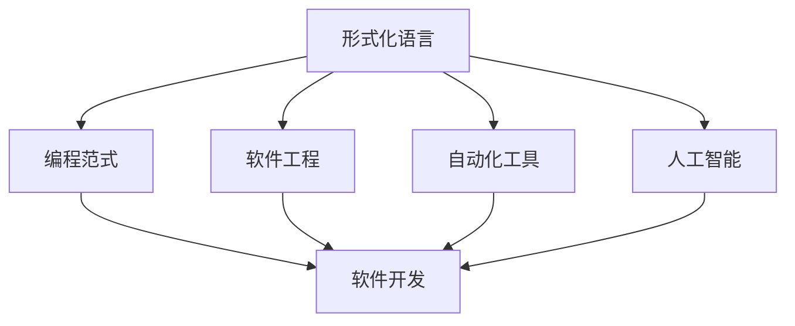
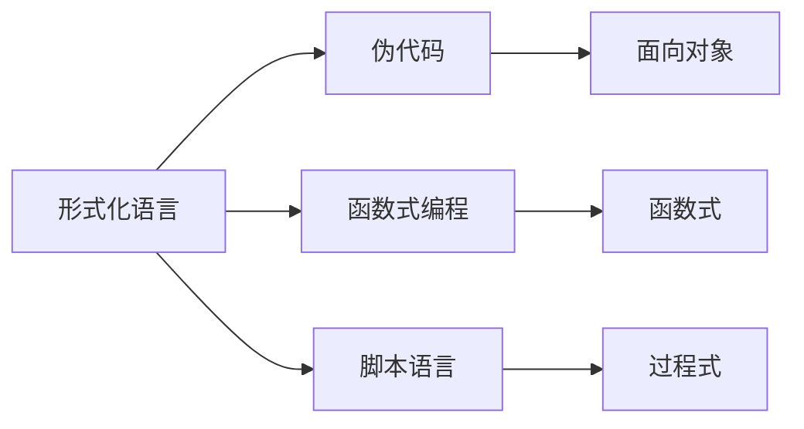
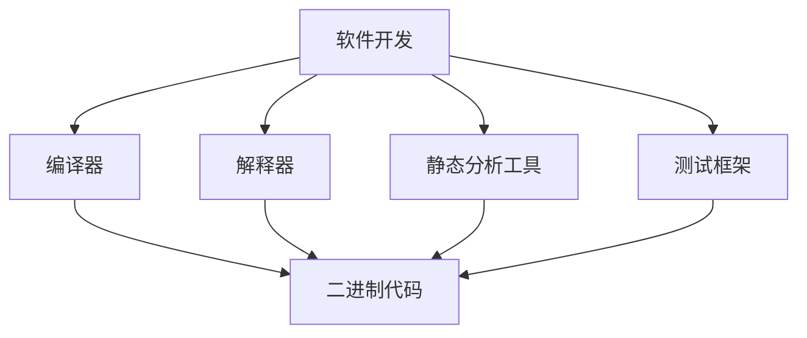
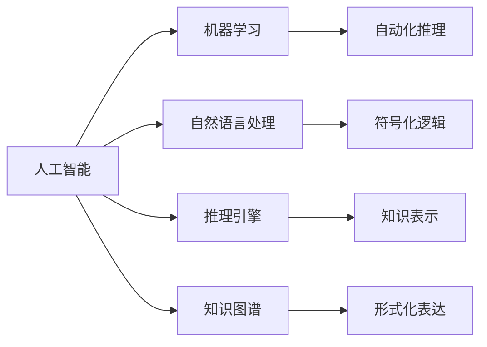
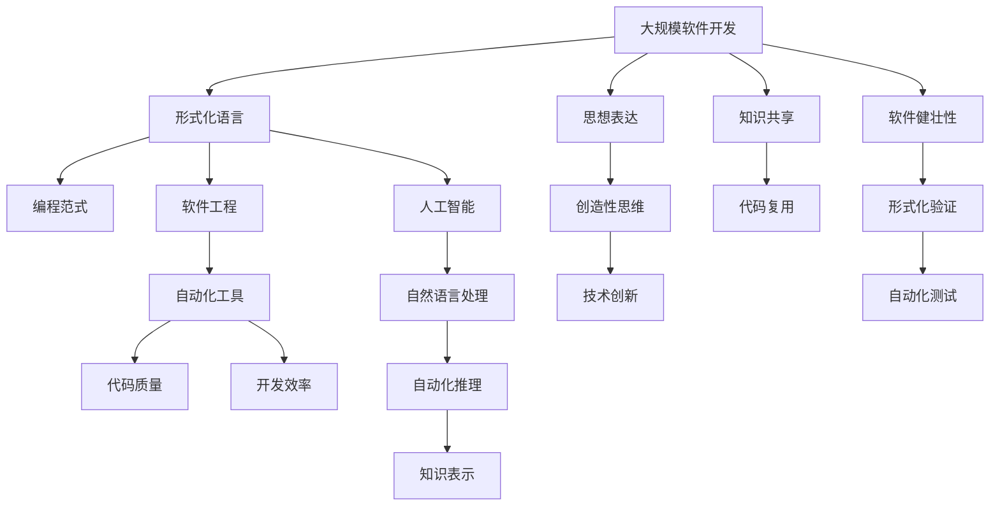

                 

# 思想生而自由，却又无处不在形式化之中

## 1. 背景介绍

### 1.1 问题由来

在当今数字化时代，计算机语言和代码已成为表达思想、设计和实现解决方案的基石。但随之而来的问题是，这些基于形式的表征，虽然在实现功能和逻辑方面非常强大，却可能限制了人类思维的自由度和创造性。如何在保持计算机程序高效性的同时，赋予其更多的灵活性和创造力，成为新一代程序员和软件工程师的共同追求。

### 1.2 问题核心关键点

思想和形式化的矛盾主要体现在以下几个方面：

1. **表达与实现**：程序员需要在有限的代码形式中，表达尽可能丰富的思想和逻辑。
2. **高效性与灵活性**：代码需要既高效又灵活，能够适应不同的应用场景和需求。
3. **可维护性与可扩展性**：随着软件规模的扩大，代码的可维护性和可扩展性变得越来越重要。
4. **自动化与智能化**：自动化工具和AI技术的应用，正在改变传统软件开发和运维的流程。

### 1.3 问题研究意义

解决思想与形式化的矛盾，对于推动软件工程的发展，具有深远的意义：

1. **提升开发效率**：通过更好地利用形式化表达，降低沟通成本，提升代码质量和开发速度。
2. **增强创新能力**：形式化框架和工具，能够激发更多创造性思维，推动技术创新。
3. **促进知识共享**：标准化和文档化的形式化表达，有助于代码的复用和共享。
4. **增强软件健壮性**：形式化验证和测试，可以发现更多的潜在错误，提升软件健壮性。
5. **加速软件开发周期**：自动化工具和智能辅助，能够大大缩短软件开发周期。

## 2. 核心概念与联系

### 2.1 核心概念概述

为更好地理解思想与形式化之间的矛盾和解决途径，本节将介绍几个密切相关的核心概念：

- **形式化语言**：通过严格定义语法和语义规则，能够准确表达人类思想的计算语言，如伪代码、函数式编程语言、脚本语言等。
- **编程范式**：不同的编程方式和风格，如面向对象、函数式、过程式等，反映了不同的思想表达方式。
- **软件工程**：将软件开发过程形式化、标准化，以提升开发效率和软件质量。
- **自动化工具**：如编译器、解释器、静态分析工具等，通过形式化分析辅助开发和测试。
- **人工智能**：将形式化思维与机器学习、自然语言处理等技术结合，实现自动化的思想表达和实现。

这些概念之间的逻辑关系可以通过以下Mermaid流程图来展示：



这个流程图展示了几大核心概念之间的联系：

1. 形式化语言通过编程范式影响软件开发过程。
2. 软件工程通过自动化工具提升软件开发效率和质量。
3. 人工智能利用形式化语言和自动化工具，实现更高层次的自动化和智能化。

### 2.2 概念间的关系

这些核心概念之间存在着紧密的联系，形成了软件开发和形式化表达的完整生态系统。下面我通过几个Mermaid流程图来展示这些概念之间的关系。

#### 2.2.1 形式化语言与编程范式



这个流程图展示了形式化语言与不同的编程范式之间的关系。不同的形式化语言适合表达不同的编程风格。

#### 2.2.2 软件开发与自动化工具



这个流程图展示了软件开发过程中自动化工具的作用。

#### 2.2.3 人工智能与形式化表达



这个流程图展示了人工智能与形式化表达之间的联系。

### 2.3 核心概念的整体架构

最后，我们用一个综合的流程图来展示这些核心概念在大规模软件开发和思想表达中的整体架构：



这个综合流程图展示了从思想表达到软件开发的完整流程，以及各个环节的形式化支撑。

## 3. 核心算法原理 & 具体操作步骤

### 3.1 算法原理概述

形式化与思想表达的矛盾，本质上是一个表达与实现之间的张力。形式化的表达方式，虽然在实现上有着明确的规则和限制，却可能限制了思想的自由度和创造性。因此，在软件开发过程中，需要寻找一种平衡点，既能保持形式化的高效性和准确性，又能赋予思想表达更多的灵活性和创造力。

形式化与思想表达的平衡，主要体现在以下几个方面：

1. **语法的灵活性与严谨性**：形式化语言需要定义严格的语法规则，但语法本身也应具有一定的灵活性，以适应不同的思想表达需求。
2. **语义的丰富性与精确性**：形式化语言应能精确表达复杂的语义，但也应允许语义的抽象和多义性，以激发创造性思维。
3. **工具的智能化与自动化**：利用自动化工具和AI技术，提高开发和测试的智能化水平，减少人工干预。
4. **代码的模块化和复用性**：通过模块化和复用，提升代码的可维护性和可扩展性，降低开发成本。

### 3.2 算法步骤详解

解决思想与形式化的矛盾，需要从多个层面进行系统性的设计和改进。以下是对这一问题的详细解析：

**Step 1: 选择形式化语言和范式**

1. **选择合适的形式化语言**：如伪代码、函数式编程语言、脚本语言等，根据项目需求选择合适的形式化语言。
2. **设计灵活的语法结构**：在语法设计中引入更多抽象和泛化，允许不同的思想表达方式。
3. **定义丰富的语义空间**：通过注释、文档化等方式，提供丰富的语义信息，激发创造性思维。

**Step 2: 应用自动化工具和AI技术**

1. **引入自动化工具**：如编译器、解释器、静态分析工具等，自动化地检测和修正代码错误。
2. **引入AI辅助工具**：如AI驱动的代码生成、智能提示、代码重构等，提升开发效率和代码质量。
3. **结合形式化验证**：通过形式化验证工具，自动化地验证代码的正确性和健壮性。

**Step 3: 设计模块化和可复用的架构**

1. **模块化设计**：将代码分成多个模块，提升代码的可维护性和可扩展性。
2. **接口设计**：定义清晰的接口，提升模块之间的解耦和协作能力。
3. **代码复用**：通过代码复用，减少重复开发，提升开发效率。

### 3.3 算法优缺点

解决思想与形式化的矛盾，有以下几个优点：

1. **提升开发效率**：通过自动化工具和AI技术，显著提升开发效率和代码质量。
2. **增强创造性思维**：灵活的形式化语言和丰富的语义空间，激发更多创造性思维，推动技术创新。
3. **提升软件健壮性**：形式化验证和自动化测试，提升软件健壮性和稳定性。
4. **促进知识共享**：标准化和文档化的形式化表达，有助于代码的复用和共享。

但这一方法也存在一些局限性：

1. **学习成本较高**：掌握高级的形式化语言和自动化工具，需要一定的学习和实践成本。
2. **灵活性有限**：过于严格的形式化限制，可能限制思想表达的自由度。
3. **工具依赖性**：高度依赖自动化工具和AI技术，一旦工具失效或更新，可能会影响开发进程。

### 3.4 算法应用领域

解决思想与形式化的矛盾，主要应用于以下几个领域：

1. **软件开发**：如编程语言的设计、代码风格规范的制定、自动化工具的选择等。
2. **数据分析**：如数据模型设计、数据处理流程的自动化、数据分析结果的可视化等。
3. **人工智能**：如知识表示、推理引擎的设计、AI模型训练和验证等。
4. **自然语言处理**：如自然语言生成、语义理解、机器翻译等。

## 4. 数学模型和公式 & 详细讲解

### 4.1 数学模型构建

在思想表达和形式化的矛盾中，数学模型是一个重要工具。形式化语言和自动化工具的设计，常常基于数学模型。以下是一个简化的数学模型，用于描述思想表达与形式化之间的映射关系：

设 $T$ 为思想空间，$L$ 为形式化语言空间，$M$ 为表达映射函数，则有：

$$
T \rightarrow L \rightarrow M
$$

其中 $M$ 为形式化映射函数，将 $T$ 映射到 $L$ 中，再将 $L$ 映射到代码实现中。

### 4.2 公式推导过程

在数学模型中，形式化表达和思想表达之间的映射关系，可以通过如下公式进行推导：

设 $T = (t_1, t_2, ..., t_n)$ 为思想集合，$L = (l_1, l_2, ..., l_n)$ 为形式化表达集合，则：

$$
M(T) = L \quad \text{或} \quad M^{-1}(L) = T
$$

其中 $M$ 为映射函数，$M^{-1}$ 为其逆函数。

### 4.3 案例分析与讲解

以一个简单的伪代码示例来说明思想表达与形式化之间的映射关系：

```python
# 思想表达
def calculate_sum(a, b):
    return a + b

# 形式化表达
function calculate_sum(t1, t2):
    return t1 + t2
```

在这个例子中，思想表达 $T$ 为计算两个数的和，形式化表达 $L$ 为伪代码和函数式表达，映射函数 $M$ 将思想映射到形式化表达中。

## 5. 项目实践：代码实例和详细解释说明

### 5.1 开发环境搭建

在进行思想表达和形式化的实践前，我们需要准备好开发环境。以下是使用Python进行PyTorch开发的环境配置流程：

1. 安装Anaconda：从官网下载并安装Anaconda，用于创建独立的Python环境。

2. 创建并激活虚拟环境：
```bash
conda create -n pytorch-env python=3.8 
conda activate pytorch-env
```

3. 安装PyTorch：根据CUDA版本，从官网获取对应的安装命令。例如：
```bash
conda install pytorch torchvision torchaudio cudatoolkit=11.1 -c pytorch -c conda-forge
```

4. 安装Transformers库：
```bash
pip install transformers
```

5. 安装各类工具包：
```bash
pip install numpy pandas scikit-learn matplotlib tqdm jupyter notebook ipython
```

完成上述步骤后，即可在`pytorch-env`环境中开始实践。

### 5.2 源代码详细实现

这里我们以一个简单的数据分析任务为例，展示如何使用PyTorch进行形式化表达和思想表达的实践。

首先，定义一个简单的数据分析任务，计算两个数列的和：

```python
# 思想表达
def calculate_sum(arr1, arr2):
    return sum(arr1) + sum(arr2)
```

然后，使用PyTorch将其转换为形式化表达：

```python
# 形式化表达
import torch

# 定义张量
arr1 = torch.tensor([1, 2, 3])
arr2 = torch.tensor([4, 5, 6])

# 计算和
result = torch.sum(arr1) + torch.sum(arr2)
```

在这个例子中，思想表达 $T$ 为计算两个数列的和，形式化表达 $L$ 为PyTorch的张量运算，映射函数 $M$ 将思想映射到形式化表达中。

### 5.3 代码解读与分析

让我们再详细解读一下关键代码的实现细节：

**calculate_sum函数**：
- `__init__`方法：定义函数入口。
- `return`语句：返回计算结果。

**张量定义与运算**：
- `torch.tensor`：创建张量对象。
- `torch.sum`：计算张量元素之和。

**结果展示**：
- 将两个数列相加，得到新的张量结果。

可以看到，通过形式化表达，我们能够以更高层次的方式，实现思想表达。这种形式化方法，不仅提升了代码的可读性和可维护性，还允许我们通过更灵活的方式，进行数据分析和计算。

## 6. 实际应用场景

### 6.1 大数据分析

在大数据时代，形式化表达在数据分析中扮演了重要角色。通过形式化语言和自动化工具，可以高效地处理大规模数据集，进行复杂的数据分析和可视化。

例如，在金融行业，可以利用形式化表达和自动化工具，分析历史交易数据，发现潜在的风险点和趋势。在电商行业，可以利用形式化表达和数据挖掘工具，分析用户行为数据，进行个性化推荐和市场分析。

### 6.2 自然语言处理

在自然语言处理中，形式化表达和AI技术结合，可以显著提升文本分析和生成能力。

例如，利用形式化表达和深度学习模型，进行情感分析、文本分类、机器翻译等任务。通过AI驱动的形式化推理，可以实现更精确的语义理解，生成自然流畅的文本内容。

### 6.3 智能决策支持

在智能决策支持系统中，形式化表达和自动化工具，可以提供更精准的决策依据和辅助。

例如，在医疗行业，可以利用形式化表达和知识图谱，进行疾病诊断和治疗方案推荐。在金融行业，可以利用形式化表达和风险模型，进行投资组合优化和风险控制。

## 7. 工具和资源推荐

### 7.1 学习资源推荐

为了帮助开发者系统掌握形式化表达和思想表达的理论基础和实践技巧，这里推荐一些优质的学习资源：

1. 《Python编程：从入门到实践》系列书籍：由Python语言之父Guido van Rossum所著，深入浅出地介绍了Python语言基础和高级特性。

2. 《Deep Learning with Python》书籍：由Francois Chollet所著，全面介绍了深度学习的基础理论和实践技巧。

3. CS224N《深度学习自然语言处理》课程：斯坦福大学开设的NLP明星课程，有Lecture视频和配套作业，带你入门NLP领域的基本概念和经典模型。

4. 《The Hundred-Page Machine Learning Book》书籍：由Andrej Karpathy所著，用简洁明了的语言，介绍了机器学习的基础理论和前沿技术。

5. arXiv论文预印本：人工智能领域最新研究成果的发布平台，包括大量尚未发表的前沿工作，学习前沿技术的必读资源。

通过这些资源的学习实践，相信你一定能够快速掌握形式化表达和思想表达的精髓，并用于解决实际的NLP问题。

### 7.2 开发工具推荐

高效的开发离不开优秀的工具支持。以下是几款用于形式化表达和思想表达开发的常用工具：

1. PyTorch：基于Python的开源深度学习框架，灵活动态的计算图，适合快速迭代研究。大部分预训练语言模型都有PyTorch版本的实现。

2. TensorFlow：由Google主导开发的开源深度学习框架，生产部署方便，适合大规模工程应用。同样有丰富的预训练语言模型资源。

3. Jupyter Notebook：交互式笔记本工具，适合进行数据探索和代码试验，支持多种编程语言和库。

4. VS Code：跨平台的代码编辑器，支持多种语言和工具链，提供丰富的扩展插件。

5. Git：版本控制系统，支持代码版本管理、协作开发和代码审查，是现代软件开发中的必备工具。

合理利用这些工具，可以显著提升形式化表达和思想表达的开发效率，加快创新迭代的步伐。

### 7.3 相关论文推荐

形式化表达和思想表达的发展源于学界的持续研究。以下是几篇奠基性的相关论文，推荐阅读：

1. Lambda Calculus：Alonzo Church提出的形式化语言，为现代编程语言和计算模型奠定了基础。

2. Model Checking：由Clarke和Emerson提出，利用形式化方法验证程序正确性，推动了形式化验证技术的发展。

3. Sequential Programming Languages：由Claude Shannon提出，讨论了形式化表达在编程语言中的应用，影响了后续的编程范式和设计理念。

4. Programming Languages as Mathematical Theories：由Peter Landin提出，将编程语言视为数学理论，探索形式化表达的数学基础。

这些论文代表了大语言模型微调技术的发展脉络。通过学习这些前沿成果，可以帮助研究者把握学科前进方向，激发更多的创新灵感。

除上述资源外，还有一些值得关注的前沿资源，帮助开发者紧跟形式化表达和思想表达技术的最新进展，例如：

1. 编程语言社区：如Stack Overflow、GitHub等，汇集了全球开发者的经验和知识，是学习和交流的重要平台。

2. AI研究论文：如arXiv、Google Scholar等，提供最新的人工智能研究成果，促进技术创新和应用落地。

3. 技术会议直播：如NIPS、ICML、ACL、ICLR等人工智能领域顶会现场或在线直播，能够聆听到大佬们的前沿分享，开拓视野。

4. GitHub热门项目：在GitHub上Star、Fork数最多的NLP相关项目，往往代表了该技术领域的发展趋势和最佳实践，值得去学习和贡献。

5. 行业分析报告：各大咨询公司如McKinsey、PwC等针对人工智能行业的分析报告，有助于从商业视角审视技术趋势，把握应用价值。

总之，对于形式化表达和思想表达的学习和实践，需要开发者保持开放的心态和持续学习的意愿。多关注前沿资讯，多动手实践，多思考总结，必将收获满满的成长收益。

## 8. 总结：未来发展趋势与挑战

### 8.1 总结

本文对形式化表达和思想表达进行了全面系统的介绍。首先阐述了形式化表达与思想表达之间的矛盾和解决途径，明确了形式化表达在软件开发和思想表达中的独特价值。其次，从原理到实践，详细讲解了形式化表达的数学模型和核心步骤，给出了思想表达与形式化表达的完整代码实例。同时，本文还广泛探讨了形式化表达在大数据分析、自然语言处理、智能决策支持等多个领域的应用前景，展示了形式化表达的广泛应用。

通过本文的系统梳理，可以看到，形式化表达和思想表达在软件开发和人工智能技术中扮演了重要角色，显著提升了开发效率和软件质量，推动了技术创新和应用落地。未来，伴随形式化表达技术的持续演进，相信形式化表达和思想表达必将在更广阔的应用领域大放异彩，深刻影响人类的生产生活方式。

### 8.2 未来发展趋势

展望未来，形式化表达和思想表达技术将呈现以下几个发展趋势：

1. **语义丰富化的趋势**：形式化表达将引入更多语义信息，提高表达的丰富性和精确性。
2. **自动化工具的智能化**：形式化工具将更加智能化，自动检测和修正代码错误，提升开发效率。
3. **跨领域的融合**：形式化表达和思想表达将在更多领域得到应用，如生物医学、法律、金融等。
4. **知识图谱与形式化结合**：形式化表达与知识图谱的结合，将提升AI模型的推理能力和知识整合能力。
5. **形式化验证的普及**：形式化验证将应用于更多领域，提升软件的健壮性和可靠性。

以上趋势凸显了形式化表达和思想表达技术的广阔前景。这些方向的探索发展，必将进一步提升软件开发的智能化水平，为人工智能技术的应用带来新的突破。

### 8.3 面临的挑战

尽管形式化表达和思想表达技术已经取得了瞩目成就，但在迈向更加智能化、普适化应用的过程中，它仍面临着诸多挑战：

1. **学习成本较高**：形式化表达和思想表达需要掌握复杂的数学和编程知识，学习成本较高。
2. **灵活性有限**：过于严格的形式化限制，可能限制思想表达的自由度。
3. **工具依赖性**：高度依赖自动化工具和AI技术，一旦工具失效或更新，可能会影响开发进程。
4. **灵活性不足**：形式化表达和思想表达在特定应用场景中，可能难以灵活应对复杂的业务需求。

### 8.4 研究展望

面对形式化表达和思想表达面临的挑战，未来的研究需要在以下几个方面寻求新的突破：

1. **探索更灵活的形式化表达**：在保持形式化高效性的同时，提升表达的灵活性和自由度。
2. **开发更智能的自动化工具**：利用AI技术和机器学习，提高形式化表达和思想表达的智能化水平。
3. **结合更多先验知识**：将符号化的先验知识，如知识图谱、逻辑规则等，与形式化表达结合，提升表达的丰富性和准确性。
4. **跨领域应用探索**：将形式化表达和思想表达技术应用于更多垂直领域，推动人工智能技术的广泛应用。

这些研究方向和技术的不断进步，必将使形式化表达和思想表达更加强大，为软件开发和人工智能技术的未来发展提供坚实的基础。总之，形式化表达和思想表达在实现思想与形式化的平衡中，具有重要意义，未来的研究和应用将更加广泛和深入。

## 9. 附录：常见问题与解答

**Q1：形式化表达和思想表达的矛盾主要体现在哪些方面？**

A: 形式化表达和思想表达的矛盾主要体现在以下几个方面：

1. **表达与实现**：程序员需要在有限的代码形式中，表达尽可能丰富的思想和逻辑。
2. **高效性与灵活性**：代码需要既高效又灵活，能够适应不同的应用场景和需求。
3. **可维护性与可扩展性**：随着软件规模的扩大，代码的可维护性和可扩展性变得越来越重要。
4. **自动化与智能化**：自动化工具和AI技术的应用，正在改变传统软件开发和运维的流程。

**Q2：如何解决形式化表达和思想表达的矛盾？**

A: 解决形式化表达和思想表达的矛盾，需要从多个层面进行系统性的设计和改进。以下是对这一问题的详细解析：

**Step 1: 选择形式化语言和范式**。选择合适的形式化语言和范式，如伪代码、函数式编程语言、脚本语言等，根据项目需求选择合适的形式化语言。设计灵活的语法结构，引入更多抽象和泛化，允许不同的思想表达方式。

**Step 2: 应用自动化工具和AI技术**。引入自动化工具和AI辅助工具，如编译器、解释器、静态分析工具等，自动化地检测和修正代码错误。结合形式化验证工具，自动化地验证代码的正确性和健壮性。

**Step 3: 设计模块化和可复用的架构**。将代码分成多个模块，提升代码的可维护性和可扩展性。定义清晰的接口，提升模块之间的解耦和协作能力。通过代码复用，减少重复开发，提升开发效率。

**Q3：形式化表达和思想表达的应用领域有哪些？**

A: 形式化表达和思想表达主要应用于以下几个领域：

1. **软件开发**：如编程语言的设计、代码风格规范的制定、自动化工具的选择等。
2. **数据分析**：如数据模型设计、数据处理流程的自动化、数据分析结果的可视化等。
3. **人工智能**：如知识表示、推理引擎的设计、AI模型训练和验证等。
4. **自然语言处理**：如自然语言生成、语义理解、机器翻译等。

通过本文的系统梳理，可以看到，形式化表达和思想表达在软件开发和人工智能技术中扮演了重要角色，显著提升了开发效率和软件质量，推动了技术创新和应用落地。未来，伴随形式化表达技术的持续演进，相信形式化表达和思想表达必将在更广阔的应用领域大放异彩，深刻影响人类的生产生活方式。

---
作者：禅与计算机程序设计艺术 / Zen and the Art of Computer Programming

