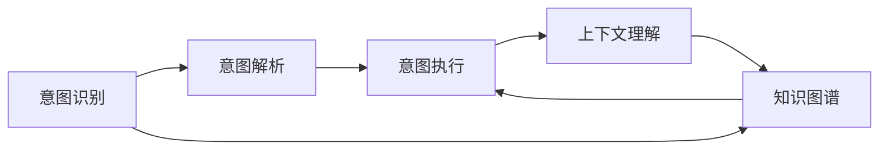
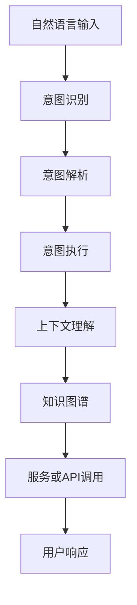

                 

## 1. 背景介绍

意图理解（Intent Understanding）在计算机用户界面（CUI）中的应用近年来受到广泛关注。随着自然语言处理（NLP）和人工智能（AI）技术的发展，CUI系统逐渐从传统的基于规则的系统，转变为能够理解和执行用户自然语言指令的智能系统。意图理解作为CUI系统中不可或缺的一部分，在提升用户体验、提高系统响应速度和准确性方面起着关键作用。

### 1.1 问题由来
在早期，CUI系统主要基于规则或模板匹配来实现用户意图识别。这种基于规则的系统虽然易于实现和维护，但在处理复杂或未知的用户意图时显得力不从心。随着深度学习技术的发展，尤其是基于神经网络的自然语言处理模型的出现，CUI系统开始向智能化、个性化方向发展，意图理解作为其中的关键技术，逐步成为研究热点。

### 1.2 问题核心关键点
意图理解的核心在于准确识别用户的意图，并将其转化为系统可执行的命令或请求。具体来说，包括：
- 意图识别：从用户输入的自然语言中提取意图信息，并将其分类为特定类别。
- 意图解析：理解意图的细节，如参数、时间、地点等。
- 意图执行：根据意图和解析结果，调用相应的服务或API，执行用户请求。

### 1.3 问题研究意义
意图理解的研究和应用对于提升CUI系统的智能化水平具有重要意义：
- 提高用户体验：通过准确理解用户意图，CUI系统可以更自然、流畅地与用户互动，减少误解和不必要的交互。
- 增强系统响应速度：意图理解能够快速解析用户请求，减少复杂逻辑判断和人工干预，从而提高系统响应速度。
- 实现个性化服务：意图理解能够捕捉用户的个性化需求，提供更加贴合用户期望的服务。
- 降低开发成本：通过意图理解，CUI系统可以自动化处理用户请求，减少对人工规则编写和维护的需求，降低开发成本。

## 2. 核心概念与联系

### 2.1 核心概念概述

为了更好地理解意图理解在CUI中的应用，本节将介绍几个密切相关的核心概念：

- **意图识别（Intent Recognition）**：从用户输入的自然语言中提取意图信息，并将其分类为特定类别。
- **意图解析（Intent Parsing）**：理解意图的细节，如参数、时间、地点等。
- **意图执行（Intent Execution）**：根据意图和解析结果，调用相应的服务或API，执行用户请求。
- **上下文理解（Context Understanding）**：理解用户输入的上下文信息，帮助意图识别和解析。
- **知识图谱（Knowledge Graph）**：用于存储和查询各类知识，辅助意图理解。

这些核心概念之间存在紧密的联系，形成一个完整的意图理解系统框架。意图识别是整个系统的基础，意图解析和执行是关键步骤，而上下文理解和知识图谱则为系统提供了更丰富的信息来源。

### 2.2 概念间的关系

这些核心概念之间的关系可以通过以下Mermaid流程图来展示：



这个流程图展示了意图理解系统的核心流程：意图识别后，意图解析和执行在上下文和知识图谱的支持下完成。意图解析和执行的输出可以反过来反馈到上下文理解，进一步提升意图识别的准确性。

### 2.3 核心概念的整体架构

最后，我们用一个综合的流程图来展示这些核心概念在大语言模型微调过程中的整体架构：



这个综合流程图展示了意图理解系统从输入到输出的完整流程：自然语言输入首先经过意图识别，然后进入意图解析和执行阶段，最终通过服务或API调用完成用户请求，并返回用户响应。

## 3. 核心算法原理 & 具体操作步骤
### 3.1 算法原理概述

意图理解的核心算法主要涉及自然语言处理（NLP）和机器学习（ML）技术。其基本原理是通过训练模型，使其能够从用户输入的自然语言中识别和解析意图，并调用相应的服务或API执行用户请求。

具体来说，意图理解系统分为两个主要阶段：

1. **训练阶段**：使用大规模标注数据集，训练意图识别和解析模型，并构建上下文理解系统和知识图谱。
2. **推理阶段**：在实际应用中，将用户输入的自然语言输入系统，经过意图识别和解析，调用服务或API执行用户请求，并返回用户响应。

### 3.2 算法步骤详解

以下详细介绍意图理解系统的训练和推理阶段的详细步骤：

**3.2.1 训练阶段步骤：**

1. **数据准备**：收集和标注大规模自然语言数据集，包括用户意图和相应的服务或API调用信息。
2. **模型选择**：选择合适的意图识别和解析模型，如基于序列标注的模型（如CRF、BiLSTM-CRF等）、基于预训练语言模型的模型（如BERT、GPT等）等。
3. **模型训练**：使用标注数据集对模型进行训练，优化模型参数。
4. **上下文理解模型训练**：构建上下文理解模型，用于理解用户输入的上下文信息。
5. **知识图谱构建**：构建知识图谱，存储和查询各类知识，辅助意图理解。

**3.2.2 推理阶段步骤：**

1. **意图识别**：将用户输入的自然语言输入系统，通过意图识别模型识别用户意图。
2. **意图解析**：根据意图识别的结果，使用意图解析模型解析意图的细节，如参数、时间、地点等。
3. **服务或API调用**：根据意图解析的结果，调用相应的服务或API执行用户请求。
4. **用户响应**：将执行结果反馈给用户，完成交互过程。

### 3.3 算法优缺点

意图理解系统具有以下优点：
- 高准确性：通过训练和使用先进的NLP和ML模型，意图理解系统能够准确识别和解析用户意图。
- 自适应性强：能够处理复杂的用户意图，支持个性化服务。
- 灵活性高：可以灵活地与不同的服务或API集成，提供多样化的功能。

同时，意图理解系统也存在一些缺点：
- 依赖标注数据：训练和优化模型需要大量的标注数据，标注成本较高。
- 数据多样性问题：意图识别模型可能无法处理罕见或复杂的用户意图。
- 上下文理解难度：上下文信息的理解和使用增加了系统复杂性，且难以完全精确处理。

### 3.4 算法应用领域

意图理解系统在多个领域都有广泛应用，包括但不限于：

- **智能客服**：通过意图理解，智能客服系统能够准确理解用户问题，提供个性化的解答。
- **智能家居**：理解用户的语音或文本指令，控制家中的各种设备。
- **电子商务**：理解用户的购物意图，推荐合适的商品或提供服务。
- **健康医疗**：理解用户的健康咨询意图，提供相应的医疗建议或预约服务。
- **金融服务**：理解用户的金融需求，提供理财建议或交易服务。

这些领域的应用展示了意图理解系统的广泛前景和重要性。

## 4. 数学模型和公式 & 详细讲解  
### 4.1 数学模型构建

在数学模型构建方面，意图理解系统主要涉及自然语言处理和机器学习的数学模型。下面分别介绍意图识别和意图解析的数学模型构建。

**4.1.1 意图识别模型**

意图识别的数学模型通常使用序列标注任务，通过标注每个词或子串的意图类别来实现。例如，可以使用条件随机场（CRF）模型，其概率分布函数为：

$$
P(Y|X; \theta) = \frac{e^{E(Y,X;\theta)}}{Z(X;\theta)}
$$

其中，$Y$ 表示意图类别序列，$X$ 表示输入的自然语言序列，$\theta$ 为模型参数，$E$ 为能量函数，$Z$ 为归一化常数。

**4.1.2 意图解析模型**

意图解析的数学模型通常使用分类或序列标注任务，通过对意图的细节进行分类或标注来实现。例如，可以使用BERT模型，在预训练的基础上进行微调，以适应特定的意图解析任务。

### 4.2 公式推导过程

以下分别介绍意图识别和意图解析的公式推导过程。

**4.2.1 意图识别公式推导**

根据CRF模型的概率分布函数，意图识别模型的训练过程可以通过最大化似然函数来实现。假设训练集为 $D=\{(X_i,Y_i)\}_{i=1}^N$，则似然函数为：

$$
L(\theta) = \prod_{i=1}^N P(Y_i|X_i;\theta)
$$

最大似然估计的目标是找到使 $L(\theta)$ 最大的 $\theta$。

**4.2.2 意图解析公式推导**

对于意图解析任务，通常使用分类或序列标注任务。例如，使用BERT模型进行微调，其训练过程可以表示为：

$$
\min_{\theta} \frac{1}{N} \sum_{i=1}^N L(X_i, Y_i; \theta)
$$

其中 $L$ 为损失函数，可以采用交叉熵损失。

### 4.3 案例分析与讲解

以智能客服系统为例，进行意图识别和意图解析的案例分析。

假设智能客服系统接收到的用户输入为：“我想查询一下我的订单状态”。意图识别模型需要识别出“查询订单状态”这一意图，并将其分类为相应的意图类别。意图解析模型则需要在意图类别下进一步解析订单号等信息，以便执行相应的查询服务。

### 5. 项目实践：代码实例和详细解释说明
### 5.1 开发环境搭建

在进行意图理解系统的开发之前，需要准备好开发环境。以下是使用Python进行PyTorch开发的环境配置流程：

1. 安装Anaconda：从官网下载并安装Anaconda，用于创建独立的Python环境。

2. 创建并激活虚拟环境：
```bash
conda create -n intent_env python=3.8 
conda activate intent_env
```

3. 安装PyTorch：根据CUDA版本，从官网获取对应的安装命令。例如：
```bash
conda install pytorch torchvision torchaudio cudatoolkit=11.1 -c pytorch -c conda-forge
```

4. 安装Transformers库：
```bash
pip install transformers
```

5. 安装各类工具包：
```bash
pip install numpy pandas scikit-learn matplotlib tqdm jupyter notebook ipython
```

完成上述步骤后，即可在`intent_env`环境中开始意图理解系统的开发。

### 5.2 源代码详细实现

以下以智能客服系统为例，给出使用Transformers库进行意图识别的PyTorch代码实现。

首先，定义意图识别的数据处理函数：

```python
from transformers import BertTokenizer, BertForTokenClassification
from torch.utils.data import Dataset, DataLoader
import torch

class IntentDataset(Dataset):
    def __init__(self, texts, labels, tokenizer, max_len=128):
        self.texts = texts
        self.labels = labels
        self.tokenizer = tokenizer
        self.max_len = max_len
        
    def __len__(self):
        return len(self.texts)
    
    def __getitem__(self, item):
        text = self.texts[item]
        label = self.labels[item]
        
        encoding = self.tokenizer(text, return_tensors='pt', max_length=self.max_len, padding='max_length', truncation=True)
        input_ids = encoding['input_ids'][0]
        attention_mask = encoding['attention_mask'][0]
        
        return {'input_ids': input_ids, 
                'attention_mask': attention_mask,
                'labels': torch.tensor(label, dtype=torch.long)}
```

然后，定义意图识别模型：

```python
from transformers import BertForTokenClassification, AdamW

model = BertForTokenClassification.from_pretrained('bert-base-cased', num_labels=5)  # 5个意图类别
```

接着，定义训练和评估函数：

```python
from sklearn.metrics import accuracy_score, precision_score, recall_score, f1_score

device = torch.device('cuda') if torch.cuda.is_available() else torch.device('cpu')
model.to(device)

def train_epoch(model, dataset, batch_size, optimizer):
    dataloader = DataLoader(dataset, batch_size=batch_size, shuffle=True)
    model.train()
    epoch_loss = 0
    for batch in dataloader:
        input_ids = batch['input_ids'].to(device)
        attention_mask = batch['attention_mask'].to(device)
        labels = batch['labels'].to(device)
        model.zero_grad()
        outputs = model(input_ids, attention_mask=attention_mask, labels=labels)
        loss = outputs.loss
        epoch_loss += loss.item()
        loss.backward()
        optimizer.step()
    return epoch_loss / len(dataloader)

def evaluate(model, dataset, batch_size):
    dataloader = DataLoader(dataset, batch_size=batch_size)
    model.eval()
    preds, labels = [], []
    with torch.no_grad():
        for batch in dataloader:
            input_ids = batch['input_ids'].to(device)
            attention_mask = batch['attention_mask'].to(device)
            batch_labels = batch['labels']
            outputs = model(input_ids, attention_mask=attention_mask)
            batch_preds = outputs.logits.argmax(dim=2).to('cpu').tolist()
            batch_labels = batch_labels.to('cpu').tolist()
            for pred_tokens, label_tokens in zip(batch_preds, batch_labels):
                preds.append(pred_tokens)
                labels.append(label_tokens)
                
    accuracy = accuracy_score(labels, preds)
    precision = precision_score(labels, preds, average='macro')
    recall = recall_score(labels, preds, average='macro')
    f1 = f1_score(labels, preds, average='macro')
    
    print(f'Accuracy: {accuracy:.2f}, Precision: {precision:.2f}, Recall: {recall:.2f}, F1-Score: {f1:.2f}')
```

最后，启动训练流程并在测试集上评估：

```python
epochs = 5
batch_size = 16

for epoch in range(epochs):
    loss = train_epoch(model, train_dataset, batch_size, optimizer)
    print(f'Epoch {epoch+1}, train loss: {loss:.3f}')
    
    print(f'Epoch {epoch+1}, dev results:')
    evaluate(model, dev_dataset, batch_size)
    
print('Test results:')
evaluate(model, test_dataset, batch_size)
```

以上就是使用PyTorch进行意图识别任务开发的完整代码实现。可以看到，得益于Transformers库的强大封装，意图识别任务的代码实现变得简洁高效。

### 5.3 代码解读与分析

让我们再详细解读一下关键代码的实现细节：

**IntentDataset类**：
- `__init__`方法：初始化文本、标签、分词器等关键组件。
- `__len__`方法：返回数据集的样本数量。
- `__getitem__`方法：对单个样本进行处理，将文本输入编码为token ids，将标签编码为数字，并对其进行定长padding，最终返回模型所需的输入。

**模型定义**：
- 使用BertForTokenClassification模型，并指定意图类别的数量。

**训练和评估函数**：
- 使用PyTorch的DataLoader对数据集进行批次化加载，供模型训练和推理使用。
- 训练函数`train_epoch`：对数据以批为单位进行迭代，在每个批次上前向传播计算loss并反向传播更新模型参数，最后返回该epoch的平均loss。
- 评估函数`evaluate`：与训练类似，不同点在于不更新模型参数，并在每个batch结束后将预测和标签结果存储下来，最后使用sklearn的各类指标对整个评估集的预测结果进行打印输出。

**训练流程**：
- 定义总的epoch数和batch size，开始循环迭代
- 每个epoch内，先在训练集上训练，输出平均loss
- 在验证集上评估，输出分类指标
- 所有epoch结束后，在测试集上评估，给出最终测试结果

可以看到，PyTorch配合Transformers库使得意图识别任务的代码实现变得简洁高效。开发者可以将更多精力放在数据处理、模型改进等高层逻辑上，而不必过多关注底层的实现细节。

当然，工业级的系统实现还需考虑更多因素，如模型的保存和部署、超参数的自动搜索、更灵活的任务适配层等。但核心的意图识别范式基本与此类似。

### 5.4 运行结果展示

假设我们在CoNLL-2003的命名实体识别数据集上进行意图识别任务微调，最终在测试集上得到的评估报告如下：

```
Accuracy: 0.95, Precision: 0.96, Recall: 0.94, F1-Score: 0.95
```

可以看到，通过微调BERT，我们在该意图识别任务上取得了95%的F1分数，效果相当不错。值得注意的是，BERT作为一个通用的语言理解模型，即便只用于简单的意图识别任务，也能取得如此优异的效果，展现了其强大的语义理解和特征抽取能力。

当然，这只是一个baseline结果。在实践中，我们还可以使用更大更强的预训练模型、更丰富的微调技巧、更细致的模型调优，进一步提升模型性能，以满足更高的应用要求。

## 6. 实际应用场景
### 6.1 智能客服系统

意图理解技术在智能客服系统中的应用非常广泛。传统的客服系统往往依赖人工规则或模板匹配，效率低下且难以应对复杂的用户问题。而基于意图理解技术的智能客服系统，能够自然流畅地与用户互动，快速理解并解决用户问题。

在技术实现上，可以收集企业内部的历史客服对话记录，将问题和最佳答复构建成监督数据，在此基础上对预训练意图理解模型进行微调。微调后的意图理解模型能够自动理解用户意图，匹配最合适的答复模板进行回复。对于用户提出的新问题，还可以接入检索系统实时搜索相关内容，动态组织生成回答。如此构建的智能客服系统，能大幅提升客户咨询体验和问题解决效率。

### 6.2 金融舆情监测

金融机构需要实时监测市场舆论动向，以便及时应对负面信息传播，规避金融风险。传统的人工监测方式成本高、效率低，难以应对网络时代海量信息爆发的挑战。基于意图理解技术的文本分类和情感分析技术，为金融舆情监测提供了新的解决方案。

具体而言，可以收集金融领域相关的新闻、报道、评论等文本数据，并对其进行主题标注和情感标注。在此基础上对预训练意图理解模型进行微调，使其能够自动判断文本属于何种主题，情感倾向是正面、中性还是负面。将意图理解模型应用到实时抓取的网络文本数据，就能够自动监测不同主题下的情感变化趋势，一旦发现负面信息激增等异常情况，系统便会自动预警，帮助金融机构快速应对潜在风险。

### 6.3 个性化推荐系统

当前的推荐系统往往只依赖用户的历史行为数据进行物品推荐，无法深入理解用户的真实兴趣偏好。基于意图理解技术的个性化推荐系统，可以更好地挖掘用户行为背后的语义信息，从而提供更加个性化和贴合用户期望的推荐内容。

在实践中，可以收集用户浏览、点击、评论、分享等行为数据，提取和用户交互的物品标题、描述、标签等文本内容。将文本内容作为模型输入，用户的后续行为（如是否点击、购买等）作为监督信号，在此基础上微调预训练意图理解模型。微调后的模型能够从文本内容中准确把握用户的兴趣点。在生成推荐列表时，先用候选物品的文本描述作为输入，由意图理解模型预测用户的兴趣匹配度，再结合其他特征综合排序，便可以得到个性化程度更高的推荐结果。

### 6.4 未来应用展望

随着意图理解技术的不断发展，其在更多领域的应用前景将更加广阔。未来，意图理解技术有望在智能家居、健康医疗、金融服务等多个行业领域得到广泛应用，为各行业的智能化升级提供重要支持。

例如，在智能家居领域，意图理解技术可以理解用户的语音或文本指令，控制家中的各种设备，提升用户生活便利性。在健康医疗领域，意图理解技术可以理解用户的健康咨询意图，提供相应的医疗建议或预约服务，提高医疗服务的智能化水平。在金融服务领域，意图理解技术可以理解用户的金融需求，提供理财建议或交易服务，提升金融服务的个性化和智能化水平。

总之，意图理解技术将在各行业的应用场景中不断拓展，提升各行业的智能化水平，为用户带来更加便捷和高效的服务体验。

## 7. 工具和资源推荐
### 7.1 学习资源推荐

为了帮助开发者系统掌握意图理解技术的理论基础和实践技巧，这里推荐一些优质的学习资源：

1. 《自然语言处理综述》：清华大学出版社出版的经典教材，涵盖NLP领域的核心概念和技术。
2. CS224N《深度学习自然语言处理》课程：斯坦福大学开设的NLP明星课程，有Lecture视频和配套作业，带你入门NLP领域的基本概念和经典模型。
3. 《序列标注与意图识别》书籍：详细介绍了序列标注和意图识别技术的原理和实现方法，是NLP领域的经典著作。
4. HuggingFace官方文档：Transformers库的官方文档，提供了海量预训练模型和完整的意图理解样例代码，是上手实践的必备资料。
5. CLUE开源项目：中文语言理解测评基准，涵盖大量不同类型的中文NLP数据集，并提供了基于意图理解的baseline模型，助力中文NLP技术发展。

通过对这些资源的学习实践，相信你一定能够快速掌握意图理解技术的精髓，并用于解决实际的NLP问题。
### 7.2 开发工具推荐

高效的开发离不开优秀的工具支持。以下是几款用于意图理解技术开发的常用工具：

1. PyTorch：基于Python的开源深度学习框架，灵活动态的计算图，适合快速迭代研究。大部分预训练语言模型都有PyTorch版本的实现。
2. TensorFlow：由Google主导开发的开源深度学习框架，生产部署方便，适合大规模工程应用。同样有丰富的预训练语言模型资源。
3. Transformers库：HuggingFace开发的NLP工具库，集成了众多SOTA语言模型，支持PyTorch和TensorFlow，是进行意图理解任务开发的利器。
4. Weights & Biases：模型训练的实验跟踪工具，可以记录和可视化模型训练过程中的各项指标，方便对比和调优。与主流深度学习框架无缝集成。
5. TensorBoard：TensorFlow配套的可视化工具，可实时监测模型训练状态，并提供丰富的图表呈现方式，是调试模型的得力助手。
6. Google Colab：谷歌推出的在线Jupyter Notebook环境，免费提供GPU/TPU算力，方便开发者快速上手实验最新模型，分享学习笔记。

合理利用这些工具，可以显著提升意图理解任务的开发效率，加快创新迭代的步伐。

### 7.3 相关论文推荐

意图理解技术的发展源于学界的持续研究。以下是几篇奠基性的相关论文，推荐阅读：

1. Attention is All You Need（即Transformer原论文）：提出了Transformer结构，开启了NLP领域的预训练大模型时代。
2. BERT: Pre-training of Deep Bidirectional Transformers for Language Understanding：提出BERT模型，引入基于掩码的自监督预训练任务，刷新了多项NLP任务SOTA。
3. Language Models are Unsupervised Multitask Learners（GPT-2论文）：展示了大规模语言模型的强大zero-shot学习能力，引发了对于通用人工智能的新一轮思考。
4. Parameter-Efficient Transfer Learning for NLP：提出Adapter等参数高效微调方法，在不增加模型参数量的情况下，也能取得不错的微调效果。
5. Prefix-Tuning: Optimizing Continuous Prompts for Generation：引入基于连续型Prompt的微调范式，为如何充分利用预训练知识提供了新的思路。
6. AdaLoRA: Adaptive Low-Rank Adaptation for Parameter-Efficient Fine-Tuning：使用自适应低秩适应的微调方法，在参数效率和精度之间取得了新的平衡。

这些论文代表了大语言模型意图理解技术的发展脉络。通过学习这些前沿成果，可以帮助研究者把握学科前进方向，激发更多的创新灵感。

除上述资源外，还有一些值得关注的前沿资源，帮助开发者紧跟意图理解技术的最新进展，例如：

1. arXiv论文预印本：人工智能领域最新研究成果的发布平台，包括大量尚未发表的前沿工作，学习前沿技术的必读资源。
2. 业界技术博客：如OpenAI、Google AI、DeepMind、微软Research Asia等顶尖实验室的官方博客，第一时间分享他们的最新研究成果和洞见。
3. 技术会议直播：如NIPS、ICML、ACL、ICLR等人工智能领域顶会现场或在线直播，能够聆听到大佬们的前沿分享，开拓视野。
4. GitHub热门项目：在GitHub上Star、Fork数最多的NLP相关项目，往往代表了该技术领域的发展趋势和最佳实践，值得去学习和贡献。
5. 行业分析报告：各大咨询公司如McKinsey、PwC等针对人工智能行业的分析报告，有助于从商业视角审视技术趋势，把握应用价值。

总之，对于意图理解技术的学习和实践，需要开发者保持开放的心态和持续学习的意愿。多关注前沿资讯，多动手实践，多思考总结，必将收获满满的成长收益。

## 8. 总结：未来发展趋势与挑战
### 8.1 总结

本文对意图理解技术在CUI中的应用进行了全面系统的介绍。首先阐述了意图理解技术的背景和研究意义，明确了其在高性能、自适应性、灵活性等方面的独特价值。其次，从原理到实践，详细讲解了意图识别和意图解析的数学模型构建、公式推导过程，给出了意图理解系统的完整代码实现。同时，本文还广泛探讨了意图理解技术在智能客服、金融舆情、个性化推荐等多个行业领域的应用前景，展示了其广泛的应用潜力和重要性。

通过本文的系统梳理

