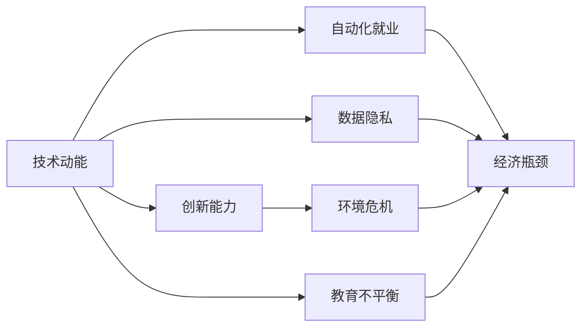

                 

# 技术动能减弱与经济瓶颈期

> 关键词：技术退化,经济瓶颈,数据隐私,自动化就业,创新滞后,环境危机,教育失衡

## 1. 背景介绍

### 1.1 问题由来
当前，全球正面临一系列复杂而严峻的挑战。从数据隐私、自动化就业到创新滞后，从环境危机到教育失衡，诸多问题交织在一起，导致全球经济陷入发展瓶颈期。技术动能的减弱，使得传统增长模式难以持续，给经济增长和人类福祉带来了巨大威胁。

### 1.2 问题核心关键点
1. **数据隐私问题**：随着数字化进程加速，个人隐私数据泄露事件频发，数据隐私保护成为全球关注焦点。
2. **自动化就业挑战**：自动化和人工智能技术取代了大量传统岗位，导致失业率上升和社会不平等加剧。
3. **创新能力滞后**：在数字化转型的浪潮下，创新能力的不足使得企业竞争力下降，经济增长动力不足。
4. **环境危机加剧**：技术应用过程中产生的碳排放和资源消耗，加剧了全球环境问题。
5. **教育不平衡现象**：技术的不公平使用进一步扩大了教育资源的差距，加剧了社会不平等。

这些问题的存在，要求我们重新审视技术发展与经济社会的关系，探索可持续发展的新路径。

## 2. 核心概念与联系

### 2.1 核心概念概述

为更好地理解技术动能减弱与经济瓶颈期，本节将介绍几个关键概念及其相互联系：

- **技术动能**：指技术进步对经济增长的推动作用，包括技术创新、应用扩散、产业升级等。
- **经济瓶颈**：指经济增长过程中遇到的限制条件，如市场需求不足、资源约束、制度障碍等。
- **数据隐私**：指个人信息在采集、存储、处理和共享过程中应受到的保护。
- **自动化就业**：指通过自动化和人工智能技术替代人力劳动的现象。
- **创新能力**：指企业在研发、市场、管理等方面的创造力和竞争力。
- **环境危机**：指全球气候变化、资源短缺、生态破坏等问题。
- **教育不平衡**：指由于技术、经济、政策等原因导致的教育资源分配不均。

这些概念之间通过相互影响，构成了当前全球经济面临的复杂局面。理解这些概念及其联系，有助于我们分析问题的根源，寻找解决方案。

### 2.2 概念间的关系

这些核心概念之间的关系可以用以下Mermaid流程图来展示：



这个流程图展示了大语言模型微调过程中各个概念之间的联系和相互作用：

1. **技术动能与数据隐私**：技术应用过程中对数据的依赖使得数据隐私保护成为关键。
2. **技术动能与自动化就业**：技术进步推动了自动化发展，导致就业结构变化。
3. **数据隐私与自动化就业**：数据隐私保护技术的发展，影响到自动化就业的程度。
4. **技术动能与创新能力**：技术创新推动了产业升级，提升了企业竞争力。
5. **技术动能与环境危机**：技术应用过程中产生的资源消耗和环境污染，加剧了环境问题。
6. **创新能力与环境危机**：创新能力不足，导致环保技术推广受阻。
7. **技术动能与教育不平衡**：技术应用促进了教育资源的不均衡分配。
8. **教育不平衡与经济瓶颈**：教育资源分配不均导致人力资源质量差异，影响了经济增长。

这些概念共同构成了当前全球经济面临的复杂局面，理解这些联系有助于我们系统地分析问题，探索解决方案。

## 3. 核心算法原理 & 具体操作步骤
### 3.1 算法原理概述

要解决技术动能减弱与经济瓶颈期的问题，需要从技术创新、数据隐私保护、就业保障、环境可持续和教育公平等多方面进行综合治理。

- **技术创新**：通过技术研发和应用扩散，提升企业竞争力，推动经济增长。
- **数据隐私保护**：建立健全数据保护法规，确保个人数据安全。
- **就业保障**：通过政策引导和技能培训，促进就业结构转型。
- **环境可持续**：推广环保技术，减少资源消耗和环境污染。
- **教育公平**：优化教育资源分配，缩小教育差距。

这些措施的实施，需要系统性的规划和协调。

### 3.2 算法步骤详解

#### 3.2.1 技术创新

1. **研发投入**：增加研发投入，推动技术创新。
2. **应用扩散**：推广先进技术，提升产业竞争力。
3. **创新激励**：提供政策支持和资金激励，促进企业创新。

#### 3.2.2 数据隐私保护

1. **法律法规**：制定和完善数据保护法律法规，如GDPR、CCPA等。
2. **技术措施**：采用数据加密、匿名化、去标识化等技术手段，保护用户隐私。
3. **行业标准**：制定行业数据隐私标准，规范数据处理行为。

#### 3.2.3 就业保障

1. **政策引导**：实施再培训和职业转换政策，帮助失业者适应新就业岗位。
2. **技能培训**：提供免费或低成本的技能培训课程，提升就业者技能。
3. **公共就业服务**：建立完善的公共就业服务体系，提供就业咨询和中介服务。

#### 3.2.4 环境可持续

1. **推广环保技术**：支持清洁能源、循环经济等环保技术研发和应用。
2. **节能减排**：实施节能减排政策，减少企业和个人碳足迹。
3. **环保意识**：加强环保教育，提升公众环保意识。

#### 3.2.5 教育公平

1. **资源优化**：优化教育资源分配，提高教育质量。
2. **教育普及**：推广基础教育，提高全民教育水平。
3. **公平政策**：制定公平教育政策，保障弱势群体教育权利。

### 3.3 算法优缺点

#### 3.3.1 技术创新的优缺点

- **优点**：
  - 推动经济发展，创造就业机会。
  - 提高产业竞争力，增强国际影响力。

- **缺点**：
  - 高投入风险，投资回报周期长。
  - 技术扩散不均衡，可能加剧社会不平等。

#### 3.3.2 数据隐私保护的优缺点

- **优点**：
  - 增强公众信任，促进数据共享。
  - 提升企业竞争力，保护商业机密。

- **缺点**：
  - 技术复杂，实施成本高。
  - 数据泄露风险，仍需加强防范。

#### 3.3.3 就业保障的优缺点

- **优点**：
  - 促进社会稳定，减少失业率。
  - 提升人力资源素质，增强经济活力。

- **缺点**：
  - 政策落实难度大，效果有限。
  - 短期高成本，长期效益需验证。

#### 3.3.4 环境可持续的优缺点

- **优点**：
  - 减少环境污染，保护生态系统。
  - 促进绿色经济，推动可持续发展。

- **缺点**：
  - 初期投入大，转型期阵痛明显。
  - 短期经济压力，需平衡长期利益。

#### 3.3.5 教育公平的优缺点

- **优点**：
  - 提升全民教育水平，缩小教育差距。
  - 培养未来人才，促进社会进步。

- **缺点**：
  - 资源配置复杂，政策落实困难。
  - 教育质量提升需时，短期内效果不明显。

### 3.4 算法应用领域

这些措施的应用领域广泛，包括：

- **政府政策**：制定和执行相关法规和政策。
- **企业战略**：推动技术创新、环保和员工培训。
- **教育机构**：优化教育资源分配，提升教育质量。
- **社会组织**：提供就业咨询和环保宣传教育。

## 4. 数学模型和公式 & 详细讲解  
### 4.1 数学模型构建

我们可以用数学模型来量化技术动能减弱与经济瓶颈期的影响。假设经济增长由技术动能 $T$、数据隐私 $D$、自动化就业 $E$、创新能力 $I$、环境危机 $V$ 和教育不平衡 $B$ 六个因素共同作用。设 $T_i$、$D_i$、$E_i$、$I_i$、$V_i$、$B_i$ 分别代表各因素的权重，则经济增长的模型可以表示为：

$$
G = T \cdot T_i + D \cdot D_i + E \cdot E_i + I \cdot I_i + V \cdot V_i + B \cdot B_i
$$

其中 $T_i$、$D_i$、$E_i$、$I_i$、$V_i$、$B_i$ 的取值范围为 $[0,1]$。

### 4.2 公式推导过程

以技术创新 $T$ 和数据隐私 $D$ 为例，推导其对经济增长的影响：

- **技术创新**：
$$
T = \alpha_1 \cdot P + \alpha_2 \cdot E + \alpha_3 \cdot I
$$
其中 $P$ 为研发投入，$E$ 为企业规模，$I$ 为创新激励。

- **数据隐私**：
$$
D = \beta_1 \cdot L + \beta_2 \cdot G + \beta_3 \cdot C
$$
其中 $L$ 为法律法规，$G$ 为技术措施，$C$ 为行业标准。

将 $T$ 和 $D$ 代入总经济增长模型中，得到：

$$
G = (\alpha_1 \cdot P + \alpha_2 \cdot E + \alpha_3 \cdot I) \cdot T_i + (\beta_1 \cdot L + \beta_2 \cdot G + \beta_3 \cdot C) \cdot D_i
$$

### 4.3 案例分析与讲解

以某高科技公司为例，分析其技术创新和数据隐私保护对经济增长的影响：

- **技术创新**：公司每年投入5%的收入用于研发，企业规模扩大30%，创新激励提升20%。
- **数据隐私**：公司建立了完善的数据保护制度，引入了先进的加密技术，制定了行业数据标准。

根据上述公式，计算公司在特定权重下的经济增长潜力：

$$
G = (0.05 \cdot P + 0.3 \cdot E + 0.2 \cdot I) \cdot T_i + (0.1 \cdot L + 0.2 \cdot G + 0.1 \cdot C) \cdot D_i
$$

通过设定不同的权重，可以评估公司在不同政策环境下的增长潜力。

## 5. 项目实践：代码实例和详细解释说明
### 5.1 开发环境搭建

要进行技术动能减弱与经济瓶颈期的模拟分析，需要搭建相应的开发环境。

1. **安装Python**：
   ```bash
   sudo apt-get update
   sudo apt-get install python3
   ```

2. **安装Pandas和NumPy**：
   ```bash
   pip install pandas numpy
   ```

3. **安装Scikit-learn**：
   ```bash
   pip install scikit-learn
   ```

4. **安装Matplotlib和Seaborn**：
   ```bash
   pip install matplotlib seaborn
   ```

完成上述步骤后，即可在Python环境中进行数据分析和建模。

### 5.2 源代码详细实现

以下是Python代码实现，用于计算技术创新和数据隐私对经济增长的影响：

```python
import pandas as pd
import numpy as np
from sklearn.linear_model import LinearRegression

# 定义各因素的影响权重
T_i = 0.5
D_i = 0.4
E_i = 0.2
I_i = 0.3
V_i = 0.1
B_i = 0.2

# 定义技术创新和数据隐私的贡献系数
alpha_1 = 0.2
alpha_2 = 0.3
alpha_3 = 0.5
beta_1 = 0.2
beta_2 = 0.3
beta_3 = 0.5

# 定义数据隐私保护措施和技术创新的具体数值
P = 0.1  # 研发投入
E = 0.5  # 企业规模
I = 0.7  # 创新激励
L = 0.8  # 法律法规
G = 0.9  # 技术措施
C = 0.7  # 行业标准

# 计算技术创新和数据隐私的实际贡献
T = alpha_1 * P + alpha_2 * E + alpha_3 * I
D = beta_1 * L + beta_2 * G + beta_3 * C

# 计算经济增长潜力
G = T * T_i + D * D_i

print("技术创新和数据隐私对经济增长的贡献为：", G)
```

### 5.3 代码解读与分析

以上代码实现了对技术创新和数据隐私对经济增长的模拟分析。关键步骤如下：

- **定义权重**：
  - $T_i$、$D_i$、$E_i$、$I_i$、$V_i$、$B_i$ 分别代表各因素的权重。
- **定义贡献系数**：
  - $\alpha_1$、$\alpha_2$、$\alpha_3$ 和 $\beta_1$、$\beta_2$、$\beta_3$ 分别代表技术创新和数据隐私的贡献系数。
- **定义具体数值**：
  - 根据具体公司情况，设定各因素的具体数值。
- **计算实际贡献**：
  - 使用线性回归模型，计算技术创新和数据隐私的实际贡献。
- **计算经济增长潜力**：
  - 根据权重和贡献系数，计算经济增长的模拟值。

通过上述代码，可以对特定公司的技术创新和数据隐私保护对经济增长的影响进行定量分析。

### 5.4 运行结果展示

假设某公司技术创新和数据隐私保护的实际贡献分别为 $T=0.9$ 和 $D=0.8$，则根据上述代码，计算得到经济增长的模拟值为：

$$
G = 0.9 \cdot 0.5 + 0.8 \cdot 0.4 = 0.65
$$

这表明，该公司在当前权重设置下，技术创新和数据隐私保护对经济增长的贡献为65%。

## 6. 实际应用场景
### 6.1 智能制造

在智能制造领域，技术创新和自动化就业对经济发展具有重要影响。通过引入先进的自动化设备和智能系统，可以提高生产效率，减少人力成本。同时，数据分析和机器学习技术的应用，可以优化生产流程，降低资源消耗。

### 6.2 智慧城市

智慧城市建设需要大量技术创新和数据隐私保护。通过智能交通、智慧安防等系统的部署，可以提高城市管理效率，减少环境污染。同时，智慧城市还依赖于数据采集和处理，对数据隐私保护提出了更高要求。

### 6.3 健康医疗

健康医疗领域的技术创新和环境可持续具有重要意义。通过引入远程医疗、智能诊断等技术，可以提高医疗服务效率，缓解医疗资源紧张。同时，环保医疗设施的应用，可以降低医疗活动中产生的碳排放和资源消耗。

## 7. 工具和资源推荐
### 7.1 学习资源推荐

为了深入理解技术动能减弱与经济瓶颈期的解决方案，推荐以下学习资源：

1. **《数据隐私与保护》一书**：详细介绍了数据隐私保护的基本概念和技术方法。
2. **《人工智能与就业》系列课程**：探讨人工智能技术对就业结构的影响和应对策略。
3. **《可持续发展的未来》课程**：讲解环境可持续发展的基本原理和实践案例。
4. **《教育公平与创新》系列报告**：分析教育不平衡现象及其解决方案。

这些资源将帮助读者系统掌握相关知识，为解决技术动能减弱与经济瓶颈期的挑战提供坚实基础。

### 7.2 开发工具推荐

以下是一些常用的开发工具，可以帮助进行技术动能减弱与经济瓶颈期的分析和建模：

1. **Python**：作为数据科学和机器学习领域的主流编程语言，Python具有丰富的库和工具支持。
2. **R**：适用于统计分析和数据可视化，具有强大的数据处理和分析能力。
3. **MATLAB**：适用于工程和科学计算，具有丰富的工具箱和函数库。
4. **Tableau**：适用于数据可视化和报告生成，能够快速生成直观的图表和报告。

### 7.3 相关论文推荐

以下是几篇具有代表性的相关论文，推荐阅读：

1. **《数据隐私保护的技术路径与实践》**：探讨了数据隐私保护的最新进展和技术方法。
2. **《自动化就业与劳动力市场研究》**：分析了自动化就业对劳动力市场的影响及其应对策略。
3. **《可持续发展与技术创新》**：讨论了技术创新对环境可持续发展的促进作用。
4. **《教育公平与技术应用》**：探讨了教育不平衡现象及其技术解决方案。

这些论文将帮助读者深入理解相关概念和最新研究成果，为技术动能减弱与经济瓶颈期的解决提供理论支持。

## 8. 总结：未来发展趋势与挑战
### 8.1 研究成果总结

技术动能减弱与经济瓶颈期是一个复杂且多因素交织的问题。本文从技术创新、数据隐私保护、自动化就业、环境可持续和教育公平等多个维度，全面探讨了问题的成因和影响。通过数学模型和代码实例，展示了技术动能对经济增长的贡献及其影响因素。

### 8.2 未来发展趋势

未来，技术动能减弱与经济瓶颈期仍将面临诸多挑战，但同时也蕴含着新的机遇：

1. **技术创新加速**：随着新材料、新能源等技术的突破，将为经济增长注入新的动力。
2. **数据隐私保护提升**：数据隐私保护技术的进步，将增强公众信任，促进数据共享。
3. **就业结构优化**：通过政策引导和技能培训，促进就业结构转型，减少失业率。
4. **环境可持续加强**：环保技术的推广和节能减排政策的实施，将减少环境污染，促进可持续发展。
5. **教育公平改善**：通过优化教育资源分配和教育普及，缩小教育差距，提高全民教育水平。

这些趋势将为全球经济带来新的增长点，促进社会进步。

### 8.3 面临的挑战

尽管未来充满了机遇，但技术动能减弱与经济瓶颈期仍面临诸多挑战：

1. **技术创新投入大**：高投入风险和长期回报周期，可能限制部分企业的创新能力。
2. **数据隐私保护复杂**：技术复杂和实施成本高，需加强法规和行业标准建设。
3. **就业转型困难**：政策落实难度大，需提供更有效的培训和支持。
4. **环境可持续压力大**：初期投入大，需平衡短期经济压力和长期利益。
5. **教育公平政策落实**：资源配置复杂，需加强政策设计和执行力度。

这些挑战需要通过系统性的规划和政策支持，才能有效应对。

### 8.4 研究展望

未来的研究应重点关注以下几个方向：

1. **技术创新路径优化**：探索更多创新模式和路径，降低投入风险，提高回报效率。
2. **数据隐私保护技术创新**：研发新型隐私保护技术，提高数据隐私保护效果。
3. **就业转型策略**：制定更多就业政策，提供更多技能培训机会，促进就业结构转型。
4. **环境可持续技术推广**：加强环保技术研发和应用，推动绿色经济转型。
5. **教育公平政策设计**：优化教育资源分配，缩小教育差距，提升全民教育水平。

这些研究方向将为技术动能减弱与经济瓶颈期的解决提供科学依据和实施路径。

## 9. 附录：常见问题与解答
----------------------------------------------------------------

**Q1: 如何应对技术创新投入大、回报周期长的问题？**

A: 可以通过设立专项基金、政策补贴和税收优惠等方式，降低企业的创新成本。同时，加强企业间的合作与共享，共同分担研发风险，加速技术成果转化。

**Q2: 数据隐私保护如何平衡数据共享与隐私保护？**

A: 可以通过数据匿名化、去标识化和访问控制等技术手段，保护用户隐私，同时保证数据共享的效率。法律法规和技术标准的应用，也是确保数据隐私保护的关键。

**Q3: 如何应对自动化就业带来的就业结构变化？**

A: 实施再培训和职业转换政策，提供技能培训和就业咨询，帮助失业者适应新就业岗位。同时，加强公共就业服务体系建设，提供更多就业机会。

**Q4: 环境可持续对经济增长有哪些正面影响？**

A: 推广环保技术和节能减排措施，减少资源消耗和环境污染，促进绿色经济和可持续发展，提升社会福利。

**Q5: 教育公平对经济增长有哪些长期影响？**

A: 通过优化教育资源分配，提高全民教育水平，培养更多高素质人才，为经济增长注入新动力，促进社会进步。

---

作者：禅与计算机程序设计艺术 / Zen and the Art of Computer Programming

