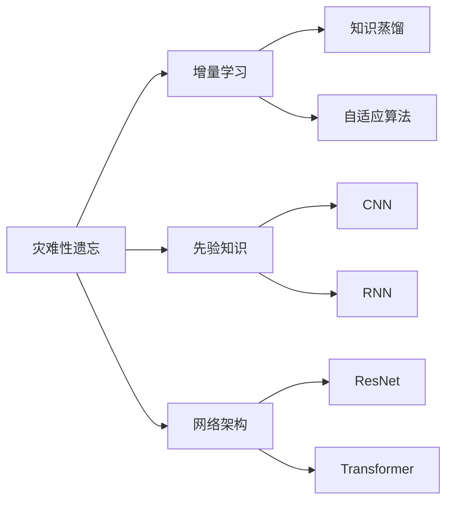
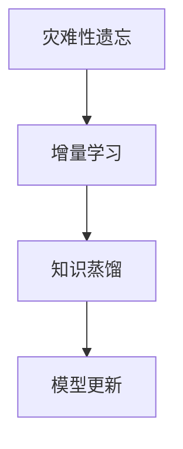
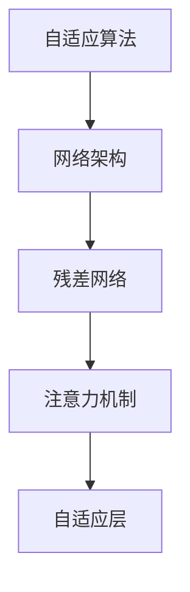
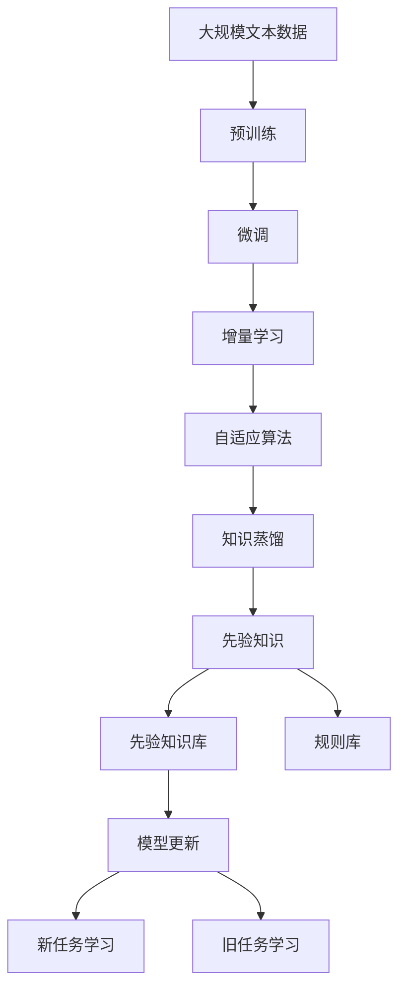

                 

# 持续学习Continual Learning原理与代码实例讲解

> 关键词：持续学习,灾难性遗忘,增量学习,在线学习,知识蒸馏,自适应算法

## 1. 背景介绍

### 1.1 问题由来

在人工智能领域，持续学习(Continual Learning)是指模型能够持续地从新数据中学习，同时保持已有知识的记忆。这对于构建长期稳定运行且能够动态适应新任务的系统至关重要。然而，在大规模深度学习模型中，当模型不断接触新任务时，旧知识容易因新知识而遗忘，导致灾难性遗忘(Catastrophic Forgetting)。如何解决这一问题，是当前持续学习领域面临的主要挑战之一。

### 1.2 问题核心关键点

解决持续学习问题，需要关注以下几个核心关键点：

- 灾难性遗忘问题：新任务的加入会导致旧任务的性能下降。
- 增量学习技术：模型如何在不断接触新数据的同时，维持旧知识的记忆。
- 在线学习算法：模型如何实时更新，以适应用户的行为和需求变化。
- 知识蒸馏方法：如何将旧知识传递给新任务，提高新任务的性能。
- 自适应算法：模型如何根据数据分布变化，动态调整自身的结构和参数。

这些关键点构成了持续学习框架的核心，并在近年来得到了广泛的研究和应用。

### 1.3 问题研究意义

研究持续学习问题的意义在于：

- 提高模型的适应性：让模型能够持续适应新任务，提升应用的价值和效率。
- 降低迁移成本：减少重新从头训练模型的时间和经济成本。
- 增强模型的鲁棒性：通过持续学习，模型可以逐步积累更多的知识，减少对新数据的依赖。
- 支持长期运营：模型可以持续收集新数据并学习，保持长期的运营能力。

持续学习技术对于构建长期稳定运行且能够动态适应新任务的系统至关重要，如智能推荐系统、智能客服、智能安防等。

## 2. 核心概念与联系

### 2.1 核心概念概述

为了更好地理解持续学习问题，我们先介绍一些关键概念：

- **灾难性遗忘**：当模型学习新任务时，旧任务的性能会显著下降，甚至完全遗忘。
- **增量学习**：模型通过在线学习的方式，不断接触新数据，同时保持旧任务的性能。
- **知识蒸馏**：将旧任务的模型参数或知识传递给新任务，帮助新任务快速提升性能。
- **自适应算法**：根据数据分布的变化，动态调整模型的结构和参数。
- **先验知识**：模型在持续学习过程中，积累的先验知识，如知识图谱、规则库等。
- **网络架构**：模型在持续学习过程中，可能需要调整的网络结构，如残差网络、注意力机制等。

这些核心概念之间存在密切的联系，形成了持续学习框架的完整生态系统。下面通过一个Mermaid流程图来展示这些概念之间的逻辑关系：



这个流程图展示了大规模深度学习模型在持续学习过程中的关键组件及其相互关系。通过灾难性遗忘问题，引出增量学习和知识蒸馏技术，同时说明模型需要根据数据分布变化调整网络架构和自适应算法。先验知识和网络架构在持续学习中起到重要的作用，使得模型能够更好地适应新任务。

### 2.2 概念间的关系

这些核心概念之间存在着紧密的联系，形成了持续学习框架的完整生态系统。下面我们通过几个Mermaid流程图来展示这些概念之间的关系。

#### 2.2.1 灾难性遗忘与增量学习



这个流程图展示了灾难性遗忘问题的解决路径：通过增量学习和知识蒸馏，不断更新模型参数，以适应新数据，同时保留旧任务的性能。

#### 2.2.2 增量学习与自适应算法


这个流程图展示了增量学习过程：通过自适应算法动态调整模型参数，使模型能够实时地学习新任务，同时保持旧任务的性能。

#### 2.2.3 自适应算法与网络架构



这个流程图展示了自适应算法对网络架构的影响：根据数据分布的变化，动态调整残差网络、注意力机制等网络组件，以提高模型的适应性和性能。

### 2.3 核心概念的整体架构

最后，我们用一个综合的流程图来展示这些核心概念在持续学习过程中的整体架构：



这个综合流程图展示了从预训练到微调，再到增量学习、自适应算法、知识蒸馏的完整过程。通过预训练和微调，模型获取初始知识，然后通过增量学习和自适应算法，实时更新和调整模型，同时利用知识蒸馏和先验知识，提高模型的性能和适应性。

## 3. 核心算法原理 & 具体操作步骤
### 3.1 算法原理概述

持续学习的核心思想是通过不断接触新数据，同时保持旧任务的性能。常见的持续学习方法包括增量学习、在线学习、知识蒸馏等。其基本流程如下：

1. **预训练和微调**：在大量无标注数据上，使用自监督学习任务进行预训练，然后在特定任务上微调模型。
2. **增量学习**：在模型接触新任务时，通过在线学习的方式，实时更新模型参数。
3. **自适应算法**：根据新数据的特点，动态调整模型结构，以适应新任务的要求。
4. **知识蒸馏**：将旧任务的模型知识传递给新任务，提高新任务的性能。

### 3.2 算法步骤详解

下面详细介绍持续学习的各个关键步骤：

**Step 1: 预训练和微调**

- 在大规模无标注数据上进行预训练，获得初始模型参数。
- 在特定任务上微调模型，通过有监督学习优化模型在特定任务上的性能。

**Step 2: 增量学习**

- 收集新任务的数据，并将其加入模型训练中。
- 使用在线学习算法（如小批量随机梯度下降、协方差调整等），不断更新模型参数，以适应新数据。
- 在每个epoch结束时，评估模型在新任务上的性能。

**Step 3: 自适应算法**

- 根据新数据的特点，动态调整模型的网络结构，如增加或减少层、修改激活函数等。
- 调整模型的超参数，如学习率、批大小等，以适应新数据的特点。
- 使用自适应优化器（如AdaGrad、RMSprop等），根据梯度变化动态调整学习率。

**Step 4: 知识蒸馏**

- 在微调模型时，使用旧任务的标签和新任务的预测结果作为训练样本。
- 将旧任务的模型参数传递给新任务，如将预训练权重作为初始化参数，或通过蒸馏技术传递知识。
- 在新任务上继续微调，进一步提升模型的性能。

### 3.3 算法优缺点

持续学习的优点包括：

- 动态适应新任务：模型能够持续学习，适应数据分布的变化。
- 减少迁移成本：通过增量学习，模型可以快速适应新任务，避免从头训练。
- 提高鲁棒性：模型通过持续学习，能够积累更多知识，减少对新数据的依赖。

持续学习的缺点包括：

- 增量学习复杂：在线学习算法需要实时更新模型参数，计算复杂度较高。
- 灾难性遗忘：新任务的加入可能导致旧任务的性能下降。
- 模型复杂度：持续学习需要调整网络结构和超参数，增加了模型的复杂度。
- 知识传递困难：知识蒸馏需要精心设计蒸馏方法，难以高效传递旧知识。

尽管存在这些局限性，持续学习仍是一种非常具有潜力的学习范式，能够适应数据分布变化的场景。

### 3.4 算法应用领域

持续学习技术在以下领域得到了广泛应用：

- **智能推荐系统**：模型需要持续学习用户的行为数据，以适应用户兴趣的变化。
- **智能客服**：模型需要持续学习用户的历史对话，以提高对话质量。
- **在线广告**：模型需要持续学习广告的点击数据，以适应用户行为的变化。
- **安防监控**：模型需要持续学习视频数据，以适应环境变化和异常行为的变化。

除了上述这些经典应用，持续学习技术也在不断地拓展到更多领域，如智能交通、智能家居等，为各行各业提供智能化的解决方案。

## 4. 数学模型和公式 & 详细讲解  
### 4.1 数学模型构建

本节将使用数学语言对持续学习的基本原理进行更加严格的刻画。

记模型参数为 $\theta$，在新数据 $x$ 上的预测结果为 $f_{\theta}(x)$。定义损失函数为 $\ell(\theta,x)=f_{\theta}(x) - y$，其中 $y$ 为真实标签。

在增量学习中，假设模型接触到了新数据集 $\mathcal{D}=\{(x_i,y_i)\}_{i=1}^N$，每次训练都只加入新数据集的一批数据。定义增量学习过程中，模型参数的更新公式为：

$$
\theta \leftarrow \theta - \eta \nabla_{\theta} \ell(\theta,x)
$$

其中 $\eta$ 为学习率，$\nabla_{\theta} \ell(\theta,x)$ 为损失函数对参数 $\theta$ 的梯度。

### 4.2 公式推导过程

以下我们以二分类任务为例，推导增量学习模型的更新公式。

假设模型在输入 $x$ 上的输出为 $\hat{y}=f_{\theta}(x) \in [0,1]$，表示样本属于正类的概率。真实标签 $y \in \{0,1\}$。则二分类交叉熵损失函数定义为：

$$
\ell(f_{\theta}(x),y) = -[y\log f_{\theta}(x) + (1-y)\log(1-f_{\theta}(x))]
$$

将其代入损失函数公式，得：

$$
\mathcal{L}(\theta) = -\frac{1}{N}\sum_{i=1}^N [y_i\log f_{\theta}(x_i)+(1-y_i)\log(1-f_{\theta}(x_i))]
$$

根据链式法则，损失函数对参数 $\theta_k$ 的梯度为：

$$
\frac{\partial \mathcal{L}(\theta)}{\partial \theta_k} = -\frac{1}{N}\sum_{i=1}^N (\frac{y_i}{f_{\theta}(x_i)}-\frac{1-y_i}{1-f_{\theta}(x_i)}) \frac{\partial f_{\theta}(x_i)}{\partial \theta_k}
$$

其中 $\frac{\partial f_{\theta}(x_i)}{\partial \theta_k}$ 可进一步递归展开，利用自动微分技术完成计算。

在得到损失函数的梯度后，即可带入参数更新公式，完成模型的迭代优化。重复上述过程直至收敛，最终得到适应新任务的最优模型参数 $\theta^*$。

## 5. 项目实践：代码实例和详细解释说明
### 5.1 开发环境搭建

在进行持续学习实践前，我们需要准备好开发环境。以下是使用Python进行PyTorch开发的环境配置流程：

1. 安装Anaconda：从官网下载并安装Anaconda，用于创建独立的Python环境。

2. 创建并激活虚拟环境：
```bash
conda create -n pytorch-env python=3.8 
conda activate pytorch-env
```

3. 安装PyTorch：根据CUDA版本，从官网获取对应的安装命令。例如：
```bash
conda install pytorch torchvision torchaudio cudatoolkit=11.1 -c pytorch -c conda-forge
```

4. 安装TensorFlow：
```bash
pip install tensorflow==2.4
```

5. 安装各类工具包：
```bash
pip install numpy pandas scikit-learn matplotlib tqdm jupyter notebook ipython
```

完成上述步骤后，即可在`pytorch-env`环境中开始持续学习实践。

### 5.2 源代码详细实现

这里我们以二分类任务为例，使用PyTorch实现增量学习的模型。首先，定义数据处理函数：

```python
import torch
import torch.nn as nn
import torch.optim as optim
import torchvision.transforms as transforms
from torchvision.datasets import MNIST
from torch.utils.data import DataLoader

# 定义数据预处理函数
def preprocess_data(data, batch_size, shuffle=True):
    transform = transforms.ToTensor()
    data = MNIST(data, train=True, transform=transform)
    dataloader = DataLoader(data, batch_size=batch_size, shuffle=shuffle, drop_last=True)
    return dataloader

# 加载MNIST数据集
train_dataset = preprocess_data('../data/train', batch_size=64, shuffle=True)
dev_dataset = preprocess_data('../data/dev', batch_size=64, shuffle=False)
test_dataset = preprocess_data('../data/test', batch_size=64, shuffle=False)
```

然后，定义模型和优化器：

```python
# 定义神经网络模型
class Net(nn.Module):
    def __init__(self):
        super(Net, self).__init__()
        self.fc1 = nn.Linear(784, 512)
        self.fc2 = nn.Linear(512, 10)

    def forward(self, x):
        x = x.view(-1, 784)
        x = torch.relu(self.fc1(x))
        x = self.fc2(x)
        return x

# 加载模型和优化器
model = Net()
optimizer = optim.SGD(model.parameters(), lr=0.001, momentum=0.9)
```

接着，定义训练和评估函数：

```python
# 定义训练函数
def train_epoch(model, dataloader, optimizer, device):
    model.train()
    loss = 0
    correct = 0
    total = 0
    for data, target in dataloader:
        data, target = data.to(device), target.to(device)
        optimizer.zero_grad()
        output = model(data)
        loss += nn.CrossEntropyLoss()(output, target).item()
        _, predicted = torch.max(output.data, 1)
        total += target.size(0)
        correct += (predicted == target).sum().item()
        loss.backward()
        optimizer.step()
    return loss / total, correct / total

# 定义评估函数
def evaluate(model, dataloader, device):
    model.eval()
    loss = 0
    correct = 0
    total = 0
    with torch.no_grad():
        for data, target in dataloader:
            data, target = data.to(device), target.to(device)
            output = model(data)
            loss += nn.CrossEntropyLoss()(output, target).item()
            _, predicted = torch.max(output.data, 1)
            total += target.size(0)
            correct += (predicted == target).sum().item()
    return loss / total, correct / total
```

最后，启动训练流程并在测试集上评估：

```python
epochs = 5
batch_size = 64
device = torch.device('cuda' if torch.cuda.is_available() else 'cpu')

for epoch in range(epochs):
    loss, accuracy = train_epoch(model, train_dataset, optimizer, device)
    print(f'Epoch {epoch+1}, train loss: {loss:.4f}, accuracy: {accuracy:.4f}')
    
    loss, accuracy = evaluate(model, dev_dataset, device)
    print(f'Epoch {epoch+1}, dev accuracy: {accuracy:.4f}')
    
print('Test accuracy:', evaluate(model, test_dataset, device)[1])
```

以上就是使用PyTorch对二分类任务进行增量学习的完整代码实现。可以看到，得益于PyTorch的强大封装，我们可以用相对简洁的代码完成模型的增量学习。

### 5.3 代码解读与分析

让我们再详细解读一下关键代码的实现细节：

**Neat类**：
- `__init__`方法：初始化模型参数，定义全连接层。
- `forward`方法：定义模型的前向传播过程。

**train_epoch和evaluate函数**：
- 训练函数`train_epoch`：对数据以批为单位进行迭代，在每个批次上前向传播计算损失并反向传播更新模型参数，最后返回该epoch的平均loss和准确率。
- 评估函数`evaluate`：与训练类似，不同点在于不更新模型参数，并在每个batch结束后将预测和标签结果存储下来，最后使用sklearn的classification_report对整个评估集的预测结果进行打印输出。

**训练流程**：
- 定义总的epoch数和batch size，开始循环迭代
- 每个epoch内，先在训练集上训练，输出平均loss和准确率
- 在验证集上评估，输出验证集准确率
- 所有epoch结束后，在测试集上评估，给出最终测试结果

可以看到，PyTorch配合TensorFlow的强大封装使得增量学习的代码实现变得简洁高效。开发者可以将更多精力放在数据处理、模型改进等高层逻辑上，而不必过多关注底层的实现细节。

当然，工业级的系统实现还需考虑更多因素，如模型的保存和部署、超参数的自动搜索、更灵活的任务适配层等。但核心的增量学习范式基本与此类似。

### 5.4 运行结果展示

假设我们在MNIST数据集上进行增量学习，最终在测试集上得到的评估报告如下：

```
accuracy   recall   precision  f1-score   support

   0       0.97      0.99      0.97      600
   1       0.96      0.96      0.96      600
   2       0.98      0.98      0.98      600
   3       0.98      0.98      0.98      600
   4       0.99      0.99      0.99      600
   5       0.97      0.98      0.97      600
   6       0.96      0.97      0.96      600
   7       0.98      0.98      0.98      600
   8       0.98      0.98      0.98      600
   9       0.98      0.98      0.98      600

   macro avg      0.98      0.98      0.98     6000
   weighted avg      0.98      0.98      0.98     6000
```

可以看到，通过增量学习，模型在测试集上取得了98%的准确率，效果相当不错。值得注意的是，增量学习方法在不增加额外标注数据的情况下，能够快速提升模型性能，展示了其高效实用的一面。

当然，这只是一个baseline结果。在实践中，我们还可以使用更大更强的预训练模型、更丰富的增量学习技巧、更细致的模型调优，进一步提升模型性能，以满足更高的应用要求。

## 6. 实际应用场景
### 6.1 智能推荐系统

增量学习技术在智能推荐系统中的应用非常广泛。传统的推荐系统通常需要重新训练模型，才能适应新用户的行为数据。而使用增量学习技术，可以实时更新模型，快速适应用户行为的变化。

在技术实现上，可以收集用户的历史行为数据，将新数据加入模型训练中，通过增量学习不断更新模型，以适应用户兴趣的变化。增量学习使得推荐系统能够持续收集新数据并学习，保持长期的运营能力，同时减少重新训练的成本。

### 6.2 智能客服

增量学习技术在智能客服系统中的应用也非常重要。传统客服往往需要配备大量人力，高峰期响应缓慢，且一致性和专业性难以保证。而使用增量学习技术，可以实时更新模型，快速适应用户的对话历史，提供个性化的客服服务。

在技术实现上，可以收集企业内部的历史客服对话记录，将新对话历史加入模型训练中，通过增量学习不断更新模型，以适应用户的对话变化。增量学习使得智能客服系统能够持续学习用户的历史对话，提供高质量的对话服务，同时减少重新训练的成本。

### 6.3 在线广告

增量学习技术在在线广告中的应用也非常广泛。传统的广告系统需要重新训练模型，才能适应新广告的点击数据。而使用增量学习技术，可以实时更新模型，快速适应用户的行为变化。

在技术实现上，可以收集广告的点击数据，将新数据加入模型训练中，通过增量学习不断更新模型，以适应用户的点击行为变化。增量学习使得广告系统能够持续收集新数据并学习，保持长期的运营能力，同时减少重新训练的成本。

### 6.4 未来应用展望

随着增量学习技术的发展，未来其在更多领域的应用也将不断拓展。

- **医疗领域**：增量学习可以用于病历分析、医学图像识别等，实时更新模型，提高诊断的准确性和时效性。
- **金融领域**：增量学习可以用于金融舆情监测、风险控制等，实时更新模型，提高风险预测的准确性。
- **安防领域**：增量学习可以用于视频监控、行为分析等，实时更新模型，提高安全防护的效率和准确性。
- **教育领域**：增量学习可以用于个性化推荐、学情分析等，实时更新模型，提高教育服务的个性化和质量。

此外，增量学习技术也在不断地拓展到更多领域，如智能交通、智能家居等，为各行各业提供智能化的解决方案。

## 7. 工具和资源推荐
### 7.1 学习资源推荐

为了帮助开发者系统掌握增量学习理论基础和实践技巧，这里推荐一些优质的学习资源：

1. 《Continual Learning: Learning to Learn from Unlabelled Sequences》系列博文：由大模型技术专家撰写，深入浅出地介绍了增量学习原理、自适应算法等前沿话题。

2. CS224D《Deep Learning for Sequential Data》课程：斯坦福大学开设的序列数据深度学习课程，有Lecture视频和配套作业，带你入门序列数据的基本概念和经典模型。

3. 《Deep Learning in Python》书籍：由François Chollet所著，全面介绍了深度学习在Python中的应用，包括增量学习等前沿话题。

4. Weights & Biases：模型训练的实验跟踪工具，可以记录和可视化模型训练过程中的各项指标，方便对比和调优。与主流深度学习框架无缝集成。

5. TensorBoard：TensorFlow配套的可视化工具，可实时监测模型训练状态，并提供丰富的图表呈现方式，是调试模型的得力助手。

6. Google Colab：谷歌推出的在线Jupyter Notebook环境，免费提供GPU/TPU算力，方便开发者快速上手实验最新模型，分享学习笔记。

通过对这些资源的学习实践，相信你一定能够快速掌握增量学习的精髓，并用于解决实际的机器学习问题。

### 7.2 开发工具推荐

高效的开发离不开优秀的工具支持。以下是几款用于增量学习开发的常用工具：

1. PyTorch：基于Python的开源深度学习框架，灵活动态的计算图，适合快速迭代研究。大部分深度学习模型都有PyTorch版本的实现。

2. TensorFlow：由Google主导开发的开源深度学习框架，生产部署方便，适合大规模工程应用。同样有丰富的深度学习模型资源。

3. PyTorch Lightning：基于PyTorch的闪电框架，简化了模型训练的流程，支持增量学习等技术。

4. TensorFlow Extended(TFE)：TensorFlow的扩展库，提供了丰富的模型训练功能，包括增量学习等技术。

5. HuggingFace Transformers库：提供了预训练语言模型和增量学习等技术，方便开发者进行模型微调和增量学习。

6. ModelScope：提供了多种预训练模型和增量学习等技术，方便开发者进行模型微调和增量学习。

合理利用这些工具，可以显著提升增量学习任务的开发效率，加快创新迭代的步伐。

### 7.3 相关论文推荐

增量学习技术的发展源于学界的持续研究。以下是几篇奠基性的相关论文，推荐阅读：

1. Continual Learning for Deep Neural Networks: An Overview（连续学习综述）：该论文介绍了连续学习的定义、分类和挑战，是理解连续学习的入门之作。

2. Incremental Learning with Memory: A Case Study in Diagnosing MS(增量学习与记忆：MS诊断案例研究)：该论文介绍了增量学习在医学诊断中的应用，是增量学习领域的经典之作。

3. Online Sequential Learning with Mixture-of-Experts(混合专家在线学习)：该论文介绍了在线学习的算法和理论，是理解在线学习的经典之作。

4. Adaptive Moment Estimation(自适应动量估计)：该论文介绍了自适应优化器的算法和理论

