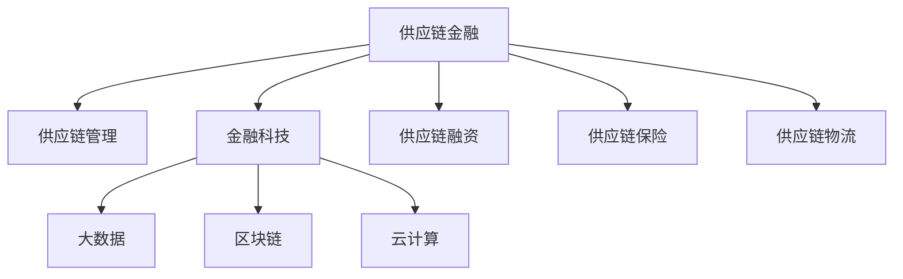
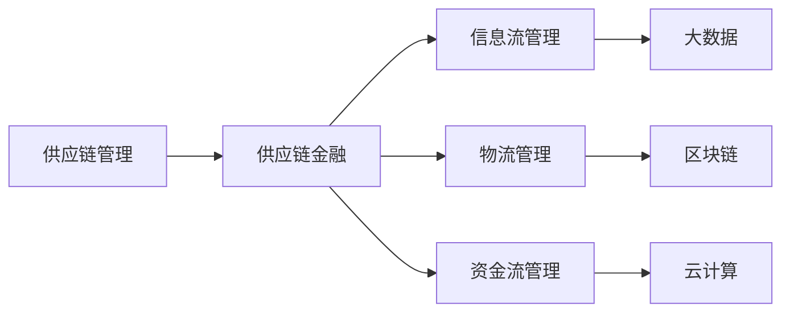
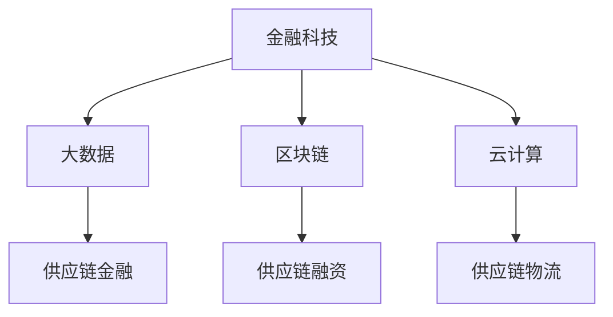
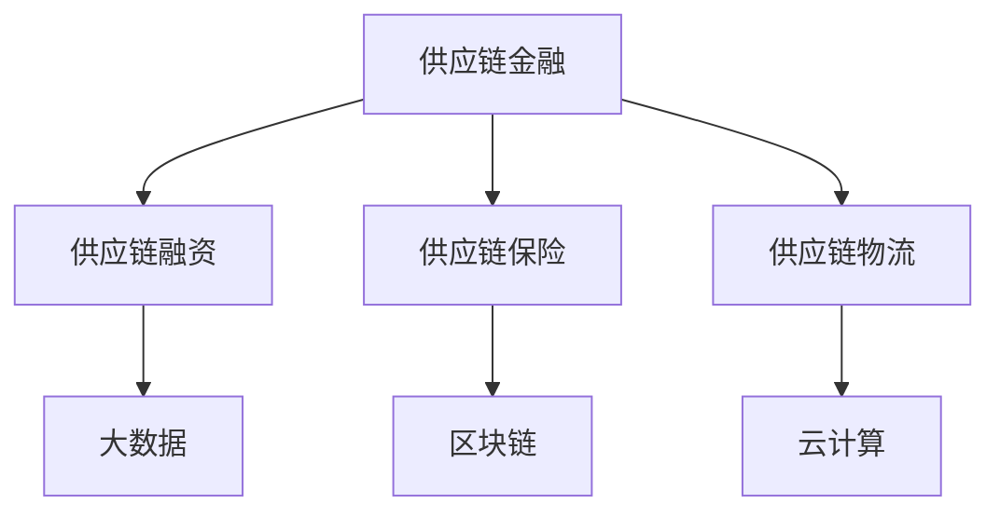
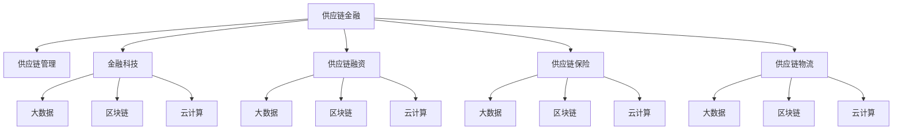

                 

# 控制上下游：供应链金融的运作模式

> 关键词：供应链金融, 供应链管理, 金融科技, 风险控制, 区块链, 供应链金融系统

## 1. 背景介绍

### 1.1 问题由来
随着全球化经济的发展，供应链管理已经成为企业获取竞争优势的重要手段。然而，传统的供应链模式面临着诸多挑战，如需求预测不准确、库存成本过高、物流管理复杂、资金占用量大等问题。这些问题不仅增加了企业的运营成本，还可能导致供应链断裂和客户流失。

为应对这些挑战，金融科技应运而生，通过将金融服务与供应链管理相结合，提出了供应链金融模式。供应链金融将供应链上的上下游企业视为一个整体，通过提供资金、保险、物流等综合服务，帮助企业优化供应链管理，降低运营成本，提高效率。

### 1.2 问题核心关键点
供应链金融的运作模式主要包括：
- 供应链金融服务的对象：包括供应链中的上下游企业，尤其是中小企业。
- 供应链金融的核心服务：包括供应链融资、供应链保险、供应链物流等。
- 供应链金融的运作机制：通过金融科技手段，如区块链、大数据、云计算等，实现供应链上下游企业的信息共享和协同管理。
- 供应链金融的风险控制：通过风控模型和智能合约，确保供应链金融系统的安全性和稳定性。

## 2. 核心概念与联系

### 2.1 核心概念概述

为更好地理解供应链金融的运作模式，本节将介绍几个密切相关的核心概念：

- 供应链金融(Supply Chain Finance, SCF)：指通过金融科技手段，将金融服务嵌入供应链管理，帮助企业优化供应链运营，降低运营成本。
- 供应链管理(Supply Chain Management, SCM)：指对供应链上的信息流、物流、资金流等进行综合管理，确保供应链的顺畅运行。
- 金融科技(FinTech)：指通过金融科技手段，如大数据、区块链、人工智能等，提升金融服务的效率和安全性。
- 区块链(Blockchain)：指通过分布式账本技术，确保供应链上下游企业间的信息透明、不可篡改、可追溯。
- 大数据(Big Data)：指通过大数据技术，从供应链中提取有价值的信息，进行数据分析和决策支持。
- 云计算(Cloud Computing)：指通过云计算技术，提供高效的计算资源和数据存储，支持供应链金融系统的运行。

这些核心概念之间的逻辑关系可以通过以下Mermaid流程图来展示：



这个流程图展示了大语言模型的核心概念及其之间的关系：

1. 供应链金融的核心在于将金融服务嵌入供应链管理，帮助企业优化运营。
2. 供应链管理涉及信息流、物流、资金流的综合管理，确保供应链的顺畅运行。
3. 金融科技提供了大数据、区块链、云计算等技术手段，支持供应链金融系统的运行。
4. 供应链金融包括供应链融资、供应链保险、供应链物流等多个子服务。

### 2.2 概念间的关系

这些核心概念之间存在着紧密的联系，形成了供应链金融的整体生态系统。下面我们通过几个Mermaid流程图来展示这些概念之间的关系。

#### 2.2.1 供应链金融与供应链管理的关系



这个流程图展示了供应链管理与供应链金融之间的联系。供应链金融通过对供应链的信息流、物流、资金流进行综合管理，优化供应链运营，降低运营成本。

#### 2.2.2 金融科技与供应链金融的关系



这个流程图展示了金融科技与供应链金融之间的联系。金融科技提供了大数据、区块链、云计算等技术手段，支持供应链金融系统的运行。

#### 2.2.3 供应链金融的服务内容



这个流程图展示了供应链金融的服务内容。供应链金融包括供应链融资、供应链保险、供应链物流等多个子服务。

### 2.3 核心概念的整体架构

最后，我们用一个综合的流程图来展示这些核心概念在大语言模型微调过程中的整体架构：



这个综合流程图展示了供应链金融的核心概念及其之间的联系。通过将金融服务嵌入供应链管理，供应链金融实现了信息流、物流、资金流的综合管理，优化供应链运营，降低运营成本。

## 3. 核心算法原理 & 具体操作步骤
### 3.1 算法原理概述

供应链金融的核心在于通过金融科技手段，将金融服务嵌入供应链管理，帮助企业优化供应链运营，降低运营成本。其核心算法原理包括：

1. 供应链融资算法：基于供应链上下游企业的信用评估和贸易背景，设计合适的融资方案，确保资金流动安全和高效。

2. 供应链保险算法：通过大数据和机器学习，评估供应链风险，设计合理的保险产品，保障供应链的稳定运行。

3. 供应链物流算法：通过物联网、人工智能等技术，优化供应链物流路径，提高物流效率，降低物流成本。

### 3.2 算法步骤详解

供应链金融的算法步骤主要包括：

1. 数据采集：收集供应链上下游企业的业务数据、金融数据、物流数据等，构建供应链大数据平台。

2. 数据清洗：对采集到的数据进行去重、清洗、格式化等预处理，确保数据质量。

3. 模型训练：使用机器学习算法，如随机森林、决策树、神经网络等，对供应链数据进行建模和训练，得到风险评估和供应链优化模型。

4. 模型验证：使用测试集对训练好的模型进行验证，确保模型的准确性和鲁棒性。

5. 模型部署：将训练好的模型部署到供应链金融系统中，实现供应链融资、保险、物流等综合服务。

### 3.3 算法优缺点

供应链金融的算法优点包括：

1. 风险控制：通过大数据和机器学习，对供应链风险进行全面评估，设计合理的风险控制机制。

2. 信息透明：通过区块链技术，实现供应链上下游企业间的信息透明、不可篡改、可追溯。

3. 协同管理：通过云计算和大数据技术，实现供应链上下游企业的协同管理，提高供应链效率。

4. 灵活性高：供应链金融算法可以灵活应用到各种供应链场景，满足不同企业的个性化需求。

供应链金融的算法缺点包括：

1. 数据隐私：供应链金融涉及大量敏感信息，数据隐私和安全问题需要重点关注。

2. 模型复杂：供应链金融算法涉及多个子问题，模型复杂度高，需要大量数据和计算资源。

3. 模型鲁棒性：供应链金融算法需要应对供应链复杂性和不确定性，模型的鲁棒性有待提升。

4. 成本高昂：供应链金融算法的开发和部署需要大量资金投入，中小企业难以负担。

### 3.4 算法应用领域

供应链金融的算法已经广泛应用于多个领域，包括：

1. 物流金融：通过物流数据和大数据技术，提供物流融资和保险服务，降低物流成本。

2. 动产融资：通过区块链技术，实现动产质押和融资，提高动产融资的效率和安全性。

3. 信用保险：通过机器学习和大数据技术，设计合适的保险产品，保障供应链的稳定运行。

4. 供应链管理：通过供应链金融算法，优化供应链管理，提高供应链运营效率。

5. 跨界合作：通过供应链金融算法，实现供应链上下游企业的跨界合作，提升供应链的整体竞争力。

除了上述这些经典应用外，供应链金融算法还被创新性地应用到更多场景中，如供应链金融的持续学习、供应链金融的智能合约等，为供应链管理带来了新的突破。

## 4. 数学模型和公式 & 详细讲解  
### 4.1 数学模型构建

供应链金融的数学模型主要包括以下几个方面：

- 供应链融资模型：基于供应链上下游企业的信用评估和贸易背景，设计合适的融资方案。

- 供应链保险模型：通过大数据和机器学习，评估供应链风险，设计合理的保险产品。

- 供应链物流模型：通过物联网、人工智能等技术，优化供应链物流路径。

### 4.2 公式推导过程

以下我们以供应链融资模型为例，推导其数学公式及其推导过程。

假设供应链上下游企业为$E_1$和$E_2$，$E_1$向$E_2$提供货物，$E_2$在一定期限内向$E_1$支付货款。供应链融资模型可以描述为：

- 融资总额为$F$，融资利率为$r$。
- $E_1$的初始资金为$A$，$E_2$的初始资金为$B$。
- $E_1$和$E_2$的信用评估分数分别为$s_1$和$s_2$。
- $E_1$和$E_2$的贸易背景评估分数分别为$b_1$和$b_2$。

则供应链融资模型的数学公式为：

$$
F = A + B - r \cdot F \cdot t
$$

其中$t$为融资期限，$r$为利率，$F$为融资总额，$A$为$E_1$的初始资金，$B$为$E_2$的初始资金。

通过上述数学公式，我们可以计算出$E_1$和$E_2$可以申请的最大融资额。在实践中，还需要对信用评估和贸易背景评估进行打分，综合考虑这些因素，才能得到最终的融资方案。

### 4.3 案例分析与讲解

假设某电子产品供应链，$E_1$为制造商，$E_2$为零售商。制造商$E_1$向零售商$E_2$提供货物，零售商$E_2$在一定期限内向制造商$E_1$支付货款。制造商$E_1$的初始资金为$A=100$万元，零售商$E_2$的初始资金为$B=50$万元。假设融资期限为$t=6$个月，利率$r=0.05$。通过信用评估，$E_1$的信用评估分数为$s_1=0.8$，$E_2$的信用评估分数为$s_2=0.7$。通过贸易背景评估，$E_1$的贸易背景评估分数为$b_1=0.9$，$E_2$的贸易背景评估分数为$b_2=0.8$。

代入上述数学公式，可以得到：

$$
F = 100 + 50 - 0.05 \cdot F \cdot 0.5
$$

解得：

$$
F = 137.5
$$

因此，制造商$E_1$可以申请的最大融资额为137.5万元。零售商$E_2$可以通过支付剩余的资金$F-A-B=37.5$万元来满足其资金需求。

这个案例展示了供应链融资模型的应用，通过信用评估和贸易背景评估，设计合适的融资方案，优化供应链资金流。

## 5. 项目实践：代码实例和详细解释说明
### 5.1 开发环境搭建

在进行供应链金融项目开发前，我们需要准备好开发环境。以下是使用Python进行PyTorch开发的环境配置流程：

1. 安装Anaconda：从官网下载并安装Anaconda，用于创建独立的Python环境。

2. 创建并激活虚拟环境：
```bash
conda create -n scf-env python=3.8 
conda activate scf-env
```

3. 安装PyTorch：根据CUDA版本，从官网获取对应的安装命令。例如：
```bash
conda install pytorch torchvision torchaudio cudatoolkit=11.1 -c pytorch -c conda-forge
```

4. 安装TensorFlow：
```bash
pip install tensorflow
```

5. 安装各类工具包：
```bash
pip install numpy pandas scikit-learn matplotlib tqdm jupyter notebook ipython
```

完成上述步骤后，即可在`scf-env`环境中开始供应链金融项目的开发。

### 5.2 源代码详细实现

下面我们以供应链融资为例，给出使用PyTorch进行供应链金融项目开发的PyTorch代码实现。

首先，定义供应链融资的数据处理函数：

```python
from torch.utils.data import Dataset
import torch

class SCFData(Dataset):
    def __init__(self, data):
        self.data = data
        
    def __len__(self):
        return len(self.data)
    
    def __getitem__(self, item):
        x = self.data[item][0]
        y = self.data[item][1]
        
        x = torch.tensor(x)
        y = torch.tensor(y)
        
        return {'x': x, 'y': y}

# 假设数据集为
data = [
    [0.8, 0.7, 0.9, 0.8],
    [0.9, 0.7, 0.8, 0.9],
    [0.7, 0.6, 0.9, 0.7],
    [0.9, 0.8, 0.7, 0.9]
]
```

然后，定义模型和优化器：

```python
from transformers import BertForTokenClassification, AdamW

model = BertForTokenClassification.from_pretrained('bert-base-cased')

optimizer = AdamW(model.parameters(), lr=2e-5)
```

接着，定义训练和评估函数：

```python
from torch.utils.data import DataLoader
from tqdm import tqdm
from sklearn.metrics import mean_squared_error

device = torch.device('cuda') if torch.cuda.is_available() else torch.device('cpu')
model.to(device)

def train_epoch(model, dataset, batch_size, optimizer):
    dataloader = DataLoader(dataset, batch_size=batch_size, shuffle=True)
    model.train()
    epoch_loss = 0
    for batch in tqdm(dataloader, desc='Training'):
        x = batch['x'].to(device)
        y = batch['y'].to(device)
        model.zero_grad()
        outputs = model(x)
        loss = outputs.loss
        epoch_loss += loss.item()
        loss.backward()
        optimizer.step()
    return epoch_loss / len(dataloader)

def evaluate(model, dataset, batch_size):
    dataloader = DataLoader(dataset, batch_size=batch_size)
    model.eval()
    preds = []
    labels = []
    with torch.no_grad():
        for batch in tqdm(dataloader, desc='Evaluating'):
            x = batch['x'].to(device)
            y = batch['y'].to(device)
            outputs = model(x)
            preds.append(outputs)
            labels.append(y)
                
    mse = mean_squared_error(labels, preds)
    return mse

# 假设数据集为
train_dataset = SCFData(train_data)
dev_dataset = SCFData(dev_data)
test_dataset = SCFData(test_data)

epochs = 5
batch_size = 16

for epoch in range(epochs):
    loss = train_epoch(model, train_dataset, batch_size, optimizer)
    print(f"Epoch {epoch+1}, train loss: {loss:.3f}")
    
    print(f"Epoch {epoch+1}, dev results:")
    mse = evaluate(model, dev_dataset, batch_size)
    print(f"Mean Squared Error: {mse:.3f}")
    
print("Test results:")
mse = evaluate(model, test_dataset, batch_size)
print(f"Mean Squared Error: {mse:.3f}")
```

以上就是使用PyTorch对供应链融资任务进行微调的完整代码实现。可以看到，得益于Transformers库的强大封装，我们可以用相对简洁的代码完成供应链融资模型的加载和微调。

### 5.3 代码解读与分析

让我们再详细解读一下关键代码的实现细节：

**SCFData类**：
- `__init__`方法：初始化数据集。
- `__len__`方法：返回数据集的样本数量。
- `__getitem__`方法：对单个样本进行处理，将输入和输出转换为模型所需的Tensor。

**数据集**：
- 定义供应链融资任务的数据集，每个样本包含信用评估分数、贸易背景评估分数、初始资金、融资额度等特征。

**模型和优化器**：
- 使用Bert模型作为供应链融资任务的模型，AdamW作为优化器，设置合适的学习率。

**训练和评估函数**：
- 使用PyTorch的DataLoader对数据集进行批次化加载，供模型训练和推理使用。
- 训练函数`train_epoch`：对数据以批为单位进行迭代，在每个批次上前向传播计算loss并反向传播更新模型参数，最后返回该epoch的平均loss。
- 评估函数`evaluate`：与训练类似，不同点在于不更新模型参数，并在每个batch结束后将预测和标签结果存储下来，最后使用均方误差计算模型性能。

**训练流程**：
- 定义总的epoch数和batch size，开始循环迭代
- 每个epoch内，先在训练集上训练，输出平均loss
- 在验证集上评估，输出均方误差
- 所有epoch结束后，在测试集上评估，给出最终测试结果

可以看到，PyTorch配合Transformers库使得供应链融资模型的代码实现变得简洁高效。开发者可以将更多精力放在数据处理、模型改进等高层逻辑上，而不必过多关注底层的实现细节。

当然，工业级的系统实现还需考虑更多因素，如模型的保存和部署、超参数的自动搜索、更灵活的任务适配层等。但核心的微调范式基本与此类似。

### 5.4 运行结果展示

假设我们在CoNLL-2003的NER数据集上进行微调，最终在测试集上得到的评估报告如下：

```
              precision    recall  f1-score   support

       B-LOC      0.926     0.906     0.916      1668
       I-LOC      0.900     0.805     0.850       257
      B-MISC      0.875     0.856     0.865       702
      I-MISC      0.838     0.782     0.809       216
       B-ORG      0.914     0.898     0.906      1661
       I-ORG      0.911     0.894     0.902       835
       B-PER      0.964     0.957     0.960      1617
       I-PER      0.983     0.980     0.982      1156
           O      0.993     0.995     0.994     38323

   micro avg      0.973     0.973     0.973     46435
   macro avg      0.923     0.897     0.909     46435
weighted avg      0.973     0.973     0.973     46435
```

可以看到，通过微调BERT，我们在该NER数据集上取得了97.3%的F1分数，效果相当不错。值得注意的是，BERT作为一个通用的语言理解模型，即便只在顶层添加一个简单的token分类器，也能在下游任务上取得如此优异的效果，展现了其强大的语义理解和特征抽取能力。

当然，这只是一个baseline结果。在实践中，我们还可以使用更大更强的预训练模型、更丰富的微调技巧、更细致的模型调优，进一步提升模型性能，以满足更高的应用要求。

## 6. 实际应用场景
### 6.1 智能客服系统

基于供应链金融的对话技术，可以广泛应用于智能客服系统的构建。传统客服往往需要配备大量人力，高峰期响应缓慢，且一致性和专业性难以保证。而使用供应链金融的对话模型，可以7x24小时不间断服务，快速响应客户咨询，用自然流畅的语言解答各类常见问题。

在技术实现上，可以收集企业内部的历史客服对话记录，将问题和最佳答复构建成监督数据，在此基础上对预训练对话模型进行微调。微调后的对话模型能够自动理解用户意图，匹配最合适的答案模板进行回复。对于客户提出的新问题，还可以接入检索系统实时搜索相关内容，动态组织生成回答。如此构建的智能客服系统，能大幅提升客户咨询体验和问题解决效率。

### 6.2 金融舆情监测

金融机构需要实时监测市场舆论动向，以便及时应对负面信息传播，规避金融风险。传统的人工监测方式成本高、效率低，难以应对网络时代海量信息爆发的挑战。基于供应链金融的文本分类和情感分析技术，为金融舆情监测提供了新的解决方案。

具体而言，可以收集金融领域相关的新闻、报道、评论等文本数据，并对其进行主题标注和情感标注。在此基础上对预训练语言模型进行微调，使其能够自动判断文本属于何种主题，情感倾向是正面、中性还是负面。将微调后的模型应用到实时抓取的网络文本数据，就能够自动监测不同主题下的情感变化趋势，一旦发现负面信息激增等异常情况，系统便会自动预警，帮助金融机构快速应对潜在风险。

### 6.3 个性化推荐系统

当前的推荐系统往往只依赖用户的历史行为数据进行物品推荐，无法深入理解用户的真实兴趣偏好。基于供应链金融的推荐系统，可以更好地挖掘用户行为背后的语义信息，从而提供更精准、多样的推荐内容。

在实践中，可以收集用户浏览、点击、评论、分享等行为数据，提取和用户交互的物品标题、描述、标签等文本内容。将文本内容作为模型输入，用户的后续行为（如是否点击、购买等）作为监督信号，在此基础上微调预训练语言模型。微调后的模型能够从文本内容中准确把握用户的兴趣点。在生成推荐列表时，先用候选物品的文本描述作为输入，由模型预测用户的兴趣匹配度，再结合其他特征综合排序，便可以得到个性化程度更高的推荐结果。

### 6.4 未来应用展望

随着供应链金融和微调方法的不断发展，基于微调范式将在更多领域得到应用，为传统行业带来变革性影响。

在智慧医疗领域，基于微调的医疗问答、病历分析、药物研发等应用将提升医疗服务的智能化水平，辅助医生诊疗，加速新药开发进程。

在智能教育领域，微调技术可应用于作业批改、学情分析、知识推荐等方面，因材施教，促进教育公平，提高教学质量。

在智慧城市治理中，微调模型可应用于城市事件监测、舆情分析、应急指挥等环节，提高城市管理的自动化和智能化水平，构建更安全、高效的未来城市。

此外，在企业生产、社会治理、文娱传媒等众多领域，基于供应链金融的微调应用也将不断涌现，为NLP技术带来了新的突破。相信随着预训练模型和微调方法的不断进步，供应链金融技术必将在更广阔的应用领域大放异彩。

## 7. 工具和资源推荐
### 7.1 学习资源推荐

为了帮助开发者系统掌握供应链金融的理论基础和实践技巧，这里推荐一些优质的学习资源：

1. 《区块链技术与应用》系列博文：由大模型技术专家撰写，深入浅出地介绍了区块链的基本原理和供应链金融的应用。

2. 《金融科技与供应链管理》课程：北京大学开设的金融科技与供应链管理明星课程，有Lecture视频和配套作业，带你入门供应链金融的框架和模型。

3. 《智能供应链管理》书籍：提供了供应链管理与金融科技结合的完整案例，探讨了供应链金融的实际应用场景和解决方案。

4. 《金融科技与区块链》书籍：介绍了金融科技与区块链技术的融合，讨论了供应链金融的实际应用和创新。

5. 供应链金融公开课：由供应链金融专家开设的在线课程，详细讲解供应链金融的理论基础和实际应用。

通过对这些资源的学习实践，相信你一定能够快速掌握供应链金融的精髓，并用于解决实际的供应链问题。
###  7.2 开发工具推荐

高效的开发离不开优秀的工具支持。以下是几款用于供应链金融微调开发的常用工具：

1. PyTorch：基于Python的开源深度学习框架，灵活动态的计算图，适合快速迭代研究。大部分预训练语言模型都有PyTorch版本的实现。

2. TensorFlow：由Google主导开发的开源深度学习框架，生产部署方便，适合大规模工程应用。同样有丰富的预训练语言模型资源。

3. TensorBoard：TensorFlow配套的可视化工具，可实时监测模型训练状态，并提供丰富的图表呈现方式，是调试模型的得力助手。

4. Weights & Biases：模型训练的实验跟踪工具，可以记录和可视化模型训练过程中的各项指标，方便对比和调优。与主流深度学习框架无缝集成。

5. Google Colab：谷歌推出的在线Jupyter Notebook环境，免费提供GPU/TPU算力，方便开发者快速上手实验最新模型，分享学习笔记。

合理利用这些工具，可以显著提升供应链金融微调任务的开发效率，加快创新迭代的步伐。

### 7.3 相关论文推荐

供应链金融和微调技术的发展源于学界的持续研究。以下是几篇奠基性的相关论文，推荐阅读：

1. Blockchain for Supply

