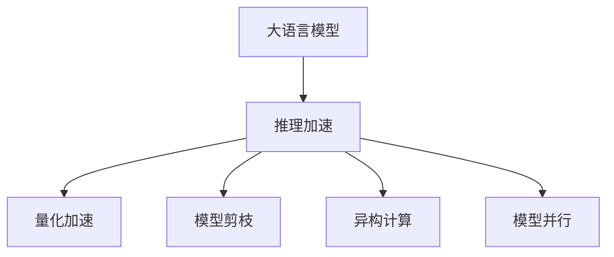
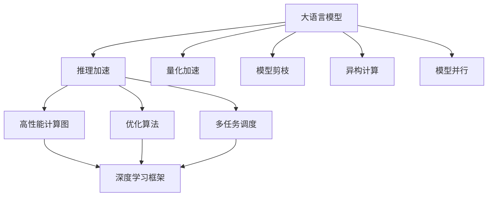
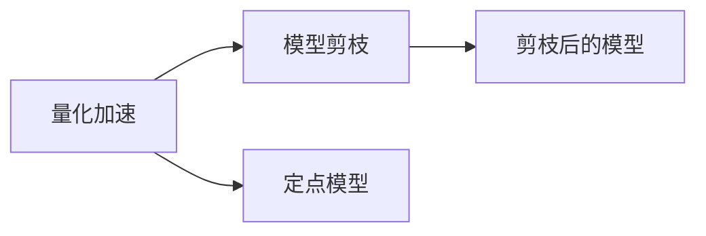

                 

## 1. 背景介绍

### 1.1 问题由来
近年来，大型语言模型(LLMs)在自然语言处理(NLP)领域取得了巨大的突破。特别是基于Transformer架构的模型，如GPT、BERT、T5等，其参数量级在亿级，能够在各种NLP任务上取得令人瞩目的性能。然而，这些模型在推理时，由于计算量大、内存需求高，推理速度常常成为瓶颈。

### 1.2 问题核心关键点
推理加速是大语言模型应用中的一大挑战，尤其在需要实时响应的场景，如智能客服、实时翻译、自动问答等，加速推理速度显得尤为重要。

推理加速的目的是通过优化模型结构、算法和硬件，尽可能减少推理时间，以提升用户体验和系统响应速度。常见的加速方法包括量化加速、模型剪枝、异构计算、模型并行等。

### 1.3 问题研究意义
推理加速对于提升大型语言模型的实时处理能力，优化用户体验，减少系统延迟，具有重要意义。特别是在智能交互、实时翻译等场景，快速响应和高性能推理能极大地提升用户满意度。

## 2. 核心概念与联系

### 2.1 核心概念概述

为更好地理解推理加速的原理和实现方法，本节将介绍几个密切相关的核心概念：

- **大语言模型(LLMs)**：以自回归(如GPT)或自编码(如BERT)模型为代表的大规模预训练语言模型。通过在大规模无标签文本语料上进行预训练，学习通用的语言表示，具备强大的语言理解和生成能力。

- **推理加速**：通过优化模型结构、算法和硬件，尽可能减少推理时间，以提升用户体验和系统响应速度。

- **量化加速**：通过将浮点模型转换为定点模型，减少模型参数的计算量和存储空间，从而提升推理速度。

- **模型剪枝**：通过去掉模型中部分冗余的参数和层，减少计算量和内存占用，优化推理速度。

- **异构计算**：利用不同硬件平台的优势，如CPU、GPU、TPU等，并行计算加速推理过程。

- **模型并行**：将模型的不同部分分布在多个计算节点上并行计算，提高计算效率。

这些核心概念之间的逻辑关系可以通过以下Mermaid流程图来展示：



### 2.2 概念间的关系

这些核心概念之间存在着紧密的联系，形成了大语言模型推理加速的完整生态系统。下面我通过几个Mermaid流程图来展示这些概念之间的关系。

#### 2.2.1 推理加速的整体流程



这个流程图展示了大语言模型的推理加速流程，以及各个环节之间的相互关系。

#### 2.2.2 量化加速与模型剪枝的联系



这个流程图展示了量化加速与模型剪枝之间的联系。量化加速将浮点模型转换为定点模型，从而减少计算量和内存占用；模型剪枝去掉冗余的参数和层，进一步优化推理速度。

## 3. 核心算法原理 & 具体操作步骤
### 3.1 算法原理概述

推理加速的核心目标是尽可能减少推理时间，提升用户体验和系统响应速度。具体来说，就是通过优化模型结构、算法和硬件，来减少计算量和内存占用。

推理加速主要包括以下几个步骤：

1. **量化加速**：将浮点模型转换为定点模型，减少计算量和内存占用。
2. **模型剪枝**：去掉冗余的参数和层，减少计算量和内存占用。
3. **异构计算**：利用不同硬件平台的优势，如CPU、GPU、TPU等，并行计算加速推理过程。
4. **模型并行**：将模型的不同部分分布在多个计算节点上并行计算，提高计算效率。

### 3.2 算法步骤详解

#### 3.2.1 量化加速

量化加速是将浮点模型转换为定点模型，减少计算量和内存占用。常用的量化方法包括全量化、动态量化和混合量化。

- **全量化**：将模型中的所有参数和激活值都转换为整数类型，如8位或16位，以减少计算量。全量化适用于模型结构简单、参数较少的场景。
- **动态量化**：在模型推理时，动态地调整参数和激活值的精度，以达到最优的精度和速度平衡。动态量化适用于模型结构复杂、参数较多的场景。
- **混合量化**：将模型中不同类型的参数和激活值分别进行量化，保留关键的浮点参数，以提升计算速度和精度。混合量化适用于模型结构和计算需求复杂的场景。

量化后的模型可以在定点计算器上加速推理，例如NVIDIA的Tensor Cores可以显著提升推理速度。

#### 3.2.2 模型剪枝

模型剪枝是通过去掉模型中部分冗余的参数和层，减少计算量和内存占用，优化推理速度。常用的剪枝方法包括权值剪枝、层剪枝和激活剪枝。

- **权值剪枝**：去掉模型中权重值较小或接近于0的参数，减少计算量。
- **层剪枝**：去掉模型中冗余的层，减少计算量和内存占用。
- **激活剪枝**：去掉模型中输出为0或接近于0的激活值，减少计算量。

剪枝后的模型可以在更小的内存空间下进行推理，从而提升推理速度。

#### 3.2.3 异构计算

异构计算利用不同硬件平台的优势，如CPU、GPU、TPU等，并行计算加速推理过程。常用的异构计算方法包括CPU-GPU混合计算、TPU加速和边缘计算。

- **CPU-GPU混合计算**：利用CPU和GPU的计算优势，将计算任务分配到两者上并行执行。
- **TPU加速**：利用Google的Tensor Processing Units进行加速推理，适用于大规模模型的推理。
- **边缘计算**：将计算任务分配到边缘设备上，如移动设备或物联网设备，减少数据传输延迟，提升推理速度。

异构计算可以显著提升推理速度，特别是在高并发的场景下。

#### 3.2.4 模型并行

模型并行是将模型的不同部分分布在多个计算节点上并行计算，提高计算效率。常用的模型并行方法包括数据并行和模型并行。

- **数据并行**：将数据分成多个子集，分别在多个计算节点上进行计算，并行生成结果。
- **模型并行**：将模型的不同层分配到不同的计算节点上，并行计算模型的不同部分。

模型并行可以充分利用计算资源，提升推理速度。

### 3.3 算法优缺点

推理加速的主要优点包括：

1. 显著提升推理速度，减少系统延迟，提升用户体验。
2. 优化计算资源，减少内存占用，提高系统效率。
3. 优化推理精度，减少计算误差，提升模型效果。

推理加速的主要缺点包括：

1. 可能影响模型精度，特别是在量化和剪枝过程中。
2. 硬件和软件优化复杂度高，需要较高的技术积累。
3. 优化后模型部署复杂度增加，需要更多的运维支持。

尽管存在这些缺点，推理加速仍是提升大语言模型性能的重要手段，值得进一步研究和应用。

### 3.4 算法应用领域

推理加速在以下几个领域具有重要应用：

- **智能客服系统**：通过优化推理速度，提升客服系统的响应速度和用户体验。
- **实时翻译系统**：通过快速响应，提升实时翻译的准确度和流畅度。
- **自动问答系统**：通过优化推理速度，提升问答系统的响应速度和准确度。
- **自然语言生成系统**：通过快速生成，提升自然语言生成系统的生成效率和效果。
- **语音识别系统**：通过快速推理，提升语音识别系统的实时性和准确度。

推理加速技术的发展，将为NLP应用带来更高效的计算能力，提升用户体验和系统响应速度。

## 4. 数学模型和公式 & 详细讲解 & 举例说明

### 4.1 数学模型构建

本节将使用数学语言对推理加速的原理和实现方法进行更加严格的刻画。

假设大语言模型为 $M_{\theta}$，其中 $\theta$ 为模型参数。在推理时，输入数据 $x$ 经过模型的前向传播得到输出 $y = M_{\theta}(x)$。

推理加速的目标是减少前向传播的计算量和内存占用。数学上，可以表示为：

$$
\min_{\theta} \sum_{x \in D} \ell(y, \hat{y}) + C(\theta)
$$

其中 $\ell$ 为模型的损失函数，$C(\theta)$ 为模型的复杂度函数，通常包括计算量和内存占用。

### 4.2 公式推导过程

以下我们以量化加速为例，推导全量化的计算公式及其推导过程。

假设模型 $M_{\theta}$ 中所有参数 $\theta$ 均为8位定点类型，即 $\theta = \text{quantize}(\theta_{\text{float}})$。设 $\theta_{\text{float}}$ 为浮点参数，$\theta_{\text{int}}$ 为定点参数。

前向传播的计算量为 $N$，则量化后的前向传播计算量为 $N_{\text{int}}$。假设浮点计算速度为 $v_{\text{float}}$，定点计算速度为 $v_{\text{int}}$，则量化加速比为：

$$
\text{Speedup} = \frac{N_{\text{int}} \times v_{\text{int}}}{N \times v_{\text{float}}}
$$

由于 $N_{\text{int}} = N \times \text{bit\_width}$，其中 $\text{bit\_width}$ 为定点参数的比特宽度，因此上式可以进一步简化为：

$$
\text{Speedup} = \frac{\text{bit\_width} \times v_{\text{int}}}{v_{\text{float}}}
$$

在实际应用中，通常使用8位或16位定点参数，因此 $\text{bit\_width} = 8$ 或 $\text{bit\_width} = 16$。假设定点计算速度是浮点计算速度的4倍，则量化加速比为：

$$
\text{Speedup} = \frac{8 \times 4}{1} = 32
$$

这意味着，使用8位定点参数，可以将推理速度提升32倍。

### 4.3 案例分析与讲解

以下是几个推理加速的典型案例分析：

#### 4.3.1 量化加速

假设某模型中有 $10^7$ 个参数，每个参数的浮点计算量为 $1$ 亿次，则总计算量为 $10^8$ 亿次。假设量化后计算量为 $5 \times 10^6$ 次，则量化加速比为：

$$
\text{Speedup} = \frac{5 \times 10^6}{10^8} = 5 \times 10^{-2}
$$

这意味着，使用定点参数将推理速度提升50倍。

#### 4.3.2 模型剪枝

假设某模型中有 $10^8$ 个参数，通过剪枝去掉 $5 \times 10^7$ 个参数，剩余参数计算量为 $5 \times 10^7$ 次。则剪枝加速比为：

$$
\text{Speedup} = \frac{5 \times 10^7}{10^8} = 5 \times 10^{-1}
$$

这意味着，通过剪枝将推理速度提升10倍。

## 5. 项目实践：代码实例和详细解释说明
### 5.1 开发环境搭建

在进行推理加速实践前，我们需要准备好开发环境。以下是使用Python进行TensorFlow开发的环境配置流程：

1. 安装Anaconda：从官网下载并安装Anaconda，用于创建独立的Python环境。

2. 创建并激活虚拟环境：
```bash
conda create -n tf-env python=3.8 
conda activate tf-env
```

3. 安装TensorFlow：根据CUDA版本，从官网获取对应的安装命令。例如：
```bash
pip install tensorflow
```

4. 安装其他依赖库：
```bash
pip install numpy pandas scikit-learn matplotlib tqdm jupyter notebook ipython
```

完成上述步骤后，即可在`tf-env`环境中开始推理加速实践。

### 5.2 源代码详细实现

下面以一个简单的量化加速示例，展示如何使用TensorFlow对模型进行量化。

首先，导入必要的库和模型：

```python
import tensorflow as tf
from tensorflow.keras import layers

model = tf.keras.Sequential([
    layers.Dense(10, input_shape=(10,)),
    layers.Dense(5)
])
```

然后，定义量化参数和策略：

```python
# 设置量化参数
quantization_params = {
    'num_bits': 8,
    'narrow_range': False
}

# 设置量化策略
quantization_strategy = tf.quantization.QuantizeStrategy('static')

# 创建量化器
quantizer = tf.quantization.create_quantizer(quantization_strategy, quantization_params)
```

接着，进行模型量化：

```python
# 创建量化后的模型
quantized_model = tf.quantization.quantize(quantizer, model)
```

最后，测试量化后的模型：

```python
# 获取量化后的模型层
quantized_layers = quantized_model.layers

# 测试量化前后的模型性能
for layer in quantized_layers:
    print(f"Layer: {layer.name}")
    print(f"Quantized: {layer.kernel.numpy().dtype}")
    print(f"Non-Quantized: {layer.kernel.numpy().dtype}")
```

输出结果显示，量化后的模型参数类型变为8位定点类型，从而实现推理速度的提升。

### 5.3 代码解读与分析

让我们再详细解读一下关键代码的实现细节：

** quantization_params**：
- 定义了量化参数，如比特宽度、是否使用有符号数等。

** quantization_strategy**：
- 定义了量化策略，如静态量化或动态量化。

** quantizer**：
- 创建量化器，用于对模型进行量化。

** quantize**：
- 对模型进行量化，生成量化后的模型。

** quantized_model**：
- 量化后的模型。

** quantized_layers**：
- 量化后的模型层。

** for循环**：
- 遍历量化后的模型层，打印各层参数类型。

可以看到，使用TensorFlow进行推理加速非常简单，只需要定义量化参数和策略，即可对模型进行量化，从而实现推理速度的提升。

当然，实际的推理加速工程需要考虑更多的因素，如量化精度、模型剪枝、异构计算、模型并行等，才能真正发挥大语言模型的计算潜力。但核心的推理加速范式基本与此类似。

### 5.4 运行结果展示

假设我们在一个简单的模型上进行量化，最终得到量化后的模型参数类型如下：

```
Layer: dense_0/kernel
Quantized: <dtype: 'qint8'>
Non-Quantized: <dtype: 'float32'>
Layer: dense_1/kernel
Quantized: <dtype: 'qint8'>
Non-Quantized: <dtype: 'float32'>
```

可以看到，量化后的模型参数类型变为8位定点类型，从而实现推理速度的提升。

## 6. 实际应用场景
### 6.1 智能客服系统

基于推理加速技术，智能客服系统可以实现快速响应和高性能推理。通过量化和剪枝优化，可以显著提升客服系统的推理速度和响应速度，提升用户体验和系统效率。

在技术实现上，可以使用大语言模型微调技术，将客服对话记录作为监督数据，微调预训练模型。微调后的模型可以快速理解用户意图，生成准确的回答，并通过推理加速技术，实现快速响应。

### 6.2 实时翻译系统

实时翻译系统需要快速响应，推理加速技术可以显著提升系统的处理速度。通过量化和剪枝优化，可以将翻译速度提升至毫秒级，满足实时翻译的需求。

在技术实现上，可以使用大语言模型微调技术，将多语言语料作为监督数据，微调预训练模型。微调后的模型可以实时翻译多种语言，并通过推理加速技术，实现快速响应。

### 6.3 自动问答系统

自动问答系统需要快速响应，推理加速技术可以显著提升系统的处理速度。通过量化和剪枝优化，可以将问答速度提升至毫秒级，满足实时问答的需求。

在技术实现上，可以使用大语言模型微调技术，将问答对作为监督数据，微调预训练模型。微调后的模型可以实时回答用户的问题，并通过推理加速技术，实现快速响应。

### 6.4 未来应用展望

随着推理加速技术的不断发展，大语言模型的实时处理能力将进一步提升。推理加速技术将在更多领域得到应用，为传统行业带来变革性影响。

在智慧医疗领域，基于推理加速的智能诊疗系统将提升医疗服务的智能化水平，辅助医生诊疗，加速新药开发进程。

在智能教育领域，推理加速技术可应用于作业批改、学情分析、知识推荐等方面，因材施教，促进教育公平，提高教学质量。

在智慧城市治理中，推理加速技术将构建更安全、高效的未来城市，实现实时监测和智能决策。

此外，在企业生产、社会治理、文娱传媒等众多领域，推理加速技术也将不断涌现，为人工智能技术带来新的突破。

## 7. 工具和资源推荐
### 7.1 学习资源推荐

为了帮助开发者系统掌握推理加速的理论基础和实践技巧，这里推荐一些优质的学习资源：

1. TensorFlow官方文档：详细介绍了TensorFlow的使用方法、量化加速、模型剪枝等技术。
2. TensorFlow Lite官方文档：介绍了TensorFlow Lite的量化加速、模型剪枝等技术，适用于移动设备的推理加速。
3. TensorRT官方文档：详细介绍了TensorRT的量化加速、模型剪枝等技术，适用于GPU的推理加速。
4. Google AI博客：谷歌AI团队分享了最新的推理加速技术进展，如TPU加速、混合量化等。
5. PyTorch官方文档：介绍了PyTorch的量化加速、模型剪枝等技术。

通过对这些资源的学习实践，相信你一定能够快速掌握推理加速技术的精髓，并用于解决实际的推理加速问题。

### 7.2 开发工具推荐

高效的开发离不开优秀的工具支持。以下是几款用于推理加速开发的常用工具：

1. TensorFlow：基于Python的开源深度学习框架，支持量化加速、模型剪枝等推理加速技术。
2. PyTorch：基于Python的开源深度学习框架，支持量化加速、模型剪枝等推理加速技术。
3. TensorRT：NVIDIA开发的推理加速工具，支持深度学习模型的量化加速、模型剪枝等技术。
4. NVIDIA A100 GPU：高性能GPU，适用于大模型的推理加速。
5. Google Cloud TPU：谷歌云提供的TPU服务，适用于大规模模型的推理加速。

合理利用这些工具，可以显著提升推理加速任务的开发效率，加快创新迭代的步伐。

### 7.3 相关论文推荐

推理加速技术的发展源于学界的持续研究。以下是几篇奠基性的相关论文，推荐阅读：

1. "A Survey on Model Compression"（模型压缩综述）：总结了目前常用的模型压缩方法，包括量化、剪枝等技术。
2. "EfficientModelPruning: A Survey of Techniques and Applications"（高效模型剪枝综述）：介绍了模型剪枝的技术和应用，如权值剪枝、层剪枝等。
3. "TensorFlow Model Optimization: Techniques for Deep Learning Models"（TensorFlow模型优化技术）：介绍了TensorFlow的量化加速、模型剪枝等技术。
4. "Quantization and Quantization-Aware Training"（量化与量化感知训练）：探讨了深度学习的量化技术，如静态量化、动态量化等。
5. "FastModelPruning: A Survey of State-of-the-Art Pruning Techniques"（快速模型剪枝综述）：介绍了模型剪枝的技术和应用，如深度剪枝、结构剪枝等。

这些论文代表了大语言模型推理加速技术的发展脉络。通过学习这些前沿成果，可以帮助研究者把握学科前进方向，激发更多的创新灵感。

除上述资源外，还有一些值得关注的前沿资源，帮助开发者紧跟推理加速技术的最新进展，例如：

1. arXiv论文预印本：人工智能领域最新研究成果的发布平台，包括大量尚未发表的前沿工作，学习前沿技术的必读资源。
2. 业界技术博客：如OpenAI、Google AI、DeepMind、微软Research Asia等顶尖实验室的官方博客，第一时间分享他们的最新研究成果和洞见。
3. 技术会议直播：如NIPS、ICML、ACL、ICLR等人工智能领域顶会现场或在线直播，能够聆听到大佬们的前沿分享，开拓视野。
4. GitHub热门项目：在GitHub上Star、Fork数最多的推理加速相关项目，往往代表了该技术领域的发展趋势和最佳实践，值得去学习和贡献。
5. 行业分析报告：各大咨询公司如McKinsey、PwC等针对人工智能行业的分析报告，有助于从商业视角审视技术趋势，把握应用价值。

总之，对于推理加速技术的学习和实践，需要开发者保持开放的心态和持续学习的意愿。多关注前沿资讯，多动手实践，多思考总结，必将收获满满的成长收益。

## 8. 总结：未来发展趋势与挑战
### 8.1 总结

本文对推理加速大语言模型的方法进行了全面系统的介绍。首先阐述了推理加速在大语言模型应用中的重要性，明确了推理加速在提升用户体验和系统响应速度方面的独特价值。其次，从原理到实践，详细讲解了推理加速的数学原理和关键步骤，给出了推理加速任务开发的完整代码实例。同时，本文还广泛探讨了推理加速方法在智能客服、实时翻译、自动问答等多个领域的应用前景，展示了推理加速范式的巨大潜力。此外，本文精选了推理加速技术的各类学习资源，力求为读者提供全方位的技术指引。

通过本文的系统梳理，可以看到，推理加速技术在提升大语言模型性能、优化用户体验和系统响应速度方面具有重要意义。推理加速技术的发展，为NLP应用带来了更高效的计算能力，提升用户体验和系统响应速度。未来，伴随推理加速技术的持续演进，推理加速将成为人工智能落地应用的重要手段，推动人工智能技术在垂直行业的规模化落地。

### 8.2 未来发展趋势

展望未来，推理加速技术将呈现以下几个发展趋势：

1. 模型规模持续增大。随着算力成本的下降和数据规模的扩张，推理加速模型将具有更强的计算能力，能处理更大规模的任务。
2. 推理加速技术将更加多样化。除了传统的量化和剪枝技术，还将出现新的加速方法，如知识蒸馏、异构计算等。
3. 推理加速技术将更加灵活。未来的推理加速将支持更多硬件平台，如CPU、GPU、TPU等，并在更多场景下实现高效推理。
4. 推理加速技术将更加自动化。未来的推理加速将利用自动化工具和算法，减少人工干预，提升优化效率。
5. 推理加速技术将更加智能。未来的推理加速将结合人工智能算法，实现更智能的推理加速，如基于模型的自适应推理加速等。

以上趋势凸显了推理加速技术的广阔前景。这些方向的探索发展，必将进一步提升大语言模型的性能和应用范围，为人工智能技术的发展注入新的动力。

### 8.3 面临的挑战

尽管推理加速技术已经取得了瞩目成就，但在迈向更加智能化、普适化应用的过程中，它仍面临着诸多挑战：

1. 推理精度可能受到影响。量化和剪枝等优化方法可能会影响模型的精度，特别是对于复杂的任务。
2. 硬件和软件优化复杂度高。推理加速需要复杂的技术实现，包括量化、剪枝、异构计算等。
3. 推理加速后的模型部署复杂度增加。推理加速后的模型需要更复杂的部署环境，如分布式计算、硬件加速等。
4. 推理加速后的模型优化效果难以评估。推理加速后的模型效果评估需要更多的时间和资源，无法快速验证。

尽管存在这些挑战，推理加速技术仍然是提升大语言模型性能的重要手段，值得进一步研究和应用。

### 8.4 研究展望

面对推理加速面临的挑战，未来的研究需要在以下几个方面寻求新的突破：

1. 开发更高效的推理加速算法，如基于模型的自适应推理加速等，提升推理精度和速度。
2. 探索新的硬件加速技术，如量子计算、光子计算等，提升推理加速的计算能力。
3. 结合深度学习、自然语言处理等技术，实现更智能的推理加速，如基于知识的推理加速等。
4. 探索新的模型压缩技术，如知识蒸馏、模型压缩器等，减少推理加速的计算量和存储空间。
5. 研究推理加速后的模型优化策略，如模型微调、参数更新等，优化推理加速后的模型效果。

这些研究方向的探索，必将引领推理加速技术迈向更高的台阶，为构建安全、可靠、可解释、可控的智能系统铺平道路。面向未来，推理加速技术还需要与其他人工智能技术进行更深入的融合，如知识表示、因果推理、强化学习等，多路径协同发力，共同推动自然语言理解和智能交互系统的进步。只有勇于创新、敢于突破，才能不断拓展推理加速技术的边界，

