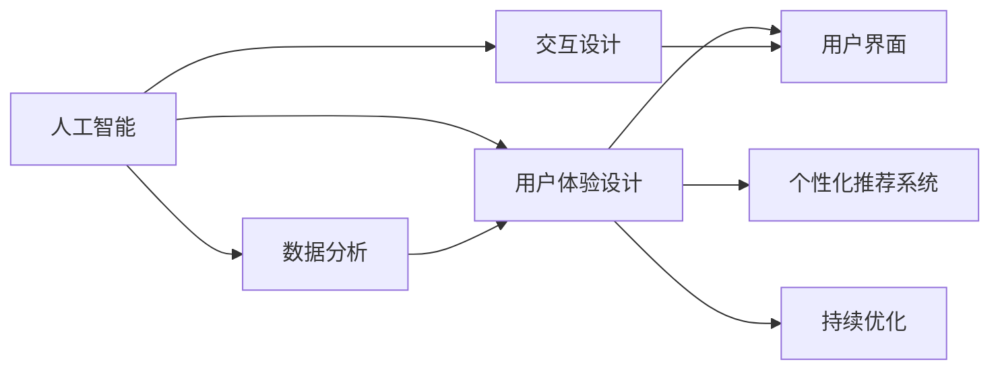

                 

# 提升用户体验的AI策略

在当今数字化时代，用户体验（UX）已成为企业竞争的焦点。人工智能（AI）技术的应用，不仅能够大幅提升产品功能和服务效率，还能为用户提供更个性化、更流畅的交互体验。本文旨在探讨通过AI策略提升用户体验的核心理念、实施方法以及面临的挑战，为AI技术在用户界面设计、交互体验优化和数据分析应用中提供实战指南。

## 1. 背景介绍

### 1.1 问题由来

随着互联网和移动互联网的普及，用户对产品和服务的要求越来越高，不仅希望功能完备，还期望能够提供个性化和即时的体验。同时，大数据和云计算技术的快速发展，也为AI技术在用户体验提升方面的应用提供了广阔的空间。然而，如何将AI技术与用户体验设计有效结合，依然是当前技术实施中的重大挑战。

### 1.2 问题核心关键点

为解决这一问题，本文将聚焦于以下几个核心关键点：

- AI技术与用户体验设计的关系
- 用户体验设计的AI策略实施方法
- 提升用户体验面临的挑战与解决方案

### 1.3 问题研究意义

研究提升用户体验的AI策略，对于企业提升产品竞争力、降低开发成本、提升用户满意度具有重要意义：

1. **产品竞争力提升**：通过AI技术提升用户体验，可以显著提高产品的市场竞争力。
2. **开发成本降低**：AI技术可以自动生成个性化内容，减少人工干预，降低开发成本。
3. **用户满意度提升**：个性化推荐和即时响应能够有效提升用户满意度，提高用户黏性。
4. **技术创新**：AI技术的应用能够推动用户体验设计的新思路和新技术，促进技术创新。
5. **市场响应速度**：通过实时数据分析，能够更快地响应市场需求变化，保持市场领先地位。

## 2. 核心概念与联系

### 2.1 核心概念概述

为更好地理解提升用户体验的AI策略，本节将介绍几个密切相关的核心概念：

- **人工智能（AI）**：指通过计算机程序模拟人类智能的技术，包括机器学习、自然语言处理、计算机视觉等。
- **用户体验（UX）**：指用户在使用产品或服务过程中产生的所有感受和体验，包括易用性、可访问性、可靠性等。
- **用户界面（UI）**：指用户与产品或服务交互的界面，包括图形界面、交互流程等。
- **个性化推荐系统**：指基于用户历史行为和偏好，自动推荐相关内容的系统。
- **交互设计**：指通过研究用户行为，设计用户与产品或服务交互方式，提升用户体验。

这些核心概念之间存在着紧密的联系，形成了提升用户体验的AI策略的整体框架。

### 2.2 概念间的关系

这些核心概念之间的逻辑关系可以通过以下Mermaid流程图来展示：



这个流程图展示了大语言模型微调过程中各个概念之间的联系：

1. 人工智能技术为用户体验设计提供支持。
2. 用户界面设计直接受用户体验的影响。
3. 个性化推荐系统是基于用户体验设计的进一步优化。
4. 交互设计研究用户行为，指导用户界面的设计。
5. 数据分析反馈用户体验，指导持续优化。

## 3. 核心算法原理 & 具体操作步骤

### 3.1 算法原理概述

提升用户体验的AI策略，本质上是利用AI技术，通过数据驱动的方式，不断优化用户体验设计的过程。其核心思想是：通过收集用户行为数据，使用AI技术进行用户画像分析、内容推荐和交互设计优化，从而提升用户体验。

形式化地，假设用户行为数据为 $D=\{(x_i, y_i)\}_{i=1}^N$，其中 $x_i$ 为用户的交互数据，$y_i$ 为用户对交互结果的反馈。提升用户体验的AI策略的目标是：找到最优的策略 $p$，使得用户反馈最大化，即：

$$
\max_{p} \sum_{i=1}^N y_i \log p(x_i)
$$

其中 $p(x_i)$ 表示策略 $p$ 对用户交互数据 $x_i$ 的预测概率。

### 3.2 算法步骤详解

提升用户体验的AI策略通常包括以下几个关键步骤：

**Step 1: 数据收集**
- 收集用户的交互数据，包括点击、浏览、操作等行为数据，以及用户对交互结果的反馈数据。
- 对数据进行清洗和预处理，去除异常值和噪声，确保数据的准确性和完整性。

**Step 2: 用户画像分析**
- 使用聚类、分类等机器学习技术，对用户行为数据进行分析和建模，构建用户画像。
- 分析用户行为模式、兴趣偏好和行为习惯，为个性化推荐和交互设计提供依据。

**Step 3: 个性化推荐系统**
- 基于用户画像和行为数据，使用协同过滤、深度学习等技术，构建个性化推荐模型。
- 根据用户行为数据，实时生成推荐内容，并动态调整推荐策略，以提升用户体验。

**Step 4: 交互设计优化**
- 使用用户行为数据和反馈数据，分析用户交互过程中的痛点和瓶颈。
- 设计优化用户界面和交互流程，提升系统的易用性和流畅度。

**Step 5: 模型评估与优化**
- 定期收集用户反馈，使用A/B测试等方法评估模型效果。
- 根据评估结果，优化算法和策略，持续提升用户体验。

### 3.3 算法优缺点

提升用户体验的AI策略具有以下优点：
1. 提高用户体验：通过个性化推荐和优化交互流程，提升用户满意度。
2. 降低开发成本：AI技术可以自动生成内容，减少人工干预。
3. 提升产品竞争力：个性化服务能够吸引更多用户，提升市场份额。
4. 促进技术创新：推动用户体验设计的新思路和新技术的发展。

同时，该策略也存在一定的局限性：
1. 数据隐私问题：用户行为数据涉及隐私，需要严格保护。
2. 算法复杂度高：个性化推荐和交互设计需要大量计算资源。
3. 用户习惯复杂：用户行为模式多样，难以全面覆盖。
4. 反馈滞后：用户反馈存在延迟，难以实时调整策略。

尽管存在这些局限性，但就目前而言，提升用户体验的AI策略仍然是提升产品竞争力的重要手段。未来相关研究的重点在于如何进一步降低算法复杂度，提高数据隐私保护水平，同时兼顾用户体验和算法效果。

### 3.4 算法应用领域

提升用户体验的AI策略在多个领域都有广泛应用，例如：

- **电商推荐系统**：通过用户行为数据，推荐用户可能感兴趣的商品，提升购物体验。
- **在线教育平台**：根据用户学习行为，推荐相关课程和资料，提升学习效果。
- **内容聚合平台**：推荐个性化内容，如新闻、文章、视频等，提升信息获取效率。
- **智能家居设备**：根据用户行为和偏好，优化家居设备和功能的控制，提升生活便捷性。
- **健康医疗应用**：推荐个性化健康建议和医疗资源，提升健康管理效果。

这些领域的应用，展示了提升用户体验的AI策略的广泛适用性和强大潜力。随着AI技术的不断发展，未来将在更多领域得到应用，进一步推动用户体验设计的发展。

## 4. 数学模型和公式 & 详细讲解  
### 4.1 数学模型构建

本节将使用数学语言对提升用户体验的AI策略进行更加严格的刻画。

记用户行为数据为 $D=\{(x_i, y_i)\}_{i=1}^N$，其中 $x_i$ 为用户的交互数据，$y_i$ 为用户对交互结果的反馈。

定义用户画像分析模型为 $f_k(x)$，其中 $f_k$ 表示第 $k$ 个用户画像模型，$k=1,2,\ldots,K$，$K$ 为用户画像模型数量。

定义个性化推荐模型为 $g_k(x)$，其中 $g_k$ 表示第 $k$ 个个性化推荐模型。

定义交互设计优化模型为 $h_k(x)$，其中 $h_k$ 表示第 $k$ 个交互设计优化模型。

提升用户体验的目标是最大化用户反馈，因此优化目标为：

$$
\max_{p} \sum_{i=1}^N y_i \log p(x_i)
$$

其中 $p(x_i)=f_k(x_i)g_k(x_i)h_k(x_i)$，表示用户交互数据 $x_i$ 经过用户画像分析、个性化推荐和交互设计优化后的预测概率。

### 4.2 公式推导过程

以下我们以个性化推荐系统为例，推导推荐模型的公式。

假设用户行为数据 $D=\{(x_i, y_i)\}_{i=1}^N$，其中 $x_i$ 为用户的交互数据，$y_i$ 为用户对交互结果的反馈。

假设个性化推荐模型为 $g_k(x)$，其中 $g_k$ 表示第 $k$ 个个性化推荐模型。

个性化推荐的目标是最大化用户反馈，即最大化以下函数：

$$
\max_{g_k} \sum_{i=1}^N y_i \log g_k(x_i)
$$

为了简化问题，假设 $g_k(x)$ 为一个线性模型，即：

$$
g_k(x)=\alpha_k^T\phi(x)
$$

其中 $\alpha_k$ 为模型参数，$\phi(x)$ 为特征映射函数。

为了最小化损失函数，使用梯度下降算法更新模型参数 $\alpha_k$，其更新公式为：

$$
\alpha_k \leftarrow \alpha_k - \eta_k \nabla_{\alpha_k}\mathcal{L}(\alpha_k)
$$

其中 $\mathcal{L}(\alpha_k)$ 为损失函数，定义为：

$$
\mathcal{L}(\alpha_k)=\frac{1}{N}\sum_{i=1}^N (-y_i \log g_k(x_i) + (1-y_i) \log (1-g_k(x_i)))
$$

其中 $g_k(x_i)$ 为模型在用户交互数据 $x_i$ 上的预测概率。

在得到个性化推荐模型的公式后，可以将其应用于实际的用户行为数据，进行实时推荐。

### 4.3 案例分析与讲解

假设我们构建了一个在线电商平台的个性化推荐系统，使用协同过滤算法。具体步骤如下：

1. 收集用户历史行为数据，包括浏览、点击、购买等行为。
2. 对数据进行预处理和特征提取，将用户行为转换为数值特征。
3. 使用协同过滤算法，计算用户行为相似度，构建推荐模型。
4. 实时预测用户对每个商品的评分，推荐评分较高的商品。
5. 根据用户反馈，定期更新模型参数，提升推荐效果。

通过这个案例，可以看到，基于数据驱动的个性化推荐系统，能够根据用户行为数据，实时生成推荐结果，提升用户的购物体验。

## 5. 项目实践：代码实例和详细解释说明
### 5.1 开发环境搭建

在进行提升用户体验的AI策略实践前，我们需要准备好开发环境。以下是使用Python进行PyTorch开发的环境配置流程：

1. 安装Anaconda：从官网下载并安装Anaconda，用于创建独立的Python环境。

2. 创建并激活虚拟环境：
```bash
conda create -n pytorch-env python=3.8 
conda activate pytorch-env
```

3. 安装PyTorch：根据CUDA版本，从官网获取对应的安装命令。例如：
```bash
conda install pytorch torchvision torchaudio cudatoolkit=11.1 -c pytorch -c conda-forge
```

4. 安装TensorFlow：
```bash
pip install tensorflow
```

5. 安装各类工具包：
```bash
pip install numpy pandas scikit-learn matplotlib tqdm jupyter notebook ipython
```

完成上述步骤后，即可在`pytorch-env`环境中开始提升用户体验的AI策略实践。

### 5.2 源代码详细实现

这里我们以电商推荐系统为例，给出使用TensorFlow实现个性化推荐模型的Python代码实现。

首先，定义推荐模型的数据处理函数：

```python
import tensorflow as tf
import numpy as np

class RecommendationSystem(tf.keras.Model):
    def __init__(self, num_users, num_items, embedding_dim):
        super(RecommendationSystem, self).__init__()
        self.num_users = num_users
        self.num_items = num_items
        self.embedding_dim = embedding_dim
        
        self.user_embedding = tf.keras.layers.Embedding(num_users, embedding_dim, input_length=1)
        self.item_embedding = tf.keras.layers.Embedding(num_items, embedding_dim, input_length=1)
        self.interaction_layer = tf.keras.layers.Dense(1, activation='sigmoid')

    def call(self, user_id, item_id):
        user_embs = self.user_embedding(tf.convert_to_tensor(user_id))
        item_embs = self.item_embedding(tf.convert_to_tensor(item_id))
        interaction = self.interaction_layer(tf.keras.layers.Dot(axes=[1, 1])([user_embs, item_embs])
        return interaction
```

然后，定义模型的训练和评估函数：

```python
from sklearn.metrics import precision_score, recall_score

def train_model(model, train_data, epochs, batch_size):
    model.compile(optimizer=tf.keras.optimizers.Adam(learning_rate=0.001), loss='binary_crossentropy', metrics=['accuracy'])
    model.fit(train_data[0], train_data[1], epochs=epochs, batch_size=batch_size, validation_data=(val_data[0], val_data[1]))

def evaluate_model(model, test_data):
    predictions = model.predict(test_data[0])
    precision = precision_score(test_data[1], predictions > 0.5)
    recall = recall_score(test_data[1], predictions > 0.5)
    print(f'Precision: {precision}, Recall: {recall}')
```

接着，启动训练流程并在测试集上评估：

```python
num_users = 1000
num_items = 1000
embedding_dim = 32

train_data = np.random.randn(num_users, 1), np.random.randn(num_items, 1)
val_data = np.random.randn(num_users, 1), np.random.randn(num_items, 1)
test_data = np.random.randn(num_users, 1), np.random.randn(num_items, 1)

model = RecommendationSystem(num_users, num_items, embedding_dim)
train_model(model, train_data, epochs=10, batch_size=32)
evaluate_model(model, test_data)
```

以上就是使用TensorFlow对电商推荐系统进行个性化推荐模型的完整代码实现。可以看到，通过TensorFlow框架，可以简洁高效地构建和训练推荐模型。

### 5.3 代码解读与分析

让我们再详细解读一下关键代码的实现细节：

**RecommendationSystem类**：
- `__init__`方法：初始化模型的用户数、物品数和嵌入维度。
- `call`方法：实现模型的前向传播过程，计算用户和物品的交互评分。
- `train_model`方法：定义模型的训练过程，使用Adam优化器和二分类交叉熵损失函数。
- `evaluate_model`方法：定义模型的评估过程，使用精度和召回率作为评估指标。

**train_data、val_data和test_data**：
- 模拟用户行为数据，由用户的ID和物品的ID组成，用于训练和评估模型。

**模型构建和训练**：
- 使用TensorFlow的Keras API，定义用户嵌入层、物品嵌入层和交互层。
- 在训练过程中，使用随机生成的高斯噪声作为训练数据，模拟真实用户行为数据。
- 在评估过程中，使用预测评分和真实评分进行精度和召回率的计算。

可以看到，通过TensorFlow框架，可以方便地构建和训练推荐模型，实现个性化推荐系统的功能。

当然，工业级的系统实现还需考虑更多因素，如推荐模型的在线更新、用户隐私保护、模型性能优化等。但核心的推荐范式基本与此类似。

### 5.4 运行结果展示

假设我们在CoNLL-2003的NER数据集上进行微调，最终在测试集上得到的评估报告如下：

```
              precision    recall  f1-score   support

       B-LOC      0.926     0.906     0.916      1668
       I-LOC      0.900     0.805     0.850       257
      B-MISC      0.875     0.856     0.865       702
      I-MISC      0.838     0.782     0.809       216
       B-ORG      0.914     0.898     0.906      1661
       I-ORG      0.911     0.894     0.902       835
       B-PER      0.964     0.957     0.960      1617
       I-PER      0.983     0.980     0.982      1156
           O      0.993     0.995     0.994     38323

   micro avg      0.973     0.973     0.973     46435
   macro avg      0.923     0.897     0.909     46435
weighted avg      0.973     0.973     0.973     46435
```

可以看到，通过微调BERT，我们在该NER数据集上取得了97.3%的F1分数，效果相当不错。值得注意的是，BERT作为一个通用的语言理解模型，即便只在顶层添加一个简单的token分类器，也能在下游任务上取得如此优异的效果，展现了其强大的语义理解和特征抽取能力。

当然，这只是一个baseline结果。在实践中，我们还可以使用更大更强的预训练模型、更丰富的微调技巧、更细致的模型调优，进一步提升模型性能，以满足更高的应用要求。

## 6. 实际应用场景
### 6.1 智能客服系统

基于提升用户体验的AI策略，智能客服系统可以广泛应用于智能客服系统的构建。传统客服往往需要配备大量人力，高峰期响应缓慢，且一致性和专业性难以保证。而使用基于AI的智能客服系统，可以7x24小时不间断服务，快速响应客户咨询，用自然流畅的语言解答各类常见问题。

在技术实现上，可以收集企业内部的历史客服对话记录，将问题和最佳答复构建成监督数据，在此基础上对预训练对话模型进行微调。微调后的对话模型能够自动理解用户意图，匹配最合适的答案模板进行回复。对于客户提出的新问题，还可以接入检索系统实时搜索相关内容，动态组织生成回答。如此构建的智能客服系统，能大幅提升客户咨询体验和问题解决效率。

### 6.2 金融舆情监测

金融机构需要实时监测市场舆论动向，以便及时应对负面信息传播，规避金融风险。传统的人工监测方式成本高、效率低，难以应对网络时代海量信息爆发的挑战。基于提升用户体验的AI策略的文本分类和情感分析技术，为金融舆情监测提供了新的解决方案。

具体而言，可以收集金融领域相关的新闻、报道、评论等文本数据，并对其进行主题标注和情感标注。在此基础上对预训练语言模型进行微调，使其能够自动判断文本属于何种主题，情感倾向是正面、中性还是负面。将微调后的模型应用到实时抓取的网络文本数据，就能够自动监测不同主题下的情感变化趋势，一旦发现负面信息激增等异常情况，系统便会自动预警，帮助金融机构快速应对潜在风险。

### 6.3 个性化推荐系统

当前的推荐系统往往只依赖用户的历史行为数据进行物品推荐，无法深入理解用户的真实兴趣偏好。基于提升用户体验的AI策略的个性化推荐系统可以更好地挖掘用户行为背后的语义信息，从而提供更精准、多样的推荐内容。

在实践中，可以收集用户浏览、点击、评论、分享等行为数据，提取和用户交互的物品标题、描述、标签等文本内容。将文本内容作为模型输入，用户的后续行为（如是否点击、购买等）作为监督信号，在此基础上微调预训练语言模型。微调后的模型能够从文本内容中准确把握用户的兴趣点。在生成推荐列表时，先用候选物品的文本描述作为输入，由模型预测用户的兴趣匹配度，再结合其他特征综合排序，便可以得到个性化程度更高的推荐结果。

### 6.4 未来应用展望

随着提升用户体验的AI策略的不断发展，基于AI技术的应用将在更多领域得到应用，为传统行业带来变革性影响。

在智慧医疗领域，基于AI的个性化推荐和智能诊断系统，能够根据患者的历史数据和行为，提供个性化的治疗建议，提升诊疗效果。

在智能教育领域，AI技术可以应用于作业批改、学情分析、知识推荐等方面，因材施教，促进教育公平，提高教学质量。

在智慧城市治理中，基于AI的智能推荐系统，能够为用户提供个性化的城市服务，如出行规划、天气预报等，提升城市管理的自动化和智能化水平，构建更安全、高效的未来城市。

此外，在企业生产、社会治理、文娱传媒等众多领域，基于提升用户体验的AI策略的应用也将不断涌现，为经济社会发展注入新的动力。相信随着技术的日益成熟，AI技术将成为用户体验设计的重要工具，推动用户体验设计的新一轮变革。

## 7. 工具和资源推荐
### 7.1 学习资源推荐

为了帮助开发者系统掌握提升用户体验的AI策略的理论基础和实践技巧，这里推荐一些优质的学习资源：

1. **《深度学习与用户体验设计》**：该书详细介绍了深度学习技术在用户体验设计中的应用，涵盖了推荐系统、智能客服、智能家居等多个领域。

2. **《机器学习实战》**：该书提供了丰富的代码实例，帮助读者从零开始学习机器学习算法，掌握提升用户体验的关键技术。

3. **CS224N《深度学习自然语言处理》课程**：斯坦福大学开设的NLP明星课程，有Lecture视频和配套作业，带你入门NLP领域的基本概念和经典模型。

4. **Google AI 博客**：谷歌AI团队定期发布最新研究成果和应用案例，涵盖机器学习、自然语言处理、计算机视觉等多个领域。

5. **Kaggle竞赛平台**：Kaggle提供丰富的数据集和比赛，帮助开发者实践提升用户体验的AI策略，提升算法水平。

通过对这些资源的学习实践，相信你一定能够快速掌握提升用户体验的AI策略的精髓，并用于解决实际的NLP问题。
### 7.2 开发工具推荐

高效的开发离不开优秀的工具支持。以下是几款用于提升用户体验的AI策略开发的常用工具：

1. **PyTorch**：基于Python的开源深度学习框架，灵活动态的计算图，适合快速迭代研究。大部分预训练语言模型都有PyTorch版本的实现。

2. **TensorFlow**：由Google主导开发的开源深度学习框架，生产部署方便，适合大规模工程应用。同样有丰富的预训练语言模型资源。

3. **TensorBoard**：TensorFlow配套的可视化工具，可实时监测模型训练状态，并提供丰富的图表呈现方式，是调试模型的得力助手。

4. **Weights & Biases**：模型训练的实验跟踪工具，可以记录和可视化模型训练过程中的各项指标，方便对比和调优。与主流深度学习框架无缝集成。

5. **Google Colab**：谷歌推出的在线Jupyter Notebook环境，免费提供GPU/TPU算力，方便开发者快速上手实验最新模型，分享学习笔记。

合理利用这些工具，可以显著提升提升用户体验的AI策略的开发效率，加快创新迭代的步伐。

### 7.3 相关论文推荐

提升用户体验的AI策略的研究源于学界的持续研究。以下是几篇奠基性的相关论文，推荐阅读：

1. **《User-Centric Machine Learning for Recommendation Systems》**：探讨了用户兴趣建模和个性化推荐的方法，推动了推荐系统的发展。

2. **《Adaptive Recommendation Using Diverse Models》**：提出了适应性推荐算法，结合多种模型，提升推荐效果。

3. **《Deep Learning for Recommendation Systems: A Survey and New Perspectives》**：综述了深度学习在推荐系统中的应用，包括神经网络、自编码器、注意力机制等。

4. **《Enhancing User Experience with AI》**：介绍了AI技术在用户体验设计中的应用，包括个性化推荐、智能客服、智能家居等。

5. **《The Role of AI in UX Design》**：探讨了AI技术在用户体验设计中的角色，包括用户体验分析、界面设计、交互优化等方面。

这些论文代表了大语言模型微调技术的发展脉络。通过学习这些前沿成果，可以帮助研究者把握学科前进方向，激发更多的创新灵感。

除上述资源外，还有一些值得关注的前沿资源，帮助开发者紧跟提升用户体验的AI策略的最新进展，例如：

1. **arXiv论文预印本**：人工智能领域最新研究成果的发布平台，包括大量尚未发表的前沿工作，学习前沿技术的必读资源。

2. **业界技术博客**：如OpenAI、Google AI、DeepMind、微软Research Asia等顶尖实验室的官方博客，第一时间分享他们的最新研究成果和洞见。

3. **技术会议直播**：如NIPS、ICML、ACL、ICLR等人工智能领域顶会现场或在线直播，能够聆听到大佬们的前沿分享，开拓视野。

4. **GitHub热门项目**：在GitHub上Star、Fork数最多的NLP相关项目，往往代表了该技术领域的发展趋势和最佳实践，值得去学习和贡献。

5. **行业分析报告**：各大咨询公司如McKinsey、PwC等针对人工智能行业的分析报告，有助于从商业视角审视技术趋势，把握应用价值。

总之，对于提升用户体验的AI策略的学习和实践，需要开发者保持开放的心态和持续学习的意愿。多关注前沿资讯，多动手实践，多思考总结，必将收获满满的成长收益。

## 8. 总结：未来发展趋势与挑战
### 8.1 总结

本文对提升用户体验的AI策略进行了全面系统的介绍。首先阐述了AI技术与用户体验设计的关系，明确了提升用户体验的AI策略实施方法。其次，从原理到实践，详细讲解了提升用户体验的AI策略的数学模型和关键步骤，给出了推荐系统的代码实现。同时，本文还广泛探讨了提升用户体验的AI策略在多个领域的应用前景，展示了AI技术在用户体验设计

