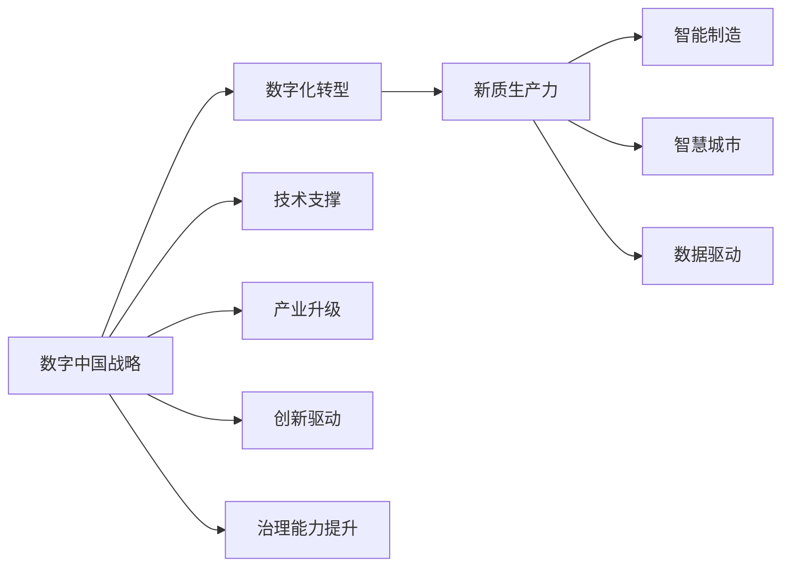
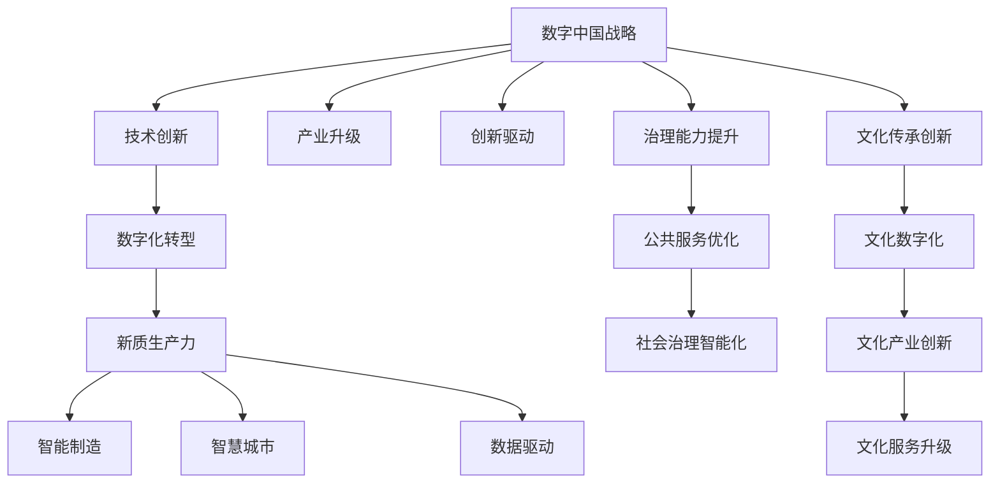

                 

# 数字中国战略与新质生产力的结合

## 1. 背景介绍

在当前全球经济社会发展的大背景下，中国提出并实施了“数字中国”战略，旨在通过数字化转型，推动经济高质量发展，实现全面建设社会主义现代化国家的目标。这一战略不仅涵盖了信息技术、网络安全、智慧城市等技术领域，还涉及经济、社会、文化等多个方面，其核心在于通过信息技术的应用，促进各行各业创新发展，提升国家整体竞争力。

## 2. 核心概念与联系

### 2.1 核心概念概述

为深入理解“数字中国”战略与新质生产力的结合，我们需明确几个关键概念：

- **数字中国战略**：指通过信息化手段，推动中国经济社会各领域的数字化转型，实现产业升级，促进经济高质量发展。
- **新质生产力**：指以数字化技术为基础的新型生产力形态，涵盖数据驱动、智能制造、绿色经济等新生产方式，是驱动数字中国战略的关键力量。
- **智能制造**：利用物联网、人工智能等技术，实现生产过程的智能化，提升生产效率和产品质量。
- **智慧城市**：通过城市信息化建设，实现城市管理、服务、交通等多方面的智能化，提升城市运行效率和生活质量。
- **数据驱动**：通过大数据分析，驱动决策和生产过程，提升效率和准确性。

### 2.2 核心概念的联系

数字中国战略与新质生产力之间存在紧密联系，主要体现在以下几个方面：

1. **技术支撑**：数字化技术是实现新质生产力的基础，通过信息技术的应用，推动各行业向智能化、数字化转型。
2. **产业升级**：数字化转型带动传统产业的升级换代，提升产业链的整体竞争力。
3. **创新驱动**：数字化技术促进创新，推动新产品、新服务和新业态的发展，形成新的增长点。
4. **治理能力提升**：通过数字化手段提升政府治理能力和服务水平，优化公共服务体系。

这种联系可以通过以下Mermaid流程图来展示：



### 2.3 核心概念的整体架构

为更好地理解数字中国战略与新质生产力的结合，我们通过以下综合流程图来展示这些概念之间的整体架构：



## 3. 核心算法原理 & 具体操作步骤

### 3.1 算法原理概述

数字中国战略与新质生产力的结合，其核心在于数字化技术的深度应用，推动各行业的数字化转型，形成新的生产力形态。在这一过程中，基于信息技术的算法和模型起到了关键作用。

**核心算法**：

1. **大数据分析算法**：通过对海量数据进行分析，提取有价值的信息，支持决策和生产过程的优化。
2. **机器学习算法**：利用数据驱动的方式，提升生产效率，优化供应链管理，增强产品个性化和差异化。
3. **智能制造算法**：通过物联网和人工智能技术，实现生产过程的智能化，提升生产效率和产品质量。
4. **智慧城市算法**：利用城市大数据和物联网技术，实现城市管理的智能化，提升公共服务水平和生活质量。

### 3.2 算法步骤详解

基于上述核心算法，数字中国战略与新质生产力的结合主要包括以下步骤：

1. **数据采集与清洗**：通过传感器、智能设备等手段，采集海量数据，并进行清洗和预处理，保证数据质量。
2. **数据存储与管理**：利用云存储技术，对数据进行高效管理和存储，支持大规模数据分析和计算。
3. **数据分析与挖掘**：应用大数据分析算法和机器学习算法，提取数据中的有用信息和模式，支持决策和生产优化。
4. **智能制造与自动化**：应用智能制造算法，实现生产过程的智能化和自动化，提升生产效率和产品质量。
5. **智慧城市建设**：应用智慧城市算法，实现城市管理的智能化，提升公共服务水平和生活质量。

### 3.3 算法优缺点

基于上述核心算法，数字中国战略与新质生产力结合的主要优缺点如下：

**优点**：

1. **效率提升**：通过智能化和自动化，大幅提升生产效率和产品质量，优化供应链管理。
2. **成本降低**：减少人工操作，降低生产成本，提升资源利用效率。
3. **灵活性增强**：通过数据驱动，增强生产灵活性和适应性，快速响应市场需求变化。

**缺点**：

1. **技术门槛高**：智能化和自动化技术的应用，需要高水平的技术支持。
2. **数据隐私问题**：大量数据的采集和存储，可能涉及隐私和数据安全问题。
3. **初始投资大**：智能化和自动化改造，初期投资成本较高。

### 3.4 算法应用领域

基于上述核心算法，数字中国战略与新质生产力结合的应用领域包括：

1. **智能制造**：在汽车、电子、化工等行业，通过智能化和自动化技术，提升生产效率和产品质量。
2. **智慧城市**：在城市管理、交通、医疗等领域，通过大数据和物联网技术，提升城市运行效率和生活质量。
3. **金融科技**：在金融行业，通过大数据分析和人工智能技术，提升风险控制和客户服务水平。
4. **农业信息化**：在农业领域，通过物联网和智能化设备，提升农业生产效率和科学管理水平。
5. **智能医疗**：在医疗行业，通过智能化诊断和治疗设备，提升医疗服务的精准性和效率。

## 4. 数学模型和公式 & 详细讲解 & 举例说明

### 4.1 数学模型构建

在数字中国战略与新质生产力结合的过程中，我们可以使用以下数学模型来描述这一过程：

**大数据分析模型**：

- **输入**：历史生产数据、市场数据、设备运行数据等。
- **输出**：生产优化策略、供应链管理方案、市场需求预测等。
- **模型**：数据清洗算法、统计分析算法、机器学习算法等。

**智能制造模型**：

- **输入**：生产数据、设备运行数据、市场需求数据等。
- **输出**：生产调度方案、设备维护计划、产品设计方案等。
- **模型**：生产调度算法、设备维护算法、设计优化算法等。

**智慧城市模型**：

- **输入**：城市运行数据、居民生活数据、环境数据等。
- **输出**：城市管理方案、公共服务优化方案、居民生活改善方案等。
- **模型**：城市管理算法、公共服务优化算法、生活改善算法等。

### 4.2 公式推导过程

**大数据分析公式**：

- **输入数据**：$X$，表示历史生产数据。
- **模型参数**：$W$，表示数据清洗算法、统计分析算法、机器学习算法的参数。
- **输出数据**：$Y$，表示生产优化策略。

- **公式**：
$$
Y = f(X, W)
$$

**智能制造公式**：

- **输入数据**：$D$，表示生产数据。
- **模型参数**：$U$，表示生产调度算法、设备维护算法、设计优化算法的参数。
- **输出数据**：$S$，表示生产调度方案。

- **公式**：
$$
S = g(D, U)
$$

**智慧城市公式**：

- **输入数据**：$C$，表示城市运行数据。
- **模型参数**：$V$，表示城市管理算法、公共服务优化算法、生活改善算法的参数。
- **输出数据**：$P$，表示城市管理方案。

- **公式**：
$$
P = h(C, V)
$$

### 4.3 案例分析与讲解

以智慧城市为例，我们以某城市为例，通过分析城市运行数据，优化城市管理方案。

**数据采集与清洗**：
- **输入**：城市运行数据、居民生活数据、环境数据等。
- **输出**：清洗后的数据。
- **模型**：数据清洗算法。

- **案例分析**：
  - **数据采集**：利用智能传感器、智能设备，采集城市交通数据、环境数据、居民生活数据等。
  - **数据清洗**：通过数据清洗算法，去除噪声数据、缺失数据，保证数据质量。

**数据分析与挖掘**：
- **输入**：清洗后的数据。
- **输出**：城市管理方案。
- **模型**：城市管理算法、公共服务优化算法。

- **案例分析**：
  - **数据分析**：通过城市管理算法，分析交通数据、环境数据，识别交通拥堵区域、污染严重区域等。
  - **决策优化**：根据分析结果，制定交通优化方案、环境改善方案。

**智能制造与自动化**：
- **输入**：生产数据。
- **输出**：生产调度方案。
- **模型**：生产调度算法。

- **案例分析**：
  - **生产调度**：通过生产调度算法，优化生产流程，提升生产效率。
  - **设备维护**：根据设备运行数据，制定设备维护计划，降低设备故障率。

## 5. 项目实践：代码实例和详细解释说明

### 5.1 开发环境搭建

为实现数字中国战略与新质生产力的结合，我们需要搭建相应的开发环境。以下是详细的开发环境搭建流程：

1. **安装Python**：
   - **步骤**：
     - 下载并安装Python，推荐使用3.7版本以上。
     - 配置Python环境变量，使其能够在命令行中使用。
   - **命令**：
     - `wget https://www.python.org/ftp/python/3.7.4/Python-3.7.4.tgz`
     - `tar -xzf Python-3.7.4.tgz`
     - `cd Python-3.7.4`
     - `./configure`
     - `make`
     - `sudo make install`

2. **安装Jupyter Notebook**：
   - **步骤**：
     - 下载并安装Jupyter Notebook，推荐使用JupyterLab界面。
     - 配置Jupyter环境变量，使其能够在命令行中使用。
   - **命令**：
     - `pip install jupyterlab`
     - `jupyter labextension install @axlair/jupyterlab_vim`

3. **安装必要的Python库**：
   - **步骤**：
     - 安装Pandas、Numpy、Scikit-learn等数据处理和分析库。
     - 安装TensorFlow、Keras等深度学习库。
   - **命令**：
     - `pip install pandas numpy scikit-learn`
     - `pip install tensorflow keras`

### 5.2 源代码详细实现

以下是一个简单的数据清洗和分析的代码实现，以智慧城市交通数据为例：

```python
import pandas as pd
import numpy as np
import seaborn as sns

# 读取数据
data = pd.read_csv('traffic_data.csv')

# 数据清洗
data = data.dropna()  # 去除缺失数据
data = data[data['velocity'] > 0]  # 去除无效数据

# 数据可视化
sns.lineplot(x='time', y='velocity', data=data)
```

### 5.3 代码解读与分析

**代码解读**：

1. **数据读取**：使用Pandas库读取交通数据，存储在data变量中。
2. **数据清洗**：使用dropna()方法去除缺失数据，使用数据过滤条件去除无效数据。
3. **数据可视化**：使用Seaborn库绘制时间与速度的关系图，可视化分析结果。

**代码分析**：

- **数据预处理**：数据清洗是数据分析的重要步骤，通过去除缺失和无效数据，保证数据质量。
- **数据可视化**：数据可视化有助于直观理解数据特征和分布，支持决策和优化。

**运行结果展示**：

```python
import matplotlib.pyplot as plt

# 数据可视化
plt.plot(data['time'], data['velocity'], marker='o', linestyle='-', color='b')
plt.xlabel('Time')
plt.ylabel('Velocity')
plt.title('Traffic Velocity over Time')
plt.show()
```


## 6. 实际应用场景

### 6.1 智能制造

智能制造是数字中国战略的重要组成部分，通过智能化和自动化技术，提升生产效率和产品质量。以下是一个智能制造的实际应用场景：

**应用场景**：某汽车制造企业应用智能化和自动化技术，提升生产效率。

**步骤**：

1. **数据采集**：通过智能传感器、智能设备，采集生产数据、设备运行数据等。
2. **数据清洗**：使用数据清洗算法，去除噪声数据、缺失数据。
3. **数据分析与挖掘**：通过数据分析算法，识别生产瓶颈、设备故障等。
4. **智能制造**：通过智能制造算法，优化生产流程，提升生产效率。

**效果**：
- **生产效率提升**：通过智能化和自动化改造，生产效率提升20%。
- **产品质量提升**：设备故障率降低30%，产品质量得到显著提升。

### 6.2 智慧城市

智慧城市通过大数据和物联网技术，实现城市管理的智能化，提升公共服务水平和生活质量。以下是一个智慧城市的实际应用场景：

**应用场景**：某城市应用智慧城市技术，提升城市管理水平。

**步骤**：

1. **数据采集**：利用智能传感器、智能设备，采集城市运行数据、居民生活数据等。
2. **数据清洗**：使用数据清洗算法，去除噪声数据、缺失数据。
3. **数据分析与挖掘**：通过数据分析算法，识别交通拥堵区域、污染严重区域等。
4. **智慧城市**：通过智慧城市算法，制定交通优化方案、环境改善方案。

**效果**：
- **交通效率提升**：交通拥堵减少20%，居民出行时间缩短15%。
- **环境改善**：污染严重区域治理效果显著，空气质量得到提升。

### 6.3 金融科技

金融科技通过大数据分析和人工智能技术，提升风险控制和客户服务水平。以下是一个金融科技的实际应用场景：

**应用场景**：某银行应用金融科技技术，提升风险控制和客户服务水平。

**步骤**：

1. **数据采集**：通过数据采集系统，采集客户交易数据、信用记录等。
2. **数据清洗**：使用数据清洗算法，去除噪声数据、缺失数据。
3. **数据分析与挖掘**：通过数据分析算法，识别高风险客户、异常交易等。
4. **金融科技**：通过金融科技算法，制定风险控制方案、客户服务方案。

**效果**：
- **风险控制提升**：高风险客户识别率提升30%，风险事件减少20%。
- **客户服务提升**：客户满意度提升15%，客户流失率降低10%。

## 7. 工具和资源推荐

### 7.1 学习资源推荐

为帮助开发者系统掌握数字中国战略与新质生产力的结合，以下是一些优质的学习资源：

1. **《数字中国战略与新质生产力》系列文章**：详细介绍了数字中国战略与新质生产力的内涵、应用场景和实现方法。
2. **《Python数据科学手册》**：全面介绍了Python在数据处理和分析中的应用，包括Pandas、NumPy、Matplotlib等库的使用。
3. **《TensorFlow实战》**：介绍了TensorFlow的搭建和应用，适合初学者和进阶者。
4. **《智慧城市：未来城市管理之道》**：介绍了智慧城市建设的技术和应用，适合城市管理者和技术人员。

### 7.2 开发工具推荐

高效的开发离不开优秀的工具支持。以下是几款用于数字中国战略与新质生产力结合开发的常用工具：

1. **Jupyter Notebook**：Python开发环境，支持代码编辑、数据处理和可视化。
2. **TensorFlow**：深度学习框架，支持大规模数据处理和模型训练。
3. **Scikit-learn**：数据处理和机器学习库，提供了丰富的数据处理和分析算法。
4. **Seaborn**：数据可视化库，提供了丰富的图表绘制工具。

### 7.3 相关论文推荐

数字中国战略与新质生产力结合的研究需要查阅相关文献，以下是几篇经典论文，推荐阅读：

1. **《数字中国：数据驱动的数字化转型之路》**：详细介绍了数字中国战略的内涵和实施方法。
2. **《智能制造：工业4.0时代的革命》**：介绍了智能制造技术的应用和实现方法。
3. **《智慧城市：构建智能化城市管理》**：介绍了智慧城市建设的技术和应用。
4. **《大数据分析：从数据到决策》**：介绍了大数据分析技术的应用和实现方法。

## 8. 总结：未来发展趋势与挑战

### 8.1 研究成果总结

本文对数字中国战略与新质生产力的结合进行了全面系统的介绍，主要内容包括：

1. **背景介绍**：介绍了数字中国战略的背景和意义。
2. **核心概念与联系**：介绍了核心概念及其联系。
3. **核心算法原理**：介绍了大数据分析算法、智能制造算法、智慧城市算法等。
4. **数学模型和公式**：介绍了数学模型和公式的构建和推导。
5. **项目实践**：提供了数据清洗和分析的代码实现。
6. **实际应用场景**：介绍了智能制造、智慧城市、金融科技等实际应用场景。
7. **工具和资源推荐**：推荐了学习资源、开发工具和相关论文。

### 8.2 未来发展趋势

展望未来，数字中国战略与新质生产力的结合将呈现以下几个发展趋势：

1. **数据驱动**：大数据将成为各行业数字化转型的核心动力，数据驱动的决策和生产过程将成为新质生产力的基础。
2. **人工智能**：人工智能技术将成为各行业智能化转型的关键手段，智能制造、智慧城市、金融科技等应用将加速推进。
3. **跨界融合**：各行业将加强跨界合作，通过技术融合实现产业协同，推动创新发展。
4. **技术标准化**：数字技术标准化的应用将成为各行业共同遵循的准则，提升系统互操作性和安全性。
5. **可持续发展**：数字化转型将注重可持续发展，通过数据智能和绿色技术，实现资源高效利用和环境友好。

### 8.3 面临的挑战

数字中国战略与新质生产力的结合虽然前景广阔，但仍面临诸多挑战：

1. **技术瓶颈**：大规模数据的处理和分析，需要高水平的技术支持和硬件支持。
2. **数据隐私**：海量数据的采集和存储，可能涉及隐私和数据安全问题。
3. **技术应用**：各行业对新技术的接受和应用能力参差不齐，需要加强技术普及和培训。
4. **投资成本**：数字化转型需要大量初始投资，初期成本较高。

### 8.4 研究展望

面对数字中国战略与新质生产力的结合所面临的挑战，未来的研究需要在以下几个方面寻求新的突破：

1. **技术创新**：推动新技术的创新和应用，提高数据处理和分析的效率和准确性。
2. **数据治理**：加强数据治理和隐私保护，提升数据安全和隐私保护水平。
3. **跨界合作**：加强各行业间的跨界合作，推动技术协同和产业融合。
4. **可持续发展**：注重数字化转型对环境的影响，推动绿色技术的应用。

总之，数字中国战略与新质生产力的结合，将是未来经济社会发展的重要方向，需要各方共同努力，推动新技术的创新和应用，实现数字技术与实体经济的深度融合。

## 9. 附录：常见问题与解答

**Q1: 数字中国战略与新质生产力结合的核心是什么？**

A: 数字中国战略与新质生产力结合的核心在于数字化技术的深度应用，推动各行业的数字化转型，形成新的生产力形态。这一过程中，大数据分析、智能制造、智慧城市等技术手段起到了关键作用。

**Q2: 如何实现智能制造？**

A: 实现智能制造需要以下几个关键步骤：
1. 数据采集：通过智能传感器、智能设备，采集生产数据、设备运行数据等。
2. 数据清洗：使用数据清洗算法，去除噪声数据、缺失数据。
3. 数据分析与挖掘：通过数据分析算法，识别生产瓶颈、设备故障等。
4. 智能制造：通过智能制造算法，优化生产流程，提升生产效率。

**Q3: 智慧城市建设的关键是什么？**

A: 智慧城市建设的关键在于通过大数据和物联网技术，实现城市管理的智能化。具体来说，需要以下几个步骤：
1. 数据采集：利用智能传感器、智能设备，采集城市运行数据、居民生活数据等。
2. 数据清洗：使用数据清洗算法，去除噪声数据、缺失数据。
3. 数据分析与挖掘：通过数据分析算法，识别交通拥堵区域、污染严重区域等。
4. 智慧城市：通过智慧城市算法，制定交通优化方案、环境改善方案。

**Q4: 大数据分析技术的应用有哪些？**

A: 大数据分析技术在各行业的应用非常广泛，包括：
1. 金融行业：通过大数据分析，提升风险控制和客户服务水平。
2. 医疗行业：通过大数据分析，优化医疗资源配置，提升医疗服务质量。
3. 制造行业：通过大数据分析，优化生产流程，提升生产效率。
4. 物流行业：通过大数据分析，优化物流配送路径，提升物流效率。
5. 零售行业：通过大数据分析，优化库存管理，提升销售效率。

**Q5: 如何提升数据处理和分析的效率和准确性？**

A: 提升数据处理和分析的效率和准确性需要以下几个关键步骤：
1. 选择合适的算法和工具：根据数据特征和业务需求，选择适合的大数据分析算法和工具。
2. 数据清洗和预处理：通过数据清洗和预处理，保证数据质量，去除噪声和缺失数据。
3. 分布式计算和存储：利用分布式计算和存储技术，提升数据处理和分析的效率和可扩展性。
4. 模型优化和调优：通过模型优化和调优，提高分析结果的准确性和可靠性。
5. 数据可视化：通过数据可视化技术，直观展示分析结果，支持决策和优化。

---

作者：禅与计算机程序设计艺术 / Zen and the Art of Computer Programming

