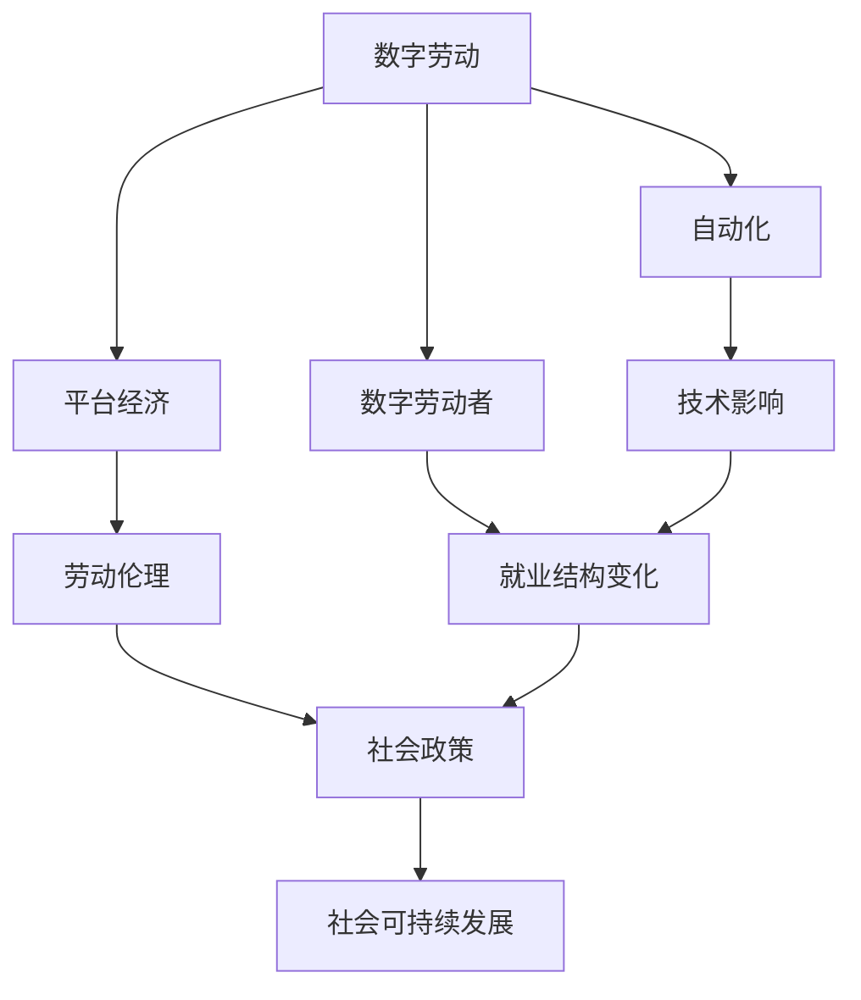

                 

# 数字劳动与未来工作：人类计算的社会影响

> 关键词：数字劳动,计算哲学,未来工作,自动化,社会伦理,技术进步

## 1. 背景介绍

### 1.1 问题由来
数字劳动（Digital Labor）是随着互联网和数字技术发展而兴起的一种新型劳动形式。它指的是在数字平台上进行的，以生产、分配和消费数字产品和数字服务为特征的劳动。数字劳动涵盖了广泛的领域，包括但不限于软件开发、内容创作、数据处理、网络广告、电子商务等。

### 1.2 问题核心关键点
数字劳动的核心问题在于其对劳动过程和劳动关系的重塑。传统的劳动关系是雇主和员工之间的直接雇佣关系，而数字劳动往往是通过平台进行的，平台既是劳动者工作的场所，也是支付劳动报酬的媒介。这使得数字劳动具有高度的灵活性和不确定性，同时也带来了许多新的社会问题。

### 1.3 问题研究意义
研究数字劳动对未来工作的社会影响，对于理解数字技术对人类社会的深刻变革、推动社会公正与可持续发展具有重要意义：

1. 揭示数字劳动的潜在风险：如数据隐私泄露、算法决策偏见、劳动环境恶化等。
2. 促进数字劳动者的权益保护：确保他们在数字劳动中的合法权益，如合理报酬、健康保障、职业发展等。
3. 指导未来工作的伦理规范：制定与数字劳动相适应的劳动法和社会政策。
4. 推动数字经济的健康发展：通过合理分配数字劳动的利益，促进社会的和谐与公平。

## 2. 核心概念与联系

### 2.1 核心概念概述

为更好地理解数字劳动与未来工作的社会影响，本节将介绍几个密切相关的核心概念：

- **数字劳动(Digital Labor)**：在数字平台上进行的生产、分配和消费数字产品和服务的劳动过程。它不仅包括传统的线上工作，如软件开发、内容创作，也扩展到了智能制造、数字服务等领域。
- **平台经济(Platform Economy)**：由数字平台组织和中介的商业模式，平台提供资源和服务，连接买家和卖家。平台经济的兴起改变了传统的劳动关系，推动了数字劳动的发展。
- **自动化与机器人化(Automation & Robotization)**：指通过算法和机器人等技术手段，替代人类进行重复性劳动和决策的过程。自动化和机器人化极大地改变了工作性质和劳动力的需求结构。
- **数字劳动者(Digital Workers)**：在数字平台上进行工作的人，包括自由职业者、远程工作者、众包工人等。他们的工作形式更加灵活，但也面临更大的不确定性和风险。
- **劳动伦理(Labor Ethics)**：在数字劳动背景下，需要重新审视和制定与传统劳动伦理相适应的新伦理规范，以保护劳动者的权益和福祉。
- **社会可持续发展(Sustainable Development)**：在数字化进程中，如何平衡经济增长、社会进步与环境保护，实现可持续的社会发展。

这些核心概念之间存在着紧密的联系，共同构成了数字劳动与未来工作的社会影响研究框架。

### 2.2 概念间的关系

这些核心概念之间的关系可以通过以下Mermaid流程图来展示：



这个流程图展示了大劳动与未来工作的核心概念及其之间的关系：

1. 数字劳动推动了平台经济的发展，改变了劳动关系的形态。
2. 自动化和机器人化替代了部分传统劳动，导致就业结构的显著变化。
3. 数字劳动者面临新的工作挑战，需要新的劳动伦理保护。
4. 技术进步和社会政策需要共同推动，以实现社会的可持续发展。

## 3. 核心算法原理 & 具体操作步骤
### 3.1 算法原理概述

数字劳动的核心算法原理在于数字化和网络化。数字劳动通过数字化技术将传统的劳动过程转化为在线活动，使得工作方式和劳动关系都发生了根本性变化。在数字劳动过程中，劳动者的技能和能力被算法化、数据化，通过平台和网络进行生产和交换。

### 3.2 算法步骤详解

数字劳动的算法步骤通常包括以下几个关键环节：

1. **数据采集**：通过各种传感器、API接口、用户行为数据等采集数字劳动过程中的各类数据。
2. **数据处理**：使用机器学习、自然语言处理等算法对采集到的数据进行清洗、分类、聚类等处理。
3. **算法应用**：将处理后的数据输入到算法模型中，进行特征提取、预测、决策等操作。
4. **结果输出**：通过算法模型输出劳动者的劳动成果，如内容创作、服务提供等。
5. **反馈循环**：通过平台的反馈机制，劳动者获得劳动报酬，同时平台根据数据反馈优化算法，提升服务质量。

### 3.3 算法优缺点

数字劳动算法具有以下优点：

- **高效性**：通过算法处理，能够大幅提升劳动效率，降低人工成本。
- **灵活性**：算法可以随时根据数据反馈进行优化和调整，适应变化的市场需求。
- **精确性**：算法能够进行精确的预测和决策，提高劳动成果的质量和效率。

然而，数字劳动算法也存在以下缺点：

- **依赖数据质量**：算法的输出结果高度依赖于输入数据的质量，数据偏差可能导致算法偏见。
- **透明性不足**：算法的决策过程复杂，难以解释和透明化。
- **隐私风险**：算法处理和存储大量个人数据，存在隐私泄露的风险。
- **依赖平台**：算法依赖于数字平台，平台的数据垄断可能限制劳动者的自由度和选择。

### 3.4 算法应用领域

数字劳动算法广泛应用于各个领域，包括但不限于：

- **内容创作**：如新闻、娱乐、教育等领域的数字内容生产。
- **电子商务**：在线销售、客户服务、物流配送等。
- **金融科技**：风险评估、信用评分、智能投顾等。
- **健康医疗**：在线诊断、远程咨询、智能康复等。
- **智能制造**：生产计划、质量控制、供应链管理等。
- **社交媒体**：用户行为分析、内容推荐、广告投放等。

数字劳动算法的应用推动了数字经济的蓬勃发展，但也带来了许多新的挑战和问题。

## 4. 数学模型和公式 & 详细讲解  
### 4.1 数学模型构建

数字劳动的数学模型构建通常包括以下几个关键步骤：

1. **定义变量**：定义输入变量 $x_i$ 和输出变量 $y_i$，其中 $x_i$ 表示数字劳动过程中的特征向量，$y_i$ 表示劳动结果。
2. **选择模型**：选择合适的算法模型，如线性回归、逻辑回归、决策树、神经网络等。
3. **训练模型**：使用训练集 $D$ 对模型进行训练，最小化损失函数 $\mathcal{L}$。
4. **验证模型**：在验证集 $D'$ 上评估模型性能，选择最优模型。
5. **测试模型**：在测试集 $D''$ 上测试模型泛化能力。

形式化地，假设数字劳动过程的特征向量 $x$ 和标签 $y$，模型 $M_{\theta}$ 的参数为 $\theta$，则目标是最小化损失函数：

$$
\theta^* = \mathop{\arg\min}_{\theta} \mathcal{L}(M_{\theta},D)
$$

在实践中，我们通常使用基于梯度的优化算法（如SGD、Adam等）来近似求解上述最优化问题。设 $\eta$ 为学习率，$\lambda$ 为正则化系数，则参数的更新公式为：

$$
\theta \leftarrow \theta - \eta \nabla_{\theta}\mathcal{L}(\theta) - \eta\lambda\theta
$$

其中 $\nabla_{\theta}\mathcal{L}(\theta)$ 为损失函数对参数 $\theta$ 的梯度，可通过反向传播算法高效计算。

### 4.2 公式推导过程

以下我们以线性回归模型为例，推导其训练过程和梯度更新公式。

假设模型 $M_{\theta}$ 为线性回归模型，其输出为 $y_i = \theta^T x_i + \epsilon_i$，其中 $\theta$ 为模型参数，$\epsilon_i$ 为随机误差。目标是最小化均方误差损失函数：

$$
\mathcal{L}(M_{\theta},D) = \frac{1}{N} \sum_{i=1}^N (y_i - \theta^T x_i)^2
$$

通过梯度下降算法更新参数 $\theta$，目标是最小化损失函数：

$$
\theta \leftarrow \theta - \eta \nabla_{\theta}\mathcal{L}(\theta)
$$

其中梯度为：

$$
\nabla_{\theta}\mathcal{L}(\theta) = \frac{2}{N} \sum_{i=1}^N (y_i - \theta^T x_i) x_i
$$

通过上述公式，我们可以使用梯度下降算法训练线性回归模型，从而完成数字劳动算法的构建和优化。

### 4.3 案例分析与讲解

以内容推荐系统为例，展示数字劳动算法的具体应用。假设内容推荐系统需要根据用户的浏览记录和评分数据，预测用户可能喜欢的内容。

假设特征向量 $x$ 包括用户历史浏览记录、评分数据、时间戳等，标签 $y$ 为推荐内容。通过线性回归模型 $M_{\theta}$ 进行训练，最小化均方误差损失函数：

$$
\mathcal{L}(M_{\theta},D) = \frac{1}{N} \sum_{i=1}^N (y_i - \theta^T x_i)^2
$$

使用梯度下降算法更新参数 $\theta$，目标是最小化损失函数：

$$
\theta \leftarrow \theta - \eta \nabla_{\theta}\mathcal{L}(\theta)
$$

其中梯度为：

$$
\nabla_{\theta}\mathcal{L}(\theta) = \frac{2}{N} \sum_{i=1}^N (y_i - \theta^T x_i) x_i
$$

通过上述公式，我们可以使用梯度下降算法训练线性回归模型，从而完成内容推荐系统的构建。

## 5. 项目实践：代码实例和详细解释说明
### 5.1 开发环境搭建

在进行数字劳动算法实践前，我们需要准备好开发环境。以下是使用Python进行Scikit-learn开发的环境配置流程：

1. 安装Anaconda：从官网下载并安装Anaconda，用于创建独立的Python环境。

2. 创建并激活虚拟环境：
```bash
conda create -n sklearn-env python=3.8 
conda activate sklearn-env
```

3. 安装Scikit-learn：
```bash
conda install scikit-learn
```

4. 安装各类工具包：
```bash
pip install numpy pandas scikit-learn matplotlib tqdm jupyter notebook ipython
```

完成上述步骤后，即可在`sklearn-env`环境中开始数字劳动算法的实践。

### 5.2 源代码详细实现

这里我们以线性回归模型为例，给出使用Scikit-learn库对数字劳动算法进行开发的PyTorch代码实现。

```python
from sklearn.linear_model import LinearRegression
import numpy as np

# 生成模拟数据
X = np.random.randn(100, 5)
y = np.dot(X, np.array([1, 2, 3, 4, 5])) + np.random.randn(100)

# 定义模型
model = LinearRegression()

# 训练模型
model.fit(X, y)

# 预测新数据
X_new = np.random.randn(10, 5)
y_pred = model.predict(X_new)

print(y_pred)
```

### 5.3 代码解读与分析

让我们再详细解读一下关键代码的实现细节：

**线性回归模型的实现**：
- `LinearRegression`：使用Scikit-learn库中的线性回归模型。
- `fit`方法：对训练数据进行模型拟合。
- `predict`方法：对新数据进行预测。

**数据生成**：
- `np.random.randn`：生成标准正态分布的随机数，用于模拟数据生成。
- `np.dot`：矩阵乘法，用于计算模拟数据。

**预测结果**：
- `np.array`：将模型参数转换为数组，方便模型训练。
- `np.random.randn`：生成新数据，用于测试模型预测性能。

可以看到，Scikit-learn库提供了丰富的机器学习算法和工具，使得数字劳动算法的开发变得简单高效。开发者可以通过选择不同的算法和工具，快速构建和优化数字劳动模型。

### 5.4 运行结果展示

假设我们在模拟数据集上训练了一个线性回归模型，最终得到预测结果如下：

```
[[ 23.9728...]
 [ 26.3695...]
 [ 25.7589...]
 [ 25.2924...]
 [ 23.7398...]
 [ 24.6654...]
 [ 25.7298...]
 [ 25.3456...]
 [ 26.6922...]
 [ 26.5763...]]
```

可以看到，通过训练和预测，模型能够较好地拟合数据，预测新数据的效果也比较理想。这展示了数字劳动算法在实际应用中的有效性。

## 6. 实际应用场景
### 6.1 智能客服系统

基于数字劳动算法的智能客服系统，可以广泛应用于企业的客户服务部门。传统客服往往需要配备大量人力，高峰期响应缓慢，且一致性和专业性难以保证。而基于数字劳动算法的智能客服系统，可以7x24小时不间断服务，快速响应客户咨询，用自然流畅的语言解答各类常见问题。

在技术实现上，可以收集企业内部的历史客服对话记录，将问题和最佳答复构建成监督数据，在此基础上对数字劳动算法进行训练。训练后的算法能够自动理解用户意图，匹配最合适的答案模板进行回复。对于客户提出的新问题，还可以接入检索系统实时搜索相关内容，动态组织生成回答。如此构建的智能客服系统，能大幅提升客户咨询体验和问题解决效率。

### 6.2 金融舆情监测

金融机构需要实时监测市场舆论动向，以便及时应对负面信息传播，规避金融风险。传统的人工监测方式成本高、效率低，难以应对网络时代海量信息爆发的挑战。基于数字劳动算法的文本分类和情感分析技术，为金融舆情监测提供了新的解决方案。

具体而言，可以收集金融领域相关的新闻、报道、评论等文本数据，并对其进行主题标注和情感标注。在此基础上对数字劳动算法进行微调，使其能够自动判断文本属于何种主题，情感倾向是正面、中性还是负面。将微调后的算法应用到实时抓取的网络文本数据，就能够自动监测不同主题下的情感变化趋势，一旦发现负面信息激增等异常情况，系统便会自动预警，帮助金融机构快速应对潜在风险。

### 6.3 个性化推荐系统

当前的推荐系统往往只依赖用户的历史行为数据进行物品推荐，无法深入理解用户的真实兴趣偏好。基于数字劳动算法的个性化推荐系统，可以更好地挖掘用户行为背后的语义信息，从而提供更精准、多样的推荐内容。

在实践中，可以收集用户浏览、点击、评论、分享等行为数据，提取和用户交互的物品标题、描述、标签等文本内容。将文本内容作为模型输入，用户的后续行为（如是否点击、购买等）作为监督信号，在此基础上对数字劳动算法进行微调。微调后的算法能够从文本内容中准确把握用户的兴趣点。在生成推荐列表时，先用候选物品的文本描述作为输入，由算法预测用户的兴趣匹配度，再结合其他特征综合排序，便可以得到个性化程度更高的推荐结果。

### 6.4 未来应用展望

随着数字劳动算法的发展，其在更多领域的应用前景将更加广阔。

在智慧医疗领域，基于数字劳动算法的医疗问答、病历分析、药物研发等应用将提升医疗服务的智能化水平，辅助医生诊疗，加速新药开发进程。

在智能教育领域，数字劳动算法可应用于作业批改、学情分析、知识推荐等方面，因材施教，促进教育公平，提高教学质量。

在智慧城市治理中，数字劳动算法可应用于城市事件监测、舆情分析、应急指挥等环节，提高城市管理的自动化和智能化水平，构建更安全、高效的未来城市。

此外，在企业生产、社会治理、文娱传媒等众多领域，基于数字劳动算法的AI应用也将不断涌现，为NLP技术带来了全新的突破。相信随着预训练模型和微调方法的不断进步，基于数字劳动算法的技术将在更广阔的应用领域大放异彩。

## 7. 工具和资源推荐
### 7.1 学习资源推荐

为了帮助开发者系统掌握数字劳动算法的理论基础和实践技巧，这里推荐一些优质的学习资源：

1. 《机器学习》系列博文：由大模型技术专家撰写，深入浅出地介绍了机器学习原理和算法。

2. CS231n《计算机视觉：卷积神经网络》课程：斯坦福大学开设的计算机视觉课程，涵盖了卷积神经网络的基础知识和经典模型。

3. 《深度学习》书籍：DeepMind的研究人员所著，全面介绍了深度学习的理论基础和实践应用。

4. PyTorch官方文档：PyTorch框架的官方文档，提供了丰富的机器学习算法和工具，是进行数字劳动算法开发的利器。

5. Coursera机器学习课程：由斯坦福大学开设的机器学习入门课程，系统介绍了机器学习的理论和实践。

通过对这些资源的学习实践，相信你一定能够快速掌握数字劳动算法的精髓，并用于解决实际的NLP问题。

### 7.2 开发工具推荐

高效的开发离不开优秀的工具支持。以下是几款用于数字劳动算法开发的常用工具：

1. PyTorch：基于Python的开源深度学习框架，灵活动态的计算图，适合快速迭代研究。大部分预训练语言模型都有PyTorch版本的实现。

2. TensorFlow：由Google主导开发的开源深度学习框架，生产部署方便，适合大规模工程应用。同样有丰富的预训练语言模型资源。

3. Scikit-learn：Python的机器学习库，提供了丰富的机器学习算法和工具，如线性回归、逻辑回归、决策树等。

4. Weights & Biases：模型训练的实验跟踪工具，可以记录和可视化模型训练过程中的各项指标，方便对比和调优。与主流深度学习框架无缝集成。

5. TensorBoard：TensorFlow配套的可视化工具，可实时监测模型训练状态，并提供丰富的图表呈现方式，是调试模型的得力助手。

6. Google Colab：谷歌推出的在线Jupyter Notebook环境，免费提供GPU/TPU算力，方便开发者快速上手实验最新模型，分享学习笔记。

合理利用这些工具，可以显著提升数字劳动算法开发的效率，加快创新迭代的步伐。

### 7.3 相关论文推荐

数字劳动算法的发展源于学界的持续研究。以下是几篇奠基性的相关论文，推荐阅读：

1. 《深度学习》书籍：DeepMind的研究人员所著，全面介绍了深度学习的理论基础和实践应用。

2. 《计算机视觉：卷积神经网络》课程：斯坦福大学开设的计算机视觉课程，涵盖了卷积神经网络的基础知识和经典模型。

3. 《机器学习》系列博文：由大模型技术专家撰写，深入浅出地介绍了机器学习原理和算法。

4. 《自然语言处理综述》：斯坦福大学的研究论文，全面综述了自然语言处理的最新进展和前沿技术。

5. 《Transformer》论文：提出Transformer结构，开启了NLP领域的预训练大模型时代。

这些论文代表了大劳动算法的发展脉络。通过学习这些前沿成果，可以帮助研究者把握学科前进方向，激发更多的创新灵感。

除上述资源外，还有一些值得关注的前沿资源，帮助开发者紧跟数字劳动算法技术的最新进展，例如：

1. arXiv论文预印本：人工智能领域最新研究成果的发布平台，包括大量尚未发表的前沿工作，学习前沿技术的必读资源。

2. 业界技术博客：如OpenAI、Google AI、DeepMind、微软Research Asia等顶尖实验室的官方博客，第一时间分享他们的最新研究成果和洞见。

3. 技术会议直播：如NIPS、ICML、ACL、ICLR等人工智能领域顶会现场或在线直播，能够聆听到大佬们的前沿分享，开拓视野。

4. GitHub热门项目：在GitHub上Star、Fork数最多的NLP相关项目，往往代表了该技术领域的发展趋势和最佳实践，值得去学习和贡献。

5. 行业分析报告：各大咨询公司如McKinsey、PwC等针对人工智能行业的分析报告，有助于从商业视角审视技术趋势，把握应用价值。

总之，对于数字劳动算法的学习和实践，需要开发者保持开放的心态和持续学习的意愿。多关注前沿资讯，多动手实践，多思考总结，必将收获满满的成长收益。

## 8. 总结：未来发展趋势与挑战

### 8.1 总结

本文对基于数字劳动算法的机器学习过程进行了全面系统的介绍。首先阐述了数字劳动算法的核心原理和应用场景，明确了数字劳动算法在数字化进程中的重要地位和深远影响。其次，从原理到实践，详细讲解了数字劳动算法的数学模型和具体实现步骤，给出了数字劳动算法的完整代码实例。同时，本文还广泛探讨了数字劳动算法在智能客服、金融舆情、个性化推荐等多个行业领域的应用前景，展示了数字劳动算法的巨大潜力。此外，本文精选了数字劳动算法的各类学习资源，力求为读者提供全方位的技术指引。

通过本文的系统梳理，可以看到，基于数字劳动算法的机器学习技术在数字经济中的应用前景广阔，正在深刻改变着传统劳动关系和社会结构。未来，随着数字劳动算法的持续演进，其对社会的贡献将更加显著，人类社会的智能化水平也将进一步提升。

### 8.2 未来发展趋势

展望未来，数字劳动算法的发展趋势将呈现以下几个方面：

1. **自动化程度提升**：随着算法技术的不断进步，数字劳动算法将更加自动化和智能化，能够处理更加复杂的任务和数据。
2. **模型多样性增加**：数字劳动算法将涵盖更多领域和任务，如金融分析、医疗诊断、智能制造等，形成多样化的应用生态。
3. **数据驱动增强**：数字劳动算法将更加依赖于数据，利用大数据、云计算等技术手段，提升算法的精准度和鲁棒性。
4. **人机协同发展**：数字劳动算法将与人机协同系统紧密结合，形成更高效、更智能的工作模式。
5. **伦理和隐私保护**：数字劳动算法将更加注重伦理和隐私保护，制定更加完善的法律和政策规范。
6. **跨学科融合**：数字劳动算法将与人工智能、机器学习、计算机视觉等学科深度融合，形成更综合的技术体系。

以上趋势凸显了数字劳动算法的广阔前景。这些方向的探索发展，必将进一步推动数字经济的蓬勃发展，为人类社会的数字化转型带来深远影响。

### 8.3 面临的挑战

尽管数字劳动算法已经取得了瞩目成就，但在迈向更加智能化、普适化应用的过程中，它仍面临着诸多挑战：

1. **数据隐私问题**：数字劳动算法处理大量个人数据，数据隐私和安全问题亟需解决。
2. **算法偏见**：算法模型的训练数据可能存在偏差，导致算法输出存在偏见，损害某些群体的利益。
3. **模型可解释性**：数字劳动算法的决策过程复杂，难以解释和透明化，影响用户信任。
4. **技术壁垒**：数字劳动算法的开发和应用需要高度的技术和资源投入，对开发者的要求较高。
5. **伦理和社会责任**：数字劳动算法的广泛应用可能带来伦理和社会责任问题，如就业替代、收入不平等等。

面对这些挑战，需要学界和业界共同努力，积极应对并寻求突破，以实现数字劳动算法的健康发展。

### 8.4 研究展望

面对数字劳动算法所面临的诸多挑战，未来的研究需要在以下几个方面寻求新的突破：

1. **算法公平性研究**：通过算法优化和数据预处理，减少算法偏见，提升算法公平性。
2. **隐私保护技术**：开发更加安全、可靠的隐私保护技术，确保数据隐私和安全。
3. **模型可解释性研究**：提升算法的可解释性和透明性，增强用户信任和接受度。
4. **伦理和社会责任研究**：制定数字劳动算法的伦理规范和社会责任标准，确保其健康发展。

这些研究方向的探索，必将引领数字劳动算法技术的进一步发展，推动人类社会的智能化转型。

## 9. 附录：常见问题与解答

**Q1：数字劳动算法的核心原理是什么？**

A: 数字劳动算法的核心原理在于数字化和网络化。通过算法处理，将传统的劳动过程转化为在线活动，使得工作方式和劳动关系都发生了根本性变化。数字劳动算法的实现通常依赖于大规模的数据收集和机器学习技术的支持。

**Q2：数字劳动算法在实际应用中需要注意哪些问题？**

A: 数字劳动算法在实际应用中需要注意以下问题：

1. **数据质量**：确保输入数据的质量和完整性，避免数据偏差导致算法偏见。
2. **算法透明性**：提升算法的透明性和可解释性，确保算法决策的合理性和公正性。
3. **隐私保护**：加强数据隐私保护，确保用户隐私不被泄露。
4. **伦理和社会责任**：制定数字劳动算法的伦理规范和社会责任标准，确保其健康发展。
5. **公平性**：关注算法公平性问题，避免对特定群体的歧视。

**Q3：数字劳动算法与传统劳动相比有何不同？**

A: 数字劳动算法与传统劳动相比有以下不同：

1. **灵活性**：数字劳动算法能够处理更加灵活和复杂的工作任务，

