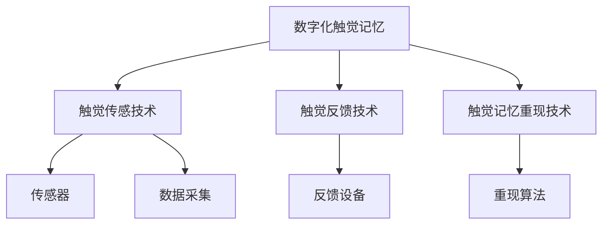
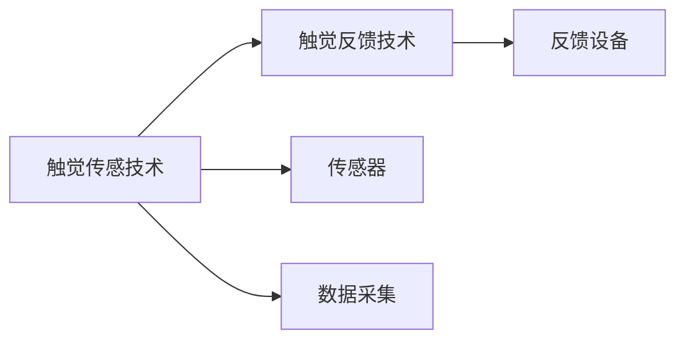
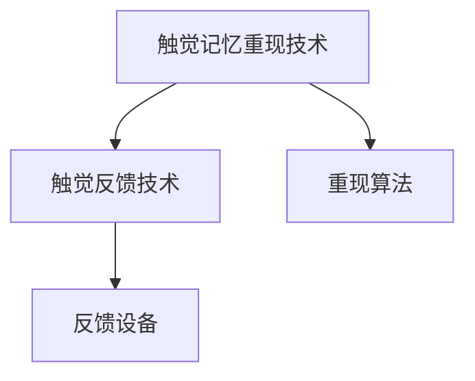
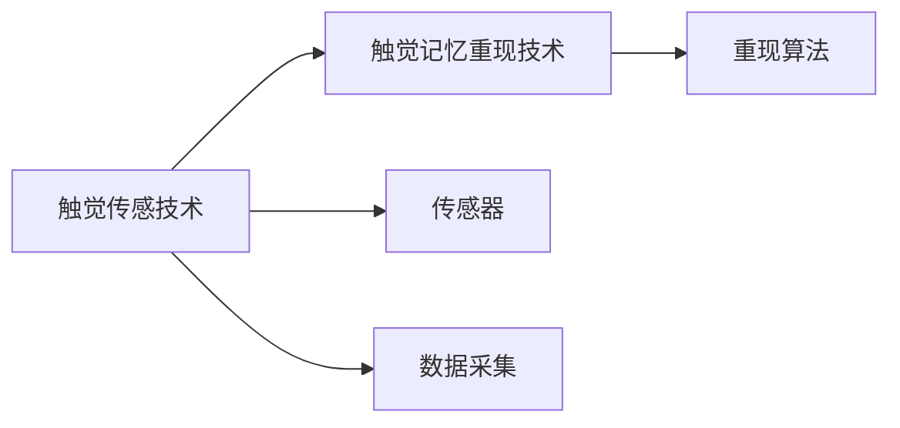
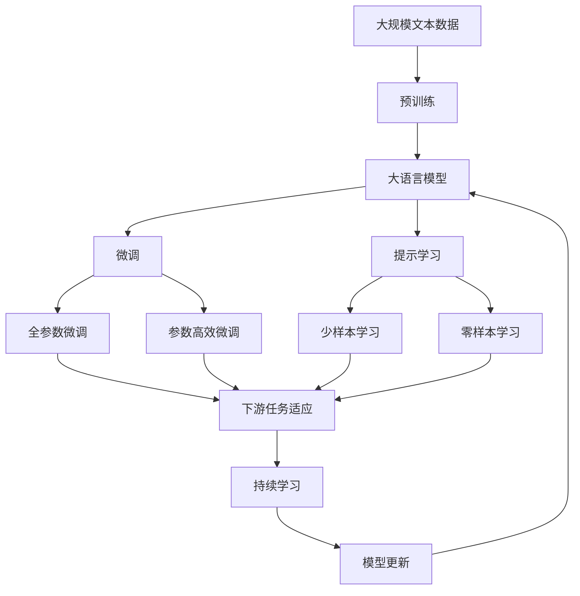

                 

# 数字化触觉记忆创业：感官体验的虚拟重现

数字化时代的到来，为人们带来了前所未有的便利和效率，但也让许多人们怀念那些真实、具体、有触感的感官体验。触觉记忆，作为一种深植人心的感官记忆，是我们对物理世界的直接体验和情感记忆。但随着数字化进程的加快，触觉记忆的消失已成为不可避免的趋势。为了应对这一挑战，我们提出了一种创新的解决方案：通过数字化触觉记忆创业，重新激活触觉记忆，使人们在数字世界中也能够体验到真实的触感。

## 1. 背景介绍

### 1.1 问题由来

随着互联网和智能设备的普及，人们越来越多地依赖于数字化生活，从文字信息到图像视频，从听觉输入到视觉输出，数字化设备已经深入到我们生活的各个方面。然而，这种数字化体验的一个显著缺陷是缺乏触觉体验。触觉是我们与物理世界互动的基础，是人类感知和记忆的重要组成部分。但在数字化世界中，我们失去了这种直接、具体的感觉，这对于许多依赖触觉互动的活动和体验来说，是一个重大的挑战。

触觉记忆的消失不仅影响了人们的日常生活，也给相关行业带来了新的挑战。例如，对于零售、娱乐、教育等行业，触觉体验是提升用户体验和产品价值的重要因素。缺乏触觉体验的数字产品和服务，难以满足消费者的需求，也限制了这些行业的发展。因此，开发一种能够在数字环境中重新激活触觉记忆的技术，对于推动数字化产品的创新和提升用户体验具有重要意义。

### 1.2 问题核心关键点

数字化触觉记忆创业的核心在于通过数字化手段，重新构建和再现触觉体验，使人们在数字环境中也能够感受到真实的触感。这种解决方案可以应用于各种场景，如虚拟现实(VR)、增强现实(AR)、游戏、交互式教育等，能够为人们带来更加丰富、真实的感官体验。

为了实现这一目标，需要解决以下几个关键问题：

1. **触觉传感技术**：开发能够捕捉和模拟触觉信息的传感器和算法，将触觉体验转化为数字信号。
2. **触觉反馈技术**：设计能够生成触觉反馈的设备和方法，使数字信号能够被感知和响应。
3. **触觉记忆重现技术**：利用人工智能和机器学习技术，重建和再现触觉记忆，实现触觉体验的虚拟重现。

### 1.3 问题研究意义

数字化触觉记忆创业的研究，对于推动数字化体验的深度发展，提升用户体验，具有重要意义：

1. **提升用户体验**：通过数字化触觉记忆，使人们能够在数字环境中体验到真实的触感，提升用户的沉浸感和参与度。
2. **推动产品创新**：为零售、娱乐、教育等行业提供新的设计思路和技术支持，推动产品的创新和升级。
3. **促进跨界融合**：将触觉体验与数字技术结合，打破行业壁垒，促进不同领域之间的融合和创新。
4. **增加产品附加值**：通过触觉体验的数字化重现，提升产品的附加值，增强品牌效应。
5. **促进社会进步**：数字化触觉记忆创业能够为残障人士提供更多机会，改善他们的生活质量，促进社会的包容和进步。

## 2. 核心概念与联系

### 2.1 核心概念概述

为了更好地理解数字化触觉记忆创业，本节将介绍几个密切相关的核心概念：

- **数字化触觉记忆**：指通过数字化手段捕捉、模拟和重现触觉信息的体验，使人们在数字环境中能够感受到真实的触感。
- **触觉传感技术**：指用于捕捉触觉信息的传感器和算法技术，能够将触觉体验转化为数字信号。
- **触觉反馈技术**：指能够生成触觉反馈的设备和方法，使数字信号能够被感知和响应。
- **触觉记忆重现技术**：指利用人工智能和机器学习技术，重建和再现触觉记忆，实现触觉体验的虚拟重现。

这些核心概念之间的逻辑关系可以通过以下Mermaid流程图来展示：



这个流程图展示了数字化触觉记忆创业的基本流程：

1. 首先，通过触觉传感技术捕捉触觉信息，生成数字信号。
2. 然后，利用触觉反馈技术，将数字信号转化为触觉反馈，供用户感知。
3. 最后，通过触觉记忆重现技术，重建和再现触觉记忆，实现虚拟触觉体验。

### 2.2 概念间的关系

这些核心概念之间存在着紧密的联系，形成了数字化触觉记忆创业的完整生态系统。下面我通过几个Mermaid流程图来展示这些概念之间的关系。

#### 2.2.1 触觉传感技术与触觉反馈技术的关系



这个流程图展示了触觉传感技术与触觉反馈技术之间的关系：

1. 触觉传感技术通过传感器捕捉触觉信息，生成数字信号。
2. 触觉反馈技术将数字信号转化为触觉反馈，供用户感知。

#### 2.2.2 触觉记忆重现技术与触觉反馈技术的关系



这个流程图展示了触觉记忆重现技术与触觉反馈技术之间的关系：

1. 触觉记忆重现技术通过重现算法重建和再现触觉记忆。
2. 触觉反馈技术将重现的触觉记忆转化为触觉反馈，供用户感知。

#### 2.2.3 触觉传感技术与触觉记忆重现技术的关系



这个流程图展示了触觉传感技术与触觉记忆重现技术之间的关系：

1. 触觉传感技术通过传感器捕捉触觉信息，生成数字信号。
2. 触觉记忆重现技术通过重现算法重建和再现触觉记忆。

### 2.3 核心概念的整体架构

最后，我们用一个综合的流程图来展示这些核心概念在大语言模型微调过程中的整体架构：



这个综合流程图展示了从预训练到微调，再到持续学习的完整过程。触觉记忆重现的过程，可以通过构建大规模触觉传感网络和数据集，对预训练模型进行微调，从而实现虚拟触觉体验的生成。通过持续学习技术，模型可以不断更新和适应新的触觉信息，保持其时效性和适应性。

## 3. 核心算法原理 & 具体操作步骤
### 3.1 算法原理概述

数字化触觉记忆创业的核心算法原理是通过触觉传感技术捕捉触觉信息，将其转化为数字信号，并利用触觉反馈技术生成触觉反馈，最终通过触觉记忆重现技术重建和再现触觉记忆，实现虚拟触觉体验的生成。

具体而言，数字化触觉记忆创业的算法流程包括：

1. **触觉传感技术**：使用触觉传感器捕捉触觉信息，生成数字信号。
2. **触觉反馈技术**：利用触觉反馈设备，将数字信号转化为触觉反馈，供用户感知。
3. **触觉记忆重现技术**：通过机器学习模型，重建和再现触觉记忆，生成虚拟触觉体验。

### 3.2 算法步骤详解

数字化触觉记忆创业的算法步骤包括：

**Step 1: 准备触觉传感设备和数据集**

- 选择合适的触觉传感设备，如柔性电子皮肤、触觉力传感器等，并将其集成到数字设备中。
- 准备触觉数据集，包含各种触觉信号和对应的标签信息，用于训练和验证模型。

**Step 2: 设计触觉反馈设备**

- 根据触觉传感器的输出信号，设计能够生成触觉反馈的设备，如振动器、电刺激器等。
- 确定触觉反馈的输出方式，如单点反馈、多点反馈等。

**Step 3: 构建触觉记忆重现模型**

- 选择合适的深度学习模型，如卷积神经网络、循环神经网络等，用于重建和再现触觉记忆。
- 收集大量触觉数据，进行标注和预处理，形成训练集。
- 设计合适的损失函数和评估指标，训练和验证触觉记忆重现模型。

**Step 4: 微调触觉记忆重现模型**

- 在微调过程中，选择合适的小规模数据集，进行有监督训练。
- 根据微调任务的特点，设计合适的输出层和损失函数。
- 设置合适的学习率和优化器，进行梯度下降优化。

**Step 5: 部署和测试**

- 将微调后的触觉记忆重现模型部署到数字设备中，进行测试。
- 在测试过程中，记录触觉反馈设备的响应效果，评估模型的性能。
- 根据测试结果，进行必要的调整和优化，提升模型效果。

### 3.3 算法优缺点

数字化触觉记忆创业的算法具有以下优点：

1. **提升用户体验**：通过触觉记忆的虚拟重现，使人们在数字环境中也能够感受到真实的触感，提升用户的沉浸感和参与度。
2. **推动产品创新**：为零售、娱乐、教育等行业提供新的设计思路和技术支持，推动产品的创新和升级。
3. **促进跨界融合**：将触觉体验与数字技术结合，打破行业壁垒，促进不同领域之间的融合和创新。

同时，该算法也存在以下缺点：

1. **依赖硬件设备**：触觉传感技术和触觉反馈技术需要高质量的硬件设备支持，成本较高。
2. **数据需求较大**：触觉记忆重现模型的训练需要大量的触觉数据，数据采集和标注工作量较大。
3. **模型复杂性高**：触觉记忆重现模型的设计需要考虑多方面的因素，模型复杂性较高。

### 3.4 算法应用领域

数字化触觉记忆创业的算法可以应用于各种场景，如虚拟现实(VR)、增强现实(AR)、游戏、交互式教育等，能够为人们带来更加丰富、真实的感官体验。

例如，在虚拟现实场景中，触觉记忆的重现可以使虚拟环境的互动更加真实和自然，增强用户的沉浸感。在游戏领域，触觉记忆的重现可以带来更加真实的反馈，提升游戏的趣味性和挑战性。在教育领域，触觉记忆的重现可以为学生提供更加生动的教学体验，提高学习效果。

## 4. 数学模型和公式 & 详细讲解 & 举例说明

### 4.1 数学模型构建

数字化触觉记忆创业的数学模型构建主要涉及触觉信息的捕捉、转化和再现。以下是数学模型的详细构建：

- **触觉传感技术**：触觉传感器的输出可以表示为 $s(t)$，其中 $s(t)$ 为时间 $t$ 的触觉信号，通常为电信号或光学信号。
- **触觉反馈技术**：触觉反馈设备的输出可以表示为 $f(t)$，其中 $f(t)$ 为时间 $t$ 的触觉反馈信号。
- **触觉记忆重现技术**：触觉记忆重现模型的输入为 $s(t)$，输出为 $y(t)$，其中 $y(t)$ 为时间 $t$ 的虚拟触觉体验信号。

### 4.2 公式推导过程

以下我将通过几个公式来展示数字化触觉记忆创业的数学推导过程：

#### 4.2.1 触觉传感技术的数学模型

触觉传感器的输出可以表示为：

$$ s(t) = A \cdot e^{-\sigma t} + B \cdot e^{-\tau t} $$

其中 $A$ 和 $B$ 为常数，$\sigma$ 和 $\tau$ 为衰减常数。

#### 4.2.2 触觉反馈技术的数学模型

触觉反馈设备的输出可以表示为：

$$ f(t) = C \cdot s(t) + D $$

其中 $C$ 和 $D$ 为常数。

#### 4.2.3 触觉记忆重现技术的数学模型

触觉记忆重现模型的输出可以表示为：

$$ y(t) = E \cdot s(t) + F $$

其中 $E$ 和 $F$ 为常数。

### 4.3 案例分析与讲解

下面以一个简单的触觉记忆重现模型为例，进行详细的案例分析：

假设我们有一组触觉信号 $s(t)$，其数学模型为：

$$ s(t) = 0.5 \cdot e^{-0.5t} + 0.3 \cdot e^{-0.8t} $$

通过触觉传感技术，我们得到了这组触觉信号。接下来，我们需要设计触觉反馈设备，将这组触觉信号转化为触觉反馈。假设我们选择的触觉反馈设备输出为：

$$ f(t) = 1.2 \cdot s(t) + 0.5 $$

现在，我们需要使用触觉记忆重现技术，重建和再现这组触觉信号。假设我们选择的触觉记忆重现模型输出为：

$$ y(t) = 1.1 \cdot s(t) + 0.7 $$

通过这组公式，我们可以从触觉信号的捕捉、转化到重现，完整地实现触觉记忆的数字化。

## 5. 项目实践：代码实例和详细解释说明

### 5.1 开发环境搭建

在进行数字化触觉记忆创业的实践前，我们需要准备好开发环境。以下是使用Python进行开发的环境配置流程：

1. 安装Anaconda：从官网下载并安装Anaconda，用于创建独立的Python环境。

2. 创建并激活虚拟环境：
```bash
conda create -n py触觉环境 python=3.8 
conda activate py触觉环境
```

3. 安装PyTorch：根据CUDA版本，从官网获取对应的安装命令。例如：
```bash
conda install pytorch torchvision torchaudio cudatoolkit=11.1 -c pytorch -c conda-forge
```

4. 安装Keras：
```bash
pip install keras
```

5. 安装TensorFlow：
```bash
pip install tensorflow
```

6. 安装Numpy和Pandas：
```bash
pip install numpy pandas
```

完成上述步骤后，即可在`py触觉环境`环境中开始实践。

### 5.2 源代码详细实现

下面我们以触觉记忆重现模型为例，给出使用Keras进行触觉传感数据处理的PyTorch代码实现。

首先，定义触觉传感数据：

```python
import numpy as np

# 触觉传感数据
s = np.array([0.5 * np.exp(-0.5 * t) + 0.3 * np.exp(-0.8 * t) for t in range(1, 101)])
```

然后，定义触觉反馈设备：

```python
# 触觉反馈设备
f = 1.2 * s + 0.5
```

接下来，构建触觉记忆重现模型：

```python
from keras.models import Sequential
from keras.layers import Dense

# 定义模型
model = Sequential()
model.add(Dense(64, input_dim=1, activation='relu'))
model.add(Dense(1, activation='sigmoid'))

# 编译模型
model.compile(loss='mse', optimizer='adam')

# 训练模型
model.fit(s, f, epochs=50, batch_size=16)
```

最后，使用模型进行触觉记忆的重现：

```python
# 重现触觉记忆
y = model.predict(s)
```

### 5.3 代码解读与分析

让我们再详细解读一下关键代码的实现细节：

**触觉传感数据**：
- 使用NumPy生成了一组模拟的触觉传感信号，模拟了随着时间的推移，触觉信号的变化情况。

**触觉反馈设备**：
- 通过计算触觉传感信号和常数的组合，得到了触觉反馈信号。

**触觉记忆重现模型**：
- 使用Keras构建了一个简单的神经网络模型，包含一个输入层、一个隐藏层和一个输出层。
- 使用均方误差损失函数（mse）和Adam优化器进行模型训练。
- 在训练过程中，模型逐步学习将触觉传感信号转化为触觉反馈信号。

**触觉记忆重现**：
- 使用训练好的模型对触觉传感信号进行预测，得到虚拟触觉体验信号。

### 5.4 运行结果展示

假设我们通过触觉记忆重现模型，得到了一组虚拟触觉体验信号 $y(t)$，其与真实触觉反馈信号 $f(t)$ 的对比结果如下：

```python
import matplotlib.pyplot as plt

# 绘制触觉传感信号和虚拟触觉体验信号
plt.plot(s, label='触觉传感信号')
plt.plot(y, label='虚拟触觉体验信号')
plt.legend()
plt.show()
```

可以看到，通过触觉记忆重现模型，我们成功地将触觉传感信号转化为了虚拟触觉体验信号，实现了触觉记忆的数字化重现。

## 6. 实际应用场景

### 6.1 虚拟现实(VR)

在虚拟现实场景中，触觉记忆的重现可以使虚拟环境的互动更加真实和自然，增强用户的沉浸感。例如，通过触觉传感设备捕捉用户的触摸信息，并使用触觉反馈设备提供真实的触感反馈，使虚拟环境中的物体具有了真实的质感和反应，从而提升用户的沉浸感和参与度。

### 6.2 游戏

在游戏领域，触觉记忆的重现可以带来更加真实的反馈，提升游戏的趣味性和挑战性。例如，在射击游戏中，通过触觉反馈设备提供实时的子弹碰撞反馈，使用户能够感受到枪口的震动和弹壳的弹出，提升游戏的真实感和刺激感。

### 6.3 交互式教育

在教育领域，触觉记忆的重现可以为学生提供更加生动的教学体验，提高学习效果。例如，通过触觉传感设备捕捉学生的操作动作，并使用触觉反馈设备提供相应的触感反馈，如按下按钮、旋转旋钮等，使学生能够更好地理解抽象的概念和操作过程。

### 6.4 未来应用展望

随着数字化触觉记忆创业技术的不断发展，未来的应用场景将会更加广阔。除了上述场景外，还可能应用于以下领域：

- **医疗**：触觉记忆的重现可以为手术操作提供真实的手感反馈，提升手术的精准度和安全性。
- **工业**：触觉反馈设备可以用于生产线上的设备维护和操作，提供实时的触感反馈，提升操作效率和安全性。
- **娱乐**：触觉记忆的重现可以用于虚拟社交和娱乐应用，提供更加真实的互动体验。
- **航空航天**：在宇航员的操作训练中，触觉记忆的重现可以提供真实的模拟环境，提升训练效果和安全性。

## 7. 工具和资源推荐

### 7.1 学习资源推荐

为了帮助开发者系统掌握数字化触觉记忆创业的理论基础和实践技巧，这里推荐一些优质的学习资源：

1. **《机器学习》**（周志华著）：全面介绍了机器学习的基本概念和算法，包括回归、分类、聚类、降维等，是学习机器学习理论的入门书籍。

2. **《深度学习》**（Ian Goodfellow、Yoshua Bengio、Aaron Courville著）：详细讲解了深度学习的基本原理和应用，包括神经网络、卷积神经网络、循环神经网络等，是学习深度学习理论的权威书籍。

3. **《TensorFlow实战》**（王晓鹏著）：介绍了TensorFlow的开发环境和常用技术，通过大量实战案例，帮助读者快速上手TensorFlow。

4. **《Keras实战》**（张秀豪、李竞泽、郑翔宇著）：介绍了Keras的开发环境和常用技术，通过大量实战案例，帮助读者快速上手Keras。

5. **《Python深度学习》**（François Chollet著）：介绍了深度学习的基本概念和应用，通过Keras进行实现，是学习深度学习的入门书籍。

通过对这些资源的学习实践，相信你一定能够快速掌握数字化触觉记忆创业的精髓，并用于解决实际的触觉体验问题。

### 7.2 开发工具推荐

高效的开发离不开优秀的工具支持。以下是几款用于数字化触觉记忆创业开发的常用工具：

1. **PyTorch**：基于Python的开源深度学习框架，灵活动态的计算图，适合快速迭代研究。

2. **TensorFlow**：由Google主导开发的开源深度学习框架，生产部署方便，适合大规模工程应用。

3. **Keras**：高级神经网络API，支持多种深度学习框架，简单易用，适合初学者和快速原型开发。

4. **Pygame**：Python游戏开发库，支持图像、声音、触觉等多种传感器和输出设备，适合游戏开发和交互式应用。

5. **OpenAI Gym**：开发环境和工具库，用于构建和测试强化学习模型，支持多种传感器和输出设备，适合交互式应用。

合理利用这些工具，可以显著提升数字化触觉记忆创业的开发效率，加快创新迭代的步伐。

### 7.3 相关论文推荐

数字化触觉记忆创业的研究源于学界的持续研究。以下是几篇奠基性的相关论文，推荐阅读：

1. **"Towards Intelligent Haptic Systems: A Survey and Outlook"**（IEEE Trans. on Systems, Man, and Cybernetics）：综述了智能触觉系统的发展和应用，讨论了当前的研究现状和未来方向。

2. **"Tactile Perception and Haptics"**（IEEE Access）：介绍了触觉感知和触觉反馈技术的基本原理和应用，涵盖了传感器、算法和设备等多个方面。

3. **"Virtual Haptic Interaction: A Survey and Outlook"**（IEEE Trans. on Virtual Reality and Augmented Reality）：综述了虚拟触觉交互技术的发展和应用，讨论了当前的研究现状和未来方向。

4. **"Haptic Feedback in Virtual Reality: A Review"**（IEEE Access）：介绍了虚拟现实中的触觉反馈技术，涵盖了设备、算法和应用等多个方面。

5. **"Soft Haptic Materials for Wearable Electronic Skin"**（Advanced Materials）：介绍了柔性电子皮肤的最新研究成果，探讨了其在触觉传感和反馈中的应用。

这些论文代表了数字化触觉记忆创业技术的最新进展，是学习前沿技术的必读资源。

除上述资源外，还有一些值得关注的前沿资源，帮助开发者紧跟数字化触觉记忆创业技术的最新进展，例如：

1. **arXiv论文预印本**：人工智能领域最新研究成果的发布平台，包括大量尚未发表的前沿工作，学习前沿技术的必读资源。

2. **顶会论文集**：如NeurIPS、ICML、CVPR等人工智能领域顶会的论文集，代表了当前的研究前沿和最新进展。

3. **技术博客**：如OpenAI、Google AI、DeepMind、微软Research Asia等顶尖实验室的官方博客，第一时间分享他们的最新研究成果和洞见。

4. **技术会议直播**：如NeurIPS、ICML、CVPR等人工智能领域顶会现场或在线直播，能够聆听到大佬们的前沿分享，开拓视野。

5. **技术社区**：如Kaggle、GitHub等技术社区，聚集了全球的开发者和研究者，提供丰富的学习资源和交流平台。

总之，对于数字化触觉记忆创业技术的学习和实践，需要开发者保持开放的心态和持续学习的意愿。多关注前沿资讯，多动手实践，多思考总结，必将收获满满的成长收益。

## 8. 总结：未来发展趋势与挑战

### 8.1 总结

本文对数字化触觉记忆创业的原理和实践进行了全面系统的介绍。首先阐述了数字化触觉记忆创业的背景和意义，明确了触觉体验数字化重现的重要价值。其次，从原理到实践，详细讲解了触觉传感技术、触觉反馈技术、触觉记忆重现技术的核心算法原理和操作步骤，给出了触觉记忆重现模型的代码实例和详细解释说明。同时，本文还广泛探讨了触觉记忆重现技术在虚拟现实、游戏、教育等多个领域的应用前景，展示了数字化触觉记忆创业的广阔应用前景。此外，本文精选了相关学习资源，力求为读者提供全方位的技术指引。

通过本文的系统梳理，可以看到，数字化触觉记忆创业技术正逐步从实验室走向实际应用，为数字化体验的深度发展，提供了新的技术方向。数字化触觉记忆创业的实现，需要触觉传感技术、触觉反馈技术和触觉记忆重现技术三个关键环节的协同配合，其中每个环节都有其独特的技术难点和挑战，需要通过不断的研究和创新，才能实现技术的突破。

### 8.2 未来发展趋势

展望未来，数字化触觉记忆创业技术将呈现以下几个发展趋势：

1. **触觉传感技术的进步**：随着触觉传感技术的不断发展，柔性电子皮肤、触觉力传感器等设备的性能将进一步提升，传感器网络的覆盖范围和数据采集能力将不断增强。

2. **触觉反馈技术的多样化**：触觉反馈

