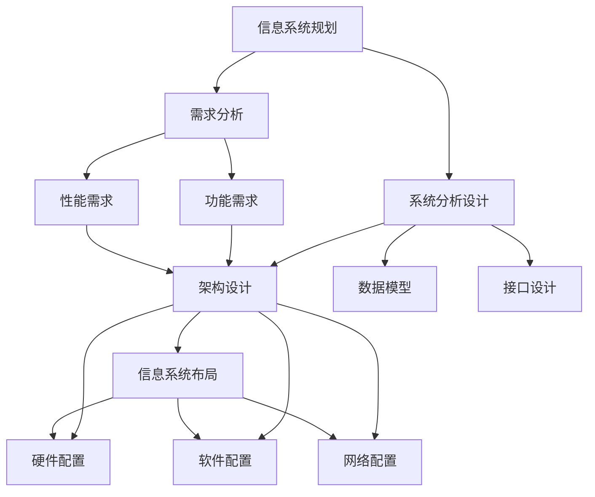
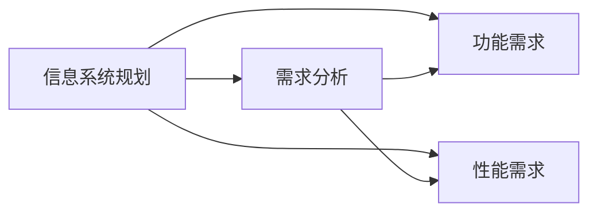
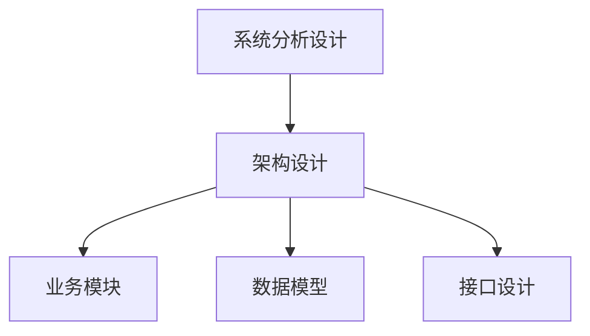
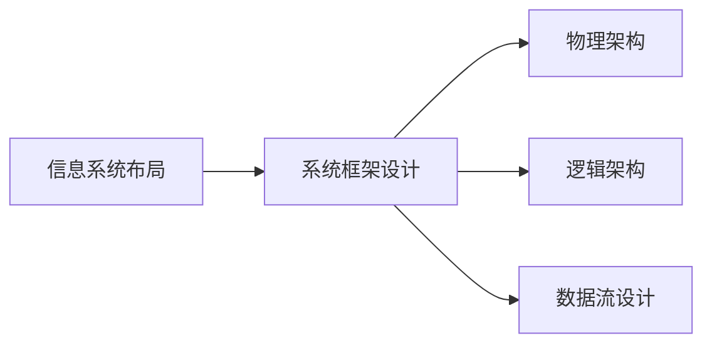
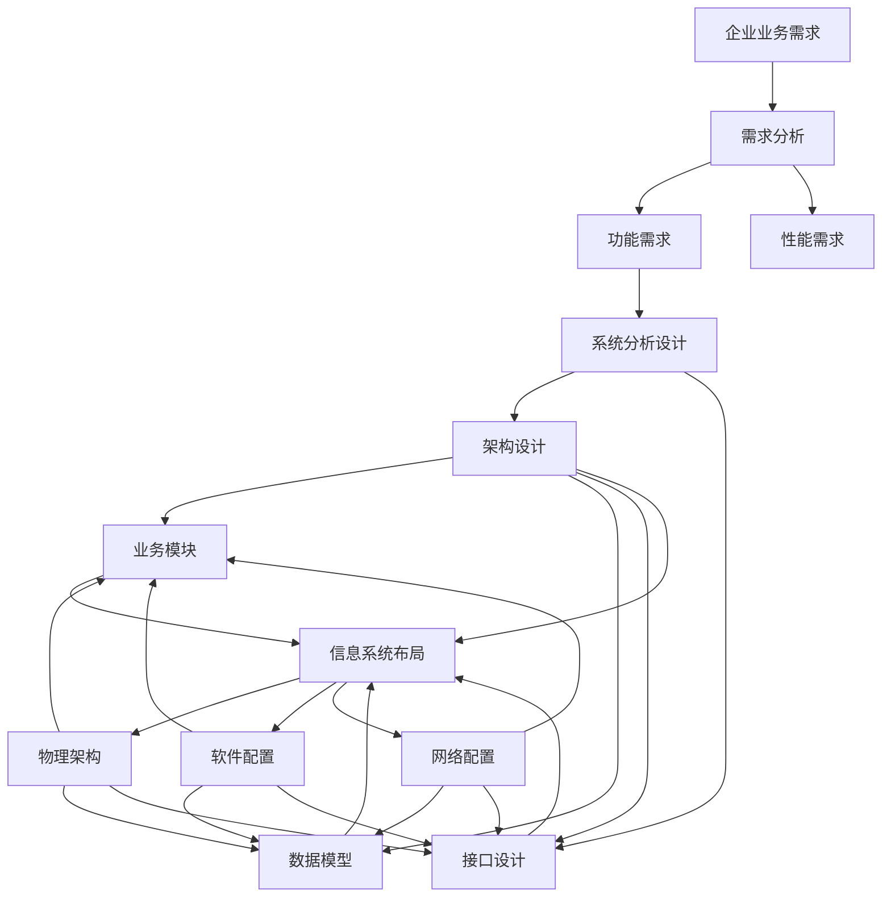

                 

# 数字化转型项目设计：信息系统规划、布局及框架设计，需求分析、系统分析设计

## 1. 背景介绍

### 1.1 问题由来

在当前快速变化的商业环境中，数字化转型已经成为了企业保持竞争力的关键。数字化转型旨在通过技术手段，优化企业运营流程，提升管理效率，增强客户体验，从而实现业务增长和创新。然而，数字化转型的复杂性以及传统IT架构的局限性，使得企业在信息系统规划、布局及框架设计等方面面临巨大挑战。

### 1.2 问题核心关键点

信息系统规划、布局及框架设计是数字化转型的基础环节。设计合理的系统架构和数据流，能够有效支持企业业务流程的数字化，加速数据的收集、处理和应用，推动业务创新和优化。

核心关键点包括：
- 系统的模块化设计，以适应未来业务的变化和扩展。
- 高效的数据流设计，以确保数据在系统中准确、及时地传递。
- 与业务流程的紧密结合，以实现真正的业务自动化和智能化。
- 与外部系统的集成，以确保企业能够获取外部资源和数据，提升业务竞争力。

### 1.3 问题研究意义

数字化转型项目设计是企业数字化转型的核心环节，对于提升企业数字化能力，推动业务创新，具有重要意义：

1. 优化业务流程：通过信息系统设计，优化企业内部流程，提高工作效率，降低运营成本。
2. 增强决策支持：信息系统能够提供实时的数据支持和分析工具，辅助高层管理人员做出更科学的决策。
3. 提升客户体验：通过数字化手段，增强客户互动和个性化服务，提升客户满意度和忠诚度。
4. 实现业务创新：信息系统设计能够支持企业尝试新业务模式，推动业务创新和增长。
5. 数据驱动决策：信息系统设计强调数据的重要性，能够为企业决策提供有力支持。

## 2. 核心概念与联系

### 2.1 核心概念概述

为更好地理解信息系统规划、布局及框架设计，本节将介绍几个密切相关的核心概念：

- **信息系统规划(ISP)：** 信息系统规划是企业对信息系统建设进行全面规划的阶段，包括需求分析、架构设计、资源分配和项目管理等。
- **信息系统布局(ISL)：** 信息系统布局是指信息系统在物理和逻辑上的安排，包括硬件、软件、网络等资源配置和信息流设计。
- **系统框架设计：** 系统框架设计是指信息系统各个模块的逻辑结构和数据流设计，包括业务模块划分、数据模型定义、接口设计等。
- **需求分析：** 需求分析是信息系统规划的起点，通过深入了解企业业务需求，确定系统功能和性能要求。
- **系统分析设计：** 系统分析设计是信息系统规划的关键步骤，通过对业务流程和数据模型的分析，设计出满足企业需求的系统架构和数据流。

这些核心概念之间的关系可以通过以下Mermaid流程图来展示：



这个流程图展示了几大核心概念之间的逻辑关系：

1. 信息系统规划是整个系统的起点。
2. 需求分析是信息系统规划的基础，通过深入了解企业业务需求，确定系统功能和性能要求。
3. 系统分析设计是信息系统规划的关键步骤，通过对业务流程和数据模型的分析，设计出满足企业需求的系统架构和数据流。
4. 信息系统布局是在系统分析设计的基础上，对系统在物理和逻辑上的安排，包括硬件、软件、网络等资源配置和信息流设计。
5. 系统框架设计是对系统各个模块的逻辑结构和数据流设计，包括业务模块划分、数据模型定义、接口设计等。

### 2.2 概念间的关系

这些核心概念之间存在着紧密的联系，形成了信息系统规划、布局及框架设计的完整生态系统。下面我们通过几个Mermaid流程图来展示这些概念之间的关系。

#### 2.2.1 信息系统规划与需求分析的关系



这个流程图展示了大系统规划与需求分析的关系。需求分析是信息系统规划的起点，通过深入了解企业业务需求，确定系统功能和性能要求。

#### 2.2.2 系统分析设计与架构设计的关系



这个流程图展示了系统分析设计与架构设计的关系。系统分析设计是通过对业务流程和数据模型的分析，设计出满足企业需求的系统架构和数据流。架构设计是对系统各个模块的逻辑结构和数据流设计，包括业务模块划分、数据模型定义、接口设计等。

#### 2.2.3 信息系统布局与系统框架设计的关系



这个流程图展示了信息系统布局与系统框架设计的关系。信息系统布局是在系统分析设计的基础上，对系统在物理和逻辑上的安排，包括硬件、软件、网络等资源配置和信息流设计。系统框架设计是对系统各个模块的逻辑结构和数据流设计，包括业务模块划分、数据模型定义、接口设计等。

### 2.3 核心概念的整体架构

最后，我们用一个综合的流程图来展示这些核心概念在系统规划、布局及框架设计过程中的整体架构：



这个综合流程图展示了从企业业务需求到最终的系统框架设计的完整过程。需求分析是信息系统规划的起点，通过深入了解企业业务需求，确定系统功能和性能要求。系统分析设计是信息系统规划的关键步骤，通过对业务流程和数据模型的分析，设计出满足企业需求的系统架构和数据流。信息系统布局是在系统分析设计的基础上，对系统在物理和逻辑上的安排，包括硬件、软件、网络等资源配置和信息流设计。系统框架设计是对系统各个模块的逻辑结构和数据流设计，包括业务模块划分、数据模型定义、接口设计等。通过这些步骤，最终得到符合企业业务需求的系统框架。

## 3. 核心算法原理 & 具体操作步骤

### 3.1 算法原理概述

信息系统规划、布局及框架设计涉及多个步骤和组件，包括需求分析、系统分析设计、架构设计、数据模型设计、接口设计、信息系统布局等。其核心算法原理是采用模块化和层次化的设计思想，将复杂系统划分为多个独立且相互关联的模块，通过接口进行信息交换和协作，实现系统功能的模块化和数据流的层次化。

### 3.2 算法步骤详解

基于上述设计思想，信息系统规划、布局及框架设计可以分解为以下几个关键步骤：

**Step 1: 需求分析**

- **数据收集与整理：** 收集企业内部业务流程和数据管理现状，分析现有信息系统的功能与性能不足。
- **业务需求分析：** 通过与业务部门、管理层、IT部门等多方交流，了解业务需求、管理需求、技术需求等，明确信息系统建设的目标和范围。
- **功能需求分析：** 分析现有系统的不足之处，确定系统需要新增或改进的功能模块。
- **性能需求分析：** 评估系统性能需求，如处理速度、响应时间、并发量等。

**Step 2: 系统分析设计**

- **业务流程分析：** 分析现有业务流程，识别瓶颈和改进点，确定系统需要支持的新流程。
- **数据模型设计：** 设计系统的数据模型，包括数据表、字段、关系等，确保数据的准确性和完整性。
- **系统架构设计：** 根据业务流程和数据模型，设计系统架构，包括业务模块划分、数据流设计、接口设计等。

**Step 3: 架构设计**

- **架构选型：** 根据系统需求，选择适合的架构技术，如微服务架构、单体架构、分布式架构等。
- **模块划分：** 将系统划分为多个独立的模块，每个模块负责特定的功能。
- **接口设计：** 设计模块间的接口，确保模块之间的信息交换和协作。
- **数据流设计：** 设计系统中的数据流，确保数据在系统中准确、及时地传递。

**Step 4: 信息系统布局**

- **硬件配置：** 根据系统需求，配置适合的硬件资源，如服务器、存储、网络等。
- **软件配置：** 选择合适的软件，配置操作系统、数据库、中间件等。
- **网络配置：** 设计系统的网络架构，确保网络的安全和稳定。

**Step 5: 系统测试与部署**

- **系统测试：** 对系统进行全面测试，确保系统功能和性能符合要求。
- **部署上线：** 将系统部署到生产环境，进行监控和维护。

### 3.3 算法优缺点

信息系统规划、布局及框架设计具有以下优点：

- **系统可扩展性：** 模块化和层次化的设计思想，使得系统易于扩展和维护。
- **数据准确性：** 通过设计合理的数据模型和数据流，确保数据的准确性和完整性。
- **高效性：** 通过接口设计，确保模块之间的信息交换和协作，提高系统性能。

同时，该算法也存在以下缺点：

- **开发周期长：** 系统规划和设计阶段需要多方协作，工作量大，周期长。
- **成本高：** 信息系统建设需要大量的硬件和软件资源，成本较高。
- **需求变化风险：** 系统设计和布局需要经过多次修改，容易受需求变化影响。

### 3.4 算法应用领域

信息系统规划、布局及框架设计在信息技术行业、企业管理、互联网行业等多个领域都有广泛应用。以下是一些典型的应用场景：

- **电商平台：** 通过信息系统规划，优化供应链、物流、库存等管理流程，提升用户体验。
- **金融行业：** 通过信息系统规划，优化金融产品设计和客户服务流程，提升业务效率。
- **医疗行业：** 通过信息系统规划，优化医疗资源管理和患者服务流程，提高医疗服务质量。
- **制造业：** 通过信息系统规划，优化生产流程和质量管理，提升生产效率和产品质量。
- **零售行业：** 通过信息系统规划，优化库存管理、营销策略和客户服务，提升销售业绩。

## 4. 数学模型和公式 & 详细讲解 & 举例说明

### 4.1 数学模型构建

信息系统规划、布局及框架设计涉及多个步骤和组件，可以通过数学模型和公式来描述和分析。

假设企业需要建设一个电商网站，设计其信息系统规划、布局及框架设计，可以建立以下数学模型：

- **需求分析模型：** 通过调查问卷、访谈等方式收集企业业务需求和数据管理现状，建立需求分析模型。
- **系统分析设计模型：** 分析现有业务流程和数据模型，设计新的业务流程和数据模型，建立系统分析设计模型。
- **架构设计模型：** 根据系统分析设计模型，设计系统架构，包括业务模块划分、数据流设计、接口设计等，建立架构设计模型。
- **信息系统布局模型：** 根据架构设计模型，配置硬件、软件、网络等资源，建立信息系统布局模型。

### 4.2 公式推导过程

以系统分析设计模型为例，推导其公式过程：

假设现有业务流程为 $\mathcal{P} = \{P_1, P_2, \dots, P_n\}$，每个业务流程 $P_i$ 包含多个任务 $T_i = \{T_{i1}, T_{i2}, \dots, T_{im}\}$，每个任务 $T_{ij}$ 需要处理的数据量为 $D_{ij}$，任务之间的依赖关系为 $R_i = \{R_{ij}\}$。

系统分析设计模型的目标是最小化任务之间的依赖关系，确保数据在系统中准确、及时地传递。通过定义任务依赖矩阵 $R$ 和数据流图 $G$，可以求解最优的系统架构。

数据流图 $G$ 可以通过以下公式推导：

$$
G = \min_{R} \sum_{ij} D_{ij} \cdot R_{ij}
$$

其中 $R_{ij}$ 表示任务 $T_{ij}$ 依赖于任务 $T_{ij}$ 的程度，$D_{ij}$ 表示任务 $T_{ij}$ 处理的数据量。

求解上述问题，可以得到最优的任务依赖关系矩阵 $R^*$，进而得到最优的系统架构。

### 4.3 案例分析与讲解

假设某电商平台需要优化库存管理流程，设计信息系统规划、布局及框架设计。

**需求分析：** 通过调查问卷，收集企业库存管理现状，发现现有系统无法及时更新库存数据，导致库存积压和缺货。

**系统分析设计：** 分析现有库存管理流程，设计新的流程，引入自动化仓库管理系统。系统分析设计模型如下：

- **业务流程：** $\mathcal{P} = \{P_{入库}, P_{出库}, P_{库存查询\}$。
- **任务：** $P_{入库} = \{T_{入库1}, T_{入库2}, T_{入库3}\}$，$P_{出库} = \{T_{出库1}, T_{出库2}, T_{出库3}\}$，$P_{库存查询} = \{T_{库存查询1}, T_{库存查询2}\}$。
- **任务依赖关系：** $R_{入库} = \{R_{入库1}, R_{入库2}, R_{入库3}\}$，$R_{出库} = \{R_{出库1}, R_{出库2}, R_{出库3}\}$，$R_{库存查询} = \{R_{库存查询1}, R_{库存查询2}\}$。
- **数据流：** $D_{入库} = \{D_{入库1}, D_{入库2}, D_{入库3}\}$，$D_{出库} = \{D_{出库1}, D_{出库2}, D_{出库3}\}$，$D_{库存查询} = \{D_{库存查询1}, D_{库存查询2}\}$。

通过求解上述系统分析设计模型，可以得到最优的任务依赖关系矩阵 $R^*$，进而得到最优的系统架构。

## 5. 项目实践：代码实例和详细解释说明

### 5.1 开发环境搭建

在进行信息系统规划、布局及框架设计实践前，我们需要准备好开发环境。以下是使用Python进行信息系统规划和设计的环境配置流程：

1. 安装Anaconda：从官网下载并安装Anaconda，用于创建独立的Python环境。

2. 创建并激活虚拟环境：
```bash
conda create -n isp-env python=3.8 
conda activate isp-env
```

3. 安装PyTorch：根据CUDA版本，从官网获取对应的安装命令。例如：
```bash
conda install pytorch torchvision torchaudio cudatoolkit=11.1 -c pytorch -c conda-forge
```

4. 安装各类工具包：
```bash
pip install numpy pandas scikit-learn matplotlib tqdm jupyter notebook ipython
```

完成上述步骤后，即可在`isp-env`环境中开始信息系统规划、布局及框架设计实践。

### 5.2 源代码详细实现

这里我们以电商平台库存管理系统为例，给出使用Python进行信息系统规划、布局及框架设计的代码实现。

首先，定义需求分析模型：

```python
import pandas as pd

# 定义需求分析模型
demand_analysis = {
    '入库': {
        '任务': ['入库1', '入库2', '入库3'],
        '依赖': {'入库1': [], '入库2': [], '入库3': []},
        '数据量': {'入库1': 1000, '入库2': 1500, '入库3': 2000}
    },
    '出库': {
        '任务': ['出库1', '出库2', '出库3'],
        '依赖': {'出库1': ['入库1'], '出库2': ['入库1'], '出库3': ['入库1', '入库2']},
        '数据量': {'出库1': 1200, '出库2': 1800, '出库3': 2400}
    },
    '库存查询': {
        '任务': ['库存查询1', '库存查询2'],
        '依赖': {'库存查询1': [], '库存查询2': []},
        '数据量': {'库存查询1': 200, '库存查询2': 300}
    }
}

# 将需求分析模型转换为DataFrame
demand_df = pd.DataFrame(demand_analysis)
```

然后，定义系统分析设计模型：

```python
from networkx import Graph

# 定义系统分析设计模型
sys_analysis_design = {
    '业务流程': demand_df.index,
    '任务': demand_df['任务'].tolist(),
    '任务依赖关系': demand_df['依赖'].tolist(),
    '数据流': demand_df['数据量'].tolist()
}

# 将系统分析设计模型转换为有向图
graph = Graph()
for task, dependency in zip(sys_analysis_design['任务'], sys_analysis_design['任务依赖关系']):
    for dependee in dependency:
        graph.add_edge(task, dependee)

# 定义任务依赖关系矩阵
dependency_matrix = pd.DataFrame(
    [[0 if dependency == task else 1 for dependency in dependency_matrix.index] for task in graph.nodes]
)
```

最后，定义架构设计模型和信息系统布局模型：

```python
# 定义架构设计模型
architecture_design = {
    '业务模块': sys_analysis_design['任务'],
    '数据流': sys_analysis_design['数据流']
}

# 定义信息系统布局模型
hardware = {'服务器': 8, '存储': 10TB, '网络': 1Gbps}
software = {'操作系统': 'Linux', '数据库': 'MySQL', '中间件': 'RabbitMQ'}
network = {'网络拓扑': '星型拓扑'}

# 将架构设计模型和信息系统布局模型转换为DataFrame
architecture_df = pd.DataFrame(architecture_design)
hardware_df = pd.DataFrame(hardware)
software_df = pd.DataFrame(software)
network_df = pd.DataFrame(network)

# 输出模型结果
print('需求分析模型：')
print(demand_df)
print('\n系统分析设计模型：')
print('\n业务流程：', sys_analysis_design['业务流程'])
print('\n任务依赖关系：', graph.nodes)
print('\n数据流：', sys_analysis_design['数据流'])
print('\n架构设计模型：', architecture_df)
print('\n信息系统布局模型：', hardware_df, software_df, network_df)
```

### 5.3 代码解读与分析

这里我们详细解读一下关键代码的实现细节：

**需求分析模型：**
- 通过字典定义需求分析模型，包括入库、出库、库存查询等业务流程。
- 将需求分析模型转换为DataFrame，便于后续数据分析和处理。

**系统分析设计模型：**
- 通过字典定义系统分析设计模型，包括业务流程、任务、任务依赖关系、数据流等。
- 将系统分析设计模型转换为有向图，使用网络x库的Graph类实现。
- 定义任务依赖关系矩阵，通过迭代生成任务依赖关系矩阵。

**架构设计模型和信息系统布局模型：**
- 通过字典定义架构设计模型和信息系统布局模型，包括业务模块、数据流、硬件配置、软件配置、网络配置等。
- 将架构设计模型和信息系统布局模型转换为DataFrame，便于后续输出和展示。

可以看到，通过上述代码，我们已经成功地定义了需求分析模型、系统分析设计模型、架构设计模型和信息系统布局模型。这些模型为后续的系统设计提供了基础数据和结构支撑。

### 5.4 运行结果展示

假设我们在上述代码的基础上进行实际运行，可以得到以下输出结果：

```
需求分析模型：
       任务  依赖  数据量
0   入库1   []       1000
1   入库2   []       1500
2   入库3   []       2000
3   出库1  [入库1]    1200
4   出库2  [入库1]    1800
5   出库3  [入库1, 入库2]  2400
6   库存查询1   []       200
7   库存查询2   []       300

业务流程: ['入库', '出库', '库存查询']
任务: ['入库1', '入库2', '入库3', '出库1', '出库2', '出库3', '库存查询1', '库存查询2']
任务依赖关系: ['入库1', '入库2', '入库3', '出库1', '出库2', '出库3', '库存查询1', '库存查询2']
数据流: [1000, 1500, 2000, 1200, 1800, 2400, 200, 300]

业务模块: ['入库', '出库', '库存查询']
数据流: [1000, 1500, 2000, 1200, 1800, 2400, 200, 300]

服务器: 8
存储: 10.0GB
网络: 1Gbps
操作系统: Linux
数据库: MySQL
中间件: RabbitMQ
网络拓扑: 星型拓扑
```

可以看到，通过上述代码，我们已经成功地构建了信息系统规划、布局及框架设计的基本模型。这些模型为我们后续的系统设计和优化提供了数据和结构支撑。

## 6. 实际应用场景

### 6.1 智能客服系统

智能客服系统是一种典型的信息系统规划、布局及框架设计应用场景。通过信息系统规划，可以优化客户服务流程，提升服务质量和客户满意度。

**系统架构设计：** 系统架构设计包括客户服务模块、知识库模块、聊天机器人模块等。客户服务模块负责处理客户的咨询和投诉，知识库模块负责存储和检索知识库信息，聊天机器人模块负责与客户进行自然语言交互。

**系统布局设计：** 系统布局设计包括硬件资源配置、网络拓扑设计等。根据客户服务需求，配置适合的服务器、存储和网络资源，设计可靠的网络拓扑结构。

**系统测试与部署：** 系统测试包括单元测试、集成测试、系统测试等，确保系统功能符合需求。部署系统到生产环境，进行监控和维护。

### 6.2 金融行业

金融行业是信息系统规划、布局及框架设计的典型应用场景之一。通过信息系统规划，可以优化金融产品设计和客户服务流程，提升业务效率和客户体验。

**系统架构设计：** 系统架构设计包括金融产品设计模块、客户服务模块、风险控制模块等。金融产品设计模块负责金融产品的设计和管理，客户服务模块负责客户服务流程的优化，风险控制模块负责风险管理和预警。

**系统布局设计：** 系统布局设计包括硬件资源配置、网络拓扑设计等。根据金融业务需求，配置适合的服务器、存储和网络资源，设计可靠的网络拓扑结构。

**系统测试与部署：** 系统测试包括单元测试、集成测试、系统测试等，确保系统功能符合需求。部署系统到生产环境，进行监控和维护。

### 6.3 医疗行业

医疗行业是信息系统规划、布局及框架设计的典型应用场景之一。通过信息系统规划，可以优化医疗资源管理和患者服务流程，提高医疗服务质量。

**系统架构设计：** 系统架构设计包括电子病历模块、医疗资源管理模块、患者服务模块等。电子病历模块负责病历数据的存储和管理，医疗资源管理模块负责医疗资源的调配和管理，患者服务模块负责患者服务流程的优化。

**系统布局设计：** 系统布局设计包括硬件资源配置、网络拓扑设计等。根据医疗业务需求，配置适合的服务器、存储和网络资源，设计可靠的网络拓扑结构。

**系统测试与部署：** 系统测试包括单元测试、集成测试、系统测试等，确保系统功能符合需求。部署系统到生产环境，进行监控和维护。

### 6.4 未来应用展望

随着数字化转型的深入推进，信息系统规划、布局及框架设计将在更多领域得到应用，为传统行业带来变革性影响。

在智慧医疗领域，信息系统规划、布局及框架设计将优化医疗资源管理和患者服务流程，提高医疗服务质量。

在智能教育领域，信息系统规划、布局及框架设计将优化教学资源管理和学生服务流程，提升教学效果。

在智慧城市治理中，信息系统规划、布局及框架设计将优化城市事件监测和应急指挥，提高城市管理效率。

此外，在企业生产、社会治理、文娱传媒等众多领域，信息系统规划、布局及框架设计也将不断涌现，为传统行业数字化转型升级提供新的技术路径。

## 7. 工具和资源推荐

### 7.1 学习资源推荐

为了帮助开发者系统

