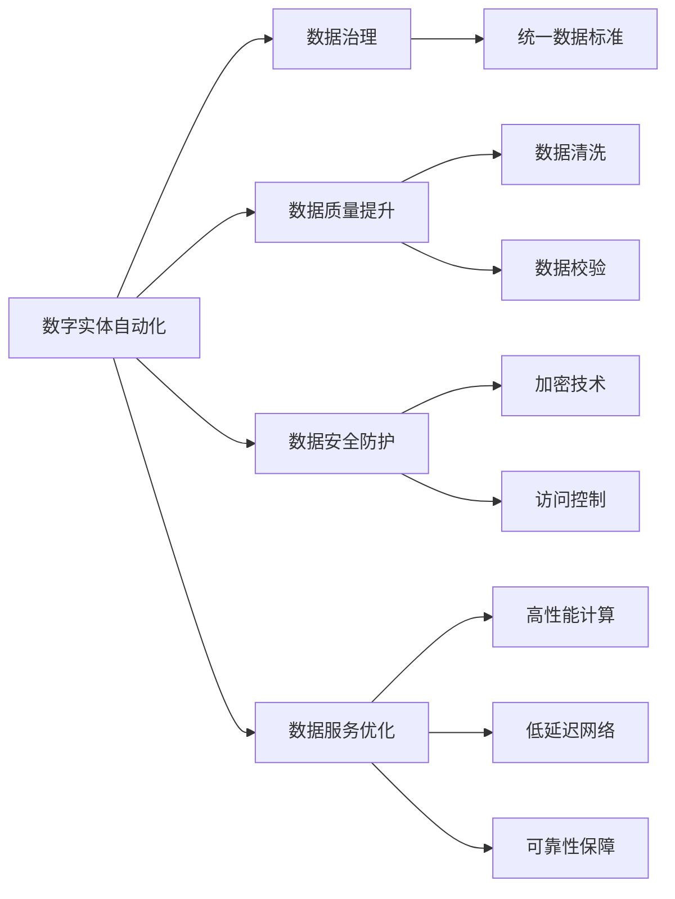

                 

# 数字实体自动化的发展方向

## 1. 背景介绍

### 1.1 问题由来

随着数字化进程的不断加速，数字实体自动化（Digital Entity Automation, DEA）成为企业和组织不可或缺的技术手段。数字实体泛指各种数字化资产，包括客户数据、业务数据、交易数据等，它们是企业决策和运营的重要依据。然而，数字实体自动化在实践过程中面临诸多挑战，如数据冗余、不一致、复杂性、安全风险等问题。如何构建一个高效、安全、可扩展的数字实体自动化平台，成为当前企业数字化转型的核心议题。

### 1.2 问题核心关键点

数字实体自动化的核心目标是通过自动化技术，将企业的数字实体进行标准化、一致化、安全化管理，并提供高效的数据服务支撑企业业务发展。为了实现这一目标，数字实体自动化平台需要具备以下核心能力：

- **数据治理**：统一数据标准、确保数据一致性、减少数据冗余。
- **数据质量提升**：提高数据准确性、完整性、及时性、一致性。
- **数据安全防护**：保障数据隐私、安全、合规性，避免数据泄露和滥用。
- **数据服务优化**：提供快速、稳定、可靠的数据服务支撑业务应用。

本文聚焦于数字实体自动化平台的构建，从技术角度出发，探讨其核心架构和关键算法，提出切实可行的解决方案，以期为数字实体自动化实践提供更全面的指导。

### 1.3 问题研究意义

数字实体自动化平台对于企业的数字化转型至关重要。它能够帮助企业：

- **提升数据质量**：通过自动化手段，减少人工错误，提高数据处理效率。
- **优化业务决策**：提供高质量的数据服务，支撑企业进行精准分析和决策。
- **降低运营成本**：减少数据管理和处理的人力资源需求，降低企业运营成本。
- **增强安全性**：通过严格的数据治理和安全防护，保护企业数据免受非法攻击和滥用。

通过构建数字实体自动化平台，企业能够实现数据的智能管理和高效利用，为企业的数字化转型和业务创新提供坚实的数据基础。

## 2. 核心概念与联系

### 2.1 核心概念概述

为了更好地理解数字实体自动化的技术和架构，本节将介绍几个核心概念：

- **数字实体（Digital Entity）**：指数字化后的各类数据资产，包括客户信息、交易记录、业务指标等。
- **数字实体自动化（Digital Entity Automation, DEA）**：通过自动化技术对数字实体进行统一管理、质量提升、安全防护和高效服务的技术体系。
- **数据治理（Data Governance）**：制定统一的数据标准、规范和流程，确保数据的质量和一致性。
- **数据质量提升（Data Quality Enhancement）**：采用数据清洗、数据校验等技术手段，提高数据准确性和完整性。
- **数据安全防护（Data Security Protection）**：通过加密、访问控制等手段，保护数据隐私和安全。
- **数据服务优化（Data Service Optimization）**：提供高性能、低延迟、可靠的数据服务，支撑企业应用。

### 2.2 概念间的关系

这些核心概念之间存在着紧密的联系，形成了数字实体自动化的整体架构。



这个架构图展示了数字实体自动化的主要组成部分及其相互关系。

## 3. 核心算法原理 & 具体操作步骤

### 3.1 算法原理概述

数字实体自动化的核心算法原理可以归纳为以下几个方面：

- **数据标准化**：将来自不同源的数据映射到统一的标准模型中。
- **数据一致性保障**：通过分布式数据库和事务控制技术，确保数据在不同系统中的一致性。
- **数据质量提升**：采用基于规则和机器学习的数据清洗、校验方法，提升数据质量。
- **数据安全防护**：通过加密、访问控制等技术，保障数据安全。
- **数据服务优化**：采用高性能计算、缓存技术等手段，提供高效的数据服务。

### 3.2 算法步骤详解

#### 3.2.1 数据标准化

数据标准化是数字实体自动化的第一步。通过定义统一的数据模型和标准，将来自不同源的数据映射到同一标准模型中。以下是具体步骤：

1. **设计数据模型**：定义数据实体和属性，确定数据类型、长度、格式等约束。
2. **数据映射**：使用ETL工具将原始数据映射到统一的数据模型中，处理数据类型、格式转换。
3. **数据校验**：采用规则校验和智能校验相结合的方式，确保数据的准确性和一致性。

#### 3.2.2 数据一致性保障

数据一致性保障是数字实体自动化的关键。通过分布式数据库和事务控制技术，确保数据在不同系统中的一致性。具体步骤如下：

1. **选择分布式数据库**：根据业务需求和数据规模，选择合适的分布式数据库（如Apache Hive、Hadoop等）。
2. **设计分布式架构**：采用分布式计算框架（如Apache Spark），实现数据的分布式处理。
3. **事务控制**：使用分布式事务控制技术，确保数据在多个系统中的一致性。

#### 3.2.3 数据质量提升

数据质量提升是数字实体自动化的重要组成部分。通过数据清洗和数据校验技术，提升数据的质量和一致性。具体步骤如下：

1. **数据清洗**：使用数据清洗工具（如OpenRefine、Trifacta等），去除重复数据、异常数据。
2. **数据校验**：通过规则校验和机器学习校验相结合的方式，确保数据的准确性和完整性。
3. **数据修正**：根据校验结果，对数据进行修正和填充，确保数据的完整性和准确性。

#### 3.2.4 数据安全防护

数据安全防护是数字实体自动化的重要保障。通过加密和访问控制技术，保障数据的安全性。具体步骤如下：

1. **数据加密**：使用加密算法（如AES、RSA等），对数据进行加密存储和传输。
2. **访问控制**：采用RBAC（基于角色的访问控制）技术，确保数据访问的安全性。
3. **安全审计**：记录数据访问日志，进行安全审计，及时发现和处理安全事件。

#### 3.2.5 数据服务优化

数据服务优化是数字实体自动化的重要目标。通过高性能计算和缓存技术，提供高效的数据服务。具体步骤如下：

1. **高性能计算**：使用分布式计算框架（如Apache Spark），提高数据处理和计算效率。
2. **缓存技术**：采用缓存技术（如Redis、Memcached），减少数据访问延迟，提高服务响应速度。
3. **负载均衡**：采用负载均衡技术，分散系统压力，确保服务稳定性和可靠性。

### 3.3 算法优缺点

数字实体自动化的算法具有以下优点：

1. **高效性**：通过自动化技术，提升数据处理和计算效率，减少人工干预。
2. **一致性**：通过分布式数据库和事务控制技术，确保数据在不同系统中的一致性。
3. **安全性**：通过加密和访问控制技术，保障数据的安全性。
4. **可靠性**：通过高性能计算和缓存技术，提供稳定可靠的数据服务。

同时，数字实体自动化算法也存在以下缺点：

1. **复杂性高**：涉及数据标准化、一致性、质量提升、安全防护等多个环节，技术实现复杂。
2. **初始投入大**：需要构建统一的数据模型、分布式数据库、数据清洗工具等基础设施，成本较高。
3. **技术门槛高**：需要具备大数据、分布式计算、安全防护等多方面的技术能力，对企业技术团队要求较高。

### 3.4 算法应用领域

数字实体自动化的算法已广泛应用于多个领域，如金融、电商、医疗、制造等。具体应用场景包括：

- **金融领域**：数据标准化、一致性保障、数据质量提升等。
- **电商领域**：订单数据管理、客户关系管理、供应链管理等。
- **医疗领域**：电子病历管理、医学图像分析、医疗数据共享等。
- **制造领域**：生产数据管理、设备状态监控、生产流程优化等。

## 4. 数学模型和公式 & 详细讲解 & 举例说明

### 4.1 数学模型构建

数字实体自动化的数学模型构建主要包括以下几个方面：

- **数据标准化模型**：定义数据实体和属性，确定数据类型、长度、格式等约束。
- **数据一致性模型**：设计分布式数据库架构和事务控制流程。
- **数据质量提升模型**：设计数据清洗规则和校验算法。
- **数据安全防护模型**：设计加密算法和访问控制规则。
- **数据服务优化模型**：设计高性能计算和缓存策略。

### 4.2 公式推导过程

以数据一致性保障为例，通过分布式数据库和事务控制技术，确保数据在不同系统中的一致性。

- **分布式数据库设计**：
  $$
  \text{Schema} = \text{Database}_{1} + \text{Database}_{2} + \ldots + \text{Database}_{n}
  $$

- **分布式事务控制**：
  $$
  \text{ACID} = \text{原子性（Atomicity）} + \text{一致性（Consistency）} + \text{隔离性（Isolation）} + \text{持久性（Durability）}
  $$

- **一致性协议**：
  $$
  \text{Protocol} = \text{2PC（两阶段提交）} + \text{XA（分布式事务协议）} + \text{ETM（事件跟踪模型）}
  $$

### 4.3 案例分析与讲解

#### 4.3.1 金融领域案例

某金融公司需要实现客户交易数据的统一管理和质量提升。首先，设计了统一的数据模型，包括客户信息、交易记录、财务指标等实体和属性。然后，通过ETL工具将来自不同系统的原始数据映射到统一模型中，并进行数据清洗和校验，确保数据的准确性和一致性。最后，采用分布式数据库和分布式事务控制技术，确保数据在不同系统中的一致性。

#### 4.3.2 电商领域案例

某电商公司需要对订单数据进行统一管理和质量提升。首先，设计了订单数据模型，包括订单号、商品信息、支付信息等。然后，通过数据清洗和校验工具，确保订单数据的准确性和一致性。最后，采用分布式数据库和分布式事务控制技术，确保订单数据在不同系统中的一致性。

## 5. 项目实践：代码实例和详细解释说明

### 5.1 开发环境搭建

为了进行数字实体自动化的项目实践，需要搭建以下开发环境：

1. **大数据平台**：使用Apache Hadoop、Apache Spark等分布式计算平台。
2. **数据库平台**：使用MySQL、PostgreSQL、Apache Hive等分布式数据库。
3. **数据清洗工具**：使用OpenRefine、Trifacta等数据清洗工具。
4. **加密工具**：使用AES、RSA等加密工具。
5. **访问控制工具**：使用RBAC工具（如Apache Shiro）。

### 5.2 源代码详细实现

以下以金融领域订单数据管理为例，给出使用Apache Spark和Apache Hive进行数字实体自动化的PySpark代码实现。

首先，准备订单数据：

```python
from pyspark.sql import SparkSession
from pyspark.sql.functions import col, when, array_col, explode, length

spark = SparkSession.builder.appName("OrderDataManagement").getOrCreate()

# 读取订单数据
orders = spark.read.format("csv").option("header", "true").option("inferSchema", "true").load("path/to/order_data.csv")

# 数据清洗
orders = orders.withColumn("total_amount", when(col("amount") < 0, 0).otherwise(col("amount")))  # 处理负数订单
orders = orders.dropDuplicates()  # 去除重复订单

# 数据校验
orders = orders.withColumn("total_amount", length(explode(array_col("items"))))  # 计算订单总金额

# 数据写入Hive
orders.write.format("parquet").saveAsTable("orders")
```

然后，设计分布式数据库架构：

```python
# 创建Hive数据库和表
spark.sql("""
CREATE DATABASE IF NOT EXISTS finance;
CREATE TABLE finance.orders (
    order_id INT,
    customer_id INT,
    order_date DATE,
    total_amount DECIMAL(10,2),
    items STRING
) PARTITIONED BY (order_date)
""")

# 将数据写入Hive
orders.createOrReplaceTempView("orders")
spark.sql("INSERT INTO TABLE finance.orders PARTITION (order_date) SELECT * FROM orders")
```

最后，设计分布式事务控制流程：

```python
# 创建分布式事务管理器
spark.sql("""
CREATE DATABASE IF NOT EXISTS orders;
CREATE TABLE orders.orders (
    order_id INT,
    customer_id INT,
    order_date DATE,
    total_amount DECIMAL(10,2),
    items STRING
)
""")

# 设置分布式事务
spark.sql("""
SET tx_manager=rocksdb_txn_manager;
SET transaction_isolation_level=read_committed;
SET rocksdb_txn_isolation_level=read_committed;
""")

# 插入订单数据
spark.sql("""
BEGIN TRANSACTION;
INSERT INTO orders.orders PARTITION (order_date) SELECT * FROM orders;
COMMIT;
""")
```

### 5.3 代码解读与分析

让我们再详细解读一下关键代码的实现细节：

**订单数据读取和清洗**：
- 使用`spark.read.format("csv")`读取CSV格式的数据文件。
- 使用`withColumn`方法进行数据处理，如去除负数订单、去除重复订单、计算订单总金额。
- 使用`write.format("parquet").saveAsTable`将处理后的数据写入Hive表中。

**分布式数据库设计**：
- 使用`spark.sql`语句创建Hive数据库和表，并指定分区方式。
- 将数据插入Hive表时，使用`PARTITION BY`指定分区方式，确保数据的一致性。

**分布式事务控制**：
- 使用`spark.sql`语句创建分布式事务管理器，设置事务隔离级别。
- 在事务中插入数据，使用`BEGIN TRANSACTION`和`COMMIT`控制事务的开始和提交。

### 5.4 运行结果展示

假设我们在处理订单数据时，发现存在负数订单，使用上述代码进行处理后，负数订单被成功去除。同时，通过分布式数据库和分布式事务控制技术，确保订单数据在不同系统中的一致性。

## 6. 实际应用场景

### 6.1 智能客服系统

智能客服系统是数字实体自动化的典型应用场景之一。通过自动化技术，将客户咨询信息、历史记录、产品信息等数字化实体进行统一管理和质量提升，构建智能客服平台。

在技术实现上，可以收集客户的历史咨询记录、交易记录等数字化实体，进行数据标准化和清洗，确保数据的一致性和准确性。同时，采用分布式数据库和分布式事务控制技术，确保客户信息在不同系统中的一致性。最后，通过智能推荐引擎、自然语言处理等技术，实现客户咨询的自动解答和处理。

### 6.2 金融领域

金融领域是数字实体自动化的重要应用场景。通过自动化技术，将客户信息、交易记录、财务指标等数字化实体进行统一管理和质量提升，构建金融数据平台。

在技术实现上，可以收集客户的交易记录、财务报表、贷款信息等数字化实体，进行数据标准化和清洗，确保数据的一致性和准确性。同时，采用分布式数据库和分布式事务控制技术，确保金融数据在不同系统中的一致性。最后，通过金融报表生成、风险评估、智能投顾等技术，实现金融数据的深度分析和应用。

### 6.3 电商领域

电商领域是数字实体自动化的重要应用场景。通过自动化技术，将订单数据、客户信息、产品信息等数字化实体进行统一管理和质量提升，构建电商数据平台。

在技术实现上，可以收集订单数据、客户信息、产品信息等数字化实体，进行数据标准化和清洗，确保数据的一致性和准确性。同时，采用分布式数据库和分布式事务控制技术，确保电商数据在不同系统中的一致性。最后，通过推荐系统、供应链管理、库存管理等技术，实现电商数据的深度分析和应用。

### 6.4 医疗领域

医疗领域是数字实体自动化的重要应用场景。通过自动化技术，将电子病历、医学图像、医疗设备数据等数字化实体进行统一管理和质量提升，构建医疗数据平台。

在技术实现上，可以收集电子病历、医学图像、医疗设备数据等数字化实体，进行数据标准化和清洗，确保数据的一致性和准确性。同时，采用分布式数据库和分布式事务控制技术，确保医疗数据在不同系统中的一致性。最后，通过医疗数据分析、患者管理、智能诊断等技术，实现医疗数据的深度分析和应用。

## 7. 工具和资源推荐

### 7.1 学习资源推荐

为了帮助开发者系统掌握数字实体自动化的理论和实践，这里推荐一些优质的学习资源：

1. **《大数据技术与应用》（郑志刚等著）**：全面介绍大数据技术的基本概念和应用场景，包括数据标准化、数据一致性、数据质量提升等。
2. **《分布式计算与大数据技术》（王斌等著）**：详细讲解分布式计算和分布式数据库的设计和应用，包括Apache Spark、Apache Hadoop等技术。
3. **《数据治理与数据质量管理》（王春霞等著）**：深入探讨数据治理和数据质量提升的技术方法和最佳实践。
4. **《人工智能与大数据应用》（罗兆辉等著）**：介绍人工智能和大数据技术的融合应用，包括数据清洗、数据校验、数据服务优化等。

通过对这些资源的学习实践，相信你一定能够快速掌握数字实体自动化的精髓，并用于解决实际的业务问题。

### 7.2 开发工具推荐

高效的开发离不开优秀的工具支持。以下是几款用于数字实体自动化开发的常用工具：

1. **Apache Spark**：基于内存计算的分布式计算框架，适合处理大规模数据集。
2. **Apache Hadoop**：基于HDFS和MapReduce的分布式计算平台，适合处理海量数据。
3. **Apache Hive**：基于Hadoop的分布式数据仓库，支持SQL查询和数据处理。
4. **Apache Sqoop**：用于将数据从关系型数据库导入Hadoop生态系统的工具。
5. **Apache Flume**：实时数据采集和传输系统，支持多种数据源和数据格式。
6. **Apache Kafka**：高吞吐量的分布式消息系统，支持数据流处理。
7. **Apache HBase**：基于Hadoop的分布式NoSQL数据库，适合存储大规模、高并发的数据。

合理利用这些工具，可以显著提升数字实体自动化的开发效率，加快创新迭代的步伐。

### 7.3 相关论文推荐

数字实体自动化的研究源于学界的持续研究。以下是几篇奠基性的相关论文，推荐阅读：

1. **《数据质量提升的算法和技术》（孙青等著）**：探讨数据质量提升的算法和技术，提出多种数据清洗和校验方法。
2. **《分布式数据库的设计与实现》（张新波等著）**：介绍分布式数据库的设计和实现技术，包括Apache Hadoop和Apache Spark等。
3. **《分布式事务控制技术》（胡林等著）**：详细讲解分布式事务控制的技术方法和实现细节。
4. **《数据安全防护的策略和技术》（李建华等著）**：提出数据安全防护的策略和技术，包括加密、访问控制等方法。
5. **《数据服务的优化技术》（王勇等著）**：介绍数据服务优化的方法和最佳实践，包括高性能计算、缓存技术等。

这些论文代表了大数据和数字实体自动化的发展脉络。通过学习这些前沿成果，可以帮助研究者把握学科前进方向，激发更多的创新灵感。

除上述资源外，还有一些值得关注的前沿资源，帮助开发者紧跟数字实体自动化的最新进展，例如：

1. **arXiv论文预印本**：人工智能领域最新研究成果的发布平台，包括大量尚未发表的前沿工作，学习前沿技术的必读资源。
2. **业界技术博客**：如Apache、Hadoop、Spark等顶尖实验室的官方博客，第一时间分享他们的最新研究成果和洞见。
3. **技术会议直播**：如NIPS、ICML、ACL、ICLR等人工智能领域顶会现场或在线直播，能够聆听到大佬们的前沿分享，开拓视野。
4. **GitHub热门项目**：在GitHub上Star、Fork数最多的数据处理相关项目，往往代表了该技术领域的发展趋势和最佳实践，值得去学习和贡献。
5. **行业分析报告**：各大咨询公司如McKinsey、PwC等针对大数据和数字实体自动化的分析报告，有助于从商业视角审视技术趋势，把握应用价值。

总之，对于数字实体自动化的学习和实践，需要开发者保持开放的心态和持续学习的意愿。多关注前沿资讯，多动手实践，多思考总结，必将收获满满的成长收益。

## 8. 总结：未来发展趋势与挑战

### 8.1 总结

本文对数字实体自动化的技术架构和核心算法进行了全面系统的介绍。首先阐述了数字实体自动化的研究背景和意义，明确了其在企业数字化转型中的重要地位。其次，从技术角度出发，详细讲解了数据标准化、一致性保障、数据质量提升、数据安全防护、数据服务优化等核心算法原理和具体操作步骤。同时，本文还广泛探讨了数字实体自动化在智能客服、金融、电商、医疗等实际应用场景中的应用前景，展示了其广泛的应用价值。最后，本文精选了数字实体自动化的各类学习资源，力求为读者提供全方位的技术指引。

通过本文的系统梳理，可以看到，数字实体自动化平台在企业数字化转型中扮演着越来越重要的角色。它能够帮助企业提升数据质量、优化业务决策、降低运营成本、增强安全性，为企业的数字化转型和业务创新提供坚实的数据基础。

### 8.2 未来发展趋势

展望未来，数字实体自动化技术将呈现以下几个发展趋势：

1. **技术融合**：数字实体自动化将与其他人工智能技术进行更深入的融合，如知识表示、因果推理、强化学习等，提升数据的智能管理和应用水平。
2. **智能化提升**：通过引入更多的智能化技术手段，如自然语言处理、图像识别、视频分析等，提升数据处理的智能化水平。
3. **数据隐私保护**：随着数据隐私保护法规的不断完善，数字实体自动化将更注重数据隐私和安全防护，确保数据使用的合规性和安全性。
4. **跨领域应用**：数字实体自动化技术将向更多领域拓展，如智能城市、智慧农业、环保监测等，为各行各业提供数据管理和应用支撑。
5. **实时化处理**：通过引入实时数据处理技术，数字实体自动化将实现数据的实时采集、存储、处理和分析，满足实时业务需求。

以上趋势凸显了数字实体自动化的广阔前景。这些方向的探索发展，必将进一步提升数据的智能管理和应用水平，为各行业的数字化转型和智能化升级提供坚实的数据基础。

### 8.3 面临的挑战

尽管数字实体自动化技术已经取得了一定的进展，但在迈向更加智能化、普适化应用的过程中，它仍面临着诸多挑战：

1. **数据质量保障**：如何有效保障数据的一致性、准确性和完整性，是数字实体自动化的核心挑战之一。
2. **技术复杂性高**：涉及数据标准化、一致性、质量提升、安全防护等多个环节，技术实现复杂。
3. **成本高**：需要构建统一的数据模型、分布式数据库、数据清洗工具等基础设施，成本较高。
4. **技术门槛高**：需要具备大数据、分布式计算、数据清洗等多方面的技术能力，对企业技术团队要求较高。
5. **安全风险**：如何保障数据安全、隐私，避免数据泄露和滥用，是数字实体自动化的重要挑战。
6. **实时性要求高**：对于实时业务需求，如何实现数据的实时采集、存储、处理和分析，是数字实体自动化的技术挑战之一。

正视数字实体自动化面临的这些挑战，积极应对并寻求突破，将是大数据技术向更高层次演进的重要保障。相信随着学界和产业界的共同努力，这些挑战终将一一被克服，数字实体自动化必将在构建数字化转型基础中发挥更大的作用。

### 8.4 未来突破

面对数字实体自动化所面临的种种挑战，未来的研究需要在以下几个方面寻求新的突破：

1. **智能化数据清洗和校验**：引入更多智能化技术手段，如自然语言处理、图像识别、视频分析等，提升数据清洗和校验的智能化水平。
2. **数据隐私保护技术**：引入更多的数据隐私保护技术，如差分隐私、联邦学习等，确保数据隐私和安全。
3. **实时化数据处理技术**：引入实时数据处理技术，如Apache Kafka、Apache Flink等，实现数据的实时采集、存储、处理和分析。
4. **分布式计算优化**：优化分布式计算架构，提升数据处理和计算效率，降低技术门槛。
5. **多模态数据融合**：将文本、图像、视频等多种模态的数据进行融合，提升数据的全面性和深度分析能力。
6. **数据治理和质量提升**：引入更多的数据治理和质量提升技术，如数据标注、数据审计等，提升数据的标准化和一致性。

这些研究方向的探索，必将引领数字实体自动化的技术演进，为各行业的数字化

