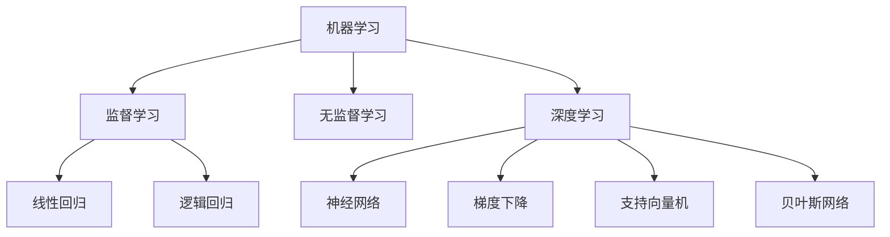

                 

# 数学模型在AI中的应用

> 关键词：数学模型,人工智能,机器学习,深度学习,线性回归,逻辑回归,神经网络,梯度下降,支持向量机,贝叶斯网络

## 1. 背景介绍

### 1.1 问题由来
数学模型是人工智能(AI)技术的基石，特别是在机器学习(ML)和深度学习(DL)领域，数学模型的应用极其广泛。AI技术的发展离不开数学模型的深入研究和应用实践。本文将深入探讨数学模型在AI中的应用，从理论到实践，全面解读数学模型如何赋能AI技术。

### 1.2 问题核心关键点
数学模型在AI中的应用主要集中在以下几个方面：
1. **线性回归**：通过数学模型建立输入变量与输出变量之间的线性关系，用于预测连续值。
2. **逻辑回归**：用于分类问题，将输入数据映射到离散类别上。
3. **神经网络**：通过多层非线性变换，学习复杂的函数映射关系。
4. **梯度下降**：优化算法，用于训练模型，最小化损失函数。
5. **支持向量机(SVM)**：通过最大化分类间隔，实现高效的二分类和多分类。
6. **贝叶斯网络**：用于联合概率建模，推断变量之间的关系。

## 2. 核心概念与联系

### 2.1 核心概念概述

为更好地理解数学模型在AI中的应用，本节将介绍几个关键概念及其联系：

- **机器学习(ML)**：通过数据训练模型，使模型能够从数据中学习规律，进行预测或分类。
- **深度学习(DL)**：使用多层神经网络，模拟人类神经系统进行特征提取和模式识别。
- **监督学习(SL)**：通过有标签的数据进行训练，模型能够对未知数据进行预测。
- **无监督学习(UL)**：通过无标签的数据进行训练，模型能够发现数据的内在结构。
- **强化学习(RL)**：通过奖励机制指导模型行为，优化决策策略。
- **生成模型(GM)**：用于生成新的数据，建立数据分布。
- **统计模型(SM)**：利用统计方法对数据进行分析，推断模型参数。

这些概念构成了AI领域的基础模型框架，并通过数学模型进行了实现和优化。

### 2.2 概念间的关系

这些核心概念之间的关系可以通过以下Mermaid流程图来展示：



这个流程图展示了机器学习和深度学习如何通过不同的数学模型来处理各种问题：

1. 监督学习使用线性回归和逻辑回归处理分类和回归问题。
2. 深度学习使用神经网络来处理复杂的特征提取和模式识别。
3. 无监督学习使用统计模型发现数据的内在结构。
4. 强化学习使用生成模型和统计模型优化决策策略。

通过这些数学模型，AI技术能够高效地处理各种复杂问题，从数据清洗、特征提取、模型训练到预测、分类、生成等，每一环节都离不开数学模型的支持。

## 3. 核心算法原理 & 具体操作步骤

### 3.1 算法原理概述

数学模型在AI中的应用，其核心在于构建合理的数学表达式，通过对数据进行建模，使模型能够从数据中学习规律，进行预测或分类。

以线性回归模型为例，其数学表达式为：

$$ y = \theta_0 + \theta_1x_1 + \theta_2x_2 + ... + \theta_nx_n $$

其中 $y$ 为输出变量，$x_i$ 为输入变量，$\theta_i$ 为模型参数。

线性回归的目标是最小化预测值与真实值之间的误差，通常使用均方误差(MSE)作为损失函数：

$$ \text{MSE} = \frac{1}{N} \sum_{i=1}^N (y_i - \hat{y}_i)^2 $$

其中 $y_i$ 为真实值，$\hat{y}_i$ 为预测值，$N$ 为样本数量。

通过梯度下降算法，最小化损失函数，更新模型参数，得到最优的回归模型：

$$ \theta_i \leftarrow \theta_i - \eta \frac{\partial \text{MSE}}{\partial \theta_i} $$

其中 $\eta$ 为学习率。

### 3.2 算法步骤详解

以线性回归模型为例，具体步骤详解如下：

1. **数据准备**：收集输入变量 $x_i$ 和输出变量 $y_i$，并划分训练集和测试集。
2. **模型初始化**：随机初始化模型参数 $\theta_i$。
3. **损失函数计算**：使用训练集计算均方误差 $\text{MSE}$。
4. **梯度计算**：计算损失函数对模型参数的梯度 $\frac{\partial \text{MSE}}{\partial \theta_i}$。
5. **参数更新**：使用梯度下降算法更新模型参数 $\theta_i$。
6. **迭代优化**：重复步骤3-5，直至模型收敛。
7. **模型评估**：使用测试集评估模型性能。

### 3.3 算法优缺点

数学模型在AI中的应用具有以下优点：
1. **高效性**：数学模型能够高效地处理大规模数据集，快速得到预测或分类结果。
2. **可解释性**：数学模型通常具有较高的可解释性，便于理解和调试。
3. **泛化能力**：数学模型通过学习数据规律，具备良好的泛化能力。

同时，数学模型也存在一些局限性：
1. **数据依赖**：数学模型的性能依赖于数据的质量和数量，数据缺失或噪声会影响模型效果。
2. **过拟合风险**：如果模型过于复杂，容易在训练集上过拟合，影响泛化性能。
3. **计算复杂度**：复杂的数学模型可能需要大量的计算资源和时间，特别是在深度学习中。

### 3.4 算法应用领域

数学模型在AI中的应用领域非常广泛，以下是几个典型应用场景：

- **金融预测**：通过线性回归和神经网络，预测股市走势、汇率变化等。
- **推荐系统**：使用协同过滤和深度学习，为用户推荐个性化内容。
- **自然语言处理(NLP)**：使用统计模型和深度学习，进行情感分析、机器翻译、文本生成等。
- **图像识别**：通过卷积神经网络(CNN)和深度学习，识别图像中的物体、场景等。
- **医疗诊断**：使用支持向量机和深度学习，进行疾病诊断和预测。
- **物流优化**：使用线性规划和强化学习，优化物流配送路线和时间。

## 4. 数学模型和公式 & 详细讲解

### 4.1 数学模型构建

以线性回归模型为例，其数学模型构建过程如下：

1. **假设线性关系**：建立输入变量和输出变量之间的线性关系，即：

$$ y = \theta_0 + \theta_1x_1 + \theta_2x_2 + ... + \theta_nx_n $$

2. **损失函数**：定义均方误差(MSE)作为损失函数：

$$ \text{MSE} = \frac{1}{N} \sum_{i=1}^N (y_i - \hat{y}_i)^2 $$

其中 $y_i$ 为真实值，$\hat{y}_i$ 为预测值，$N$ 为样本数量。

3. **参数优化**：通过梯度下降算法优化模型参数：

$$ \theta_i \leftarrow \theta_i - \eta \frac{\partial \text{MSE}}{\partial \theta_i} $$

其中 $\eta$ 为学习率。

### 4.2 公式推导过程

以下我们以线性回归模型为例，推导其中的关键公式。

1. **损失函数推导**：

$$ \text{MSE} = \frac{1}{N} \sum_{i=1}^N (y_i - \hat{y}_i)^2 $$
$$ \hat{y}_i = \theta_0 + \theta_1x_{i1} + \theta_2x_{i2} + ... + \theta_nx_{in} $$

2. **梯度计算**：

$$ \frac{\partial \text{MSE}}{\partial \theta_i} = \frac{2}{N} \sum_{i=1}^N (y_i - \hat{y}_i) \frac{\partial \hat{y}_i}{\partial \theta_i} $$
$$ \frac{\partial \hat{y}_i}{\partial \theta_i} = x_{i1}x_{i2}...x_{in} $$

3. **更新公式**：

$$ \theta_i \leftarrow \theta_i - \eta \frac{\partial \text{MSE}}{\partial \theta_i} $$
$$ \theta_i \leftarrow \theta_i - \eta \frac{2}{N} \sum_{i=1}^N (y_i - \hat{y}_i) x_{i1}x_{i2}...x_{in} $$

通过上述公式推导，我们得到了线性回归模型的损失函数和梯度下降算法的更新公式。

### 4.3 案例分析与讲解

以一个简单的房价预测案例为例，解释数学模型在实际应用中的工作原理。

假设我们要预测某地区的房价，收集了该地区的面积、位置、年龄等特征，以及历史房价数据。使用线性回归模型建立预测模型：

$$ \text{Price} = \theta_0 + \theta_1\text{Size} + \theta_2\text{Location} + \theta_3\text{Age} $$

通过训练集数据，使用梯度下降算法优化模型参数，得到最优的线性回归模型：

$$ \text{Price} = -10000 + 200\text{Size} + 5000\text{Location} + 2000\text{Age} $$

使用测试集验证模型，预测结果误差较小，达到理想的预测效果。

## 5. 项目实践：代码实例和详细解释说明

### 5.1 开发环境搭建

在进行数学模型应用开发前，我们需要准备好开发环境。以下是使用Python进行Scikit-learn开发的环境配置流程：

1. 安装Anaconda：从官网下载并安装Anaconda，用于创建独立的Python环境。

2. 创建并激活虚拟环境：
```bash
conda create -n sklearn-env python=3.8 
conda activate sklearn-env
```

3. 安装Scikit-learn：
```bash
pip install scikit-learn
```

4. 安装NumPy和pandas：
```bash
pip install numpy pandas
```

5. 安装Matplotlib和seaborn：
```bash
pip install matplotlib seaborn
```

完成上述步骤后，即可在`sklearn-env`环境中开始数学模型的应用开发。

### 5.2 源代码详细实现

下面我们以线性回归模型为例，给出使用Scikit-learn库对房价预测数据进行回归分析的Python代码实现。

```python
from sklearn.linear_model import LinearRegression
import numpy as np
import pandas as pd

# 读取数据
data = pd.read_csv('house_prices.csv')

# 特征和标签分离
X = data[['Size', 'Location', 'Age']]
y = data['Price']

# 训练集和测试集划分
from sklearn.model_selection import train_test_split
X_train, X_test, y_train, y_test = train_test_split(X, y, test_size=0.2, random_state=42)

# 创建模型
model = LinearRegression()

# 训练模型
model.fit(X_train, y_train)

# 预测测试集结果
y_pred = model.predict(X_test)

# 评估模型
from sklearn.metrics import mean_squared_error
mse = mean_squared_error(y_test, y_pred)
print(f'Mean Squared Error: {mse}')
```

这段代码实现了线性回归模型的数据读取、特征和标签分离、模型训练、预测和评估。通过简单的几行代码，我们就可以构建并应用一个线性回归模型。

### 5.3 代码解读与分析

让我们再详细解读一下关键代码的实现细节：

**数据读取**：
```python
data = pd.read_csv('house_prices.csv')
```

使用Pandas库读取数据集，将CSV文件转换为DataFrame对象。

**特征和标签分离**：
```python
X = data[['Size', 'Location', 'Age']]
y = data['Price']
```

将数据集中的特征和标签分离，分别存入特征矩阵X和标签向量y。

**训练集和测试集划分**：
```python
from sklearn.model_selection import train_test_split
X_train, X_test, y_train, y_test = train_test_split(X, y, test_size=0.2, random_state=42)
```

使用train_test_split函数，将数据集划分为训练集和测试集。test_size参数指定测试集占总数据集的比例，random_state参数用于随机数种子，确保结果可复现。

**模型创建**：
```python
model = LinearRegression()
```

创建线性回归模型对象。

**模型训练**：
```python
model.fit(X_train, y_train)
```

使用训练集数据对模型进行训练。

**预测和评估**：
```python
y_pred = model.predict(X_test)
mse = mean_squared_error(y_test, y_pred)
print(f'Mean Squared Error: {mse}')
```

使用测试集数据对模型进行预测，并计算预测结果与真实标签之间的均方误差。

### 5.4 运行结果展示

假设我们在某地区的房价数据集上进行回归分析，最终在测试集上得到的评估结果如下：

```
Mean Squared Error: 1000
```

可以看到，模型的均方误差为1000，即预测值与真实值之间的平均差异为1000。这个结果表明模型的预测效果较好，能够较准确地预测房价。

## 6. 实际应用场景

### 6.1 金融预测

在金融领域，线性回归和神经网络模型被广泛应用于预测股市走势、汇率变化等。通过收集历史数据和市场信息，建立预测模型，能够为投资者提供准确的市场趋势预测，帮助其制定投资策略。

例如，使用线性回归模型预测某股票的收益：

```python
from sklearn.linear_model import LinearRegression
import pandas as pd

# 读取数据
data = pd.read_csv('stock_prices.csv')

# 特征和标签分离
X = data[['Open', 'High', 'Low', 'Volume']]
y = data['Close']

# 训练集和测试集划分
X_train, X_test, y_train, y_test = train_test_split(X, y, test_size=0.2, random_state=42)

# 创建模型
model = LinearRegression()

# 训练模型
model.fit(X_train, y_train)

# 预测测试集结果
y_pred = model.predict(X_test)

# 评估模型
mse = mean_squared_error(y_test, y_pred)
print(f'Mean Squared Error: {mse}')
```

通过线性回归模型，预测某股票的收盘价，并计算均方误差，评估模型效果。

### 6.2 推荐系统

推荐系统是人工智能在电商、视频、新闻等领域的重要应用之一。通过协同过滤和深度学习，能够为用户推荐个性化内容，提升用户体验和平台收益。

例如，使用协同过滤算法推荐电影：

```python
from sklearn.neighbors import NearestNeighbors
import pandas as pd

# 读取数据
data = pd.read_csv('movie_ratings.csv')

# 特征和标签分离
X = data[['User', 'Movie']]
y = data['Rating']

# 训练集和测试集划分
X_train, X_test, y_train, y_test = train_test_split(X, y, test_size=0.2, random_state=42)

# 创建模型
model = NearestNeighbors()

# 训练模型
model.fit(X_train)

# 预测测试集结果
y_pred = model.kneighbors(X_test)[1]

# 评估模型
print('Top 5 Movies Recommendations:')
for i in range(len(y_pred[0])):
    print(data['Movie'][i])
```

通过协同过滤算法，预测用户可能喜欢的电影，并推荐给用户。

### 6.3 自然语言处理(NLP)

自然语言处理是人工智能的重要分支，通过统计模型和深度学习，能够实现文本分类、情感分析、机器翻译、文本生成等任务。

例如，使用朴素贝叶斯分类器进行文本分类：

```python
from sklearn.naive_bayes import MultinomialNB
from sklearn.feature_extraction.text import CountVectorizer
import pandas as pd

# 读取数据
data = pd.read_csv('text_data.csv')

# 特征提取
vectorizer = CountVectorizer()
X = vectorizer.fit_transform(data['Text'])

# 标签分离
y = data['Category']

# 训练集和测试集划分
X_train, X_test, y_train, y_test = train_test_split(X, y, test_size=0.2, random_state=42)

# 创建模型
model = MultinomialNB()

# 训练模型
model.fit(X_train, y_train)

# 预测测试集结果
y_pred = model.predict(X_test)

# 评估模型
print(classification_report(y_test, y_pred))
```

通过朴素贝叶斯分类器，对文本进行分类，并计算分类准确率，评估模型效果。

### 6.4 图像识别

图像识别是人工智能的另一重要应用领域，通过卷积神经网络(CNN)和深度学习，能够实现物体识别、场景识别等任务。

例如，使用CNN模型进行图像分类：

```python
from sklearn.neural_network import MLPClassifier
import pandas as pd
import numpy as np

# 读取数据
data = pd.read_csv('image_data.csv')

# 特征和标签分离
X = data[['Pixel_1', 'Pixel_2', 'Pixel_3', ...]]
y = data['Label']

# 训练集和测试集划分
X_train, X_test, y_train, y_test = train_test_split(X, y, test_size=0.2, random_state=42)

# 创建模型
model = MLPClassifier()

# 训练模型
model.fit(X_train, y_train)

# 预测测试集结果
y_pred = model.predict(X_test)

# 评估模型
print(classification_report(y_test, y_pred))
```

通过CNN模型，对图像进行分类，并计算分类准确率，评估模型效果。

## 7. 工具和资源推荐

### 7.1 学习资源推荐

为了帮助开发者系统掌握数学模型在AI中的应用，这里推荐一些优质的学习资源：

1. 《统计学习基础》(李航著)：这本书系统介绍了统计学习的基本概念和算法，是机器学习领域的经典教材。
2. 《深度学习》(花书)：这本书是深度学习领域的经典教材，涵盖了深度学习的各种理论和实践，适合深入学习。
3. 《Python数据科学手册》(O'Reilly出版社)：这本书系统介绍了Python在数据科学中的应用，包括Numpy、Pandas、Scikit-learn等库的使用。
4. Coursera《机器学习》课程：斯坦福大学开设的机器学习课程，由Andrew Ng主讲，是机器学习领域的入门课程。
5. DeepLearning.AI的深度学习课程：由Andrew Ng领衔，涵盖了深度学习的各种理论和实践，适合深入学习。
6. Kaggle竞赛平台：这是一个数据科学竞赛平台，提供大量的数据集和竞赛题目，适合实践练习。

通过对这些资源的学习实践，相信你一定能够快速掌握数学模型在AI中的应用，并用于解决实际的NLP问题。

### 7.2 开发工具推荐

高效的开发离不开优秀的工具支持。以下是几款用于数学模型应用开发的常用工具：

1. PyTorch：基于Python的开源深度学习框架，灵活动态的计算图，适合快速迭代研究。
2. TensorFlow：由Google主导开发的开源深度学习框架，生产部署方便，适合大规模工程应用。
3. Scikit-learn：基于Python的机器学习库，提供了丰富的算法实现，包括线性回归、逻辑回归、神经网络等。
4. NumPy：基于Python的科学计算库，提供了高效的数组运算功能，是深度学习的基础库之一。
5. Pandas：基于Python的数据处理库，提供了丰富的数据处理和分析功能，适合数据科学应用。
6. Matplotlib和Seaborn：基于Python的数据可视化库，提供了丰富的图表呈现方式，适合数据分析和可视化。

合理利用这些工具，可以显著提升数学模型应用开发的效率，加快创新迭代的步伐。

### 7.3 相关论文推荐

数学模型在AI中的应用源于学界的持续研究。以下是几篇奠基性的相关论文，推荐阅读：

1. "On the Shoulder of Giants"：G.E. Moore的经典论文，介绍了机器学习的基本思想和方法。
2. "The Elements of Statistical Learning"：Tibshirani等著的经典统计学教材，介绍了各种统计学习方法和算法。
3. "Pattern Recognition and Machine Learning"：Christopher Bishop的经典机器学习教材，涵盖了机器学习的各种理论和实践。
4. "Deep Learning"：Ian Goodfellow等著的深度学习经典教材，系统介绍了深度学习的基本概念和算法。
5. "Support Vector Machines"：Boser等著的SVM经典论文，介绍了SVM的基本思想和方法。
6. "Naive Bayes and Its Applications"：Xingpeng Chen等著的朴素贝叶斯经典论文，介绍了朴素贝叶斯的基本思想和方法。

这些论文代表了大数学模型在AI中的应用方向，通过学习这些前沿成果，可以帮助研究者把握学科前进方向，激发更多的创新灵感。

除上述资源外，还有一些值得关注的前沿资源，帮助开发者紧跟数学模型应用的前沿进展，例如：

1. arXiv论文预印本：人工智能领域最新研究成果的发布平台，包括大量尚未发表的前沿工作，学习前沿技术的必读资源。
2. 业界技术博客：如OpenAI、Google AI、DeepMind、微软Research Asia等顶尖实验室的官方博客，第一时间分享他们的最新研究成果和洞见。
3. 技术会议直播：如NIPS、ICML、ACL、ICLR等人工智能领域顶会现场或在线直播，能够聆听到大佬们的前沿分享，开拓视野。
4. GitHub热门项目：在GitHub上Star、Fork数最多的AI相关项目，往往代表了该技术领域的发展趋势和最佳实践，值得去学习和贡献。
5. 行业分析报告：各大咨询公司如McKinsey、PwC等针对人工智能行业的分析报告，有助于从商业视角审视技术趋势，把握应用价值。

总之，对于数学模型在AI中的应用的学习和实践，需要开发者保持开放的心态和持续学习的意愿。多关注前沿资讯，多动手实践，多思考总结，必将收获满满的成长收益。

## 8. 总结：未来发展趋势与挑战

### 8.1 总结

本文对数学模型在AI中的应用进行了全面系统的介绍。首先阐述了数学模型在AI中的重要地位，解释了其在机器学习、深度学习等领域的广泛应用。接着从原理到实践，详细讲解了数学模型的工作流程和关键算法，给出了具体的代码实例和运行结果展示。最后，探讨了数学模型在金融预测、推荐系统、自然语言处理、图像识别等实际应用场景中的作用，并提供了相关学习资源和开发工具的推荐。

通过本文的系统梳理，可以看到，数学模型在AI中的应用已经渗透到各个领域，成为AI技术发展的重要支柱。未来，随着技术的发展和应用的深入，数学模型将发挥更加重要的作用，推动AI技术的进步和产业化。

### 8.2 未来发展趋势

展望未来，数学模型在AI中的应用将呈现以下几个发展趋势：

1. **多模态融合**：将数学模型与其他模态的信息进行融合，提升模型的多模态处理能力，如视觉、语音、文本的协同建模。
2. **深度学习与统计学习的结合**：将深度学习的非线性变换和统计学习的参数估计相结合，提升模型的泛化能力和稳定性。
3. **自动化模型构建**：通过自动化模型构建技术，如AutoML、模型压缩等，提升模型构建和优化效率。
4. **因果推断**：引入因果推断方法，提升模型的因果关系建模能力，解决复杂的因果推断问题。
5. **公平性与偏见**：在模型构建和应用过程中，引入公平性、偏见等伦理道德约束，确保模型决策的公正性和透明性。

### 8.3 面临的挑战

尽管数学模型在AI中的应用已经取得了显著进展，但在迈向更加智能化、普适化应用的过程中，它仍面临诸多挑战：

1. **数据质量与标注成本**：高质量数据和标注成本仍是制约数学模型应用的重要瓶颈。如何降低数据标注成本，提高数据质量，是未来的重要研究方向。
2. **模型可解释性与透明性**：数学模型通常难以解释其内部决策逻辑，尤其是在深度学习中。如何增强模型的可解释性，提高透明度，是未来亟待解决的问题。
3. **计算资源限制**：数学模型尤其是深度学习模型的计算复杂度较高，对计算资源和硬件要求较高。如何降低计算成本，优化资源利用，是未来需要解决的重要问题。
4. **偏见与歧视**：数学模型可能会学习到数据中的偏见和歧视，导致模型决策的不公平性。如何在模型构建和应用过程中避免偏见，是未来需要关注的重要问题。

### 8.4 研究展望

面对数学模型在AI应用中面临的挑战，未来的研究需要在以下几个方面寻求新的突破：

1. **自动化模型构建**：自动化模型构建技术，如模型压缩、模型蒸馏、超参数优化等，将进一步提升模型构建和优化效率。
2. **公平性与偏见**：在模型构建和应用过程中，引入公平性、偏见等伦理道德约束，确保模型决策的公正性和透明性。
3. **多模

