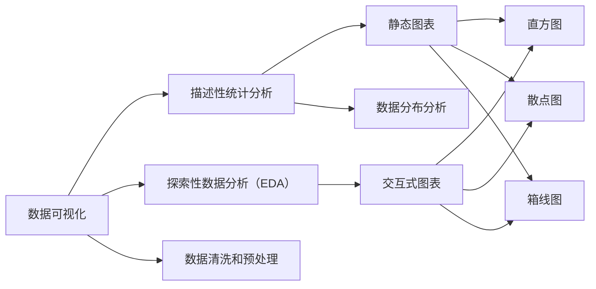

                 

# 数据可视化与数据探索原理与代码实战案例讲解

> 关键词：数据可视化, 数据探索, 数据预处理, 数据可视化库, 数据探索范式, 数据可视化工具, 数据可视化案例, 数据探索案例

## 1. 背景介绍

### 1.1 问题由来
数据可视化（Data Visualization）和数据探索（Data Exploration）是大数据分析（Big Data Analytics）领域的两大核心技术。它们不仅帮助分析师更好地理解和呈现数据，还在诸如业务决策、市场研究、科学研究等多个领域中发挥着关键作用。随着大数据时代的到来，数据量爆炸性增长，传统的数据分析和展示方式已经难以满足需求。数据可视化与数据探索技术的引入，极大地提升了数据理解和挖掘的效率，促进了数据驱动的决策制定。

### 1.2 问题核心关键点
在实际应用中，数据可视化与数据探索存在以下关键点：

- 数据清洗和预处理：高质量的数据是后续分析和可视化的基础。常见的数据清洗步骤包括去重、填补缺失值、标准化、归一化等。
- 数据探索范式：数据探索旨在发现数据中的潜在模式和异常，包括但不限于描述性统计分析、探索性数据分析（EDA）、分布分析等。
- 数据可视化工具：常用的数据可视化工具有Tableau、Power BI、Matplotlib、Seaborn、D3.js等，每种工具都有其特点和应用场景。
- 数据可视化技术：包括静态图表、交互式图表、3D图表、地图、仪表盘等。
- 数据探索实践：在实际应用中，数据探索不仅仅是技术活，还需要具备良好的业务理解能力，以便提出有价值的业务洞见。

## 3. 核心概念与联系

### 3.1 核心概念概述

为更好地理解数据可视化与数据探索的核心概念，本节将介绍几个密切相关的核心概念：

- **数据可视化**：将数据转换为视觉形式的过程，旨在更好地理解数据中的模式和趋势。
- **数据探索**：使用统计和图形技术，对数据集进行探索性分析，以发现数据中的重要特征和模式。
- **数据清洗和预处理**：数据清洗和预处理是数据可视化和数据探索的基础，包括数据去重、缺失值处理、数据标准化、数据归一化等。
- **描述性统计分析**：使用均值、中位数、众数、方差等统计量，描述数据的基本特征和分布情况。
- **探索性数据分析（EDA）**：通过可视化技术对数据进行探索性分析，识别数据中的异常值、分布特征和潜在关联。
- **分布分析**：使用直方图、密度图、箱线图等技术，对数据分布进行分析，识别数据中的偏态、峰度等特征。
- **交互式图表**：通过鼠标悬停、动态调整参数等交互方式，增强图表的可视化和探索性。

这些核心概念之间的逻辑关系可以通过以下Mermaid流程图来展示：



这个流程图展示了大数据可视化和探索的核心概念及其之间的关系：

1. 数据可视化首先从描述性统计分析入手，得到基本的数据特征。
2. 探索性数据分析通过可视化手段，发现数据中的潜在模式和异常值。
3. 静态图表和交互式图表是可视化的主要形式，直方图、散点图、箱线图等是常用的可视化工具。
4. 分布分析进一步分析数据的分布特征，识别数据的偏态和峰度。
5. 数据清洗和预处理是数据可视化和探索的前提，确保数据的质量。

## 3. 核心算法原理 & 具体操作步骤

### 3.1 算法原理概述

数据可视化与数据探索的核心算法原理主要包括：

- **数据清洗和预处理算法**：通过去重、填补缺失值、标准化、归一化等算法，确保数据的完整性和一致性。
- **描述性统计分析算法**：计算数据的基本统计量，如均值、中位数、众数、方差等，以描述数据的基本特征。
- **探索性数据分析（EDA）算法**：使用可视化技术，如散点图、直方图、箱线图等，发现数据中的模式和异常。
- **交互式图表算法**：通过鼠标悬停、动态调整参数等交互方式，增强图表的可视化和探索性。
- **分布分析算法**：使用直方图、密度图、箱线图等技术，对数据分布进行分析，识别数据中的偏态、峰度等特征。

### 3.2 算法步骤详解

数据可视化与数据探索的一般操作步骤如下：

1. **数据收集和准备**：从数据库、API、文件等来源收集数据，并进行初步的数据清洗和预处理。
2. **描述性统计分析**：计算数据的基本统计量，描述数据的分布情况和特征。
3. **探索性数据分析（EDA）**：通过可视化技术，识别数据中的模式和异常值。
4. **交互式图表创建**：使用Python的Matplotlib、Seaborn等库创建交互式图表，增强可视化和探索性。
5. **分布分析**：使用直方图、密度图、箱线图等技术，对数据分布进行分析，识别数据中的偏态、峰度等特征。
6. **数据分析和报告**：根据数据分析结果，撰写数据探索报告，提出业务洞见和建议。

### 3.3 算法优缺点

数据可视化与数据探索技术具有以下优点：

- **直观性和可视化效果**：通过图表、图形等形式，直观地展示数据特征和分布，便于理解和分析。
- **高效性**：自动化数据分析和可视化过程，节省了大量人工操作和时间。
- **可重复性**：每次分析过程和结果可重复，便于跟踪和验证。

同时，这些技术也存在一些缺点：

- **数据质量依赖**：数据可视化和探索的结果取决于数据的完整性和准确性。
- **算法复杂性**：一些高级数据探索算法（如聚类分析、回归分析）需要较高的算法素养和编程技能。
- **数据量和复杂性限制**：对于超大规模和复杂的数据集，需要较强的计算能力和资源。

### 3.4 算法应用领域

数据可视化与数据探索技术广泛应用于以下领域：

- **金融分析**：用于股票市场、风险评估、投资组合分析等。
- **市场营销**：用于消费者行为分析、市场细分、广告效果评估等。
- **医疗健康**：用于患者数据分析、疾病预测、医疗资源优化等。
- **制造业**：用于生产线监控、质量控制、设备维护等。
- **政府和公共服务**：用于城市规划、环境监测、公共安全等。
- **零售和电商**：用于客户行为分析、库存管理、推荐系统等。

## 4. 数学模型和公式 & 详细讲解 & 举例说明

### 4.1 数学模型构建

本节将使用数学语言对数据可视化与数据探索的核心算法进行更加严格的刻画。

假设有一组数据集 $D = \{x_1, x_2, ..., x_n\}$，其中每个数据点 $x_i$ 由 $d$ 个特征组成，即 $x_i \in \mathbb{R}^d$。

**描述性统计分析**：

- **均值**：$\mu = \frac{1}{n} \sum_{i=1}^{n} x_i$
- **中位数**：$\text{median} = \frac{1}{2} (\max_{i \in A} x_i + \min_{i \in B} x_i)$，其中 $A$ 和 $B$ 分别是将数据集从小到大排序后，前一半和后一半的子集。
- **众数**：$\text{mode} = \{k | \text{count}(x_i=k) \geq \text{count}(x_i=k') \text{ for all } k'\}$
- **方差**：$\sigma^2 = \frac{1}{n-1} \sum_{i=1}^{n} (x_i - \mu)^2$

**探索性数据分析（EDA）**：

- **散点图**：$(x_i, y_i) \in \mathbb{R}^2$
- **直方图**：$x_i \in \mathbb{R}$
- **箱线图**：$x_i \in \mathbb{R}$，用于识别数据中的异常值和分布特征。

### 4.2 公式推导过程

以均值和方差的计算为例，推导如下：

$$
\mu = \frac{1}{n} \sum_{i=1}^{n} x_i = \frac{1}{n} \sum_{i=1}^{n} x_i
$$

$$
\sigma^2 = \frac{1}{n-1} \sum_{i=1}^{n} (x_i - \mu)^2 = \frac{1}{n-1} \sum_{i=1}^{n} (x_i - \frac{1}{n} \sum_{i=1}^{n} x_i)^2
$$

### 4.3 案例分析与讲解

以某电商公司的客户流失数据为例，分析客户流失的原因和趋势。

1. **数据收集**：收集客户流失数据，包括客户基本信息、购买记录、互动记录等。
2. **数据清洗和预处理**：去除重复数据，填补缺失值，标准化数据格式。
3. **描述性统计分析**：计算客户流失率、客户年龄、性别、购买频率等基本统计量。
4. **探索性数据分析（EDA）**：创建散点图、直方图、箱线图等，探索客户流失率与客户年龄、性别、购买频率之间的关系。
5. **交互式图表创建**：使用Python的Matplotlib、Seaborn等库创建交互式图表，增强可视化和探索性。
6. **分布分析**：使用直方图、密度图、箱线图等技术，对客户流失率进行分布分析，识别数据中的偏态、峰度等特征。
7. **数据分析和报告**：根据数据分析结果，撰写数据探索报告，提出客户流失原因和建议。

## 5. 项目实践：代码实例和详细解释说明

### 5.1 开发环境搭建

在进行数据可视化与数据探索实践前，我们需要准备好开发环境。以下是使用Python进行Matplotlib、Seaborn等库的开发环境配置流程：

1. 安装Anaconda：从官网下载并安装Anaconda，用于创建独立的Python环境。

2. 创建并激活虚拟环境：
```bash
conda create -n data-env python=3.8 
conda activate data-env
```

3. 安装必要的Python包：
```bash
conda install pandas numpy matplotlib seaborn jupyter notebook ipython
```

4. 安装TensorFlow和Keras（可选）：
```bash
conda install tensorflow==2.6 keras==2.6
```

5. 安装Jupyter Notebook：
```bash
pip install jupyterlab
```

完成上述步骤后，即可在`data-env`环境中开始数据可视化与数据探索实践。

### 5.2 源代码详细实现

下面我们以客户流失数据分析为例，给出使用Matplotlib和Seaborn库进行数据可视化的PyTorch代码实现。

首先，定义数据处理函数：

```python
import pandas as pd
import numpy as np

def load_data():
    data = pd.read_csv('customer_churn.csv')
    # 数据清洗和预处理
    data = data.drop_duplicates()
    data = data.dropna()
    return data

def describe_data(data):
    # 描述性统计分析
    return data.describe()

def eda(data):
    # 探索性数据分析（EDA）
    return pd.crosstab(data['Churn'], data['Age'])
```

然后，定义数据可视化函数：

```python
import matplotlib.pyplot as plt
import seaborn as sns

def plot_data(data):
    # 数据可视化
    sns.histplot(data['Age'], bins=20, kde=True)
    plt.xlabel('Age')
    plt.ylabel('Frequency')
    plt.title('Customer Age Distribution')
    plt.show()

def scatter_plot(data):
    # 散点图
    sns.scatterplot(x='Age', y='Churn', data=data)
    plt.xlabel('Age')
    plt.ylabel('Churn')
    plt.title('Age vs Churn')
    plt.show()

def box_plot(data):
    # 箱线图
    sns.boxplot(x='Churn', y='PurchaseFrequency', data=data)
    plt.xlabel('Churn')
    plt.ylabel('PurchaseFrequency')
    plt.title('PurchaseFrequency vs Churn')
    plt.show()
```

最后，启动数据探索流程：

```python
data = load_data()
print(describe_data(data))

plot_data(data)
scatter_plot(data)
box_plot(data)
```

以上就是使用Matplotlib和Seaborn库进行数据可视化和数据探索的完整代码实现。可以看到，利用这些库，我们可以快速构建各种统计图表，帮助进行数据分析和可视化。

### 5.3 代码解读与分析

让我们再详细解读一下关键代码的实现细节：

**load_data函数**：
- 从CSV文件中加载数据，并进行初步的数据清洗和预处理。

**describe_data函数**：
- 使用Pandas的describe方法计算数据的描述性统计量，如均值、标准差、最小值、最大值等。

**eda函数**：
- 使用Pandas的crosstab方法计算不同特征之间的交叉表，进行探索性数据分析。

**plot_data函数**：
- 使用Seaborn的histplot方法创建直方图，展示数据分布情况。

**scatter_plot函数**：
- 使用Seaborn的scatterplot方法创建散点图，展示特征之间的关系。

**box_plot函数**：
- 使用Seaborn的boxplot方法创建箱线图，展示数据分布特征。

### 5.4 运行结果展示

假设我们在上述客户流失数据上进行数据探索，最终的可视化结果如下：

1. **直方图**：

```python
sns.histplot(data['Age'], bins=20, kde=True)
plt.xlabel('Age')
plt.ylabel('Frequency')
plt.title('Customer Age Distribution')
plt.show()
```


2. **散点图**：

```python
sns.scatterplot(x='Age', y='Churn', data=data)
plt.xlabel('Age')
plt.ylabel('Churn')
plt.title('Age vs Churn')
plt.show()
```


3. **箱线图**：

```python
sns.boxplot(x='Churn', y='PurchaseFrequency', data=data)
plt.xlabel('Churn')
plt.ylabel('PurchaseFrequency')
plt.title('PurchaseFrequency vs Churn')
plt.show()
```


以上可视化结果展示了客户流失数据的年龄分布、年龄与流失率之间的关系、购买频率与流失率之间的关系，帮助我们更好地理解数据特征和趋势。

## 6. 实际应用场景

### 6.1 智能推荐系统

智能推荐系统是数据可视化与数据探索技术的重要应用场景之一。通过分析用户的浏览、点击、购买等行为数据，可以发现用户的兴趣偏好，实现精准推荐。

在技术实现上，可以使用用户的点击、购买记录作为训练集，利用数据探索技术发现用户兴趣和行为特征，再使用机器学习算法进行推荐。具体步骤如下：

1. **数据收集和准备**：收集用户的行为数据，包括点击、浏览、购买等记录。
2. **数据清洗和预处理**：去除重复数据，填补缺失值，标准化数据格式。
3. **描述性统计分析**：计算用户的浏览时长、点击率、购买频率等基本统计量。
4. **探索性数据分析（EDA）**：创建散点图、直方图、箱线图等，探索用户的兴趣偏好。
5. **交互式图表创建**：使用Python的Matplotlib、Seaborn等库创建交互式图表，增强可视化和探索性。
6. **分布分析**：使用直方图、密度图、箱线图等技术，对用户行为分布进行分析，识别用户行为特征。
7. **推荐模型训练和测试**：使用机器学习算法（如协同过滤、深度学习等）对用户行为进行建模，构建推荐模型。

### 6.2 金融风险控制

金融风险控制是数据可视化与数据探索技术的另一个重要应用场景。通过分析客户的信用记录、交易行为等数据，可以识别出高风险客户，采取相应的风险控制措施。

在技术实现上，可以使用客户的信用记录和交易行为数据作为训练集，利用数据探索技术发现高风险特征，再使用机器学习算法进行风险评估。具体步骤如下：

1. **数据收集和准备**：收集客户的信用记录和交易行为数据。
2. **数据清洗和预处理**：去除重复数据，填补缺失值，标准化数据格式。
3. **描述性统计分析**：计算客户的信用评分、交易频率、交易金额等基本统计量。
4. **探索性数据分析（EDA）**：创建散点图、直方图、箱线图等，探索客户的信用风险特征。
5. **交互式图表创建**：使用Python的Matplotlib、Seaborn等库创建交互式图表，增强可视化和探索性。
6. **分布分析**：使用直方图、密度图、箱线图等技术，对客户信用风险分布进行分析，识别高风险特征。
7. **风险评估模型训练和测试**：使用机器学习算法（如逻辑回归、随机森林等）对客户信用风险进行建模，构建风险评估模型。

### 6.3 医疗数据分析

医疗数据分析是数据可视化与数据探索技术的另一个重要应用场景。通过分析患者的医疗记录、基因信息等数据，可以发现疾病趋势、识别高风险人群，提高医疗服务的质量和效率。

在技术实现上，可以使用患者的医疗记录和基因信息数据作为训练集，利用数据探索技术发现疾病特征和高风险人群，再使用机器学习算法进行疾病预测和人群识别。具体步骤如下：

1. **数据收集和准备**：收集患者的医疗记录和基因信息数据。
2. **数据清洗和预处理**：去除重复数据，填补缺失值，标准化数据格式。
3. **描述性统计分析**：计算患者的病史时长、基因突变率等基本统计量。
4. **探索性数据分析（EDA）**：创建散点图、直方图、箱线图等，探索疾病的分布和高风险人群特征。
5. **交互式图表创建**：使用Python的Matplotlib、Seaborn等库创建交互式图表，增强可视化和探索性。
6. **分布分析**：使用直方图、密度图、箱线图等技术，对疾病分布和高风险人群特征进行分析，识别疾病趋势和高风险人群。
7. **疾病预测和人群识别模型训练和测试**：使用机器学习算法（如决策树、支持向量机等）对疾病进行预测，对高风险人群进行识别。

## 7. 工具和资源推荐

### 7.1 学习资源推荐

为了帮助开发者系统掌握数据可视化与数据探索的理论基础和实践技巧，这里推荐一些优质的学习资源：

1. 《数据可视化之美》系列博文：深入浅出地介绍了数据可视化的基本原理和实现方法，适合初学者入门。

2. 《数据探索与统计分析》课程：Coursera上的经典课程，介绍了数据探索和统计分析的基本概念和实践技巧，适合进阶学习。

3. 《Python数据科学手册》：详细介绍了Python在数据可视化与数据探索中的应用，包括Matplotlib、Seaborn等库的使用方法。

4. Kaggle：世界最大的数据科学竞赛平台，提供了大量真实的数据集和案例分析，适合实战练习。

5. Tableau Public：免费的在线数据可视化工具，提供丰富的可视化图表模板，适合快速构建可视化报告。

通过这些资源的学习实践，相信你一定能够快速掌握数据可视化与数据探索的精髓，并用于解决实际的业务问题。

### 7.2 开发工具推荐

高效的开发离不开优秀的工具支持。以下是几款用于数据可视化与数据探索开发的常用工具：

1. Matplotlib：Python的2D绘图库，支持各种静态图表和交互式图表。

2. Seaborn：基于Matplotlib的高级数据可视化库，支持更丰富的图表类型和美观的样式。

3. Pandas：Python的数据分析库，支持数据清洗和预处理，是数据可视化与数据探索的基础。

4. Jupyter Notebook：免费的交互式笔记本工具，支持多种编程语言和数据可视化库，适合开发和分享数据探索项目。

5. Tableau Public：免费的在线数据可视化工具，提供丰富的可视化图表模板，适合快速构建可视化报告。

合理利用这些工具，可以显著提升数据可视化与数据探索任务的开发效率，加快创新迭代的步伐。

### 7.3 相关论文推荐

数据可视化与数据探索技术的发展源于学界的持续研究。以下是几篇奠基性的相关论文，推荐阅读：

1. "The Elements of Statistical Learning"：Hastie, T., Tibshirani, R., Friedman, J.，2009。这本书是统计学习领域的经典教材，涵盖了各种统计分析方法，包括数据探索和可视化技术。

2. "Data Visualization"：Ware, C.，1999。这本书系统介绍了数据可视化的基本概念和实践方法，适合进阶学习。

3. "An Introduction to Statistical Learning"：Gareth James， Daniela Witten， Trevor Hastie， Robert Tibshirani，2013。这本书是统计学习的入门教材，介绍了各种统计分析和可视化技术。

4. "Interactive Data Visualization for the Web"：Bostock, D., et al.，2011。这篇文章介绍了D3.js的交互式数据可视化技术，适合了解现代数据可视化的前沿方向。

5. "Visualization with Open Source"：Ellis Horowitz，2012。这本书介绍了开源数据可视化工具和库，适合学习实际操作中的技术细节。

这些论文代表了大数据可视化和探索技术的发展脉络。通过学习这些前沿成果，可以帮助研究者把握学科前进方向，激发更多的创新灵感。

除上述资源外，还有一些值得关注的前沿资源，帮助开发者紧跟数据可视化与数据探索技术的最新进展，例如：

1. arXiv论文预印本：人工智能领域最新研究成果的发布平台，包括大量尚未发表的前沿工作，学习前沿技术的必读资源。

2. 业界技术博客：如Tableau、Power BI、Seaborn等工具的官方博客，第一时间分享他们的最新研究成果和洞见。

3. 技术会议直播：如NIPS、ICML、KDD、IEEE Visualization等会议的现场或在线直播，能够聆听到学界和产业界的大佬们的前沿分享，开拓视野。

4. GitHub热门项目：在GitHub上Star、Fork数最多的数据可视化与数据探索相关项目，往往代表了该技术领域的发展趋势和最佳实践，值得去学习和贡献。

5. 行业分析报告：各大咨询公司如McKinsey、PwC等针对数据可视化与数据探索技术的分析报告，有助于从商业视角审视技术趋势，把握应用价值。

总之，对于数据可视化与数据探索技术的学习和实践，需要开发者保持开放的心态和持续学习的意愿。多关注前沿资讯，多动手实践，多思考总结，必将收获满满的成长收益。

## 8. 总结：未来发展趋势与挑战

### 8.1 总结

本文对数据可视化与数据探索的核心算法进行了全面系统的介绍。首先阐述了数据可视化与数据探索的背景和意义，明确了技术在数据理解和分析中的重要价值。其次，从原理到实践，详细讲解了描述性统计分析、探索性数据分析、分布分析等关键技术，给出了数据可视化与数据探索的完整代码实现。同时，本文还探讨了数据可视化与数据探索在智能推荐、金融风险控制、医疗数据分析等多个领域的实际应用场景，展示了技术的广泛应用前景。此外，本文精选了数据可视化与数据探索技术的各类学习资源，力求为读者提供全方位的技术指引。

通过本文的系统梳理，可以看到，数据可视化与数据探索技术在大数据分析和业务决策中发挥着至关重要的作用。它们不仅提高了数据理解和分析的效率，还为实际业务提供了有力的决策支持。未来，随着数据量的持续增长和数据处理技术的不断进步，数据可视化与数据探索技术将更加深入地融入到各行各业，推动数据驱动的创新和变革。

### 8.2 未来发展趋势

展望未来，数据可视化与数据探索技术将呈现以下几个发展趋势：

1. **自适应可视化技术**：根据用户反馈和数据特征，自动调整可视化图表的类型和参数，提供更符合用户需求的界面体验。

2. **交互式可视化工具**：通过交互式图表和可视化工具，增强数据的探索性和分析能力，提高数据分析的效率。

3. **混合数据可视化**：将文本、图像、视频等多种类型的数据进行融合可视化，提供更全面的数据展示和分析。

4. **动态数据可视化**：利用实时数据流和大数据技术，实现动态可视化展示，提供更及时的数据洞察。

5. **自然语言处理与可视化结合**：结合自然语言处理技术，自动识别和可视化文本数据中的关键信息，提升文本分析的效率。

6. **可视化技术在元宇宙中的应用**：在虚拟现实和增强现实环境中，利用可视化技术呈现虚拟对象和场景，提供沉浸式交互体验。

### 8.3 面临的挑战

尽管数据可视化与数据探索技术已经取得了显著进展，但在迈向更加智能化、普适化应用的过程中，它们仍面临着诸多挑战：

1. **数据质量和多样性限制**：数据可视化和数据探索的效果取决于

