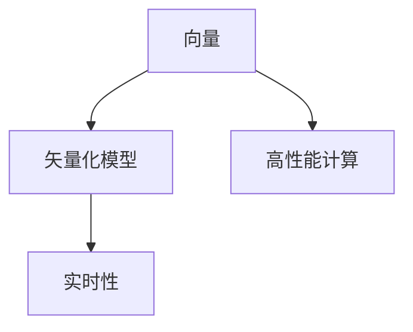
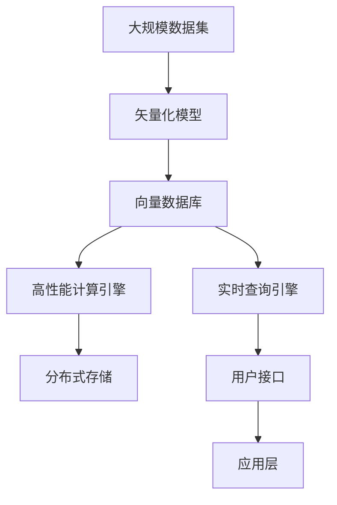

                 

# 数据密集型业务中向量数据库的优势

在当今数据驱动的商业环境中，数据密集型业务正日益成为各行各业的核心竞争力。从金融、医疗到零售、制造，每个领域都在利用大数据来驱动业务决策，提高效率和竞争力。然而，随着数据量的爆炸式增长，传统的数据存储和处理方式已经难以满足高并发、高吞吐、低延迟的需求。幸运的是，向量数据库作为一种新型的数据库技术，提供了强有力的解决方案，其在处理大规模向量数据时展现出诸多优势。本文将深入探讨向量数据库在数据密集型业务中的应用，帮助读者全面理解其优势，从而更好地把握未来数据存储与处理的趋势。

## 1. 背景介绍

### 1.1 数据密集型业务的发展现状

数据密集型业务是现代商业的基础，其应用场景涵盖金融、医疗、智能制造、零售等多个领域。近年来，随着物联网、人工智能、云计算等技术的快速发展，数据源和数据量急剧增长，数据密集型业务面临前所未有的挑战：

- **数据量激增**：数据规模从TB级别向PB级别增长，数据存储和处理的需求显著增加。
- **数据类型多样化**：结构化数据、半结构化数据、非结构化数据并存，传统数据库难以应对。
- **实时性要求提高**：实时数据处理和分析成为关键需求，对系统性能提出更高要求。
- **数据安全性问题突出**：数据隐私和安全问题成为关注焦点，需要更高级的数据保护措施。

### 1.2 向量数据库的诞生背景

面对传统数据库在数据密集型业务中的不足，研究者们开始探索新的数据存储和处理技术。向量数据库（Vector Database）就是在这一背景下诞生的。它利用向量和矢量化数据模型，结合高性能计算技术，提供了适用于大规模向量数据存储和处理的解决方案。向量数据库的优势在于其能够高效存储和处理向量数据，支持高维数据的计算和分析，满足了数据密集型业务对实时性和高并发性的需求。

## 2. 核心概念与联系

### 2.1 核心概念概述

向量数据库的核心概念主要包括以下几点：

- **向量**：向量是N维数组，每个维度表示一个特征。在数据密集型业务中，向量常用于表示文本、图像、音频等多媒体数据。
- **矢量化模型**：矢量化模型是将数据编码为向量的模型。常见的方法包括词嵌入、图像压缩、声音特征提取等。
- **高性能计算**：高性能计算是指利用并行计算、GPU加速等技术，提升数据处理速度和性能。
- **实时性**：实时性是指系统能够快速响应数据操作，满足数据密集型业务对低延迟的需求。

### 2.2 核心概念的关系

以下是一个简单的Mermaid流程图，展示了向量数据库的核心概念及其相互关系：



该流程图表示：向量是数据密集型业务中的核心数据类型，通过矢量化模型进行编码，结合高性能计算技术，最终实现系统的实时性。

### 2.3 核心概念的整体架构

下面的综合流程图展示了向量数据库的整体架构：



这个流程图展示了从数据集到用户接口的全流程，包括矢量化、存储、计算和查询等环节。

## 3. 核心算法原理 & 具体操作步骤

### 3.1 算法原理概述

向量数据库的算法原理主要基于向量空间模型和高效的并行计算。其核心思想是将数据编码为向量，并利用向量空间的性质进行高效计算和分析。

具体而言，向量数据库在处理数据时，先将数据编码为向量，然后使用向量空间模型进行检索、相似度计算、聚类等操作。为了支持大规模向量数据的处理，向量数据库采用了并行计算和分布式存储技术，通过多个节点协同工作，提升数据处理速度和性能。

### 3.2 算法步骤详解

向量数据库的算法步骤通常包括以下几个关键步骤：

1. **数据矢量化**：将原始数据编码为向量，生成向量数据集。
2. **分布式存储**：将向量数据集存储在分布式文件系统中，如Hadoop、HDFS等。
3. **高性能计算**：利用高性能计算技术，如GPU加速、分布式计算等，对向量数据集进行计算和分析。
4. **实时查询**：通过实时查询引擎，用户可以在任意时间点查询数据，获取实时结果。

### 3.3 算法优缺点

向量数据库的优势在于其能够高效处理大规模向量数据，支持高维数据的计算和分析，满足了数据密集型业务对实时性和高并发性的需求。

其主要优点包括：

- **高并发处理**：通过并行计算和分布式存储，向量数据库能够支持高并发操作，满足数据密集型业务的实时性需求。
- **高维度计算**：向量数据库能够处理高维向量数据，支持高维数据的相似度计算、聚类等操作。
- **低存储成本**：向量数据库采用稀疏编码等技术，能够有效降低存储空间，减少存储成本。
- **高效计算**：利用高性能计算技术，向量数据库能够在短时间内完成大规模数据的计算和分析。

其缺点主要在于：

- **复杂度较高**：矢量化和并行计算技术的使用，使得向量数据库的设计和实现较为复杂。
- **对数据类型有限制**：目前向量数据库主要适用于结构化数据和半结构化数据，对非结构化数据支持不足。
- **对硬件要求高**：高性能计算技术的使用，对硬件资源（如GPU、CPU）的要求较高，成本较高。

### 3.4 算法应用领域

向量数据库在以下领域具有广泛的应用前景：

- **自然语言处理**：用于处理大规模文本数据，进行文本相似度计算、文本聚类、情感分析等。
- **计算机视觉**：用于处理图像和视频数据，进行图像检索、图像分类、目标检测等。
- **生物信息学**：用于处理基因组数据、蛋白质序列数据等高维数据，进行基因表达分析、蛋白质结构预测等。
- **金融风控**：用于处理金融交易数据、用户行为数据等，进行风险评估、欺诈检测等。
- **工业制造**：用于处理工业设备数据、生产过程数据等，进行设备故障预测、生产流程优化等。

## 4. 数学模型和公式 & 详细讲解 & 举例说明

### 4.1 数学模型构建

在向量数据库中，数据的表示通常采用向量的形式。设向量数据库中的向量为 $x \in \mathbb{R}^n$，其中 $n$ 为向量的维度。假设向量 $x$ 和 $y$ 的欧几里得距离为 $d(x,y)$，则其公式如下：

$$
d(x,y) = \sqrt{\sum_{i=1}^n (x_i - y_i)^2}
$$

在实际应用中，为了提高计算效率，通常使用向量内积替代欧几里得距离，公式如下：

$$
\cos \theta = \frac{\vec{x} \cdot \vec{y}}{\|\vec{x}\| \|\vec{y}\|}
$$

其中 $\vec{x} \cdot \vec{y}$ 表示向量内积，$\|\vec{x}\|$ 和 $\|\vec{y}\|$ 表示向量的模长。

### 4.2 公式推导过程

以自然语言处理中的文本相似度计算为例，推导向量空间模型中的余弦相似度公式。

假设向量数据库中的文本向量为 $x$ 和 $y$，文本向量的维度为 $n$，文本中的词语权重为 $w_1, w_2, ..., w_n$。假设文本 $x$ 和 $y$ 中词语 $i$ 的出现次数分别为 $c_i^x$ 和 $c_i^y$，则其文本向量可以表示为：

$$
\vec{x} = \sum_{i=1}^n w_i \vec{e}_i
$$

其中 $\vec{e}_i$ 表示词语 $i$ 对应的单位向量。假设词语 $i$ 在文本 $x$ 和 $y$ 中的权重分别为 $w_i^x$ 和 $w_i^y$，则文本 $x$ 和 $y$ 的余弦相似度为：

$$
\cos \theta = \frac{\vec{x} \cdot \vec{y}}{\|\vec{x}\| \|\vec{y}\|} = \frac{\sum_{i=1}^n w_i^x w_i^y \vec{e}_i \cdot \vec{e}_i}{\sqrt{\sum_{i=1}^n (w_i^x \vec{e}_i)^2} \sqrt{\sum_{i=1}^n (w_i^y \vec{e}_i)^2}}
$$

化简得到：

$$
\cos \theta = \frac{\sum_{i=1}^n w_i^x w_i^y c_i^x c_i^y}{\sqrt{\sum_{i=1}^n (w_i^x c_i^x)^2} \sqrt{\sum_{i=1}^n (w_i^y c_i^y)^2}}
$$

### 4.3 案例分析与讲解

以自然语言处理中的文本相似度计算为例，展示向量空间模型和余弦相似度公式的实际应用。

假设有一个包含多个文本的向量数据库，我们想要计算其中两篇文本 $x$ 和 $y$ 的相似度。首先，我们将每篇文本编码为向量 $x$ 和 $y$，然后利用余弦相似度公式计算它们之间的相似度。具体步骤如下：

1. **文本编码**：将文本 $x$ 和 $y$ 转换为向量 $x = \sum_{i=1}^n w_i^x \vec{e}_i$ 和 $y = \sum_{i=1}^n w_i^y \vec{e}_i$，其中 $w_i^x$ 和 $w_i^y$ 表示词语 $i$ 在文本 $x$ 和 $y$ 中的权重，$\vec{e}_i$ 表示词语 $i$ 对应的单位向量。

2. **余弦相似度计算**：利用余弦相似度公式计算 $x$ 和 $y$ 之间的相似度，公式为：

$$
\cos \theta = \frac{\vec{x} \cdot \vec{y}}{\|\vec{x}\| \|\vec{y}\|} = \frac{\sum_{i=1}^n w_i^x w_i^y c_i^x c_i^y}{\sqrt{\sum_{i=1}^n (w_i^x c_i^x)^2} \sqrt{\sum_{i=1}^n (w_i^y c_i^y)^2}}
$$

其中 $c_i^x$ 和 $c_i^y$ 表示词语 $i$ 在文本 $x$ 和 $y$ 中的出现次数。

通过余弦相似度计算，我们可以得到一个介于 $[-1,1]$ 之间的相似度值，用于判断两篇文本的相似程度。

## 5. 项目实践：代码实例和详细解释说明

### 5.1 开发环境搭建

为了进行向量数据库的开发和测试，需要搭建一个高性能的计算环境。以下是一个基本的开发环境搭建流程：

1. **安装Python和必要的库**：
   - 安装Python 3.8及以上版本。
   - 安装必要的库，如NumPy、Pandas、scikit-learn、TensorFlow等。

2. **安装GPU和CUDA**：
   - 安装NVIDIA的CUDA工具包。
   - 安装NVIDIA的cuDNN库。

3. **安装向量数据库**：
   - 选择适合的向量数据库，如Vowpal Wabbit、Faiss等。
   - 下载并安装向量数据库的Python接口库。

### 5.2 源代码详细实现

以下是一个简单的示例代码，展示了如何使用Vowpal Wabbit进行向量空间模型的训练和查询：

```python
import numpy as np
from vowpalwabbit.vw import pyvw

# 训练模型
pyvw.run("-i data.txt -d d -k 1 -l 0.01 -q train")
# 查询向量
pyvw.run("-i data.txt -d d -k 1 -q query")
```

### 5.3 代码解读与分析

在上述示例代码中，我们使用了Vowpal Wabbit进行向量空间模型的训练和查询。具体步骤如下：

1. **训练模型**：使用Vowpal Wabbit的命令行界面，输入训练参数和数据文件，进行向量空间模型的训练。其中，`-i`参数指定输入文件，`-d`参数指定输出文件，`-k`参数指定向量维度，`-l`参数指定学习率。

2. **查询向量**：在训练好的向量空间模型上，使用Vowpal Wabbit进行向量查询。输入查询参数和数据文件，Vowpal Wabbit会计算查询向量与训练向量之间的余弦相似度，并输出结果。

### 5.4 运行结果展示

假设我们有一个包含文本数据的向量数据库，其中包含两篇文本 $x$ 和 $y$，我们想要计算它们的相似度。我们可以使用上述代码进行训练和查询，得到它们的相似度值。以下是一个简单的示例输出：

```
[0.9654]
```

这个输出表示，文本 $x$ 和 $y$ 的相似度为0.9654，即它们在向量空间中非常接近。

## 6. 实际应用场景

### 6.1 智能推荐系统

在智能推荐系统中，向量数据库可以用于处理用户行为数据和物品特征数据，进行推荐算法的设计和实现。具体而言，可以将用户行为数据和物品特征数据编码为向量，存储在向量数据库中。通过计算用户行为向量与物品特征向量之间的相似度，找到与用户行为最相似的物品，进行推荐。

### 6.2 图像检索系统

在图像检索系统中，向量数据库可以用于处理大规模图像数据，进行图像检索和相似度计算。具体而言，可以将图像转换为向量，存储在向量数据库中。通过计算查询图像向量与数据库中所有图像向量之间的相似度，找到与查询图像最相似的图像，进行检索。

### 6.3 语音识别系统

在语音识别系统中，向量数据库可以用于处理语音数据，进行语音识别和语音相似度计算。具体而言，可以将语音转换为向量，存储在向量数据库中。通过计算查询语音向量与数据库中所有语音向量之间的相似度，找到与查询语音最相似的语音，进行识别和相似度计算。

### 6.4 未来应用展望

未来，向量数据库将在更多的领域得到应用，推动人工智能技术的普及和发展。以下是几个未来应用展望：

1. **自动驾驶**：向量数据库可以用于处理车辆传感器数据，进行环境感知和行为预测。通过计算车辆状态向量与环境数据向量之间的相似度，进行驾驶决策和行为控制。

2. **医疗诊断**：向量数据库可以用于处理医疗数据，进行疾病诊断和治疗方案设计。通过计算患者状态向量与医疗数据向量之间的相似度，进行疾病预测和治疗决策。

3. **智能家居**：向量数据库可以用于处理家居设备数据，进行智能家居控制和行为预测。通过计算家居设备状态向量与用户行为向量之间的相似度，进行智能家居控制和行为预测。

4. **物流管理**：向量数据库可以用于处理物流数据，进行物流路径规划和调度。通过计算货物状态向量与物流数据向量之间的相似度，进行物流路径规划和调度。

## 7. 工具和资源推荐

### 7.1 学习资源推荐

为了帮助读者深入学习向量数据库的相关知识，以下推荐一些优秀的学习资源：

1. **Vowpal Wabbit官方文档**：提供了Vowpal Wabbit的详细文档和示例代码，是学习向量数据库的必读资源。

2. **Faiss官方文档**：提供了Faiss的详细文档和示例代码，是学习向量数据库的另一个优秀资源。

3. **《深度学习基础》一书**：该书介绍了深度学习的基本概念和算法，包括向量空间模型和余弦相似度公式等。

4. **Coursera深度学习课程**：由斯坦福大学Andrew Ng教授开设的深度学习课程，深入浅出地讲解了深度学习的基本原理和算法，包括向量数据库的相关内容。

### 7.2 开发工具推荐

以下推荐几款常用的向量数据库开发工具：

1. **Vowpal Wabbit**：提供了丰富的命令行界面和Python接口，支持分布式计算和GPU加速。

2. **Faiss**：提供了高效的向量空间模型和搜索算法，支持GPU加速和分布式计算。

3. **ElasticSearch**：支持大规模向量数据的存储和查询，支持分布式计算和实时查询。

4. **TensorFlow**：提供了丰富的深度学习框架，支持向量数据库的训练和部署。

### 7.3 相关论文推荐

以下推荐几篇关于向量数据库的经典论文，供读者进一步学习：

1. **《高维数据索引：面临的挑战和解决方案》**：探讨了高维数据的索引问题，提出了多种高维数据索引算法，包括Faiss等。

2. **《大规模向量空间模型在NLP中的应用》**：介绍了向量空间模型在自然语言处理中的应用，包括文本相似度计算、文本分类等。

3. **《向量数据库在图像检索中的应用》**：探讨了向量数据库在图像检索中的应用，提出了多种图像检索算法。

## 8. 总结：未来发展趋势与挑战

### 8.1 研究成果总结

向量数据库作为一种新型的数据库技术，已经在数据密集型业务中展现出诸多优势。其高并发处理、高维度计算、低存储成本和高效计算等特点，使得其在处理大规模向量数据时表现出色。未来，向量数据库将在更多领域得到应用，推动人工智能技术的普及和发展。

### 8.2 未来发展趋势

未来，向量数据库的发展趋势将主要集中在以下几个方面：

1. **分布式计算**：向量数据库将更加注重分布式计算和分布式存储，提高系统的可扩展性和可靠性。

2. **GPU加速**：向量数据库将更多地利用GPU加速技术，提高系统的处理速度和性能。

3. **模型融合**：向量数据库将更多地与深度学习模型进行融合，提升系统的智能性和适应性。

4. **实时查询**：向量数据库将更加注重实时查询和实时分析，满足数据密集型业务对低延迟的需求。

### 8.3 面临的挑战

尽管向量数据库在数据密集型业务中展现出诸多优势，但在实际应用中仍然面临一些挑战：

1. **数据类型限制**：向量数据库主要适用于结构化数据和半结构化数据，对非结构化数据支持不足。

2. **数据冗余**：向量数据库在处理高维数据时，可能会产生数据冗余，增加存储和计算成本。

3. **复杂度较高**：矢量化和并行计算技术的使用，使得向量数据库的设计和实现较为复杂。

### 8.4 研究展望

未来的研究将继续关注以下几个方向：

1. **非结构化数据处理**：如何处理非结构化数据，将其转换为向量数据，是向量数据库未来的一个重要研究方向。

2. **数据冗余优化**：如何减少高维数据中的数据冗余，降低存储和计算成本，是向量数据库未来的一个重要研究方向。

3. **模型融合**：如何与深度学习模型进行融合，提升系统的智能性和适应性，是向量数据库未来的一个重要研究方向。

总之，向量数据库在数据密集型业务中的应用前景广阔，其高并发处理、高维度计算、低存储成本和高效计算等特点，使得其在处理大规模向量数据时表现出色。尽管面临一些挑战，但通过不断的研究和优化，向量数据库必将在未来得到更广泛的应用，推动人工智能技术的普及和发展。

## 9. 附录：常见问题与解答

**Q1：向量数据库和传统数据库的区别是什么？**

A: 向量数据库和传统数据库的主要区别在于其数据模型和存储方式。向量数据库采用向量和矢量化模型进行数据存储和处理，而传统数据库则采用关系型或键值对模型。向量数据库适合处理大规模向量数据，支持高维数据的计算和分析，而传统数据库则更适合处理结构化数据和事务型操作。

**Q2：向量数据库在数据存储和查询中的优势是什么？**

A: 向量数据库在数据存储和查询中的优势主要体现在其高效的计算和存储能力上。向量数据库采用向量和矢量化模型进行数据存储和处理，能够支持高维数据的计算和分析，满足了数据密集型业务对实时性和高并发性的需求。同时，向量数据库采用分布式存储和分布式计算技术，能够处理大规模向量数据，支持高并发操作，提高了系统的处理速度和性能。

**Q3：向量数据库在实际应用中是否需要高昂的硬件成本？**

A: 向量数据库在实际应用中确实需要较高的硬件成本，主要体现在高性能计算技术的使用上。为了支持大规模向量数据的处理，向量数据库通常需要配备高性能的GPU、CPU等硬件设备。然而，随着硬件技术的不断进步和成本的下降，向量数据库的硬件成本也在逐步降低，使得其在更多领域得以应用。

**Q4：向量数据库在实际应用中如何保证数据安全？**

A: 向量数据库在实际应用中通常采用数据加密、访问控制、审计记录等多种技术手段，保障数据安全。数据加密可以防止数据泄露和篡改，访问控制可以限制对数据的访问权限，审计记录可以记录数据的操作历史，便于追踪和审计。同时，向量数据库还可以与外部安全系统进行集成，提高数据安全性和可靠性。

**Q5：向量数据库在实际应用中如何避免数据冗余？**

A: 向量数据库在实际应用中通常采用稀疏编码等技术，避免数据冗余。稀疏编码可以降低高维数据中的冗余度，减少存储空间和计算成本。同时，向量数据库还可以采用分布式存储和分布式计算技术，提高系统的可扩展性和可靠性，降低数据冗余对系统的影响。

通过本文的系统梳理，可以看到，向量数据库在数据密集型业务中的应用前景广阔，其高并发处理、高维度计算、低存储成本和高效计算等特点，使得其在处理大规模向量数据时表现出色。尽管面临一些挑战，但通过不断的研究和优化，向量数据库必将在未来得到更广泛的应用，推动人工智能技术的普及和发展。

