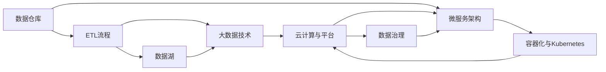

                 

# 数据工程师:软件2.0时代的新型开发者

在当前的软件2.0时代，数据工程师已经成为了不可忽视的新兴角色。这一职位不仅要求开发者具备扎实的编程技能，还需要对数据处理、存储、管理和分析有深入的理解。数据工程师是构建智能系统和复杂数据流水线的重要力量，他们在数据驱动型应用中扮演着越来越重要的角色。本文将深入探讨数据工程师的核心概念、关键技术、实际应用场景，以及未来发展趋势，为有意进入这一领域的人提供全面的指导。

## 1. 背景介绍

### 1.1 问题由来
数据工程师的角色在过去几年中变得越来越重要，这是由数据驱动型应用的广泛普及和技术发展的趋势所驱动的。例如，在金融、医疗、零售和推荐系统等领域，数据工程师的工作不仅涉及数据的收集、清洗和预处理，还包括对数据的深入分析、模式识别和预测建模，以帮助企业做出更明智的决策。

### 1.2 问题核心关键点
数据工程师的核心职责包括：

- **数据收集与管理**：从各种来源收集数据，并确保数据的质量和完整性。
- **数据存储与设计**：设计和实施高效的数据存储解决方案，如数据库、数据仓库和数据湖。
- **数据清洗与处理**：对数据进行清洗、转换和标准化，以提高数据质量。
- **数据分析和可视化**：使用统计和机器学习技术对数据进行分析，并通过可视化工具呈现结果。
- **数据安全和合规**：确保数据的安全性、隐私保护和遵守相关法律法规。
- **系统集成与部署**：将数据处理和分析模块集成到整体应用系统中，并进行部署和维护。

### 1.3 问题研究意义
数据工程师的崛起，对企业数据驱动型应用的发展至关重要。他们不仅能够高效地管理和利用数据，还能够通过深入的数据分析和机器学习技术，帮助企业发现隐藏在数据中的价值。这为企业的决策支持、产品创新和市场竞争力提升提供了强有力的保障。

## 2. 核心概念与联系

### 2.1 核心概念概述

数据工程师的核心概念包括以下几个关键领域：

- **数据仓库**：一个集中存储企业数据的中心化系统，支持高效的数据查询和分析。
- **数据湖**：一个无需数据预处理的泛化数据存储解决方案，支持大规模数据处理和分析。
- **ETL流程**：提取（Extract）、转换（Transform）和加载（Load）的数据处理流程，是数据工程的核心组件。
- **数据管道**：自动化数据处理的工作流，支持数据的高效传输和处理。
- **大数据技术**：如Hadoop、Spark、Flink等，用于处理大规模数据集和分布式计算。
- **云计算与平台**：如AWS、Azure、Google Cloud等，提供高性能计算资源和灵活的数据处理平台。
- **微服务架构**：将复杂系统拆分成一组松耦合的服务，以提高系统的可扩展性和可维护性。
- **容器化与Kubernetes**：通过Docker等容器技术实现应用的快速部署和管理，使用Kubernetes进行容器编排。
- **数据治理**：包括数据质量管理、数据生命周期管理、数据安全管理和数据合规管理等，确保数据的一致性和安全性。

这些核心概念共同构成了数据工程师的工具箱，帮助他们在复杂的业务环境中高效处理和分析数据。

### 2.2 概念间的关系

这些核心概念之间的关系可以通过以下Mermaid流程图来展示：



这个流程图展示了数据工程师在处理数据过程中所涉及的关键技术栈，包括数据存储与处理、ETL流程、大数据技术、云计算与平台、微服务架构、容器化与Kubernetes以及数据治理。

## 3. 核心算法原理 & 具体操作步骤

### 3.1 算法原理概述

数据工程师在处理数据时，通常使用一系列算法和技术来确保数据的准确性和一致性。这些算法包括但不限于：

- **数据清洗算法**：用于检测和处理数据中的噪声、缺失值和异常值，确保数据的质量。
- **数据转换算法**：如数据格式转换、数据标准化、数据归一化等，将数据转换为可用于分析的格式。
- **数据采样算法**：用于从大型数据集中采样，以进行样本分析和模型训练。
- **数据聚类算法**：如K-means、层次聚类等，用于对数据进行分组和分类。
- **时间序列分析算法**：用于对时间序列数据进行趋势预测、异常检测等。
- **机器学习算法**：如回归分析、分类分析、聚类分析、异常检测等，用于从数据中提取有价值的信息。

这些算法共同构成了数据工程师处理数据的技术基础，通过合理应用这些算法，可以实现高效、可靠的数据处理和分析。

### 3.2 算法步骤详解

以下是一个详细的数据清洗流程，展示了从数据收集到数据清洗、转换和可视化的完整过程：

1. **数据收集**：
   - 使用API、爬虫等技术从不同来源收集数据。
   - 检查数据的质量和完整性，确保数据的可靠性。

2. **数据清洗**：
   - 检测和处理缺失值、重复值和异常值。
   - 修正数据格式和编码错误，确保数据一致性。
   - 识别和处理数据中的噪声和错误，提高数据质量。

3. **数据转换**：
   - 将数据转换为统一的格式，便于分析。
   - 进行数据归一化和标准化，确保数据在分析中的可比性。
   - 应用数据转换规则，如日期转换、文本清洗等，提高数据处理效率。

4. **数据存储**：
   - 选择合适的数据存储解决方案，如数据库、数据仓库、数据湖等。
   - 设计和实施数据模型，确保数据的结构和一致性。
   - 使用分布式存储和计算技术，支持大规模数据处理。

5. **数据可视化**：
   - 使用数据可视化工具，如Tableau、Power BI等，将数据转换为易于理解的图表和报告。
   - 通过可视化的方式展示数据趋势和模式，帮助决策者做出明智的决策。

### 3.3 算法优缺点

数据工程师在处理数据时，需要注意以下优缺点：

**优点**：

- 高效的数据处理能力：数据工程师能够利用先进的数据处理技术和工具，快速高效地处理大规模数据集。
- 全面的数据治理：数据工程师负责数据质量管理和数据安全合规，确保数据的准确性和一致性。
- 强大的数据分析能力：数据工程师能够应用各种机器学习算法和统计方法，从数据中提取有价值的信息。
- 灵活的数据处理流程：数据工程师可以根据实际需求灵活调整数据处理流程，确保数据处理的适应性和灵活性。

**缺点**：

- 技术要求高：数据工程师需要掌握多种技术和工具，对技术水平要求较高。
- 数据处理复杂：数据工程师需要对数据进行复杂的清洗、转换和分析，工作量大且繁琐。
- 数据安全风险：数据工程师需要确保数据的安全性和隐私保护，避免数据泄露和滥用。
- 系统复杂度高：数据工程师需要设计和维护复杂的数据处理系统，确保系统的稳定性和可扩展性。

### 3.4 算法应用领域

数据工程师的技术和能力被广泛应用于多个领域，以下是其中几个典型的应用场景：

- **金融领域**：进行金融数据收集、清洗和分析，支持风险管理、投资分析和市场预测。
- **医疗健康**：处理和分析医疗数据，支持疾病诊断、患者管理和临床研究。
- **零售和电商**：进行消费者行为分析、产品推荐和库存管理，优化销售和运营。
- **供应链管理**：处理和分析供应链数据，支持供应链优化、需求预测和库存管理。
- **推荐系统**：处理用户行为数据，进行个性化推荐和用户体验优化。
- **智能制造**：处理和分析生产数据，支持制造过程优化和故障预测。
- **智能城市**：处理和分析城市数据，支持城市规划、交通管理和环境保护。

## 4. 数学模型和公式 & 详细讲解 & 举例说明

### 4.1 数学模型构建

在数据处理和分析中，数学模型是非常重要的一部分。以下是一个简单的数学模型，展示了数据清洗和转换的基本流程：

$$
\text{Data Cleaning} = \text{Noise Detection} + \text{Missing Value Imputation} + \text{Outlier Detection}
$$

$$
\text{Data Conversion} = \text{Format Conversion} + \text{Normalization} + \text{Standardization}
$$

### 4.2 公式推导过程

以数据清洗和转换为例，我们可以进一步详细推导一些具体的公式。

假设原始数据集为 $D = \{(x_i, y_i)\}_{i=1}^N$，其中 $x_i$ 表示输入特征，$y_i$ 表示标签。在进行数据清洗和转换后，我们得到一个新的数据集 $D' = \{(x_i', y_i')\}_{i=1}^N$。

对于噪声检测，可以使用基于统计方法或机器学习模型的检测算法，如：

$$
\text{Noise Detection} = \text{Algorithm}(D)
$$

对于缺失值填补，可以使用均值填补、中位数填补、插值填补等方法，如：

$$
\text{Missing Value Imputation} = \text{Filling Algorithm}(D')
$$

对于数据标准化，可以使用Z-score标准化方法，如：

$$
x_i' = \frac{x_i - \mu}{\sigma}
$$

其中，$\mu$ 和 $\sigma$ 分别为数据的均值和标准差。

### 4.3 案例分析与讲解

以下是一个具体的案例分析，展示了数据工程师如何处理和分析一家电商公司的销售数据：

1. **数据收集**：
   - 使用API从电商平台获取销售数据，包括订单信息、用户信息、产品信息等。
   - 检查数据的完整性和可靠性，确保数据的质量。

2. **数据清洗**：
   - 检测和处理缺失值和重复值，确保数据的完整性。
   - 修正数据格式和编码错误，确保数据的一致性。
   - 识别和处理数据中的噪声和错误，提高数据质量。

3. **数据转换**：
   - 将日期格式转换为统一的格式，便于时间序列分析。
   - 对销售额进行标准化处理，确保数据在分析中的可比性。
   - 应用数据转换规则，如将产品分类信息转换为统一编码格式。

4. **数据存储**：
   - 使用关系型数据库或数据仓库，存储清洗和转换后的数据。
   - 设计和实施数据模型，确保数据的结构和一致性。
   - 使用分布式存储和计算技术，支持大规模数据处理。

5. **数据可视化**：
   - 使用数据可视化工具，如Tableau，将销售数据转换为易于理解的图表和报告。
   - 通过可视化的方式展示销售趋势和模式，帮助决策者做出明智的决策。

## 5. 项目实践：代码实例和详细解释说明

### 5.1 开发环境搭建

在进行数据工程师项目实践前，需要准备好开发环境。以下是使用Python和Hadoop进行数据处理的环境配置流程：

1. 安装Anaconda：从官网下载并安装Anaconda，用于创建独立的Python环境。

2. 创建并激活虚拟环境：
```bash
conda create -n pyhadoop-env python=3.8 
conda activate pyhadoop-env
```

3. 安装PySpark：从官网获取对应的安装命令，并使用Hadoop配置。例如：
```bash
conda install pyspark=3.0.2 hdfs=3.0.2
```

4. 安装Hadoop和Hive：确保Hadoop和Hive的正常安装和配置。

5. 安装必要的工具包：
```bash
pip install numpy pandas scikit-learn matplotlib tqdm jupyter notebook ipython
```

完成上述步骤后，即可在`pyhadoop-env`环境中开始数据工程师项目实践。

### 5.2 源代码详细实现

下面我们以电商销售数据清洗和分析为例，给出使用PySpark和Hive进行数据处理的PySpark代码实现。

首先，定义数据清洗函数：

```python
from pyspark.sql.functions import col, expr, when, isnull, udf
from pyspark.sql import SparkSession
from pyspark.sql.types import StructType, StructField, StringType, IntegerType, DateType, FloatType

spark = SparkSession.builder.appName("DataCleaning").getOrCreate()

# 定义数据类型和结构
data_schema = StructType([
    StructField("OrderID", IntegerType(), True),
    StructField("ProductID", StringType(), True),
    StructField("OrderDate", DateType(), True),
    StructField("OrderAmount", FloatType(), True),
    StructField("CustomerID", StringType(), True),
    StructField("City", StringType(), True)
])

# 读取原始数据
original_data = spark.read.format("csv").options(header="true", inferSchema="true").load("sales_data.csv")

# 检查数据完整性
check_incomplete = original_data.filter(~expr("OrderAmount = NULL"))

# 处理缺失值
def handle_missing(df, col_name):
    return df.fillna("N/A", col_name)

# 处理噪声
def handle_outliers(df, col_name):
    return df.filter((df[col_name] > 100) | (df[col_name] < 0))

# 数据转换
def convert_data(df):
    df = df.withColumn("OrderDate", expr("date_format(OrderDate, 'yyyy-MM-dd')"))
    df = df.withColumn("OrderAmount", expr("OrderAmount / 100"))
    df = df.withColumn("City", expr("LOWER(City)"))
    return df

# 执行数据清洗和转换
cleaned_data = original_data.select(*data_schema).fillna("N/A").filter(~expr("OrderAmount = NULL"))

cleaned_data = handle_missing(cleaned_data, "OrderAmount")
cleaned_data = handle_outliers(cleaned_data, "OrderAmount")

cleaned_data = convert_data(cleaned_data)

cleaned_data.show()
```

然后，定义数据存储函数：

```python
# 将清洗后的数据存储到Hive中
cleaned_data.write.partitionBy("City").format("parquet").saveAsTable("cleaned_sales_data")
```

最后，定义数据可视化函数：

```python
from pyspark.sql.functions import sum, count
from pyspark.sql.window import Window
from pyspark.sql.types import IntegerType, StructType, StructField, StringType, DateType, FloatType

# 数据可视化
spark.read.table("cleaned_sales_data").withColumn("CityCount", count("City")).groupBy("City").orderBy("CityCount", ascending=True).show()

spark.read.table("cleaned_sales_data").withColumn("TotalSales", sum("OrderAmount")).groupBy("City").orderBy("TotalSales", descending=True).show()

spark.read.table("cleaned_sales_data").withColumn("SalesRate", sum("OrderAmount") / sum("OrderAmount")).groupBy("City").orderBy("SalesRate", ascending=True).show()

spark.read.table("cleaned_sales_data").withColumn("SalesTrend", expr("avg(OrderAmount)")).partitionBy("City").groupBy("City").orderBy("SalesTrend", ascending=True).show()
```

以上就是使用PySpark和Hive进行数据处理和可视化的完整代码实现。可以看到，通过PySpark和Hive的组合使用，可以高效地处理和分析大规模数据集，并在Hive中方便地存储数据。

### 5.3 代码解读与分析

让我们再详细解读一下关键代码的实现细节：

**数据清洗函数**：
- `handle_missing`：定义了缺失值填补的函数，使用`fillna`方法将缺失值替换为"N/A"。
- `handle_outliers`：定义了异常值处理的函数，使用`filter`方法过滤出异常值。

**数据转换函数**：
- `convert_data`：定义了数据转换的函数，使用`withColumn`方法对日期、金额和城市进行格式化处理。

**数据可视化函数**：
- 使用`count`和`sum`函数计算城市数量和总销售额，使用`groupBy`和`orderBy`方法进行分组和排序，使用`show`方法展示结果。

**数据存储函数**：
- 使用`write`方法将清洗后的数据存储到Hive中，使用`partitionBy`方法进行分区存储。

## 6. 实际应用场景

### 6.1 智能制造

在智能制造领域，数据工程师需要对生产过程中的海量数据进行收集、清洗和分析，以支持制造过程的优化和故障预测。具体应用包括：

- 生产数据监控和分析：使用实时数据流处理技术，对生产过程进行实时监控和异常检测。
- 设备故障预测：通过分析设备运行数据，预测设备故障，提前进行维护。
- 工艺优化：通过分析生产数据，优化生产工艺，提高生产效率和质量。
- 供应链管理：处理和分析供应链数据，支持供应链优化、需求预测和库存管理。

### 6.2 智能城市

在智能城市治理中，数据工程师需要对城市数据进行收集、清洗和分析，以支持城市规划、交通管理和环境保护。具体应用包括：

- 城市事件监测：处理和分析城市事件数据，支持城市事件预警和应急响应。
- 交通流量分析：分析交通流量数据，优化交通管理，缓解交通拥堵。
- 环境监测：处理和分析环境数据，支持环境质量监测和污染治理。
- 公共安全管理：处理和分析公共安全数据，支持公共安全预警和应急响应。

### 6.3 金融领域

在金融领域，数据工程师需要对金融数据进行收集、清洗和分析，以支持风险管理、投资分析和市场预测。具体应用包括：

- 风险评估：处理和分析客户和市场数据，评估客户信用和市场风险。
- 投资分析：通过分析金融市场数据，支持投资组合优化和市场预测。
- 欺诈检测：处理和分析交易数据，检测和预防金融欺诈行为。
- 客户行为分析：分析客户行为数据，支持客户关系管理和个性化推荐。

## 7. 工具和资源推荐

### 7.1 学习资源推荐

为了帮助开发者系统掌握数据工程师的核心技术和实践技巧，这里推荐一些优质的学习资源：

1. **《数据科学实战》（原书第2版）**：详细介绍了数据科学的基本概念和实践方法，包括数据处理、机器学习、数据可视化等。
2. **《Hadoop实战》（原书第2版）**：介绍了Hadoop生态系统的基本概念和实践方法，包括HDFS、MapReduce、Spark等。
3. **《大数据技术与应用》（原书第2版）**：详细介绍了大数据技术的基本概念和实践方法，包括数据清洗、数据存储、数据可视化等。
4. **《Python数据科学手册》（原书第2版）**：介绍了Python在大数据处理和分析中的应用，包括Pandas、NumPy、Scikit-learn等。
5. **《大数据体系架构》（原书第2版）**：详细介绍了大数据系统的基本架构和实践方法，包括Hadoop、Spark、Kafka等。
6. **Kaggle数据科学竞赛平台**：通过参加Kaggle竞赛，实战学习数据处理和分析技术。
7. **Coursera《大数据与数据科学专项课程》**：由约翰霍普金斯大学开设的大数据与数据科学专项课程，涵盖大数据技术、数据处理和分析等。

通过这些学习资源，可以系统掌握数据工程师的核心技术和实践技巧，为进入数据工程师行业做好准备。

### 7.2 开发工具推荐

高效的数据处理离不开优秀的工具支持。以下是几款用于数据处理开发的常用工具：

1. **PySpark**：基于Python的分布式计算框架，支持大规模数据处理和分析。
2. **Apache Hadoop**：基于Java的分布式计算框架，支持大规模数据存储和处理。
3. **Apache Spark**：基于内存计算的分布式计算框架，支持大规模数据处理和分析。
4. **Apache Flink**：基于内存计算的分布式流处理框架，支持实时数据处理和分析。
5. **Apache Hive**：基于Hadoop的分布式数据仓库解决方案，支持数据存储和分析。
6. **Apache Kafka**：基于分布式消息队列的流处理框架，支持实时数据传输和处理。
7. **Apache HBase**：基于Hadoop的分布式NoSQL数据库，支持大规模数据存储和访问。

合理利用这些工具，可以显著提升数据处理和分析的效率，加快开发迭代的速度。

### 7.3 相关论文推荐

数据工程师的技术和能力不断发展和演进，以下是几篇具有代表性的相关论文，推荐阅读：

1. **《数据仓库设计与实现》**：详细介绍了数据仓库的基本概念和设计方法，包括数据建模、数据治理和数据安全等。
2. **《大数据系统的体系架构》**：介绍了大数据系统的基本架构和实践方法，包括数据处理、存储和分析等。
3. **《大数据处理中的流处理技术》**：介绍了流处理技术的基本概念和实现方法，包括Spark Streaming、Flink等。
4. **《分布式计算中的数据优化技术》**：介绍了数据优化技术的基本概念和实践方法，包括数据压缩、数据去重、数据归并等。
5. **《数据可视化技术与应用》**：介绍了数据可视化技术的基本概念和实践方法，包括Tableau、Power BI等。

这些论文代表了数据工程师技术的最新进展，阅读这些论文可以帮助开发者深入理解数据处理和分析的核心技术。

## 8. 总结：未来发展趋势与挑战

### 8.1 研究成果总结

本文对数据工程师的核心概念、关键技术、实际应用场景和未来发展趋势进行了全面系统的介绍。通过深入探讨数据工程师的角色定位和关键职责，展示了数据工程师在数据处理和分析中的重要作用。

### 8.2 未来发展趋势

展望未来，数据工程师的角色将更加重要，其在数据处理和分析中的作用将更加凸显。以下趋势值得关注：

1. **大数据技术的持续发展**：随着大数据技术的不断演进，数据工程师需要掌握更多的技术栈和工具，以支持复杂的数据处理和分析任务。
2. **数据治理的日益重要**：数据治理成为企业数据管理的重要组成部分，数据工程师需要掌握数据质量管理、数据安全合规等技术，确保数据的一致性和安全性。
3. **数据科学和机器学习的应用深入**：数据工程师需要掌握更多的数据科学和机器学习技术，利用数据驱动技术提升数据分析的深度和广度。
4. **云数据平台的应用普及**：云计算平台如AWS、Azure等的应用普及，将大大简化数据工程师的工作流程，提升数据处理的效率和灵活性。
5. **微服务架构的广泛应用**：微服务架构的应用将大大提升数据处理系统的可扩展性和可维护性，数据工程师需要掌握微服务架构设计和部署技术。
6. **容器化和Kubernetes的应用**：容器化技术如Docker和容器编排工具如Kubernetes的应用，将提升数据处理系统的稳定性和可扩展性。

### 8.3 面临的挑战

尽管数据工程师的角色日益重要，但在实践中仍面临诸多挑战：

1. **技术栈繁多**：数据工程师需要掌握多种技术栈和工具，对技术水平要求较高。
2. **数据处理复杂**：数据工程师需要对数据进行复杂的清洗、转换和分析，工作量大且繁琐。
3. **数据安全风险**：数据工程师需要确保数据的安全性和隐私保护，避免数据泄露和滥用。
4. **系统复杂度高**：数据工程师需要设计和维护复杂的数据处理系统，确保系统的稳定性和可扩展性。

### 8.4 研究展望

未来的数据工程师研究将集中在以下几个方面：

1. **数据治理技术的进一步发展**：如何构建更加全面、可操作的数据治理体系，提升数据质量管理和数据安全合规能力。
2. **数据科学和机器学习的应用深化**：如何将数据科学和机器学习技术与数据处理和分析相结合，提升数据分析的深度和广度。
3. **云数据平台的应用拓展**：如何利用云计算平台提升数据处理的效率和灵活性，实现数据处理的自动化和智能化。
4. **微服务架构的优化设计**：如何设计和部署高效、可靠、可扩展的微服务架构，提升数据处理系统的可维护性和可扩展性。
5. **容器化和Kubernetes的应用深化**：如何利用容器化和Kubernetes提升数据处理系统的稳定性和可扩展性，实现数据处理系统的自动化和智能化。
6. **数据科学和机器学习的应用深化**：如何将数据科学和机器学习技术与数据处理和分析相结合，提升数据分析的深度和广度。

通过在这些领域的研究和探索，数据工程师将能够更好地适应未来的技术挑战，为数据驱动型应用提供更加高效、可靠的数据处理和分析服务。

## 9. 附录：常见问题与解答

**Q1：数据工程师和数据分析师有什么区别？**

A: 数据工程师和数据分析师的主要区别在于职责和技能。数据工程师主要负责数据的收集、清洗、存储和处理，确保数据的完整性和一致性；而数据分析师主要负责数据的分析和报告，从数据中提取有价值的信息。数据工程师需要掌握更多技术栈和工具，而数据分析师则更多关注统计分析和数据可视化。

**Q2：数据工程师需要掌握哪些编程语言和技术？**

A: 数据工程师需要掌握以下编程语言和技术：

- **Python**：用于数据处理和分析的主要语言，广泛用于数据清洗、数据转换、数据可视化等任务。
- **Java**：用于数据处理和存储的主要语言，广泛用于分布式计算和数据存储等任务。
- **SQL**：用于数据库查询和数据管理的主要语言，广泛用于数据查询、数据建模

