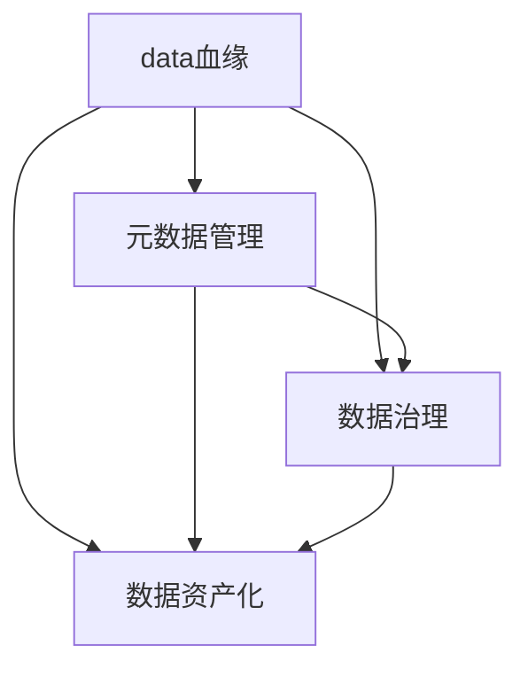
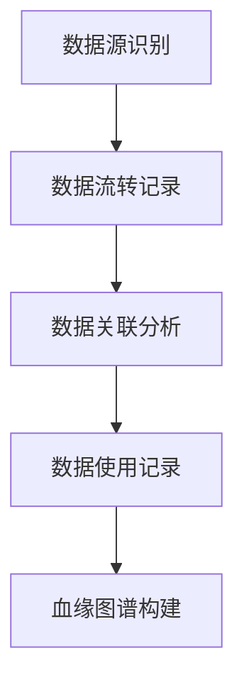
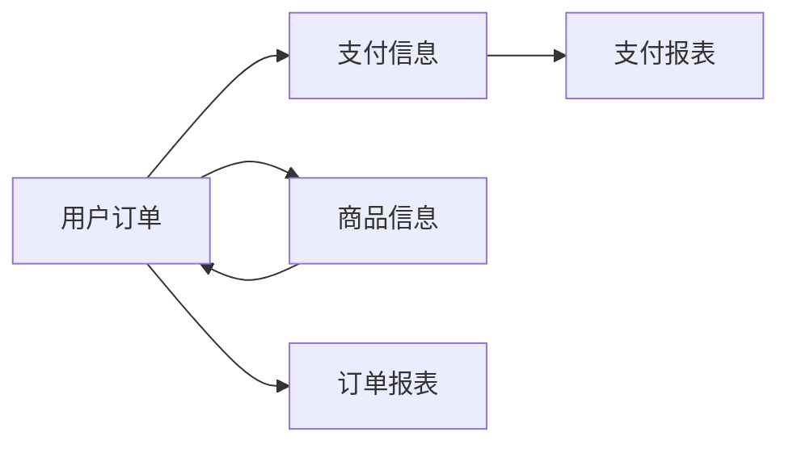

                 

# 数据血缘管理:软件2.0时代的元数据之王

> 关键词：数据血缘管理,元数据管理,软件2.0,大数据治理,数据治理

## 1. 背景介绍

### 1.1 问题由来
在数字化转型和数据驱动业务的大背景下，企业的数据量呈爆炸式增长，如何有效管理和治理这些海量数据，成为各行业共同的挑战。在传统数据治理方法面临瓶颈的情况下，数据血缘管理应运而生，以其独特的优势和价值，成为软件2.0时代的重要工具。

数据血缘管理，指的是通过对数据的来源、流转、使用等全生命周期进行跟踪和记录，构建起数据间的依赖关系，使得企业能够全面、精细化地管理和利用数据。其核心目的是通过数据血缘关系，实现数据的可视化和可追溯，从而提升数据治理的效率和质量。

### 1.2 问题核心关键点
数据血缘管理的核心在于数据间的依赖关系，即数据源和数据间的关联。这包括数据的来源、变换过程、使用场景等，是一张纵横交错的关系网络。

在实践中，数据血缘管理主要包含以下几个方面：

- **数据来源**：记录数据的原始产生位置，包括数据库、API接口、文件系统等。
- **数据流向**：追踪数据从源头到最终使用的路径，记录各环节的操作和变换。
- **数据关联**：识别数据间的依赖关系，例如哪些数据之间存在关联，哪些数据是源数据或衍生数据。
- **数据使用**：记录数据的最终使用场景，包括查询、统计、分析等。

这些维度的记录，使得数据血缘管理能够全面反映数据的来龙去脉，为数据治理提供了坚实的基础。

### 1.3 问题研究意义
数据血缘管理在数据治理中具有重要意义：

1. **提升数据质量**：通过数据血缘关系，可以追溯数据的准确性和一致性，及时发现和修正数据错误。
2. **优化数据流程**：了解数据的流转和使用路径，有助于发现数据流程中的瓶颈和问题，进行优化和改进。
3. **支持决策制定**：提供数据的来源和使用信息，辅助管理层制定更科学合理的决策。
4. **保障数据安全**：数据血缘管理可以追溯数据的访问和使用情况，保障数据安全，防止数据泄露和滥用。
5. **增强数据治理透明度**：数据血缘关系使得数据治理过程更加透明，便于审计和问责。

因此，数据血缘管理是实现数据治理现代化的重要手段，是软件2.0时代的关键工具。

## 2. 核心概念与联系

### 2.1 核心概念概述

为更好地理解数据血缘管理的核心概念，本节将介绍几个密切相关的核心概念：

- **数据血缘**：数据的来源和流转路径，是数据治理的基础。通过数据血缘管理，可以全面跟踪数据的生成、使用和变换。
- **元数据管理**：对数据血缘关系进行管理和维护的过程。元数据是关于数据的数据，记录了数据的定义、结构和关系等信息。
- **数据治理**：通过数据血缘管理、元数据管理等手段，对数据进行全面管理和治理，提升数据质量和利用效率。
- **数据资产化**：将数据视为企业的重要资产，进行科学管理和运营，实现数据的商业价值。
- **数据中台**：集成数据血缘管理、元数据管理、数据治理等技术，提供统一的数据管理和运营平台，支持企业数据化转型。

这些核心概念之间紧密相连，共同构成了数据血缘管理的完整框架。

### 2.2 概念间的关系

这些核心概念之间的关系可以通过以下Mermaid流程图来展示：



这个流程图展示了数据血缘、元数据管理、数据治理和数据资产化之间的关系：

1. 数据血缘管理是数据治理和数据资产化的基础，提供了数据间的依赖关系。
2. 元数据管理是数据血缘管理的关键工具，记录和维护数据间的依赖关系。
3. 数据治理通过对数据血缘和元数据的管理，提升数据质量和使用效率。
4. 数据资产化则将数据视为企业的重要资产，进行科学管理和运营。

## 3. 核心算法原理 & 具体操作步骤
### 3.1 算法原理概述

数据血缘管理的核心算法原理基于数据依赖关系的分析和记录。通过构建数据血缘图谱，能够清晰地展示数据的来龙去脉，支持数据的可视化和追踪。

数据血缘图谱是一个由节点和边构成的图，其中节点表示数据项，边表示数据间的依赖关系。例如，表1中的字段A依赖于表2中的字段B，则可表示为A-B的边。数据血缘图谱可以包括数据血缘关系、数据质量信息、数据使用情况等多维度信息。

### 3.2 算法步骤详解

数据血缘管理的算法步骤主要包括以下几个环节：

1. **数据源识别**：确定数据源的位置和类型，建立数据源字典。
2. **数据流转记录**：记录数据从源到目标的流转路径，包括各环节的操作和变换。
3. **数据关联分析**：分析数据间的依赖关系，建立数据关联字典。
4. **数据使用记录**：记录数据最终的使用场景，建立数据使用字典。
5. **血缘图谱构建**：基于上述字典信息，构建数据血缘图谱，并进行可视化展示。

以下是一个详细的算法步骤示例：



### 3.3 算法优缺点

数据血缘管理具有以下优点：

1. **全面跟踪数据依赖**：通过数据血缘图谱，能够全面记录数据的来源和流转路径，帮助企业理解数据间的依赖关系。
2. **提升数据质量**：及时发现数据错误和异常，通过血缘图谱进行追溯和修正，提高数据质量。
3. **优化数据流程**：发现数据流转中的瓶颈和问题，优化数据处理流程，提升数据利用效率。
4. **支持决策制定**：提供全面的数据背景信息，辅助管理层制定更加科学的决策。
5. **保障数据安全**：记录数据的访问和使用情况，保障数据安全，防止数据泄露和滥用。

然而，数据血缘管理也存在一些缺点：

1. **数据源复杂多样**：不同的数据源可能使用不同的技术栈和格式，数据源识别的复杂度较高。
2. **数据流转路径长**：复杂的数据流转路径可能导致数据依赖关系不清晰，难以追踪。
3. **依赖关系变化频繁**：数据依赖关系可能会随着业务变化而变化，血缘图谱需要频繁更新和维护。
4. **系统复杂度较高**：血缘图谱的构建和管理需要复杂的系统支持，增加了技术实现难度。
5. **数据治理成本高**：血缘图谱的构建和维护需要投入大量资源，增加了数据治理的成本。

### 3.4 算法应用领域

数据血缘管理在多个领域都有广泛应用：

- **金融**：记录金融数据的来源和使用，支持风险管理和合规审计。
- **医疗**：记录患者数据的产生和流转，保障数据安全和隐私保护。
- **制造**：记录生产数据的来源和使用，优化生产流程和质量控制。
- **电商**：记录订单数据的产生和流转，支持销售分析和客户管理。
- **政府**：记录公共数据的来源和使用，支持政府数据管理和公开透明。

## 4. 数学模型和公式 & 详细讲解 & 举例说明
### 4.1 数学模型构建

数据血缘管理的数学模型主要涉及数据依赖关系的构建和展示。

设数据集 $D$ 包含 $n$ 个数据项 $d_i$，其中 $d_i$ 之间的依赖关系用 $R$ 表示，即 $d_i \in D$ 依赖于 $d_j \in D$，则 $d_i \rightarrow d_j \in R$。数据血缘图谱可以用有向无环图(DAG)表示，其中节点表示数据项，边表示依赖关系。

### 4.2 公式推导过程

设数据血缘图谱中的节点为 $V$，边为 $E$，则数据血缘图谱可以表示为一个二元组 $(V, E)$。根据DAG的定义，每个节点最多只有一个父节点和多个子节点，因此可以表示为：

$$
\begin{aligned}
V &= \{v_1, v_2, ..., v_n\} \\
E &= \{e_1, e_2, ..., e_m\} \\
e_k &= (v_{i_k}, v_{j_k}), i_k, j_k \in V, i_k \neq j_k
\end{aligned}
$$

在实际应用中，数据的依赖关系可能包含多个层次，例如：

- 数据层依赖：不同层级的数据间依赖关系。
- 操作依赖：数据处理操作间的依赖关系。
- 业务依赖：数据在不同业务场景下的依赖关系。

通过构建多层次的数据血缘图谱，可以更加全面地记录和展示数据间的依赖关系。

### 4.3 案例分析与讲解

假设某电商平台记录了用户订单、商品信息、支付信息等数据，需要构建数据血缘图谱进行治理。以下是该案例的详细分析：

1. **数据源识别**：
   - 用户订单数据来自线上交易平台，记录用户的订单信息。
   - 商品信息数据来自商家管理系统，记录商品的详细信息。
   - 支付信息数据来自支付系统，记录用户的支付信息。

   数据源字典为：

   | 数据项 | 数据源类型 |
   | --- | --- |
   | 用户订单 | 交易平台 |
   | 商品信息 | 商家系统 |
   | 支付信息 | 支付系统 |

2. **数据流转记录**：
   - 用户订单数据经过支付系统后，生成支付信息。
   - 商品信息数据经过商家系统后，生成商品信息。

   数据流转字典为：

   | 数据项 | 依赖关系 |
   | --- | --- |
   | 用户订单 | 支付信息 |
   | 商品信息 | 订单信息 |
   | 支付信息 | 用户订单 |

3. **数据关联分析**：
   - 商品信息数据与订单信息数据存在业务关联，例如订单中的商品信息。

   数据关联字典为：

   | 数据项 | 关联关系 |
   | --- | --- |
   | 商品信息 | 订单信息 |
   | 订单信息 | 商品信息 |

4. **数据使用记录**：
   - 用户订单数据用于生成订单报表。
   - 支付信息数据用于生成支付报表。

   数据使用字典为：

   | 数据项 | 使用场景 |
   | --- | --- |
   | 用户订单 | 订单报表 |
   | 支付信息 | 支付报表 |

5. **血缘图谱构建**：
   构建数据血缘图谱如下：

   ```mermaid
   graph LR
    A[用户订单] --> B[支付信息]
    A --> C[商品信息]
    C --> A
    A --> D[订单报表]
    B --> E[支付报表]
   ```

   该图谱清晰展示了数据间的依赖关系和流转路径。

## 5. 项目实践：代码实例和详细解释说明
### 5.1 开发环境搭建

在进行数据血缘管理项目实践前，需要准备好开发环境。以下是使用Python进行Apache NiFi搭建数据血缘管理系统的环境配置流程：

1. 安装Apache NiFi：从官网下载并安装Apache NiFi，创建NiFi实例。

2. 安装Python依赖库：
```bash
pip install apache-nifi-python
```

3. 配置NiFi：
```bash
# 配置NiFi的配置文件
nifi-site.xml
# 配置NiFi的logback.xml
logback.xml
```

4. 启动NiFi服务：
```bash
bin/nifi-daemon.sh
```

完成上述步骤后，即可在NiFi平台上进行数据血缘管理的开发实践。

### 5.2 源代码详细实现

下面我们以构建数据血缘图谱为例，给出使用NiFi搭建数据血缘管理系统的Python代码实现。

首先，定义数据源字典和数据流转字典：

```python
data_sources = {
    '用户订单': '交易平台',
    '商品信息': '商家系统',
    '支付信息': '支付系统'
}

data_flows = {
    '用户订单': '支付信息',
    '商品信息': '订单信息',
    '支付信息': '用户订单'
}

data_relations = {
    '商品信息': '订单信息',
    '订单信息': '商品信息'
}

data_uses = {
    '用户订单': '订单报表',
    '支付信息': '支付报表'
}
```

然后，在NiFi平台上搭建数据流：

1. 创建数据流节点：
   - 用户订单数据流节点：
   - 商品信息数据流节点：
   - 支付信息数据流节点：

   ```python
   user_order_flow = createFlow('用户订单', data_sources['用户订单'], data_flows['用户订单'])
   product_info_flow = createFlow('商品信息', data_sources['商品信息'], data_flows['商品信息'])
   payment_info_flow = createFlow('支付信息', data_sources['支付信息'], data_flows['支付信息'])
   ```

2. 创建数据关联节点：
   - 商品信息与订单信息的数据关联：
   - 订单信息与商品信息的数据关联：

   ```python
   product_info_relation = createRelation('商品信息', '订单信息', data_relations['商品信息'])
   order_info_relation = createRelation('订单信息', '商品信息', data_relations['订单信息'])
   ```

3. 创建数据使用节点：
   - 用户订单数据使用节点：
   - 支付信息数据使用节点：

   ```python
   user_order_use = createUse('用户订单', data_uses['用户订单'])
   payment_info_use = createUse('支付信息', data_uses['支付信息'])
   ```

最后，可视化数据血缘图谱：

```python
# 可视化数据血缘图谱
drawGraph(user_order_flow, product_info_flow, payment_info_flow, product_info_relation, order_info_relation, user_order_use, payment_info_use)
```

以上就是使用NiFi搭建数据血缘管理系统的完整代码实现。可以看到，NiFi提供了丰富的组件和接口，使得数据血缘管理的开发变得更加便捷和灵活。

### 5.3 代码解读与分析

让我们再详细解读一下关键代码的实现细节：

**数据源字典和数据流转字典**：
- `data_sources`：记录数据项和数据源类型之间的映射关系。
- `data_flows`：记录数据项之间的依赖关系。

**数据关联节点和数据使用节点**：
- `createRelation`：创建数据关联节点，表示数据间的依赖关系。
- `createUse`：创建数据使用节点，记录数据的使用场景。

**可视化数据血缘图谱**：
- `drawGraph`：根据数据流、关联和使用的信息，绘制数据血缘图谱并进行可视化展示。

**数据流搭建**：
- 使用`createFlow`创建数据流节点，指定数据项和依赖关系。
- 使用`createRelation`创建数据关联节点，指定数据间的依赖关系。
- 使用`createUse`创建数据使用节点，指定数据的使用场景。

这些代码的实现，展示了如何利用NiFi构建数据血缘图谱，记录数据依赖关系，并进行可视化展示。

### 5.4 运行结果展示

假设我们在上述案例中构建了数据血缘图谱，以下是可视化后的结果：



该图谱清晰展示了数据间的依赖关系和流转路径，有助于全面理解数据血缘信息。

## 6. 实际应用场景
### 6.1 智能制造

在智能制造领域，数据血缘管理可以用于跟踪和记录生产数据的全生命周期。通过记录数据来源、流转和使用情况，有助于优化生产流程，提高生产效率和产品质量。

具体应用场景包括：

- **数据追溯**：记录生产设备的数据来源和使用情况，追溯到生产工艺和原材料。
- **问题排查**：在生产过程中出现问题时，能够快速定位问题点，优化生产流程。
- **质量监控**：记录生产过程中的质量数据，实现对产品质量的全面监控。

### 6.2 金融风控

在金融领域，数据血缘管理可以用于记录和管理交易数据，支持风险管理和合规审计。

具体应用场景包括：

- **风险评估**：记录交易数据的来源和使用情况，评估交易风险。
- **合规检查**：记录交易数据的生成和流转，符合监管要求。
- **异常检测**：通过数据血缘关系，发现异常交易行为，及时预警。

### 6.3 医疗健康

在医疗健康领域，数据血缘管理可以用于记录和管理患者数据，保障数据安全和使用合规。

具体应用场景包括：

- **数据共享**：记录患者数据的使用情况，确保数据共享符合隐私保护要求。
- **病例追踪**：记录患者数据的来源和使用情况，追溯病历信息。
- **质量控制**：记录医疗数据的来源和使用情况，优化医疗服务质量。

### 6.4 未来应用展望

随着数据血缘管理技术的不断发展，其应用场景将更加广泛，助力各行各业数字化转型。

未来，数据血缘管理有望在以下几个方面取得突破：

- **多源数据融合**：实现多源异构数据的统一管理和融合，提升数据治理的全面性和一致性。
- **实时数据监控**：实现对数据的实时监控和追踪，及时发现和解决问题。
- **智能数据治理**：通过机器学习等技术，智能分析数据依赖关系，提升数据治理的自动化和智能化水平。
- **跨平台数据管理**：实现跨平台、跨系统的数据治理，提升数据管理的灵活性和可扩展性。
- **数据安全防护**：通过数据血缘管理，记录数据的访问和使用情况，保障数据安全。

## 7. 工具和资源推荐
### 7.1 学习资源推荐

为了帮助开发者系统掌握数据血缘管理的理论基础和实践技巧，这里推荐一些优质的学习资源：

1. 《数据治理与数据血缘管理》系列博文：深入浅出地讲解了数据治理、数据血缘管理的基本概念和技术实现。

2. 《大数据治理最佳实践》课程：系统介绍了大数据治理的基本原理和最佳实践，涵盖数据血缘管理等核心技术。

3. 《数据血缘管理与大数据治理》书籍：全面讲解了数据血缘管理和大数据治理的理论和实践，适合深入学习。

4. Apache NiFi官方文档：NiFi的官方文档，提供了丰富的教程和案例，适合动手实践。

5. 数据治理社区：如DAMA国际数据管理协会，定期发布数据治理相关的文章和报告，帮助开发者了解最新动态。

通过这些资源的学习实践，相信你一定能够快速掌握数据血缘管理的精髓，并用于解决实际的数据治理问题。

### 7.2 开发工具推荐

高效的数据血缘管理开发离不开优秀的工具支持。以下是几款用于数据血缘管理开发的常用工具：

1. Apache NiFi：开源的数据流处理和治理平台，提供了丰富的组件和接口，适合搭建数据血缘管理系统。

2. Apache Atlas：开源的数据资产管理系统，提供了数据血缘管理、数据治理等核心功能，支持多数据源管理。

3. Apache Druid：开源的实时数据仓库，提供了数据处理和分析功能，支持数据血缘管理。

4. Apache Kylin：开源的分布式数据分析引擎，提供了数据血缘管理、数据治理等核心功能，支持大规模数据处理。

5. Apache Zeppelin：开源的数据处理平台，提供了可视化的数据流和报表展示功能，适合数据血缘管理的可视化展示。

合理利用这些工具，可以显著提升数据血缘管理任务的开发效率，加快创新迭代的步伐。

### 7.3 相关论文推荐

数据血缘管理技术的发展源于学界的持续研究。以下是几篇奠基性的相关论文，推荐阅读：

1. "Data Provenance: The Quest for Metadata" （2007）：提出了数据血缘管理的概念和实现方法，奠定了数据血缘管理的理论基础。

2. "Towards a Unified Model for Data Provenance" （2010）：提出了一套数据血缘管理的统一模型，支持多源异构数据的管理。

3. "Data Governance and Quality Management" （2014）：介绍了数据治理的基本概念和最佳实践，包括数据血缘管理等核心技术。

4. "A Survey on Data Provenance in Databases" （2016）：综述了数据库领域的数据血缘管理技术，涵盖数据源识别、数据流转记录等关键环节。

5. "Data Provenance and Data Governance" （2018）：提出了一套数据治理的框架，包括数据血缘管理、数据质量管理等核心技术。

这些论文代表了大数据治理领域的研究进展，通过学习这些前沿成果，可以帮助研究者把握学科前进方向，激发更多的创新灵感。

除上述资源外，还有一些值得关注的前沿资源，帮助开发者紧跟数据治理技术的最新进展，例如：

1. arXiv论文预印本：人工智能领域最新研究成果的发布平台，包括大量尚未发表的前沿工作，学习前沿技术的必读资源。

2. 业界技术博客：如Gartner、Forrester等顶级咨询公司的官方博客，定期分享最新的数据治理研究成果和技术趋势。

3. 技术会议直播：如Strata Data Conference、KDD Conference等顶级数据会议的现场或在线直播，能够聆听到专家学者的前沿分享。

4. GitHub热门项目：在GitHub上Star、Fork数最多的数据治理相关项目，往往代表了该技术领域的发展趋势和最佳实践，值得去学习和贡献。

5. 行业分析报告：各大咨询公司如McKinsey、PwC等针对数据治理行业的分析报告，有助于从商业视角审视技术趋势，把握应用价值。

总之，对于数据血缘管理技术的学习和实践，需要开发者保持开放的心态和持续学习的意愿。多关注前沿资讯，多动手实践，多思考总结，必将收获满满的成长收益。

## 8. 总结：未来发展趋势与挑战
### 8.1 总结

本文对数据血缘管理进行了全面系统的介绍。首先阐述了数据血缘管理在数据治理中的重要意义，明确了数据血缘管理在数据治理中的核心作用。其次，从原理到实践，详细讲解了数据血缘管理的数学模型和关键步骤，给出了数据血缘管理任务开发的完整代码实例。同时，本文还广泛探讨了数据血缘管理在智能制造、金融风控、医疗健康等众多领域的应用前景，展示了数据血缘管理的巨大潜力。

通过本文的系统梳理，可以看到，数据血缘管理在数据治理中具有重要意义，是实现数据治理现代化的重要手段，是软件2.0时代的核心工具。

### 8.2 未来发展趋势

展望未来，数据血缘管理技术将呈现以下几个发展趋势：

1. **多源异构数据融合**：实现多源异构数据的统一管理和融合，提升数据治理的全面性和一致性。
2. **实时数据监控**：实现对数据的实时监控和追踪，及时发现和解决问题。
3. **智能数据治理**：通过机器学习等技术，智能分析数据依赖关系，提升数据治理的自动化和智能化水平。
4. **跨平台数据管理**：实现跨平台、跨系统的数据治理，提升数据管理的灵活性和可扩展性。
5. **数据安全防护**：通过数据血缘管理，记录数据的访问和使用情况，保障数据安全。

这些趋势凸显了数据血缘管理技术的广阔前景。这些方向的探索发展，必将进一步提升数据治理的效率和质量，为数字化转型提供坚实的技术支撑。

### 8.3 面临的挑战

尽管数据血缘管理技术已经取得了重要进展，但在迈向更加智能化、普适化应用的过程中，仍面临诸多挑战：

1. **数据源复杂多样**：不同的数据源可能使用不同的技术栈和格式，数据源识别的复杂度较高。
2. **数据流转路径长**：复杂的数据流转路径可能导致数据依赖关系不清晰，难以追踪。
3. **依赖关系变化频繁**：数据依赖关系可能会随着业务变化而变化，数据血缘图谱需要频繁更新和维护。
4. **系统复杂度较高**：数据血缘图谱的构建和管理需要复杂的系统支持，增加了技术实现难度。
5. **数据治理成本高**：数据血缘图谱的构建和维护需要投入大量资源，增加了数据治理的成本。

### 8.4 研究展望

面对数据血缘管理所面临的挑战，未来的研究需要在以下几个方面寻求新的突破：

1. **探索无监督和半监督数据血缘管理方法**：摆脱对大规模标注数据的依赖，利用自监督学习、主动学习等无监督和半监督范式，最大限度利用非结构化数据，实现更加灵活高效的数据血缘管理。
2. **研究参数高效和计算高效的数据血缘管理范式**：开发更加参数高效的微调方法，在固定大部分预训练参数的同时，只更新极少量的任务相关参数。同时优化数据血缘图谱的计算图，减少前向传播和反向传播的资源消耗，实现更加轻量级、实时性的部署。
3. **融合因果和对比学习范式**：通过引入因果推断和对比学习思想，增强数据血缘管理建立稳定因果关系的能力，学习更加普适、鲁棒的数据血缘关系。
4. **引入更多先验知识**：

