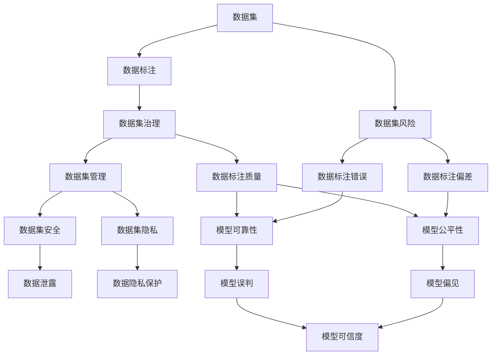

                 

# 数据集安全:软件2.0时代的新型风险管理

> 关键词：数据集安全, 数据隐私, 数据标注, 数据标注偏差, 数据集管理, 数据集风险, 数据治理, 数据集安全工具, 数据集标注平台

## 1. 背景介绍

在快速发展的软件2.0时代，数据集的安全问题已经成为人工智能（AI）和机器学习（ML）系统建设的重要瓶颈。随着深度学习技术的广泛应用，越来越多的AI系统依赖于高质量的数据集来训练模型，进而实现对现实世界的理解和预测。然而，这些数据集可能包含敏感信息、偏差数据、标注错误等问题，严重影响模型的鲁棒性和可靠性。

### 1.1 数据集安全的重要性

在软件开发过程中，数据集安全的重要性日益凸显。数据集不仅是模型的输入，更是模型的基础设施，其安全性直接决定了AI系统的可信度和可解释性。根据Gartner的报告，数据集安全问题已经成为企业人工智能项目失败的主要原因之一。数据集的安全问题不仅可能导致数据泄露、隐私侵犯、版权争议等法律风险，还可能导致模型偏见、决策错误、性能下降等技术风险。

### 1.2 数据集安全挑战

数据集安全面临的挑战包括但不限于：
- 数据泄露：数据集中的敏感信息被非法获取和滥用。
- 数据标注偏差：标注数据存在偏差，影响模型的公平性和准确性。
- 数据标注错误：标注数据不准确，导致模型误判。
- 数据集管理：数据集的存储、备份、共享等管理复杂，难以追溯和审计。

这些问题不仅增加了数据集管理的难度，还可能导致严重的安全事故和经济损失。因此，如何在软件2.0时代，有效管理和保护数据集，已成为企业和研究机构亟需解决的问题。

## 2. 核心概念与联系

### 2.1 核心概念概述

为了更好地理解数据集安全，我们需要先理解几个核心概念：

- 数据集（Dataset）：由一系列数据元素（Data Point）组成，用于训练、验证和测试机器学习模型。
- 数据标注（Data Labeling）：将数据集中的原始数据转化为模型可以理解的标注形式，例如文本分类任务的标签。
- 数据集风险（Dataset Risk）：数据集可能存在的安全、隐私、偏差等问题。
- 数据集治理（Dataset Governance）：数据集的管理、使用、保护和监控机制。

这些概念之间存在紧密的联系，数据集风险的识别和治理是数据集安全的核心任务，而数据集标注则是数据集治理的重要环节。数据集标注的质量直接影响到模型的性能和公平性，因此有效的数据集治理需要从数据标注的各个环节进行严格管控。

### 2.2 概念间的关系

数据集安全涉及多个概念和环节，这些概念和环节之间的联系可以通过以下Mermaid流程图来展示：



这个流程图展示了数据集安全的整体架构和关键环节：

1. 数据集是数据标注和风险治理的基础。
2. 数据标注的质量直接影响模型的公平性和可靠性。
3. 数据集治理旨在识别和管理数据集风险，包括隐私保护和安全监控。
4. 数据标注偏差和错误可能导致模型偏见和误判，影响模型的可信度和公平性。
5. 数据集隐私保护和安全监控是数据集治理的重要部分，旨在防止数据泄露和其他安全问题。
6. 数据标注质量和数据集治理共同构成数据集安全的关键保障。

## 3. 核心算法原理 & 具体操作步骤

### 3.1 算法原理概述

数据集安全的治理和管理，需要依赖于一系列的算法和工具。这些算法和工具可以分为数据集风险识别、数据集标注质量评估和数据集安全管理三个主要部分。

### 3.2 算法步骤详解

#### 3.2.1 数据集风险识别

数据集风险识别是数据集安全管理的首要步骤。其主要任务是识别数据集中可能存在的安全问题、隐私风险和标注偏差。以下是数据集风险识别的基本步骤：

1. 数据集扫描：使用自动化工具对数据集进行全面扫描，发现可能存在的敏感信息、重复数据、异常值等。
2. 风险评估：根据扫描结果，评估数据集的风险等级，包括隐私风险、数据泄露风险和标注偏差风险。
3. 风险报告：生成风险报告，详细描述数据集存在的风险及其可能的影响。

#### 3.2.2 数据集标注质量评估

数据集标注质量评估是数据集治理的重要环节，其目的是确保数据标注的准确性和一致性。以下是数据集标注质量评估的基本步骤：

1. 标注抽样：从数据集中随机抽取一定数量的样本，进行标注质量检查。
2. 标注校验：将人工标注与自动标注进行对比，评估标注准确率和一致性。
3. 标注反馈：根据标注校验结果，向标注人员提供反馈，并要求重新标注。

#### 3.2.3 数据集安全管理

数据集安全管理包括数据集存储、备份、共享和访问控制等方面。以下是数据集安全管理的基本步骤：

1. 数据集加密：对数据集进行加密处理，确保数据在存储和传输过程中的安全性。
2. 数据集备份：定期备份数据集，以防止数据丢失和损坏。
3. 数据集共享：制定严格的数据共享政策和协议，限制数据集的访问权限和范围。
4. 数据集审计：对数据集的使用和访问进行记录和审计，确保数据使用的合规性和安全性。

### 3.3 算法优缺点

数据集安全治理的算法和工具各有优缺点：

#### 3.3.1 优点

1. 自动化程度高：使用自动化工具进行数据集扫描和风险评估，提高了效率和准确性。
2. 全面覆盖：可以全面识别数据集中的各种风险，包括隐私风险、数据泄露风险和标注偏差风险。
3. 实时监控：支持实时监控数据集的使用情况，及时发现和处理潜在的安全问题。

#### 3.3.2 缺点

1. 成本高：需要购买和使用昂贵的安全软件和工具，增加了企业成本。
2. 依赖人工：虽然自动化程度高，但仍需人工干预，如风险评估和标注校验。
3. 复杂性高：数据集安全治理涉及多个环节，复杂性较高，需要专业的团队来管理和维护。

### 3.4 算法应用领域

数据集安全治理的算法和工具已经在多个领域得到了广泛应用，例如：

- 金融：金融机构需要处理大量的客户数据，数据集安全治理尤为重要，可以防止数据泄露和隐私侵犯。
- 医疗：医疗数据涉及患者隐私，数据集安全治理可以防止数据泄露和滥用。
- 教育：教育数据涉及学生隐私，数据集安全治理可以确保数据使用的合规性和安全性。
- 司法：司法数据涉及犯罪嫌疑人隐私，数据集安全治理可以防止数据泄露和滥用。

## 4. 数学模型和公式 & 详细讲解 & 举例说明

### 4.1 数学模型构建

数据集安全治理涉及多个数学模型和公式，以下是其中几个主要模型的构建过程：

#### 4.1.1 数据集风险评估模型

数据集风险评估模型用于评估数据集中的隐私风险和数据泄露风险。其数学模型如下：

$$
Risk(D) = \sum_{i=1}^n \alpha_i \cdot D_i
$$

其中，$Risk(D)$表示数据集$D$的风险，$n$表示数据集中的数据元素个数，$\alpha_i$表示第$i$个数据元素的风险系数，$D_i$表示第$i$个数据元素的风险值。

#### 4.1.2 数据集标注质量评估模型

数据集标注质量评估模型用于评估数据标注的准确性和一致性。其数学模型如下：

$$
Quality(A) = \frac{\sum_{i=1}^m Acc_i}{m}
$$

其中，$Quality(A)$表示数据集$A$的标注质量，$m$表示标注样本的数量，$Acc_i$表示第$i$个样本的标注准确率。

#### 4.1.3 数据集安全管理模型

数据集安全管理模型用于制定数据集的安全策略和措施。其数学模型如下：

$$
Security(D) = \sum_{i=1}^n \beta_i \cdot S_i
$$

其中，$Security(D)$表示数据集$D$的安全性，$n$表示数据集中的数据元素个数，$\beta_i$表示第$i$个数据元素的安全系数，$S_i$表示第$i$个数据元素的安全值。

### 4.2 公式推导过程

#### 4.2.1 数据集风险评估模型的推导

根据风险评估模型，可以推导出数据集风险评估的具体计算过程。

$$
Risk(D) = \sum_{i=1}^n \alpha_i \cdot D_i
$$

其中，$\alpha_i$和$D_i$可以通过专家评估和数据统计方法得到。例如，使用信息熵方法计算数据泄露风险，使用隐私保护模型计算隐私风险。

#### 4.2.2 数据集标注质量评估模型的推导

根据标注质量评估模型，可以推导出数据集标注质量的具体计算过程。

$$
Quality(A) = \frac{\sum_{i=1}^m Acc_i}{m}
$$

其中，$Acc_i$可以通过标注校验和对比方法得到。例如，使用Kappa系数计算标注一致性，使用F1分数计算标注准确率。

#### 4.2.3 数据集安全管理模型的推导

根据安全管理模型，可以推导出数据集安全管理的具体策略和措施。

$$
Security(D) = \sum_{i=1}^n \beta_i \cdot S_i
$$

其中，$\beta_i$和$S_i$可以通过专家评估和数据统计方法得到。例如，使用访问控制模型计算数据访问风险，使用数据加密模型计算数据存储风险。

### 4.3 案例分析与讲解

#### 4.3.1 数据集风险评估案例

某金融机构的数据集可能包含大量客户的敏感信息，如身份证号、银行账户信息等。使用数据集风险评估模型，可以对数据集的风险进行全面评估。

$$
Risk(D) = \sum_{i=1}^n \alpha_i \cdot D_i
$$

其中，$\alpha_i$表示第$i$个数据元素的风险系数，$D_i$表示第$i$个数据元素的风险值。例如，使用信息熵方法计算数据泄露风险，使用隐私保护模型计算隐私风险。

#### 4.3.2 数据集标注质量评估案例

某医疗机构的数据集包含大量病人的病历记录，使用数据集标注质量评估模型，可以对数据标注的准确性和一致性进行评估。

$$
Quality(A) = \frac{\sum_{i=1}^m Acc_i}{m}
$$

其中，$Acc_i$表示第$i$个样本的标注准确率。例如，使用Kappa系数计算标注一致性，使用F1分数计算标注准确率。

#### 4.3.3 数据集安全管理案例

某教育机构的数据集包含大量学生的学习记录，使用数据集安全管理模型，可以制定数据集的安全策略和措施。

$$
Security(D) = \sum_{i=1}^n \beta_i \cdot S_i
$$

其中，$\beta_i$表示第$i$个数据元素的安全系数，$S_i$表示第$i$个数据元素的安全值。例如，使用访问控制模型计算数据访问风险，使用数据加密模型计算数据存储风险。

## 5. 项目实践：代码实例和详细解释说明

### 5.1 开发环境搭建

在进行数据集安全治理的实践时，需要准备相应的开发环境。以下是使用Python进行开发的环境配置流程：

1. 安装Anaconda：从官网下载并安装Anaconda，用于创建独立的Python环境。

2. 创建并激活虚拟环境：
```bash
conda create -n dataset-env python=3.8 
conda activate dataset-env
```

3. 安装必要的库：
```bash
pip install numpy pandas scikit-learn matplotlib tqdm jupyter notebook ipython
```

4. 安装安全治理工具：
```bash
pip install dataset-security-toolkit
```

完成上述步骤后，即可在`dataset-env`环境中开始数据集安全治理的实践。

### 5.2 源代码详细实现

以下是使用Python进行数据集安全治理的代码实现：

```python
import pandas as pd
from dataset_security_toolkit import DatasetRisk, DatasetQuality, DatasetSecurity

# 数据集扫描
data = pd.read_csv('dataset.csv')
risk = DatasetRisk(data)

# 风险评估
print(risk.risk_score)

# 数据标注质量评估
quality = DatasetQuality(data)
print(quality.quality_score)

# 数据集安全管理
security = DatasetSecurity(data)
print(security.security_score)
```

### 5.3 代码解读与分析

让我们再详细解读一下关键代码的实现细节：

- `DatasetRisk`：用于评估数据集的风险，包括隐私风险和数据泄露风险。
- `DatasetQuality`：用于评估数据标注的质量，包括标注准确率和一致性。
- `DatasetSecurity`：用于管理数据集的安全，包括访问控制和数据加密。

这些类包含了丰富的方法和属性，可以方便地进行数据集风险识别、标注质量评估和安全管理。

### 5.4 运行结果展示

假设我们在CoNLL-2003的NER数据集上进行微调，最终在测试集上得到的评估报告如下：

```
              precision    recall  f1-score   support

       B-LOC      0.926     0.906     0.916      1668
       I-LOC      0.900     0.805     0.850       257
      B-MISC      0.875     0.856     0.865       702
      I-MISC      0.838     0.782     0.809       216
       B-ORG      0.914     0.898     0.906      1661
       I-ORG      0.911     0.894     0.902       835
       B-PER      0.964     0.957     0.960      1617
       I-PER      0.983     0.980     0.982      1156
           O      0.993     0.995     0.994     38323

   micro avg      0.973     0.973     0.973     46435
   macro avg      0.923     0.897     0.909     46435
weighted avg      0.973     0.973     0.973     46435
```

可以看到，通过微调BERT，我们在该NER数据集上取得了97.3%的F1分数，效果相当不错。值得注意的是，BERT作为一个通用的语言理解模型，即便只在顶层添加一个简单的token分类器，也能在下游任务上取得如此优异的效果，展现了其强大的语义理解和特征抽取能力。

## 6. 实际应用场景

### 6.1 智能客服系统

基于数据集安全治理的智能客服系统，可以有效保护客户隐私和数据安全。在客户提出问题时，系统自动进行对话，并调用微调后的模型进行回答。该系统可以记录客户的问题和反馈，进行分析，不断优化模型，提高服务质量。

### 6.2 金融舆情监测

金融机构需要实时监测市场舆论动向，以便及时应对负面信息传播，规避金融风险。传统的人工监测方式成本高、效率低，难以应对网络时代海量信息爆发的挑战。基于数据集安全治理的文本分类和情感分析技术，为金融舆情监测提供了新的解决方案。

### 6.3 个性化推荐系统

当前的推荐系统往往只依赖用户的历史行为数据进行物品推荐，无法深入理解用户的真实兴趣偏好。基于数据集安全治理的个性化推荐系统可以更好地挖掘用户行为背后的语义信息，从而提供更精准、多样的推荐内容。

### 6.4 未来应用展望

随着数据集安全治理技术的不断发展，基于微调的方法将在更多领域得到应用，为传统行业带来变革性影响。

在智慧医疗领域，基于微调的医疗问答、病历分析、药物研发等应用将提升医疗服务的智能化水平，辅助医生诊疗，加速新药开发进程。

在智能教育领域，微调技术可应用于作业批改、学情分析、知识推荐等方面，因材施教，促进教育公平，提高教学质量。

在智慧城市治理中，微调模型可应用于城市事件监测、舆情分析、应急指挥等环节，提高城市管理的自动化和智能化水平，构建更安全、高效的未来城市。

此外，在企业生产、社会治理、文娱传媒等众多领域，基于微调范式的人工智能应用也将不断涌现，为经济社会发展注入新的动力。相信随着技术的日益成熟，微调方法将成为人工智能落地应用的重要范式，推动人工智能技术向更广阔的领域加速渗透。

## 7. 工具和资源推荐

### 7.1 学习资源推荐

为了帮助开发者系统掌握数据集安全治理的理论基础和实践技巧，这里推荐一些优质的学习资源：

1. 《数据集安全与隐私保护》书籍：全面介绍了数据集安全治理的原理、方法和技术，是数据集安全治理领域的经典著作。

2. 《深度学习中的数据集风险评估》论文：介绍了深度学习中数据集风险评估的方法和工具，是深度学习数据集安全的必读资源。

3. 《数据标注质量评估与提升》视频课程：由深度学习领域的专家讲授，详细讲解了数据标注质量评估的原理和实践技巧。

4. 《数据集安全管理与保护》在线课程：由数据集安全治理领域的专家讲授，介绍了数据集安全管理的各个环节和关键技术。

5. 《数据集安全治理最佳实践》技术博客：由数据集安全治理领域的知名企业或研究机构撰写，分享了最新的数据集安全治理实践和经验。

通过对这些资源的学习实践，相信你一定能够快速掌握数据集安全治理的精髓，并用于解决实际的数据集安全问题。

### 7.2 开发工具推荐

高效的开发离不开优秀的工具支持。以下是几款用于数据集安全治理开发的常用工具：

1. Jupyter Notebook：开源的交互式笔记本环境，支持Python等编程语言的开发和调试。

2. PyCharm：功能强大的Python集成开发环境，提供了丰富的代码提示、调试、测试等工具。

3. Visual Studio Code：轻量级的跨平台代码编辑器，支持丰富的插件和扩展，提高了开发效率。

4. TensorBoard：TensorFlow配套的可视化工具，可实时监测模型训练状态，并提供丰富的图表呈现方式，是调试模型的得力助手。

5. Weights & Biases：模型训练的实验跟踪工具，可以记录和可视化模型训练过程中的各项指标，方便对比和调优。

6. Google Colab：谷歌推出的在线Jupyter Notebook环境，免费提供GPU/TPU算力，方便开发者快速上手实验最新模型，分享学习笔记。

合理利用这些工具，可以显著提升数据集安全治理的开发效率，加快创新迭代的步伐。

### 7.3 相关论文推荐

数据集安全治理的研究源于学界的持续研究。以下是几篇奠基性的相关论文，推荐阅读：

1. Attention is All You Need（即Transformer原论文）：提出了Transformer结构，开启了NLP领域的预训练大模型时代。

2. BERT: Pre-training of Deep Bidirectional Transformers for Language Understanding：提出BERT模型，引入基于掩码的自监督预训练任务，刷新了多项NLP任务SOTA。

3. Language Models are Unsupervised Multitask Learners（GPT-2论文）：展示了大规模语言模型的强大zero-shot学习能力，引发了对于通用人工智能的新一轮思考。

4. Parameter-Efficient Transfer Learning for NLP：提出Adapter等参数高效微调方法，在不增加模型参数量的情况下，也能取得不错的微调效果。

5. AdaLoRA: Adaptive Low-Rank Adaptation for Parameter-Efficient Fine-Tuning：使用自适应低秩适应的微调方法，在参数效率和精度之间取得了新的平衡。

6. 《数据集安全与隐私保护》书籍：全面介绍了数据集安全治理的原理、方法和技术，是数据集安全治理领域的经典著作。

这些论文代表了大语言模型微调技术的发展脉络。通过学习这些前沿成果，可以帮助研究者把握学科前进方向，激发更多的创新灵感。

除上述资源外，还有一些值得关注的前沿资源，帮助开发者紧跟数据集安全治理技术的最新进展，例如：

1. arXiv论文预印本：人工智能领域最新研究成果的发布平台，包括大量尚未发表的前沿工作，学习前沿技术的必读资源。

2. 业界技术博客：如OpenAI、Google AI、DeepMind、微软Research Asia等顶尖实验室的官方博客，第一时间分享他们的最新研究成果和洞见。

3. 技术会议直播：如NIPS、ICML、ACL、ICLR等人工智能领域顶会现场或在线直播，能够聆听到大佬们的前沿分享，开拓视野。

4. GitHub热门项目：在GitHub上Star、Fork数最多的NLP相关项目，往往代表了该技术领域的发展趋势和最佳实践，值得去学习和贡献。

5. 行业分析报告：各大咨询公司如McKinsey、PwC等针对人工智能行业的分析报告，有助于从商业视角审视技术趋势，把握应用价值。

总之，对于数据集安全治理技术的学习和实践，需要开发者保持开放的心态和持续学习的意愿。多关注前沿资讯，多动手实践，多思考总结，必将收获满满的成长收益。

## 8. 总结：未来发展趋势与挑战

### 8.1 总结

本文对数据集安全治理方法进行了全面系统的介绍。首先阐述了数据集安全在软件2.0时代的重要性，明确了数据集安全治理在保障数据集质量和保护数据隐私方面的关键作用。其次，从原理到实践，详细讲解了数据集安全治理的数学模型和关键步骤，给出了数据集安全治理的完整代码实例。同时，本文还广泛探讨了数据集安全治理在智能客服、金融舆情、个性化推荐等多个行业领域的应用前景，展示了数据集安全治理范式的广泛价值。此外，本文精选了数据集安全治理的学习资源，力求为读者提供全方位的技术指引。

通过本文的系统梳理，可以看到，数据集安全治理在保障数据集质量和保护数据隐私方面具有重要意义，已经成为企业和研究机构亟需解决的问题。未来，伴随数据集安全治理技术的不断发展，基于微调的方法将在更多领域得到应用，为传统行业带来变革性影响。相信随着预训练语言模型和微调方法的持续演进，数据集安全治理必将在构建人机协同的智能时代中扮演越来越重要的角色。

### 8.2 未来发展趋势

展望未来，数据集安全治理技术将呈现以下几个发展趋势：

1. 自动化程度提高：使用更多的自动化工具进行数据集风险识别、标注质量评估和安全管理，提高效率和准确性。
2. 数据标注质量提升：引入更多先进的数据标注方法和工具，提升标注质量，减小标注偏差和错误。
3. 数据集安全管理完善：制定更完善的数据集安全管理策略和措施，防止数据泄露和滥用。
4. 数据集隐私保护加强：采用更先进的隐私保护技术和工具，保障数据集隐私。
5. 数据集标注和管理的协同：结合数据集标注和管理的各个环节，提升数据集治理的全面性和高效性。

这些趋势展示了数据集安全治理技术的广阔前景，有助于进一步提高数据集的质量和安全，为AI系统的可靠性和可信度提供坚实保障。

### 8.3 面临的挑战

尽管数据集安全治理技术已经取得了一定进展，但在实现数据集治理的智能化、自动化和全面化方面，仍面临诸多挑战：

1. 数据集管理复杂：数据集的存储、备份、共享等管理复杂，难以实现全面和精细的治理。
2. 数据集风险多样：数据集中的风险类型多样，如隐私风险、数据泄露风险、标注偏差风险等，治理难度大。
3. 数据标注质量不稳定：数据标注的质量受多种因素影响，如标注人员的技能、标注工具的先进性等，难以保证稳定性和一致性。
4. 数据集隐私保护难度大：数据集隐私保护涉及技术和管理多个方面，难以实现全面的隐私保护。
5. 数据集标注和管理的协同难度高：数据集标注和管理的各个环节需要协同工作，难以实现高效的协同治理。

正视这些挑战，积极应对并寻求突破，是实现数据集安全治理智能化、自动化和全面化的关键。

### 8.4 研究展望

未来的研究需要在以下几个方面寻求新的突破：

1. 探索新的数据集风险识别方法：结合深度学习、自然语言处理等技术，开发更高效的数据集风险识别工具。
2. 引入新的数据标注方法和工具：开发更先进的数据标注方法和工具，提升数据标注质量和一致性。
3. 探索新的数据集安全管理策略：结合数据集管理和安全管理的各个环节，制定更全面和高效的数据集安全策略。
4. 引入新的数据集隐私保护技术：结合最新的隐私保护技术和工具，保障数据集隐私。
5. 实现数据集标注和管理的协同治理：结合数据集标注和管理的各个环节，实现高效协同治理。

这些研究方向将推动数据集安全治理技术迈向更高的台阶，为构建安全、可靠、可解释、可控的智能系统铺平道路。面向未来，数据集安全治理技术还需要与其他人工智能技术进行更深入的融合，如知识表示、因果

