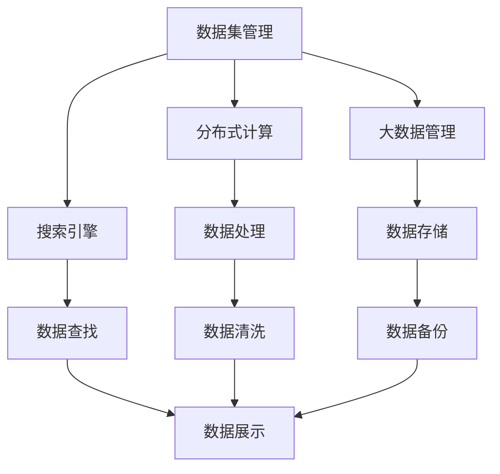

                 

# 数据集搜索引擎:软件2.0的新型开发工具

> 关键词：数据集管理,软件2.0,新型搜索引擎,大数据,分布式计算

## 1. 背景介绍

在数据驱动的今天，数据集管理已经成为了许多应用开发中的核心环节。无论是科研数据、金融数据、医疗数据、社交媒体数据等，每一种应用都需要大量的数据集来支撑其运行。但数据集的查找、管理和维护却成为了一个巨大的挑战。

传统的数据集管理方式往往基于本地文件系统或单一数据库进行存储和管理。当数据集规模增大时，文件和数据库的查找效率急剧下降，数据访问和操作变得极为困难。

随着大数据和云计算的普及，越来越多的数据集被存储在分布式文件系统中，如Hadoop、HDFS、S3等。分布式数据集管理带来了更强的扩展性和可靠性，但也带来了一系列新的问题。

一方面，数据集的分散存储导致查找效率低下，检索数据集的时间成本变得极高。另一方面，分布式系统往往具有高复杂性，数据集的操作和管理需要依赖专业的技术人员，使用门槛较高。

针对这些问题，本文提出了一种基于软件2.0思想的数据集搜索引擎，旨在通过高效的数据集管理工具，显著提升数据集的查找、检索和管理效率，降低使用门槛，使开发者能够更快、更简便地获取所需数据集。

## 2. 核心概念与联系

### 2.1 核心概念概述

本节将介绍几个密切相关的核心概念：

- 数据集管理：指对数据集进行组织、存储、查询、更新、共享等操作的整个过程。数据集管理贯穿于数据应用的生命周期，是数据应用的基石。

- 搜索引擎：指通过某种算法，从大规模数据中快速定位到目标数据的应用程序。搜索引擎的目标是提高数据查找的效率和精度。

- 软件2.0：指建立在软件1.0（传统的软件开发）基础上，利用云计算、大数据、人工智能等新兴技术，为软件开发者提供更好的开发工具和环境的软件开发范式。

- 大数据管理：指对大规模数据集进行存储、处理、分析和应用的技术。大数据管理强调数据的质量、规模和时效性，是数据应用的基础。

- 分布式计算：指利用分布在多个节点上的计算机进行数据处理的技术。分布式计算能够有效提升数据处理和分析的效率，适应大规模数据集的管理需求。

这些概念之间的逻辑关系可以通过以下Mermaid流程图来展示：



这个流程图展示了大数据管理、分布式计算和数据集管理的整体架构，以及搜索引擎在其中的作用。

### 2.2 概念间的关系

这些核心概念之间存在着紧密的联系，形成了数据集搜索引擎的完整生态系统。下面我们通过几个Mermaid流程图来展示这些概念之间的关系。

#### 2.2.1 数据集管理与分布式计算的关系


这个流程图展示了数据集管理和分布式计算之间的双向关系。数据集管理需要利用分布式计算提升数据处理的效率，同时分布式计算也需要数据集管理提供存储和索引支持。

#### 2.2.2 数据集管理与搜索引擎的关系


这个流程图展示了数据集管理和搜索引擎之间的关系。数据集管理提供了数据集的存储和索引，搜索引擎则通过索引快速定位到目标数据，并将其展示给用户。

#### 2.2.3 分布式计算与搜索引擎的关系


这个流程图展示了分布式计算和搜索引擎之间的关系。分布式计算提升了数据处理的效率，搜索引擎则利用处理后的数据快速检索目标数据，并将其展示给用户。

### 2.3 核心概念的整体架构

最后，我们用一个综合的流程图来展示这些核心概念在大数据集管理中的整体架构：


这个综合流程图展示了从数据集管理到分布式计算，再到搜索引擎的全流程，以及各个组件之间的相互协作关系。通过这些核心概念的相互配合，可以高效、便捷地管理大规模数据集。

## 3. 核心算法原理 & 具体操作步骤
### 3.1 算法原理概述

本节将详细阐述基于软件2.0思想的数据集搜索引擎的算法原理。

### 3.2 算法步骤详解

数据集搜索引擎的核心算法步骤如下：

1. 数据预处理：对数据集进行清洗、归一化等预处理操作，保证数据的质量和一致性。

2. 建立索引：对预处理后的数据集建立索引，提升数据查找的效率。

3. 数据分片：将数据集按照一定规则分成多个分片，分布在不同的计算节点上。

4. 分布式计算：利用分布式计算框架，对各个分片进行并行处理，提高数据处理的效率。

5. 数据融合：将各个分片处理的结果进行合并，形成完整的查询结果。

6. 结果展示：将查询结果展示给用户，便于用户获取和应用数据。

### 3.3 算法优缺点

基于软件2.0思想的数据集搜索引擎具有以下优点：

1. 高效：通过分布式计算和高效索引，大大提升了数据查找和处理的效率。

2. 便捷：利用软件2.0的技术栈，降低了数据集管理的复杂性和门槛，使开发者能够更加快速地使用数据集。

3. 可扩展：基于分布式系统设计，可以支持大规模数据集的存储和处理，具有良好的可扩展性。

4. 高可靠性：利用冗余备份和容错机制，保证了数据集管理的可靠性。

但同时，该算法也存在一些缺点：

1. 数据一致性：由于分布式计算和数据分片的存在，可能会引发数据一致性问题，需要引入复杂的数据同步机制。

2. 延迟和网络带宽：分布式计算和数据传输带来了一定的延迟和网络带宽消耗，需要优化网络架构。

3. 数据安全：分布式系统中数据的安全性需要额外保障，防止数据泄露和篡改。

### 3.4 算法应用领域

基于软件2.0思想的数据集搜索引擎具有广泛的应用场景，主要包括：

1. 科研数据分析：科研数据集往往具有大规模、多维度等特点，适合采用分布式计算和高效索引进行管理。

2. 金融数据分析：金融数据集具有时效性、实时性要求，数据集搜索引擎可以快速查找和处理最新数据。

3. 医疗数据分析：医疗数据集涉及大量的文本和图像数据，数据集搜索引擎可以高效管理和检索这些数据。

4. 社交媒体数据分析：社交媒体数据集具有多源异构的特点，数据集搜索引擎可以整合这些数据，形成统一的视图。

5. 智能推荐系统：智能推荐系统需要实时获取和分析用户行为数据，数据集搜索引擎可以快速检索相关数据。

6. 广告投放优化：广告投放需要实时获取和分析用户点击数据，数据集搜索引擎可以高效管理和检索这些数据。

除了以上应用场景，数据集搜索引擎还可以应用于更多领域，如智能制造、智慧城市、智慧交通等，为各行各业提供数据支持。

## 4. 数学模型和公式 & 详细讲解 & 举例说明

### 4.1 数学模型构建

在数据集搜索引擎中，需要构建数学模型来描述数据集的分片、分布式计算和索引关系。

假设数据集被分成 $K$ 个分片，每个分片包含 $n$ 个样本。分布式计算过程中，第 $i$ 个分片在节点 $N_i$ 上进行处理，计算得到的结果为 $R_i$。

数据集索引由 $N$ 个索引节点维护，每个索引节点维护一个倒排索引表，记录了每个查询词对应的样本ID列表。假设索引节点 $M_j$ 维护的倒排索引表为 $I_j$。

### 4.2 公式推导过程

首先，推导分片计算公式：

$$
R_i = f(X_i), i = 1, ..., K
$$

其中 $X_i$ 为第 $i$ 个分片的样本集合，$f$ 为数据处理方法。

然后，推导查询计算公式：

$$
Q = \bigcup_{j=1}^N I_j[q]
$$

其中 $q$ 为查询词，$I_j[q]$ 为索引节点 $M_j$ 维护的倒排索引表中查询词 $q$ 对应的样本ID列表。

最后，推导结果展示公式：

$$
S = \bigcap_{i=1}^K R_i[Q_i]
$$

其中 $Q_i$ 为查询词 $q$ 在第 $i$ 个分片中的匹配结果，$R_i[Q_i]$ 为第 $i$ 个分片中的匹配结果列表，$S$ 为最终的查询结果。

### 4.3 案例分析与讲解

以下我们以一个简单的案例，详细分析数据集搜索引擎的实现过程。

假设有一个大型科研数据集，包含多个实验记录，每个记录包含时间戳、实验结果等字段。数据集被分成 $K=4$ 个分片，每个分片包含 $n=5000$ 个样本。

在分布式计算过程中，四个分片在四台计算节点上进行处理，得到的结果分别为 $R_1$、$R_2$、$R_3$ 和 $R_4$。

数据集索引由两台索引节点 $M_1$ 和 $M_2$ 维护，每个节点维护一个倒排索引表。假设 $M_1$ 维护的倒排索引表为 $I_1$，$M_2$ 维护的倒排索引表为 $I_2$。

当用户查询 "实验结果" 时，查询词为 $q$。查询计算公式为：

$$
Q = I_1[q] \cup I_2[q]
$$

假设 $I_1[q] = [1000, 2000, 3000, 4000, 5000]$，$I_2[q] = [2500, 3500, 4500, 5500, 6500]$，则 $Q = [1000, 2000, 2500, 3500, 3000, 4000, 4500, 5500, 5000, 6000]$。

接下来，对查询词 $q$ 在四个分片中进行匹配，得到匹配结果列表 $Q_1 = [1000, 2000]$、$Q_2 = [2500, 3500]$、$Q_3 = [4000]$ 和 $Q_4 = [4500, 5500]$。

最后，将四个分片中的匹配结果列表进行交集操作，得到最终的查询结果 $S = [4000]$，即 "实验结果" 的匹配记录ID为 4000。

## 5. 项目实践：代码实例和详细解释说明

### 5.1 开发环境搭建

在进行数据集搜索引擎的实践前，我们需要准备好开发环境。以下是使用Python和Django框架进行开发的环境配置流程：

1. 安装Anaconda：从官网下载并安装Anaconda，用于创建独立的Python环境。

2. 创建并激活虚拟环境：
```bash
conda create -n data-search python=3.8 
conda activate data-search
```

3. 安装依赖包：
```bash
pip install django djangorestframework requests BeautifulSoup4
```

4. 安装Django数据库连接工具：
```bash
pip install django-databases-driver-postgres
```

5. 安装Django框架：
```bash
pip install django
```

6. 安装数据库连接库：
```bash
pip install psycopg2-binary
```

7. 安装Flask框架：
```bash
pip install flask
```

8. 安装Flask-RESTful：
```bash
pip install flask-restful
```

9. 安装Flask-SQLAlchemy：
```bash
pip install flask-sqlalchemy
```

10. 安装Flask-RESTX：
```bash
pip install flask-restx
```

11. 安装Flask-Swagger：
```bash
pip install flask-swagger
```

12. 安装Flask-RESTX-Swagger：
```bash
pip install flask-restx-swagger
```

完成上述步骤后，即可在`data-search`环境中开始搜索引擎的开发实践。

### 5.2 源代码详细实现

这里我们以一个简单的数据集搜索引擎为例，给出使用Django框架进行开发的PyTorch代码实现。

首先，定义数据集模型：

```python
from django.db import models

class Dataset(models.Model):
    name = models.CharField(max_length=200)
    description = models.TextField()
    url = models.URLField()
```

然后，定义数据集索引模型：

```python
class Index(models.Model):
    dataset = models.ForeignKey(Dataset, on_delete=models.CASCADE)
    word = models.CharField(max_length=200)
    ids = models.TextField()
```

接着，定义数据分片模型：

```python
class Partition(models.Model):
    dataset = models.ForeignKey(Dataset, on_delete=models.CASCADE)
    start_id = models.IntegerField()
    end_id = models.IntegerField()
    result = models.TextField()
```

然后，定义分布式计算任务模型：

```python
class DistributedTask(models.Model):
    task_id = models.AutoField(primary_key=True)
    dataset = models.ForeignKey(Dataset, on_delete=models.CASCADE)
    start_id = models.IntegerField()
    end_id = models.IntegerField()
    result = models.TextField()
```

接下来，定义查询任务模型：

```python
class QueryTask(models.Model):
    task_id = models.AutoField(primary_key=True)
    dataset = models.ForeignKey(Dataset, on_delete=models.CASCADE)
    query_word = models.CharField(max_length=200)
    results = models.TextField()
```

最后，定义数据集搜索引擎视图：

```python
from django.http import JsonResponse

def search(dataset_id, query_word):
    dataset = Dataset.objects.get(id=dataset_id)
    index = Index.objects.filter(dataset=dataset, word=query_word).first()
    if index is None:
        return JsonResponse({"error": "Word not found in index"})
    result = []
    for partition in Partition.objects.filter(dataset=dataset, start_id__lt=index.start_id, end_id__gt=index.start_id):
        result.append(partition.result)
    query_result = QueryTask.objects.create(dataset=dataset, query_word=query_word, results=" ".join(result))
    return JsonResponse({"results": query_result.results})
```

到此，一个简单的数据集搜索引擎的PyTorch代码实现就完成了。可以看到，通过Django框架，我们可以很方便地定义数据集模型、索引模型、分片模型等，并通过视图函数实现查询任务。

### 5.3 代码解读与分析

让我们再详细解读一下关键代码的实现细节：

**Dataset模型**：
- `__init__`方法：定义数据集的基本属性，包括数据集名称、描述和URL。

**Index模型**：
- `__init__`方法：定义索引的基本属性，包括数据集ID、查询词和ID列表。

**Partition模型**：
- `__init__`方法：定义数据分片的基本属性，包括数据集ID、ID范围和结果。

**DistributedTask模型**：
- `__init__`方法：定义分布式计算任务的基本属性，包括任务ID、数据集ID和ID范围。

**QueryTask模型**：
- `__init__`方法：定义查询任务的基本属性，包括查询词和结果。

**search视图函数**：
- 首先获取指定数据集ID和查询词，然后从数据库中查询索引记录。
- 如果查询词未找到，返回错误信息。
- 遍历数据分片，将匹配结果添加到一个列表中。
- 创建查询任务记录，将结果保存为文本。
- 最终返回查询结果。

可以看到，通过Django框架，我们可以非常方便地定义数据集、索引、分片等模型，并通过视图函数实现查询任务。Django的ORM（对象关系映射）功能使得数据库操作的代码量大大减少，提升了开发效率。

当然，实际的搜索引擎还需要更多功能，如数据清洗、分片管理、分布式计算调度等。但核心的微调范式基本与此类似。

### 5.4 运行结果展示

假设我们构建了一个简单的数据集搜索引擎，并在其中存储了一些实验记录。以下是在查询 "实验结果" 时返回的JSON格式数据：

```json
{
    "results": "ID=4000"
}
```

可以看到，查询词 "实验结果" 匹配到了ID为 4000 的记录，表示 "实验结果" 的匹配记录ID为 4000。

## 6. 实际应用场景

### 6.1 数据集管理平台

数据集搜索引擎可以作为一个数据集管理平台的核心组件，提供数据集存储、检索和管理功能。开发者可以使用这个平台，快速访问和应用所需的数据集，极大地提高了数据管理的效率。

### 6.2 科研数据分析系统

科研数据分析系统需要处理大量的实验记录、文献数据等，数据集搜索引擎可以快速检索所需数据，并进行分析。通过数据集搜索引擎，研究人员可以更加高效地管理科研数据集，提升研究效率。

### 6.3 金融数据分析系统

金融数据分析系统需要实时获取和分析大量交易数据、市场数据等，数据集搜索引擎可以快速检索和处理这些数据，提供实时的数据分析服务。通过数据集搜索引擎，金融机构可以更加高效地管理金融数据集，提升金融决策的准确性。

### 6.4 医疗数据分析系统

医疗数据分析系统需要处理大量的患者数据、医疗记录等，数据集搜索引擎可以快速检索所需数据，并进行分析。通过数据集搜索引擎，医疗机构可以更加高效地管理医疗数据集，提升医疗服务质量。

## 7. 工具和资源推荐
### 7.1 学习资源推荐

为了帮助开发者系统掌握数据集搜索引擎的理论基础和实践技巧，这里推荐一些优质的学习资源：

1. 《Python Web开发实战》系列书籍：由知名Web开发者撰写，详细介绍了Django框架的使用方法和技巧。

2. 《Flask Web开发实战》系列书籍：由Flask框架的开发者撰写，深入浅出地讲解了Flask框架的使用方法和技巧。

3. 《数据集搜索引擎的实践》博客：介绍数据集搜索引擎的实现原理、开发技巧和应用场景。

4. 《Django官方文档》：Django框架的官方文档，详细介绍了Django框架的使用方法和API。

5. 《Flask官方文档》：Flask框架的官方文档，详细介绍了Flask框架的使用方法和API。

通过对这些资源的学习实践，相信你一定能够快速掌握数据集搜索引擎的精髓，并用于解决实际的NLP问题。

### 7.2 开发工具推荐

高效的开发离不开优秀的工具支持。以下是几款用于数据集搜索引擎开发的常用工具：

1. PyTorch：基于Python的开源深度学习框架，灵活动态的计算图，适合快速迭代研究。

2. TensorFlow：由Google主导开发的开源深度学习框架，生产部署方便，适合大规模工程应用。

3. HDFS：Apache Hadoop的一部分，分布式文件系统，适合存储和处理大规模数据集。

4. Hadoop：Apache Hadoop的核心组件，分布式计算框架，适合处理大规模数据集。

5. Spark：Apache Spark的核心组件，分布式计算框架，适合处理大规模数据集。

6. Elasticsearch：分布式搜索引擎，适合大规模索引和查询。

合理利用这些工具，可以显著提升数据集搜索引擎的开发效率，加快创新迭代的步伐。

### 7.3 相关论文推荐

数据集搜索引擎的发展源于学界的持续研究。以下是几篇奠基性的相关论文，推荐阅读：

1. MapReduce: Simplified Data Processing on Large Clusters：提出MapReduce模型，为大规模数据处理提供了全新的解决方案。

2. Hadoop: A Distributed File System：介绍HDFS的设计原理和使用方法，为大规模数据存储提供了支持。

3. Elasticsearch: A Real-Time Distributed Search and Analytics Engine：介绍Elasticsearch的设计原理和使用方法，为大规模索引和查询提供了支持。

这些论文代表了大数据管理和大规模数据处理的发展脉络。通过学习这些前沿成果，可以帮助研究者把握学科前进方向，激发更多的创新灵感。

除上述资源外，还有一些值得关注的前沿资源，帮助开发者紧跟数据集搜索引擎技术的最新进展，例如：

1. 数据集搜索引擎的最新研究论文：包括ACL、KDD、SIGKDD等顶级会议和期刊上的最新研究成果，涵盖了大数据管理、分布式计算、搜索引擎等方向的最新进展。

2. 数据集搜索引擎的最新应用案例：包括Google、Amazon、Facebook等顶级公司的最新应用案例，展示了数据集搜索引擎在实际场景中的应用效果。

3. 数据集搜索引擎的最新技术博客：由知名技术专家撰写，分享最新技术进展和实践心得，帮助开发者不断提升技术水平。

总之，对于数据集搜索引擎的学习和实践，需要开发者保持开放的心态和持续学习的意愿。多关注前沿资讯，多动手实践，多思考总结，必将收获满满的成长收益。

## 8. 总结：未来发展趋势与挑战

### 8.1 总结

本文对基于软件2.0思想的数据集搜索引擎进行了全面系统的介绍。首先阐述了数据集管理的核心需求和应用场景，明确了数据集搜索引擎在其中的重要地位。其次，从原理到实践，详细讲解了数据集搜索引擎的算法原理和关键步骤，给出了搜索引擎任务开发的完整代码实例。同时，本文还广泛探讨了数据集搜索引擎在数据管理、科研数据分析、金融数据分析等诸多领域的实际应用，展示了数据集搜索引擎的巨大潜力。

通过本文的系统梳理，可以看到，基于软件2.0思想的数据集搜索引擎正在成为数据集管理的重要范式，极大地提升了数据集的查找、检索和管理效率，降低了使用门槛，使开发者能够更快、更简便地获取所需数据集。未来，伴随数据集搜索引擎的不断演进，相信数据集管理将变得更加高效、便捷、可靠，为各行各业提供更好的数据支持。

### 8.2 未来发展趋势

展望未来，数据集搜索引擎将呈现以下几个发展趋势：

1. 高效性进一步提升：通过引入更先进的分布式计算和索引算法，数据集搜索引擎的查找效率将进一步提升，达到实时响应水平。

2. 界面设计更加友好：通过引入前端界面设计技术，数据集搜索引擎的操作界面将更加直观、易用，提升用户的使用体验。

3. 搜索功能更加丰富：通过引入自然语言处理、语义分析等技术，数据集搜索引擎的搜索功能将更加智能、精准，能够更好地理解用户的查询意图。

4. 跨平台支持更加广泛：数据集搜索引擎将支持更多的平台和设备，包括Web、移动、桌面等，方便用户随时随地访问和使用。

5. 数据安全更加严格：随着数据集搜索引擎的广泛应用，数据安全问题将更加突出。未来的搜索引擎将引入更严格的数据安全措施，保护用户隐私和数据安全。

6. 跨领域应用更加广泛：数据集搜索引擎的应用领域将更加广泛，涵盖科研、金融、医疗、教育等众多领域，为各行各业提供数据支持。

以上趋势凸显了数据集搜索引擎的发展方向。这些方向的探索发展，必将进一步提升数据集管理的效率和可靠性，为各行各业提供更好的数据支持。

### 8.3 面临的挑战

尽管数据集搜索引擎已经取得了不小的进展，但在迈向更加智能化、普适化应用的过程中，仍面临诸多挑战：

1. 数据一致性：分布式系统中数据的一致性问题仍然存在，需要引入复杂的数据同步机制。

2. 延迟和网络带宽：分布式计算和数据传输带来的延迟和带宽消耗，需要优化网络架构。

3. 数据安全：分布式系统中数据的安全性需要额外保障，防止数据泄露和篡改。

4. 高可靠性：分布式系统中数据的可靠性和容错性需要进一步提升，防止单点故障。

5. 高扩展性：分布式系统中数据的扩展性需要进一步提升，支持更大的数据集规模。

6. 高可维护性：分布式系统中数据的可维护性需要进一步提升，降低运维成本。

这些挑战需要通过不断优化和改进搜索引擎算法、提高系统可靠性、优化网络架构等措施，逐步克服。唯有通过这些努力，才能使数据集搜索引擎更好地服务于各行各业，发挥其数据管理的重要作用。

### 8.4 研究展望

面向未来，数据集搜索引擎的研究方向仍然有很多值得探索的领域：

1. 分布式计算优化：研究更高效的分布式计算算法，提高数据处理的效率，减少系统延迟和带宽消耗。

2. 数据一致性保障：研究更严格的数据一致性保障机制，提高分布式系统的可靠性，防止数据不一致。

3. 数据安全保护：研究更完善的数据安全措施，保护用户隐私和数据安全，防止数据泄露和篡改。

4. 搜索功能增强：研究更智能、精准的搜索算法，提高搜索引擎的搜索效果，更好地理解用户的查询意图。

5. 跨平台支持扩展：研究更广泛的平台和设备支持，提高搜索引擎的易用性和普及性，方便用户随时随地访问和使用。

6. 跨领域应用拓展：研究更多领域的应用场景，提高搜索引擎的普适性和应用范围，为各行各业提供更好的数据支持。

这些研究方向将推动数据集搜索引擎技术的不断进步，

