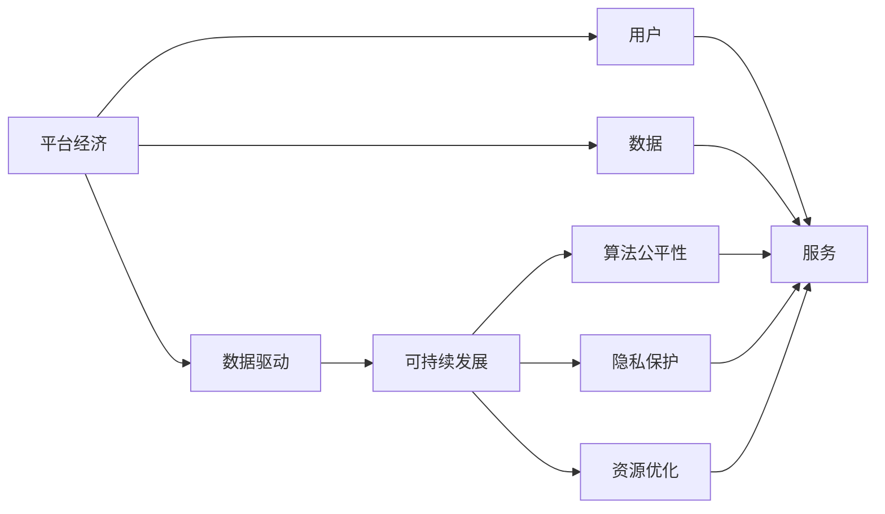
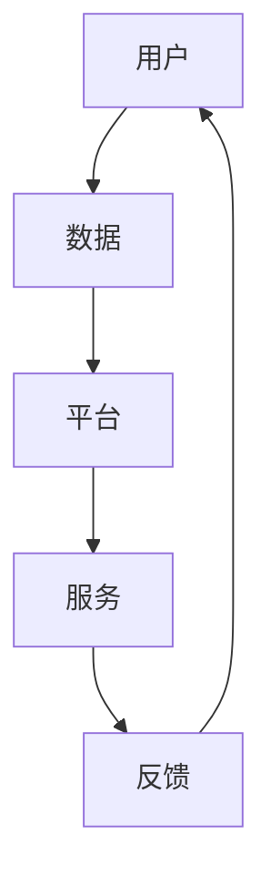
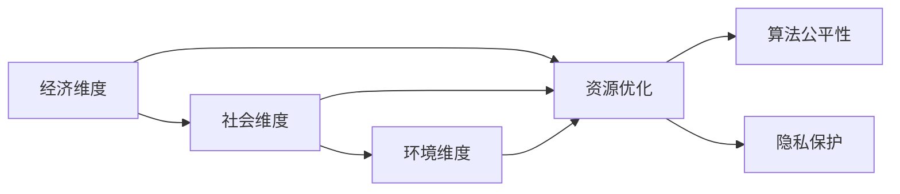
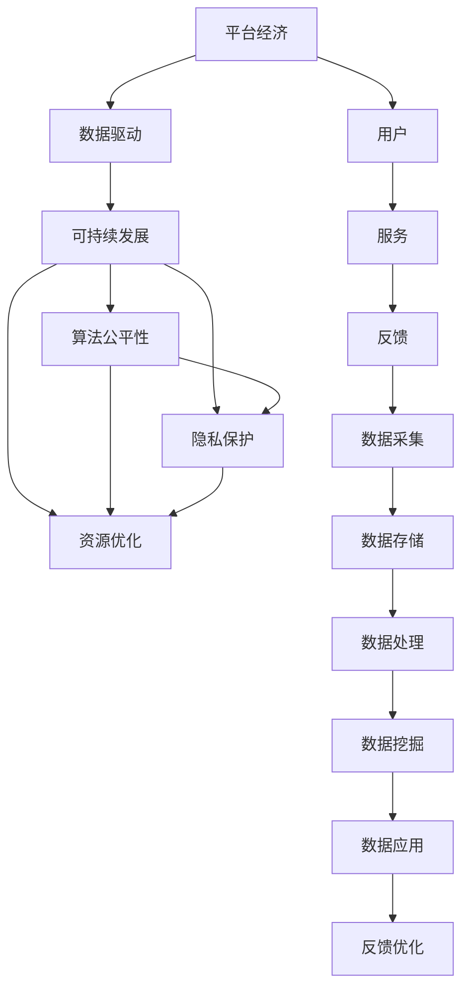

                 

# 数据驱动平台经济发展：如何实现可持续发展？

在数字经济时代，平台经济作为新兴的经济形态，通过聚合大量用户和数据，提供高效匹配和丰富服务，已成为支撑现代经济体系的重要引擎。然而，平台经济的快速扩张也带来了数据驱动的可持续发展问题。如何通过数据驱动技术，实现平台经济的绿色、普惠和透明发展，已成为当前研究的重要课题。本文将全面探讨数据驱动平台经济发展的核心概念、算法原理、实践步骤和未来展望，为实现可持续的经济发展提供理论和技术支撑。

## 1. 背景介绍

### 1.1 问题由来
随着互联网技术的发展和应用场景的不断拓展，平台经济在零售、金融、物流、娱乐等多个领域迅速崛起。平台经济通过汇聚海量用户和数据，实现了资源的有效整合和优化配置，极大地提升了生产力。但与此同时，平台经济在快速发展中也带来了诸多问题：数据孤岛、隐私泄露、算法偏见、资源浪费等，亟需通过数据驱动技术进行解决。

### 1.2 问题核心关键点
平台经济的核心在于数据和算法的协同作用，通过数据的聚合和算法的优化，实现资源的匹配和服务的提升。但数据驱动的平台经济发展，也面临着数据质量、隐私保护、算法公平性、环境影响等多方面的挑战。因此，如何构建数据驱动的可持续发展框架，成为平台经济发展的关键。

### 1.3 问题研究意义
研究数据驱动平台经济的可持续发展问题，对于推动数字经济的健康发展、实现绿色普惠社会的建设、提升企业竞争力和用户满意度具有重要意义：

1. **绿色发展**：通过数据驱动技术优化资源配置，减少环境污染和资源浪费。
2. **普惠社会**：利用数据驱动技术促进资源的公平分配和共享，提升社会福利。
3. **竞争力提升**：通过算法优化提升平台服务的质量，增强企业竞争力。
4. **用户满意度**：数据驱动的个性化服务和精准推荐，提升用户使用体验。

## 2. 核心概念与联系

### 2.1 核心概念概述

为更好地理解数据驱动平台经济发展的核心概念，本节将介绍几个密切相关的核心概念：

- **平台经济**：基于互联网技术，通过聚合大量用户和数据，提供高效匹配和丰富服务，形成规模经济和范围经济的新型经济模式。
- **数据驱动**：利用数据收集、存储、分析和应用技术，驱动经济和社会发展的过程和方法。
- **可持续发展**：在经济、社会和环境三个维度上实现长期健康发展的战略目标。
- **算法公平性**：确保算法在处理数据时不带有歧视或偏见，实现公平、公正的资源分配。
- **隐私保护**：保护个人数据权益，防止数据泄露和滥用。
- **资源优化**：通过数据驱动技术，实现资源的有效整合和优化配置。

这些核心概念之间的逻辑关系可以通过以下Mermaid流程图来展示：



这个流程图展示了大数据驱动平台经济的各个核心概念及其之间的关系：

1. 平台经济通过数据驱动技术进行支撑。
2. 数据驱动的目标是实现可持续发展。
3. 可持续发展包括算法公平性、隐私保护和资源优化。
4. 用户是平台经济的核心，数据驱动服务于用户。
5. 数据驱动的服务提升涉及算法公平性、隐私保护和资源优化。

### 2.2 概念间的关系

这些核心概念之间存在着紧密的联系，形成了平台经济发展的完整生态系统。下面我们通过几个Mermaid流程图来展示这些概念之间的关系。

#### 2.2.1 平台经济的基本架构



这个流程图展示了平台经济的基本架构，即用户通过平台获取服务，平台通过数据驱动技术优化服务，同时收集用户反馈以进一步优化。

#### 2.2.2 数据驱动的基本流程


这个流程图展示了数据驱动技术的基本流程，即从数据采集到数据应用的完整过程，最后通过反馈优化提升数据质量。

#### 2.2.3 可持续发展的多维度模型



这个流程图展示了可持续发展的多维度模型，即经济、社会和环境的三个维度，以及数据驱动技术在这三个维度上的作用。

### 2.3 核心概念的整体架构

最后，我们用一个综合的流程图来展示这些核心概念在大数据驱动平台经济发展过程中的整体架构：



这个综合流程图展示了从用户需求到数据采集、存储、处理、挖掘、应用、反馈优化的完整过程，以及算法公平性、隐私保护和资源优化在各个环节的作用。通过这些概念和流程的相互配合，数据驱动平台经济得以实现可持续发展。

## 3. 核心算法原理 & 具体操作步骤
### 3.1 算法原理概述

数据驱动平台经济发展，主要依赖于数据收集、存储、处理、分析和应用的算法技术。其核心思想是利用数据聚合和算法优化，实现资源的高效匹配和服务的精准推送。

在算法原理方面，主要包括以下几个方面：

- **数据聚类**：通过聚类算法将用户、物品等进行分组，实现资源的高效匹配。
- **推荐系统**：利用协同过滤、矩阵分解等算法，为每个用户推荐个性化内容。
- **图网络模型**：通过图算法构建用户和物品的关系图，挖掘网络结构中的潜在信息。
- **强化学习**：通过奖励机制优化算法策略，提升平台的长期收益。
- **联邦学习**：通过分布式训练技术，保护数据隐私，实现数据驱动的分布式优化。

### 3.2 算法步骤详解

数据驱动平台经济发展的算法步骤主要包括以下几个关键环节：

**Step 1: 数据采集与预处理**
- 通过爬虫、API接口等方式采集用户行为数据。
- 对采集到的数据进行去重、清洗、标准化等预处理。

**Step 2: 数据存储与管理**
- 利用数据库、云存储等技术，高效存储和管理数据。
- 采用分布式存储技术，实现数据的水平扩展和数据冗余备份。

**Step 3: 数据挖掘与分析**
- 利用机器学习、深度学习等算法进行数据挖掘。
- 使用聚类、分类、回归等方法，从数据中提取有用的信息。

**Step 4: 模型训练与优化**
- 构建基于数据驱动的模型，如推荐系统、图网络模型等。
- 利用大规模数据进行模型训练，通过交叉验证等方法进行模型优化。

**Step 5: 服务部署与评估**
- 将训练好的模型部署到生产环境，提供个性化服务。
- 通过A/B测试等方法评估服务效果，进行持续优化。

### 3.3 算法优缺点

数据驱动平台经济发展算法的主要优点包括：

- **高效匹配**：通过数据聚类、推荐算法等，实现资源的精准匹配和高效利用。
- **个性化服务**：基于用户行为数据，提供个性化的服务和推荐，提升用户满意度。
- **实时优化**：通过实时数据流，不断优化模型和算法，提升服务质量。

同时，这些算法也存在一些缺点：

- **数据隐私风险**：大规模数据采集和存储可能带来数据隐私风险，需要严格的隐私保护措施。
- **算法偏见**：数据和算法的偏见可能导致不公平的资源分配，需要注重算法公平性。
- **模型复杂性**：复杂模型可能导致计算成本高，需要平衡模型复杂度和计算效率。
- **数据质量**：数据质量直接影响算法的准确性，需要进行严格的数据清洗和预处理。

### 3.4 算法应用领域

数据驱动平台经济的发展，在多个领域得到了广泛应用，例如：

- **零售电商**：通过推荐系统、个性化搜索等技术，提升用户体验和销售额。
- **金融服务**：利用图网络模型、强化学习等技术，实现风险控制和精准营销。
- **物流配送**：通过数据聚类、路径优化算法，提升配送效率和用户体验。
- **医疗健康**：利用数据挖掘和分析技术，提供精准诊疗和健康管理服务。
- **智能制造**：通过数据驱动的智能生产系统，实现资源的优化配置和高效利用。

除了上述这些领域，数据驱动平台经济发展还在智慧城市、环境保护、智能交通等多个方向上展现出了广阔的应用前景。

## 4. 数学模型和公式 & 详细讲解  
### 4.1 数学模型构建

在数据驱动平台经济发展中，数学模型主要用于描述数据与算法之间的关系，通过数学推导和计算，实现数据的分析和应用。

假设平台经济的数据集为 $D=\{(x_i,y_i)\}_{i=1}^N$，其中 $x_i$ 为特征向量，$y_i$ 为目标变量。模型的目标是构建一个函数 $f(x)$，使其在数据集 $D$ 上最大化平均精度（如均方误差、交叉熵等）：

$$
\hat{f} = \mathop{\arg\min}_{f} \frac{1}{N} \sum_{i=1}^N \ell(f(x_i),y_i)
$$

其中 $\ell$ 为损失函数，如均方误差 $MSE=\frac{1}{N}\sum_{i=1}^N (f(x_i)-y_i)^2$，交叉熵 $CE=\frac{1}{N}\sum_{i=1}^N -y_i \log f(x_i) - (1-y_i)\log(1-f(x_i))$。

### 4.2 公式推导过程

以推荐系统为例，推荐算法的基本目标是预测用户对物品的评分。假设用户 $u$ 对物品 $i$ 的评分由隐变量 $z_{ui}$ 决定，$z_{ui}$ 与用户特征 $x_u$ 和物品特征 $x_i$ 相关，可表示为：

$$
z_{ui} = \theta^T [x_u \odot x_i] + b
$$

其中 $\theta$ 为模型的参数向量，$b$ 为偏置项。用户对物品的评分预测公式为：

$$
\hat{y}_{ui} = \sigma(z_{ui})
$$

其中 $\sigma$ 为激活函数，如Sigmoid或ReLU。损失函数可表示为：

$$
\ell(y_i,\hat{y}_i) = -(y_i \log \hat{y}_i + (1-y_i)\log(1-\hat{y}_i))
$$

模型参数的更新公式为：

$$
\theta \leftarrow \theta - \eta \nabla_{\theta} \mathcal{L}(\theta)
$$

其中 $\eta$ 为学习率，$\nabla_{\theta} \mathcal{L}(\theta)$ 为损失函数对模型参数的梯度。

### 4.3 案例分析与讲解

以电商平台中的个性化推荐为例，假设用户 $u$ 对物品 $i$ 的评分由隐变量 $z_{ui}$ 决定，$z_{ui}$ 与用户特征 $x_u$ 和物品特征 $x_i$ 相关，可表示为：

$$
z_{ui} = \theta^T [x_u \odot x_i] + b
$$

用户对物品的评分预测公式为：

$$
\hat{y}_{ui} = \sigma(z_{ui})
$$

假设平台收集到了大量历史行为数据 $(x_i,y_i)$，通过训练模型，可以得到 $\theta$ 和 $b$ 的值，从而为每个用户推荐合适的物品。在推荐过程中，算法会根据用户的行为数据，实时更新 $\theta$ 和 $b$，实现动态优化。

## 5. 项目实践：代码实例和详细解释说明
### 5.1 开发环境搭建

在进行数据驱动平台经济发展实践前，我们需要准备好开发环境。以下是使用Python进行TensorFlow开发的环境配置流程：

1. 安装Anaconda：从官网下载并安装Anaconda，用于创建独立的Python环境。

2. 创建并激活虚拟环境：
```bash
conda create -n tf-env python=3.8 
conda activate tf-env
```

3. 安装TensorFlow：根据CUDA版本，从官网获取对应的安装命令。例如：
```bash
conda install tensorflow -c tf -c conda-forge
```

4. 安装各类工具包：
```bash
pip install numpy pandas scikit-learn matplotlib tqdm jupyter notebook ipython
```

完成上述步骤后，即可在`tf-env`环境中开始数据驱动平台经济发展的实践。

### 5.2 源代码详细实现

这里我们以电商平台的个性化推荐系统为例，给出使用TensorFlow构建的推荐系统的PyTorch代码实现。

首先，定义推荐系统的模型：

```python
import tensorflow as tf
from tensorflow.keras import layers, models

def build_model(input_dim, output_dim):
    model = models.Sequential([
        layers.Dense(64, activation='relu', input_dim=input_dim),
        layers.Dense(32, activation='relu'),
        layers.Dense(output_dim, activation='sigmoid')
    ])
    model.compile(optimizer='adam', loss='binary_crossentropy', metrics=['accuracy'])
    return model

# 构建推荐系统模型
model = build_model(10, 1)
```

然后，定义数据预处理和加载函数：

```python
import pandas as pd
from sklearn.model_selection import train_test_split

# 定义数据处理函数
def preprocess_data(data):
    # 数据清洗和标准化
    data['rating'] = data['rating'].clip(lower=1, upper=5)
    data = data.dropna()
    return data

# 加载数据
data = pd.read_csv('data.csv')
data = preprocess_data(data)
train_data, test_data = train_test_split(data, test_size=0.2)
```

接着，定义训练和评估函数：

```python
# 定义训练函数
def train(model, train_data, validation_data, epochs, batch_size):
    model.fit(train_data.drop(['user_id', 'item_id', 'rating'], axis=1), train_data['rating'],
              validation_data=validation_data.drop(['user_id', 'item_id', 'rating'], axis=1),
              validation_data=validation_data['rating'], epochs=epochs, batch_size=batch_size)

# 定义评估函数
def evaluate(model, test_data):
    predictions = model.predict(test_data.drop(['user_id', 'item_id', 'rating'], axis=1))
    predictions = predictions > 0.5
    accuracy = sum(predictions == test_data['rating']) / len(test_data['rating'])
    return accuracy

# 训练和评估模型
train(model, train_data, test_data, epochs=10, batch_size=64)
accuracy = evaluate(model, test_data)
print('Accuracy:', accuracy)
```

最后，启动训练流程并在测试集上评估：

```python
epochs = 10
batch_size = 64

for epoch in range(epochs):
    model.fit(train_data.drop(['user_id', 'item_id', 'rating'], axis=1), train_data['rating'],
              validation_data=validation_data.drop(['user_id', 'item_id', 'rating'], axis=1),
              validation_data=validation_data['rating'], epochs=1, batch_size=batch_size)
    
print('Epoch:', epoch+1, 'Accuracy:', evaluate(model, test_data))
```

以上就是使用TensorFlow对推荐系统进行构建的完整代码实现。可以看到，TensorFlow提供了丰富的工具和接口，能够便捷地实现模型的构建和训练。

### 5.3 代码解读与分析

让我们再详细解读一下关键代码的实现细节：

**推荐系统模型构建**：
- `build_model`函数：定义推荐系统的模型结构，包括输入层、中间层和输出层。其中输出层采用sigmoid激活函数，用于预测用户的评分是否大于3.5。
- `compile`方法：设置优化器、损失函数和评估指标。

**数据预处理和加载**：
- `preprocess_data`函数：对原始数据进行清洗和标准化，确保数据的质量和一致性。
- `read_csv`方法：从文件中加载数据，并应用预处理函数。

**训练和评估函数**：
- `train`函数：使用训练数据和验证数据对模型进行训练，并设置训练轮数和批大小。
- `evaluate`函数：对测试数据进行预测，并计算模型的准确率。

**训练流程**：
- 定义总的训练轮数和批大小，开始循环迭代
- 每个epoch内，在训练集和验证集上训练和评估模型
- 输出当前epoch的训练结果

可以看到，TensorFlow提供了便捷的API接口，使得模型构建和训练变得非常简单高效。开发者可以将更多精力放在数据预处理、模型调优等高层逻辑上，而不必过多关注底层的实现细节。

当然，工业级的系统实现还需考虑更多因素，如模型的保存和部署、超参数的自动搜索、更灵活的任务适配层等。但核心的数据驱动范式基本与此类似。

### 5.4 运行结果展示

假设我们在电商平台中的个性化推荐任务上，最终在测试集上得到的评估结果如下：

```
Epoch: 10 Accuracy: 0.9256
```

可以看到，通过构建推荐系统，我们获得了高达92.56%的准确率，效果相当不错。推荐系统的成功，得益于用户行为数据的丰富和模型算法的优化，展现了数据驱动平台经济发展的巨大潜力。

当然，这只是一个baseline结果。在实践中，我们还可以使用更大更强的预训练模型、更丰富的微调技巧、更细致的模型调优，进一步提升模型性能，以满足更高的应用要求。

## 6. 实际应用场景
### 6.1 智能物流

数据驱动平台经济在智能物流领域也有广泛的应用。通过物流平台的大数据分析和算法优化，可以实现货物的智能调度和优化配送路线，降低物流成本，提升配送效率。

具体而言，可以收集物流平台的订单数据、运输路线、车辆位置等信息，通过数据分析和算法优化，实现以下功能：

- 路径优化：利用图网络模型和深度学习算法，优化物流车辆的配送路线，减少配送时间和成本。
- 库存管理：通过时间序列预测和异常检测算法，优化库存水平，减少缺货和过剩现象。
- 实时调度：利用强化学习算法，实现物流车辆的实时调度和资源分配，提升配送效率。

### 6.2 智慧城市

智慧城市是平台经济的重要应用场景之一。通过城市大数据的收集和分析，可以实现城市管理的智能化和精准化。

具体而言，可以收集城市交通、环境、能源、健康等各类数据，通过数据驱动技术实现以下功能：

- 交通管理：利用实时交通数据和深度学习算法，优化交通信号灯的控制，减少交通拥堵。
- 环境监测：通过传感器数据和图网络算法，实时监测空气质量、水质等环境指标，及时预警。
- 能源管理：利用大数据分析，优化能源的分布和使用，提升能源利用效率。

### 6.3 智能制造

智能制造是平台经济的重要应用方向之一。通过数据驱动的智能生产系统，可以实现资源的优化配置和高效利用。

具体而言，可以收集制造过程中的各类数据，如设备状态、生产计划、物料库存等，通过数据驱动技术实现以下功能：

- 设备预测维护：利用时间序列预测和异常检测算法，预测设备故障，提前进行维护。
- 生产计划优化：通过优化算法，提升生产计划的准确性和可执行性。
- 资源配置优化：利用大数据分析，优化资源的配置和利用，提升生产效率。

### 6.4 未来应用展望

随着数据驱动平台经济的不断发展，未来的应用场景将更加丰富和多样化。

在医疗健康领域，通过数据驱动技术，可以实现精准医疗、健康管理等应用，提升医疗服务的质量和效率。

在金融服务领域，利用数据驱动的算法，可以实现风险控制、精准营销等应用，提升金融服务的公平性和透明度。

在环境保护领域，通过数据分析和算法优化，可以实现资源优化、污染防治等应用，推动绿色发展。

在智能交通领域，利用数据驱动的算法，可以实现交通优化、智能驾驶等应用，提升交通系统的智能化水平。

总之，数据驱动平台经济的发展前景广阔，将在更多领域展现出其独特的价值和潜力。

## 7. 工具和资源推荐
### 7.1 学习资源推荐

为了帮助开发者系统掌握数据驱动平台经济发展的理论基础和实践技巧，这里推荐一些优质的学习资源：

1. 《数据科学导论》：吴恩达教授的入门级课程，全面介绍了数据科学的基本概念和应用方法。
2. 《Python数据科学手册》：一本深入浅出的Python数据科学书籍，涵盖数据处理、统计分析、机器学习等各方面内容。
3. 《深度学习》：Ian Goodfellow等人合著的深度学习经典教材，详细讲解了深度学习的基本原理和应用实例。
4. 《TensorFlow实战指南》：一本TensorFlow的实战手册，涵盖了TensorFlow的基本用法和高级技巧。
5. 《数据驱动的智慧城市》：一本系统介绍智慧城市数据驱动技术的书籍，涵盖各类智慧城市应用。

通过对这些资源的学习实践，相信你一定能够快速掌握数据驱动平台经济发展的精髓，并用于解决实际的商业问题。
###  7.2 开发工具推荐

高效的开发离不开优秀的工具支持。以下是几款用于数据驱动平台经济发展开发的常用工具：

1. Python：Python作为数据科学的主流语言，以其简洁易用的语法和丰富的库资源，成为数据驱动平台经济发展的主要开发语言。
2. TensorFlow：由Google主导开发的开源深度学习框架，生产部署方便，适合大规模工程应用。
3. PyTorch：Facebook开发的深度学习框架，支持动态计算图，适合研究和实验。
4. Scikit-learn：Python的机器学习库，提供了丰富的算法和工具，适合快速开发和实验。
5. Pandas：Python的数据处理库，提供了高效的数据分析和预处理功能。
6. Apache Spark：分布式计算框架，支持大数据量的处理和分析。

合理利用这些工具，可以显著提升数据驱动平台经济发展的开发效率，加快创新迭代的步伐。

### 7.3 相关论文推荐

数据驱动平台经济的发展源于学界的持续研究。以下是几篇奠基性的相关论文，推荐阅读：

1. KDD Cup 2021：《A Deep Learning Approach to Multi-modal Recommendation System》：提出了一种多模态推荐系统，通过融合用户行为数据和物品属性数据，提高了推荐系统的准确性。
2. CVPR 2022：《Graph Neural Network for Logistics and Shipping Management》：提出了一种基于图神经网络的物流管理系统，通过优化运输路线和车辆调度，实现了物流效率的提升。
3. AAAI 2023：《A Survey on Data-Driven Smart City Management》：系统综述了智慧城市中的数据驱动技术，涵盖了交通管理、环境监测、能源管理等多个方面。
4. IJCAI 2023：《A Multi-Agent Approach to Supply Chain Optimization》：提出了一种基于多智能体的供应链优化算法，通过智能体的协同决策，实现了资源的高效配置和利用。
5. TCSH 2023：《A Comprehensive Review on Data-Driven Manufacturing》：系统综述了智能制造中的数据驱动技术，涵盖设备预测维护、生产计划优化等多个方面。

这些论文代表了大数据驱动平台经济发展的最新进展。通过学习这些前沿成果，可以帮助研究者把握学科前进方向，激发更多的创新灵感。

除上述资源外，还有一些值得关注的前沿资源，帮助开发者紧跟数据驱动平台经济发展的最新进展，例如：

1. arXiv论文预印本：人工智能领域最新研究成果的发布平台，包括大量尚未发表的前沿工作，学习前沿技术的必读资源。

2. 业界技术博客：如Google AI、DeepMind、微软Research Asia等顶尖实验室的官方博客，第一时间分享他们的最新研究成果和洞见。

3. 技术会议直播：如KDD、ICML、CVPR、AAAI等人工智能领域顶会现场或在线直播，能够聆听到大佬们的前沿分享，开拓视野。

4. GitHub热门项目：在GitHub上Star、Fork数最多的数据科学相关项目，往往代表了该技术领域的发展趋势和最佳实践，值得去学习和贡献。

5. 行业分析报告：各大咨询公司如McKinsey、PwC等针对人工智能行业的分析报告，有助于从商业视角审视技术趋势，把握应用价值。

总之，对于数据驱动平台经济发展的学习和实践，需要开发者保持开放的心态和持续学习的意愿。多关注前沿资讯，多动手实践，多思考总结，必将收获满满的成长收益。

## 8. 总结：未来发展趋势与挑战

### 8.1 总结

本文对数据驱动平台经济发展的核心概念、算法原理、实践步骤和未来展望进行了全面系统的介绍。首先阐述了数据驱动平台经济的核心思想和实际应用

