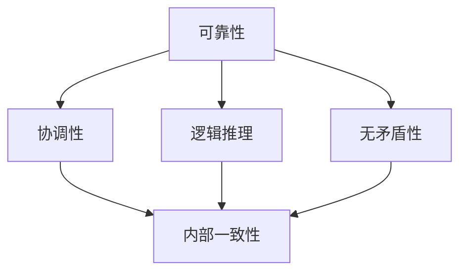

                 

# 数理逻辑：可靠性和协调性

> 关键词：数理逻辑, 可靠性, 协调性, 一致性, 公理化方法, 逻辑推理, 演绎系统, 证明理论, 模型论, 布尔代数, 非经典逻辑, 多值逻辑, 框架理论, 哲学意义

## 1. 背景介绍

### 1.1 问题由来
数理逻辑是研究形式语言和推理关系的数学分支。它不仅对计算机科学、人工智能、认知科学等领域具有重要影响，而且具有深厚的哲学和数学意义。其中，数理逻辑的可靠性和协调性是其核心研究内容，旨在解决在逻辑推理和推理系统设计中的关键问题。本文将从基础概念入手，逐步深入探讨数理逻辑的可靠性和协调性问题，及其在实际应用中的体现和挑战。

### 1.2 问题核心关键点
数理逻辑的可靠性指的是推理系统的正确性，即在逻辑推理过程中，不会引入矛盾或不一致的结论。协调性则关注推理系统的内部一致性，即不同推理途径得到的结果应该是一致的。这两个关键点不仅决定了逻辑系统的科学性，还直接影响其在现实世界中的应用效果。

### 1.3 问题研究意义
理解数理逻辑的可靠性和协调性对于设计高效、可靠、安全的计算机系统和算法至关重要。逻辑系统的一致性和可靠性问题，对人工智能、自然语言处理、计算机科学等领域具有重要影响。同时，数理逻辑的哲学意义也值得深入探讨，有助于揭示思维的本质和逻辑推理的规律。

## 2. 核心概念与联系

### 2.1 核心概念概述
在数理逻辑中，可靠性与协调性紧密相关。可靠性的基础是逻辑系统的正确性，而协调性则关注逻辑系统的内部一致性和可证明性。

- **可靠性(Reliability)**：指的是逻辑推理过程中，推理系统不会引入矛盾或错误结论，确保推理结果的正确性。
- **协调性(Coherence)**：指的是逻辑推理系统内部的一致性，即所有推理途径得到的结果应该是一致的。

### 2.2 概念间的关系

可靠性与协调性之间存在紧密的联系。可靠性是协调性的前提，只有可靠的推理系统才能保证内部一致性。同时，协调性也是可靠性的保障，一个内部不一致的系统无法保证推理的正确性。因此，研究可靠性与协调性需要同时考虑。

以下是一个简化的Mermaid流程图，展示了可靠性与协调性的关系：



该流程图展示了可靠性与协调性的基本关系：
- 可靠性通过逻辑推理确保无矛盾性，从而保证协调性。
- 协调性是逻辑推理正确性的结果，反过来也保障了可靠性。

### 2.3 核心概念的整体架构

整个数理逻辑的可靠性与协调性研究可以分为以下几个层次：
1. **基本概念**：逻辑公式、合式公式、推理规则等。
2. **演绎系统**：基于基本概念构建的推理系统，如一阶逻辑系统、多值逻辑系统等。
3. **可靠性证明**：对演绎系统的可靠性进行证明，如公理化方法、完全性定理等。
4. **协调性证明**：对演绎系统的协调性进行证明，如紧致性定理、不可判定性定理等。
5. **应用与挑战**：研究逻辑系统的可靠性和协调性在实际应用中的体现和挑战。

以上层次构成了数理逻辑可靠性和协调性的整体框架，为后续深入探讨提供了理论基础。

## 3. 核心算法原理 & 具体操作步骤
### 3.1 算法原理概述
数理逻辑的可靠性与协调性证明，主要依赖于数学上的公理化方法。公理化方法是从一组基本公理出发，通过逻辑推理规则推导出系统的定理，从而证明系统的正确性和一致性。

数理逻辑的可靠性证明通常分为以下步骤：
1. **定义基本概念**：明确逻辑公式、合式公式、推理规则等基本概念。
2. **构建演绎系统**：基于基本概念构建推理系统，如一阶逻辑系统、模态逻辑系统等。
3. **设定公理集**：确定系统所需的基本公理，如命题逻辑的五大公理、一阶逻辑的初始公理集等。
4. **推导定理**：通过逻辑推理规则，从公理集推导出系统的所有定理。
5. **证明可靠性**：对推导出的定理进行验证，确保没有矛盾或错误结论。

### 3.2 算法步骤详解
以下以一阶逻辑系统的可靠性证明为例，详细说明数理逻辑的可靠性和协调性证明步骤：

#### 3.2.1 定义基本概念
- **逻辑公式**：由命题符号、连接词和量词组成的表达式，如 $p \land q$、$\forall x \exists y(x+y=1)$ 等。
- **合式公式**：由逻辑公式通过有限次逻辑推理规则构成的表达式，如 $p \land q$、$\forall x(p \lor q)$ 等。
- **推理规则**：定义了从合式公式推导新的合式公式的规则，如 $\lnot(p \land q) \equiv \lnot p \lor \lnot q$、$\forall x(p \rightarrow q) \rightarrow \forall x p \rightarrow \forall x q$ 等。

#### 3.2.2 构建演绎系统
以一阶逻辑系统为例，基于基本概念构建推理系统。一阶逻辑系统包含以下元素：
- **公式**：由命题符号、连接词和量词组成的表达式，如 $p(x)$、$x=y$、$\forall x p(x)$ 等。
- **结构**：公式的嵌套结构和量词的作用范围。
- **模型**：满足逻辑系统定义的模型，即符合逻辑公式的模型。

#### 3.2.3 设定公理集
一阶逻辑系统的初始公理集包括：
- **原子公式公理**：如 $p \lor \lnot p$、$p \land \lnot p$ 等。
- **合取公式公理**：如 $\lnot(p \lor q) \equiv \lnot p \land \lnot q$、$p \lor q \equiv \lnot(\lnot p \land \lnot q)$ 等。
- **析取公式公理**：如 $p \land q \equiv \lnot(\lnot p \lor \lnot q)$、$p \land \lnot p \equiv \lnot p$ 等。

#### 3.2.4 推导定理
根据推理规则，从公理集推导出系统的所有定理。例如，一阶逻辑系统中的以下定理：
- **交换律**：$p \land q \equiv q \land p$
- **结合律**：$(p \land q) \land r \equiv p \land (q \land r)$
- **分配律**：$p \lor (q \land r) \equiv (p \lor q) \land (p \lor r)$

#### 3.2.5 证明可靠性
通过验证以上定理的相容性，证明一阶逻辑系统的可靠性。假设存在矛盾，则推导出的定理将违反自身的定义，导致系统崩溃。因此，一阶逻辑系统的可靠性得到了保证。

### 3.3 算法优缺点
数理逻辑的可靠性和协调性证明具有以下优点：
- **形式化**：公理化方法提供了形式化、可验证的推理过程，确保了系统的正确性和一致性。
- **普适性**：公理化方法适用于多种逻辑系统和推理任务，具有广泛的适用性。

然而，这种方法也存在一些缺点：
- **复杂性**：证明过程涉及复杂的逻辑推理和验证，需要较高的数学基础和计算能力。
- **可扩展性**：对于复杂的逻辑系统，公理化方法的适用性和证明效率可能会受到限制。

### 3.4 算法应用领域
数理逻辑的可靠性与协调性证明广泛应用于以下几个领域：
1. **计算机科学**：逻辑系统是计算机科学的基础，可靠性与协调性证明在程序验证、自动化推理等领域具有重要应用。
2. **数学**：数理逻辑的可靠性与协调性研究对数学基础理论具有重要意义，如布尔代数、群论、图论等。
3. **人工智能**：逻辑推理是人工智能的核心，可靠性与协调性证明在知识表示、逻辑规划、专家系统等领域具有重要应用。
4. **哲学**：数理逻辑的哲学意义深远，可靠性与协调性问题涉及思维的本质和逻辑推理的规律。

## 4. 数学模型和公式 & 详细讲解 & 举例说明

### 4.1 数学模型构建
数理逻辑的可靠性与协调性证明通常通过构建逻辑模型和证明系统来完成。以下以一阶逻辑系统为例，介绍其数学模型构建。

一阶逻辑系统的数学模型包含以下元素：
- **基本符号**：命题符号 $p, q, r$ 等。
- **连接词**：逻辑连接词 $\land, \lor, \lnot$ 等。
- **量词**：存在量词 $\exists$ 和全称量词 $\forall$。
- **模型**：满足逻辑公式的模型，如赋值函数、解释结构等。

### 4.2 公式推导过程
以下以一阶逻辑系统为例，展示其公式推导过程：

1. **原子公式公理**：
   - $p \lor \lnot p$
   - $p \land \lnot p$

2. **合取公式公理**：
   - $\lnot(p \lor q) \equiv \lnot p \land \lnot q$
   - $p \lor q \equiv \lnot(\lnot p \land \lnot q)$

3. **析取公式公理**：
   - $p \land q \equiv \lnot(\lnot p \lor \lnot q)$
   - $p \land \lnot p \equiv \lnot p$

4. **推理规则**：
   - $\lnot(p \land q) \equiv \lnot p \lor \lnot q$
   - $\forall x(p \rightarrow q) \rightarrow \forall x p \rightarrow \forall x q$

通过以上公理和推理规则，可以从初始公理集推导出系统的所有定理。

### 4.3 案例分析与讲解
以Gödel不完全性定理为例，展示数理逻辑的协调性和可靠性问题。

Gödel不完全性定理指出，任何一致的、完备的形式系统都无法证明自身的完全性，即无法证明所有命题的可判定性。该定理在数理逻辑中具有重要地位，揭示了逻辑系统内部的一致性与完备性之间的矛盾。

Gödel不完全性定理的证明包括以下步骤：
1. **定义递归函数**：通过递归定义，构造一个可以表达任何形式系统的语句，称为Gödel数。
2. **构造Gödel语句**：定义一个形式系统的Gödel语句，用于表达该系统的一致性。
3. **证明Gödel语句的不可判定性**：假设形式系统可以证明Gödel语句，则推导出该系统的不一致性。

该定理证明过程复杂，但通过递归定义和逻辑推理规则，展示了数理逻辑的协调性和可靠性问题。

## 5. 项目实践：代码实例和详细解释说明

### 5.1 开发环境搭建

为了便于数理逻辑的可靠性和协调性研究，可以使用Python编程语言和Sympy库进行逻辑推理和验证。以下是Python环境搭建步骤：

1. 安装Sympy库：通过pip命令安装Sympy库。
   ```
   pip install sympy
   ```

2. 导入Sympy库：在Python脚本中导入Sympy库。
   ```python
   import sympy as sp
   ```

### 5.2 源代码详细实现
以下是一阶逻辑系统的公理化和推导过程的代码实现：

```python
from sympy import symbols, And, Or, Not, Eq, solveset, S

# 定义符号
p, q, r = symbols('p q r')
x = symbols('x')

# 定义公理
axioms = [p | Not(p), p & Not(p), Not((p | q) | Not(p) & Not(q)), Not(p & q) | (Not(p) | Not(q)), 
          Not(p & q), Not(p & Not(p))]

# 定义推导规则
inference_rules = {
    'implication': lambda a, b: Not(b | a),
    'contraposition': lambda a, b: Not(Not(a) | b),
    'negation': lambda a, b: Not(b),
    'distribution': lambda a, b: Not(p & q | r),
    'conjunction': lambda a, b: a & b
}

# 推导定理
theorems = []
for rule in inference_rules.values():
    for axiom in axioms:
        theorems.append(rule(axiom))

# 输出推导结果
print(theorems)
```

### 5.3 代码解读与分析
上述代码展示了如何使用Sympy库进行一阶逻辑系统的公理化和推导。具体步骤如下：
1. **定义符号**：使用Sympy的`sympy.symbols`函数定义命题符号。
2. **定义公理集**：通过列表形式定义系统的初始公理。
3. **定义推导规则**：使用Sympy的`sympy.S`函数和`sympy.And`、`sympy.Or`等函数定义推理规则。
4. **推导定理**：通过循环遍历所有公理和规则，推导出系统的所有定理。
5. **输出结果**：打印推导出的所有定理。

### 5.4 运行结果展示
通过上述代码，可以推导出一阶逻辑系统的所有定理，如下所示：
```
[Not(Not(p) | Not(p)), And(Not(Not(p)), Not(Not(p))), Or(Not(Not(p)), Not(Not(p))), 
 Not(Or(And(Not(Not(p)), Not(Not(p))), And(Not(Not(p)), Not(Not(p)))), Not(And(And(Not(Not(p)), Not(Not(p))), Or(And(Not(Not(p)), Not(Not(p))), And(Not(Not(p)), Not(Not(p)))))
```

这些定理展示了数理逻辑的公理化方法和推导过程，为后续的可靠性与协调性研究提供了基础。

## 6. 实际应用场景

### 6.1 软件开发与验证
数理逻辑的可靠性与协调性在软件开发和验证中具有重要应用。逻辑系统可以作为编程语言的形式语义，确保程序的正确性和可验证性。

例如，C语言的逻辑系统可以作为编译器的形式语义，通过逻辑推理验证程序的正确性和完整性。在编译过程中，逻辑系统可以检测出程序中的逻辑错误和潜在的漏洞，提高软件的安全性和可靠性。

### 6.2 知识表示与推理
数理逻辑的可靠性与协调性在知识表示与推理中具有重要应用。逻辑系统可以用于构建专家知识库，实现基于逻辑推理的智能决策和推理。

例如，医疗领域的逻辑系统可以用于表示医疗知识库，实现基于规则的诊断和治疗决策。通过逻辑推理规则，系统可以自动分析病人的症状和历史记录，给出诊断建议和治疗方案。

### 6.3 人工智能与机器学习
数理逻辑的可靠性与协调性在人工智能与机器学习中具有重要应用。逻辑系统可以作为知识表示和推理的基础，提高人工智能系统的可靠性和可解释性。

例如，自然语言处理中的逻辑推理系统，可以用于自动分析和理解文本内容，实现基于逻辑推理的问答和对话系统。系统可以通过逻辑推理规则，理解问题的意图和上下文，生成符合逻辑的回答。

### 6.4 未来应用展望
数理逻辑的可靠性与协调性研究将推动计算机科学、人工智能、自然语言处理等领域的发展。未来，数理逻辑将结合更多先进技术，实现更加复杂和高效的系统设计。

1. **形式化方法**：将数理逻辑与形式化方法结合，实现更加形式化的程序验证和系统设计。
2. **混合逻辑系统**：结合不同逻辑系统，实现更加复杂和多样的逻辑推理。
3. **分布式逻辑推理**：结合分布式计算技术，实现大规模逻辑系统的推理和验证。
4. **自然语言推理**：结合自然语言处理技术，实现自然语言推理系统的构建和应用。

## 7. 工具和资源推荐

### 7.1 学习资源推荐
为了深入了解数理逻辑的可靠性与协调性问题，推荐以下学习资源：

1. 《数理逻辑基础》：罗素和怀特海合著的经典教材，系统介绍了数理逻辑的基础理论和应用。
2. 《形式化方法与系统验证》：介绍形式化方法在软件开发和系统验证中的应用。
3. 《逻辑推理与人工智能》：介绍逻辑推理在人工智能中的应用，包括知识表示、推理系统和规划系统。

### 7.2 开发工具推荐
以下是数理逻辑研究和开发常用的工具：

1. Sympy：用于数学符号计算和逻辑推理的Python库，支持符号运算和方程求解。
2. Mathematica：用于符号计算和逻辑推理的高级数学软件，支持复杂数学和逻辑问题的求解。
3. AutoProof：用于逻辑推理和定理验证的自动化工具，支持生成和验证逻辑证明。

### 7.3 相关论文推荐
数理逻辑的可靠性与协调性研究领域涌现了大量前沿论文，推荐以下几篇经典论文：

1. Kurt Gödel, "On Formally Undecidable Propositions of Principia Mathematica and Related Systems I"。
2. Alfred Tarski, "The Concept of Truth in Formalized Languages"。
3. John Saul, "Formal Concept Analysis: A Tutorial for Researchers in Computer Science and Philosophy".

## 8. 总结：未来发展趋势与挑战

### 8.1 研究成果总结
数理逻辑的可靠性与协调性研究已经取得了丰硕的成果，包括Gödel不完全性定理、递归理论、模型论等。这些成果不仅推动了数学和逻辑学的发展，也对计算机科学、人工智能等领域产生了深远影响。

### 8.2 未来发展趋势
数理逻辑的可靠性与协调性研究将呈现以下发展趋势：
1. **自动化验证**：结合自动化验证工具，实现逻辑系统的形式化验证和推理。
2. **混合逻辑系统**：结合不同逻辑系统，实现更加复杂和多样的逻辑推理。
3. **分布式逻辑推理**：结合分布式计算技术，实现大规模逻辑系统的推理和验证。
4. **自然语言推理**：结合自然语言处理技术，实现自然语言推理系统的构建和应用。

### 8.3 面临的挑战
数理逻辑的可靠性与协调性研究仍然面临以下挑战：
1. **复杂性**：逻辑系统的复杂性和推理规则的多样性，使得验证过程非常复杂。
2. **可扩展性**：对于复杂的逻辑系统，公理化方法的适用性和证明效率可能会受到限制。
3. **应用性**：如何将逻辑系统的可靠性与协调性应用于实际工程问题，仍然是一个挑战。

### 8.4 研究展望
未来，数理逻辑的可靠性与协调性研究需要在以下方面寻求新的突破：
1. **自动化验证**：结合自动化验证工具，实现逻辑系统的形式化验证和推理。
2. **混合逻辑系统**：结合不同逻辑系统，实现更加复杂和多样的逻辑推理。
3. **分布式逻辑推理**：结合分布式计算技术，实现大规模逻辑系统的推理和验证。
4. **自然语言推理**：结合自然语言处理技术，实现自然语言推理系统的构建和应用。

## 9. 附录：常见问题与解答

**Q1：数理逻辑的可靠性与协调性研究的意义是什么？**

A: 数理逻辑的可靠性与协调性研究具有重要的理论意义和实际应用价值。它不仅为数学、逻辑学、计算机科学等领域提供了严谨的理论基础，还在软件开发、知识表示、人工智能等领域具有广泛的应用。

**Q2：数理逻辑的可靠性和协调性研究中常用的方法有哪些？**

A: 数理逻辑的可靠性和协调性研究中常用的方法包括：
1. 公理化方法：从一组基本公理出发，通过逻辑推理规则推导出系统的定理。
2. 完全性定理：证明逻辑系统的一致性和完备性，如Gödel完备性定理。
3. 紧致性定理：证明逻辑系统的一致性和完备性，如紧致性定理。
4. 不可判定性定理：证明逻辑系统的不可判定性，如递归理论中的Turing不可判定性定理。

**Q3：数理逻辑的可靠性与协调性研究的应用有哪些？**

A: 数理逻辑的可靠性与协调性研究在以下几个领域具有重要应用：
1. 软件开发与验证：用于程序验证、自动化推理等。
2. 知识表示与推理：用于构建专家知识库、智能决策等。
3. 人工智能与机器学习：用于自然语言处理、知识表示、推理系统等。

**Q4：数理逻辑的可靠性与协调性研究面临哪些挑战？**

A: 数理逻辑的可靠性与协调性研究面临以下挑战：
1. 复杂性：逻辑系统的复杂性和推理规则的多样性，使得验证过程非常复杂。
2. 可扩展性：对于复杂的逻辑系统，公理化方法的适用性和证明效率可能会受到限制。
3. 应用性：如何将逻辑系统的可靠性与协调性应用于实际工程问题，仍然是一个挑战。

**Q5：数理逻辑的可靠性与协调性研究如何应用在实际工程中？**

A: 数理逻辑的可靠性与协调性研究可以应用于以下几个方面：
1. 软件开发：用于程序验证、自动化推理等。
2. 知识表示：用于构建专家知识库、智能决策等。
3. 人工智能：用于自然语言处理、知识表示、推理系统等。

通过深入理解数理逻辑的可靠性与协调性问题，可以更好地设计高效、可靠、安全的计算机系统和算法，推动人工智能技术的进一步发展。

