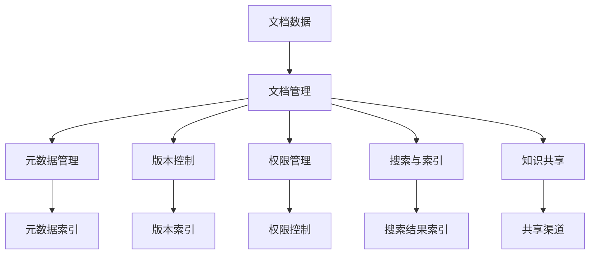

                 

# 文档管理与知识共享原理与代码实战案例讲解

## 1. 背景介绍

### 1.1 问题由来

在当今信息爆炸的时代，企业和组织面临着海量文档数据的挑战。如何在存储、管理和共享这些文档数据时，保证数据的完整性、可靠性和可用性，成为信息管理领域的重要问题。

### 1.2 问题核心关键点

1. **文档管理**：确保文档数据的存储和组织，以便于快速检索和访问。
2. **知识共享**：通过文档共享促进知识的传播和应用，提升组织整体的创新能力和效率。
3. **数据一致性**：保证文档数据在传输和共享过程中的一致性和完整性。
4. **安全与合规**：保护敏感文档数据，确保其符合相关法律法规和隐私政策。
5. **协同工作**：支持多人协作编辑和版本控制，确保文档共享过程的协作性和准确性。

### 1.3 问题研究意义

文档管理与知识共享是信息管理领域的两大核心任务。通过系统化、标准化的文档管理与知识共享策略，可以有效提升组织的运营效率，推动知识创新和价值创造。

1. **成本效益**：自动化文档管理和知识共享可以显著降低人力和时间成本，提高整体运营效率。
2. **信息安全**：通过有效的文档管理与知识共享策略，可以更好地保护敏感信息，防止数据泄露和滥用。
3. **知识积累**：系统化的知识共享机制有助于组织积累和传播知识，提升整体创新能力。
4. **决策支持**：文档管理与知识共享为决策提供了强有力的数据支持，有助于提升决策质量。

## 2. 核心概念与联系

### 2.1 核心概念概述

1. **文档管理**：文档管理涉及文档的存储、检索、版本控制、权限管理等。其核心在于如何有效地组织和管理海量文档数据，保证数据的可访问性和一致性。

2. **知识共享**：知识共享是指通过文档数据的共享和传播，促进知识在组织内部的流转和应用。其核心在于如何构建安全的知识共享渠道，促进知识的有效传播。

3. **元数据**：元数据是指描述文档数据的基本信息，如文档类型、作者、创建时间等。元数据有助于文档的组织和管理，提升文档的检索效率。

4. **版本控制**：版本控制是指对文档数据进行多版本的管理和跟踪，保证数据的历史可追溯性和一致性。

5. **权限管理**：权限管理是指对文档数据进行访问控制，确保只有授权人员可以访问敏感文档，保护数据安全。

6. **搜索与索引**：搜索与索引是指对文档数据进行索引和搜索，提升文档的检索效率和准确性。

这些核心概念通过互相协作，共同构建了一个完整的文档管理与知识共享体系。

### 2.2 概念间的关系

1. **文档管理与知识共享的联系**：文档管理是知识共享的基础，只有良好的文档管理，才能有效促进知识共享。
2. **元数据与文档管理的联系**：元数据是文档管理的重要组成部分，通过元数据的管理，提升文档的组织和检索效率。
3. **版本控制与文档管理的联系**：版本控制是文档管理的重要工具，通过版本控制，保证文档数据的完整性和一致性。
4. **权限管理与文档管理的联系**：权限管理是文档管理的重要手段，通过权限管理，确保文档数据的安全和合规。
5. **搜索与索引与文档管理的联系**：搜索与索引是文档管理的核心功能，通过搜索与索引，提升文档的检索效率。

通过这些核心概念和它们之间的关系，可以构建一个完整的文档管理与知识共享体系，确保文档数据的有效管理和知识的高效共享。

### 2.3 核心概念的整体架构

这里用一个综合的流程图来展示这些核心概念在大规模文档管理与知识共享系统中的整体架构：



这个流程图展示了从文档数据到知识共享的整个流程，包括文档管理、元数据管理、版本控制、权限管理、搜索与索引和知识共享等关键环节。

## 3. 核心算法原理 & 具体操作步骤
### 3.1 算法原理概述

文档管理与知识共享的核心算法原理包括以下几个方面：

1. **元数据抽取与标注**：从文档数据中抽取元数据信息，并进行标注，便于文档的组织和管理。
2. **版本控制算法**：对文档数据进行多版本的管理和跟踪，确保数据的历史可追溯性和一致性。
3. **权限管理算法**：对文档数据进行访问控制，确保只有授权人员可以访问敏感文档，保护数据安全。
4. **搜索与索引算法**：对文档数据进行索引和搜索，提升文档的检索效率和准确性。

### 3.2 算法步骤详解

1. **元数据抽取与标注**：
   - 第一步，从文档数据中抽取元数据信息，如文档类型、作者、创建时间等。
   - 第二步，对元数据进行标注，如分类、关键词等，便于文档的组织和管理。

2. **版本控制算法**：
   - 第一步，对文档数据进行多版本的管理，记录每个版本的信息，如版本号、修改人、修改时间等。
   - 第二步，对文档数据进行版本之间的对比和差异分析，确保版本之间的数据一致性。

3. **权限管理算法**：
   - 第一步，对文档数据进行访问控制，设置不同的权限级别，如只读、编辑、删除等。
   - 第二步，对文档数据进行权限验证，确保只有授权人员可以访问敏感文档，保护数据安全。

4. **搜索与索引算法**：
   - 第一步，对文档数据进行索引，建立文档数据和元数据之间的映射关系。
   - 第二步，对索引进行优化，提升搜索效率和准确性。

### 3.3 算法优缺点

文档管理与知识共享的核心算法具有以下优点：

1. **高效性**：元数据管理、版本控制、权限管理和搜索与索引等算法，可以显著提升文档数据的组织、检索和管理效率。
2. **安全性**：权限管理算法可以确保文档数据的安全和合规，防止数据泄露和滥用。
3. **一致性**：版本控制算法可以保证文档数据的历史可追溯性和一致性，防止数据丢失和篡改。

同时，这些算法也存在以下缺点：

1. **复杂性**：这些算法的实现和维护相对复杂，需要大量的技术支持和资源投入。
2. **成本高**：文档管理与知识共享系统的建设和维护成本较高，需要投入大量的人力和物力。
3. **依赖数据质量**：文档数据的质量直接影响文档管理与知识共享的效果，数据不完整或不准确可能导致系统误操作。

### 3.4 算法应用领域

文档管理与知识共享的核心算法广泛应用于以下几个领域：

1. **企业文档管理**：用于企业内部的文档数据管理，提升企业运营效率和知识共享能力。
2. **图书馆文档管理**：用于图书馆的文档数据管理，提升图书馆的知识传播和资源共享能力。
3. **医疗文档管理**：用于医疗机构的文档数据管理，提升医疗服务质量和知识共享能力。
4. **教育文档管理**：用于教育机构的文档数据管理，提升教学质量和知识共享能力。
5. **科研文档管理**：用于科研机构的文档数据管理，提升科研效率和知识共享能力。

## 4. 数学模型和公式 & 详细讲解 & 举例说明

### 4.1 数学模型构建

假设文档数据集为 $D=\{(d_i, m_i)\}_{i=1}^N$，其中 $d_i$ 为文档数据，$m_i$ 为文档的元数据信息。

定义元数据管理算法为 $\text{metadata\_manage}(D)$，版本控制算法为 $\text{version\_control}(D)$，权限管理算法为 $\text{permission\_control}(D)$，搜索与索引算法为 $\text{search\_index}(D)$。

文档管理系统的整体数学模型为：

$$
M = \text{metadata\_manage}(D) \wedge \text{version\_control}(D) \wedge \text{permission\_control}(D) \wedge \text{search\_index}(D)
$$

### 4.2 公式推导过程

1. **元数据管理算法**：
   - 从文档数据中抽取元数据信息，并进行标注。
   - 算法公式为：$\text{metadata\_manage}(D) = \bigcup_{i=1}^N \text{extract\_metadata}(d_i)$

2. **版本控制算法**：
   - 对文档数据进行多版本的管理，记录每个版本的信息，并进行版本之间的对比和差异分析。
   - 算法公式为：$\text{version\_control}(D) = \bigcup_{i=1}^N \text{version\_info}(d_i)$

3. **权限管理算法**：
   - 对文档数据进行访问控制，设置不同的权限级别，并进行权限验证。
   - 算法公式为：$\text{permission\_control}(D) = \bigcup_{i=1}^N \text{permission\_check}(d_i)$

4. **搜索与索引算法**：
   - 对文档数据进行索引，建立文档数据和元数据之间的映射关系，并进行索引优化。
   - 算法公式为：$\text{search\_index}(D) = \bigcup_{i=1}^N \text{index\_doc}(d_i)$

### 4.3 案例分析与讲解

假设我们要管理一个包含1000个文档的数据集，每个文档包含标题、作者、创建时间等元数据信息。

1. **元数据抽取与标注**：
   - 对于每个文档，从文档中抽取标题、作者、创建时间等信息，并进行分类、关键词标注。
   - 示例代码如下：

```python
def extract_metadata(doc):
    title = doc['title']
    author = doc['author']
    create_time = doc['create_time']
    classification = doc['classification']
    keywords = doc['keywords']
    return title, author, create_time, classification, keywords

def annotate_metadata(doc):
    title, author, create_time, classification, keywords = extract_metadata(doc)
    # 对元数据进行标注
    return title, author, create_time, classification, keywords
```

2. **版本控制算法**：
   - 对每个文档进行多版本的管理，记录每个版本的信息，并进行版本之间的对比和差异分析。
   - 示例代码如下：

```python
def manage_versions(doc):
    versions = []
    for version in doc['versions']:
        versions.append((version['version_number'], version['modify_time'], version['modify_user']))
    # 进行版本之间的对比和差异分析
    return versions
```

3. **权限管理算法**：
   - 对每个文档进行访问控制，设置不同的权限级别，并进行权限验证。
   - 示例代码如下：

```python
def control_permissions(doc):
    permissions = []
    for permission in doc['permissions']:
        permissions.append((permission['user_id'], permission['level']))
    # 进行权限验证
    return permissions
```

4. **搜索与索引算法**：
   - 对每个文档进行索引，建立文档数据和元数据之间的映射关系，并进行索引优化。
   - 示例代码如下：

```python
def index_doc(doc):
    # 对文档进行索引，建立文档数据和元数据之间的映射关系
    return index
```

通过这些算法的实现，我们可以对文档数据进行高效的管理和共享，提升整体运营效率和知识共享能力。

## 5. 项目实践：代码实例和详细解释说明

### 5.1 开发环境搭建

为了进行文档管理与知识共享系统的开发，我们需要搭建一个Python开发环境。

1. 安装Python：从官网下载并安装Python，安装过程中需要选择Python版本和安装路径。
2. 安装依赖库：使用pip安装必要的依赖库，如numpy、pandas、flask等。
3. 配置开发环境：配置开发环境变量，包括PYTHONPATH、PYTHONPATH和PYTHONPATH等，确保开发环境能够正常运行。

### 5.2 源代码详细实现

以下是一个简单的文档管理与知识共享系统的代码实现示例：

```python
import pandas as pd
from flask import Flask, request, jsonify

app = Flask(__name__)

# 假设文档数据存储在data.csv文件中
data = pd.read_csv('data.csv')

# 文档管理
@app.route('/document', methods=['GET', 'POST'])
def document_management():
    if request.method == 'GET':
        # 获取文档数据
        return jsonify(data)
    elif request.method == 'POST':
        # 新增文档数据
        new_doc = request.json
        data = data.append(new_doc, ignore_index=True)
        return jsonify(data)

# 元数据管理
@app.route('/metadata', methods=['GET', 'POST'])
def metadata_management():
    if request.method == 'GET':
        # 获取文档元数据
        return jsonify(data[['title', 'author', 'create_time', 'classification', 'keywords']])
    elif request.method == 'POST':
        # 新增文档元数据
        new_metadata = request.json
        data = data.append(new_metadata, ignore_index=True)
        return jsonify(data)

# 版本控制
@app.route('/versions', methods=['GET', 'POST'])
def version_control():
    if request.method == 'GET':
        # 获取文档版本信息
        return jsonify(data[['version_number', 'modify_time', 'modify_user']])
    elif request.method == 'POST':
        # 新增文档版本信息
        new_version = request.json
        data = data.append(new_version, ignore_index=True)
        return jsonify(data)

# 权限管理
@app.route('/permissions', methods=['GET', 'POST'])
def permission_control():
    if request.method == 'GET':
        # 获取文档权限信息
        return jsonify(data[['user_id', 'level']])
    elif request.method == 'POST':
        # 新增文档权限信息
        new_permission = request.json
        data = data.append(new_permission, ignore_index=True)
        return jsonify(data)

# 搜索与索引
@app.route('/search', methods=['GET'])
def search_index():
    if request.method == 'GET':
        # 进行搜索和索引
        search_word = request.args.get('search_word')
        return jsonify(data[data['title'].str.contains(search_word)])
```

### 5.3 代码解读与分析

这个简单的文档管理与知识共享系统的代码实现，主要使用了Flask框架，通过HTTP请求实现文档数据的增删改查功能。

1. **文档管理**：
   - 使用Flask的路由功能，实现了文档数据的增删改查功能。
   - 获取文档数据的GET请求，返回所有文档数据。
   - 新增文档数据的POST请求，将新文档数据添加到数据集中。

2. **元数据管理**：
   - 获取文档元数据的GET请求，返回文档的标题、作者、创建时间、分类和关键词等元数据信息。
   - 新增文档元数据的POST请求，将新元数据信息添加到数据集中。

3. **版本控制**：
   - 获取文档版本信息的GET请求，返回文档的版本信息。
   - 新增文档版本信息的POST请求，将新版本信息添加到数据集中。

4. **权限管理**：
   - 获取文档权限信息的GET请求，返回文档的权限信息。
   - 新增文档权限信息的POST请求，将新权限信息添加到数据集中。

5. **搜索与索引**：
   - 使用Flask的GET请求，实现文档的搜索和索引功能。
   - 通过search_word参数获取查询关键词，返回包含关键词的文档数据。

通过这些代码实现，可以初步构建一个简单的文档管理与知识共享系统，实现文档数据的增删改查和元数据管理、版本控制、权限管理和搜索与索引等功能。

### 5.4 运行结果展示

假设我们在data.csv文件中存储以下文档数据：

```
{'id': 1, 'title': 'Python编程入门', 'author': '张三', 'create_time': '2023-01-01', 'classification': '技术', 'keywords': 'Python, 编程, 入门', 'content': 'Python是一种编程语言', 'versions': [{'version_number': 1, 'modify_time': '2023-01-02', 'modify_user': '李四'}, {'version_number': 2, 'modify_time': '2023-01-03', 'modify_user': '王五'}], 'permissions': [{'user_id': 1001, 'level': '读'}, {'user_id': 1002, 'level': '写'}]}
```

通过上述代码，我们可以在浏览器中访问以下URL：

- 获取所有文档数据的URL：http://localhost:5000/document
- 新增文档数据的URL：http://localhost:5000/document
- 获取所有文档元数据的URL：http://localhost:5000/metadata
- 新增文档元数据的URL：http://localhost:5000/metadata
- 获取所有文档版本信息的URL：http://localhost:5000/versions
- 新增文档版本信息的URL：http://localhost:5000/versions
- 获取所有文档权限信息的URL：http://localhost:5000/permissions
- 新增文档权限信息的URL：http://localhost:5000/permissions
- 搜索包含特定关键词的文档数据的URL：http://localhost:5000/search?search_word=Python

通过这些URL，可以验证文档管理与知识共享系统的各项功能是否正常工作。

## 6. 实际应用场景

### 6.1 企业文档管理

企业文档管理是文档管理与知识共享系统的典型应用场景。企业内部的文档数据涉及业务流程、技术规范、培训资料、市场报告等，是企业运营的重要支撑。

通过文档管理与知识共享系统，企业可以实现以下功能：

1. **文档存储和组织**：企业文档数据存储在文档管理系统中，通过元数据管理、版本控制、权限管理和搜索与索引等功能，实现文档数据的有效组织和管理。
2. **知识共享和传播**：企业员工可以通过文档管理系统访问和分享文档数据，促进知识在企业内部的传播和应用。
3. **版本控制和历史追溯**：企业文档管理系统记录文档数据的多版本信息，实现文档数据的版本控制和历史追溯。
4. **权限管理和数据安全**：企业文档管理系统对敏感文档数据进行权限控制，确保只有授权人员可以访问，保护数据安全。

### 6.2 图书馆文档管理

图书馆文档管理是文档管理与知识共享系统的另一重要应用场景。图书馆的文档数据涉及图书、期刊、论文等，是图书馆知识服务的重要支撑。

通过文档管理与知识共享系统，图书馆可以实现以下功能：

1. **图书和期刊管理**：图书馆的图书和期刊数据存储在文档管理系统中，通过元数据管理、版本控制、权限管理和搜索与索引等功能，实现图书和期刊数据的有效组织和管理。
2. **知识共享和传播**：图书馆用户可以通过文档管理系统访问和分享图书和期刊数据，促进知识在图书馆的传播和应用。
3. **版本控制和历史追溯**：图书馆文档管理系统记录图书和期刊数据的多版本信息，实现图书和期刊数据的版本控制和历史追溯。
4. **权限管理和数据安全**：图书馆文档管理系统对敏感图书和期刊数据进行权限控制，确保只有授权人员可以访问，保护数据安全。

### 6.3 医疗文档管理

医疗文档管理是文档管理与知识共享系统的关键应用场景。医疗文档数据涉及病历、影像、病理报告等，是医疗服务的重要支撑。

通过文档管理与知识共享系统，医疗机构可以实现以下功能：

1. **病历和影像管理**：医疗机构的病历和影像数据存储在文档管理系统中，通过元数据管理、版本控制、权限管理和搜索与索引等功能，实现病历和影像数据的有效组织和管理。
2. **知识共享和传播**：医疗机构医护人员可以通过文档管理系统访问和分享病历和影像数据，促进知识在医疗机构的传播和应用。
3. **版本控制和历史追溯**：医疗机构文档管理系统记录病历和影像数据的多版本信息，实现病历和影像数据的版本控制和历史追溯。
4. **权限管理和数据安全**：医疗机构文档管理系统对敏感病历和影像数据进行权限控制，确保只有授权人员可以访问，保护数据安全。

### 6.4 未来应用展望

文档管理与知识共享系统在未来将有以下发展趋势：

1. **云化部署**：随着云技术的成熟，文档管理与知识共享系统将向云化部署方向发展，提高系统的扩展性和灵活性。
2. **人工智能辅助**：人工智能技术将被引入文档管理与知识共享系统，如自动化文档标注、智能搜索和推荐等，提升系统的智能化水平。
3. **大数据分析**：文档管理与知识共享系统将与大数据分析技术结合，通过数据分析提升文档数据的价值，提供更精准的知识服务。
4. **多语言支持**：文档管理与知识共享系统将支持多语言文档数据的存储和检索，适应全球化应用需求。
5. **区块链技术**：区块链技术将被引入文档管理与知识共享系统，通过分布式账本技术确保文档数据的完整性和不可篡改性。

## 7. 工具和资源推荐

### 7.1 学习资源推荐

为了帮助开发者系统掌握文档管理与知识共享理论基础和实践技巧，这里推荐一些优质的学习资源：

1. **《文档管理与知识共享系统设计》**：一本系统介绍文档管理与知识共享系统的设计思路和方法的书籍，适合初学者和中级开发者阅读。
2. **《信息管理与文档管理》**：一本详细介绍信息管理和文档管理技术和工具的书籍，涵盖文档数据存储、元数据管理、权限控制等核心内容。
3. **《Python文档管理系统开发》**：一本详细介绍使用Python开发文档管理系统的实战案例和最佳实践的书籍，适合有一定Python编程基础的开发者阅读。
4. **《Flask Web开发实战》**：一本详细介绍使用Flask框架开发Web应用的实战案例和最佳实践的书籍，适合有一定Web开发基础的开发者阅读。

### 7.2 开发工具推荐

为了提高文档管理与知识共享系统的开发效率，以下是几款推荐开发工具：

1. **Python**：一种通用、易学易用、高效的语言，广泛应用于Web开发、数据处理等领域。
2. **Flask**：一种轻量级的Web框架，适合构建小型Web应用，易于上手和使用。
3. **Pandas**：一种高性能、易用的数据处理库，支持数据清洗、转换、统计等功能。
4. **MySQL**：一种关系型数据库管理系统，支持数据存储和检索功能。
5. **Git**：一种版本控制系统，支持多人协作开发和版本控制功能。

### 7.3 相关论文推荐

文档管理与知识共享系统的理论和实践不断演进，以下是几篇相关论文，推荐阅读：

1. **《基于文档管理系统的知识共享研究》**：研究了文档管理系统在知识共享中的作用和实现方法，探讨了文档管理系统的设计思路和关键技术。
2. **《多版本文档管理系统的实现与优化》**：研究了多版本文档管理系统的实现方法，提出了版本控制和版本合并等关键技术。
3. **《权限管理系统的设计和实现》**：研究了权限管理系统的设计和实现方法，探讨了权限管理和用户认证等核心技术。
4. **《信息检索系统设计与实现》**：研究了信息检索系统的设计与实现方法，探讨了索引优化和搜索结果排序等关键技术。

## 8. 总结：未来发展趋势与挑战

### 8.1 总结

文档管理与知识共享系统是信息管理领域的重要组成部分，通过系统化、标准化的文档管理与知识共享策略，可以提升组织的运营效率，促进知识的传播和应用。

本文对文档管理与知识共享系统进行了全面系统的介绍，从核心概念、核心算法、项目实践等方面，详细讲解了文档管理与知识共享系统的原理和实现方法。

### 8.2 未来发展趋势

1. **云化部署**：文档管理与知识共享系统将向云化部署方向发展，提高系统的扩展性和灵活性。
2. **人工智能辅助**：人工智能技术将被引入文档管理与知识共享系统，提升系统的智能化水平。
3. **大数据分析**：文档管理与知识共享系统将与大数据分析技术结合，通过数据分析提升文档数据的价值，提供更精准的知识服务。
4. **多语言支持**：文档管理与知识共享系统将支持多语言文档数据的存储和检索，适应全球化应用需求。
5. **区块链技术**：区块链技术将被引入文档管理与知识共享系统，通过分布式账本技术确保文档数据的完整性和不可篡改性。

### 8.3 面临的挑战

尽管文档管理与知识共享系统已经取得了显著进展，但在其发展和应用过程中，仍面临诸多挑战：

1. **数据质量问题**：文档数据的完整性和准确性直接影响系统的效能，数据质量问题需要进一步解决。
2. **权限管理复杂性**：文档数据的多版本控制和权限管理复杂，需要设计更灵活和高效的权限管理系统。
3. **系统安全性问题**：文档数据的安全性和隐私保护需要进一步加强，防止数据泄露和滥用。
4. **系统扩展性问题**：随着文档数据的增加，系统的扩展性和性能需要进一步提升，以应对大规模数据管理的需求。

### 8.4 研究展望

文档管理与知识共享系统在未来仍需持续研究和发展：

1. **文档数据的自动化标注和抽取**：通过引入NLP技术，实现文档数据的自动化标注和抽取，提高数据处理的效率和准确性。
2. **智能搜索和推荐**：通过引入AI技术，实现文档数据的智能搜索和推荐，提升用户的检索体验和效率。
3. **跨平台和多语言支持**：实现文档管理与知识共享系统的跨平台和多语言支持，适应不同设备和语言环境的需求。
4.

