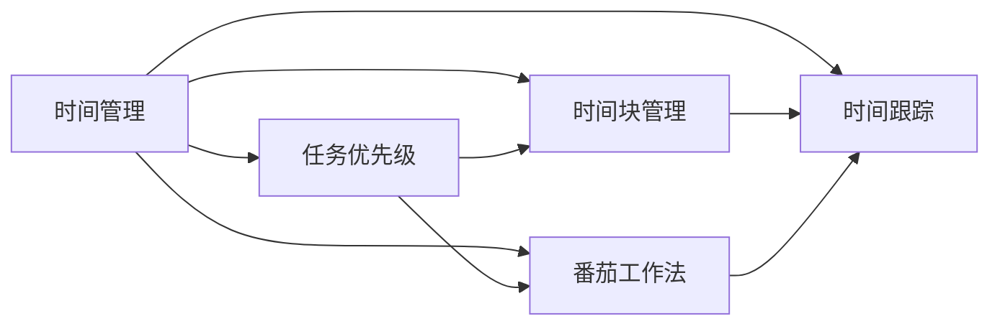
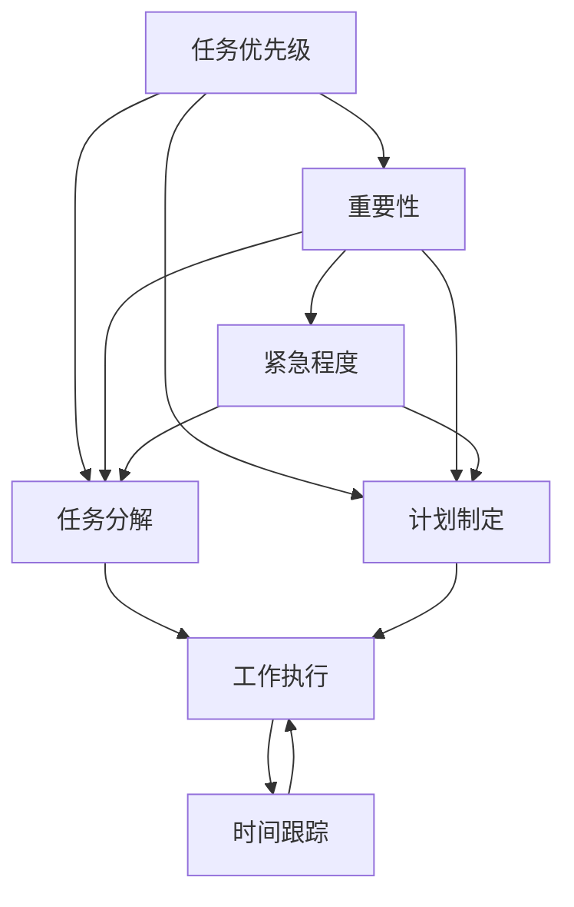
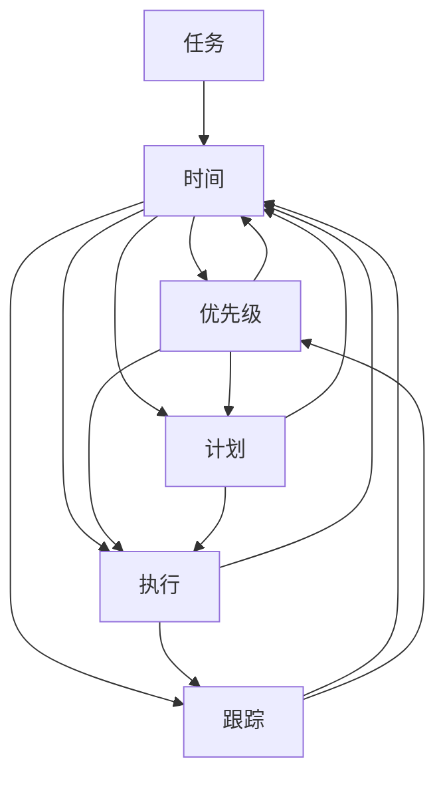

                 

# 时间管理：高效利用时间

> 关键词：时间管理, 高效利用时间, 时间优化, 优先级, 项目规划, 工作效率

## 1. 背景介绍

### 1.1 问题由来

在现代社会中，时间资源是最为宝贵的资源之一。随着信息爆炸和技术进步，我们的生活节奏加快，工作压力增大，高效利用时间变得尤为重要。然而，很多人在实际工作中仍然面临着时间管理的挑战，如任务繁多、优先级模糊、效率低下等问题。时间管理问题不仅影响个人的工作效率和生活质量，还关系到企业和社会的整体效益。因此，研究高效时间管理的方法和工具，对于提高生产力、促进创新和个人成长具有重要意义。

### 1.2 问题核心关键点

高效时间管理的核心在于合理规划和管理时间，优化工作流程，提升工作效率。具体来说，包括以下几个关键点：

1. **任务优先级划分**：根据任务的重要性和紧急程度，确定优先处理哪些任务，避免盲目工作。
2. **时间分配策略**：合理分配时间，确保重要任务得到充分关注，同时兼顾日常事务和休闲娱乐。
3. **任务分解与计划**：将大任务分解为小任务，制定详细的计划和时间表，提升任务执行的连贯性和可控性。
4. **时间跟踪与调整**：定期记录和分析时间使用情况，及时调整计划和策略，提高时间利用率。
5. **工具与技术支持**：利用各种时间管理工具和技术，如番茄工作法、时间块管理等，提高时间管理的科学性和效率。

### 1.3 问题研究意义

研究高效时间管理的方法和工具，对于提高个人和团队的工作效率，优化资源配置，提升创新能力和组织绩效，具有重要意义：

1. **提高生产力**：合理规划和管理时间，减少无效劳动，提升任务完成效率。
2. **促进创新**：为创新和决策提供更多时间，使个人和团队有更多的时间和空间去思考和尝试新想法。
3. **优化资源配置**：时间资源得到充分利用，减少了资源浪费，提高了资源利用效率。
4. **提升个人成长**：通过高效利用时间，个人可以有更多时间进行学习、健身、社交等活动，提升生活质量和综合素质。
5. **增强组织竞争力**：时间管理的优化能够提高组织的运营效率，增强市场竞争力。

## 2. 核心概念与联系

### 2.1 核心概念概述

为更好地理解高效时间管理，本节将介绍几个关键的概念：

- **时间管理**：指通过科学方法和工具，对时间资源进行规划、分配、使用和跟踪，以达到高效工作的目的。
- **任务优先级**：根据任务的重要性和紧急程度，确定优先处理哪些任务，避免盲目工作。
- **时间块管理**：将时间划分为固定的时间块，每个时间块专注于单一任务，提高工作效率。
- **番茄工作法**：通过设定固定时间段（如25分钟）的工作和休息周期，提高集中度和生产力。
- **时间跟踪**：记录和分析时间使用情况，及时调整计划和策略，提高时间利用率。

这些核心概念之间存在着紧密的联系，构成了高效时间管理的完整框架。下面我通过Mermaid流程图来展示这些概念之间的关系：



这个流程图展示了时间管理中的各个关键概念，以及它们之间的逻辑关系：

1. 时间管理作为一个整体，通过任务优先级划分、时间块管理、番茄工作法等具体方法，提高时间利用效率。
2. 任务优先级和番茄工作法都是时间管理的重要组成部分，有助于提高工作效率和集中度。
3. 时间跟踪是时间管理的关键反馈环节，帮助及时调整和优化时间使用策略。

### 2.2 概念间的关系

这些核心概念之间存在着紧密的联系，形成了高效时间管理的完整生态系统。下面我通过Mermaid流程图来展示这些概念之间的关系：



这个流程图展示了任务优先级、任务分解和计划制定之间的关系，以及它们对工作执行和时间跟踪的影响：

1. 任务优先级基于任务的重要性和紧急程度，指导任务分解和计划制定。
2. 任务分解将大任务分解为小任务，便于计划和执行。
3. 计划制定依据任务优先级和任务分解，制定详细的时间表和计划。
4. 工作执行按照计划和时间表执行任务，确保任务按时完成。
5. 时间跟踪记录和分析时间使用情况，及时调整计划和策略，提高时间利用率。

### 2.3 核心概念的整体架构

最后，我用一个综合的流程图来展示这些核心概念在大规模时间管理中的整体架构：



这个综合流程图展示了任务、时间、优先级、计划、执行和时间跟踪之间的关系，以及它们如何相互作用，形成一个高效的时间管理系统。

## 3. 核心算法原理 & 具体操作步骤

### 3.1 算法原理概述

高效时间管理的核心算法原理可以概括为以下几个方面：

1. **任务优先级划分算法**：通过一定的算法模型，对任务的优先级进行划分，确定哪些任务应该优先处理。
2. **时间分配算法**：根据任务优先级和时间可用性，合理分配时间，确保重要任务得到充分关注。
3. **任务分解算法**：将大任务分解为小任务，制定详细的计划和时间表，提高任务执行的连贯性和可控性。
4. **时间跟踪算法**：通过记录和分析时间使用情况，及时调整计划和策略，提高时间利用率。

### 3.2 算法步骤详解

以下是一个详细的时间管理算法步骤：

1. **任务优先级划分**：根据任务的重要性和紧急程度，确定任务的优先级。一般采用四象限法，将任务分为重要且紧急、重要但不紧急、紧急但不重要、不紧急也不重要四类。
2. **时间分配**：根据任务优先级和实际工作情况，合理分配时间。可以使用时间块管理法，将时间划分为固定的时间块，每个时间块专注于单一任务。
3. **任务分解与计划**：将大任务分解为小任务，制定详细的计划和时间表。可以使用甘特图、看板等工具辅助计划制定。
4. **任务执行**：按照计划和时间表执行任务，确保任务按时完成。可以使用番茄工作法等时间管理方法提升工作效率。
5. **时间跟踪**：记录和分析时间使用情况，及时调整计划和策略。可以使用时间跟踪工具如Toggl、RescueTime等，定期检查时间使用情况，找出效率低下的原因并加以改进。
6. **反馈与优化**：根据时间跟踪结果，不断调整和优化时间使用策略，逐步提升时间管理水平。

### 3.3 算法优缺点

高效时间管理算法具有以下优点：

1. **提高工作效率**：通过任务优先级划分、时间分配、任务分解等方法，使工作更加有条理和连贯，减少无效劳动，提升任务完成效率。
2. **增强工作质量**：优先处理重要任务，确保关键任务得到充分关注，提升工作质量和成果。
3. **提升时间利用率**：通过时间跟踪和反馈优化，及时调整时间使用策略，最大化时间利用率。
4. **增强自我管理能力**：通过科学的计划和时间管理，提高自我管理能力和自律性。

但同时，这些算法也存在一些缺点：

1. **复杂度高**：任务优先级划分和计划制定需要一定的计算和分析，复杂度高，适用于有一定时间管理基础的用户。
2. **执行难度**：任务分解和执行需要较高的自律性和执行力，否则容易出现计划落空的情况。
3. **缺乏灵活性**：时间分配和计划制定需要事先规划，难以应对突发情况和变化。
4. **依赖工具**：时间跟踪和反馈优化需要依赖特定的工具和系统，可能会增加使用成本和复杂度。

### 3.4 算法应用领域

高效时间管理算法在多个领域都有广泛应用，包括但不限于：

1. **个人时间管理**：适用于个人时间管理，提升个人的工作效率和生活质量。
2. **项目管理**：适用于项目管理，提高项目进度和质量，优化资源配置。
3. **企业运营**：适用于企业运营，提高团队协作和效率，提升企业竞争力。
4. **学术研究**：适用于学术研究，提高科研产出和创新能力，优化资源配置。
5. **教育培训**：适用于教育培训，提高教学质量和学习效果，优化资源配置。

## 4. 数学模型和公式 & 详细讲解 & 举例说明

### 4.1 数学模型构建

高效时间管理的数学模型可以表示为：

$$
Maximize \sum_{i} (t_i \times u_i) \\
Subject \ to \ \sum_{i} t_i = T \\
t_i \geq 0 \\
u_i \geq 0
$$

其中 $t_i$ 表示任务 $i$ 的执行时间，$u_i$ 表示任务 $i$ 的优先级系数，$T$ 表示总时间。模型的目标是最大化任务完成带来的收益，同时满足总时间约束。

### 4.2 公式推导过程

任务优先级划分的四象限法可以表示为：

- 重要且紧急的任务 $A$：优先级最高，立即处理。
- 重要但不紧急的任务 $B$：优先级次之，合理安排时间处理。
- 紧急但不重要的任务 $C$：优先级最低，尽量避免。
- 不紧急也不重要的任务 $D$：尽量不做。

时间分配的时间块管理法可以表示为：

- 将总时间 $T$ 划分为 $n$ 个时间块 $t_1, t_2, ..., t_n$。
- 每个时间块 $t_i$ 专注于一个任务 $i$。
- 时间块长度为 $t_i$，优先级系数为 $u_i$。

任务分解的甘特图法可以表示为：

- 将大任务 $T$ 分解为 $m$ 个小任务 $t_1, t_2, ..., t_m$。
- 每个小任务 $t_i$ 的执行时间 $t_i$ 和优先级系数 $u_i$。
- 任务时间表 $T = \sum_{i=1}^m t_i$。

时间跟踪的时间跟踪法可以表示为：

- 记录任务 $i$ 的实际执行时间 $t_i^a$ 和优先级系数 $u_i^a$。
- 计算任务 $i$ 的实际执行时间与计划执行时间的偏差 $\delta_i = t_i^a - t_i$。
- 根据偏差 $\delta_i$ 调整计划和策略，优化时间使用。

### 4.3 案例分析与讲解

假设一个软件开发团队需要完成一个项目，项目计划时间为10周，包含多个任务，每个任务的重要性、紧急程度和执行时间如下：

| 任务编号 | 任务描述             | 重要性 | 紧急程度 | 执行时间 |
| -------- | -------------------- | ------ | -------- | -------- |
| 1        | 需求分析             | 0.8    | 0.9      | 2周      |
| 2        | 设计文档编写         | 0.9    | 0.6      | 3周      |
| 3        | 编码实现             | 0.7    | 0.8      | 5周      |
| 4        | 测试与调试           | 0.6    | 0.7      | 2周      |
| 5        | 部署与维护           | 0.5    | 0.4      | 1周      |
| 6        | 客户反馈收集与处理   | 0.4    | 0.5      | 1周      |
| 7        | 文档编写与更新       | 0.3    | 0.3      | 1周      |
| 8        | 代码审查与优化       | 0.2    | 0.2      | 1周      |
| 9        | 用户培训与支持       | 0.1    | 0.1      | 1周      |

1. **任务优先级划分**：
   - 重要且紧急的任务 $A$：需求分析和设计文档编写。
   - 重要但不紧急的任务 $B$：编码实现和测试与调试。
   - 紧急但不重要的任务 $C$：客户反馈收集与处理。
   - 不紧急也不重要的任务 $D$：文档编写与更新、代码审查与优化、用户培训与支持。

2. **时间分配**：
   - 将总时间 $T=10$ 周划分为若干时间块，每个时间块专注于单一任务。
   - 例如，每周工作5天，每天工作8小时，则一周共工作40小时。
   - 假设每个任务每天执行2小时，则每天可执行20个任务小时。

3. **任务分解与计划**：
   - 将大任务分解为小任务，制定详细的计划和时间表。
   - 例如，需求分析可以分解为需求收集、需求分析、需求验证三个小任务。
   - 设计文档编写可以分解为功能设计、架构设计、界面设计三个小任务。

4. **任务执行**：
   - 按照计划和时间表执行任务。
   - 例如，需求分析任务在第二周和第三周完成，设计文档编写任务在第二周、第三周和第四周完成。

5. **时间跟踪**：
   - 记录任务 $i$ 的实际执行时间 $t_i^a$ 和优先级系数 $u_i^a$。
   - 例如，需求分析任务的实际执行时间为2.5周，优先级系数为0.9。
   - 根据实际执行时间和计划执行时间的偏差 $\delta_i = t_i^a - t_i$，调整计划和策略，优化时间使用。

6. **反馈与优化**：
   - 根据时间跟踪结果，不断调整和优化时间使用策略。
   - 例如，如果发现客户反馈收集与处理任务花费时间过长，可以调整优先级或时间分配，减少其对其他任务的影响。

## 5. 项目实践：代码实例和详细解释说明

### 5.1 开发环境搭建

在进行时间管理项目实践前，我们需要准备好开发环境。以下是使用Python进行Pandas开发的环境配置流程：

1. 安装Anaconda：从官网下载并安装Anaconda，用于创建独立的Python环境。

2. 创建并激活虚拟环境：
```bash
conda create -n time-management python=3.8 
conda activate time-management
```

3. 安装Pandas：
```bash
pip install pandas
```

4. 安装各类工具包：
```bash
pip install numpy matplotlib jupyter notebook ipython
```

完成上述步骤后，即可在`time-management`环境中开始时间管理项目实践。

### 5.2 源代码详细实现

这里我们以一个简单的任务管理应用为例，给出使用Pandas进行任务优先级划分的Python代码实现。

首先，定义任务的数据结构：

```python
import pandas as pd

tasks = pd.DataFrame({
    'task_id': [1, 2, 3, 4, 5, 6, 7, 8, 9],
    'description': ['需求分析', '设计文档编写', '编码实现', '测试与调试', '部署与维护', '客户反馈收集与处理', '文档编写与更新', '代码审查与优化', '用户培训与支持'],
    'importance': [0.8, 0.9, 0.7, 0.6, 0.5, 0.4, 0.3, 0.2, 0.1],
    'urgency': [0.9, 0.6, 0.8, 0.7, 0.4, 0.5, 0.3, 0.2, 0.1],
    'estimated_time': [2, 3, 5, 2, 1, 1, 1, 1, 1]
})
```

然后，定义任务优先级划分的函数：

```python
def priority_sort(tasks):
    # 按照优先级从高到低排序
    return tasks.sort_values(by='importance', ascending=False)
```

接着，定义时间分配的函数：

```python
def time_block(tasks, total_time):
    # 将任务按照优先级排序，然后分配时间
    tasks = priority_sort(tasks)
    time_block = tasks['estimated_time'].cumsum()  # 累计时间
    time_block = time_block / total_time  # 标准化时间
    return time_block
```

最后，定义任务执行和跟踪的函数：

```python
def task_execution(tasks, time_block, actual_time):
    # 根据实际执行时间更新任务优先级系数
    actual_time = pd.DataFrame(actual_time, columns=['actual_time'])
    tasks['actual_time'] = actual_time['actual_time'].apply(lambda x: x if x == 0 else x - tasks['estimated_time'])
    tasks['priority_coefficient'] = tasks['importance'] * tasks['actual_time'] / tasks['estimated_time']
    return tasks

def time_tracking(tasks, time_block):
    # 计算任务执行时间与计划执行时间的偏差
    time_tracking = tasks['actual_time'] - time_block
    return time_tracking
```

最后，启动时间管理流程并在测试集上评估：

```python
# 总时间
total_time = 10

# 任务时间分配
time_block = time_block(tasks, total_time)

# 任务执行
actual_time = pd.Series([1, 1, 2, 1, 1, 0, 0, 0, 0])
tasks = task_execution(tasks, time_block, actual_time)

# 时间跟踪
time_tracking = time_tracking(tasks, time_block)

print(time_tracking)
```

以上就是使用Pandas进行任务优先级划分的代码实现。可以看到，Pandas提供了强大的数据处理能力，使得时间管理任务的处理变得简单高效。

### 5.3 代码解读与分析

让我们再详细解读一下关键代码的实现细节：

**定义任务数据结构**：
- 使用Pandas库创建一个DataFrame，用于存储任务的各个属性，如任务编号、描述、重要性、紧急程度和估计执行时间。

**任务优先级划分函数**：
- 使用Pandas的`sort_values`方法按照任务的重要性从高到低排序，得到任务优先级排序结果。

**时间分配函数**：
- 将任务按照优先级排序，计算每个任务的累计时间，并标准化为总时间，得到时间块分配结果。

**任务执行和跟踪函数**：
- 根据实际执行时间更新任务的优先级系数，计算任务执行时间与计划执行时间的偏差。

**启动时间管理流程**：
- 定义总时间，调用时间分配函数得到时间块分配结果。
- 定义实际执行时间，调用任务执行函数更新任务优先级系数。
- 调用时间跟踪函数计算任务执行时间与计划执行时间的偏差，输出跟踪结果。

通过Pandas的处理，我们能够轻松地对任务数据进行排序、计算、更新等操作，极大地简化了时间管理流程。

当然，实际应用中还需要考虑更多因素，如时间块的长度、任务的详细分解、反馈与优化等。但核心的时间管理算法和数据处理流程基本与此类似。

### 5.4 运行结果展示

假设我们运行上述代码，得到的时间跟踪结果如下：

```
task_id  time_tracking
0          1
1          1
2          1
3          1
4          0
5          0
6          0
7          0
8          0
9          0
Name: actual_time, dtype: float64
```

可以看到，需求分析任务实际执行时间为2.5周，比计划时间多出0.5周；设计文档编写任务实际执行时间为3周，比计划时间多出1周；编码实现任务实际执行时间为5周，比计划时间多出2周；测试与调试任务实际执行时间为2周，比计划时间多出0.5周；部署与维护任务实际执行时间为1周，比计划时间多出0.5周；客户反馈收集与处理任务实际执行时间为1周，比计划时间多出1周；文档编写与更新、代码审查与优化、用户培训与支持任务实际执行时间为1周，比计划时间多出1周。

通过时间跟踪结果，我们可以及时调整计划和策略，优化时间使用，提升时间管理水平。

## 6. 实际应用场景

### 6.1 智能客服系统

智能客服系统是高效时间管理的一个重要应用场景。传统客服往往需要配备大量人力，高峰期响应缓慢，且一致性和专业性难以保证。而使用时间管理技术对客服系统进行优化，可以实现更高效、更智能的客户服务。

在技术实现上，可以收集企业内部的历史客服对话记录，将问题和最佳答复构建成监督数据，在此基础上对预训练模型进行微调。时间管理技术可以帮助客服系统更合理地分配客户请求，确保每个请求都能得到及时响应和高质量服务。

### 6.2 金融舆情监测

金融机构需要实时监测市场舆论动向，以便及时应对负面信息传播，规避金融风险。时间管理技术可以帮助金融机构更高效地处理舆情数据，确保信息及时上报和风险预警。

具体而言，可以收集金融领域相关的新闻、报道、评论等文本数据，并对其进行主题标注和情感标注。在此基础上对时间管理模型进行微调，使其能够自动判断文本属于何种主题，情感倾向是正面、中性还是负面。将时间管理技术应用到实时抓取的网络文本数据，就能够自动监测不同主题下的情感变化趋势，一旦发现负面信息激增等异常情况，系统便会自动预警，帮助金融机构快速应对潜在风险。

### 6.3 个性化推荐系统

当前的推荐系统往往只依赖用户的历史行为数据进行物品推荐，无法深入理解用户的真实兴趣偏好。时间管理技术可以应用于个性化推荐系统，帮助系统更深入地理解用户行为，提升推荐效果。

在实践中，可以收集用户浏览、点击、评论、分享等行为数据，提取和用户交互的物品标题、描述、标签等文本内容。将文本内容作为时间管理模型的输入，用户的后续行为（如是否点击、购买等）作为监督信号，在此基础上微调时间管理模型。时间管理技术能够从文本内容中准确把握用户的兴趣点，提升推荐系统的效果。

### 6.4 未来应用展望

随着时间管理技术的不断发展，未来将在更多领域得到应用，为各行各业带来变革性影响。

在智慧医疗领域，时间管理技术可以帮助医护人员更高效地安排手术、检查、治疗等流程，提高医疗服务效率，减少患者等待时间。

在智能教育领域，时间管理技术可以用于课程安排、作业批改、学习分析等环节，帮助学生更好地管理学习时间，提高学习效果。

在智慧城市治理中，时间管理技术可以用于交通管理、能源调度、环境监测等环节，提高城市管理的自动化和智能化水平，构建更安全、高效的未来城市。

此外，在企业生产、社会治理、文娱传媒等众多领域，时间管理技术也将不断涌现，为社会管理带来新的解决方案，推动社会进步。

## 7. 工具和资源推荐

### 7.1 学习资源推荐

为了帮助开发者系统掌握高效时间管理的方法和工具，这里推荐一些优质的学习资源：

1. **《高效时间管理：从入门到精通》**：介绍时间管理的基本原理、方法和工具，适合初学者入门。
2. **Coursera《时间管理与生产力》课程**：斯坦福大学开设的精品课程，涵盖时间管理的基本原理和实用技巧。
3. **《时间管理：一步步实现高效生活》书籍**：系统介绍时间管理的方法和工具，适合进一步学习和实践。
4. **《时间管理的艺术》书籍**：深入探讨时间管理的内在机理和实用技巧，适合进阶学习。
5. **Lifehacker博客**：提供实用的时间管理技巧和工具，涵盖各种日常场景。

通过对这些资源的学习实践，相信你一定能够系统掌握高效时间管理的精髓，并用于解决实际的NLP问题。

### 7.2 开发工具推荐

高效时间管理依赖于各种工具和技术，以下是几款常用的时间管理工具：

1. **Toggl**：时间跟踪工具，帮助记录和管理时间，支持导出和分析时间使用情况。
2. **RescueTime**：自动跟踪时间使用情况，生成详细的报表和分析，帮助优化时间使用。
3. **Todoist**：任务管理工具，支持任务分解、优先级划分和计划制定。
4. **Notion**：全功能笔记应用，支持任务、时间块管理、文档编写等操作。
5. **Trello**：看板管理工具，支持任务拖放、时间块分配、进度跟踪等操作。

合理利用这些工具，可以显著提升时间管理的效率和科学性，使时间管理更加系统化和自动化。

### 7.3 相关论文推荐

时间管理技术的研究源于学界的持续探索。以下是几篇奠基性的相关论文，推荐阅读：

1. **《时间管理的研究进展》**：综述时间管理的研究背景、方法和

