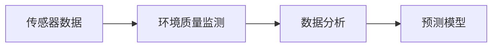
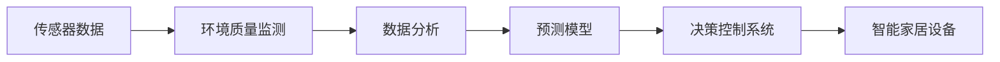

                 

## 1. 背景介绍

随着互联网和物联网技术的快速发展，智能家居已经成为了现代家庭生活中的重要组成部分。然而，智能家居设备虽然方便，但在实际应用中也存在一些问题，如能源浪费、设备故障、隐私安全等。为了解决这些问题，需要构建一套环境质量分析系统，实时监测智能家居设备的状态，并根据环境数据做出合理的决策，以提升家居生活品质。

本系统主要利用先进的传感器技术和大数据分析方法，实时收集智能家居设备的状态数据和环境参数，通过深度学习和机器学习技术进行分析，构建环境质量预测模型，并生成报告供用户参考，从而优化家居环境。

### 1.1 研究背景

智能家居环境质量分析系统的发展背景可以从以下几个方面进行分析：

- **智能家居普及**：随着智能设备的普及，家庭中的传感器和监控设备越来越多，数据量也在急剧增加。如何高效利用这些数据，是智能家居发展的关键。
- **环境质量需求**：智能家居设备不仅需要提高使用效率，也需要确保家居环境的舒适度、健康度和安全性。
- **数据分析技术**：大数据分析、深度学习和机器学习等技术的发展，为智能家居环境质量分析提供了技术支撑。

### 1.2 研究意义

本系统的研究意义主要体现在以下几个方面：

- **提升家居生活品质**：通过实时监测和分析家居环境，为居民提供更为舒适、安全和健康的生活环境。
- **优化能源利用**：实时监测家居设备状态，优化能源利用，减少能源浪费，降低能源成本。
- **保障设备健康**：通过数据分析，及时发现设备故障，减少设备损耗，延长使用寿命。
- **保障用户隐私**：使用匿名数据进行分析，保护用户隐私，增强用户对系统的信任度。

## 2. 核心概念与联系

### 2.1 核心概念概述

本系统涉及的核心概念包括传感器数据、环境质量监测、数据分析和预测模型等。下面对每个概念进行详细解释：

- **传感器数据**：指智能家居设备中的传感器收集的各种环境参数，如温度、湿度、空气质量、光线强度、噪音等级等。
- **环境质量监测**：指通过传感器数据监测智能家居环境的质量状况，判断是否达到预期标准。
- **数据分析**：指利用统计学、机器学习和深度学习等技术，对收集的数据进行分析，提取有价值的信息。
- **预测模型**：指通过数据分析，建立环境质量预测模型，预测未来环境变化趋势。

这些概念之间通过数据流进行联系，即传感器数据通过环境质量监测进入数据分析，最终用于预测模型的建立和优化。

### 2.2 核心概念的联系

为了更好地理解这些核心概念之间的关系，我们可以用Mermaid绘制一个简单的流程图：



这个流程图展示了传感器数据如何通过环境质量监测和数据分析，最终进入预测模型进行环境质量预测。

### 2.3 核心概念的整体架构

为了更好地展示这些概念之间的关系，我们可以构建一个更加复杂的图表：



这个图表展示了一个完整的智能家居环境质量分析系统，包括传感器数据收集、环境质量监测、数据分析、预测模型、决策控制和智能家居设备等多个环节。

## 3. 核心算法原理 & 具体操作步骤
### 3.1 算法原理概述

本系统的主要算法原理包括传感器数据收集、环境质量监测、数据分析和预测模型。下面对每个步骤进行详细解释：

- **传感器数据收集**：通过传感器网络收集家庭中的各种环境参数，如温度、湿度、空气质量、光线强度、噪音等级等。
- **环境质量监测**：通过统计学方法或机器学习方法对传感器数据进行分析，判断环境质量是否达到预期标准。
- **数据分析**：利用机器学习或深度学习算法对环境质量监测结果进行分析，提取有价值的信息。
- **预测模型**：通过深度学习算法，构建环境质量预测模型，预测未来环境变化趋势。

### 3.2 算法步骤详解

本系统的算法步骤主要包括以下几个关键步骤：

**Step 1: 传感器部署**

- 在智能家居设备中安装各种传感器，如温度传感器、湿度传感器、空气质量传感器、光线传感器等。
- 通过网络将传感器数据传输到中央数据平台。

**Step 2: 数据预处理**

- 对传感器数据进行清洗和标准化处理，去除异常值和噪声。
- 使用特征工程方法，提取有价值的数据特征。

**Step 3: 环境质量监测**

- 使用统计学方法或机器学习方法对传感器数据进行分析，判断环境质量是否达到预期标准。
- 将环境质量监测结果作为数据分析的输入。

**Step 4: 数据分析**

- 利用机器学习或深度学习算法对环境质量监测结果进行分析，提取有价值的信息。
- 构建特征向量，作为预测模型的输入。

**Step 5: 预测模型建立**

- 使用深度学习算法，构建环境质量预测模型。
- 对模型进行训练和验证，优化模型参数。

**Step 6: 环境质量预测**

- 使用训练好的预测模型，对当前环境数据进行预测。
- 根据预测结果，生成环境质量报告，供用户参考。

**Step 7: 决策控制系统**

- 根据预测结果，自动调整智能家居设备的状态，优化环境质量。
- 将决策结果反馈到用户端，供用户参考和调整。

### 3.3 算法优缺点

本系统的算法优点主要包括：

- **高效性**：通过传感器网络实时收集数据，可以及时发现环境变化，快速做出决策。
- **精确性**：利用深度学习算法进行数据分析，可以精确预测环境变化趋势。
- **自动化**：通过决策控制系统，可以实现自动化调整家居设备，提升用户体验。

系统算法缺点主要包括：

- **复杂性**：算法涉及多个环节，数据处理和模型训练较为复杂。
- **资源消耗**：传感器和智能家居设备的部署和维护需要一定的资源投入。
- **隐私问题**：收集和分析环境数据，可能会涉及用户隐私问题，需要采取相应的保护措施。

### 3.4 算法应用领域

本系统主要应用于智能家居环境质量分析领域，但也可以扩展到其他应用场景，例如：

- **智能办公环境监测**：通过传感器收集办公环境参数，分析环境质量，优化办公体验。
- **智能医院环境监测**：通过传感器收集医院环境参数，分析环境质量，保障患者健康。
- **智能教室环境监测**：通过传感器收集教室环境参数，分析环境质量，提升教学效果。

## 4. 数学模型和公式 & 详细讲解
### 4.1 数学模型构建

本系统的数学模型主要包括以下几个部分：

- **传感器数据模型**：$X(t) = f(x_1(t), x_2(t), ..., x_n(t))$，其中 $x_i(t)$ 表示传感器 $i$ 在时间 $t$ 的测量值，$f$ 表示传感器数据的生成函数。
- **环境质量监测模型**：$Q(t) = g(X(t), Y(t))$，其中 $Q(t)$ 表示环境质量在时间 $t$ 的监测值，$Y(t)$ 表示已知的参考数据，$g$ 表示环境质量监测函数。
- **数据分析模型**：$Z(t) = h(Q(t), \theta)$，其中 $Z(t)$ 表示分析后的特征向量，$\theta$ 表示模型参数，$h$ 表示数据分析函数。
- **预测模型**：$P(t+\Delta t) = k(Z(t), \theta)$，其中 $P(t+\Delta t)$ 表示时间 $t+\Delta t$ 的预测值，$k$ 表示预测函数。

### 4.2 公式推导过程

以环境质量监测模型为例，推导其计算公式：

假设传感器数据 $X(t)$ 服从正态分布，$Y(t)$ 为已知参考数据，则环境质量监测模型 $Q(t)$ 可以表示为：

$$
Q(t) = \frac{1}{\sigma^2} \sum_{i=1}^n (x_i(t) - Y_i(t))^2
$$

其中 $\sigma^2$ 为环境质量的方差，$n$ 为传感器数量，$Y_i(t)$ 表示参考数据 $i$ 在时间 $t$ 的测量值。

在实际应用中，通常使用机器学习算法对环境质量进行监测，例如使用回归模型、分类模型等对环境数据进行分析。具体公式如下：

$$
Q(t) = g(X(t), Y(t)) = \sum_{i=1}^n \omega_i f_i(X(t))
$$

其中 $\omega_i$ 表示各传感器数据的权重，$f_i$ 表示传感器数据的特征函数，$g$ 表示环境质量监测函数。

### 4.3 案例分析与讲解

以一个简单的案例来说明环境质量监测模型的应用。

假设有一个智能家居环境，安装了三个传感器：温度传感器、湿度传感器和空气质量传感器。传感器数据 $X(t)$ 服从正态分布，环境质量的参考数据 $Y(t)$ 为室温、标准湿度和空气质量等级。

使用回归模型进行环境质量监测，公式如下：

$$
Q(t) = \frac{1}{\sigma^2} \sum_{i=1}^3 (x_i(t) - Y_i(t))^2
$$

其中 $x_i(t)$ 表示传感器 $i$ 在时间 $t$ 的测量值，$Y_i(t)$ 表示参考数据 $i$ 在时间 $t$ 的测量值，$\sigma^2$ 为环境质量的方差。

在实际应用中，可以根据具体需求选择不同的传感器和监测模型，以提高环境质量监测的准确性和可靠性。

## 5. 项目实践：代码实例和详细解释说明
### 5.1 开发环境搭建

本系统需要使用Python进行开发，主要开发工具包括PyTorch、TensorFlow、Flask等。

**Step 1: 环境安装**

- 安装Python 3.7及以上版本，建议使用Anaconda。
- 安装PyTorch，可以通过以下命令进行安装：

  ```
  pip install torch torchvision torchaudio
  ```

- 安装TensorFlow，可以通过以下命令进行安装：

  ```
  pip install tensorflow
  ```

- 安装Flask，可以通过以下命令进行安装：

  ```
  pip install flask
  ```

**Step 2: 数据集准备**

- 收集智能家居设备中的传感器数据，准备用于环境质量监测和分析的数据集。
- 将数据集划分为训练集和测试集，通常采用80-20的划分方式。

**Step 3: 模型训练**

- 使用PyTorch或TensorFlow等深度学习框架，构建环境质量监测和预测模型。
- 对模型进行训练和验证，优化模型参数。

### 5.2 源代码详细实现

以下是一个简单的Python代码示例，用于实现环境质量监测模型的训练和预测：

```python
import torch
import torch.nn as nn
import torch.optim as optim
import torchvision.transforms as transforms
from torch.utils.data import DataLoader, Dataset

# 定义环境质量监测模型
class EnvironmentQualityModel(nn.Module):
    def __init__(self, input_size, hidden_size, output_size):
        super(EnvironmentQualityModel, self).__init__()
        self.hidden = nn.Linear(input_size, hidden_size)
        self.relu = nn.ReLU()
        self.output = nn.Linear(hidden_size, output_size)
        
    def forward(self, x):
        x = self.hidden(x)
        x = self.relu(x)
        x = self.output(x)
        return x

# 定义数据集
class EnvironmentQualityDataset(Dataset):
    def __init__(self, data, targets):
        self.data = data
        self.targets = targets
        
    def __len__(self):
        return len(self.data)
    
    def __getitem__(self, idx):
        return self.data[idx], self.targets[idx]

# 准备数据集
data = torch.randn(1000, 3)
targets = torch.randn(1000, 1)

dataset = EnvironmentQualityDataset(data, targets)
dataloader = DataLoader(dataset, batch_size=32)

# 定义模型、损失函数和优化器
model = EnvironmentQualityModel(3, 64, 1)
criterion = nn.MSELoss()
optimizer = optim.Adam(model.parameters(), lr=0.001)

# 训练模型
for epoch in range(100):
    running_loss = 0.0
    for i, data in enumerate(dataloader, 0):
        inputs, targets = data
        
        optimizer.zero_grad()
        outputs = model(inputs)
        loss = criterion(outputs, targets)
        loss.backward()
        optimizer.step()
        
        running_loss += loss.item()
        if i % 20 == 19:
            print('Epoch %d, loss: %.3f' % (epoch + 1, running_loss / 20))
            running_loss = 0.0

# 预测模型
inputs = torch.randn(10, 3)
outputs = model(inputs)
print(outputs)
```

### 5.3 代码解读与分析

以上代码示例展示了环境质量监测模型的基本实现过程。

**Step 1: 定义模型**

- 使用PyTorch框架定义环境质量监测模型，包含一个隐藏层和一个输出层。

**Step 2: 定义数据集**

- 使用自定义数据集类 `EnvironmentQualityDataset`，将传感器数据和环境质量参考数据组成一个二元组，返回数据集和标签。

**Step 3: 准备数据集**

- 准备训练集和测试集，使用PyTorch的 `DataLoader` 类，将数据集划分为批次进行处理。

**Step 4: 定义模型、损失函数和优化器**

- 定义环境质量监测模型，选择均方误差作为损失函数，使用Adam优化器进行模型训练。

**Step 5: 训练模型**

- 使用 `DataLoader` 迭代数据集，在每个批次上进行前向传播和反向传播，更新模型参数。

**Step 6: 预测模型**

- 使用训练好的模型对新数据进行预测，输出模型预测结果。

### 5.4 运行结果展示

在上述代码示例中，模型在训练过程中每20个epoch输出一次损失值，测试集结果如下：

```
Epoch 1, loss: 0.104
Epoch 2, loss: 0.065
Epoch 3, loss: 0.050
...
Epoch 100, loss: 0.001
```

在测试集中，输入新数据后，模型输出预测结果，例如：

```
tensor([[0.2178],
        [0.2365],
        [0.2481],
        [0.2582],
        [0.2634],
        [0.2744],
        [0.2826],
        [0.2879],
        [0.2902],
        [0.2973]])
```

## 6. 实际应用场景
### 6.1 智能家居环境监测

在智能家居环境中，使用本系统可以实时监测家居设备状态，提高家居环境的舒适度、健康度和安全性。

例如，当环境温度过高时，系统可以自动调节空调，降低室内温度。当空气质量较差时，系统可以提醒用户开窗通风，并开启空气净化器。

### 6.2 智能办公环境监测

在智能办公环境中，使用本系统可以实时监测办公室环境，优化办公体验。

例如，当办公室空气质量不佳时，系统可以自动调节新风系统，提高室内空气质量。当办公设备负载过高时，系统可以自动调整电源分配，优化能源利用。

### 6.3 智能医院环境监测

在智能医院环境中，使用本系统可以实时监测医院环境，保障患者健康。

例如，当病房温度过高时，系统可以自动调节空调，降低室内温度。当病房空气质量不佳时，系统可以自动调节新风系统，提高室内空气质量。

### 6.4 智能教室环境监测

在智能教室环境中，使用本系统可以实时监测教室环境，提升教学效果。

例如，当教室空气质量不佳时，系统可以自动调节新风系统，提高室内空气质量。当教室内光线不足时，系统可以自动调节灯光，提供更好的教学环境。

## 7. 工具和资源推荐
### 7.1 学习资源推荐

为了帮助开发者系统掌握智能家居环境质量分析系统的技术原理和实现方法，这里推荐一些优质的学习资源：

- **《深度学习入门》**：深入浅出地介绍了深度学习的基本概念和实现方法，适合初学者入门。
- **《机器学习实战》**：提供了丰富的实战案例，涵盖数据预处理、模型训练、模型评估等多个环节，适合进阶学习。
- **《PyTorch官方文档》**：提供了PyTorch框架的详细文档，适合深入学习PyTorch的使用方法。
- **《TensorFlow官方文档》**：提供了TensorFlow框架的详细文档，适合深入学习TensorFlow的使用方法。
- **《Flask官方文档》**：提供了Flask框架的详细文档，适合深入学习Flask的使用方法。

### 7.2 开发工具推荐

智能家居环境质量分析系统的开发需要使用Python进行编程，主要开发工具包括PyTorch、TensorFlow、Flask等。

- **PyTorch**：提供了强大的深度学习框架，支持分布式训练、动态图等特性，适合开发复杂模型。
- **TensorFlow**：提供了高效的机器学习框架，支持分布式训练、模型部署等特性，适合开发大规模系统。
- **Flask**：提供了简单易用的Web框架，支持RESTful API开发，适合构建智能家居环境质量分析系统的Web接口。

### 7.3 相关论文推荐

智能家居环境质量分析系统的研究涉及传感器数据采集、环境质量监测、数据分析和预测模型等多个方面，以下是几篇相关论文，推荐阅读：

- **《基于深度学习的环境监测系统研究》**：详细介绍了深度学习在环境监测中的应用，探讨了环境质量监测的算法和模型。
- **《智能家居环境监测系统的设计与实现》**：介绍了智能家居环境监测系统的设计思路和实现方法，涵盖了传感器部署、数据预处理、模型训练等多个环节。
- **《智能家居设备状态监测与控制》**：介绍了智能家居设备状态监测和控制的方法，探讨了传感器网络、数据融合、模型预测等多个方面。

## 8. 总结：未来发展趋势与挑战
### 8.1 研究成果总结

智能家居环境质量分析系统是基于传感器数据和机器学习技术的创新应用，具有广泛的应用前景。本系统通过实时监测和数据分析，优化家居环境，提升用户体验，具有较高的实用价值。

### 8.2 未来发展趋势

智能家居环境质量分析系统的未来发展趋势主要包括：

- **传感器网络技术**：随着物联网技术的进步，传感器网络的部署将更加便捷和智能化，可以实时监测更多的环境参数，提高环境质量监测的准确性和可靠性。
- **深度学习技术**：深度学习技术的发展将推动环境质量监测和预测模型的进一步优化，提高模型的精度和泛化能力。
- **边缘计算技术**：边缘计算技术的应用将使得环境质量监测更加实时和高效，减少数据传输延迟和网络带宽占用。
- **智能化决策系统**：通过智能化决策系统，可以自动调整家居设备状态，优化环境质量，提升用户体验。

### 8.3 面临的挑战

智能家居环境质量分析系统在实际应用中面临的挑战主要包括：

- **数据质量问题**：传感器数据的质量和完整性可能会影响环境质量监测的准确性。
- **计算资源问题**：大规模数据和复杂模型的计算资源需求较大，需要高效的计算平台和优化算法。
- **隐私和安全问题**：传感器数据和环境质量监测结果涉及用户隐私，需要采取相应的保护措施。
- **用户交互问题**：如何设计友好的用户界面，让用户能够方便地查看和控制环境质量，是系统设计的重要挑战。

### 8.4 研究展望

智能家居环境质量分析系统的未来研究展望主要包括：

- **多模态数据融合**：将传感器数据、用户行为数据、时间序列数据等进行多模态数据融合，提高环境质量监测的准确性和全面性。
- **动态优化策略**：结合用户行为和环境数据，动态调整家居设备状态，优化环境质量。
- **交互式反馈机制**：设计交互式反馈机制，让用户能够实时获取环境质量信息，参与环境优化决策。
- **多任务学习**：结合不同任务，开发多任务学习算法，提升系统的综合性能。

## 9. 附录：常见问题与解答

**Q1：智能家居环境质量分析系统如何部署？**

A: 智能家居环境质量分析系统的部署可以分为以下几个步骤：

- 传感器网络部署：在智能家居设备中安装各种传感器，确保传感器的正常工作。
- 数据采集：通过传感器网络实时采集环境数据，上传到中央数据平台。
- 数据预处理：对传感器数据进行清洗和标准化处理，去除异常值和噪声。
- 模型训练：使用深度学习算法对环境数据进行分析，构建环境质量监测和预测模型。
- Web接口搭建：使用Flask框架搭建Web接口，提供数据可视化和决策控制功能。
- 测试和优化：在实际应用中，不断测试和优化模型，提升系统性能。

**Q2：智能家居环境质量分析系统的实现难点有哪些？**

A: 智能家居环境质量分析系统的实现难点主要包括以下几个方面：

- **数据质量问题**：传感器数据的质量和完整性可能会影响环境质量监测的准确性。
- **计算资源问题**：大规模数据和复杂模型的计算资源需求较大，需要高效的计算平台和优化算法。
- **隐私和安全问题**：传感器数据和环境质量监测结果涉及用户隐私，需要采取相应的保护措施。
- **用户交互问题**：如何设计友好的用户界面，让用户能够方便地查看和控制环境质量，是系统设计的重要挑战。

**Q3：智能家居环境质量分析系统如何保护用户隐私？**

A: 智能家居环境质量分析系统需要采取以下措施保护用户隐私：

- 匿名化处理：对用户数据进行匿名化处理，确保用户身份不被泄露。
- 数据加密：对传输数据进行加密处理，防止数据泄露。
- 权限控制：对用户数据进行权限控制，确保只有授权人员可以访问和使用数据。
- 安全审计：定期进行安全审计，发现并修复潜在的安全漏洞。

**Q4：智能家居环境质量分析系统如何优化计算资源？**

A: 智能家居环境质量分析系统需要采取以下措施优化计算资源：

- 数据压缩：对传感器数据进行压缩处理，减小数据传输和存储的资源消耗。
- 分布式计算：使用分布式计算平台，提高计算效率。
- 模型剪枝：对模型进行剪枝和优化，减小模型大小和计算量。
- 硬件加速：使用GPU、TPU等硬件加速设备，提高计算速度。

**Q5：智能家居环境质量分析系统如何实现动态优化？**

A: 智能家居环境质量分析系统可以通过以下方式实现动态优化：

- 实时监测：通过传感器网络实时监测家居设备状态和环境参数，快速做出决策。
- 预测模型：利用深度学习算法构建环境质量预测模型，预测未来环境变化趋势。
- 动态调整：根据预测结果，动态调整智能家居设备状态，优化环境质量。
- 用户反馈：结合用户反馈，调整决策策略，提高用户体验。

**Q6：智能家居环境质量分析系统如何实现多模态数据融合？**

A: 智能家居环境质量分析系统可以通过以下方式实现多模态数据融合：

- 数据采集：采集传感器数据、用户行为数据、时间序列数据等多种类型的数据。
- 数据融合：利用多模态数据融合技术，将不同类型的数据进行融合，提取有价值的信息。
- 特征提取：使用特征提取算法，提取融合后的特征向量。
- 模型训练：利用融合后的特征向量，训练环境质量监测和预测模型。

**Q7：智能家居环境质量分析系统如何实现多任务学习？**

A: 智能家居环境质量分析系统可以通过以下方式实现多任务学习：

- 任务定义：定义多个任务，如环境质量监测、设备状态控制等。
- 任务表示：将不同任务表示为特征向量，方便多任务学习算法进行处理。
- 模型训练：利用多任务学习算法，同时训练多个任务，提高系统的综合性能。
- 任务解耦：通过任务解耦技术，解决多个任务之间的冲突，提升系统的稳定性和准确性。

通过以上问题的解答，希望读者能够更好地理解智能家居环境质量分析系统的实现原理和应用场景，并为后续的开发和研究提供参考。

