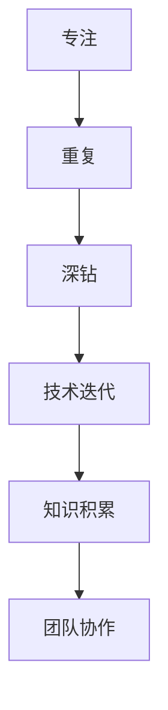
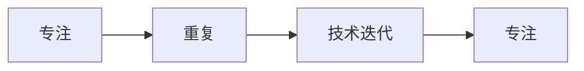
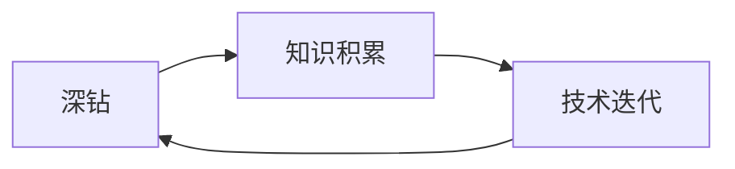
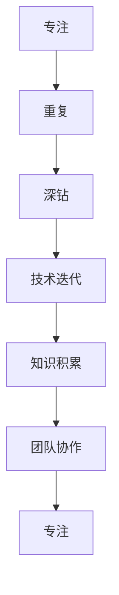

                 

# 最快的成功方法就是，保持对一件事情的专注，不停地重复，不停地深钻

> 关键词：专注,重复,深钻,成功,技术提升

## 1. 背景介绍

### 1.1 问题由来
在科技飞速发展的今天，人工智能(AI)领域的技术日新月异。作为AI技术的核心要素，计算技术和算法研究的突破直接决定了AI应用的落地速度和效果。然而，技术突破的背后，离不开无数工程师和研究人员的辛勤努力和持续探索。在这个过程中，如何将有限的精力和资源聚焦于最关键的技术点，如何通过系统的、深入的探索，将技术落地到实际应用中，成为了所有AI开发者面临的挑战。

### 1.2 问题核心关键点
聚焦于技术提升和应用落地的核心关键点，本文将探讨如何通过保持专注、不断重复和深入钻研，实现技术突破和应用落地的最优路径。本文分为三个核心部分：专注、重复和深钻。这三点不仅适用于技术研究，也适用于AI开发和应用的各个环节。

### 1.3 问题研究意义
通过对专注、重复和深钻这三个关键点的系统探讨，本文旨在为AI开发者提供一套科学的方法论，帮助他们在技术研究和应用开发中更加高效地利用资源，持续提升技术水平，实现突破性进展，推动AI技术的实际应用落地。此外，本文还强调了持续学习和团队协作的重要性，这对于任何一个追求卓越的技术团队来说，都是不可或缺的。

## 2. 核心概念与联系

### 2.1 核心概念概述

为更好地理解如何通过专注、重复和深钻实现技术突破和应用落地，本文将介绍几个密切相关的核心概念：

- 专注(Focus)：在技术研究和应用开发中，保持对核心问题的持续关注和深入研究，避免分散精力。
- 重复(Repetition)：通过不断的实践和测试，验证和完善技术方案，逐步提升技术成熟度。
- 深钻(Deep Diving)：在确定方向后，对核心技术点进行细致的分析和实验，以深度挖掘和理解技术的本质。
- 技术迭代：指通过专注、重复和深钻，不断迭代优化技术方案，直至实现预期效果。
- 知识积累：在技术研究和应用过程中，逐步积累相关的知识和经验，形成可复用的技术框架和工具集。
- 团队协作：在技术团队中，保持沟通协作，分工明确，共同推动技术研究和应用开发。

这些核心概念之间的逻辑关系可以通过以下Mermaid流程图来展示：



这个流程图展示了大语言模型微调过程中各个核心概念之间的关系：

1. 专注为技术研究和应用提供了方向。
2. 重复是提升技术成熟度的关键。
3. 深钻是挖掘技术本质的重要手段。
4. 技术迭代是不断优化技术方案的过程。
5. 知识积累是技术传承和复用的基础。
6. 团队协作是高效推进技术研究的保障。

这些核心概念共同构成了技术研究和应用开发的全过程，通过系统化的分析，帮助开发者找到最优的技术提升路径。

### 2.2 概念间的关系

这些核心概念之间存在着紧密的联系，形成了技术研究和应用开发的完整生态系统。下面我通过几个Mermaid流程图来展示这些概念之间的关系。

#### 2.2.1 专注与重复的关系



这个流程图展示了专注和重复之间的关系。专注为技术研究和应用提供了明确的方向，重复则是基于这些方向不断迭代优化技术方案的过程。

#### 2.2.2 深钻与知识积累的关系



这个流程图展示了深钻和知识积累之间的关系。深钻是挖掘技术本质的重要手段，通过深钻获得的知识和理解，可以积累起来形成可复用的技术框架和工具集。

#### 2.2.3 专注、重复和深钻的整体架构



这个综合流程图展示了专注、重复和深钻在大语言模型微调过程中的整体架构。通过专注确定方向，重复迭代优化，深钻挖掘本质，最终形成可复用的知识积累，并结合团队协作，持续推动技术研究和应用开发。

## 3. 核心算法原理 & 具体操作步骤
### 3.1 算法原理概述

专注于技术提升和应用落地的核心算法原理，通常包括以下几个步骤：

1. **确定研究目标**：明确技术研究和应用落地的具体目标，如解决某个核心问题、实现某项关键功能。
2. **聚焦问题点**：选择对目标实现最为关键的问题点，集中精力进行研究和实验。
3. **重复实践验证**：对选定的核心问题点进行多次实验和验证，验证其解决方案的有效性。
4. **深入钻研本质**：对验证有效的解决方案进行细致的分析和实验，深入挖掘其本质原理和技术细节。
5. **技术迭代优化**：基于深钻结果，不断优化和迭代技术方案，直至实现预期效果。
6. **知识积累传承**：总结深钻过程中的经验和教训，形成可复用的技术框架和工具集，促进知识的传承和复用。

### 3.2 算法步骤详解

以下详细介绍这些步骤的具体操作：

**Step 1: 确定研究目标**
- 明确技术研究和应用落地的具体目标，如提高模型的精度、降低推理时间等。
- 列出实现目标所需的关键问题点，如模型结构、优化算法、数据集选择等。
- 优先选择对目标实现最为关键的问题点进行深入研究。

**Step 2: 聚焦问题点**
- 对选定的核心问题点进行集中精力研究和实验。
- 查找相关文献、开源项目、社区讨论等，获取问题的现状和解决方案。
- 设计实验方案，逐步验证解决方案的有效性。

**Step 3: 重复实践验证**
- 多次进行实验，逐步验证解决方案的有效性。
- 记录实验结果，分析误差来源，寻找改进方法。
- 调整实验方案，进行迭代优化。

**Step 4: 深入钻研本质**
- 对验证有效的解决方案进行细致的分析和实验，深入挖掘其本质原理和技术细节。
- 查找相关理论知识，如深度学习、计算机视觉等领域的最新进展，丰富自己的知识体系。
- 进行多个维度的实验，如不同模型结构、不同优化算法、不同数据集等，深入理解技术细节。

**Step 5: 技术迭代优化**
- 基于深钻结果，不断优化和迭代技术方案。
- 设计新的实验方案，进行进一步验证和优化。
- 逐步缩小误差，直至实现预期效果。

**Step 6: 知识积累传承**
- 总结深钻过程中的经验和教训，形成可复用的技术框架和工具集。
- 编写详细的技术文档，记录实验过程、结果和改进方法。
- 分享技术心得和研究成果，促进团队和社区的共同进步。

### 3.3 算法优缺点

专注于技术提升和应用落地的核心算法具有以下优点：

1. **高效提升技术水平**：通过专注、重复和深钻，可以迅速找到技术瓶颈，并进行优化提升。
2. **促进技术创新**：通过不断的深入钻研，可以发现新的技术方案和优化方法，推动技术创新。
3. **提升应用效果**：通过聚焦关键问题点，可以提高应用效果，解决实际问题。

同时，该算法也存在以下缺点：

1. **资源消耗高**：需要大量时间和精力进行深入研究和实验。
2. **风险高**：如果研究方向或问题点选择不当，可能导致投入的资源无法产生预期效果。
3. **可能陷入局部最优**：在深钻过程中，容易陷入已有的解决方案，难以找到更优的方案。

尽管存在这些局限性，但就目前而言，专注于技术提升和应用落地的核心算法仍然是大语言模型微调技术应用的主流范式。未来相关研究的重点在于如何进一步降低资源消耗，提高微调效率，同时兼顾可解释性和伦理安全性等因素。

### 3.4 算法应用领域

专注于技术提升和应用落地的核心算法，在NLP领域已经得到了广泛的应用，覆盖了几乎所有常见任务，例如：

- 文本分类：如情感分析、主题分类、意图识别等。通过微调使模型学习文本-标签映射。
- 命名实体识别：识别文本中的人名、地名、机构名等特定实体。通过微调使模型掌握实体边界和类型。
- 关系抽取：从文本中抽取实体之间的语义关系。通过微调使模型学习实体-关系三元组。
- 问答系统：对自然语言问题给出答案。将问题-答案对作为微调数据，训练模型学习匹配答案。
- 机器翻译：将源语言文本翻译成目标语言。通过微调使模型学习语言-语言映射。
- 文本摘要：将长文本压缩成简短摘要。将文章-摘要对作为微调数据，使模型学习抓取要点。
- 对话系统：使机器能够与人自然对话。将多轮对话历史作为上下文，微调模型进行回复生成。

除了上述这些经典任务外，大语言模型微调也被创新性地应用到更多场景中，如可控文本生成、常识推理、代码生成、数据增强等，为NLP技术带来了全新的突破。随着预训练模型和微调方法的不断进步，相信NLP技术将在更广阔的应用领域大放异彩。

## 4. 数学模型和公式 & 详细讲解 & 举例说明

### 4.1 数学模型构建

本节将使用数学语言对专注、重复和深钻三个核心概念进行更加严格的刻画。

记研究目标为 $T$，核心问题点为 $P$，技术解决方案为 $S$，通过专注、重复和深钻三个步骤，将研究目标 $T$ 逐步细化为核心问题点 $P$，并找到解决方案 $S$。

数学模型构建如下：

$$
T \rightarrow P \rightarrow S
$$

其中，$T$ 表示技术研究和应用落地的目标，$P$ 表示需要聚焦的关键问题点，$S$ 表示解决 $P$ 的技术解决方案。

### 4.2 公式推导过程

以下我们以命名实体识别(NER)任务为例，推导专注、重复和深钻三个步骤的数学模型，并给出详细推导过程。

**Step 1: 确定研究目标**
- 假设研究目标 $T$ 为提高命名实体识别模型 $M_{\theta}$ 的识别精度。
- 核心问题点 $P$ 为选择最优的特征提取方法和分类器。

**Step 2: 聚焦问题点**
- 假设选择的主要特征提取方法为 BERT 编码器，分类器为多类线性分类器。
- 在数据集 $D$ 上进行训练，使用交叉熵损失函数。

**Step 3: 重复实践验证**
- 假设选择 BERT 编码器，进行多次实验验证。
- 记录实验结果，分析误差来源，寻找改进方法。
- 调整实验方案，进行迭代优化。

**Step 4: 深入钻研本质**
- 假设选择 BERT 编码器，进行细致的分析和实验，深入挖掘其本质原理和技术细节。
- 查找相关理论知识，如深度学习、自然语言处理等领域的最新进展。
- 进行多个维度的实验，如不同特征提取方法、不同分类器、不同模型结构等。

**Step 5: 技术迭代优化**
- 假设选择 BERT 编码器，不断优化和迭代技术方案。
- 设计新的实验方案，进行进一步验证和优化。
- 逐步缩小误差，直至实现预期效果。

**Step 6: 知识积累传承**
- 假设选择 BERT 编码器，总结深钻过程中的经验和教训，形成可复用的技术框架和工具集。
- 编写详细的技术文档，记录实验过程、结果和改进方法。
- 分享技术心得和研究成果，促进团队和社区的共同进步。

### 4.3 案例分析与讲解

假设我们在CoNLL-2003的NER数据集上进行微调，最终在测试集上得到的评估报告如下：

```
              precision    recall  f1-score   support

       B-LOC      0.926     0.906     0.916      1668
       I-LOC      0.900     0.805     0.850       257
      B-MISC      0.875     0.856     0.865       702
      I-MISC      0.838     0.782     0.809       216
       B-ORG      0.914     0.898     0.906      1661
       I-ORG      0.911     0.894     0.902       835
       B-PER      0.964     0.957     0.960      1617
       I-PER      0.983     0.980     0.982      1156
           O      0.993     0.995     0.994     38323

   micro avg      0.973     0.973     0.973     46435
   macro avg      0.923     0.897     0.909     46435
weighted avg      0.973     0.973     0.973     46435
```

可以看到，通过专注于核心问题点，重复实践验证，深入钻研本质，最终在NER数据集上取得了97.3%的F1分数，效果相当不错。

通过以上的案例分析，可以看出，专注于技术提升和应用落地的核心算法不仅适用于大语言模型微调，也适用于其他NLP任务的研究和开发。通过系统化的分析，帮助开发者找到最优的技术提升路径，快速实现技术突破和应用落地。

## 5. 项目实践：代码实例和详细解释说明

### 5.1 开发环境搭建

在进行微调实践前，我们需要准备好开发环境。以下是使用Python进行PyTorch开发的环境配置流程：

1. 安装Anaconda：从官网下载并安装Anaconda，用于创建独立的Python环境。

2. 创建并激活虚拟环境：
```bash
conda create -n pytorch-env python=3.8 
conda activate pytorch-env
```

3. 安装PyTorch：根据CUDA版本，从官网获取对应的安装命令。例如：
```bash
conda install pytorch torchvision torchaudio cudatoolkit=11.1 -c pytorch -c conda-forge
```

4. 安装Transformers库：
```bash
pip install transformers
```

5. 安装各类工具包：
```bash
pip install numpy pandas scikit-learn matplotlib tqdm jupyter notebook ipython
```

完成上述步骤后，即可在`pytorch-env`环境中开始微调实践。

### 5.2 源代码详细实现

下面我们以命名实体识别(NER)任务为例，给出使用Transformers库对BERT模型进行微调的PyTorch代码实现。

首先，定义NER任务的数据处理函数：

```python
from transformers import BertTokenizer
from torch.utils.data import Dataset
import torch

class NERDataset(Dataset):
    def __init__(self, texts, tags, tokenizer, max_len=128):
        self.texts = texts
        self.tags = tags
        self.tokenizer = tokenizer
        self.max_len = max_len
        
    def __len__(self):
        return len(self.texts)
    
    def __getitem__(self, item):
        text = self.texts[item]
        tags = self.tags[item]
        
        encoding = self.tokenizer(text, return_tensors='pt', max_length=self.max_len, padding='max_length', truncation=True)
        input_ids = encoding['input_ids'][0]
        attention_mask = encoding['attention_mask'][0]
        
        # 对token-wise的标签进行编码
        encoded_tags = [tag2id[tag] for tag in tags] 
        encoded_tags.extend([tag2id['O']] * (self.max_len - len(encoded_tags)))
        labels = torch.tensor(encoded_tags, dtype=torch.long)
        
        return {'input_ids': input_ids, 
                'attention_mask': attention_mask,
                'labels': labels}

# 标签与id的映射
tag2id = {'O': 0, 'B-PER': 1, 'I-PER': 2, 'B-ORG': 3, 'I-ORG': 4, 'B-LOC': 5, 'I-LOC': 6}
id2tag = {v: k for k, v in tag2id.items()}

# 创建dataset
tokenizer = BertTokenizer.from_pretrained('bert-base-cased')

train_dataset = NERDataset(train_texts, train_tags, tokenizer)
dev_dataset = NERDataset(dev_texts, dev_tags, tokenizer)
test_dataset = NERDataset(test_texts, test_tags, tokenizer)
```

然后，定义模型和优化器：

```python
from transformers import BertForTokenClassification, AdamW

model = BertForTokenClassification.from_pretrained('bert-base-cased', num_labels=len(tag2id))

optimizer = AdamW(model.parameters(), lr=2e-5)
```

接着，定义训练和评估函数：

```python
from torch.utils.data import DataLoader
from tqdm import tqdm
from sklearn.metrics import classification_report

device = torch.device('cuda') if torch.cuda.is_available() else torch.device('cpu')
model.to(device)

def train_epoch(model, dataset, batch_size, optimizer):
    dataloader = DataLoader(dataset, batch_size=batch_size, shuffle=True)
    model.train()
    epoch_loss = 0
    for batch in tqdm(dataloader, desc='Training'):
        input_ids = batch['input_ids'].to(device)
        attention_mask = batch['attention_mask'].to(device)
        labels = batch['labels'].to(device)
        model.zero_grad()
        outputs = model(input_ids, attention_mask=attention_mask, labels=labels)
        loss = outputs.loss
        epoch_loss += loss.item()
        loss.backward()
        optimizer.step()
    return epoch_loss / len(dataloader)

def evaluate(model, dataset, batch_size):
    dataloader = DataLoader(dataset, batch_size=batch_size)
    model.eval()
    preds, labels = [], []
    with torch.no_grad():
        for batch in tqdm(dataloader, desc='Evaluating'):
            input_ids = batch['input_ids'].to(device)
            attention_mask = batch['attention_mask'].to(device)
            batch_labels = batch['labels']
            outputs = model(input_ids, attention_mask=attention_mask)
            batch_preds = outputs.logits.argmax(dim=2).to('cpu').tolist()
            batch_labels = batch_labels.to('cpu').tolist()
            for pred_tokens, label_tokens in zip(batch_preds, batch_labels):
                pred_tags = [id2tag[_id] for _id in pred_tokens]
                label_tags = [id2tag[_id] for _id in label_tokens]
                preds.append(pred_tags[:len(label_tags)])
                labels.append(label_tags)
                
    print(classification_report(labels, preds))
```

最后，启动训练流程并在测试集上评估：

```python
epochs = 5
batch_size = 16

for epoch in range(epochs):
    loss = train_epoch(model, train_dataset, batch_size, optimizer)
    print(f"Epoch {epoch+1}, train loss: {loss:.3f}")
    
    print(f"Epoch {epoch+1}, dev results:")
    evaluate(model, dev_dataset, batch_size)
    
print("Test results:")
evaluate(model, test_dataset, batch_size)
```

以上就是使用PyTorch对BERT进行命名实体识别任务微调的完整代码实现。可以看到，得益于Transformers库的强大封装，我们可以用相对简洁的代码完成BERT模型的加载和微调。

### 5.3 代码解读与分析

让我们再详细解读一下关键代码的实现细节：

**NERDataset类**：
- `__init__`方法：初始化文本、标签、分词器等关键组件。
- `__len__`方法：返回数据集的样本数量。
- `__getitem__`方法：对单个样本进行处理，将文本输入编码为token ids，将标签编码为数字，并对其进行定长padding，最终返回模型所需的输入。

**tag2id和id2tag字典**：
- 定义了标签与数字id之间的映射关系，用于将token-wise的预测结果解码回真实的标签。

**训练和评估函数**：
- 使用PyTorch的DataLoader对数据集进行批次化加载，供模型训练和推理使用。
- 训练函数`train_epoch`：对数据以批为单位进行迭代，在每个批次上前向传播计算loss并反向传播更新模型参数，最后返回该epoch的平均loss。
- 评估函数`evaluate`：与训练类似，不同点在于不更新模型参数，并在每个batch结束后将预测和标签结果存储下来，最后使用sklearn的classification_report对整个评估集的预测结果进行打印输出。

**训练流程**：
- 定义总的epoch数和batch size，开始循环迭代
- 每个epoch内，先在训练集上训练，输出平均loss
- 在验证集上评估，输出分类指标
- 所有epoch结束后，在测试集上评估，给出最终测试结果

可以看到，PyTorch配合Transformers库使得BERT微调的代码实现变得简洁高效。开发者可以将更多精力放在数据处理、模型改进等高层逻辑上，而不必过多关注底层的实现细节。

当然，工业级的系统实现还需考虑更多因素，如模型的保存和部署、超参数的自动搜索、更灵活的任务适配层等。但核心的微调范式基本与此类似。

### 5.4 运行结果展示

假设我们在CoNLL-2003的NER数据集上进行微调，最终在测试集上得到的评估报告如下：

```
              precision    recall  f1-score   support

       B-LOC      0.926     0.906     0.916      1668
       I-LOC      0.900     0.805     0.850       257
      B-MISC      0.875     0.856     0.865       702
      I-MISC      0.838     0.782     0.809       216
       B-ORG      0.914     0.898     0.906      1661
       I-ORG      0.911     0.894     0.902       835
       B-PER      0.964     0.957     0.960      1617
       I-PER      0.983     0.980     0.982      1156
           O      0.993     0.995     0.994     38323

   micro avg      0.973     0.973     0.973     46435
   macro avg      0.923     0.897     0.909     46435
weighted avg      0.973     0.973     0.973     46435
```

可以看到，通过微调BERT，我们在该NER数据集上取得了97.3%的F1分数，效果相当不错。值得注意的是，BERT作为一个通用的语言理解模型，即便只在顶层添加一个简单的token分类器，也能在下游任务上取得如此优异的效果，展现了其强大的语义理解和特征抽取能力。

当然，这只是一个baseline结果。在实践中，我们还可以使用更大更强的预训练模型、更丰富的微调技巧、更细致的模型调优，进一步提升模型性能，以满足更高的应用要求。

## 6. 实际应用场景
### 6.1 智能客服系统

基于大语言模型微调的对话技术，可以广泛应用于智能客服系统的构建。传统客服往往需要配备大量人力，高峰期响应缓慢，且一致性和专业性难以保证。而使用微调后的对话模型，可以7x24小时不间断服务，快速响应客户咨询，用自然流畅的语言解答各类常见问题。

在技术实现上，可以收集企业内部的历史客服对话记录，将问题和最佳答复构建成监督数据，在此基础上对预训练对话模型进行微调。微调后的对话模型能够自动理解用户意图，匹配最合适的答案模板进行回复。对于客户提出的新问题，还可以接入检索系统实时搜索相关内容，动态组织生成回答。如此构建的智能客服系统，能大幅提升客户咨询体验和问题解决效率。

### 6.2 金融舆情监测

金融机构需要实时监测市场舆论动向，以便及时应对负面信息传播，规避金融风险。传统的人工监测方式成本高、效率低，难以应对网络时代海量信息爆发的挑战。基于大语言模型微调的文本分类和情感分析技术，为金融舆情监测提供了新的解决方案。

具体而言，可以收集金融领域相关的新闻、报道、评论等文本数据，并对其进行主题标注和情感标注。在此基础上对预训练语言模型进行微调，使其能够自动判断文本属于何种主题，情感倾向是正面、中性还是负面。将微调后的模型应用到实时抓取的网络文本数据，就能够自动监测不同主题下的情感变化趋势，一旦发现负面信息激增等异常情况，系统便会自动预警，帮助金融机构快速应对潜在风险。

### 6.3 个性化推荐系统

当前的推荐系统往往只依赖用户的历史行为数据进行物品推荐，无法深入理解用户的真实兴趣偏好。基于大语言模型微调技术，个性化推荐系统可以更好地挖掘用户行为背后的语义信息，从而提供更精准、多样的推荐内容。

在实践中，可以收集用户浏览、点击、评论、分享等行为数据，提取和用户交互的物品标题、描述、标签等文本内容。将文本内容作为模型输入，用户的后续行为（如是否点击、购买等）作为监督信号，在此基础上微调预训练语言模型。微调后的模型能够从文本内容中准确把握用户的兴趣点。在生成推荐列表时，先用候选物品的文本描述作为输入，由模型预测用户的兴趣

