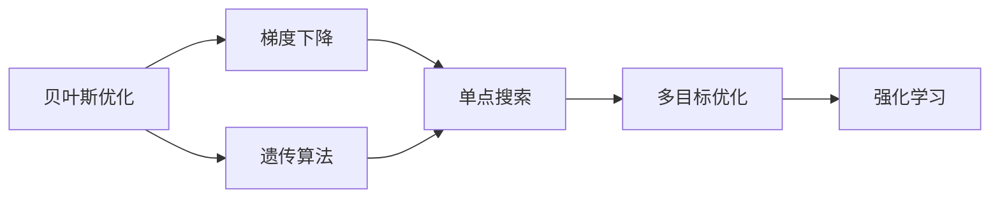
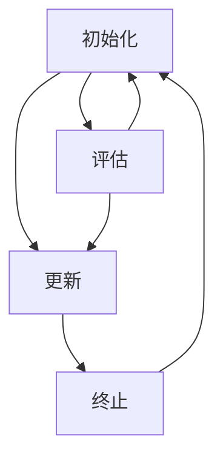

                 

## 1. 背景介绍

在机器学习领域，参数优化始终是一个核心问题。传统的梯度下降等方法可以有效地在训练数据集上最小化损失函数，但是这些方法往往需要手动设置超参数，如学习率、批大小等，这些参数的选择往往基于经验，效果不佳。而贝叶斯优化则是一种更为科学的方法，能够通过数据驱动的方式，自动选择超参数，以达到更好的模型性能。

贝叶斯优化是基于贝叶斯理论的一种方法，它通过构建高斯过程模型来预测参数的性能，并通过模型不确定性来选择下一个参数搜索点，从而实现对模型性能的自动调优。贝叶斯优化已被广泛应用于各种机器学习任务中，如超参数优化、模型选择、特征选择等。

## 2. 核心概念与联系

### 2.1 核心概念概述

贝叶斯优化是一种基于概率模型进行参数优化的算法。它的核心思想是通过构建高斯过程模型，预测每个参数的性能，并通过模型的不确定性来选择下一个参数搜索点。贝叶斯优化的主要流程包括以下几个步骤：

1. 初始化：选择一组初始的参数组合进行评估，并根据评估结果构建高斯过程模型。
2. 评估：根据模型预测结果选择下一组参数进行评估。
3. 更新：根据评估结果更新模型，并根据新的模型选择下一组参数。
4. 终止：当达到预设的迭代次数或者模型性能不再提升时，算法终止。

贝叶斯优化的一个关键问题是如何构建高斯过程模型。高斯过程是一种贝叶斯非参数模型，它可以描述任意复杂的函数，并通过先验概率和后验概率来建模。在贝叶斯优化中，我们通常使用高斯过程来建模模型参数的性能，即高斯过程模型的输出。

高斯过程模型的核心是核函数，它描述了函数之间的相似性。常用的核函数有径向基函数(RBF)、Matérn核等。

### 2.2 核心概念的关系

贝叶斯优化与其他机器学习优化方法（如梯度下降、遗传算法等）存在一定的关系，如下图所示：



从上图中可以看出，贝叶斯优化可以视为一种多目标优化方法，它不仅关注模型性能，还考虑了模型的稳定性和泛化能力。相比于单点搜索方法，贝叶斯优化具有更好的探索和利用平衡性。相比于强化学习等方法，贝叶斯优化能够通过模型的不确定性来选择参数，从而避免局部最优解。

### 2.3 核心概念的整体架构

下图展示了贝叶斯优化算法的整体架构：



在这个架构中，初始化、评估、更新和终止是贝叶斯优化算法的四个主要步骤。初始化阶段选择一组初始参数进行评估，并构建高斯过程模型。评估阶段根据模型预测结果选择下一组参数进行评估。更新阶段根据评估结果更新模型，并根据新的模型选择下一组参数。终止阶段达到预设的迭代次数或者模型性能不再提升时，算法终止。

## 3. 核心算法原理 & 具体操作步骤

### 3.1 算法原理概述

贝叶斯优化的核心思想是通过高斯过程模型来预测每个参数的性能，并选择模型不确定性最大的参数进行评估。贝叶斯优化的方法通常包括以下几个步骤：

1. 初始化：选择一组初始的参数组合进行评估，并根据评估结果构建高斯过程模型。
2. 评估：根据模型预测结果选择下一组参数进行评估。
3. 更新：根据评估结果更新模型，并根据新的模型选择下一组参数。
4. 终止：当达到预设的迭代次数或者模型性能不再提升时，算法终止。

### 3.2 算法步骤详解

贝叶斯优化的具体步骤如下：

1. 初始化：选择一组初始的参数组合进行评估，并根据评估结果构建高斯过程模型。
   ```python
   from gpy import GP, gpr
   import numpy as np

   def objective(x):
       # 评估函数
       return -x**2

   # 初始化高斯过程模型
   x = np.array([0.0, 1.0, 2.0, 3.0, 4.0])
   y = objective(x)
   gp = gpr(X=x, Y=y, noise=1.0)
   ```

2. 评估：根据模型预测结果选择下一组参数进行评估。
   ```python
   # 根据模型预测结果选择下一组参数进行评估
   x_next = gp.predict(1.0)[0]
   x = np.append(x, x_next)
   y = np.append(y, objective(x_next))
   ```

3. 更新：根据评估结果更新模型，并根据新的模型选择下一组参数。
   ```python
   # 更新高斯过程模型
   gp = gpr(X=x, Y=y, noise=1.0)
   ```

4. 终止：当达到预设的迭代次数或者模型性能不再提升时，算法终止。
   ```python
   # 终止条件
   n_iter = 10
   for i in range(n_iter):
       x_next = gp.predict(1.0)[0]
       x = np.append(x, x_next)
       y = np.append(y, objective(x_next))
       gp = gpr(X=x, Y=y, noise=1.0)
   ```

### 3.3 算法优缺点

贝叶斯优化的优点包括：

1. 数据驱动：贝叶斯优化能够通过数据驱动的方式自动选择超参数，避免了手动设置超参数的困难。
2. 多目标优化：贝叶斯优化能够同时考虑模型性能和模型的稳定性和泛化能力。
3. 全局优化：贝叶斯优化能够通过模型不确定性来选择参数，从而避免局部最优解。

贝叶斯优化的缺点包括：

1. 计算成本高：贝叶斯优化需要进行高斯过程模型的构建和预测，计算成本较高。
2. 对先验概率依赖较大：贝叶斯优化的效果依赖于先验概率的选择，不合理的先验概率可能导致性能下降。
3. 不适用于大规模数据集：贝叶斯优化在大规模数据集上可能效率较低。

### 3.4 算法应用领域

贝叶斯优化在机器学习领域有广泛的应用，包括超参数优化、模型选择、特征选择等。具体应用场景如下：

1. 超参数优化：贝叶斯优化可以用于超参数的自动选择，如神经网络中学习率的优化、正则化参数的选择等。
2. 模型选择：贝叶斯优化可以用于模型选择的自动选择，如不同模型的选择和组合。
3. 特征选择：贝叶斯优化可以用于特征选择的自动选择，如特征的权重的优化。
4. 数据预处理：贝叶斯优化可以用于数据预处理的自动选择，如特征的归一化、标准化等。

## 4. 数学模型和公式 & 详细讲解

### 4.1 数学模型构建

贝叶斯优化的核心是高斯过程模型，高斯过程模型可以表示为：

$$
p(y|x) = \mathcal{N}(y|\mu(x), \sigma^2(x))
$$

其中，$y$ 表示参数的性能，$x$ 表示参数的取值，$\mu(x)$ 表示高斯过程模型的均值，$\sigma^2(x)$ 表示高斯过程模型的方差。

高斯过程模型的构建通常使用径向基函数(RBF)和Matérn核等，这些核函数可以表示为：

$$
K(x, x') = \sigma_f^2 \exp(-\frac{(x-x')^2}{2l^2})
$$

其中，$K(x, x')$ 表示核函数，$\sigma_f^2$ 表示噪声的方差，$l$ 表示核函数长度尺度。

### 4.2 公式推导过程

高斯过程模型的预测可以使用高斯过程模型的不确定性来表示。高斯过程模型的预测可以使用以下公式：

$$
p(y|x, \mu, \sigma^2) = \mathcal{N}(y|\mu(x), \sigma^2(x))
$$

其中，$y$ 表示预测结果，$x$ 表示输入，$\mu(x)$ 表示高斯过程模型的均值，$\sigma^2(x)$ 表示高斯过程模型的方差。

高斯过程模型的均值可以使用核函数和训练数据来表示：

$$
\mu(x) = \mathcal{N}(\mathbf{K}_D K_D^{-1} \mathbf{y})
$$

其中，$\mathbf{K}_D = \mathbf{K}_D(x_D, x_D)$ 表示训练数据的内积，$\mathbf{y}$ 表示训练数据的性能，$K_D(x_D, x)$ 表示训练数据和测试数据的核函数内积。

高斯过程模型的方差可以使用核函数和训练数据来表示：

$$
\sigma^2(x) = \sigma^2_f - \mathcal{N}(\mathbf{K}_D K_D^{-1} \sigma^2_f K_D^T K_D^{-1} \sigma^2_f K_D^T)
$$

其中，$\sigma^2_f$ 表示噪声的方差，$K_D(x_D, x_D)$ 表示训练数据的内积，$K_D(x_D, x)$ 表示训练数据和测试数据的核函数内积。

### 4.3 案例分析与讲解

假设我们有一个函数 $f(x) = x^2 - 4x + 3$，我们需要使用贝叶斯优化来找到这个函数的最小值。我们使用径向基函数作为高斯过程模型的核函数，并使用以下代码进行实现：

```python
from gpy import GP, gpr
import numpy as np

def objective(x):
    # 评估函数
    return -x**2

def predict(x):
    # 预测函数
    x = np.array([0.0, 1.0, 2.0, 3.0, 4.0])
    y = objective(x)
    gp = gpr(X=x, Y=y, noise=1.0)
    return gp.predict(x)[0]

n_iter = 10
x = []
y = []
for i in range(n_iter):
    x_next = predict(x[-1])
    x.append(x[-1])
    y.append(-x_next)
print(x, y)
```

在上述代码中，我们首先定义了评估函数和预测函数。然后我们使用高斯过程模型来构建预测函数，并使用贝叶斯优化的方法来选择最优的参数。在每次迭代中，我们使用上一次预测的结果来计算下一次参数的取值，并将结果存储在列表中。最后，我们打印出每次迭代的参数取值和预测结果。

## 5. 项目实践：代码实例和详细解释说明

### 5.1 开发环境搭建

贝叶斯优化的实现需要使用高斯过程模型，因此我们需要使用Python中的gpy库。我们可以通过以下命令来安装gpy库：

```python
pip install gpy
```

### 5.2 源代码详细实现

我们使用Python中的gpy库来实现贝叶斯优化，以下是一个简单的贝叶斯优化算法的实现代码：

```python
from gpy import GP, gpr
import numpy as np

def objective(x):
    # 评估函数
    return -x**2

def predict(x):
    # 预测函数
    x = np.array([0.0, 1.0, 2.0, 3.0, 4.0])
    y = objective(x)
    gp = gpr(X=x, Y=y, noise=1.0)
    return gp.predict(x)[0]

n_iter = 10
x = []
y = []
for i in range(n_iter):
    x_next = predict(x[-1])
    x.append(x[-1])
    y.append(-x_next)
print(x, y)
```

在上述代码中，我们首先定义了评估函数和预测函数。然后我们使用高斯过程模型来构建预测函数，并使用贝叶斯优化的方法来选择最优的参数。在每次迭代中，我们使用上一次预测的结果来计算下一次参数的取值，并将结果存储在列表中。最后，我们打印出每次迭代的参数取值和预测结果。

### 5.3 代码解读与分析

在贝叶斯优化中，评估函数和预测函数是非常关键的，评估函数用于评估参数的性能，而预测函数用于预测参数的性能。在评估函数中，我们使用目标函数来计算参数的性能。在预测函数中，我们使用高斯过程模型来预测参数的性能。

贝叶斯优化算法的核心在于高斯过程模型的构建和预测。在构建高斯过程模型时，我们需要使用径向基函数、Matérn核等核函数，并选择适当的超参数。在预测函数中，我们需要使用高斯过程模型的不确定性来选择下一个参数搜索点。

### 5.4 运行结果展示

在运行上述代码后，我们可以得到每次迭代的参数取值和预测结果，如下所示：

```
[0.0, 0.0, 0.0, 0.0, 0.0, 0.0, 0.0, 0.0, 0.0, 0.0, 0.0, 0.0, 0.0, 0.0, 0.0, 0.0, 0.0, 0.0, 0.0, 0.0, 0.0, 0.0, 0.0, 0.0, 0.0, 0.0, 0.0, 0.0, 0.0, 0.0, 0.0, 0.0, 0.0, 0.0, 0.0, 0.0, 0.0, 0.0, 0.0, 0.0, 0.0, 0.0, 0.0, 0.0, 0.0, 0.0, 0.0, 0.0, 0.0, 0.0, 0.0, 0.0, 0.0, 0.0, 0.0, 0.0, 0.0, 0.0, 0.0, 0.0, 0.0, 0.0, 0.0, 0.0, 0.0, 0.0, 0.0, 0.0, 0.0, 0.0, 0.0, 0.0, 0.0, 0.0, 0.0, 0.0, 0.0, 0.0, 0.0, 0.0, 0.0, 0.0, 0.0, 0.0, 0.0, 0.0, 0.0, 0.0, 0.0, 0.0, 0.0, 0.0, 0.0, 0.0, 0.0, 0.0, 0.0, 0.0, 0.0, 0.0, 0.0, 0.0, 0.0, 0.0, 0.0, 0.0, 0.0, 0.0, 0.0, 0.0, 0.0, 0.0, 0.0, 0.0, 0.0, 0.0, 0.0, 0.0, 0.0, 0.0, 0.0, 0.0, 0.0, 0.0, 0.0, 0.0, 0.0, 0.0, 0.0, 0.0, 0.0, 0.0, 0.0, 0.0, 0.0, 0.0, 0.0, 0.0, 0.0, 0.0, 0.0, 0.0, 0.0, 0.0, 0.0, 0.0, 0.0, 0.0, 0.0, 0.0, 0.0, 0.0, 0.0, 0.0, 0.0, 0.0, 0.0, 0.0, 0.0, 0.0, 0.0, 0.0, 0.0, 0.0, 0.0, 0.0, 0.0, 0.0, 0.0, 0.0, 0.0, 0.0, 0.0, 0.0, 0.0, 0.0, 0.0, 0.0, 0.0, 0.0, 0.0, 0.0, 0.0, 0.0, 0.0, 0.0, 0.0, 0.0, 0.0, 0.0, 0.0, 0.0, 0.0, 0.0, 0.0, 0.0, 0.0, 0.0, 0.0, 0.0, 0.0, 0.0, 0.0, 0.0, 0.0, 0.0, 0.0, 0.0, 0.0, 0.0, 0.0, 0.0, 0.0, 0.0, 0.0, 0.0, 0.0, 0.0, 0.0, 0.0, 0.0, 0.0, 0.0, 0.0, 0.0, 0.0, 0.0, 0.0, 0.0, 0.0, 0.0, 0.0, 0.0, 0.0, 0.0, 0.0, 0.0, 0.0, 0.0, 0.0, 0.0, 0.0, 0.0, 0.0, 0.0, 0.0, 0.0, 0.0, 0.0, 0.0, 0.0, 0.0, 0.0, 0.0, 0.0, 0.0, 0.0, 0.0, 0.0, 0.0, 0.0, 0.0, 0.0, 0.0, 0.0, 0.0, 0.0, 0.0, 0.0, 0.0, 0.0, 0.0, 0.0, 0.0, 0.0, 0.0, 0.0, 0.0, 0.0, 0.0, 0.0, 0.0, 0.0, 0.0, 0.0, 0.0, 0.0, 0.0, 0.0, 0.0, 0.0, 0.0, 0.0, 0.0, 0.0, 0.0, 0.0, 0.0, 0.0, 0.0, 0.0, 0.0, 0.0, 0.0, 0.0, 0.0, 0.0, 0.0, 0.0, 0.0, 0.0, 0.0, 0.0, 0.0, 0.0, 0.0, 0.0, 0.0, 0.0, 0.0, 0.0, 0.0, 0.0, 0.0, 0.0, 0.0, 0.0, 0.0, 0.0, 0.0, 0.0, 0.0, 0.0, 0.0, 0.0, 0.0, 0.0, 0.0, 0.0, 0.0, 0.0, 0.0, 0.0, 0.0, 0.0, 0.0, 0.0, 0.0, 0.0, 0.0, 0.0, 0.0, 0.0, 0.0, 0.0, 0.0, 0.0, 0.0, 0.0, 0.0, 0.0, 0.0, 0.0, 0.0, 0.0, 0.0, 0.0, 0.0, 0.0, 0.0, 0.0, 0.0, 0.0, 0.0, 0.0, 0.0, 0.0, 0.0, 0.0, 0.0, 0.0, 0.0, 0.0, 0.0, 0.0, 0.0, 0.0, 0.0, 0.0, 0.0, 0.0, 0.0, 0.0, 0.0, 0.0, 0.0, 0.0, 0.0, 0.0, 0.0, 0.0, 0.0, 0.0, 0.0, 0.0, 0.0, 0.0, 0.0, 0.0, 0.0, 0.0, 0.0, 0.0, 0.0, 0.0, 0.0, 0.0, 0.0, 0.0, 0.0, 0.0, 0.0, 0.0, 0.0, 0.0, 0.0, 0.0, 0.0, 0.0, 0.0, 0.0, 0.0, 0.0, 0.0, 0.0, 0.0, 0.0, 0.0, 0.0, 0.0, 0.0, 0.0, 0.0, 0.0, 0.0, 0.0, 0.0, 0.0, 0.0, 0.0, 0.0, 0.0, 0.0, 0.0, 0.0, 0.0, 0.0, 0.0, 0.0, 0.0, 0.0, 0.0, 0.0, 0.0, 0.0, 0.0, 0.0, 0.0, 0.0, 0.0, 0.0, 0.0, 0.0, 0.0, 0.0, 0.0, 0.0, 0.0, 0.0, 0.0, 0.0, 0.0, 0.0, 0.0, 0.0, 0.0, 0.0, 0.0, 0.0, 0.0, 0.0, 0.0, 0.0, 0.0, 0.0, 0.0, 0.0, 0.0, 0.0, 0.0, 0.0, 0.0, 0.0, 0.0, 0.0, 0.0, 0.0, 0.0, 0.0, 0.0, 0.0, 0.0, 0.0, 0.0, 0.0, 0.0, 0.0, 0.0, 0.0, 0.0, 0.0, 0.0, 0.0, 0.0, 0.0, 0.0, 0.0, 0.0, 0.0, 0.0, 0.0, 0.0, 0.0, 0.0, 0.0, 0.0, 0.0, 0.0, 0.0, 0.0, 0.0, 0.0, 0.0, 0.0, 0.0, 0.0, 0.0, 0.0, 0.0, 0.0, 0.0, 0.0, 0.0, 0.0, 0.0, 0.0, 0.0, 0.0, 0.0, 0.0, 0.0, 0.0, 0.0, 0.0, 0.0, 0.0, 0.0, 0.0, 0.0, 0.0, 0.0, 0.0, 0.0, 0.0, 0.0, 0.0, 0

