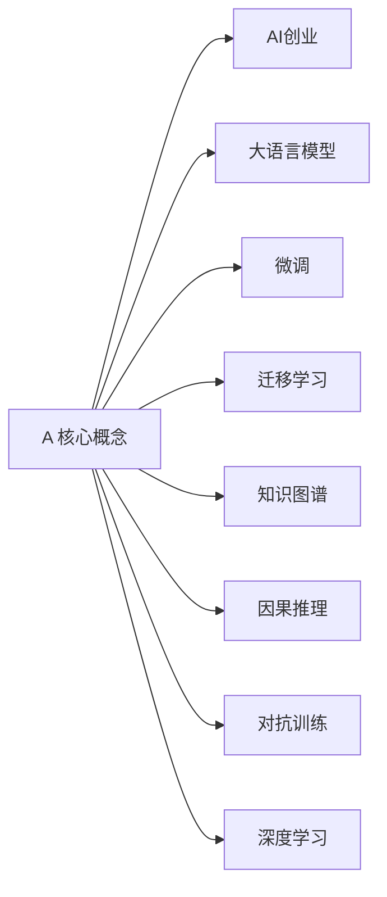

                 

# 李开复谈AI创业与大模型未来

## 1. 背景介绍

李开复博士，人工智能领域的领军人物，长期致力于推动人工智能技术的发展与应用。在本文中，他将结合自己的丰富经验和深入思考，畅谈AI创业的机遇与挑战，以及大语言模型的未来趋势。通过李博士的洞察，读者可以更深刻地理解当前AI技术的现状，以及如何把握未来发展的机会。

## 2. 核心概念与联系

### 2.1 核心概念概述

- **AI创业**：指通过人工智能技术进行创业，开发出具有创新性和商业价值的产品或服务。AI创业涵盖了从算法研究到产品应用的全过程。

- **大语言模型(Large Language Models, LLMs)**：一类基于深度学习的大型神经网络模型，能够进行自然语言理解和生成，代表作品如GPT、BERT等。

- **微调(Fine-Tuning)**：在预训练模型的基础上，使用任务特定数据进行有监督训练，以适应特定应用场景。

- **迁移学习(Transfer Learning)**：将一个领域的知识迁移到另一个领域，以提升新任务的学习效率。

- **知识图谱(Knowledge Graphs)**：一种结构化的知识表示方式，用于组织和链接各种事实和概念，辅助自然语言理解和推理。

- **因果推理(Causal Inference)**：研究如何基于因果关系进行推理和决策，避免仅依赖相关关系带来的误导。

- **对抗训练(Adversarial Training)**：通过引入对抗样本，提高模型的鲁棒性和泛化能力。

- **深度学习(Deep Learning)**：一类基于多层神经网络的机器学习方法，主要用于图像、语音、自然语言处理等领域。

### 2.2 概念间的关系

这些核心概念通过相互关联，构成了AI创业和大模型技术的主要研究领域和应用方向。例如，AI创业需要通过大语言模型进行自然语言处理，而大语言模型则依赖迁移学习来提高特定任务的性能。因果推理和对抗训练则用于增强模型的稳定性和鲁棒性，知识图谱用于辅助模型的知识理解和推理。

通过这些概念的关系图，我们可以更清晰地看到AI创业和大模型技术之间的紧密联系，以及各个概念在其中的作用和意义。



## 3. 核心算法原理 & 具体操作步骤

### 3.1 算法原理概述

大语言模型通过深度学习技术进行预训练，然后在特定任务上进行微调，以提高其针对该任务的表现。这一过程通常包括以下几个步骤：

1. **预训练**：使用大规模无标签数据对模型进行自监督学习，使其学习到通用的语言表示。
2. **微调**：在特定任务上，使用少量标注数据进行有监督学习，调整模型参数，使其能够更好地适应该任务。
3. **迁移学习**：将大语言模型在其他任务上学习到的知识，迁移到新任务上，以加速新任务的训练和提升性能。
4. **对抗训练**：通过引入对抗样本，提高模型对噪声和攻击的鲁棒性。
5. **知识图谱辅助**：结合知识图谱，增强模型的语义理解和推理能力。

### 3.2 算法步骤详解

#### 3.2.1 预训练

预训练通常使用自监督学习任务，如语言模型预测、掩码语言模型等，对大语言模型进行训练。以BERT为例，其预训练任务包括：

1. **掩码语言模型(Masked Language Modeling, MLM)**：随机掩盖文本中的某些词，让模型预测被掩盖的词。
2. **下一句预测(Next Sentence Prediction, NSP)**：随机抽取两句话，让模型判断它们是否连续。

预训练过程如下：

1. **数据准备**：收集大规模文本数据，如维基百科、新闻等，作为预训练数据。
2. **模型初始化**：选择合适的大语言模型架构，如Transformer。
3. **训练过程**：在预训练数据上运行模型，不断调整模型参数，以最小化损失函数。

#### 3.2.2 微调

微调过程如下：

1. **任务适配层设计**：根据任务类型，在模型顶层设计合适的输出层和损失函数。例如，对于文本分类任务，通常添加线性分类器和交叉熵损失函数。
2. **数据准备**：收集特定任务的标注数据集，将其划分为训练集、验证集和测试集。
3. **模型初始化**：将预训练模型参数作为初始化参数，加载到模型中。
4. **训练过程**：在标注数据集上运行模型，调整模型参数，以最小化损失函数。

#### 3.2.3 对抗训练

对抗训练过程如下：

1. **对抗样本生成**：使用生成对抗网络(GAN)等技术，生成对抗样本。
2. **模型训练**：在正常训练的同时，引入对抗样本进行训练。
3. **模型评估**：在对抗样本上评估模型的鲁棒性。

#### 3.2.4 知识图谱辅助

知识图谱辅助过程如下：

1. **知识图谱构建**：构建或使用现有的知识图谱，将知识结构化。
2. **模型适配**：将知识图谱与大语言模型进行适配，如嵌入知识图谱中的实体和关系。
3. **模型推理**：在推理任务上，使用适配后的模型进行推理和生成。

### 3.3 算法优缺点

#### 3.3.1 优点

1. **高效性**：大语言模型通过预训练和微调，可以快速适应特定任务，提升模型性能。
2. **泛化能力**：迁移学习和大模型架构使得模型具备较强的泛化能力，可以应用于多个相关领域。
3. **可解释性**：因果推理和知识图谱辅助增强了模型的可解释性，帮助理解模型决策过程。
4. **鲁棒性**：对抗训练提高了模型的鲁棒性，避免模型在噪声和攻击下的性能下降。

#### 3.3.2 缺点

1. **计算资源需求高**：大语言模型需要大量的计算资源进行训练和微调，成本较高。
2. **数据依赖**：微调和迁移学习依赖于标注数据，数据质量和数量对模型性能影响较大。
3. **模型复杂性**：大语言模型结构复杂，模型调试和优化较困难。
4. **知识局限**：知识图谱和因果推理虽然可以增强模型的理解能力，但知识库的构建和更新需要大量工作。

### 3.4 算法应用领域

大语言模型及其微调技术已经在多个领域得到了广泛应用，例如：

1. **自然语言处理(NLP)**：文本分类、机器翻译、命名实体识别、情感分析等任务。
2. **计算机视觉**：图像分类、目标检测、语义分割等任务。
3. **医疗**：医学影像分析、疾病诊断、医疗文本分析等任务。
4. **金融**：股票预测、风险评估、金融新闻摘要等任务。
5. **智能家居**：语音助手、智能客服、家庭自动化控制等任务。
6. **教育**：智能辅导、学习路径推荐、知识图谱构建等任务。

## 4. 数学模型和公式 & 详细讲解  
### 4.1 数学模型构建

大语言模型的数学模型通常基于深度学习，以下是BERT模型的一个简要介绍：

BERT模型包括两个主要组件：

1. **Transformer编码器**：由多层自注意力机制和前馈神经网络组成，用于捕捉输入序列的语义关系。
2. **MLM和NSP任务**：用于预训练的掩码语言模型和下一句预测任务。

BERT的预训练目标函数为：

$$
\mathcal{L}_{BERT} = \mathcal{L}_{MLM} + \mathcal{L}_{NSP}
$$

其中，$\mathcal{L}_{MLM}$为掩码语言模型损失，$\mathcal{L}_{NSP}$为下一句预测损失。

### 4.2 公式推导过程

#### 4.2.1 掩码语言模型(MLM)

掩码语言模型的目标函数为：

$$
\mathcal{L}_{MLM} = -\frac{1}{N}\sum_{i=1}^N \sum_{j=1}^N \sum_{k=1}^N p_{ij}^{MLM} \log P(x_i,j,k)
$$

其中，$x_i$表示输入序列，$j$表示被掩盖的词位置，$k$表示被掩盖的词。$P(x_i,j,k)$表示在位置$i$掩盖位置$j$的词后，预测位置$k$的词的概率。

#### 4.2.2 下一句预测(Next Sentence Prediction, NSP)

下一句预测的目标函数为：

$$
\mathcal{L}_{NSP} = -\frac{1}{N}\sum_{i=1}^N \log(P_{i,NSP})
$$

其中，$P_{i,NSP}$表示预测位置$i$的句子是否与下一个句子连续。

### 4.3 案例分析与讲解

以BERT模型为例，其预训练过程如下：

1. **输入**：一个长度为$L$的输入序列$x=[x_1, x_2, ..., x_L]$。
2. **编码器**：经过Transformer编码器，生成隐含表示$h=[h_1, h_2, ..., h_L]$。
3. **掩码语言模型(MLM)**：随机掩盖$j$位置的词，预测$k$位置的词。
4. **下一句预测(NSP)**：随机选择两个句子，让模型判断它们是否连续。

微调过程如下：

1. **任务适配层**：在BERT模型顶层添加分类器或解码器，用于特定任务的推理。
2. **数据准备**：收集特定任务的标注数据集，划分训练集、验证集和测试集。
3. **模型初始化**：将预训练的BERT模型参数作为初始化参数，加载到模型中。
4. **训练过程**：在标注数据集上运行模型，调整模型参数，以最小化损失函数。

## 5. 项目实践：代码实例和详细解释说明

### 5.1 开发环境搭建

要实现大语言模型的微调，需要搭建如下开发环境：

1. **Python环境**：安装Anaconda，创建虚拟环境。
2. **深度学习框架**：安装PyTorch、TensorFlow等深度学习框架。
3. **模型库**：安装BertTokenizer、BertForSequenceClassification等模型库。
4. **其他工具**：安装Jupyter Notebook、Numpy、Pandas、Scikit-learn等工具。

### 5.2 源代码详细实现

以BERT模型为例，使用PyTorch进行微调：

1. **模型加载**：

```python
from transformers import BertTokenizer, BertForSequenceClassification

tokenizer = BertTokenizer.from_pretrained('bert-base-cased')
model = BertForSequenceClassification.from_pretrained('bert-base-cased', num_labels=num_labels)
```

2. **数据处理**：

```python
def convert_data_to_ids(texts, labels):
    tokenized_texts = tokenizer.batch_encode_plus(texts, truncation=True, padding=True, max_length=max_length)
    input_ids = tokenized_texts['input_ids']
    attention_masks = tokenized_texts['attention_mask']
    labels = [label2id[label] for label in labels]
    return input_ids, attention_masks, labels
```

3. **训练过程**：

```python
from transformers import AdamW

model.to(device)
optimizer = AdamW(model.parameters(), lr=learning_rate)

def train_epoch(model, data_loader, optimizer):
    model.train()
    total_loss = 0
    for batch in data_loader:
        input_ids = batch[0].to(device)
        attention_masks = batch[1].to(device)
        labels = batch[2].to(device)
        model.zero_grad()
        outputs = model(input_ids, attention_mask=attention_masks, labels=labels)
        loss = outputs.loss
        total_loss += loss.item()
        loss.backward()
        optimizer.step()
    return total_loss / len(data_loader)
```

4. **模型评估**：

```python
def evaluate(model, data_loader):
    model.eval()
    total_predictions, total_labels = 0, 0
    with torch.no_grad():
        for batch in data_loader:
            input_ids = batch[0].to(device)
            attention_masks = batch[1].to(device)
            labels = batch[2].to(device)
            outputs = model(input_ids, attention_mask=attention_masks)
            predictions = outputs.logits.argmax(dim=2).to('cpu').tolist()
            total_predictions += predictions
            total_labels += labels
    return total_predictions, total_labels
```

5. **运行结果展示**：

```python
for epoch in range(num_epochs):
    loss = train_epoch(model, train_data_loader, optimizer)
    print(f'Epoch {epoch+1}, train loss: {loss:.3f}')
    
    predictions, labels = evaluate(model, test_data_loader)
    print(classification_report(labels, predictions))
```

### 5.3 代码解读与分析

- **模型加载**：使用BertTokenizer加载分词器，使用BertForSequenceClassification加载分类器。
- **数据处理**：将文本数据转换为模型所需的输入格式，并进行padding和truncation。
- **训练过程**：在每个epoch上，运行训练数据，前向传播计算损失，反向传播更新模型参数。
- **模型评估**：在测试集上评估模型性能，计算分类报告。

## 6. 实际应用场景

### 6.1 智能客服

基于大语言模型的智能客服系统可以自动化处理客户咨询，提升响应速度和准确性。通过微调BERT模型，系统能够理解客户意图，自动回复常见问题，甚至进行复杂的文本生成，提供个性化的服务。

### 6.2 医疗诊断

在医疗领域，大语言模型可以用于医学文本分析、疾病诊断等任务。通过微调BERT模型，系统能够理解医学文献，辅助医生进行疾病诊断和治疗方案选择，提高诊疗效率和准确性。

### 6.3 金融风控

在金融领域，大语言模型可以用于信用评估、风险预测等任务。通过微调BERT模型，系统能够分析金融新闻、客户行为等文本数据，预测客户信用风险，提升风险管理能力。

### 6.4 智能推荐

在电商领域，大语言模型可以用于商品推荐、个性化广告等任务。通过微调BERT模型，系统能够理解用户评论、搜索历史等文本数据，提供个性化的商品推荐和广告，提升用户体验和转化率。

## 7. 工具和资源推荐

### 7.1 学习资源推荐

1. **《深度学习》**：Ian Goodfellow等著，详细介绍了深度学习的基本概念和算法。
2. **《自然语言处理综论》**：Daniel Jurafsky等著，涵盖自然语言处理的理论基础和实践技巧。
3. **《深度学习框架PyTorch》**：Google AI Blog，提供PyTorch的官方教程和实践案例。
4. **《Transformers》**：Jacob Devlin等著，介绍Transformer及其应用。
5. **《Python深度学习》**：Francois Chollet等著，讲解使用Keras进行深度学习的方法和实践。

### 7.2 开发工具推荐

1. **PyTorch**：深度学习框架，提供高效的计算图和丰富的模型库。
2. **TensorFlow**：深度学习框架，支持分布式计算和生产部署。
3. **Hugging Face Transformers**：NLP库，提供多种预训练模型和微调框架。
4. **Weights & Biases**：模型训练跟踪工具，提供实验记录和可视化功能。
5. **TensorBoard**：TensorFlow配套的可视化工具，提供模型性能分析和调试功能。

### 7.3 相关论文推荐

1. **《BERT: Pre-training of Deep Bidirectional Transformers for Language Understanding》**：Devlin等著，提出BERT模型。
2. **《Attention is All You Need》**：Vaswani等著，提出Transformer模型。
3. **《Parameter-Efficient Transfer Learning for NLP》**：Alberti等著，介绍参数高效微调方法。
4. **《Causal Inference》**：Pearl著，讲解因果推理方法。
5. **《Deep Learning》**：Goodfellow等著，介绍深度学习的基本概念和方法。

## 8. 总结：未来发展趋势与挑战

### 8.1 研究成果总结

大语言模型及其微调技术已经取得了显著的进展，广泛应用于多个领域。通过预训练和微调，大语言模型能够适应多种任务，提升模型性能和泛化能力。未来，随着算力、数据和模型的不断发展，大语言模型将更加强大，能够处理更复杂的自然语言理解和生成任务。

### 8.2 未来发展趋势

1. **模型规模增大**：未来的大语言模型将具有更多的参数和更大的规模，具备更丰富的语言知识和常识。
2. **技术演进**：预训练、微调、迁移学习等技术将不断演进，提高模型的性能和泛化能力。
3. **应用场景扩大**：大语言模型将应用于更多领域，如医疗、金融、教育等，解决实际问题。
4. **算法优化**：因果推理、对抗训练、知识图谱等技术将不断优化，提高模型的稳定性和鲁棒性。
5. **工具完善**：深度学习框架和NLP库将不断完善，提供更高效、易用的工具。

### 8.3 面临的挑战

1. **计算资源**：大规模模型需要大量的计算资源，成本较高。
2. **数据质量**：微调和迁移学习依赖标注数据，数据质量和数量对模型性能影响较大。
3. **模型复杂性**：大语言模型结构复杂，模型调试和优化较困难。
4. **知识局限**：知识图谱和因果推理虽然可以增强模型的理解能力，但知识库的构建和更新需要大量工作。
5. **可解释性**：大语言模型的决策过程缺乏可解释性，难以理解和调试。

### 8.4 研究展望

1. **模型压缩和优化**：优化大语言模型结构，提高推理速度和资源利用效率。
2. **知识图谱融合**：将知识图谱与大语言模型结合，增强模型的知识理解和推理能力。
3. **对抗训练和鲁棒性**：研究如何提高模型的鲁棒性和泛化能力，避免过拟合和灾难性遗忘。
4. **因果推理和可解释性**：研究如何增强模型的因果推理能力和可解释性，提高模型的透明度和可信度。
5. **多模态融合**：将视觉、语音等模态与文本融合，构建更全面的智能系统。

总之，大语言模型及其微调技术有着广阔的发展前景，但也需要克服计算资源、数据质量、模型复杂性等挑战。通过不断的研究和优化，相信大语言模型将为AI创业和技术创新带来更多的机遇。

## 9. 附录：常见问题与解答

**Q1：大语言模型微调的主要步骤是什么？**

A: 大语言模型微调的主要步骤包括：

1. 准备预训练模型和数据集。
2. 添加任务适配层。
3. 设置微调超参数。
4. 执行梯度训练。
5. 测试和部署。

**Q2：大语言模型的预训练和微调有什么区别？**

A: 预训练和微调是大语言模型训练的两个阶段。

预训练是使用大规模无标签数据对模型进行自监督学习，学习通用的语言表示。微调是在预训练模型的基础上，使用下游任务的少量标注数据进行有监督学习，优化模型在特定任务上的性能。

**Q3：大语言模型在微调过程中如何避免过拟合？**

A: 大语言模型在微调过程中可以通过以下方法避免过拟合：

1. 数据增强：通过回译、近义替换等方式扩充训练集。
2. 正则化：使用L2正则、Dropout等技术。
3. 对抗训练：引入对抗样本。
4. 参数高效微调：只调整少量参数。

**Q4：如何理解大语言模型的鲁棒性？**

A: 大语言模型的鲁棒性是指模型在面对噪声和攻击时的稳定性和泛化能力。通过对抗训练等技术，可以在模型训练过程中引入对抗样本，提高模型的鲁棒性。

**Q5：大语言模型在落地应用时需要注意哪些问题？**

A: 大语言模型在落地应用时需要注意以下问题：

1. 模型裁剪：去除不必要的层和参数，减小模型尺寸。
2. 量化加速：将浮点模型转为定点模型，压缩存储空间。
3. 服务化封装：将模型封装为标准化服务接口。
4. 弹性伸缩：根据请求流量动态调整资源配置。
5. 监控告警：实时采集系统指标，设置异常告警阈值。

通过本文的系统梳理，可以看到，大语言模型微调技术在AI创业和实际应用中具有重要意义。通过不断的研究和优化，相信大语言模型将为NLP技术的发展带来更多的机遇和挑战。

