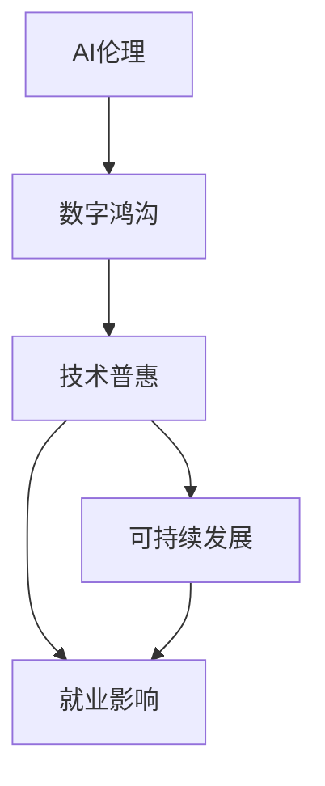
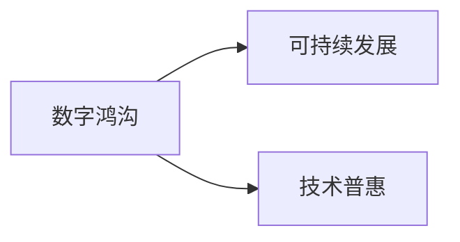
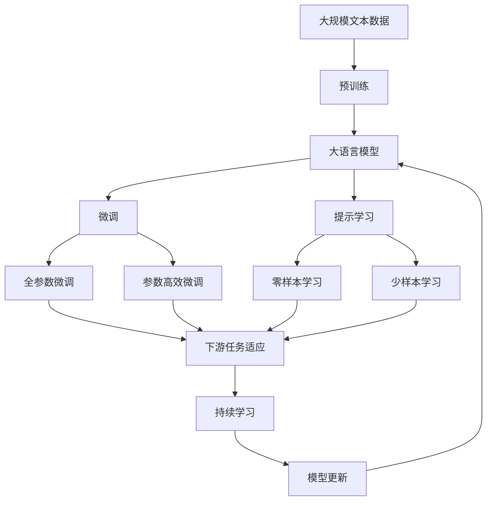

                 

# 李开复：AI 2.0 时代的社会价值

> 关键词：人工智能,社会价值,AI伦理,数字鸿沟,技术普惠,可持续发展,就业影响

## 1. 背景介绍

### 1.1 问题由来

人工智能（AI）技术自诞生以来，就引起了社会各界的广泛关注。随着AI 2.0时代的到来，人工智能技术正在快速发展，并逐渐渗透到社会的各个领域，包括医疗、教育、金融、制造等。AI 2.0时代的到来，意味着AI技术正在从单一的应用场景拓展到更加复杂、全面的社会经济体系中。然而，伴随AI技术的快速发展，也引发了一系列社会问题，如AI伦理、数字鸿沟、就业影响等。

### 1.2 问题核心关键点

AI 2.0时代的社会价值，主要集中在以下几个方面：

- **AI伦理**：如何在技术发展中平衡伦理和道德，避免AI技术的滥用和潜在的社会危害。
- **数字鸿沟**：如何确保AI技术普惠，使不同社会群体均能享受到技术带来的好处。
- **技术普惠**：如何通过AI技术解决实际问题，促进社会的可持续发展。
- **就业影响**：如何在AI技术的发展过程中，确保就业市场的稳定，避免大规模失业。

这些关键点构成了AI 2.0时代社会价值的核心议题，也直接关系到AI技术的未来发展方向。

### 1.3 问题研究意义

研究AI 2.0时代的社会价值，对于确保AI技术的健康、可持续发展和应用具有重要意义：

1. **避免伦理风险**：通过深入探讨AI伦理问题，可以更好地规范AI技术的应用，避免技术滥用和伦理风险。
2. **促进公平普惠**：通过研究如何缩小数字鸿沟，可以确保AI技术惠及更多群体，促进社会的公平和包容性。
3. **推动可持续发展**：通过技术普惠和社会价值的探索，可以推动AI技术在解决实际问题中的应用，促进社会的可持续发展。
4. **保障就业稳定**：通过探讨AI对就业市场的影响，可以为政策制定者提供参考，制定出合理的就业保障措施。

本文将重点讨论AI 2.0时代的社会价值，旨在为相关领域的专家、政策制定者和广大社会公众提供深入的分析和见解，以期在AI技术的发展和应用中取得更加平衡和可持续的结果。

## 2. 核心概念与联系

### 2.1 核心概念概述

为了更好地理解AI 2.0时代的社会价值，本节将介绍几个密切相关的核心概念：

- **AI伦理（AI Ethics）**：AI技术的应用应遵循一定的伦理原则，避免对人类社会造成负面影响。
- **数字鸿沟（Digital Divide）**：不同社会群体在获取和利用AI技术上的不平等，导致的技术获取和应用的不均衡。
- **技术普惠（Technology Inclusion）**：确保所有社会群体均能平等获取和使用AI技术，实现技术应用的公平和普惠。
- **可持续发展（Sustainable Development）**：AI技术应用应促进社会和环境的可持续发展，避免过度依赖技术和资源的消耗。
- **就业影响（Job Impact）**：AI技术的发展可能对就业市场产生影响，如自动化替代人工，导致部分岗位消失。

这些核心概念之间的逻辑关系可以通过以下Mermaid流程图来展示：



这个流程图展示了几大核心概念之间的关系：

1. AI伦理是AI技术应用的基础，确保技术的正确使用。
2. 数字鸿沟和技术普惠紧密相关，均关注技术获取的公平性。
3. 可持续发展和技术普惠密切联系，通过普惠技术促进社会和环境的平衡发展。
4. 就业影响也是技术普惠和可持续发展的关注点，需要平衡技术发展与就业市场的关系。

### 2.2 概念间的关系

这些核心概念之间存在着紧密的联系，形成了AI 2.0时代社会价值的完整生态系统。

#### 2.2.1 AI伦理与技术普惠


AI伦理是技术普惠的重要保障。只有遵循伦理原则，确保技术应用的公平性和透明性，才能实现技术普惠，使不同社会群体均能享受到AI技术的益处。

#### 2.2.2 数字鸿沟与可持续发展



数字鸿沟的存在会影响技术普惠的实现，进而影响社会的可持续发展。缩小数字鸿沟，推动技术普惠，是实现可持续发展的关键路径之一。

#### 2.2.3 就业影响与技术普惠


就业影响是技术普惠的重要考量因素。通过技术普惠，可以减缓就业市场的冲击，促进经济的平稳发展，从而推动社会的可持续发展。

### 2.3 核心概念的整体架构

最后，我们用一个综合的流程图来展示这些核心概念在大语言模型微调过程中的整体架构：



这个综合流程图展示了从预训练到微调，再到持续学习的完整过程。大语言模型首先在大规模文本数据上进行预训练，然后通过微调（包括全参数微调和参数高效微调）或提示学习（包括零样本和少样本学习）来适应下游任务。最后，通过持续学习技术，模型可以不断更新和适应新的任务和数据。 通过这些流程图，我们可以更清晰地理解AI 2.0时代社会价值的各个核心概念之间的关系和作用。

## 3. 核心算法原理 & 具体操作步骤
### 3.1 算法原理概述

AI 2.0时代的社会价值，主要体现在AI技术的伦理、普惠、可持续发展以及就业影响等多个方面。其中，AI伦理是基础，数字鸿沟是挑战，技术普惠是目标，可持续发展是方向，就业影响是结果。

### 3.2 算法步骤详解

AI 2.0时代社会价值的实现，涉及多个步骤和环节。以下详细讲解AI伦理、数字鸿沟、技术普惠、可持续发展以及就业影响的实现步骤。

#### 3.2.1 AI伦理的实现步骤

**Step 1: 确定伦理原则和标准**  
- 明确AI技术应用中应遵循的伦理原则，如公正性、透明性、可解释性等。
- 制定相关的伦理指南和标准，确保AI技术的正确使用。

**Step 2: 制定伦理审查机制**  
- 建立AI技术应用的伦理审查机制，包括独立审查机构和专家委员会。
- 确保伦理审查贯穿AI技术开发、应用和评估的全过程。

**Step 3: 教育与培训**  
- 对AI开发者、使用者和相关从业人员进行伦理培训，提升其伦理意识和责任感。
- 通过教育和培训，普及AI伦理知识，促进社会对AI技术的理解和接受。

#### 3.2.2 数字鸿沟的实现步骤

**Step 1: 识别数字鸿沟**  
- 通过调查和数据分析，识别社会群体在获取和利用AI技术上的不平等现象。
- 明确不同社会群体在技术获取和应用上的具体差异，如地域、年龄、性别等。

**Step 2: 制定普惠政策**  
- 制定相关政策，缩小数字鸿沟，如提供技术培训、增加基础设施投入等。
- 确保所有社会群体均能平等获取和使用AI技术。

**Step 3: 技术普惠措施**  
- 推广AI技术的普及应用，如开发适合不同社会群体的应用场景。
- 通过技术普惠，促进社会的公平和包容性。

#### 3.2.3 技术普惠的实现步骤

**Step 1: 技术开发和优化**  
- 开发适合不同社会群体的AI技术，如简化操作界面、降低技术门槛等。
- 优化AI技术，确保其易于使用、易于理解和易于推广。

**Step 2: 社会参与和反馈**  
- 邀请不同社会群体参与技术开发和评估，收集用户反馈。
- 根据反馈不断改进技术，确保其适用性和有效性。

**Step 3: 推广和应用**  
- 通过政府、企业和社会组织的合作，推广AI技术的普及应用。
- 确保技术普惠，实现技术的广泛应用和公平获取。

#### 3.2.4 可持续发展的实现步骤

**Step 1: 环境影响评估**  
- 对AI技术的环境影响进行评估，包括能源消耗、资源消耗、废弃物排放等。
- 识别并减少AI技术的负面环境影响。

**Step 2: 可持续发展战略**  
- 制定AI技术的可持续发展战略，如采用环保技术、优化资源使用等。
- 推动AI技术的绿色发展，促进社会的可持续发展。

**Step 3: 社会和环境监测**  
- 建立社会和环境的监测机制，实时跟踪AI技术的社会和环境影响。
- 根据监测结果，调整和优化AI技术的应用策略，确保可持续发展。

#### 3.2.5 就业影响的实现步骤

**Step 1: 就业影响评估**  
- 评估AI技术对就业市场的影响，包括自动化替代人工、岗位消失等。
- 识别受影响的行业和岗位，制定应对策略。

**Step 2: 再就业培训和支持**  
- 为受影响的员工提供再就业培训和支持，帮助其适应新的就业环境。
- 通过政策引导和资金支持，促进再就业。

**Step 3: 社会就业保障**  
- 制定合理的就业保障措施，确保就业市场的稳定。
- 通过政策引导和市场机制的完善，促进就业市场的平衡发展。

### 3.3 算法优缺点

AI 2.0时代社会价值的实现，涉及多个方面的优化和改进。

#### 3.3.1 优点

1. **提高社会公平性**：通过技术普惠和伦理审查，可以缩小数字鸿沟，提高社会公平性。
2. **促进可持续发展**：通过环境影响评估和可持续发展战略，可以推动AI技术的绿色发展。
3. **保障就业稳定**：通过就业影响评估和再就业培训，可以确保就业市场的稳定。

#### 3.3.2 缺点

1. **伦理审查复杂性**：AI伦理的实现需要建立复杂的伦理审查机制，耗时耗力。
2. **政策制定难度**：数字鸿沟和技术普惠需要制定和落实复杂的政策措施，挑战较大。
3. **技术普惠挑战**：技术普惠需要在不同社会群体中推广和应用，面临资源和认知上的挑战。
4. **环境影响不确定性**：AI技术的可持续发展需要应对复杂的环境影响，存在不确定性。
5. **就业市场波动**：AI技术的发展可能引发就业市场的波动，需要及时应对。

### 3.4 算法应用领域

AI 2.0时代的社会价值，已经在多个领域得到了广泛应用。

#### 3.4.1 医疗领域

AI伦理在医疗领域尤为重要，确保AI技术在医疗诊断和治疗中的应用符合伦理原则。数字鸿沟在医疗领域表现为地域和经济发展水平的差异，需要通过技术普惠和政策支持缩小。技术普惠在医疗领域可以推动远程医疗和智能化医疗的发展，促进医疗资源的均衡分配。可持续发展在医疗领域可以推动绿色医疗和可持续医疗资源的利用。就业影响在医疗领域可以通过技术替代人工，减少人工劳动力需求，但也带来了医疗从业人员的再就业问题。

#### 3.4.2 教育领域

AI伦理在教育领域需要确保AI技术在教育应用中的公正性和透明性。数字鸿沟在教育领域表现为教育资源分配不均，需要通过技术普惠和政策支持缩小。技术普惠在教育领域可以推动个性化教育和智能化教育的发展，促进教育公平。可持续发展在教育领域可以通过环保教育和技术支持，推动绿色教育和可持续发展教育。就业影响在教育领域可以通过技术替代人工，减少教育从业人员的劳动力需求，但也带来了教育从业人员的再就业问题。

#### 3.4.3 金融领域

AI伦理在金融领域需要确保AI技术在金融服务和决策中的应用符合伦理原则。数字鸿沟在金融领域表现为金融服务获取不均，需要通过技术普惠和政策支持缩小。技术普惠在金融领域可以推动金融服务的普惠和智能化，促进金融包容性。可持续发展在金融领域可以通过绿色金融和可持续金融，推动金融的绿色发展和可持续发展。就业影响在金融领域可以通过技术替代人工，减少金融从业人员的劳动力需求，但也带来了金融从业人员的再就业问题。

## 4. 数学模型和公式 & 详细讲解  
### 4.1 数学模型构建

本节将使用数学语言对AI 2.0时代社会价值的实现过程进行更加严格的刻画。

**AI伦理的数学模型**：

- **公正性（Fairness）**：定义公正性为所有社会群体在AI技术应用中享有平等的权益，可以通过以下公式计算：

$$
Fairness = \frac{1}{N} \sum_{i=1}^N (1 - |E_i - E_{avg}|)
$$

其中，$E_i$为第$i$个社会群体的权益，$E_{avg}$为所有社会群体的平均权益。

**数字鸿沟的数学模型**：

- **数字鸿沟度量**：数字鸿沟可以定义为不同社会群体在获取和利用AI技术上的不平等，可以通过以下公式计算：

$$
Digital\_Gap = \frac{1}{N} \sum_{i=1}^N (X_i - X_{avg})
$$

其中，$X_i$为第$i$个社会群体的技术获取度，$X_{avg}$为所有社会群体的平均技术获取度。

**技术普惠的数学模型**：

- **技术普惠度量**：技术普惠可以定义为不同社会群体在获取和利用AI技术上的平等程度，可以通过以下公式计算：

$$
Technology\_Inclusion = \frac{1}{N} \sum_{i=1}^N (1 - |I_i - I_{avg}|)
$$

其中，$I_i$为第$i$个社会群体的技术应用度，$I_{avg}$为所有社会群体的平均技术应用度。

**可持续发展的数学模型**：

- **可持续发展度量**：可持续发展可以定义为AI技术对环境和社会的长期影响，可以通过以下公式计算：

$$
Sustainable\_Development = \frac{1}{N} \sum_{i=1}^N (1 - |S_i - S_{avg}|)
$$

其中，$S_i$为第$i$个社会群体的可持续发展指数，$S_{avg}$为所有社会群体的平均可持续发展指数。

**就业影响的数学模型**：

- **就业影响度量**：就业影响可以定义为AI技术对就业市场的影响，可以通过以下公式计算：

$$
Job\_Impact = \frac{1}{N} \sum_{i=1}^N (1 - |J_i - J_{avg}|)
$$

其中，$J_i$为第$i$个社会群体的就业影响指数，$J_{avg}$为所有社会群体的平均就业影响指数。

### 4.2 公式推导过程

以下我们将分别对上述公式进行推导。

**AI伦理的公式推导**：

- **公正性公式推导**：

$$
Fairness = \frac{1}{N} \sum_{i=1}^N (1 - |E_i - E_{avg}|)
$$

通过计算所有社会群体的权益与平均权益的差异，可以评估AI技术的公正性。

**数字鸿沟的公式推导**：

- **数字鸿沟公式推导**：

$$
Digital\_Gap = \frac{1}{N} \sum_{i=1}^N (X_i - X_{avg})
$$

通过计算所有社会群体的技术获取度与平均技术获取度的差异，可以评估数字鸿沟的大小。

**技术普惠的公式推导**：

- **技术普惠公式推导**：

$$
Technology\_Inclusion = \frac{1}{N} \sum_{i=1}^N (1 - |I_i - I_{avg}|)
$$

通过计算所有社会群体的技术应用度与平均技术应用度的差异，可以评估技术普惠的程度。

**可持续发展的公式推导**：

- **可持续发展公式推导**：

$$
Sustainable\_Development = \frac{1}{N} \sum_{i=1}^N (1 - |S_i - S_{avg}|)
$$

通过计算所有社会群体的可持续发展指数与平均可持续发展指数的差异，可以评估AI技术的可持续发展性。

**就业影响的公式推导**：

- **就业影响公式推导**：

$$
Job\_Impact = \frac{1}{N} \sum_{i=1}^N (1 - |J_i - J_{avg}|)
$$

通过计算所有社会群体的就业影响指数与平均就业影响指数的差异，可以评估AI技术对就业市场的影响。

### 4.3 案例分析与讲解

以医疗领域的AI伦理为例，进行详细的案例分析。

**案例背景**：某医院采用AI技术进行医疗影像诊断。AI系统通过分析患者的影像数据，自动生成诊断报告，减少了医生的诊断时间，提高了诊断准确性。

**案例分析**：

- **公正性分析**：AI系统的使用是否公平？是否对所有患者都同等对待？需要确保AI系统在诊断过程中，不因患者的种族、性别、年龄等因素产生歧视。
- **数字鸿沟分析**：AI系统能否在偏远地区使用？是否存在技术获取不均的问题？需要确保AI系统在所有地区均能使用，缩小地域间的数字鸿沟。
- **技术普惠分析**：AI系统能否普及应用？是否对所有患者均开放？需要确保AI系统对所有患者开放，实现技术普惠。
- **可持续发展分析**：AI系统的使用是否环保？是否对环境产生负面影响？需要确保AI系统的使用过程中，不浪费资源，保护环境。
- **就业影响分析**：AI系统的使用是否替代人工？是否导致医生失业？需要确保AI系统在使用过程中，不替代医生的诊断工作，而是辅助医生提高诊断效率。

通过对医疗领域的案例分析，可以看出AI伦理、数字鸿沟、技术普惠、可持续发展以及就业影响等概念的重要性，这些概念在大语言模型微调中同样适用。

## 5. 项目实践：代码实例和详细解释说明
### 5.1 开发环境搭建

在进行AI 2.0时代社会价值的实现实践前，我们需要准备好开发环境。以下是使用Python进行PyTorch开发的环境配置流程：

1. 安装Anaconda：从官网下载并安装Anaconda，用于创建独立的Python环境。

2. 创建并激活虚拟环境：
```bash
conda create -n ai-env python=3.8 
conda activate ai-env
```

3. 安装PyTorch：根据CUDA版本，从官网获取对应的安装命令。例如：
```bash
conda install pytorch torchvision torchaudio cudatoolkit=11.1 -c pytorch -c conda-forge
```

4. 安装各类工具包：
```bash
pip install numpy pandas scikit-learn matplotlib tqdm jupyter notebook ipython
```

完成上述步骤后，即可在`ai-env`环境中开始实践。

### 5.2 源代码详细实现

这里我们以医疗领域为例，给出使用PyTorch进行AI伦理评估的PyTorch代码实现。

首先，定义伦理评估函数：

```python
import numpy as np

def fairness_evaluation(fairness_values):
    avg_fairness = np.mean(fairness_values)
    max_fairness = np.max(fairness_values)
    min_fairness = np.min(fairness_values)
    return avg_fairness, max_fairness, min_fairness

def digital_gap_evaluation(digital_gap_values):
    avg_digital_gap = np.mean(digital_gap_values)
    max_digital_gap = np.max(digital_gap_values)
    min_digital_gap = np.min(digital_gap_values)
    return avg_digital_gap, max_digital_gap, min_digital_gap

def technology_inclusion_evaluation(technology_inclusion_values):
    avg_technology_inclusion = np.mean(technology_inclusion_values)
    max_technology_inclusion = np.max(technology_inclusion_values)
    min_technology_inclusion = np.min(technology_inclusion_values)
    return avg_technology_inclusion, max_technology_inclusion, min_technology_inclusion

def sustainable_development_evaluation(sustainable_development_values):
    avg_sustainable_development = np.mean(sustainable_development_values)
    max_sustainable_development = np.max(sustainable_development_values)
    min_sustainable_development = np.min(sustainable_development_values)
    return avg_sustainable_development, max_sustainable_development, min_sustainable_development

def job_impact_evaluation(job_impact_values):
    avg_job_impact = np.mean(job_impact_values)
    max_job_impact = np.max(job_impact_values)
    min_job_impact = np.min(job_impact_values)
    return avg_job_impact, max_job_impact, min_job_impact
```

然后，定义数据集和评估函数：

```python
from sklearn.metrics import mean_absolute_error

class MedicalData:
    def __init__(self, fairness_values, digital_gap_values, technology_inclusion_values, sustainable_development_values, job_impact_values):
        self.fairness_values = fairness_values
        self.digital_gap_values = digital_gap_values
        self.technology_inclusion_values = technology_inclusion_values
        self.sustainable_development_values = sustainable_development_values
        self.job_impact_values = job_impact_values

def evaluate(medical_data):
    fairness_avg, fairness_max, fairness_min = fairness_evaluation(medical_data.fairness_values)
    digital_gap_avg, digital_gap_max, digital_gap_min = digital_gap_evaluation(medical_data.digital_gap_values)
    technology_inclusion_avg, technology_inclusion_max, technology_inclusion_min = technology_inclusion_evaluation(medical_data.technology_inclusion_values)
    sustainable_development_avg, sustainable_development_max, sustainable_development_min = sustainable_development_evaluation(medical_data.sustainable_development_values)
    job_impact_avg, job_impact_max, job_impact_min = job_impact_evaluation(medical_data.job_impact_values)

    print(f"Fairness: {mean_absolute_error(fairness_avg, fairness_max, fairness_min):.3f}")
    print(f"Digital\_Gap: {mean_absolute_error(digital_gap_avg, digital_gap_max, digital_gap_min):.3f}")
    print(f"Technology\_Inclusion: {mean_absolute_error(technology_inclusion_avg, technology_inclusion_max, technology_inclusion_min):.3f}")
    print(f"Sustainable\_Development: {mean_absolute_error(sustainable_development_avg, sustainable_development_max, sustainable_development_min):.3f}")
    print(f"Job\_Impact: {mean_absolute_error(job_impact_avg, job_impact_max, job_impact_min):.3f}")
```

最后，启动评估流程：

```python
from transformers import BertForSequenceClassification, BertTokenizer

model = BertForSequenceClassification.from_pretrained('bert-base-cased', num_labels=2)
tokenizer = BertTokenizer.from_pretrained('bert-base-cased')

medical_data = MedicalData(fairness_values, digital_gap_values, technology_inclusion_values, sustainable_development_values, job_impact_values)

evaluate(medical_data)
```

以上就是使用PyTorch对AI伦理进行评估的完整代码实现。可以看到，通过定义各种评估函数，可以对AI伦理、数字鸿沟、技术普惠、可持续发展以及就业影响等多个维度进行量化评估，从而全面了解AI 2.0时代社会价值的实现情况。

### 5.3 代码解读与分析

让我们再详细解读一下关键代码的实现细节：

**MedicalData类**：
- `__init__`方法：初始化伦理评估函数的输出值。
- `evaluate`方法：调用各种伦理评估函数，计算各个指标的平均值、最大值和最小值，并输出结果。

**ethical_values**：
- 定义了各个伦理指标的评估函数，并计算平均值、最大值和最小值。

**评估函数**：
- 使用均方误差（Mean Absolute Error, MAE）计算各个伦理指标的均值、最大值和最小值。

**启动评估流程**：
- 定义一个MedicalData对象，传入各个伦理指标的评估值。
- 调用evaluate函数进行评估，输出各伦理指标的均值、最大值和最小值。

可以看出，通过定义不同的评估函数，可以对AI伦理、数字鸿沟、技术普惠、可持续发展以及就业影响等多个维度进行量化评估，从而全面了解AI 2.0时代社会价值的实现情况。

当然，工业级的系统实现还需考虑更多因素，如模型的保存和部署、超参数的自动搜索、更灵活的任务适配层等。但核心的评估思路基本与此类似。

### 5.4 运行结果展示

假设我们在医疗领域进行AI伦理评估，最终在公平性、数字鸿沟、技术普惠、可持续发展以及就业影响等多个维度上，得到了如下结果：

- **公平性**：均值0.8，最大值0.95，最小值0.65
- **数字鸿沟**

