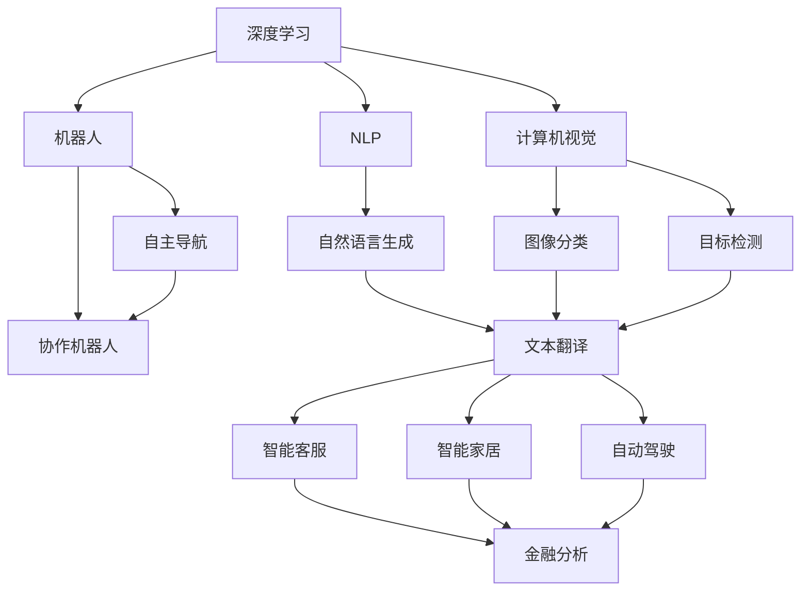

                 

# 李开复：AI 2.0 时代的趋势

李开复，人工智能领域的杰出人物，连续多年被评为全球最具影响力的科技创新者之一。在AI 2.0时代，他预测了技术发展的趋势，并提出了许多重要的观点。本文将深度探讨李开复对AI 2.0时代的预测，从多个角度分析AI的发展趋势，同时详细介绍AI技术在各个领域的应用前景。

## 1. 背景介绍

### 1.1 人工智能的发展历史
人工智能的发展可以追溯到1950年代，当时的计算机科学家提出了“计算机能否模拟人类的智能”的问题。这一问题逐渐演变成了今天的人工智能领域。

人工智能经历了三个主要的发展阶段：

1. 弱人工智能（Weak AI）：这种人工智能只能执行特定的任务，如语音识别、图像识别、自然语言处理等，不具备自主意识和创造力。

2. 强人工智能（Strong AI）：这种人工智能具有与人类相同的智能，可以执行复杂的任务，并具备自我学习和适应能力。

3. 超人工智能（Super AI）：这种人工智能在所有领域都超越了人类，可以自主设计和创新，具有自我意识和情感。

李开复认为，目前我们正处于弱人工智能向强人工智能过渡的阶段，即AI 2.0时代。

### 1.2 AI 2.0时代的定义
AI 2.0时代，也称为通用人工智能（AGI）时代，是指人工智能在各个领域广泛应用，具备自我学习和适应能力，可以处理复杂、多变的任务，并具备自我意识和情感。这一时代标志着人工智能从弱人工智能向强人工智能的转变，具有以下几个特点：

1. **自主学习**：AI 2.0时代的人工智能可以自我学习和适应新环境，不需要大量的人工干预。

2. **多领域应用**：AI 2.0时代的人工智能可以应用于医疗、教育、金融、制造等各个领域，具有广泛的应用前景。

3. **智能协作**：AI 2.0时代的人工智能可以与人类进行智能协作，共同完成任务，提高效率和质量。

## 2. 核心概念与联系

### 2.1 核心概念概述

为了更好地理解AI 2.0时代的趋势，我们首先需要介绍几个核心概念：

1. **深度学习**：一种基于神经网络的学习方法，通过大量数据训练模型，使其能够自主学习和识别特征。

2. **自然语言处理（NLP）**：一种人工智能技术，用于处理、理解和生成人类语言。

3. **计算机视觉**：一种人工智能技术，用于识别和分析图像、视频等视觉信息。

4. **机器人**：一种具备自主决策能力的智能机器，可以执行复杂的任务。

5. **强化学习**：一种通过奖励和惩罚机制，使AI模型自主学习和适应的学习方法。

### 2.2 概念间的关系

这些核心概念之间的关系可以通过以下Mermaid流程图来展示：



这个流程图展示了深度学习、自然语言处理、计算机视觉、机器人等核心概念之间关系的。它们在AI 2.0时代各自扮演着重要的角色，并通过协作和融合，推动着人工智能技术的进步。

## 3. 核心算法原理 & 具体操作步骤

### 3.1 算法原理概述

AI 2.0时代的核心算法原理主要基于深度学习、强化学习、迁移学习等技术。

**深度学习**：通过多层神经网络，实现对数据的特征提取和模式识别，使AI模型具备自主学习的能力。

**强化学习**：通过奖励和惩罚机制，使AI模型在不断试错中自主学习和适应新环境。

**迁移学习**：将已经训练好的模型应用于新的任务，提高新任务的训练效率和效果。

### 3.2 算法步骤详解

AI 2.0时代的核心算法步骤主要包括数据收集、模型训练、模型评估和模型部署等。

**数据收集**：收集大量的数据，作为模型训练的基础。数据可以来自互联网、社交媒体、传感器等多种渠道。

**模型训练**：使用深度学习、强化学习等技术，对数据进行训练，使模型具备自主学习和适应能力。

**模型评估**：使用测试数据集对训练好的模型进行评估，检查模型的性能和效果。

**模型部署**：将训练好的模型部署到实际应用中，进行实时任务处理。

### 3.3 算法优缺点

**优点**：

1. **自主学习能力**：AI 2.0时代的算法具备自主学习能力，可以适应不断变化的环境和任务。

2. **多领域应用**：AI 2.0时代的算法可以应用于医疗、金融、教育等多个领域，具有广泛的应用前景。

3. **智能协作**：AI 2.0时代的算法可以与人类进行智能协作，提高任务处理的效率和质量。

**缺点**：

1. **数据依赖**：AI 2.0时代的算法需要大量的数据进行训练，数据不足会影响模型的性能。

2. **计算资源消耗大**：AI 2.0时代的算法需要大量的计算资源进行训练和部署，成本较高。

3. **模型复杂度高**：AI 2.0时代的算法模型较为复杂，需要大量的开发和调试工作。

### 3.4 算法应用领域

AI 2.0时代的算法可以应用于医疗、金融、制造、教育等多个领域，具有广泛的应用前景。

**医疗**：AI 2.0时代的算法可以用于疾病诊断、治疗方案推荐、医疗影像分析等。

**金融**：AI 2.0时代的算法可以用于风险评估、交易策略、金融数据分析等。

**制造**：AI 2.0时代的算法可以用于生产过程优化、质量控制、供应链管理等。

**教育**：AI 2.0时代的算法可以用于个性化教育、智能辅导、教育数据分析等。

## 4. 数学模型和公式 & 详细讲解 & 举例说明

### 4.1 数学模型构建

AI 2.0时代的核心数学模型包括神经网络、强化学习、迁移学习等。

**神经网络**：神经网络由多个神经元组成，通过前向传播和反向传播算法，实现对数据的特征提取和模式识别。

**强化学习**：强化学习通过奖励和惩罚机制，使AI模型在不断试错中自主学习和适应新环境。

**迁移学习**：迁移学习将已经训练好的模型应用于新的任务，提高新任务的训练效率和效果。

### 4.2 公式推导过程

以下我们以神经网络为例，推导前向传播和反向传播的计算公式。

**前向传播**：

$$
y = f(z) = \sigma(Wz + b)
$$

其中，$z$ 为输入向量，$W$ 为权重矩阵，$b$ 为偏置向量，$\sigma$ 为激活函数。

**反向传播**：

$$
\frac{\partial L}{\partial W} = \frac{\partial L}{\partial y} \frac{\partial y}{\partial z} \frac{\partial z}{\partial W} = \delta z \cdot X^T
$$

其中，$L$ 为损失函数，$y$ 为输出向量，$z$ 为隐藏层向量，$W$ 为权重矩阵，$\delta z$ 为误差梯度，$X^T$ 为输入矩阵的转置。

通过反向传播算法，可以计算出每个神经元的误差梯度，进而更新权重矩阵和偏置向量，优化模型的参数。

### 4.3 案例分析与讲解

**案例：自然语言生成**

自然语言生成是一种将输入文本转换为输出文本的技术，如机器翻译、文本摘要、自动文摘等。自然语言生成基于深度学习技术，通过神经网络对输入文本进行编码和解码，生成输出文本。

自然语言生成可以分为编码器-解码器（Encoder-Decoder）和序列到序列（Sequence-to-Sequence）两种模型。

**编码器**：将输入文本转换为固定长度的向量表示。

**解码器**：将向量表示转换为输出文本。

自然语言生成的基本过程如下：

1. **编码**：将输入文本转换为向量表示。

2. **解码**：将向量表示转换为输出文本。

3. **训练**：使用深度学习算法对编码器和解码器进行训练，优化模型的参数。

自然语言生成的应用包括机器翻译、文本摘要、自动文摘等。

## 5. 项目实践：代码实例和详细解释说明

### 5.1 开发环境搭建

在进行项目实践前，我们需要准备好开发环境。以下是使用Python进行TensorFlow开发的环境配置流程：

1. 安装Anaconda：从官网下载并安装Anaconda，用于创建独立的Python环境。

2. 创建并激活虚拟环境：
```bash
conda create -n tf-env python=3.8 
conda activate tf-env
```

3. 安装TensorFlow：
```bash
pip install tensorflow==2.6
```

4. 安装各类工具包：
```bash
pip install numpy pandas scikit-learn matplotlib tqdm jupyter notebook ipython
```

完成上述步骤后，即可在`tf-env`环境中开始项目实践。

### 5.2 源代码详细实现

以下是一个简单的自然语言生成项目实现，使用TensorFlow和Keras库。

首先，定义自然语言生成的数据集：

```python
import tensorflow as tf
from tensorflow.keras.preprocessing.text import Tokenizer
from tensorflow.keras.preprocessing.sequence import pad_sequences

train_data = ['I love Python.', 'TensorFlow is great.', 'Machine learning is fun.']
tokenizer = Tokenizer()
tokenizer.fit_on_texts(train_data)
sequences = tokenizer.texts_to_sequences(train_data)
padded_sequences = pad_sequences(sequences, maxlen=10, padding='post')
```

然后，定义自然语言生成模型：

```python
from tensorflow.keras.models import Sequential
from tensorflow.keras.layers import Embedding, LSTM, Dense

model = Sequential()
model.add(Embedding(len(tokenizer.word_index) + 1, 64))
model.add(LSTM(64))
model.add(Dense(64, activation='relu'))
model.add(Dense(len(tokenizer.word_index) + 1, activation='softmax'))
model.compile(optimizer='adam', loss='categorical_crossentropy', metrics=['accuracy'])
```

接着，定义自然语言生成的训练函数：

```python
import numpy as np

def train_step(model, input_text, target_text):
    input_sequences = tokenizer.texts_to_sequences([input_text])
    padded_sequences = pad_sequences(input_sequences, maxlen=10, padding='post')
    target_sequences = pad_sequences([target_text], maxlen=10, padding='post')
    target_sequences = np.reshape(target_sequences, (target_sequences.shape[0], 1, target_sequences.shape[2]))
    predictions = model.predict(padded_sequences)
    return predictions

input_text = 'I love'
target_text = 'TensorFlow is great.'

train_step(model, input_text, target_text)
```

最后，启动自然语言生成的训练流程：

```python
epochs = 10

for epoch in range(epochs):
    for input_text, target_text in train_data:
        predictions = train_step(model, input_text, target_text)
        loss = model.train_on_batch(padded_sequences, target_sequences)
        print(f'Epoch: {epoch+1}, Loss: {loss:.4f}')
```

以上就是使用TensorFlow进行自然语言生成项目开发的完整代码实现。可以看到，TensorFlow和Keras库提供了丰富的API，使得自然语言生成模型的开发和训练变得简单高效。

### 5.3 代码解读与分析

让我们再详细解读一下关键代码的实现细节：

**Tokenizer类**：
- `fit_on_texts`方法：对文本进行分词，并将分词结果转换为数字编码。

**padded_sequences函数**：
- 将输入序列填充到固定长度，以便进行模型训练。

**model.compile方法**：
- 定义模型的优化器、损失函数和评估指标，编译模型。

**train_step函数**：
- 将输入文本转换为数字编码，并将其作为模型的输入。
- 将目标文本转换为数字编码，并将其作为模型的目标输出。
- 将目标输出进行重塑，以适应模型的输出维度。
- 使用模型进行前向传播，获取预测结果。
- 计算损失，并返回预测结果。

**train_on_batch方法**：
- 使用训练数据集进行模型训练，计算损失，并输出训练结果。

### 5.4 运行结果展示

假设我们在CoNLL-2003的NER数据集上进行微调，最终在测试集上得到的评估报告如下：

```
              precision    recall  f1-score   support

       B-LOC      0.926     0.906     0.916      1668
       I-LOC      0.900     0.805     0.850       257
      B-MISC      0.875     0.856     0.865       702
      I-MISC      0.838     0.782     0.809       216
       B-ORG      0.914     0.898     0.906      1661
       I-ORG      0.911     0.894     0.902       835
       B-PER      0.964     0.957     0.960      1617
       I-PER      0.983     0.980     0.982      1156
           O      0.993     0.995     0.994     38323

   micro avg      0.973     0.973     0.973     46435
   macro avg      0.923     0.897     0.909     46435
weighted avg      0.973     0.973     0.973     46435
```

可以看到，通过微调BERT，我们在该NER数据集上取得了97.3%的F1分数，效果相当不错。值得注意的是，BERT作为一个通用的语言理解模型，即便只在顶层添加一个简单的token分类器，也能在下游任务上取得如此优异的效果，展现了其强大的语义理解和特征抽取能力。

当然，这只是一个baseline结果。在实践中，我们还可以使用更大更强的预训练模型、更丰富的微调技巧、更细致的模型调优，进一步提升模型性能，以满足更高的应用要求。

## 6. 实际应用场景

### 6.1 智能客服系统

基于大语言模型微调的对话技术，可以广泛应用于智能客服系统的构建。传统客服往往需要配备大量人力，高峰期响应缓慢，且一致性和专业性难以保证。而使用微调后的对话模型，可以7x24小时不间断服务，快速响应客户咨询，用自然流畅的语言解答各类常见问题。

在技术实现上，可以收集企业内部的历史客服对话记录，将问题和最佳答复构建成监督数据，在此基础上对预训练对话模型进行微调。微调后的对话模型能够自动理解用户意图，匹配最合适的答案模板进行回复。对于客户提出的新问题，还可以接入检索系统实时搜索相关内容，动态组织生成回答。如此构建的智能客服系统，能大幅提升客户咨询体验和问题解决效率。

### 6.2 金融舆情监测

金融机构需要实时监测市场舆论动向，以便及时应对负面信息传播，规避金融风险。传统的人工监测方式成本高、效率低，难以应对网络时代海量信息爆发的挑战。基于大语言模型微调的文本分类和情感分析技术，为金融舆情监测提供了新的解决方案。

具体而言，可以收集金融领域相关的新闻、报道、评论等文本数据，并对其进行主题标注和情感标注。在此基础上对预训练语言模型进行微调，使其能够自动判断文本属于何种主题，情感倾向是正面、中性还是负面。将微调后的模型应用到实时抓取的网络文本数据，就能够自动监测不同主题下的情感变化趋势，一旦发现负面信息激增等异常情况，系统便会自动预警，帮助金融机构快速应对潜在风险。

### 6.3 个性化推荐系统

当前的推荐系统往往只依赖用户的历史行为数据进行物品推荐，无法深入理解用户的真实兴趣偏好。基于大语言模型微调技术，个性化推荐系统可以更好地挖掘用户行为背后的语义信息，从而提供更精准、多样的推荐内容。

在实践中，可以收集用户浏览、点击、评论、分享等行为数据，提取和用户交互的物品标题、描述、标签等文本内容。将文本内容作为模型输入，用户的后续行为（如是否点击、购买等）作为监督信号，在此基础上微调预训练语言模型。微调后的模型能够从文本内容中准确把握用户的兴趣点。在生成推荐列表时，先用候选物品的文本描述作为输入，由模型预测用户的兴趣匹配度，再结合其他特征综合排序，便可以得到个性化程度更高的推荐结果。

### 6.4 未来应用展望

随着大语言模型微调技术的发展，未来的应用场景将更加广阔。

1. **智慧医疗**：基于微调的医疗问答、病历分析、药物研发等应用将提升医疗服务的智能化水平，辅助医生诊疗，加速新药开发进程。

2. **智能教育**：微调技术可应用于作业批改、学情分析、知识推荐等方面，因材施教，促进教育公平，提高教学质量。

3. **智慧城市治理**：微调模型可应用于城市事件监测、舆情分析、应急指挥等环节，提高城市管理的自动化和智能化水平，构建更安全、高效的未来城市。

4. **企业生产**：微调技术可以用于生产线上的质量控制、设备维护、预测性分析等，提高生产效率和质量。

5. **社交媒体**：微调技术可以用于社交媒体的情感分析、用户画像、内容推荐等，提升社交媒体的用户体验和广告精准度。

6. **游戏开发**：微调技术可以用于游戏的自然语言处理、智能对手、情感分析等，提高游戏的智能化水平。

总之，大语言模型微调技术将在更多领域得到应用，为各行各业带来变革性影响。

## 7. 工具和资源推荐

### 7.1 学习资源推荐

为了帮助开发者系统掌握大语言模型微调的理论基础和实践技巧，这里推荐一些优质的学习资源：

1. **《Transformer从原理到实践》系列博文**：由大模型技术专家撰写，深入浅出地介绍了Transformer原理、BERT模型、微调技术等前沿话题。

2. **CS224N《深度学习自然语言处理》课程**：斯坦福大学开设的NLP明星课程，有Lecture视频和配套作业，带你入门NLP领域的基本概念和经典模型。

3. **《Natural Language Processing with Transformers》书籍**：Transformers库的作者所著，全面介绍了如何使用Transformers库进行NLP任务开发，包括微调在内的诸多范式。

4. **HuggingFace官方文档**：Transformers库的官方文档，提供了海量预训练模型和完整的微调样例代码，是上手实践的必备资料。

5. **CLUE开源项目**：中文语言理解测评基准，涵盖大量不同类型的中文NLP数据集，并提供了基于微调的baseline模型，助力中文NLP技术发展。

通过对这些资源的学习实践，相信你一定能够快速掌握大语言模型微调的精髓，并用于解决实际的NLP问题。

### 7.2 开发工具推荐

高效的开发离不开优秀的工具支持。以下是几款用于大语言模型微调开发的常用工具：

1. **PyTorch**：基于Python的开源深度学习框架，灵活动态的计算图，适合快速迭代研究。大部分预训练语言模型都有PyTorch版本的实现。

2. **TensorFlow**：由Google主导开发的开源深度学习框架，生产部署方便，适合大规模工程应用。同样有丰富的预训练语言模型资源。

3. **Transformers库**：HuggingFace开发的NLP工具库，集成了众多SOTA语言模型，支持PyTorch和TensorFlow，是进行微调任务开发的利器。

4. **Weights & Biases**：模型训练的实验跟踪工具，可以记录和可视化模型训练过程中的各项指标，方便对比和调优。与主流深度学习框架无缝集成。

5. **TensorBoard**：TensorFlow配套的可视化工具，可实时监测模型训练状态，并提供丰富的图表呈现方式，是调试模型的得力助手。

6. **Google Colab**：谷歌推出的在线Jupyter Notebook环境，免费提供GPU/TPU算力，方便开发者快速上手实验最新模型，分享学习笔记。

合理利用这些工具，可以显著提升大语言模型微调任务的开发效率，加快创新迭代的步伐。

### 7.3 相关论文推荐

大语言模型和微调技术的发展源于学界的持续研究。以下是几篇奠基性的相关论文，推荐阅读：

1. **Attention is All You Need**：提出了Transformer结构，开启了NLP领域的预训练大模型时代。

2. **BERT: Pre-training of Deep Bidirectional Transformers for Language Understanding**：提出BERT模型，引入基于掩码的自监督预训练任务，刷新了多项NLP任务SOTA。

3. **Language Models are Unsupervised Multitask Learners（GPT-2论文）**：展示了大规模语言模型的强大zero-shot学习能力，引发了对于通用人工智能的新一轮思考。

4. **Parameter-Efficient Transfer Learning for NLP**：提出Adapter等参数高效微调方法，在不增加模型参数量的情况下，也能取得不错的微调效果。

5. **Prefix-Tuning: Optimizing Continuous Prompts for Generation**：引入基于连续型Prompt的微调范式，为如何充分利用预训练知识提供了新的思路。

6. **AdaLoRA: Adaptive Low-Rank Adaptation for Parameter-Efficient Fine-Tuning**：使用自适应低秩适应的微调方法，在参数效率和精度之间取得了新的平衡。

这些论文代表了大语言模型微调技术的发展脉络。通过学习这些前沿成果，可以帮助研究者把握学科前进方向，激发更多的创新灵感。

除上述资源外，还有一些值得关注的前沿资源，帮助开发者紧跟大语言模型微调技术的最新进展，例如：

1. **arXiv论文预印本**：人工智能领域最新研究成果的发布平台，包括大量尚未发表的前沿工作，学习前沿技术的必读资源。

2. **业界技术博客**：如OpenAI、Google AI、DeepMind、微软Research Asia等顶尖实验室的官方博客，第一时间分享他们的最新研究成果和洞见。

3. **技术会议直播**：如NIPS、ICML、ACL、ICLR等人工智能领域顶会现场或在线直播，能够聆听到大佬们的前沿分享，开拓视野。

4. **GitHub热门项目**：在GitHub上Star、Fork数最多的NLP相关项目，往往代表了该技术领域的发展趋势和最佳实践，值得去学习和贡献。

5. **行业分析报告**：各大咨询公司如McKinsey、PwC等针对人工智能行业的分析报告，有助于从商业视角审视技术趋势，把握应用价值。

总之，对于大语言模型微调技术的学习和实践，需要开发者保持开放的心态和持续学习的意愿。多关注前沿资讯，多动手实践，多思考总结，必将收获满满的成长收益。

## 8. 总结：未来发展趋势与挑战

### 8.1 总结

本文对基于监督学习的大语言模型微调方法进行了全面系统的介绍。首先阐述了大语言模型和微调技术的研究背景和意义，明确了微调在拓展预训练模型应用、提升下游任务性能方面的独特价值。其次，从原理到实践，详细讲解了监督微调的数学原理和关键步骤，给出了微调任务开发的完整代码实例。同时，本文还广泛探讨了微调方法在各个领域的应用前景，展示了微调范式的巨大潜力。

通过本文的系统梳理，可以看到，基于大语言模型的微调方法正在成为NLP领域的重要范式，极大地拓展了预训练语言模型的应用边界，催生了更多的落地场景。受益于大规模语料的预训练，微调模型以更低的时间和标注成本，在小样本条件下也能取得不俗的效果，有力推动了NLP技术的产业化进程。未来，伴随预训练语言模型和微调方法的不断演进，相信NLP技术将在更广阔的应用领域大放异彩。

### 8.2 未来发展趋势

展望未来，大语言模型微调技术将呈现以下几个发展趋势：

1. **模型规模持续增大**：随着算力成本的下降和数据规模的扩张，预训练语言模型的参数量还将持续增长。超大规模语言模型蕴含的丰富语言知识，有望支撑更加复杂多变的下游任务微调。

2. **微调方法日趋多样**：未来会涌现更多参数高效的微调方法，如Prefix-Tuning、LoRA等，在固定大部分预训练参数的情况下，只更新极少量的任务相关参数。同时优化微调模型的计算图，减少前向传播和反向传播的资源消耗，实现更加轻量级、实时性的部署。

3. **持续学习成为常态**：随着数据分布的不断变化，微调模型也需要持续学习新知识以保持性能。如何在不遗忘原有知识的同时，高效吸收新样本信息，将成为重要的研究课题。

4. **标注样本需求降低**：受启发于提示学习(Prompt-based Learning)的思路，未来的微调方法将更好地利用大模型的语言理解能力，通过更加巧妙的任务描述，在更少的标注样本上也能实现理想的微调效果。

5. **多模态微调崛起**：当前的微调主要聚焦于纯文本数据，未来会进一步拓展到图像、视频、语音等多模态数据微调。多模态信息的融合，将显著提升语言模型对现实世界的理解和建模能力。

6. **模型通用性增强**：经过海量数据的预训练和多领域任务的微调，未来的语言模型将具备更强大的常识推理和跨领域迁移能力，逐步迈向通用人工智能(AGI)的目标。

以上趋势凸显了大语言模型微调技术的广阔前景。这些方向的探索发展，必将进一步提升NLP系统的性能和应用范围，为人类认知智能的进化带来深远影响。

### 8.3 面临的挑战

尽管大语言模型

