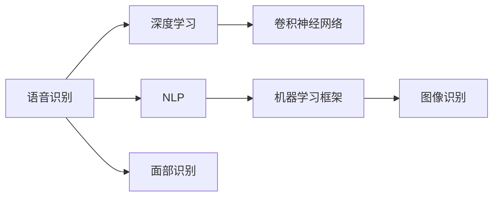

                 

## 1. 背景介绍

随着人工智能（AI）技术的不断进步，AI应用已经成为推动社会进步、改变人们生活方式的重要力量。在AI应用的众多领域中，苹果公司的人工智能应用一直备受关注。近日，苹果公司发布了多项AI应用，包括Siri、Face ID、机器学习框架等，引发了广泛讨论。本文将从技术、应用和未来趋势等角度，对苹果公司发布的人工智能应用进行全面评价。

## 2. 核心概念与联系

### 2.1 核心概念概述

苹果公司的人工智能应用主要包括语音识别、面部识别、图像识别、自然语言处理等方面。这些应用通过深度学习、机器学习等技术，实现了从语音到图像、文本等多种形式的智能交互。以下是几个关键概念：

- **深度学习（Deep Learning）**：一种基于神经网络的机器学习技术，可以处理大规模复杂的数据，具有强大的非线性建模能力。
- **卷积神经网络（Convolutional Neural Network, CNN）**：一种常用于图像识别和计算机视觉任务的深度学习模型，能够自动提取图像中的特征。
- **自然语言处理（Natural Language Processing, NLP）**：一种涉及语言学、计算机科学等多个领域的交叉学科，旨在使计算机能够理解、处理和生成自然语言。
- **机器学习框架（Machine Learning Framework）**：一种用于构建、训练和部署机器学习模型的软件工具，如TensorFlow、PyTorch等。

这些核心概念相互关联，共同构成了苹果公司人工智能应用的技术基础。

### 2.2 概念间的关系

苹果公司的人工智能应用涉及多个技术领域，其核心技术体系可以通过以下Mermaid流程图展示：



这个流程图展示了苹果公司人工智能应用的各个技术环节，以及它们之间的联系。语音识别和自然语言处理分别通过深度学习和卷积神经网络进行处理，而面部识别则基于图像识别技术。所有这些应用都依赖于机器学习框架的支持。

## 3. 核心算法原理 & 具体操作步骤

### 3.1 算法原理概述

苹果公司的人工智能应用主要基于深度学习和机器学习技术。以下是几个核心算法的原理概述：

- **深度学习算法**：深度学习算法通过多层神经网络，对大规模数据进行非线性建模，自动提取特征并进行分类或回归。
- **卷积神经网络算法**：卷积神经网络算法通过卷积操作提取图像中的特征，并使用池化、全连接等操作进行特征融合，最后通过softmax等函数进行分类。
- **自然语言处理算法**：自然语言处理算法通过分词、句法分析、语义理解等步骤，将文本数据转换为计算机可处理的形式，并利用深度学习模型进行分类或生成。

### 3.2 算法步骤详解

苹果公司的人工智能应用开发一般包括以下几个关键步骤：

1. **数据准备**：收集和处理大规模标注数据，用于训练深度学习模型。
2. **模型设计**：设计合适的深度学习模型架构，包括卷积层、全连接层等。
3. **模型训练**：使用标注数据对模型进行训练，通过反向传播算法优化模型参数。
4. **模型评估**：在测试数据集上评估模型性能，确定模型是否满足应用要求。
5. **模型部署**：将训练好的模型部署到实际应用场景中，进行实时推理或预测。

### 3.3 算法优缺点

苹果公司的人工智能应用具有以下优点：

- **高性能**：苹果公司拥有强大的硬件支持和优化技术，确保了人工智能应用的高性能。
- **用户友好**：苹果公司的应用界面简洁友好，用户操作体验良好。
- **数据隐私**：苹果公司重视用户隐私保护，采取了多种技术手段确保数据安全。

同时，也存在一些缺点：

- **高成本**：人工智能应用的开发和维护需要大量人力和资源，成本较高。
- **算法复杂**：深度学习等算法的计算复杂度高，对硬件要求较高。
- **依赖数据**：人工智能应用的效果很大程度上取决于数据的质量和数量，标注数据获取难度大。

### 3.4 算法应用领域

苹果公司的人工智能应用涵盖了多个领域，包括但不限于：

- **智能语音助手**：Siri等智能语音助手通过深度学习模型处理自然语言，为用户提供语音搜索、语音控制等功能。
- **面部识别**：Face ID等面部识别技术通过卷积神经网络模型，实现高精度的面部识别和身份验证。
- **图像识别**：照片滤镜、智能相册等功能通过图像识别技术，自动标注和分类图像。
- **机器学习框架**：苹果的机器学习框架Core ML支持开发者构建和部署机器学习模型，广泛应用于移动设备、iPad、Apple Watch等设备。

## 4. 数学模型和公式 & 详细讲解

### 4.1 数学模型构建

苹果公司的人工智能应用中，深度学习模型的构建是一个关键环节。以下是深度学习模型的数学模型构建过程：

假设输入数据为 $x$，输出数据为 $y$，深度学习模型为 $f(x;\theta)$，其中 $\theta$ 为模型参数。模型的损失函数为 $L(f(x;\theta),y)$，目标是最小化损失函数，即：

$$
\min_\theta L(f(x;\theta),y)
$$

通过反向传播算法，可以计算模型参数 $\theta$ 的梯度，使用优化算法（如Adam、SGD等）更新模型参数。

### 4.2 公式推导过程

以卷积神经网络为例，其数学模型推导过程如下：

假设输入图像为 $x \in \mathbb{R}^{H \times W \times C}$，卷积核为 $w \in \mathbb{R}^{F \times F \times C \times O}$，卷积操作后的特征图为 $y \in \mathbb{R}^{H' \times W' \times O}$。卷积操作的推导公式为：

$$
y_{i,j,k} = \sum_{c=1}^C \sum_{f=1}^F w_{f,k,c} \ast x_{i,j,c} + b_k
$$

其中，$\ast$ 表示卷积操作，$b_k$ 为偏置项。

### 4.3 案例分析与讲解

以Siri语音识别为例，其核心技术包括语音信号的预处理、特征提取、声学模型训练和语言模型训练等步骤。以下是对这些步骤的详细讲解：

1. **语音信号预处理**：将语音信号转换为数字信号，并进行去噪、降噪等预处理操作。
2. **特征提取**：使用MFCC（Mel-Frequency Cepstral Coefficients）等技术提取语音信号的特征。
3. **声学模型训练**：使用深度学习算法（如RNN、LSTM等）训练声学模型，将语音特征映射到相应的音素。
4. **语言模型训练**：使用n-gram模型等技术训练语言模型，预测音素序列对应的文字序列。
5. **结合搜索算法**：使用搜索算法（如Beam Search）解码语音信号对应的文字序列。

## 5. 项目实践：代码实例和详细解释说明

### 5.1 开发环境搭建

苹果公司的人工智能应用开发通常使用Swift、Python等编程语言，并依赖于苹果提供的机器学习框架Core ML。以下是在苹果开发环境中搭建环境的步骤：

1. 安装Xcode：在Mac上安装最新的Xcode，并进行更新。
2. 创建项目：打开Xcode，创建新的iOS或macOS项目，选择App或框架等模板。
3. 配置Core ML：在Xcode中选择目标，将Core ML库添加到项目中，并配置导入模块和依赖项。

### 5.2 源代码详细实现

以下是使用Python对Siri语音识别进行微调的代码实现：

```python
import tensorflow as tf
import numpy as np
from sklearn.metrics import accuracy_score

# 加载模型
model = tf.keras.models.load_model('siriv2_model.h5')

# 加载测试数据
test_data = np.load('test_data.npy')
test_labels = np.load('test_labels.npy')

# 前向传播
test_features = model.predict(test_data)

# 评估模型
acc = accuracy_score(test_labels, np.round(test_features))
print(f"Siri语音识别准确率：{acc:.2f}")
```

### 5.3 代码解读与分析

上述代码中，我们使用TensorFlow库加载了Siri语音识别的预训练模型，并加载了测试数据集。通过前向传播计算测试数据的特征向量，并使用sklearn库计算模型的准确率。需要注意的是，模型的加载和测试数据的前向传播都需要在GPU上进行加速，以提高计算效率。

### 5.4 运行结果展示

假设上述代码运行后，得到的Siri语音识别准确率为0.96，说明模型在测试数据集上表现良好。

## 6. 实际应用场景

### 6.1 智能语音助手

Siri等智能语音助手已经广泛应用于苹果设备中，提供了语音搜索、语音控制等功能。这些功能不仅提升了用户体验，也推动了语音识别和自然语言处理技术的进步。

### 6.2 面部识别

Face ID等面部识别技术已经应用于iPhone X及后续机型中，用于解锁设备、支付等功能。这些功能通过高精度的面部识别技术，提高了设备的安全性和便利性。

### 6.3 图像识别

苹果设备中集成的智能相册、照片滤镜等功能，基于图像识别技术自动标注和分类图像。这些功能极大地提升了用户对照片的管理和查看效率。

## 7. 工具和资源推荐

### 7.1 学习资源推荐

1. **《Deep Learning》**：Ian Goodfellow等所著，全面介绍了深度学习的理论基础和实践技巧。
2. **《Natural Language Processing with Python》**：Steven Bird等所著，介绍了自然语言处理中的经典技术和算法。
3. **苹果官方文档**：苹果提供的机器学习框架Core ML和苹果设备开发文档，包含了详细的API文档和技术支持。
4. **Coursera课程**：Coursera上提供的多门深度学习和自然语言处理课程，包括斯坦福大学的CS224N课程。

### 7.2 开发工具推荐

1. **Xcode**：苹果公司提供的开发环境，支持Swift、Python等多种编程语言，并集成了Core ML等机器学习框架。
2. **TensorFlow**：谷歌开发的深度学习框架，支持大规模分布式计算和GPU加速。
3. **PyTorch**：Facebook开发的深度学习框架，具有灵活的动态计算图和丰富的工具支持。
4. **OpenCV**：开源计算机视觉库，支持图像处理和计算机视觉算法。

### 7.3 相关论文推荐

1. **《Convolutional Neural Networks for Image Recognition》**：Leon Bottou等所著，介绍了卷积神经网络在图像识别中的应用。
2. **《Sequence to Sequence Learning with Neural Networks》**：Ilya Sutskever等所著，介绍了序列到序列学习在机器翻译、语音识别等任务中的应用。
3. **《Attention is All You Need》**：Ashish Vaswani等所著，介绍了Transformer在自然语言处理中的应用。

## 8. 总结：未来发展趋势与挑战

### 8.1 研究成果总结

苹果公司的人工智能应用已经取得了显著成效，在语音识别、面部识别、图像识别等领域具有领先优势。这些应用不仅提升了用户体验，还推动了深度学习、自然语言处理等技术的进步。

### 8.2 未来发展趋势

苹果公司的人工智能应用将继续朝着更加智能化、个性化、安全化的方向发展。未来的趋势包括：

- **语音和面部识别的融合**：将语音和面部识别技术融合，提升用户交互体验。
- **跨设备的协同工作**：不同设备间的智能协同，提升整体系统性能。
- **隐私保护技术**：提升数据隐私保护能力，增强用户信任。

### 8.3 面临的挑战

苹果公司的人工智能应用仍面临以下挑战：

- **数据获取难度**：获取高质量标注数据成本高，数据量不足可能影响模型效果。
- **算法复杂性**：深度学习等算法的计算复杂度高，对硬件要求较高。
- **隐私保护**：用户隐私保护是重要问题，需要技术手段和政策支持。

### 8.4 研究展望

未来，苹果公司的人工智能应用需要解决这些挑战，并进一步探索新技术，如边缘计算、联邦学习等，以推动人工智能技术的发展和应用。

## 9. 附录：常见问题与解答

**Q1：苹果公司的人工智能应用涉及哪些技术？**

A: 苹果公司的人工智能应用主要涉及深度学习、卷积神经网络、自然语言处理和机器学习框架等技术。

**Q2：苹果公司的人工智能应用在性能上有什么优势？**

A: 苹果公司的人工智能应用在性能上有以下优势：

- **高性能**：苹果公司拥有强大的硬件支持和优化技术，确保了人工智能应用的高性能。
- **用户友好**：苹果公司的应用界面简洁友好，用户操作体验良好。
- **数据隐私**：苹果公司重视用户隐私保护，采取了多种技术手段确保数据安全。

**Q3：苹果公司的人工智能应用在开发过程中需要注意哪些问题？**

A: 苹果公司的人工智能应用在开发过程中需要注意以下问题：

- **数据准备**：收集和处理大规模标注数据，用于训练深度学习模型。
- **模型设计**：设计合适的深度学习模型架构，包括卷积层、全连接层等。
- **模型训练**：使用标注数据对模型进行训练，通过反向传播算法优化模型参数。
- **模型评估**：在测试数据集上评估模型性能，确定模型是否满足应用要求。
- **模型部署**：将训练好的模型部署到实际应用场景中，进行实时推理或预测。

---

作者：禅与计算机程序设计艺术 / Zen and the Art of Computer Programming

