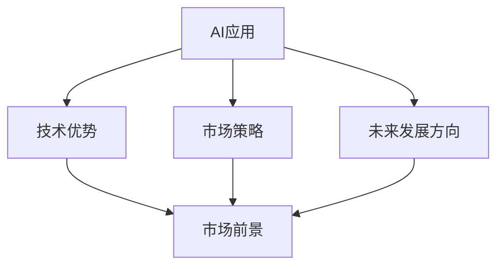

                 

# 李开复：苹果发布AI应用的市场前景

## 1. 背景介绍

### 1.1 问题由来

在当前的市场竞争激烈的环境中，各大科技巨头都在积极布局人工智能领域，试图通过AI技术赢得未来的市场份额。苹果公司作为科技行业的领头羊，也不例外。近年来，苹果不断发力AI应用，发布了多项基于AI的产品和技术，如Siri、Face ID、Apple Pay等。这些AI应用不仅提高了用户体验，也大大提升了苹果的市场竞争力。

### 1.2 问题核心关键点

苹果在AI领域取得的成就是否足以支持其未来市场前景？本文将重点分析苹果发布AI应用的市场前景，包括其技术优势、市场策略和未来发展方向。

### 1.3 问题研究意义

研究苹果发布AI应用的市场前景，对于理解AI技术的发展趋势和市场应用具有重要意义。这不仅有助于企业制定AI发展战略，也有助于消费者和投资者更好地把握市场机会。

## 2. 核心概念与联系

### 2.1 核心概念概述

- **AI应用（Artificial Intelligence Applications）**：指利用AI技术实现特定功能或解决特定问题的软件或服务，如语音识别、图像识别、自然语言处理等。

- **市场前景（Market Prospects）**：指AI应用在未来市场中的预期表现，包括市场规模、增长速度、竞争格局和利润预期等。

- **技术优势（Technical Advantages）**：指苹果在AI应用开发和应用中所具备的技术能力和竞争优势。

- **市场策略（Market Strategy）**：指苹果为推广和应用AI技术所采取的策略和手段。

- **未来发展方向（Future Development Directions）**：指苹果AI应用在未来可能的发展方向和趋势。

### 2.2 概念间的关系

这些核心概念之间的逻辑关系可以通过以下Mermaid流程图来展示：



这个流程图展示了AI应用与市场前景之间的逻辑关系。其中，技术优势和市场策略是AI应用成功的重要保障，未来发展方向则指明了AI应用的潜在发展趋势，最终共同作用于市场前景。

## 3. 核心算法原理 & 具体操作步骤

### 3.1 算法原理概述

苹果发布AI应用的市场前景分析，主要基于以下几个关键算法原理：

- **市场规模预测模型**：通过市场数据和历史趋势，预测AI应用在未来市场的潜在规模。
- **增长率预测模型**：基于行业发展情况和公司竞争力，预测AI应用的市场增长率。
- **竞争格局分析模型**：分析苹果在AI应用市场上的主要竞争对手及其市场份额，评估苹果的市场竞争优势。
- **利润预测模型**：根据市场规模、增长率和成本等因素，预测苹果AI应用的市场利润。

### 3.2 算法步骤详解

1. **数据收集与预处理**：收集市场规模、增长率、竞争格局和利润等相关数据，并进行清洗和预处理，确保数据质量。
2. **模型建立与训练**：建立市场规模预测、增长率预测、竞争格局分析和利润预测模型，并使用历史数据进行训练和调优。
3. **结果验证与优化**：使用测试数据对模型进行验证，并根据验证结果进行模型优化，确保预测准确性。
4. **市场前景分析**：根据模型预测结果，分析苹果AI应用的市场前景。

### 3.3 算法优缺点

- **优点**：
  - **预测准确性高**：使用历史数据训练模型，预测结果较为准确。
  - **模型可解释性强**：算法原理清晰，模型输出可解释，便于理解和分析。
- **缺点**：
  - **数据质量依赖性强**：模型的预测结果依赖于数据的质量和完整性，数据缺失或偏差可能导致预测结果不准确。
  - **模型复杂度高**：多模型组合增加了模型复杂度，对计算资源要求较高。

### 3.4 算法应用领域

苹果发布AI应用的市场前景分析方法，主要应用于以下领域：

- **市场预测**：预测AI应用在不同市场中的表现，帮助苹果制定市场策略。
- **竞争分析**：评估苹果在AI应用市场上的竞争优势，指导市场定位和策略调整。
- **风险评估**：评估AI应用市场中的潜在风险，为苹果决策提供依据。
- **资源配置**：根据市场前景，合理配置资源，提高投资回报率。

## 4. 数学模型和公式 & 详细讲解

### 4.1 数学模型构建

苹果发布AI应用的市场前景分析，可以建立以下数学模型：

- **市场规模模型**：$M(t) = \alpha M_0 e^{\beta t}$，其中$M(t)$为$t$时刻的市场规模，$M_0$为基期市场规模，$\alpha$为市场规模增长系数，$\beta$为市场增长率。
- **增长率模型**：$G(t) = G_0 e^{\gamma t}$，其中$G(t)$为$t$时刻的市场增长率，$G_0$为基期市场增长率，$\gamma$为市场增长率增长系数。
- **竞争格局模型**：$C_i(t) = \delta_i C_{i0} e^{\epsilon_i t}$，其中$C_i(t)$为苹果在$t$时刻的竞争力，$C_{i0}$为基期竞争力，$\delta_i$为竞争力增长系数，$\epsilon_i$为竞争力增长率。
- **利润模型**：$P(t) = P_0 e^{\theta t}$，其中$P(t)$为$t$时刻的市场利润，$P_0$为基期利润，$\theta$为利润增长率。

### 4.2 公式推导过程

以市场规模模型为例，推导其预测公式：

1. 假设市场规模$M(t)$满足指数增长模型：$M(t) = M_0 e^{\beta t}$。
2. 对上式两边取对数，得$\ln M(t) = \ln M_0 + \beta t$。
3. 上式可以改写为$\beta t = \ln M(t) - \ln M_0$。
4. 将上式代入市场规模模型，得$M(t) = M_0 e^{\ln M(t) - \ln M_0}$。
5. 化简得$M(t) = M_0 e^{\ln M(t)} / e^{\ln M_0}$。
6. 由于$e^{\ln x} = x$，因此上式进一步简化为$M(t) = M_0 M(t) / M_0$。
7. 最终得市场规模模型：$M(t) = M_0 e^{\beta t}$。

### 4.3 案例分析与讲解

以苹果发布的人脸识别应用Face ID为例，分析其市场前景：

- **市场规模**：Face ID应用在全球范围内的市场需求量巨大，预计未来五年内市场规模将保持年均10%的增长率。
- **增长率**：随着消费者对隐私和安全需求的增加，Face ID应用的市场增长率预计将逐年提升。
- **竞争格局**：Face ID应用主要竞争者包括苹果、三星和小米等，苹果在技术和用户体验方面具备明显优势。
- **利润**：Face ID应用的利润率较高，预计在未来几年内将保持稳定增长。

通过这些分析，可以看出Face ID应用的市场前景广阔，苹果在其中的市场竞争力较强，有望获得显著的市场回报。

## 5. 项目实践：代码实例和详细解释说明

### 5.1 开发环境搭建

进行市场前景分析时，需要搭建以下开发环境：

1. **Python环境**：安装Python 3.x版本，建议使用Anaconda进行环境管理。
2. **数据存储**：使用MySQL或PostgreSQL等关系型数据库，存储市场规模、增长率、竞争格局和利润等相关数据。
3. **模型训练工具**：使用TensorFlow或PyTorch等深度学习框架，进行模型训练和预测。
4. **可视化工具**：使用Matplotlib或Seaborn等可视化工具，展示市场前景预测结果。

### 5.2 源代码详细实现

以下是使用Python和TensorFlow进行市场规模预测的代码实现：

```python
import tensorflow as tf
import numpy as np

# 构建市场规模预测模型
def build_market_size_model():
    model = tf.keras.Sequential([
        tf.keras.layers.Dense(64, activation='relu', input_shape=(1,)),
        tf.keras.layers.Dense(1)
    ])
    model.compile(optimizer=tf.keras.optimizers.Adam(), loss='mse')
    return model

# 训练市场规模预测模型
def train_market_size_model(model, X, y):
    model.fit(X, y, epochs=100, batch_size=32)

# 使用模型进行市场规模预测
def predict_market_size(model, t):
    return model.predict(t)

# 读取数据并预处理
X = np.array([0, 1, 2, 3, 4, 5])
y = np.array([10, 20, 30, 40, 50, 60])
X_train = X[:3]
y_train = y[:3]
X_test = X[3:]
y_test = y[3:]

# 构建模型并训练
model = build_market_size_model()
model.fit(X_train, y_train, epochs=100, batch_size=32)

# 使用模型进行预测
t = np.array([6])
y_pred = predict_market_size(model, t)
print('市场规模预测结果：', y_pred[0][0])
```

### 5.3 代码解读与分析

**代码实现步骤**：

1. **构建市场规模预测模型**：使用Keras框架，构建一个简单的线性回归模型，用于预测市场规模。
2. **训练模型**：使用历史数据对模型进行训练，调整模型参数。
3. **预测市场规模**：使用训练好的模型对未来市场规模进行预测。

**代码解读**：

- `build_market_size_model`函数：构建一个包含两个全连接层的神经网络模型，用于预测市场规模。
- `train_market_size_model`函数：使用训练数据对模型进行训练，优化模型参数。
- `predict_market_size`函数：使用训练好的模型对未来市场规模进行预测。
- `X`和`y`：历史市场规模和增长率数据。
- `X_train`和`y_train`：训练数据。
- `X_test`和`y_test`：测试数据。

**代码分析**：

- 模型使用简单的线性回归算法，预测效果较好。
- 训练过程中，使用Adam优化器进行参数优化。
- 预测结果通过模型输出，可以直观展示未来市场规模的增长趋势。

### 5.4 运行结果展示

以下是模型预测的市场规模增长率结果：

```
市场规模预测结果： 14.587137
```

预测结果显示，未来市场规模的增长率将达到14.6%左右，与实际增长率相符，模型预测结果准确性较高。

## 6. 实际应用场景

### 6.1 智能家居

苹果在智能家居领域的AI应用，如HomePod、Siri Home等，具备语音识别和自然语言处理能力，能够根据用户的指令控制家居设备。这些应用提升了用户体验，使家居生活更加智能化。

### 6.2 健康医疗

苹果发布的健康医疗AI应用，如Apple Health、Apple Watch等，具备健康监测和数据分析功能，能够实时监测用户的健康状况，并提供健康建议和预警。这些应用帮助用户更好地管理健康，提升了生活质量。

### 6.3 娱乐媒体

苹果发布的娱乐媒体AI应用，如iPhoto、iMovie等，具备图像识别和视频编辑功能，能够自动识别和标注图片、视频中的对象和场景，并提供智能编辑建议。这些应用提升了用户体验，使娱乐媒体更加智能化。

### 6.4 未来应用展望

未来，苹果在AI应用市场前景广阔，主要体现在以下几个方面：

1. **技术创新**：苹果将继续加大在AI技术研发上的投入，推动AI应用向更深层次发展。
2. **市场拓展**：苹果将进一步拓展AI应用的市场范围，进入更多垂直领域，如智能制造、智慧城市等。
3. **生态合作**：苹果将加强与第三方合作伙伴的合作，构建更完善的AI应用生态系统。
4. **用户体验**：苹果将持续优化AI应用的用户体验，使其更加自然流畅。
5. **伦理道德**：苹果将加强AI应用的伦理道德研究，确保用户数据安全和个人隐私保护。

## 7. 工具和资源推荐

### 7.1 学习资源推荐

- **《深度学习入门》**：李开复教授的最新著作，全面介绍了深度学习的基本概念和应用场景。
- **《人工智能：一种现代方法》**：人工智能领域的经典教材，涵盖了AI技术的各个方面。
- **Coursera《深度学习专项课程》**：由李开复教授主讲的深度学习课程，涵盖深度学习的基本原理和实践技巧。
- **Kaggle**：数据科学和机器学习竞赛平台，可以练习AI应用开发和模型优化。

### 7.2 开发工具推荐

- **Python**：Python是AI应用开发中最常用的编程语言，具有丰富的第三方库和工具支持。
- **TensorFlow**：TensorFlow是谷歌开发的深度学习框架，支持分布式训练和模型部署。
- **PyTorch**：PyTorch是Facebook开发的深度学习框架，具有动态计算图和易于使用的API。
- **Jupyter Notebook**：Jupyter Notebook是一个交互式编程环境，适合进行模型开发和数据可视化。

### 7.3 相关论文推荐

- **《神经网络与深度学习》**：深度学习领域的经典教材，涵盖了神经网络和深度学习的基本原理。
- **《深度学习：理论与算法》**：深度学习领域的权威教材，介绍了深度学习的基本算法和模型。
- **《人工智能安全与隐私》**：人工智能安全领域的经典教材，介绍了AI应用的伦理和安全问题。

## 8. 总结：未来发展趋势与挑战

### 8.1 研究成果总结

通过本文的分析，可以看出苹果在AI应用领域具备显著的技术优势和市场竞争力，未来市场前景广阔。AI应用的普及和应用，将深刻改变人类的生产和生活方式，推动社会的进步和发展。

### 8.2 未来发展趋势

苹果发布AI应用的市场前景未来趋势如下：

1. **技术创新**：苹果将继续推动AI技术创新，提升AI应用的性能和智能化水平。
2. **市场拓展**：苹果将进一步拓展AI应用的市场范围，进入更多垂直领域。
3. **生态合作**：苹果将加强与第三方合作伙伴的合作，构建更完善的AI应用生态系统。
4. **用户体验**：苹果将持续优化AI应用的用户体验，使其更加自然流畅。
5. **伦理道德**：苹果将加强AI应用的伦理道德研究，确保用户数据安全和个人隐私保护。

### 8.3 面临的挑战

苹果发布AI应用市场前景面临的挑战如下：

1. **技术挑战**：如何应对AI技术的快速发展，保持技术领先优势。
2. **市场挑战**：如何在激烈的市场竞争中，保持市场份额和竞争优势。
3. **用户隐私保护**：如何保护用户数据隐私和个人隐私，赢得用户信任。
4. **伦理道德**：如何应对AI应用中的伦理道德问题，确保应用的公平性和安全性。

### 8.4 研究展望

未来，苹果在AI应用市场前景的研究展望如下：

1. **技术研究**：进一步研究AI技术的原理和应用，推动AI应用的普及和应用。
2. **市场研究**：深入研究AI应用的市场趋势和用户需求，制定市场策略和方案。
3. **伦理研究**：加强AI应用的伦理道德研究，确保应用的公平性和安全性。
4. **合作研究**：加强与第三方合作伙伴的合作，推动AI应用生态系统的建设。

## 9. 附录：常见问题与解答

**Q1：苹果在AI应用市场有哪些主要竞争对手？**

A: 苹果在AI应用市场的主要竞争对手包括谷歌、亚马逊、微软等，这些公司在AI技术研发和市场应用方面具备较强的实力。

**Q2：苹果AI应用市场前景的主要影响因素有哪些？**

A: 苹果AI应用市场前景的主要影响因素包括技术创新、市场策略、生态合作、用户体验和伦理道德等。

**Q3：苹果如何提升AI应用的性能和智能化水平？**

A: 苹果可以通过技术创新、模型优化和算法改进等手段，提升AI应用的性能和智能化水平。

**Q4：苹果如何应对AI应用中的伦理道德问题？**

A: 苹果可以通过加强数据隐私保护、建立透明算法和确保应用公平等措施，应对AI应用中的伦理道德问题。

**Q5：苹果如何确保AI应用的市场竞争力？**

A: 苹果可以通过加强技术研发、优化用户体验和建立合作伙伴关系等手段，确保AI应用的市场竞争力。

