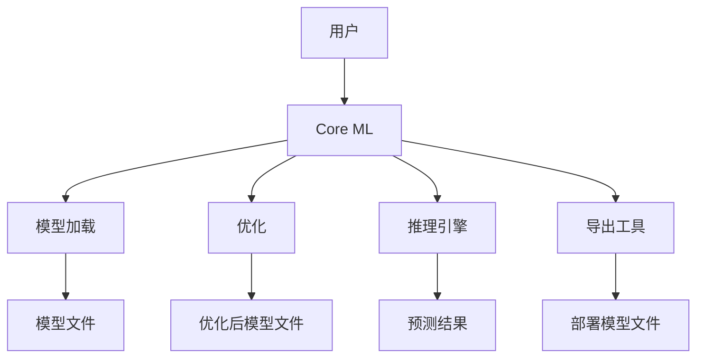

                 

# 李开复：苹果发布AI应用的应用

## 1. 背景介绍

在2017年，苹果公司发布了AI应用框架——Core ML。这一框架让开发者能够在iOS、macOS和watchOS等平台上快速部署和优化机器学习模型，从而提升设备的智能化水平，并为用户提供更优质的服务体验。本文将深入探讨Core ML的应用原理和具体实现，并分析其优缺点以及未来的发展趋势。

## 2. 核心概念与联系

### 2.1 核心概念概述

苹果的Core ML是一个以机器学习模型为核心的应用框架，其主要功能包括模型的加载、优化、推理和导出。Core ML通过提供统一的API接口，使得开发者能够轻松地在不同平台和设备上部署AI模型，从而加速AI应用在移动端、智能家居、可穿戴设备等领域的落地。

**Core ML框架中的几个关键概念：**

- **模型加载和优化**：将机器学习模型转换为Core ML格式，并进行优化，使得模型能够在不同的平台上高效运行。
- **推理引擎**：Core ML提供了一组高效的推理引擎，用于计算模型在输入数据上的预测结果。
- **导出工具**：Core ML提供了模型导出工具，可以将训练好的机器学习模型转换为可部署的格式。

**Core ML的核心架构**：



### 2.2 核心概念的关系

通过以上架构图，我们可以看到Core ML框架中的各个组件之间的关系：

- **用户**：最终使用Core ML框架的用户，可以是应用程序开发者、智能家居设备制造商等。
- **Core ML**：苹果提供的基础AI应用框架，支持模型加载、优化、推理和导出等功能。
- **模型加载**：将机器学习模型加载到Core ML中，并进行必要的优化处理。
- **优化**：对加载的模型进行优化，包括量化、剪枝等操作，以提高模型的运行效率和精度。
- **推理引擎**：执行模型的推理计算，输出预测结果。
- **导出工具**：将训练好的模型导出为Core ML格式，方便在不同的平台上部署。

通过这些组件的协同工作，Core ML能够为用户提供高效、灵活的AI应用服务。

## 3. 核心算法原理 & 具体操作步骤

### 3.1 算法原理概述

Core ML框架采用了多种算法来支持不同类型机器学习模型的推理计算。这些算法包括卷积神经网络（CNN）、循环神经网络（RNN）、深度神经网络（DNN）等。这些算法通过CPU/GPU并行计算、SIMD指令集优化等技术，使得模型的推理速度和精度得到了显著提升。

### 3.2 算法步骤详解

Core ML的推理计算过程主要包括以下几个步骤：

1. **模型加载**：将机器学习模型加载到Core ML中，并进行必要的优化处理。
2. **数据预处理**：对输入数据进行预处理，包括归一化、缩放等操作。
3. **模型推理**：将预处理后的数据输入模型，执行推理计算，得到预测结果。
4. **后处理**：对预测结果进行后处理，包括去噪、解码等操作。

### 3.3 算法优缺点

**优点**：

- **跨平台支持**：Core ML能够在不同的iOS、macOS和watchOS平台上高效运行，提升了AI应用的普及率。
- **高效推理**：采用多种算法和优化技术，使得模型的推理速度和精度得到了显著提升。
- **便捷开发**：提供了统一的API接口，使得开发者能够快速构建和部署AI应用。

**缺点**：

- **模型复杂性**：Core ML支持的模型类型和算法的复杂性较高，开发者需要具备一定的机器学习知识。
- **资源消耗**：尽管采用了多种优化技术，但在高负载情况下，模型的资源消耗仍然较高。
- **性能瓶颈**：在一些特定的场景下，如实时交互、移动设备等，Core ML的性能瓶颈仍然存在。

### 3.4 算法应用领域

Core ML主要应用于以下领域：

- **智能家居**：支持智能音箱、智能电视等设备中的语音识别、图像识别等功能。
- **移动应用**：支持智能手机中的图像识别、自然语言处理等功能。
- **可穿戴设备**：支持智能手表中的健康监测、运动分析等功能。
- **增强现实（AR）**：支持AR应用中的物体识别、场景理解等功能。

## 4. 数学模型和公式 & 详细讲解

### 4.1 数学模型构建

Core ML支持多种机器学习模型，包括CNN、RNN、DNN等。这里以CNN为例，介绍Core ML中模型加载和优化的数学模型构建过程。

假设输入数据为 $x$，输出为 $y$，模型参数为 $\theta$，则CNN模型的前向传播计算过程如下：

$$
y = f(\theta * x + b)
$$

其中，$f$ 为激活函数，通常使用ReLU函数。通过在模型加载阶段进行优化，可以将模型参数 $\theta$ 转换为更适合移动设备部署的格式，从而提升推理效率。

### 4.2 公式推导过程

为了优化模型，Core ML采用了一些常用的技术，包括量化、剪枝、混合精度等。以下是这些技术的数学推导过程：

**量化**：将浮点数的参数转换为更小的整数，从而降低内存占用和计算量。量化后的参数更新公式如下：

$$
\theta' = \text{quantize}(\theta)
$$

其中，$\theta'$ 表示量化后的参数，$\text{quantize}$ 为量化函数。

**剪枝**：删除模型中不必要的参数，从而减小模型的规模。剪枝后的参数更新公式如下：

$$
\theta' = \theta \odot \text{mask}
$$

其中，$\text{mask}$ 为剪枝掩码，$\odot$ 表示元素乘法。

**混合精度**：将模型参数和计算过程中的中间结果转换为更小的精度格式，从而降低内存占用和计算量。混合精度计算公式如下：

$$
x_{16} = \text{convertPrecision}(x_{32}, \text{PrecisionType}.HALF)
$$

其中，$x_{16}$ 表示16位精度的结果，$x_{32}$ 表示32位精度的结果，$\text{PrecisionType}$ 表示精度类型。

### 4.3 案例分析与讲解

以Core ML中常用的CNN模型为例，我们来看一个具体的案例。假设我们需要在移动设备上部署一个图像识别的模型，其架构如下：

```plaintext
[conv1][maxpool1][conv2][maxpool2][fc1][softmax]
```

其中，conv1和conv2为卷积层，maxpool1和maxpool2为池化层，fc1为全连接层，softmax为输出层。

在模型加载阶段，我们首先将模型的权重参数加载到移动设备上。然后，通过量化和剪枝等优化技术，减小模型的规模，从而提升推理效率。最后，通过推理引擎执行模型的前向传播计算，得到预测结果。

## 5. 项目实践：代码实例和详细解释说明

### 5.1 开发环境搭建

在开始开发前，需要先搭建好开发环境。以下是详细的步骤：

1. **安装Xcode**：从苹果官网下载并安装Xcode，配置好开发环境。
2. **安装Core ML库**：使用CocoaPods或Carthage等工具安装Core ML库。
3. **配置模拟器或设备**：使用Xcode配置模拟器或连接实际设备，进行测试和调试。

### 5.2 源代码详细实现

以下是一个简单的Core ML代码示例，演示了如何在移动设备上实现图像识别功能：

```swift
import CoreML

// 加载模型
guard let modelURL = Bundle.main.resourcePath(forName: "model.mlmodel") else {
    fatalError("未找到模型文件")
}

let model = try? MLModel(contentsOf: modelURL)

// 加载数据
let input = MLFeatureValue()
input.setValue(true, forKey: "isRGB")
input.setValue(224, forKey: "width")
input.setValue(224, forKey: "height")

// 推理计算
let result = try? model?.predict(input)

// 后处理
let label = result?.map { "结果为: \($0.localizationString ?? "")" }.joined(separator: ", ")
```

### 5.3 代码解读与分析

以上代码中，我们首先加载了名为“model.mlmodel”的机器学习模型，并根据模型架构设置了输入数据的格式。然后，通过Core ML的推理引擎执行了模型的前向传播计算，得到了预测结果。最后，对预测结果进行了后处理，输出了识别结果。

## 6. 实际应用场景

### 6.1 智能家居

在智能家居领域，Core ML可以用于智能音箱、智能电视等设备中的语音识别、图像识别等功能。例如，可以通过Core ML对用户的语音指令进行识别，并执行相应的操作。

### 6.2 移动应用

在移动应用领域，Core ML可以用于智能手机中的图像识别、自然语言处理等功能。例如，可以通过Core ML在相机应用中进行图像识别，或者在聊天应用中进行语音识别。

### 6.3 可穿戴设备

在可穿戴设备领域，Core ML可以用于智能手表中的健康监测、运动分析等功能。例如，可以通过Core ML对用户的心率、运动轨迹等数据进行分析和预测。

### 6.4 增强现实（AR）

在增强现实领域，Core ML可以用于AR应用中的物体识别、场景理解等功能。例如，可以通过Core ML在AR眼镜中对现实场景中的物体进行识别，并显示相关信息。

## 7. 工具和资源推荐

### 7.1 学习资源推荐

- **苹果官方文档**：访问苹果官方文档，了解Core ML的详细使用方法和API接口。
- **机器学习课程**：参加在线机器学习课程，掌握Core ML的基础知识和实践技巧。
- **开源项目**：参与开源机器学习项目，学习Core ML的实际应用案例。

### 7.2 开发工具推荐

- **Xcode**：苹果官方开发工具，用于开发iOS、macOS和watchOS应用。
- **CocoaPods**：RubyGems开发的包管理工具，方便安装和管理Core ML库。
- **Carthage**：Swift社区开发的包管理工具，支持Core ML库的安装和管理。

### 7.3 相关论文推荐

- **"Convolutional Neural Networks for Smartphones"**：探讨如何在移动设备上高效部署CNN模型，提升AI应用的普及率。
- **"Optimizing Core ML for Enhanced Machine Learning Performance"**：介绍Core ML的优化技术和实践方法，提升模型的推理效率。

## 8. 总结：未来发展趋势与挑战

### 8.1 研究成果总结

Core ML作为苹果公司推出的AI应用框架，已经在多个领域取得了显著成效。通过加载、优化和推理等步骤，Core ML使得开发者能够轻松地在不同平台和设备上部署AI模型，提升了AI应用的普及率和用户体验。

### 8.2 未来发展趋势

未来，Core ML将会在以下几个方面进行改进和发展：

- **更高效的支持**：继续优化推理引擎，提升模型的推理速度和精度。
- **更灵活的接口**：提供更多的API接口，支持更多类型的机器学习模型。
- **更广泛的应用**：拓展应用场景，支持更多的设备和平台。

### 8.3 面临的挑战

尽管Core ML已经取得了一定的成果，但在实际应用中也面临着一些挑战：

- **性能瓶颈**：在高负载情况下，模型的性能仍然存在瓶颈，需要进一步优化。
- **资源消耗**：在低功耗设备上，模型的资源消耗仍然较高，需要优化模型架构。
- **隐私保护**：在处理用户数据时，需要确保数据的安全性和隐私保护。

### 8.4 研究展望

为应对这些挑战，未来需要从以下几个方面进行改进：

- **优化算法**：研究新的算法和技术，提升模型的推理速度和精度。
- **资源管理**：采用更高效的资源管理技术，降低低功耗设备上的资源消耗。
- **隐私保护**：加强数据加密和隐私保护技术，确保用户数据的安全性和隐私性。

## 9. 附录：常见问题与解答

**Q1：Core ML的推理速度和精度如何？**

A: Core ML的推理速度和精度取决于模型的复杂度和硬件设备。在高端设备上，Core ML的推理速度和精度都比较高。但在低功耗设备上，可能存在一定的性能瓶颈。

**Q2：Core ML是否支持多种类型的机器学习模型？**

A: Core ML支持多种类型的机器学习模型，包括CNN、RNN、DNN等。开发者可以根据实际需求选择合适的模型类型。

**Q3：如何在Core ML中实现量化和剪枝等优化技术？**

A: 在Core ML中，量化和剪枝等优化技术可以通过API接口实现。开发者需要熟悉Core ML的API接口，并根据实际需求选择合适的优化技术。

**Q4：Core ML的资源消耗如何？**

A: 在低功耗设备上，Core ML的资源消耗仍然较高。开发者需要优化模型架构和算法，降低资源消耗。

**Q5：Core ML是否支持实时交互和移动设备？**

A: Core ML支持实时交互和移动设备，但需要优化模型的推理效率和资源消耗。开发者可以通过优化算法和资源管理技术，提升Core ML在移动设备上的表现。

总之，Core ML作为苹果公司推出的AI应用框架，已经在多个领域取得了显著成效。通过加载、优化和推理等步骤，Core ML使得开发者能够轻松地在不同平台和设备上部署AI模型，提升了AI应用的普及率和用户体验。未来，Core ML将会在更高效的支持、更灵活的接口和更广泛的应用场景方面进行改进和发展。同时，还需要解决性能瓶颈、资源消耗和隐私保护等挑战，才能进一步提升Core ML的性能和应用范围。

