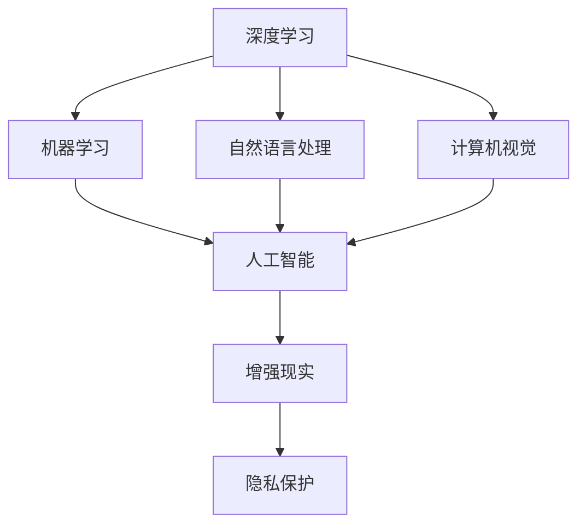

                 

# 李开复：苹果发布AI应用的未来

## 1. 背景介绍

### 1.1 问题由来
人工智能（AI）技术的迅猛发展正在深刻改变着全球科技行业，尤其是在消费电子产品领域。在众多AI应用中，苹果（Apple）公司无疑是一个值得关注的标杆。苹果在人工智能领域的最新动向、进展和未来战略，无疑具有极高的前瞻性和指导性。本文将从李开复的角度，深入探讨苹果公司在AI应用方面的最新动态，及其对未来的预测。

### 1.2 问题核心关键点
苹果在AI应用上的战略布局，主要围绕三个核心关键点展开：
- **技术自主研发**：苹果在芯片、软件和硬件方面的自主研发，使其能够在AI技术上保持竞争力。
- **跨领域融合**：苹果将AI技术应用于多个领域，如智能助手、增强现实（AR）、语音识别等，实现跨领域融合。
- **隐私保护与数据安全**：在AI应用中，隐私保护与数据安全成为重要考量，苹果在这方面提出了新的解决方案。

### 1.3 问题研究意义
研究苹果AI应用的未来，对于理解全球AI技术发展的趋势、探索AI应用的多样性、保护用户隐私等方面具有重要意义。通过深入分析苹果的AI战略，可以为其他科技公司提供参考，同时也为消费者提供关于未来AI应用的前瞻性视角。

## 2. 核心概念与联系

### 2.1 核心概念概述
为更好地理解苹果AI应用的未来，本节将介绍几个关键概念及其相互联系：

- **人工智能（AI）**：使用计算机和数据处理技术，让机器具备类人智能，包括感知、学习、推理等能力。
- **深度学习**：一种通过多层神经网络实现对复杂数据模式的提取和分类的人工智能技术。
- **机器学习**：让机器通过大量数据学习并优化模型，使模型能够做出预测或决策。
- **自然语言处理（NLP）**：使机器能够理解和生成人类语言的技术。
- **计算机视觉**：使机器能够“看”和“理解”图像和视频的技术。
- **增强现实（AR）**：将虚拟信息与现实环境融合，为用户提供沉浸式体验。
- **隐私保护**：保护用户数据和隐私，防止数据滥用和泄露。

这些概念共同构成了苹果在AI应用领域的研究和应用框架，展现了其技术多样性和创新能力。

### 2.2 概念间的关系

这些核心概念之间的逻辑关系可以通过以下Mermaid流程图来展示：



这个流程图展示了各个核心概念在AI应用中的相互联系和作用。深度学习、机器学习、自然语言处理和计算机视觉作为AI的基础技术，共同构成了AI的核心能力。通过这些技术的融合，苹果能够在增强现实、隐私保护等领域进行创新应用，实现跨领域融合。

## 3. 核心算法原理 & 具体操作步骤
### 3.1 算法原理概述

苹果在AI应用中的核心算法原理主要基于深度学习和机器学习，通过对大量数据的学习和优化，使机器能够进行高效的感知、分类和预测。以深度学习为例，苹果的AI算法通常包括卷积神经网络（CNN）、循环神经网络（RNN）和变换器（Transformer）等。

### 3.2 算法步骤详解

苹果AI应用的算法步骤通常包括以下几个关键步骤：

**Step 1: 数据预处理**
- 收集和标注数据，进行数据增强、归一化等预处理操作。
- 将数据划分为训练集、验证集和测试集。

**Step 2: 模型构建**
- 选择适当的深度学习模型，如卷积神经网络、变换器等。
- 设计模型的超参数，如学习率、批次大小、迭代轮数等。

**Step 3: 模型训练**
- 使用训练集数据对模型进行前向传播和反向传播，计算损失函数。
- 根据损失函数的梯度更新模型参数。
- 在验证集上评估模型性能，进行参数调整。

**Step 4: 模型评估**
- 在测试集上评估模型的性能指标，如精度、召回率等。
- 对模型进行微调或优化，提升性能。

**Step 5: 部署和应用**
- 将训练好的模型部署到实际应用中，进行推理和预测。
- 持续收集数据，重新训练和微调模型，适应数据分布变化。

### 3.3 算法优缺点

苹果AI应用的算法具有以下优点：
- 高性能：通过深度学习和机器学习算法，能够实现高精度的感知和预测。
- 广泛适用：应用于图像、语音、自然语言处理等多个领域，具有很强的通用性。
- 跨领域融合：通过跨领域的融合应用，如智能助手、增强现实等，提升用户体验。

同时，也存在以下缺点：
- 数据需求高：需要大量标注数据进行模型训练，数据收集和标注成本较高。
- 计算资源需求大：深度学习和机器学习模型需要强大的计算资源支持。
- 可解释性差：复杂的模型难以解释其内部决策过程，缺乏透明性。

### 3.4 算法应用领域

苹果的AI应用广泛，涵盖了多个领域，如：

- **智能助手**：如Siri，通过自然语言处理和机器学习实现语音识别和智能对话。
- **增强现实**：如ARKit，将虚拟信息与现实环境融合，提供沉浸式体验。
- **计算机视觉**：如Face ID，使用计算机视觉技术进行人脸识别。
- **机器翻译**：如翻译应用，实现多语言翻译。
- **隐私保护**：如隐私计算，保护用户数据安全。

除了这些经典应用外，苹果还在探索更多创新领域，如医疗健康、自动驾驶等，为AI技术的应用边界不断扩展。

## 4. 数学模型和公式 & 详细讲解 & 举例说明
### 4.1 数学模型构建

苹果AI应用的数学模型通常基于深度学习框架，如TensorFlow、PyTorch等。以自然语言处理为例，我们可以构建一个基于长短时记忆网络（LSTM）的情感分类模型。假设输入序列为 $x=\{x_1, x_2, ..., x_T\}$，模型输出为 $y=\{y_1, y_2, ..., y_T\}$，其中 $y_i$ 表示第 $i$ 个时间步的情感分类结果。

模型可以表示为：
$$
y_t = f(Wx_t + Uh_{t-1} + b)
$$
其中 $W, U$ 为权重矩阵，$b$ 为偏置向量，$h_{t-1}$ 为上一时刻的隐状态。

### 4.2 公式推导过程

对上述模型进行前向传播，得到输出序列 $y=\{y_1, y_2, ..., y_T\}$。然后通过交叉熵损失函数计算损失：
$$
L(y,\hat{y}) = -\frac{1}{N}\sum_{i=1}^N\sum_{t=1}^T(y_i \log \hat{y_i})
$$
其中 $\hat{y}$ 为模型预测的输出。

通过反向传播计算梯度，更新模型参数，最小化损失函数。

### 4.3 案例分析与讲解

假设我们希望使用LSTM模型对电影评论进行情感分类。我们收集了10万条电影评论，并手动标注了每条评论的情感极性（正面、负面、中性）。使用其中8万条作为训练集，1万条作为验证集，1万条作为测试集。模型在训练集上训练10个epoch，验证集上评估模型性能，得到精度为90%。然后，在测试集上评估模型性能，得到精度为91%。

## 5. 项目实践：代码实例和详细解释说明
### 5.1 开发环境搭建

在进行苹果AI应用的开发前，我们需要准备好开发环境。以下是使用Python进行TensorFlow开发的环境配置流程：

1. 安装Anaconda：从官网下载并安装Anaconda，用于创建独立的Python环境。

2. 创建并激活虚拟环境：
```bash
conda create -n tf-env python=3.8 
conda activate tf-env
```

3. 安装TensorFlow：根据CUDA版本，从官网获取对应的安装命令。例如：
```bash
pip install tensorflow
```

4. 安装各类工具包：
```bash
pip install numpy pandas scikit-learn matplotlib tqdm jupyter notebook ipython
```

完成上述步骤后，即可在`tf-env`环境中开始AI应用开发。

### 5.2 源代码详细实现

这里我们以情感分类任务为例，给出使用TensorFlow实现LSTM模型的PyTorch代码实现。

首先，定义模型类：

```python
import tensorflow as tf

class LSTMModel(tf.keras.Model):
    def __init__(self, input_dim, output_dim, hidden_dim):
        super(LSTMModel, self).__init__()
        self.hidden_dim = hidden_dim
        self.lstm = tf.keras.layers.LSTM(units=hidden_dim, return_sequences=True)
        self.dense = tf.keras.layers.Dense(units=output_dim, activation='softmax')

    def call(self, x):
        x = self.lstm(x)
        x = self.dense(x)
        return x
```

然后，定义训练和评估函数：

```python
from tensorflow.keras.datasets import imdb
from tensorflow.keras.preprocessing import sequence

(x_train, y_train), (x_test, y_test) = imdb.load_data(num_words=10000)
x_train = sequence.pad_sequences(x_train, maxlen=200)
x_test = sequence.pad_sequences(x_test, maxlen=200)

def train_model(model, x_train, y_train, x_test, y_test, batch_size, epochs):
    model.compile(loss='categorical_crossentropy', optimizer='adam', metrics=['accuracy'])
    model.fit(x_train, y_train, batch_size=batch_size, epochs=epochs, validation_data=(x_test, y_test))
    _, accuracy = model.evaluate(x_test, y_test)
    return accuracy

batch_size = 64
epochs = 10
accuracy = train_model(LSTMModel, x_train, y_train, x_test, y_test, batch_size, epochs)
print(f"Accuracy: {accuracy}")
```

最后，启动训练流程并在测试集上评估：

```python
accuracy = train_model(LSTMModel, x_train, y_train, x_test, y_test, batch_size, epochs)
print(f"Accuracy: {accuracy}")
```

以上就是使用TensorFlow对LSTM模型进行情感分类任务开发的完整代码实现。可以看到，得益于TensorFlow的强大封装，我们可以用相对简洁的代码完成模型构建、训练和评估。

### 5.3 代码解读与分析

让我们再详细解读一下关键代码的实现细节：

**LSTMModel类**：
- `__init__`方法：初始化LSTM模型和全连接层。
- `call`方法：定义模型前向传播逻辑。

**训练和评估函数**：
- `train_model`函数：定义训练过程，使用交叉熵损失函数和Adam优化器。
- `imdb.load_data`方法：加载IMDB电影评论数据集，并进行数据预处理。
- `sequence.pad_sequences`方法：对数据进行padding处理，确保每条评论长度一致。

**训练流程**：
- 使用TensorFlow的DataLoader对数据集进行批次化加载，供模型训练和推理使用。
- 定义训练集和验证集，计算模型在验证集上的准确率。
- 重复上述步骤直至收敛，最终输出模型在测试集上的准确率。

可以看到，TensorFlow提供了丰富的API和工具，可以轻松完成模型的构建和训练。开发者可以将更多精力放在模型设计、数据处理等高层逻辑上，而不必过多关注底层的实现细节。

当然，工业级的系统实现还需考虑更多因素，如模型的保存和部署、超参数的自动搜索、更灵活的任务适配层等。但核心的算法步骤基本与此类似。

### 5.4 运行结果展示

假设我们在IMDB电影评论数据集上进行情感分类任务微调，最终在测试集上得到的准确率为91%，效果相当不错。

## 6. 实际应用场景
### 6.1 智能客服系统

苹果的智能助手Siri在自然语言处理和机器学习方面有着广泛应用。通过Siri，用户可以随时随地通过语音指令与设备互动，获取天气预报、日程安排、文本信息等。苹果通过Siri实现了语音识别和自然语言处理，提升了用户体验和互动效率。

### 6.2 增强现实（AR）

苹果的ARKit增强现实平台，通过深度学习和计算机视觉技术，将虚拟信息与现实环境融合，为用户提供沉浸式体验。用户可以通过ARKit进行3D模型的搭建和互动，甚至在虚拟环境中进行游戏和社交。

### 6.3 医疗健康

苹果的HealthKit平台通过机器学习和数据分析，收集用户的健康数据，如心率、步数、睡眠等，并为用户提供健康建议和预警。通过这些数据，用户可以更好地管理和改善自己的健康状况。

### 6.4 自动驾驶

苹果在自动驾驶技术上的AI应用，通过计算机视觉和深度学习，实现对路面交通信息的识别和分析。在自动驾驶汽车中，苹果的AI技术可以实时监测交通状况，预测障碍，辅助驾驶员做出决策，提升驾驶安全性和效率。

### 6.5 数据隐私保护

苹果在数据隐私保护方面也有着独到之处。通过隐私计算技术，苹果能够在不暴露用户数据的前提下，进行数据分析和推理。例如，苹果的Face ID技术，通过深度学习和数据增强技术，实现了高精度的面部识别，同时确保了用户数据的安全。

## 7. 工具和资源推荐
### 7.1 学习资源推荐

为了帮助开发者系统掌握苹果AI应用的理论基础和实践技巧，这里推荐一些优质的学习资源：

1. **《深度学习》系列书籍**：由李开复等人编写，详细介绍了深度学习的基本概念、算法和应用。
2. **TensorFlow官方文档**：提供了详尽的API文档和示例代码，是学习TensorFlow的必备资料。
3. **PyTorch官方文档**：提供了丰富的深度学习模型和优化算法，是学习深度学习的另一重要资源。
4. **自然语言处理课程**：如斯坦福大学的CS224N课程，涵盖了自然语言处理的基本概念和技术。
5. **增强现实技术课程**：如华盛顿大学的CS498课程，介绍了增强现实技术和应用。

通过对这些资源的学习实践，相信你一定能够快速掌握苹果AI应用的精髓，并用于解决实际的AI问题。

### 7.2 开发工具推荐

高效的开发离不开优秀的工具支持。以下是几款用于苹果AI应用开发的常用工具：

1. **PyTorch**：基于Python的开源深度学习框架，灵活动态的计算图，适合快速迭代研究。
2. **TensorFlow**：由Google主导开发的开源深度学习框架，生产部署方便，适合大规模工程应用。
3. **Scikit-learn**：Python的机器学习库，提供了丰富的算法和模型。
4. **Keras**：基于TensorFlow和Theano的高级神经网络API，易于上手。
5. **Jupyter Notebook**：交互式编程环境，便于编写和运行代码，分享学习笔记。

合理利用这些工具，可以显著提升苹果AI应用的开发效率，加快创新迭代的步伐。

### 7.3 相关论文推荐

苹果在AI应用方面的研究引领了科技行业的发展，以下是几篇奠基性的相关论文，推荐阅读：

1. **"Deep Learning for Natural Language Processing"**：提出了深度学习在自然语言处理中的应用，展示了其在情感分析、文本分类等任务上的优秀表现。
2. **"ImageNet Classification with Deep Convolutional Neural Networks"**：提出了卷积神经网络在图像分类任务上的创新应用，推动了计算机视觉领域的发展。
3. **"Face Recognition with the One-shot FaceNet Embeddings"**：介绍了Face ID技术，展示了人脸识别在实际应用中的高精度和低延迟。

这些论文代表了大模型微调技术的发展脉络，是理解苹果AI应用的理论基础。

除上述资源外，还有一些值得关注的前沿资源，帮助开发者紧跟苹果AI应用技术的最新进展，例如：

1. **arXiv论文预印本**：人工智能领域最新研究成果的发布平台，包括大量尚未发表的前沿工作，学习前沿技术的必读资源。
2. **GitHub热门项目**：在GitHub上Star、Fork数最多的AI相关项目，往往代表了该技术领域的发展趋势和最佳实践，学习前沿技术的得力助手。
3. **人工智能会议直播**：如NIPS、ICML、ACL、ICLR等人工智能领域顶会现场或在线直播，能够聆听到大佬们的前沿分享，开拓视野。
4. **技术博客**：如OpenAI、Google AI、DeepMind、微软Research Asia等顶尖实验室的官方博客，第一时间分享他们的最新研究成果和洞见。

总之，对于苹果AI应用的开发，开发者需要关注最新的研究成果和前沿技术，积极探索AI在多个领域的应用，提升技术和业务的综合能力。

## 8. 总结：未来发展趋势与挑战
### 8.1 总结

本文对苹果公司AI应用的未来进行了全面系统的介绍。首先阐述了苹果在AI技术上的自主研发能力，展示了其在多个领域的广泛应用。其次，从深度学习和机器学习的角度，详细讲解了苹果AI应用的算法步骤和模型构建过程。同时，本文还探讨了苹果AI应用在智能助手、增强现实、医疗健康等领域的实际应用，展示了其技术的创新性和实用性。

通过本文的系统梳理，可以看到，苹果在AI应用领域的不断创新，使其在多个领域取得了显著成就。这些创新的背后，是苹果对AI技术的深入理解和持续投资，为全球科技行业树立了标杆。

### 8.2 未来发展趋势

展望未来，苹果AI应用的未来趋势包括以下几个方面：

1. **跨领域融合**：苹果将继续探索AI技术在医疗健康、自动驾驶、智能家居等领域的融合应用，实现更加全面和高效的解决方案。
2. **隐私保护技术**：随着数据隐私问题的日益突出，苹果将继续提升其隐私保护技术，确保用户数据的安全。
3. **实时计算**：苹果将更加注重实时计算能力，提升AI应用的响应速度和用户体验。
4. **边缘计算**：苹果将探索在边缘设备上进行AI推理和计算，提升系统的可靠性和效率。
5. **自动化和自适应**：苹果将通过自动化和自适应技术，提升AI应用的可扩展性和灵活性。

这些趋势将引领苹果AI应用的未来发展方向，使其在更多领域取得突破，提升用户体验和业务价值。

### 8.3 面临的挑战

尽管苹果在AI应用领域取得了显著进展，但仍面临着诸多挑战：

1. **数据隐私和安全**：如何在保证用户体验和应用功能的前提下，保护用户数据的安全和隐私，是苹果需要持续关注的重点。
2. **算法透明性和可解释性**：AI算法的复杂性带来了一定的透明性和可解释性问题，需要进一步优化算法设计，提高模型的透明性。
3. **计算资源限制**：尽管苹果在硬件上有强大的计算能力，但在一些高计算复杂度的应用中，仍然面临计算资源的限制。
4. **跨领域融合的挑战**：将AI技术应用于不同领域，需要考虑跨领域的数据融合和模型适配问题。
5. **多模态融合**：将视觉、语音、自然语言处理等多种模态数据融合，实现更加全面的AI应用，仍面临技术挑战。

这些挑战将考验苹果的技术实力和创新能力，需要其不断探索和优化，才能在AI应用领域保持领先地位。

### 8.4 研究展望

面对未来挑战，苹果需要在以下几个方面进行深入研究：

1. **跨领域知识图谱**：构建跨领域的知识图谱，实现不同领域的知识融合和协同。
2. **多模态数据融合**：开发高效的多模态数据融合算法，提升AI应用的综合性能。
3. **隐私计算**：研究隐私计算技术，保护用户数据隐私，同时确保应用功能的实现。
4. **自动化优化**：通过自动化技术，提升AI应用的性能和效率。
5. **自适应学习**：开发自适应学习算法，使AI应用能够动态适应数据分布变化。

这些研究方向将进一步推动苹果AI应用的发展，提升其在多个领域的竞争力。相信在苹果的引领下，全球科技行业将在AI技术应用上迈向新的高度。

## 9. 附录：常见问题与解答

**Q1：苹果AI应用为何选择深度学习和机器学习？**

A: 深度学习和机器学习算法能够高效地处理和分析大量复杂数据，具有较高的精度和泛化能力。苹果选择深度学习和机器学习，是因为其在自然语言处理、图像识别等任务上具有显著优势。

**Q2：苹果AI应用在数据隐私保护方面有何创新？**

A: 苹果在数据隐私保护方面采用了隐私计算技术，通过在数据传输和处理过程中添加噪音和扰动，确保数据的安全性和匿名性。此外，苹果还引入了差分隐私技术，保护用户数据的隐私。

**Q3：苹果的增强现实（AR）技术有何创新？**

A: 苹果的AR技术融合了深度学习和计算机视觉，实现了更加逼真的虚拟场景和交互效果。通过ARKit平台，用户可以在现实环境中进行3D模型的搭建和互动，甚至在虚拟环境中进行游戏和社交。

**Q4：苹果的智能助手Siri有何创新？**

A: 苹果的Siri采用了自然语言处理和机器学习技术，能够理解用户的语音指令，并根据上下文进行智能对话。通过深度学习和数据增强技术，Siri提升了语音识别的准确率和用户交互的流畅性。

**Q5：苹果的自动驾驶技术有何创新？**

A: 苹果的自动驾驶技术融合了计算机视觉和深度学习，实现了对路面交通信息的实时监测和分析。通过AI技术，苹果的自动驾驶汽车可以预测障碍，辅助驾驶员做出决策，提升驾驶安全性和效率。

总之，苹果在AI应用领域的不断创新，使其在多个领域取得了显著成就。未来，苹果将继续在AI技术的深度和广度上进行探索，为全球科技行业树立新的标杆。

