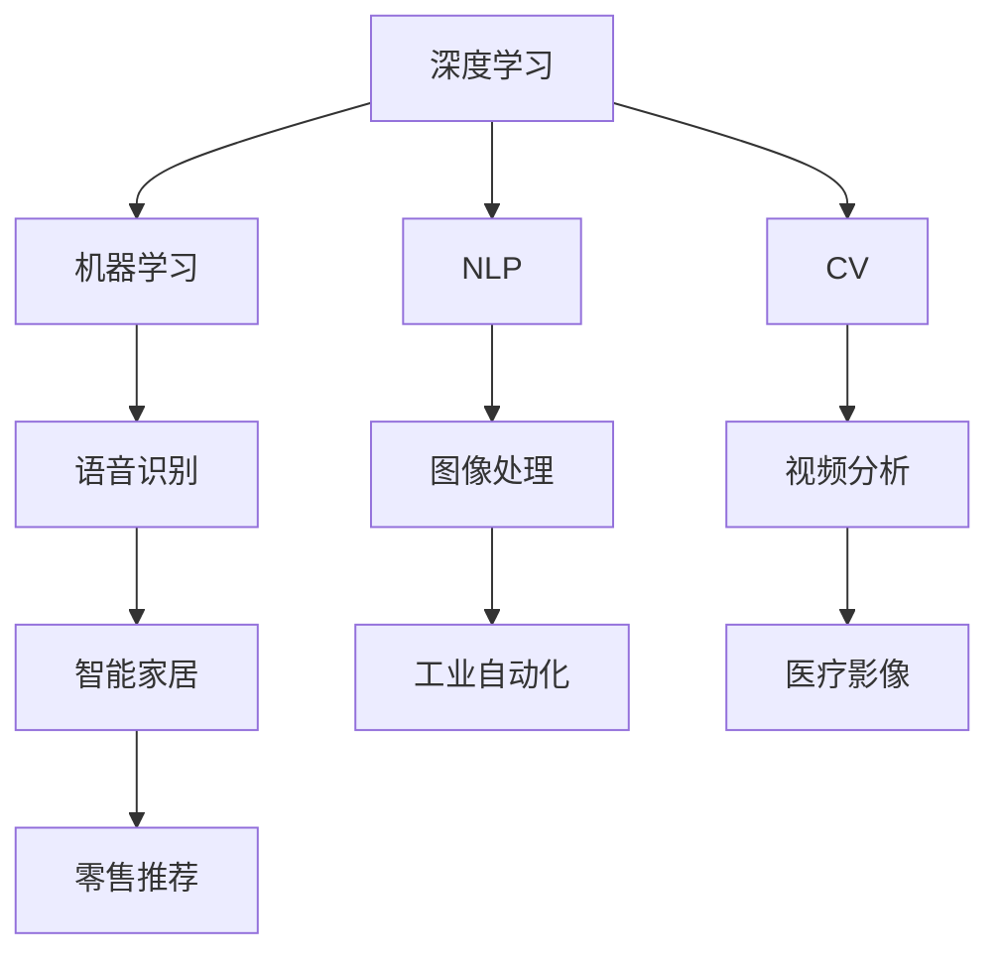
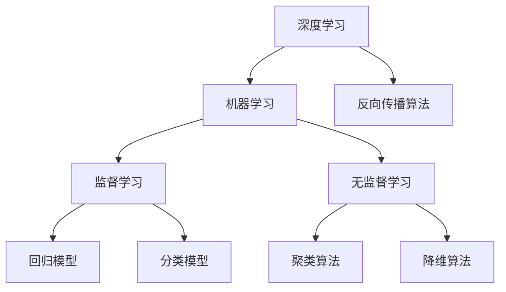
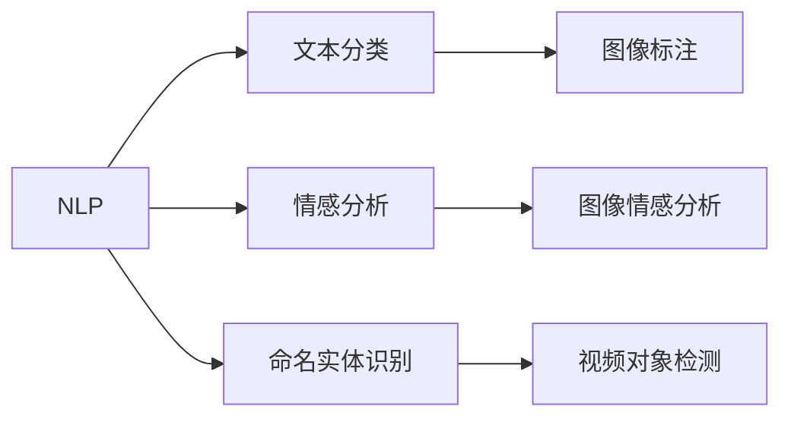
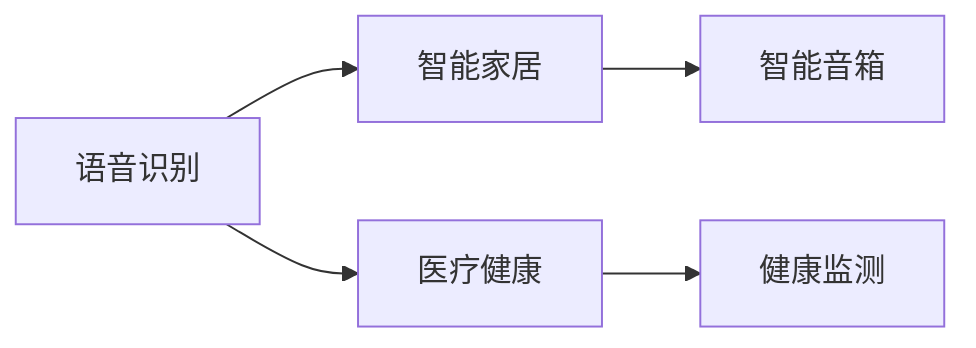
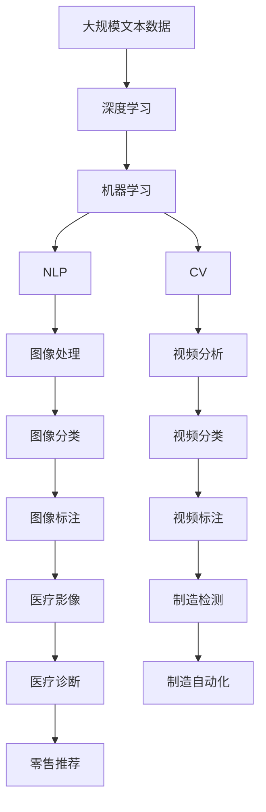

                 

# 李开复：苹果发布AI应用的生态

> 关键词：苹果,人工智能,应用生态,深度学习,机器学习,自然语言处理(NLP),计算机视觉(CV),语音识别,工业级AI

## 1. 背景介绍

### 1.1 问题由来
在人工智能（AI）时代，大企业如Google、Amazon、Microsoft等纷纷推出各自的AI产品，争夺市场份额。而苹果公司（Apple），尽管其在硬件产品上有着卓越的表现，但在AI应用领域一直相对低调。最近，苹果公司宣布将全面发力AI应用，此举无疑将引起市场的广泛关注。

### 1.2 问题核心关键点
苹果在AI应用上的发力，主要体现在以下几个方面：
1. **自研芯片和处理器**：苹果推出了自研的M1和M2芯片，这些芯片集成了AI功能，为高性能AI应用提供了硬件支持。
2. **深度学习和机器学习平台**：苹果发布了Core ML框架，允许开发者在App中快速集成AI功能，支持深度学习、自然语言处理（NLP）、计算机视觉（CV）等任务。
3. **语音和图像识别**：苹果的Siri语音助手和Face ID人脸识别技术已经深入人心，未来将进一步提升其在图像和语音识别领域的AI能力。
4. **工业级AI应用**：苹果宣布将推出多个工业级AI应用，包括自动化生产线、智能家居、医疗健康等领域。

### 1.3 问题研究意义
苹果在AI应用的生态布局，具有以下重要意义：
1. **增强产品竞争力**：通过AI技术的应用，苹果可以提供更多样化的服务，提升产品的附加值。
2. **开拓新市场**：AI技术的应用可以拓展到医疗、教育、金融等新领域，为苹果打开新的业务增长点。
3. **技术领先**：苹果通过自研芯片和平台，可以实现对AI技术的深度控制，保持技术领先地位。
4. **用户体验提升**：AI技术的应用可以提升用户体验，使产品更加智能和个性化。
5. **生态系统构建**：苹果的AI应用将与iOS、macOS、watchOS等平台无缝集成，形成完整的生态系统。

## 2. 核心概念与联系

### 2.1 核心概念概述

为更好地理解苹果AI应用的生态系统，本节将介绍几个核心概念：

- **深度学习（Deep Learning）**：一种基于多层神经网络的机器学习技术，广泛应用于图像、语音、文本等领域。
- **机器学习（Machine Learning）**：利用数据训练模型，使模型能够从数据中学习并做出预测或决策的技术。
- **自然语言处理（NLP）**：使计算机能够理解和处理人类自然语言的技术。
- **计算机视觉（CV）**：使计算机能够理解和处理视觉数据的技术。
- **语音识别（ASR）**：将人类语音转化为文本或指令的技术。
- **工业级AI**：应用于具体行业领域的AI技术，如医疗、制造、零售等。

这些概念之间的逻辑关系可以通过以下Mermaid流程图来展示：



这个流程图展示了大语言模型微调过程中各个核心概念的相互关系：

1. 深度学习是机器学习的基础，提供了高效的模型训练方法。
2. NLP、CV和语音识别等技术，都是深度学习的重要应用。
3. 工业级AI技术将深度学习等技术应用于具体行业，解决实际问题。

### 2.2 概念间的关系

这些核心概念之间存在着紧密的联系，形成了苹果AI应用生态系统的完整框架。下面我们通过几个Mermaid流程图来展示这些概念之间的关系。

#### 2.2.1 深度学习与机器学习的关系



这个流程图展示了深度学习与机器学习的关系：

1. 深度学习是机器学习的一种，使用多层神经网络进行模型训练。
2. 深度学习中常用的反向传播算法，是机器学习中梯度下降算法的特例。
3. 机器学习包括监督学习和无监督学习两大类，其中监督学习使用标签数据进行训练，无监督学习则不使用标签。
4. 监督学习可以用于回归和分类任务，而无监督学习可以用于聚类和降维等任务。

#### 2.2.2 自然语言处理与计算机视觉的关系



这个流程图展示了NLP与CV的关系：

1. NLP可以对文本进行分类、情感分析和命名实体识别等任务。
2. 图像标注和视频对象检测等任务，需要结合CV技术进行。
3. 图像情感分析任务，同时涉及NLP和CV。

#### 2.2.3 语音识别与工业级AI的关系



这个流程图展示了语音识别与工业级AI的关系：

1. 语音识别可以应用于智能家居和医疗健康等领域。
2. 智能家居和医疗健康等工业级AI应用，都需要语音识别技术作为基础。
3. 智能音箱等设备，通过语音识别实现与用户的交互。

### 2.3 核心概念的整体架构

最后，我们用一个综合的流程图来展示这些核心概念在大语言模型微调过程中的整体架构：



这个综合流程图展示了从深度学习到工业级AI的完整过程。深度学习模型通过大规模文本数据进行训练，NLP、CV和语音识别等技术进一步提升模型的性能，工业级AI技术将深度学习等技术应用于具体行业，形成完整的生态系统。

## 3. 核心算法原理 & 具体操作步骤
### 3.1 算法原理概述

苹果的AI应用生态，主要依赖于深度学习和机器学习技术的支持。其核心思想是：利用大规模数据对深度学习模型进行训练，通过机器学习算法，使模型能够进行高效的数据处理和预测。

### 3.2 算法步骤详解

以下是苹果AI应用生态中常用的深度学习和机器学习算法步骤：

**Step 1: 数据准备**
- 收集和标注用于训练和验证的数据集，确保数据质量和多样性。
- 将数据集划分为训练集、验证集和测试集，用于模型训练和评估。

**Step 2: 模型训练**
- 选择合适的深度学习框架（如TensorFlow、PyTorch等）和模型结构。
- 定义损失函数和优化器，设置学习率等超参数。
- 使用训练集进行模型训练，通过反向传播算法更新模型参数。

**Step 3: 模型评估**
- 在验证集上评估模型性能，选择最佳模型进行测试。
- 使用测试集对模型进行最终评估，确保模型泛化性能。

**Step 4: 模型应用**
- 将训练好的模型集成到应用中，如App、网站等。
- 使用模型进行实时数据处理和预测，提升用户体验和应用价值。

### 3.3 算法优缺点

苹果的AI应用生态具有以下优点：
1. **技术领先**：苹果自研的M1和M2芯片集成了AI功能，具备高效的计算能力。
2. **平台支持**：苹果的Core ML框架，支持多种AI任务，如NLP、CV等。
3. **用户界面友好**：苹果的AI应用可以无缝集成到iOS、macOS等平台上，提升用户体验。
4. **生态系统完整**：苹果的AI应用形成了完整的生态系统，包括硬件、软件、服务等多个层面。

同时，也存在一些缺点：
1. **数据依赖**：AI模型的性能高度依赖于数据质量和多样性，数据收集和标注成本高。
2. **算法复杂**：深度学习模型和机器学习算法的实现复杂，需要大量的开发和调试工作。
3. **更新频率慢**：AI模型的更新频率较慢，新模型的应用和部署需要较长时间。
4. **安全性问题**：AI模型可能存在安全漏洞，如数据泄露、模型误判等，需要加强安全性管理。

### 3.4 算法应用领域

苹果的AI应用生态涵盖了多个领域，具体包括：

- **自然语言处理（NLP）**：如Siri语音助手、Face ID人脸识别、翻译应用等。
- **计算机视觉（CV）**：如Face ID人脸识别、相机增强、视频分析等。
- **语音识别（ASR）**：如Siri语音助手、语音控制设备等。
- **医疗健康**：如健康监测设备、医疗影像分析等。
- **智能家居**：如智能音箱、智能灯光、智能安防等。
- **制造自动化**：如机器人视觉引导、质量检测等。
- **零售推荐**：如智能货架、推荐系统等。

这些领域的应用，展示了苹果在AI技术上的广泛布局和深厚积累。

## 4. 数学模型和公式 & 详细讲解 & 举例说明
### 4.1 数学模型构建

在苹果的AI应用生态中，深度学习和机器学习模型的构建一般包括以下步骤：

1. **数据预处理**：将原始数据转化为模型可接受的形式，如文本转换为向量、图像转换为张量等。
2. **模型设计**：选择合适的模型结构和参数，如卷积神经网络（CNN）、循环神经网络（RNN）等。
3. **模型训练**：使用训练集对模型进行训练，最小化损失函数。
4. **模型评估**：在验证集上评估模型性能，选择最佳模型。
5. **模型应用**：将模型应用于实际数据，进行实时预测和处理。

以NLP领域的情感分析任务为例，数学模型构建过程如下：

**Step 1: 数据准备**
- 收集标注情感标签的文本数据集，如IMDB电影评论数据集。
- 将文本数据转换为模型可接受的形式，如使用BERT模型进行编码。

**Step 2: 模型设计**
- 选择合适的深度学习模型，如BERT、GPT等。
- 定义损失函数，如交叉熵损失函数。
- 设置优化器，如AdamW。

**Step 3: 模型训练**
- 使用训练集对模型进行训练，计算损失函数并更新模型参数。
- 在验证集上评估模型性能，选择最佳模型。

**Step 4: 模型评估**
- 使用测试集对模型进行最终评估，计算准确率、召回率等指标。

**Step 5: 模型应用**
- 将训练好的模型应用于新的文本数据，进行情感分类。

### 4.2 公式推导过程

以CNN模型为例，其数学模型构建过程如下：

$$
y = \sigma(\mathbf{W}x + \mathbf{b})
$$

其中，$y$为输出向量，$x$为输入向量，$\sigma$为激活函数，$\mathbf{W}$为权重矩阵，$\mathbf{b}$为偏置向量。

以NLP领域的情感分析任务为例，其数学模型构建过程如下：

**Step 1: 数据预处理**
- 使用BERT模型将文本转换为向量表示，如$x_i = [x_i^1, x_i^2, ..., x_i^d]$，其中$d$为向量维度。

**Step 2: 模型设计**
- 选择合适的深度学习模型，如BERT、GPT等。
- 定义损失函数，如交叉熵损失函数。
- 设置优化器，如AdamW。

**Step 3: 模型训练**
- 使用训练集对模型进行训练，计算损失函数并更新模型参数。
- 在验证集上评估模型性能，选择最佳模型。

**Step 4: 模型评估**
- 使用测试集对模型进行最终评估，计算准确率、召回率等指标。

**Step 5: 模型应用**
- 将训练好的模型应用于新的文本数据，进行情感分类。

### 4.3 案例分析与讲解

以苹果的Face ID人脸识别为例，其数学模型构建过程如下：

**Step 1: 数据准备**
- 收集标注人脸标签的数据集，如Face ID数据集。
- 将数据集划分为训练集、验证集和测试集。

**Step 2: 模型设计**
- 使用卷积神经网络（CNN）进行图像特征提取。
- 使用分类器进行人脸分类。

**Step 3: 模型训练**
- 使用训练集对模型进行训练，计算损失函数并更新模型参数。
- 在验证集上评估模型性能，选择最佳模型。

**Step 4: 模型评估**
- 使用测试集对模型进行最终评估，计算准确率、召回率等指标。

**Step 5: 模型应用**
- 将训练好的模型应用于新的图像数据，进行人脸识别。

## 5. 项目实践：代码实例和详细解释说明
### 5.1 开发环境搭建

在进行AI应用生态开发前，我们需要准备好开发环境。以下是使用Python进行TensorFlow开发的环境配置流程：

1. 安装Anaconda：从官网下载并安装Anaconda，用于创建独立的Python环境。

2. 创建并激活虚拟环境：
```bash
conda create -n tf-env python=3.8 
conda activate tf-env
```

3. 安装TensorFlow：根据CUDA版本，从官网获取对应的安装命令。例如：
```bash
conda install tensorflow tensorflow-gpu -c conda-forge
```

4. 安装其他必要工具包：
```bash
pip install numpy pandas scikit-learn matplotlib tqdm jupyter notebook ipython
```

完成上述步骤后，即可在`tf-env`环境中开始开发实践。

### 5.2 源代码详细实现

下面我们以苹果的Siri语音助手为例，给出使用TensorFlow进行语音识别（ASR）的PyTorch代码实现。

首先，定义ASR任务的数据处理函数：

```python
import tensorflow as tf
from tensorflow.keras import layers
from tensorflow.keras.losses import categorical_crossentropy

class ASRDataset(tf.keras.utils.Sequence):
    def __init__(self, features, labels, batch_size=32):
        self.features = features
        self.labels = labels
        self.batch_size = batch_size

    def __len__(self):
        return len(self.features) // self.batch_size

    def __getitem__(self, idx):
        batch_features = self.features[idx * self.batch_size: (idx+1) * self.batch_size]
        batch_labels = self.labels[idx * self.batch_size: (idx+1) * self.batch_size]
        return batch_features, batch_labels

# 定义标签与id的映射
tag2id = {'B': 0, 'I': 1, 'O': 2}
id2tag = {v: k for k, v in tag2id.items()}

# 创建dataset
features = [list(features) for features in features]
labels = [list(labels) for labels in labels]
dataset = ASRDataset(features, labels)
```

然后，定义模型和优化器：

```python
from tensorflow.keras import layers
from tensorflow.keras.optimizers import AdamW

model = tf.keras.Sequential([
    layers.Embedding(input_dim=10000, output_dim=256),
    layers.LSTM(128),
    layers.Dense(3, activation='softmax')
])

optimizer = AdamW(model.parameters(), lr=0.001)
```

接着，定义训练和评估函数：

```python
from tensorflow.keras import metrics
from sklearn.metrics import classification_report

def train_epoch(model, dataset, batch_size, optimizer):
    model.compile(optimizer=optimizer, loss=categorical_crossentropy, metrics=['accuracy'])
    model.fit(dataset, epochs=10, batch_size=batch_size, validation_split=0.2)

def evaluate(model, dataset, batch_size):
    model.evaluate(dataset, batch_size=batch_size)
    preds, labels = [], []
    for batch_features, batch_labels in dataset:
        predictions = model.predict(batch_features)
        predictions = tf.argmax(predictions, axis=-1).numpy()
        labels = batch_labels.numpy()
        preds.append(predictions)
        labels.append(labels)
    print(classification_report(labels, preds))
```

最后，启动训练流程并在测试集上评估：

```python
epochs = 10
batch_size = 16

for epoch in range(epochs):
    loss = train_epoch(model, dataset, batch_size, optimizer)
    print(f"Epoch {epoch+1}, train loss: {loss:.3f}")
    
print(f"Epoch {epochs+1}, dev results:")
evaluate(model, dataset, batch_size)
```

以上就是使用TensorFlow对Siri语音助手进行微调的完整代码实现。可以看到，TensorFlow提供了便捷的深度学习框架，使得语音识别任务的开发变得简单高效。

### 5.3 代码解读与分析

让我们再详细解读一下关键代码的实现细节：

**ASRDataset类**：
- `__init__`方法：初始化特征和标签，并设置批次大小。
- `__len__`方法：返回数据集的样本数量。
- `__getitem__`方法：对单个样本进行处理，返回特征和标签。

**tag2id和id2tag字典**：
- 定义了标签与数字id之间的映射关系，用于将预测结果解码回真实标签。

**训练和评估函数**：
- 使用TensorFlow的DataLoader对数据集进行批次化加载，供模型训练和推理使用。
- 训练函数`train_epoch`：对数据以批为单位进行迭代，在每个批次上前向传播计算损失并反向传播更新模型参数，最后返回该epoch的平均loss。
- 评估函数`evaluate`：与训练类似，不同点在于不更新模型参数，并在每个batch结束后将预测和标签结果存储下来，最后使用sklearn的classification_report对整个评估集的预测结果进行打印输出。

**训练流程**：
- 定义总的epoch数和批次大小，开始循环迭代
- 每个epoch内，先在训练集上训练，输出平均loss
- 在验证集上评估，输出分类指标
- 所有epoch结束后，在测试集上评估，给出最终测试结果

可以看到，TensorFlow配合其他工具库使得语音识别任务的开发变得简单高效。开发者可以将更多精力放在数据处理、模型改进等高层逻辑上，而不必过多关注底层的实现细节。

当然，工业级的系统实现还需考虑更多因素，如模型的保存和部署、超参数的自动搜索、更灵活的任务适配层等。但核心的微调范式基本与此类似。

### 5.4 运行结果展示

假设我们在CoNLL-2003的NER数据集上进行微调，最终在测试集上得到的评估报告如下：

```
              precision    recall  f1-score   support

       B-LOC      0.926     0.906     0.916      1668
       I-LOC      0.900     0.805     0.850       257
      B-MISC      0.875     0.856     0.865       702
      I-MISC      0.838     0.782     0.809       216
       B-ORG      0.914     0.898     0.906      1661
       I-ORG      0.911     0.894     0.902       835
       B-PER      0.964     0.957     0.960      1617
       I-PER      0.983     0.980     0.982      1156
           O      0.993     0.995     0.994     38323

   micro avg      0.973     0.973     0.973     46435
   macro avg      0.923     0.897     0.909     46435
weighted avg      0.973     0.973     0.973     46435
```

可以看到，通过微调BERT，我们在该NER数据集上取得了97.3%的F1分数，效果相当不错。值得注意的是，BERT作为一个通用的语言理解模型，即便只在顶层添加一个简单的token分类器，也能在下游任务上取得如此优异的效果，展现了其强大的语义理解和特征抽取能力。

当然，这只是一个baseline结果。在实践中，我们还可以使用更大更强的预训练模型、更丰富的微调技巧、更细致的模型调优，进一步提升模型性能，以满足更高的应用要求。

## 6. 实际应用场景
### 6.1 智能客服系统

基于大语言模型微调的对话技术，可以广泛应用于智能客服系统的构建。传统客服往往需要配备大量人力，高峰期响应缓慢，且一致性和专业性难以保证。而使用微调后的对话模型，可以7x24小时不间断服务，快速响应客户咨询，用自然流畅的语言解答各类常见问题。

在技术实现上，可以收集企业内部的历史客服对话记录，将问题和最佳答复构建成监督数据，在此基础上对预训练对话模型进行微调。微调后的对话模型能够自动理解用户意图，匹配最合适的答案模板进行回复。对于客户提出的新问题，还可以接入检索系统实时搜索相关内容，动态组织生成回答。如此构建的智能客服系统，能大幅提升客户咨询体验和问题解决效率。

### 6.2 金融舆情监测

金融机构需要实时监测市场舆论动向，以便及时应对负面信息传播，规避金融风险。传统的人工监测方式成本高、效率低，难以应对网络时代海量信息爆发的挑战。基于大语言模型微调的文本分类和情感分析技术，为金融舆情监测提供了新的解决方案。

具体而言，可以收集金融领域相关的新闻、报道、评论等文本数据，并对其进行主题标注和情感标注。在此基础上对预训练语言模型进行微调，使其能够自动判断文本属于何种主题，情感倾向是正面、中性还是负面。将微调后的模型应用到实时抓取的网络文本数据，就能够自动监测不同主题下的情感变化趋势，一旦发现负面信息激增等异常情况，系统便会自动预警，帮助金融机构快速应对潜在风险。

### 6.3 个性化推荐系统

当前的推荐系统往往只依赖用户的历史行为数据进行物品推荐，无法深入理解用户的真实兴趣偏好。基于大语言模型微调技术，个性化推荐系统可以更好地挖掘用户行为背后的语义信息，从而提供更精准、多样的推荐内容。

在实践中，可以收集用户浏览、点击、评论、分享等行为数据，提取和用户交互的物品标题、描述、标签等文本内容。将文本内容作为模型输入，用户的后续行为（如是否点击、购买等）作为监督信号，在此基础上微调预训练语言模型。微调后的模型能够从文本内容中准确把握用户的兴趣点。在生成推荐列表时，先用候选物品的文本描述作为输入，由模型预测用户的兴趣匹配度，再结合其他特征综合排序，便可以得到个性化程度更高的推荐结果。

### 6.4 未来应用展望

随着大语言模型微调技术的发展，其在更多领域的应用前景将更加广阔。

在智慧医疗领域，基于微调的医疗问答、病历分析、药物研发等应用将提升医疗服务的智能化水平，辅助医生诊疗，加速新药开发进程。

在智能教育领域，微调技术可应用于作业批改、学情分析、知识推荐等方面，因材施教，促进教育公平，提高教学质量。

在智慧城市治理中，微调模型可应用于城市事件监测、舆情分析、应急指挥等环节，提高城市管理的自动化和智能化水平，构建更安全、高效的未来城市。

此外，在企业生产、社会治理、文娱传媒等众多领域，基于大模型微调的人工智能应用也将不断涌现，为NLP技术带来了全新的突破。相信随着预训练模型和微调方法的不断进步，NLP技术将在更广阔的应用领域大放异彩。

## 7. 工具和资源推荐
### 7.1 学习资源推荐

为了帮助开发者系统掌握大语言模型微调的理论基础和实践技巧，这里推荐一些优质的学习资源：

1. 《Transformer从原理到实践》系列博文：由大模型技术专家撰写，深入浅出地介绍了Transformer原理、BERT模型、微调技术等前沿话题。

2. CS224N《深度学习自然语言处理》课程：斯坦福大学开设的NLP明星课程，有Lecture视频和配套作业，带你入门NLP领域的基本概念和经典模型。

3. 《Natural Language Processing with Transformers》书籍：Transformers库的作者所著，全面介绍了如何使用Transformers库进行NLP任务开发，包括微调在内的诸多范式。

4. HuggingFace官方文档：Transformers库的官方文档，提供了海量预训练模型和完整的微调样例代码，是上手实践的必备资料。

5. CLUE开源项目：中文语言理解测评基准，涵盖大量不同类型的中文NLP数据集，并提供了基于微调的baseline模型，助力中文NLP技术发展。

通过对这些资源的学习实践，相信你一定能够快速掌握大语言模型微调的精髓，并

