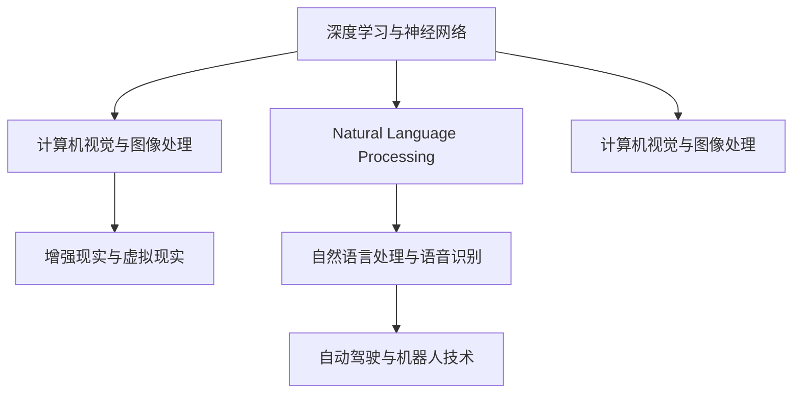

                 

# 李开复：苹果发布AI应用的科技价值

## 1. 背景介绍

李开复，作为计算机科学界的巨擘和人工智能领域的先驱，他在科技和人工智能领域有着广泛而深远的影响。随着科技的飞速发展和人工智能应用的不断普及，李开复一直在关注和思考如何利用人工智能技术推动社会进步和提升人类生活质量。

在苹果公司宣布推出一系列AI应用后，李开复对这一举措表示了极大的兴趣，并从科技和商业两个维度对其进行了深入分析，强调了这些AI应用的科技价值和未来发展潜力。本文将基于李开复的观点，深入探讨苹果AI应用的科技价值及其对社会和行业的深远影响。

## 2. 核心概念与联系

### 2.1 核心概念概述

苹果公司在人工智能领域的最新应用主要围绕以下几个核心概念展开：

- **深度学习与神经网络**：这是实现AI应用的基础技术，通过模拟人脑神经元的工作方式，使得机器能够处理复杂的模式识别、预测和分类任务。
- **计算机视觉与图像处理**：利用深度学习技术，苹果的AI应用能够自动识别和理解图像，进行图像分类、目标检测、物体跟踪等任务。
- **自然语言处理与语音识别**：通过分析语言和语音，这些应用可以理解、生成和翻译自然语言，实现语音助手的交互功能。
- **增强现实与虚拟现实**：利用计算机视觉和图像处理技术，增强现实和虚拟现实应用可以创造出沉浸式的交互体验。
- **自动驾驶与机器人技术**：利用深度学习、计算机视觉和传感器数据，自动驾驶车辆和机器人能够自主导航和决策，提高安全性和效率。

### 2.2 概念间的关系

这些核心概念之间的关系可以通过以下Mermaid流程图来展示：



这个流程图展示了深度学习与神经网络作为基础，通过计算机视觉与图像处理、自然语言处理与语音识别等技术，实现了增强现实与虚拟现实和自动驾驶与机器人技术等多个AI应用。

## 3. 核心算法原理 & 具体操作步骤

### 3.1 算法原理概述

苹果的AI应用主要基于深度学习技术，通过多层次神经网络模型进行训练和推理。这些模型的核心在于通过大量的标注数据进行自监督学习，学习到图像、文本、语音等数据的高级表示，进而能够进行图像分类、目标检测、文本生成、语音识别、机器翻译等任务。

苹果的AI应用通常包括以下几个关键步骤：

1. **数据准备**：收集并准备标注数据，用于训练深度学习模型。
2. **模型训练**：使用深度学习框架（如TensorFlow、PyTorch）训练神经网络模型。
3. **模型优化**：通过超参数调整、正则化技术等方法优化模型性能。
4. **模型评估**：在测试集上评估模型性能，调整模型参数和训练策略。
5. **模型部署**：将训练好的模型部署到实际应用中，进行推理和实时响应。

### 3.2 算法步骤详解

以计算机视觉中的目标检测为例，详细讲解了基于深度学习的目标检测流程：

1. **数据预处理**：将图像调整为统一尺寸，并进行归一化处理。
2. **模型训练**：使用随机梯度下降等优化算法，训练Faster R-CNN、YOLO等目标检测模型。
3. **模型评估**：在测试集上评估模型的mAP（平均精确率），调整模型参数。
4. **模型部署**：将训练好的模型部署到实际应用中，进行实时目标检测。

### 3.3 算法优缺点

苹果的AI应用具有以下优点：

- **精度高**：利用深度学习技术，可以处理复杂的模式识别任务，获得高精度的结果。
- **实时性**：利用GPU、TPU等高性能硬件，能够在低延迟下进行实时推理。
- **易用性**：通过良好的API设计，开发者可以快速集成AI功能，减少开发成本。

同时，这些应用也存在以下缺点：

- **数据依赖**：需要大量标注数据进行训练，数据获取成本高。
- **资源消耗大**：模型规模大，需要高性能硬件支持。
- **可解释性不足**：深度学习模型通常被称为“黑盒”，难以解释其内部工作机制。

### 3.4 算法应用领域

苹果的AI应用涵盖了计算机视觉、自然语言处理、增强现实、自动驾驶等多个领域。这些技术已经在智能手机、平板电脑、智能家居、自动驾驶汽车等多个产品中得到广泛应用，极大地提升了用户体验和产品的智能化水平。

## 4. 数学模型和公式 & 详细讲解

### 4.1 数学模型构建

苹果的AI应用通常基于深度学习模型，如卷积神经网络（CNN）、循环神经网络（RNN）、Transformer等。这些模型的数学模型可以表示为：

$$
f(x; \theta) = \mathbb{E}_{p(x|y)} [f(x; \theta)]
$$

其中，$x$ 表示输入数据，$\theta$ 表示模型参数，$f(x; \theta)$ 表示模型输出的预测值。

### 4.2 公式推导过程

以卷积神经网络为例，其公式推导过程如下：

$$
\begin{aligned}
\text{Convolutional Layer} &= \text{Convolution} + \text{Non-Linearity} + \text{Pooling} \\
&= (\text{Filter} * \text{Image}) + \text{ReLU} + \text{Pooling}
\end{aligned}
$$

其中，$\text{Filter}$ 表示卷积核，$\text{Image}$ 表示输入图像，$\text{ReLU}$ 表示非线性激活函数，$\text{Pooling}$ 表示池化操作。

### 4.3 案例分析与讲解

以苹果的Siri语音助手为例，其背后的自然语言处理模型包括：

1. **语音识别**：利用深度学习模型将语音转换为文本。
2. **语义理解**：通过自然语言处理模型理解用户的意图。
3. **自然语言生成**：利用生成模型生成自然语言回答。

## 5. 项目实践：代码实例和详细解释说明

### 5.1 开发环境搭建

在开始AI项目之前，需要搭建好开发环境。以深度学习模型为例，需要安装TensorFlow、PyTorch、Keras等深度学习框架，以及相应的GPU和TPU硬件。

### 5.2 源代码详细实现

以下是一个基于PyTorch实现的卷积神经网络代码示例：

```python
import torch
import torch.nn as nn
import torch.optim as optim

class ConvNet(nn.Module):
    def __init__(self):
        super(ConvNet, self).__init__()
        self.conv1 = nn.Conv2d(3, 64, kernel_size=3, stride=1, padding=1)
        self.pool1 = nn.MaxPool2d(kernel_size=2, stride=2)
        self.conv2 = nn.Conv2d(64, 128, kernel_size=3, stride=1, padding=1)
        self.pool2 = nn.MaxPool2d(kernel_size=2, stride=2)
        self.fc1 = nn.Linear(128 * 4 * 4, 1024)
        self.fc2 = nn.Linear(1024, 10)
        
    def forward(self, x):
        x = self.pool1(torch.relu(self.conv1(x)))
        x = self.pool2(torch.relu(self.conv2(x)))
        x = x.view(-1, 128 * 4 * 4)
        x = torch.relu(self.fc1(x))
        x = self.fc2(x)
        return x

model = ConvNet()
criterion = nn.CrossEntropyLoss()
optimizer = optim.Adam(model.parameters(), lr=0.001)

# 训练模型
for epoch in range(10):
    running_loss = 0.0
    for i, data in enumerate(train_loader, 0):
        inputs, labels = data
        optimizer.zero_grad()
        outputs = model(inputs)
        loss = criterion(outputs, labels)
        loss.backward()
        optimizer.step()
        running_loss += loss.item()
    print('Epoch %d loss: %.3f' % (epoch+1, running_loss/len(train_loader)))
```

### 5.3 代码解读与分析

这段代码实现了一个基本的卷积神经网络模型，包含两个卷积层、两个池化层和两个全连接层。在训练过程中，使用了Adam优化器和交叉熵损失函数。

## 6. 实际应用场景

苹果的AI应用在多个领域得到了广泛应用，以下列举了几个典型的应用场景：

### 6.1 智能手机

苹果的AI应用如Face ID、Siri等，已经在iPhone、iPad等设备上得到了广泛应用。这些应用不仅提升了用户体验，还增加了设备的安全性和智能化水平。

### 6.2 智能家居

苹果的AI技术如Smart HomeKit，通过语音识别和自然语言处理，实现了智能家居设备的互联互通，提高了家庭生活的便利性和舒适度。

### 6.3 自动驾驶

苹果的自动驾驶技术利用计算机视觉和深度学习技术，通过摄像头、雷达等传感器进行环境感知和决策，为未来的自动驾驶汽车提供了技术支持。

### 6.4 未来应用展望

未来，苹果的AI应用有望进一步扩展到更多领域，如医疗、教育、零售等。通过与苹果生态系统的深度整合，这些应用将能够提供更加个性化、高效的服务。

## 7. 工具和资源推荐

### 7.1 学习资源推荐

1. **深度学习课程**：如Coursera上的深度学习专项课程，由吴恩达等专家教授，深入浅出地讲解深度学习原理和应用。
2. **书籍推荐**：如《深度学习》（Ian Goodfellow）、《Python深度学习》（Francois Chollet）等书籍，提供了丰富的学习资源和实践案例。
3. **社区和论坛**：如Kaggle、Stack Overflow等社区，可以与全球开发者交流分享，获取最新技术动态。

### 7.2 开发工具推荐

1. **TensorFlow**：由Google开发的深度学习框架，支持大规模分布式训练。
2. **PyTorch**：由Facebook开发的深度学习框架，以其灵活的动态计算图和高效的GPU加速著称。
3. **Keras**：一个高层次的深度学习框架，易于上手和调试，适合初学者和快速原型开发。

### 7.3 相关论文推荐

1. **卷积神经网络**：LeCun等人的经典论文《Convolutional Neural Networks》。
2. **循环神经网络**：Hochreiter等人的经典论文《Long Short-Term Memory》。
3. **自然语言处理**：Devlin等人的经典论文《BERT: Pre-training of Deep Bidirectional Transformers for Language Understanding》。

## 8. 总结：未来发展趋势与挑战

### 8.1 研究成果总结

苹果的AI应用通过深度学习技术和先进硬件的支持，已经在多个领域取得了显著的进展。这些应用不仅提升了用户体验，还推动了技术进步和产业发展。

### 8.2 未来发展趋势

未来，苹果的AI应用有望在以下几个方面继续发展：

1. **模型复杂度提升**：随着计算能力的提升，模型的复杂度和深度将不断增加，能够处理更复杂的任务。
2. **多模态融合**：通过结合视觉、听觉、触觉等多种模态信息，提升AI应用的智能化水平。
3. **跨领域应用拓展**：AI应用将从消费电子设备扩展到医疗、教育、金融等领域，推动各行业的数字化转型。

### 8.3 面临的挑战

尽管苹果的AI应用取得了显著的进展，但在实际应用中也面临以下挑战：

1. **数据隐私保护**：如何在提升性能的同时，保护用户隐私，避免数据滥用。
2. **伦理和道德问题**：AI应用是否会带来偏见、歧视等伦理问题，需要制定相关法规和标准。
3. **硬件资源限制**：如何在有限的硬件资源下，提升AI应用的性能和效率。
4. **可解释性和可控性**：如何增强AI应用的可解释性，确保其决策过程透明可控。

### 8.4 研究展望

未来的研究需要关注以下几个方向：

1. **模型压缩与优化**：通过剪枝、量化等技术，减小模型尺寸，提升计算效率。
2. **跨模态学习**：通过多模态数据融合，提升AI应用的泛化能力和智能水平。
3. **伦理和法规研究**：制定相关标准和法规，确保AI应用的公平、透明和可控。
4. **人类与AI的协作**：探索人机协同的智能化路径，提升人类对AI技术的理解和应用能力。

## 9. 附录：常见问题与解答

**Q1: 苹果的AI应用是如何实现的？**

A: 苹果的AI应用主要基于深度学习技术，利用卷积神经网络、循环神经网络等模型，通过大量的标注数据进行训练和推理。这些模型通过GPU、TPU等高性能硬件进行加速，能够在低延迟下进行实时处理。

**Q2: 苹果的AI应用有哪些典型的应用场景？**

A: 苹果的AI应用在智能手机、智能家居、自动驾驶等多个领域得到了广泛应用。例如，Face ID利用深度学习技术进行人脸识别，Siri通过自然语言处理实现语音助手功能，Smart HomeKit通过语音识别和自然语言处理实现智能家居设备的互联互通。

**Q3: 苹果的AI应用面临哪些挑战？**

A: 苹果的AI应用面临数据隐私保护、伦理和道德问题、硬件资源限制、可解释性和可控性等挑战。如何在提升性能的同时，保护用户隐私、避免数据滥用、增强AI应用的可解释性和可控性，是未来需要解决的重要问题。

**Q4: 苹果的AI应用未来发展趋势是什么？**

A: 苹果的AI应用未来有望在模型复杂度提升、多模态融合、跨领域应用拓展等方面继续发展。通过不断优化模型和算法，提升AI应用的智能化水平，推动各行业的数字化转型。同时，制定相关标准和法规，确保AI应用的公平、透明和可控，也是未来的研究方向之一。

---

作者：禅与计算机程序设计艺术 / Zen and the Art of Computer Programming

