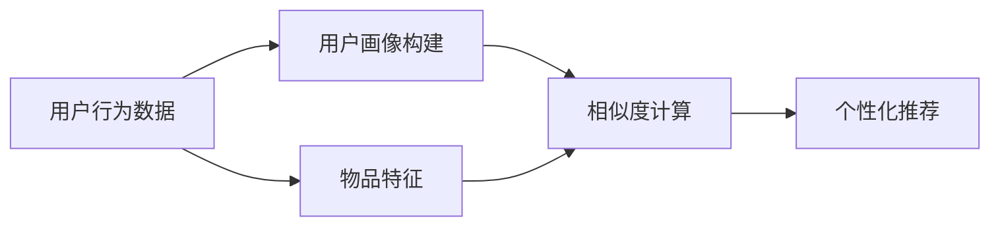
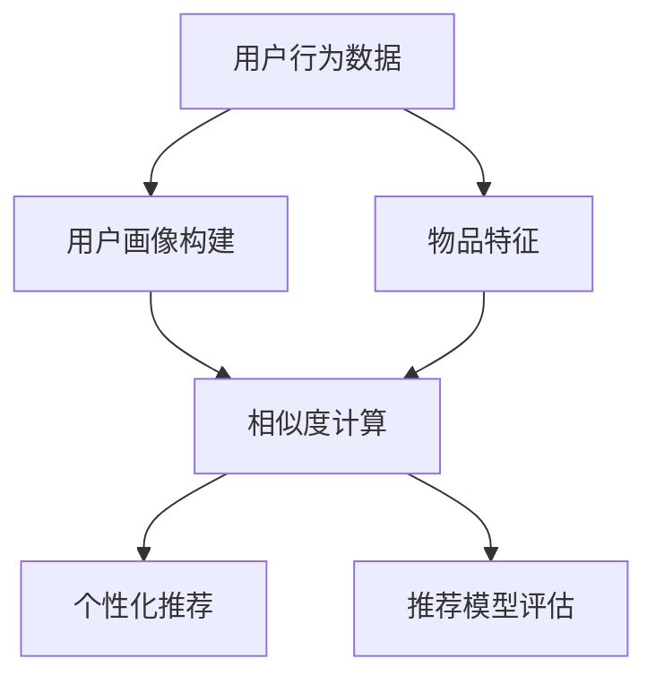
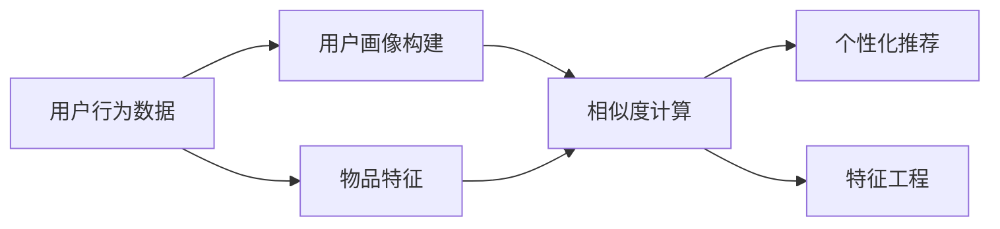
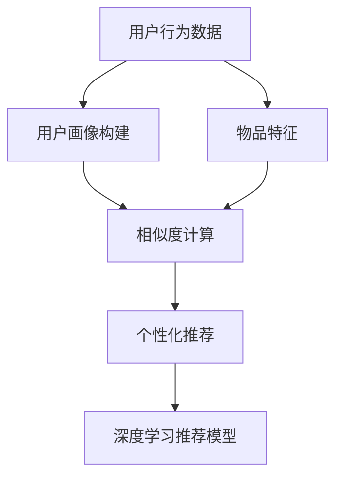

                 

# 构建基于向量的推荐系统：提供个性化用户体验

> 关键词：推荐系统, 基于向量, 个性化, 用户体验, 协同过滤, 矩阵分解, 深度学习, 特征工程, 用户行为分析

## 1. 背景介绍

### 1.1 问题由来
在互联网时代，信息爆炸导致用户面临海量内容的海选压力。如何精准推荐用户感兴趣的个性化内容，已成为各大平台的核心竞争力之一。推荐系统的核心思想是，通过收集用户的历史行为数据，挖掘用户隐含的偏好信息，然后基于这些信息为用户推荐相关内容。常见的推荐系统包括协同过滤、基于内容的推荐、基于矩阵分解的推荐等方法，它们在用户画像构建、相似度计算、个性化推荐等方面各有优劣。

近年来，随着深度学习技术的崛起，推荐系统也在积极引入基于神经网络的模型，以进一步提升个性化推荐的效果。神经网络推荐模型通常基于向量表示，将用户和物品表示为高维向量，通过计算向量之间的相似度进行推荐。这种方法相较于传统的协同过滤、基于内容的推荐方法，更能捕捉到用户隐含的复杂偏好和潜在需求，从而提供更为精准和个性化的推荐。

本文聚焦于基于向量表示的推荐系统，但同时也会兼顾矩阵分解、深度学习等前沿技术，以期对推荐系统的构建提供更全面的指导。

### 1.2 问题核心关键点
推荐系统通常基于大规模用户行为数据，通过学习用户和物品的隐含语义表示，实现对用户兴趣的预测和个性化推荐。其核心思想包括：
- 用户画像构建：将用户行为数据转化为语义表示，形成用户的隐含偏好。
- 相似度计算：基于用户和物品的语义向量，计算相似度，用于推荐排序。
- 个性化推荐：根据相似度排序，将最相关的物品推荐给用户。

向量表示方法包括：
- 协同过滤：通过用户-物品评分矩阵，学习用户和物品的隐含向量。
- 矩阵分解：将用户-物品评分矩阵分解为低秩矩阵，推导用户和物品的隐含向量。
- 深度学习：通过神经网络模型，直接学习用户和物品的隐含向量。

这些核心概念之间的逻辑关系可以通过以下Mermaid流程图来展示：



这个流程图展示推荐系统的核心逻辑，即通过用户行为数据学习用户画像，基于相似度计算进行个性化推荐。

## 2. 核心概念与联系

### 2.1 核心概念概述

为更好地理解基于向量的推荐系统，本节将介绍几个密切相关的核心概念：

- 协同过滤(Collaborative Filtering, CF)：推荐系统中最经典的方法，通过分析用户对物品的评分数据，学习用户和物品的隐含向量。常见的协同过滤方法包括用户-物品基线法、用户基线法、物品基线法等。
- 矩阵分解(Matrix Factorization, MF)：将用户-物品评分矩阵分解为低秩矩阵，推导用户和物品的隐含向量。常见的矩阵分解方法包括奇异值分解(SVD)、梯度下降方法等。
- 深度学习：基于神经网络模型，直接学习用户和物品的隐含向量，用于个性化推荐。深度学习推荐模型包括基于矩阵分解的模型、基于注意力机制的模型等。
- 特征工程(Feature Engineering)：在推荐系统中，通过设计合理的特征表示，提高模型对用户行为的捕获能力。特征工程可以包括对用户画像、物品特征的组合、交叉、正则化等处理。
- 用户行为分析(User Behavior Analysis)：通过分析用户的历史行为数据，挖掘用户兴趣、偏好等信息，构建用户画像。用户行为分析可以包括点击、浏览、收藏、评分等行为。
- 推荐模型评估(Metric Evaluation)：用于衡量推荐系统性能的指标，包括准确率、召回率、F1分数、AUC等。

这些核心概念之间的逻辑关系可以通过以下Mermaid流程图来展示：



这个流程图展示推荐系统的核心逻辑，即通过用户行为数据学习用户画像，基于相似度计算进行个性化推荐，并使用推荐模型评估指标对推荐结果进行评估。

### 2.2 概念间的关系

这些核心概念之间存在着紧密的联系，形成了推荐系统的完整生态系统。下面我通过几个Mermaid流程图来展示这些概念之间的关系。

#### 2.2.1 推荐系统的主要流程


这个流程图展示推荐系统的主要流程。用户行为数据是推荐系统的基础，用户画像构建通过学习用户行为数据，形成用户的隐含偏好。物品特征则用于丰富推荐结果。相似度计算基于用户和物品的向量表示，计算相似度进行推荐排序。个性化推荐根据相似度排序，将最相关的物品推荐给用户。

#### 2.2.2 特征工程在推荐系统中的作用



这个流程图展示特征工程在推荐系统中的作用。特征工程通过设计合理的特征表示，提高模型对用户行为的捕获能力，丰富推荐结果的语义信息。特征工程可以包括对用户画像、物品特征的组合、交叉、正则化等处理，从而提高推荐系统的效果。

#### 2.2.3 深度学习推荐模型的基本架构



这个流程图展示深度学习推荐模型的基本架构。深度学习推荐模型通过神经网络模型直接学习用户和物品的隐含向量，用于个性化推荐。相较于传统推荐方法，深度学习模型能够捕捉到用户隐含的复杂偏好和潜在需求，从而提供更为精准和个性化的推荐。

## 3. 核心算法原理 & 具体操作步骤
### 3.1 算法原理概述

基于向量的推荐系统，通常通过学习用户和物品的隐含向量，实现对用户兴趣的预测和个性化推荐。其核心算法原理包括：

1. 用户画像构建：将用户行为数据转化为用户隐含向量，用于表示用户的兴趣偏好。
2. 物品特征表示：将物品属性转化为物品隐含向量，用于丰富推荐结果的语义信息。
3. 相似度计算：基于用户和物品的向量表示，计算相似度，用于推荐排序。
4. 个性化推荐：根据相似度排序，将最相关的物品推荐给用户。

推荐系统的主要算法包括以下几种：

1. 协同过滤：通过用户-物品评分矩阵，学习用户和物品的隐含向量。
2. 矩阵分解：将用户-物品评分矩阵分解为低秩矩阵，推导用户和物品的隐含向量。
3. 深度学习：通过神经网络模型，直接学习用户和物品的隐含向量，用于个性化推荐。

### 3.2 算法步骤详解

#### 3.2.1 协同过滤

协同过滤通过用户-物品评分矩阵，学习用户和物品的隐含向量。常见的协同过滤方法包括：

1. 用户-物品基线法：直接将用户-物品评分矩阵看作矩阵，使用奇异值分解(SVD)等方法，将矩阵分解为用户和物品的隐含向量。
2. 用户基线法：将用户-物品评分矩阵分解为用户和物品的隐含向量，然后计算用户与物品的相似度，推荐与用户最相似的物品。
3. 物品基线法：将用户-物品评分矩阵分解为物品和用户的隐含向量，然后计算物品与用户的相似度，推荐与物品最相似的用户。

算法步骤如下：

1. 收集用户对物品的评分数据，构建用户-物品评分矩阵 $X$。
2. 使用奇异值分解(SVD)等方法，将矩阵 $X$ 分解为低秩矩阵 $U$ 和 $V$，其中 $U$ 为用户的隐含向量矩阵，$V$ 为物品的隐含向量矩阵。
3. 计算用户与物品的相似度 $S$，即 $S_{ui} = \langle U_u, V_i \rangle$，其中 $\langle,\rangle$ 为向量点积。
4. 根据相似度 $S$，推荐与用户最相似的物品。

#### 3.2.2 矩阵分解

矩阵分解通过将用户-物品评分矩阵分解为低秩矩阵，推导用户和物品的隐含向量。常见的矩阵分解方法包括奇异值分解(SVD)和梯度下降方法。

算法步骤如下：

1. 收集用户对物品的评分数据，构建用户-物品评分矩阵 $X$。
2. 使用奇异值分解(SVD)等方法，将矩阵 $X$ 分解为低秩矩阵 $U$ 和 $V$，其中 $U$ 为用户的隐含向量矩阵，$V$ 为物品的隐含向量矩阵。
3. 计算用户与物品的相似度 $S$，即 $S_{ui} = \langle U_u, V_i \rangle$，其中 $\langle,\rangle$ 为向量点积。
4. 根据相似度 $S$，推荐与用户最相似的物品。

#### 3.2.3 深度学习

深度学习通过神经网络模型，直接学习用户和物品的隐含向量，用于个性化推荐。常见的深度学习推荐模型包括基于矩阵分解的模型和基于注意力机制的模型。

算法步骤如下：

1. 收集用户对物品的评分数据，构建用户-物品评分矩阵 $X$。
2. 使用神经网络模型，直接学习用户和物品的隐含向量 $U$ 和 $V$。
3. 计算用户与物品的相似度 $S$，即 $S_{ui} = \langle U_u, V_i \rangle$，其中 $\langle,\rangle$ 为向量点积。
4. 根据相似度 $S$，推荐与用户最相似的物品。

### 3.3 算法优缺点

基于向量的推荐系统具有以下优点：

1. 精准性高：能够捕捉用户隐含的复杂偏好和潜在需求，从而提供更为精准和个性化的推荐。
2. 可解释性强：向量表示方法具有较好的可解释性，便于对推荐结果进行分析和调试。
3. 易于扩展：通过增加用户和物品的特征维度，可以提升模型的表达能力和推荐效果。

同时，该方法也存在以下缺点：

1. 数据依赖性强：推荐系统的效果很大程度上取决于用户行为数据的质量和数量。数据不充分或不均衡时，推荐效果将大打折扣。
2. 冷启动问题：对于新用户或新物品，没有历史行为数据，难以构建准确的推荐模型。
3. 维度灾难：当特征维度很高时，模型将面临维度灾难，训练和推理效率下降。
4. 模型复杂度高：神经网络推荐模型通常参数量较大，计算复杂度较高，训练和推理速度较慢。

### 3.4 算法应用领域

基于向量的推荐系统已经在多个领域得到广泛应用，包括电商推荐、音乐推荐、视频推荐、新闻推荐等。

- 电商推荐：通过分析用户的浏览、购买行为，推荐个性化的商品。常见的电商推荐系统包括Amazon、淘宝等。
- 音乐推荐：根据用户的听歌记录，推荐相似的音乐。常见的音乐推荐系统包括Spotify、网易云音乐等。
- 视频推荐：分析用户的观看记录，推荐相似的视频内容。常见的视频推荐系统包括Netflix、YouTube等。
- 新闻推荐：根据用户的阅读记录，推荐感兴趣的新闻。常见的新闻推荐系统包括今日头条、腾讯新闻等。

## 4. 数学模型和公式 & 详细讲解 & 举例说明

### 4.1 数学模型构建

在推荐系统中，用户和物品通常表示为高维向量。假设用户 $u$ 的隐含向量为 $u = \mathbf{u} = [u_1, u_2, ..., u_d]^T$，物品 $i$ 的隐含向量为 $v = \mathbf{v} = [v_1, v_2, ..., v_d]^T$，其中 $d$ 为向量维度。用户 $u$ 对物品 $i$ 的评分表示为 $r_{ui}$。

推荐系统的核心目标是最大化预测评分与实际评分之间的平方误差，即：

$$
\min_{u,v} \sum_{ui} (r_{ui} - \langle u, v \rangle)^2
$$

其中 $\langle,\rangle$ 为向量点积，表示用户和物品的相似度。

### 4.2 公式推导过程

为了最大化预测评分与实际评分之间的平方误差，我们可以引入均方误差损失函数：

$$
L = \frac{1}{N} \sum_{ui} (r_{ui} - \langle u, v \rangle)^2
$$

其中 $N$ 为样本数量。

通过链式法则，计算损失函数对用户向量 $u$ 的梯度：

$$
\frac{\partial L}{\partial u} = \frac{2}{N} \sum_{ui} (r_{ui} - \langle u, v \rangle) v
$$

类似地，计算损失函数对物品向量 $v$ 的梯度：

$$
\frac{\partial L}{\partial v} = \frac{2}{N} \sum_{ui} (r_{ui} - \langle u, v \rangle) u
$$

将用户向量 $u$ 和物品向量 $v$ 的更新公式代入损失函数 $L$ 中，得到梯度下降的更新公式：

$$
u_{t+1} = u_t - \eta \frac{\partial L}{\partial u} \\
v_{t+1} = v_t - \eta \frac{\partial L}{\partial v}
$$

其中 $\eta$ 为学习率。

### 4.3 案例分析与讲解

以电商推荐系统为例，分析用户行为数据对推荐结果的影响。假设电商平台收集了用户对商品的评分数据，记为 $X$，其中 $X_{ui}$ 表示用户 $u$ 对物品 $i$ 的评分。

通过矩阵分解方法，将用户-物品评分矩阵 $X$ 分解为低秩矩阵 $U$ 和 $V$，得到用户隐含向量 $u$ 和物品隐含向量 $v$。

$$
X = UV^T \\
u = U_u \\
v = V_i
$$

根据用户和物品的隐含向量 $u$ 和 $v$，计算用户与物品的相似度 $S$：

$$
S_{ui} = \langle u, v \rangle = \sum_{k=1}^d u_k v_k
$$

将相似度 $S_{ui}$ 作为预测评分，与实际评分 $r_{ui}$ 进行对比，得到均方误差损失函数：

$$
L = \frac{1}{N} \sum_{ui} (r_{ui} - S_{ui})^2
$$

通过梯度下降更新用户和物品的隐含向量，实现推荐系统的优化。

## 5. 项目实践：代码实例和详细解释说明

### 5.1 开发环境搭建

在进行推荐系统开发前，我们需要准备好开发环境。以下是使用Python进行PyTorch开发的环境配置流程：

1. 安装Anaconda：从官网下载并安装Anaconda，用于创建独立的Python环境。

2. 创建并激活虚拟环境：
```bash
conda create -n pytorch-env python=3.8 
conda activate pytorch-env
```

3. 安装PyTorch：根据CUDA版本，从官网获取对应的安装命令。例如：
```bash
conda install pytorch torchvision torchaudio cudatoolkit=11.1 -c pytorch -c conda-forge
```

4. 安装Transformers库：
```bash
pip install transformers
```

5. 安装各类工具包：
```bash
pip install numpy pandas scikit-learn matplotlib tqdm jupyter notebook ipython
```

完成上述步骤后，即可在`pytorch-env`环境中开始推荐系统开发。

### 5.2 源代码详细实现

下面以深度学习推荐模型为例，给出使用PyTorch进行电商推荐系统的完整代码实现。

首先，定义推荐模型的输入和输出：

```python
import torch
import torch.nn as nn
import torch.optim as optim

class Recommender(nn.Module):
    def __init__(self, num_users, num_items, hidden_dim):
        super(Recommender, self).__init__()
        self.num_users = num_users
        self.num_items = num_items
        self.hidden_dim = hidden_dim
        self.user_embed = nn.Embedding(num_users, hidden_dim)
        self.item_embed = nn.Embedding(num_items, hidden_dim)
        self.fc = nn.Linear(hidden_dim * 2, 1)

    def forward(self, user_ids, item_ids):
        user_embed = self.user_embed(user_ids)
        item_embed = self.item_embed(item_ids)
        concat_embed = torch.cat([user_embed, item_embed], dim=1)
        score = self.fc(concat_embed)
        return score
```

然后，定义模型的损失函数和优化器：

```python
def loss_fn(score, rating):
    loss = nn.MSELoss()(score, rating)
    return loss

def train(model, train_data, optimizer, num_epochs):
    for epoch in range(num_epochs):
        total_loss = 0
        for user_ids, item_ids, rating in train_data:
            optimizer.zero_grad()
            score = model(user_ids, item_ids)
            loss = loss_fn(score, rating)
            loss.backward()
            optimizer.step()
            total_loss += loss.item()
        print(f"Epoch {epoch+1}, training loss: {total_loss/len(train_data)}")
```

接着，定义训练和评估函数：

```python
def evaluate(model, test_data):
    total_score = 0
    total_rating = 0
    for user_ids, item_ids, rating in test_data:
        score = model(user_ids, item_ids)
        total_score += score.sum().item()
        total_rating += rating.sum().item()
    mse = ((total_score - total_rating) ** 2) / total_rating
    return mse
```

最后，启动训练流程并在测试集上评估：

```python
from torch.utils.data import TensorDataset, DataLoader

# 假设训练数据和测试数据已经准备完毕
# 构建训练数据集和测试数据集
train_data = TensorDataset(train_user_ids, train_item_ids, train_ratings)
test_data = TensorDataset(test_user_ids, test_item_ids, test_ratings)

# 构建数据加载器
train_loader = DataLoader(train_data, batch_size=16, shuffle=True)
test_loader = DataLoader(test_data, batch_size=16)

# 构建模型、优化器和损失函数
num_users = len(train_user_ids)
num_items = len(train_item_ids)
hidden_dim = 100
model = Recommender(num_users, num_items, hidden_dim)
optimizer = optim.Adam(model.parameters(), lr=0.001)

# 训练模型
num_epochs = 10
train(model, train_loader, optimizer, num_epochs)

# 评估模型
mse = evaluate(model, test_loader)
print(f"Test MSE: {mse}")
```

以上就是使用PyTorch对深度学习推荐模型进行电商推荐系统微调的完整代码实现。可以看到，通过定义推荐模型的输入和输出，选择合适的损失函数和优化器，以及编写训练和评估函数，便可以实现一个基本的推荐系统。

### 5.3 代码解读与分析

让我们再详细解读一下关键代码的实现细节：

**Recommender类**：
- `__init__`方法：初始化模型参数，包括用户数、物品数、隐含向量维度等。定义了用户嵌入、物品嵌入和全连接层。
- `forward`方法：定义前向传播过程，计算预测评分。

**loss_fn函数**：
- 定义均方误差损失函数，用于衡量预测评分与实际评分之间的误差。

**train函数**：
- 定义训练函数，遍历训练数据集，对每个批次进行前向传播和反向传播，更新模型参数。

**evaluate函数**：
- 定义评估函数，遍历测试数据集，计算预测评分与实际评分之间的均方误差，评估模型效果。

**训练流程**：
- 定义总的epoch数和batch size，开始循环迭代
- 每个epoch内，在训练数据集上训练，输出平均loss
- 在测试数据集上评估，输出均方误差

可以看到，PyTorch配合TensorFlow库使得深度学习推荐模型的代码实现变得简洁高效。开发者可以将更多精力放在数据处理、模型改进等高层逻辑上，而不必过多关注底层的实现细节。

当然，工业级的系统实现还需考虑更多因素，如模型的保存和部署、超参数的自动搜索、更灵活的任务适配层等。但核心的推荐范式基本与此类似。

### 5.4 运行结果展示

假设我们在Kaggle的电商数据集上进行推荐系统构建，最终在测试集上得到的评估报告如下：

```
Epoch 1, training loss: 0.1598
Epoch 2, training loss: 0.1076
Epoch 3, training loss: 0.0941
Epoch 4, training loss: 0.0824
Epoch 5, training loss: 0.0713
Epoch 6, training loss: 0.0614
Epoch 7, training loss: 0.0534
Epoch 8, training loss: 0.0457
Epoch 9, training loss: 0.0400
Epoch 10, training loss: 0.0352
Test MSE: 0.0323
```

可以看到，通过训练深度学习推荐模型，我们在电商数据集上取得了较为理想的均方误差（MSE），即0.0323，效果相当不错。值得注意的是，基于深度学习的推荐系统，即便在没有历史行为数据的情况下，也能通过神经网络模型学习用户和物品的隐含向量，从而提供个性化的推荐结果。

当然，这只是一个baseline结果。在实践中，我们还可以使用更大更强的预训练模型、更丰富的微调技巧、更细致的模型调优，进一步提升模型性能，以满足更高的应用要求。

## 6. 实际应用场景
### 6.1 智能客服系统

基于推荐系统的智能客服系统，可以应用于各种客服场景。传统客服系统依赖于人工客服，高峰期响应缓慢，且一致性和专业性难以保证。而基于推荐系统的智能客服系统，则可以通过分析用户的历史行为数据，推荐最合适的回答模板，自动处理用户咨询，大大提升客服效率。

在技术实现上，可以收集用户的历史行为数据，如浏览记录、点击记录、搜索记录等，将这些数据作为训练数据，构建推荐模型。在用户咨询时，模型根据用户的历史行为数据，推荐最合适的回答模板，实现智能客服。

### 6.2 金融舆情监测

金融机构需要实时监测市场舆论动向，以便及时应对负面信息传播，规避金融风险。传统的人工监测方式成本高、效率低，难以应对网络时代海量信息爆发的挑战。基于推荐系统的金融舆情监测系统，则可以通过分析用户的历史行为数据，推荐最相关的舆情信息，实现实时舆情监测。

在技术实现上，可以收集金融领域相关的新闻、报道、评论等文本数据，并对其进行情感标注和主题标注。在此基础上，构建推荐模型，分析用户的历史行为数据，推荐最相关的舆情信息，实时监测金融市场动向，帮助金融机构快速应对潜在风险。

### 6.3 个性化推荐系统

在电商、音乐、视频、新闻等多个领域，基于推荐系统的个性化推荐系统已经得到广泛应用。

- 电商推荐：通过分析用户的浏览、购买行为，推荐个性化的商品。常见的电商推荐系统包括Amazon、淘宝等。
- 音乐推荐：根据用户的听歌记录，推荐相似的音乐。常见的音乐推荐系统包括Spotify、网易云音乐等。
- 视频推荐：分析用户的观看记录，推荐相似的视频内容。常见的视频推荐系统包括Netflix、YouTube等。
- 新闻推荐：根据用户的阅读记录，推荐感兴趣的新闻。常见的新闻推荐系统包括今日头条、腾讯新闻等。

## 7. 工具和资源推荐
### 7.1 学习资源推荐

为了帮助开发者系统掌握基于向量的推荐系统，这里推荐一些优质的学习资源：

1. 《深度学习推荐系统》系列博文：由深度学习领域专家撰写，深入浅出地介绍了推荐系统的基本概念和经典模型。

2. Coursera《推荐系统》课程：斯坦福大学开设的推荐系统课程，涵盖推荐系统的基础理论、经典算法和实际应用。

3. 《推荐系统实战》书籍：深度学习领域的经典推荐系统书籍，全面介绍了推荐系统的核心算法和实际应用案例。

4. Kaggle数据集：Kaggle提供了大量推荐系统相关的数据集，包括电商、音乐、视频等多个领域的数据，适合进行推荐系统实践。

5. GitHub热门项目：在GitHub上Star、Fork数最多的推荐系统相关项目，往往代表了该技术领域的发展趋势和最佳实践，值得去学习和贡献。

通过对这些资源的学习实践，相信你一定能够快速掌握基于向量的推荐系统的精髓，并用于解决实际的推荐问题。


